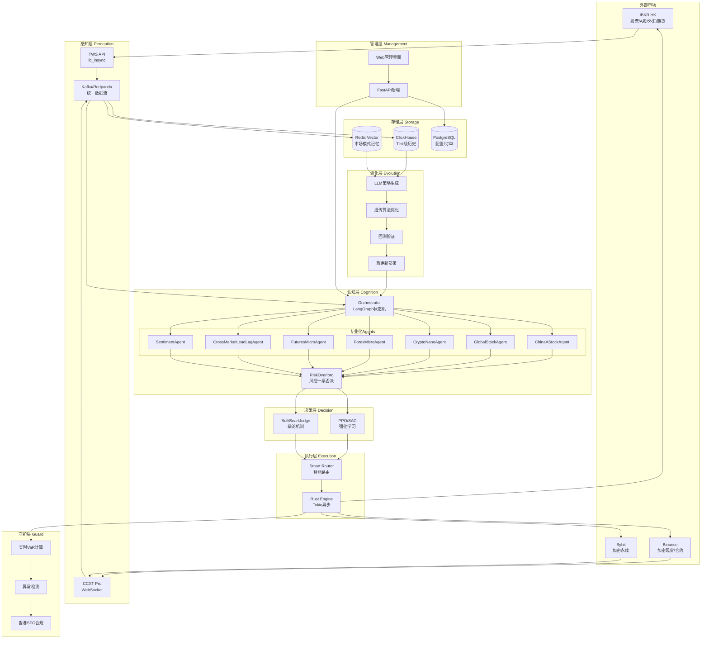
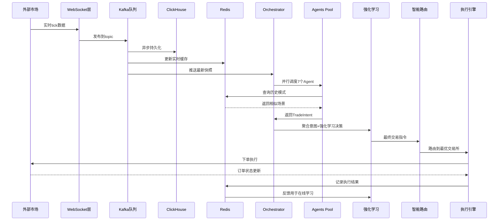

## 用户需求

### 产品概述

将现有的合约交易系统升级为 AetherLife 全市场版（香港用户优化版），这是一个支持多市场交易的AI驱动自主交易系统，具备自我进化能力。系统将整合加密货币、中国A股、港股、美股、外汇、期货等多个市场，采用多智能体协作决策架构，实现跨市场套利和自动化资金管理。

### 核心功能

#### 多市场交易覆盖

- 加密货币：Binance/Bybit 永续合约和现货（优先级最高）
- 中国A股：通过 IBKR Stock Connect 北向交易沪深股票
- 港股：IBKR 直接交易
- 美股/国际股票：IBKR fractional shares，覆盖 170+ 市场
- 外汇：IBKR spot FX 全币种
- 期货：Micro E-mini (ES/NQ)、nano BTC/ETH、全球商品期货

#### 多智能体决策系统

- Orchestrator 编排器：基于 LangGraph 的状态机调度
- 7个专业化 Agent：ChinaAStockAgent（A股专家）、GlobalStockAgent（美股专家）、CryptoNanoAgent（加密货币专家）、ForexMicroAgent（外汇专家）、FuturesMicroAgent（期货专家）、CrossMarketLeadLagAgent（跨市场套利专家）、RiskOverlord（风控一票否决）
- 多Agent辩论机制：Bull/Bear/Judge 三方辩论模式
- 情绪分析Agent：实时解析新闻、X/Twitter、微信、雪球情绪

#### WebSocket 实时数据流

- 多交易所 WebSocket 实时订阅：Binance、Bybit、OKX tick级行情和订单簿
- IBKR TWS API 实时数据：股票、期货、外汇实时报价
- 统一数据流处理：Kafka/Redpanda 消息队列
- Tick级历史数据存储：ClickHouse 时序数据库

#### 跨市场套利

- Lead-Lag 效应捕捉：BTC 先动 → A股/港股/美股跟随
- 统计套利：相关品种配对交易
- 三角套利：跨交易所价差
- ETF vs 成分股套利
- 智能路由：自动选择最优交易所和订单类型

#### 强化学习决策层

- PPO/SAC 算法：奖励函数包含夏普比率、滑点、合规惩罚
- 在线学习：根据实时交易结果持续优化
- Stock Connect 滑点特殊处理：额度高峰避让

#### 自我进化系统

- 每晚自动进化：香港时间 02:00 触发
- 遗传算法 + LLM 协同：自动生成新策略代码
- 策略热更新：Docker + Kubernetes 无缝部署
- 策略回测验证：自动在历史数据上验证新策略
- 策略版本管理：Git自动提交策略变更

#### 香港合规与风控

- 香港SFC合规模块：自动报送交易记录
- 实时VaR计算：Monte Carlo + Neural SDE
- 异常检测：Isolation Forest + AutoEncoder 识别市场regime切换
- Stock Connect 特殊风控：北向额度监控、交易时段限制
- 税费优化：自动计算香港利得税和中国印花税

#### 智能资金管理

- 1000 USD 起步优化：单笔风险 ≤ 0.5%
- 动态仓位分配：35% 加密、25% A股+港股、20% 美股、10% 外汇、10% 期货
- 自动再平衡：每日根据市场波动和PnL调整配比
- 止损止盈自动化：每日最大回撤 2% 触发全平仓
- 自动复利管理：利润自动复投

## 技术栈选型

### 核心技术栈

- **研究开发层**：Python 3.12 + Polars（高性能数据处理）+ JAX（GPU加速）+ PyTorch 2.5（强化学习）+ LangGraph（多Agent编排）+ LangChain/LlamaIndex（LLM集成）
- **生产执行层**：Rust（Tokio异步）+ PyO3（Python/Rust互操作）+ CCXT Rust（加密货币交易）
- **数据存储层**：ClickHouse（时序数据）+ Redis（向量记忆 + 缓存）+ PostgreSQL（关系数据）
- **流处理层**：Kafka/Redpanda（消息队列）+ Apache Flink（实时计算）
- **交易接口层**：ib_insync（IBKR TWS API）+ CCXT Pro（加密货币WebSocket）
- **AI模型层**：本地部署 Llama-3.1-405B（微调）或 DeepSeek-V2（开源MoE）
- **容器编排**：Docker + Kubernetes（AWS/阿里云香港区）
- **监控告警**：Prometheus + Grafana + eBPF（内核级性能监控）

### 新增依赖包

- ib_insync：IBKR TWS API客户端
- ccxt：统一加密货币交易所接口
- langgraph：多Agent状态机编排
- langchain：LLM集成框架
- polars：高性能DataFrame
- gymnasium：强化学习环境
- stable-baselines3：PPO/SAC算法实现
- clickhouse-driver：ClickHouse客户端
- redis[hiredis]：Redis客户端
- kafka-python：Kafka客户端
- pytorch：深度学习框架
- sentence-transformers：文本向量化
- fastapi：异步API框架（替换现有的admin_backend）

## 实现方案

### 整体策略

采用分阶段、模块化的方式进行升级，确保每个阶段都能独立运行和验证。基于现有的 `aetherlife/` 目录雏形进行扩展，保留现有的后台管理系统，逐步替换 `trading_bot.py` 的单体架构为分层多Agent架构。

**阶段1（Week 1-2）**：完善数据感知层和记忆层

- 整合 IBKR TWS API 数据源
- 实现 Kafka/Redpanda 统一数据流
- 部署 ClickHouse 存储tick级历史数据
- 升级 Redis 为向量存储（记住跨市场模式）

**阶段2（Week 3-4）**：完善认知层多Agent系统

- 基于 LangGraph 实现 Orchestrator 状态机
- 实现7个专业化Agent（ChinaAStockAgent、GlobalStockAgent、CryptoNanoAgent等）
- 集成情绪分析Agent（新闻、社交媒体）
- 实现Bull/Bear/Judge辩论机制

**阶段3（Week 5-6）**：强化学习决策层

- 实现 PPO/SAC 强化学习算法
- 构建训练环境（基于历史数据回放）
- 在线学习与离线训练结合
- 奖励函数优化（包含滑点、合规惩罚）

**阶段4（Week 7-8）**：执行层与智能路由

- Rust执行引擎开发（低延迟下单）
- 智能路由实现（自动选择交易所）
- 订单类型优化（FOK/IOC/Post-Only）
- 滑点控制与部分成交处理

**阶段5（Week 9-10）**：自我进化系统

- LLM驱动的策略生成器
- 遗传算法策略优化
- 策略回测框架
- 热更新机制（Docker + K8s）

**阶段6（Week 11-12）**：合规、监控与优化

- 香港SFC合规模块
- 实时VaR与异常检测
- 全链路监控（Prometheus + Grafana）
- 性能优化与压力测试

### 关键技术决策

#### 为什么选择 LangGraph 而不是 CrewAI

- LangGraph 提供更灵活的状态机编排，适合复杂的多Agent协作流程
- 支持循环、条件分支、并行执行等高级控制流
- 与 LangChain 生态深度集成，便于接入各类LLM
- 更适合金融场景的确定性执行路径

#### 为什么选择 Polars 而不是 Pandas

- Polars 基于 Rust 开发，性能比 Pandas 快5-10倍
- 原生支持多线程并行计算
- 内存占用更低
- 对于tick级数据处理更高效

#### 为什么选择 ClickHouse 而不是 TimescaleDB

- ClickHouse 专为OLAP设计，查询速度比TimescaleDB快10-100倍
- 原生支持时序数据压缩，节省50-90%存储空间
- 分布式架构更易扩展
- 开源社区活跃，文档完善

#### 为什么保留 Python + 增加 Rust

- Python 用于研究、策略开发、AI模型推理（快速迭代）
- Rust 用于生产执行、订单路由（极致性能）
- PyO3 实现Python/Rust互操作，兼顾开发效率和运行性能
- 关键路径用Rust重写，非关键路径保留Python

### 实现细节

#### 感知层实现

1. **IBKR数据接入**

- 使用 ib_insync 连接 TWS/Gateway
- 订阅多品种实时数据（股票、期货、外汇）
- 处理 Stock Connect 特殊数据格式
- 实现断线重连和心跳机制

2. **加密货币数据接入**

- CCXT Pro WebSocket 订阅 Binance/Bybit
- 支持 tick、orderbook、trades 多种数据流
- 实现数据去重和时序对齐

3. **统一数据流**

- Kafka/Redpanda 作为中间层
- 标准化数据格式（Protobuf或Avro）
- Topic划分：market_data_tick、market_data_orderbook、market_data_trades
- 实现数据分发和回放功能

#### 记忆层实现

1. **Redis向量存储**

- 使用 RedisSearch + RediSearch Vector 模块
- 存储市场模式向量（例如："BTC涨5% → A股科技股跟涨"）
- 相似度搜索：快速找到历史相似场景
- TTL管理：自动清理过期模式

2. **ClickHouse历史数据**

- 表设计：按交易所、品种、时间分区
- 索引优化：primary key(symbol, timestamp)
- 数据压缩：使用LZ4压缩算法
- 定期归档：超过1年的数据转冷存储

#### 认知层实现

1. **Orchestrator状态机**

- 使用 LangGraph 定义状态转移图
- 状态节点：数据采集 → Agent并行决策 → 聚合投票 → 风控验证 → 执行下单 → 记录反馈
- 条件分支：根据市场状态选择不同Agent组合
- 循环逻辑：辩论模式下Bull/Bear多轮交锋

2. **专业化Agent实现**

- 每个Agent继承BaseAgent基类
- 输入：MarketSnapshot（市场快照）+ Context（记忆上下文）
- 输出：TradeIntent（交易意图：action, quantity_pct, confidence, reason）
- Agent内部可调用LLM（通过LangChain）或使用规则

3. **ChinaAStockAgent特殊处理**

- 北向额度监控：调用IBKR API获取当日剩余额度
- 交易时段限制：只在 09:30-11:30、13:00-15:00 激活
- 涨跌停检测：避免追涨杀跌
- 印花税计算：卖出时自动扣除印花税成本

4. **情绪分析Agent**

- 新闻源：接入 GDELT、NewsAPI、Yahoo Finance
- 社交媒体：X/Twitter API（需付费）、微信公众号（爬虫）、雪球（API）
- 文本向量化：使用 sentence-transformers
- 情绪分类：fine-tuned BERT分类器

#### 决策层实现

1. **强化学习环境**

- 基于 Gymnasium 构建自定义交易环境
- 状态空间：市场数据 + 持仓 + 历史PnL
- 动作空间：buy_pct、sell_pct、hold（连续或离散）
- 奖励函数：sharpe_ratio - slippage - compliance_penalty - drawdown_penalty

2. **PPO算法训练**

- 使用 stable-baselines3 的PPO实现
- 离线训练：在历史数据上预训练
- 在线学习：每日收盘后根据当日交易结果微调
- 策略备份：每次训练后保存checkpoint

3. **Stock Connect滑点惩罚**

- 统计历史滑点分布
- 建立滑点预测模型（根据订单大小、时段、额度剩余）
- 在奖励函数中加入滑点惩罚项

#### 执行层实现

1. **智能路由**

- 规则引擎：股票/A股/外汇/期货 → IBKR，加密 → Bybit
- 动态选择：根据流动性、手续费、延迟选择最优交易所
- 订单拆分：大单拆分为多个小单，减少市场冲击

2. **订单类型优化**

- 做市场景：Post-Only（挂单吃返佣）
- 紧急场景：FOK（全成交或全取消）
- 部分成交场景：IOC（立即成交可成交部分）
- 自适应选择：根据市场波动和紧急程度自动选择

3. **Rust执行引擎**

- 使用Tokio异步运行时
- WebSocket连接池管理
- 订单状态机（pending → partial_filled → filled/cancelled）
- 错误重试与降级策略

#### 进化层实现

1. **策略生成器**

- LLM提示词：基于当前市场表现，生成新策略代码
- 代码安全检查：AST解析，禁止危险操作
- 单元测试自动生成：LLM生成测试用例
- 回测验证：在历史数据上验证夏普比率、最大回撤

2. **遗传算法优化**

- 染色体编码：策略参数向量
- 适应度函数：夏普比率 - 最大回撤
- 选择算子：锦标赛选择
- 交叉算子：单点交叉
- 变异算子：高斯变异

3. **热更新机制**

- 策略代码生成后自动提交到Git
- CI/CD流水线自动触发
- Docker镜像构建
- Kubernetes滚动更新（zero-downtime）

#### 合规与监控实现

1. **香港SFC合规**

- 交易记录自动归档（至少保留7年）
- 可疑交易自动标记（价格异常、频繁撤单）
- 报送接口：生成标准格式报表

2. **实时VaR**

- Historical Simulation：滚动窗口计算
- Monte Carlo：Neural SDE生成未来路径
- 置信水平：95%、99%
- 回测验证：每日验证VaR准确性

3. **异常检测**

- Isolation Forest：检测异常交易
- AutoEncoder：检测market regime切换
- 告警阈值：VaR超限、回撤超限、异常交易

### 性能优化

#### 延迟优化

- WebSocket连接复用：减少握手开销
- 数据预处理：Rust侧完成数据解析
- 内存池：避免频繁内存分配
- 零拷贝：使用共享内存传递数据
- 批量下单：将多个订单合并为一个请求

#### 吞吐量优化

- 多线程并行：Tokio异步任务调度
- 数据库连接池：避免频繁建立连接
- 批量查询：聚合多个查询为一次请求
- 缓存策略：热数据放入Redis

#### 资源优化

- 容器资源限制：CPU/内存配额
- 自动扩缩容：根据负载动态调整
- 日志采样：避免日志洪水
- 指标聚合：降低监控系统负载

## 架构设计

### 系统架构图



### 数据流架构



### 目录结构

```
合约交易系统/
├── src/
│   ├── aetherlife/                          # AetherLife核心系统
│   │   ├── perception/                      # 感知层
│   │   │   ├── __init__.py
│   │   │   ├── ibkr_connector.py           # [NEW] IBKR TWS API连接器，使用ib_insync订阅股票/期货/外汇实时数据，处理Stock Connect特殊格式，实现断线重连
│   │   │   ├── crypto_connector.py         # [NEW] 加密货币连接器，使用CCXT Pro订阅Binance/Bybit WebSocket，支持tick/orderbook/trades多种数据流
│   │   │   ├── data_pipeline.py            # [NEW] 数据管道，将多源数据标准化并发送到Kafka，实现数据去重和时序对齐
│   │   │   ├── models.py                   # [MODIFY] 扩展MarketSnapshot数据模型，增加多市场字段（A股额度、外汇spread等）
│   │   │   └── kafka_producer.py           # [NEW] Kafka生产者，发送标准化数据到不同topic（tick/orderbook/trades）
│   │   │
│   │   ├── memory/                          # 记忆层
│   │   │   ├── __init__.py
│   │   │   ├── store.py                    # [MODIFY] 扩展MemoryStore，增加向量搜索功能（Redis Vector）
│   │   │   ├── vector_store.py             # [NEW] Redis向量存储封装，实现市场模式向量存储和相似度搜索，使用sentence-transformers编码
│   │   │   ├── clickhouse_store.py         # [NEW] ClickHouse历史数据存储，实现tick级数据写入和查询，支持分区和压缩
│   │   │   └── pattern_extractor.py        # [NEW] 模式提取器，从历史数据中提取跨市场Lead-Lag模式并向量化存储
│   │   │
│   │   ├── cognition/                       # 认知层
│   │   │   ├── __init__.py
│   │   │   ├── orchestrator.py             # [MODIFY] 扩展Orchestrator，基于LangGraph实现复杂状态机，支持条件分支、循环、并行执行
│   │   │   ├── agents.py                   # [MODIFY] 扩展现有Agent，增加LLM调用能力（通过LangChain）
│   │   │   ├── agent_china_astock.py       # [NEW] ChinaAStockAgent，专门处理A股交易，监控北向额度、涨跌停、交易时段，计算印花税
│   │   │   ├── agent_global_stock.py       # [NEW] GlobalStockAgent，美股/国际股票专家，处理fractional shares、盘前盘后交易
│   │   │   ├── agent_crypto_nano.py        # [NEW] CryptoNanoAgent，加密货币nano永续专家，处理资金费率、持仓管理、高频策略
│   │   │   ├── agent_forex_micro.py        # [NEW] ForexMicroAgent，外汇micro专家，处理货币对相关性、点差优化
│   │   │   ├── agent_futures_micro.py      # [NEW] FuturesMicroAgent，期货micro专家，处理Micro E-mini ES/NQ、展期换月
│   │   │   ├── agent_cross_market.py       # [NEW] CrossMarketLeadLagAgent，跨市场套利专家，捕捉BTC vs 股指、A股 vs 港股Lead-Lag效应
│   │   │   ├── agent_sentiment.py          # [NEW] SentimentAgent，情绪分析专家，接入新闻API、X/Twitter、微信、雪球，使用fine-tuned BERT分类
│   │   │   ├── agent_risk_overlord.py      # [NEW] RiskOverlord，风控一票否决Agent，实时VaR监控、合规检查、香港SFC规则验证
│   │   │   ├── debate.py                   # [MODIFY] 扩展Bull/Bear/Judge辩论机制，支持多轮交锋和LLM推理
│   │   │   ├── schemas.py                  # [MODIFY] 扩展TradeIntent等数据模型，增加多市场字段
│   │   │   └── langgraph_states.py         # [NEW] LangGraph状态定义，包括市场状态、Agent状态、决策状态
│   │   │
│   │   ├── decision/                        # 决策层
│   │   │   ├── __init__.py
│   │   │   ├── rl_env.py                   # [NEW] 强化学习环境，基于Gymnasium构建，状态空间包含市场数据+持仓+PnL，奖励函数包含夏普比率-滑点-合规惩罚
│   │   │   ├── ppo_agent.py                # [NEW] PPO算法实现，使用stable-baselines3，支持离线训练和在线学习
│   │   │   ├── reward_shaping.py           # [NEW] 奖励函数设计，包含Stock Connect滑点预测和惩罚项
│   │   │   └── model_manager.py            # [NEW] 模型管理器，负责RL模型的训练、保存、加载、版本管理
│   │   │
│   │   ├── execution/                       # 执行层
│   │   │   ├── __init__.py
│   │   │   ├── smart_router.py             # [NEW] 智能路由器，根据品种、流动性、手续费、延迟选择最优交易所和订单类型
│   │   │   ├── order_splitter.py           # [NEW] 订单拆分器，大单拆分为多个小单，减少市场冲击
│   │   │   ├── rust_engine/                # [NEW] Rust执行引擎目录（Cargo项目）
│   │   │   │   ├── Cargo.toml              # [NEW] Rust项目配置，依赖tokio、ccxt-rust、pyo3
│   │   │   │   ├── src/
│   │   │   │   │   ├── main.rs             # [NEW] Rust主程序，Tokio异步运行时
│   │   │   │   │   ├── order_executor.rs   # [NEW] 订单执行器，WebSocket连接池、订单状态机、错误重试
│   │   │   │   │   └── python_bridge.rs    # [NEW] PyO3 Python/Rust互操作桥接
│   │   │   │   └── build.rs                # [NEW] Rust构建脚本
│   │   │   └── slippage_predictor.py       # [NEW] 滑点预测器，基于历史数据预测订单滑点（特别是Stock Connect）
│   │   │
│   │   ├── guard/                           # 守护层
│   │   │   ├── __init__.py
│   │   │   ├── var_calculator.py           # [NEW] VaR计算器，实现Historical Simulation和Monte Carlo两种方法，使用Neural SDE生成未来路径
│   │   │   ├── anomaly_detector.py         # [NEW] 异常检测器，使用Isolation Forest和AutoEncoder检测异常交易和market regime切换
│   │   │   ├── sfc_compliance.py           # [NEW] 香港SFC合规模块，交易记录归档、可疑交易标记、报送接口
│   │   │   └── alert_manager.py            # [NEW] 告警管理器，VaR超限、回撤超限、异常交易触发告警（邮件/微信/Telegram）
│   │   │
│   │   ├── evolution/                       # 进化层
│   │   │   ├── __init__.py
│   │   │   ├── strategy_generator.py       # [NEW] 策略生成器，使用LLM（Llama-3.1-405B）生成新策略代码，包含代码安全检查和单元测试生成
│   │   │   ├── genetic_optimizer.py        # [NEW] 遗传算法优化器，染色体编码策略参数，适应度函数=夏普比率-最大回撤
│   │   │   ├── backtest_engine.py          # [NEW] 回测引擎，在ClickHouse历史数据上验证新策略的夏普比率、最大回撤、胜率等
│   │   │   ├── code_validator.py           # [NEW] 代码验证器，AST解析禁止危险操作（os.system、eval等）
│   │   │   └── hotswap_manager.py          # [NEW] 热更新管理器，策略代码提交到Git、触发CI/CD、Docker构建、K8s滚动更新
│   │   │
│   │   ├── core/                            # 核心工具
│   │   │   ├── __init__.py
│   │   │   ├── config_loader.py            # [NEW] 配置加载器，支持多环境配置（dev/staging/prod）
│   │   │   └── logger.py                   # [NEW] 统一日志系统，支持结构化日志、采样、多sink（console/file/Loki）
│   │   │
│   │   ├── config.py                        # [MODIFY] 扩展配置定义，增加多市场、RL、进化等配置项
│   │   └── run.py                           # [MODIFY] AetherLife主程序，启动所有模块，实现优雅关闭
│   │
│   ├── data/                                # [保留] 现有数据获取模块
│   │   ├── data_fetcher.py                 # [MODIFY] 保留现有代码，增加与Kafka集成
│   │   ├── binance.py
│   │   ├── okx.py
│   │   └── cache.py
│   │
│   ├── strategies/                          # [保留] 现有策略模块
│   │   ├── breakout.py
│   │   ├── grid.py
│   │   ├── macd.py
│   │   ├── rsi.py
│   │   └── volume.py
│   │
│   ├── execution/                           # [保留] 现有执行模块
│   │   └── exchange_client.py              # [MODIFY] 集成到SmartRouter，作为fallback
│   │
│   ├── utils/                               # [保留] 现有工具模块
│   │   ├── risk_manager.py                 # [MODIFY] 集成到RiskOverlord
│   │   ├── ai_enhancer.py                  # [MODIFY] 部分功能迁移到cognition层
│   │   ├── config_manager.py               # [MODIFY] 迁移到aetherlife/core/config_loader.py
│   │   ├── config.py
│   │   └── logger.py
│   │
│   ├── ui/                                  # [保留] 现有管理界面
│   │   ├── admin_backend.py                # [MODIFY] 升级为FastAPI，增加更多管理接口（模型训练、策略部署、监控数据）
│   │   └── admin_page.html                 # [MODIFY] 增加新功能页面（RL训练监控、策略进化记录、多市场监控大盘）
│   │
│   └── trading_bot.py                       # [MODIFY] 保留作为兼容入口，内部调用aetherlife.run
│
├── configs/                                 # [保留] 配置目录
│   ├── config.json                         # [MODIFY] 扩展配置项
│   ├── aetherlife.yaml                     # [NEW] AetherLife完整配置文件（YAML格式）
│   ├── agents.yaml                         # [NEW] Agents配置（权重、启用状态、LLM参数）
│   ├── markets.yaml                        # [NEW] 市场配置（交易所、品种、仓位分配）
│   └── rl.yaml                             # [NEW] 强化学习配置（超参数、奖励函数参数）
│
├── scripts/                                 # [保留] 脚本目录
│   ├── ws_realtime_demo.py                 # [保留] WebSocket演示
│   ├── train_rl_model.py                   # [NEW] RL模型训练脚本，离线训练PPO/SAC
│   ├── backtest_strategy.py                # [NEW] 策略回测脚本，在历史数据上验证策略
│   ├── deploy_to_k8s.py                    # [NEW] K8s部署脚本，自动化部署流程
│   └── migrate_to_aetherlife.py            # [NEW] 数据迁移脚本，将现有配置和数据迁移到AetherLife
│
├── tests/                                   # [扩展] 测试目录
│   ├── test_perception.py                  # [NEW] 感知层测试，测试数据连接器和Kafka管道
│   ├── test_agents.py                      # [NEW] Agent测试，测试各个Agent的决策逻辑
│   ├── test_rl.py                          # [NEW] RL测试，测试强化学习环境和算法
│   ├── test_execution.py                   # [NEW] 执行层测试，测试智能路由和订单执行
│   └── test_evolution.py                   # [NEW] 进化层测试，测试策略生成和热更新
│
├── docker/                                  # [NEW] Docker配置目录
│   ├── Dockerfile.aetherlife               # [NEW] AetherLife主程序Docker镜像
│   ├── Dockerfile.rust_engine              # [NEW] Rust执行引擎Docker镜像
│   ├── docker-compose.yml                  # [NEW] 本地开发环境Docker Compose（含Kafka、ClickHouse、Redis、PostgreSQL）
│   └── docker-compose.prod.yml             # [NEW] 生产环境Docker Compose
│
├── k8s/                                     # [NEW] Kubernetes配置目录
│   ├── namespace.yaml                      # [NEW] K8s命名空间
│   ├── aetherlife-deployment.yaml          # [NEW] AetherLife Deployment
│   ├── rust-engine-deployment.yaml         # [NEW] Rust引擎Deployment
│   ├── kafka-statefulset.yaml              # [NEW] Kafka StatefulSet
│   ├── clickhouse-statefulset.yaml         # [NEW] ClickHouse StatefulSet
│   ├── redis-statefulset.yaml              # [NEW] Redis StatefulSet
│   ├── postgres-statefulset.yaml           # [NEW] PostgreSQL StatefulSet
│   ├── services.yaml                       # [NEW] K8s Services
│   ├── ingress.yaml                        # [NEW] K8s Ingress（Web管理界面）
│   └── monitoring/                         # [NEW] 监控配置
│       ├── prometheus.yaml                 # [NEW] Prometheus配置
│       └── grafana-dashboard.json          # [NEW] Grafana仪表盘
│
├── docs/                                    # [扩展] 文档目录
│   ├── ADMIN_GUIDE.md                      # [保留] 后台管理指南
│   ├── AETHERLIFE_ARCHITECTURE.md          # [NEW] AetherLife架构文档，详细说明各层设计和数据流
│   ├── AGENT_DEVELOPMENT.md                # [NEW] Agent开发指南，如何新增或修改Agent
│   ├── RL_TRAINING.md                      # [NEW] 强化学习训练指南，超参数调优、奖励函数设计
│   ├── DEPLOYMENT_GUIDE.md                 # [NEW] 部署指南，Docker/K8s部署步骤
│   ├── API_REFERENCE.md                    # [NEW] API参考文档，FastAPI接口文档
│   └── TROUBLESHOOTING.md                  # [NEW] 故障排查指南，常见问题和解决方案
│
├── requirements.txt                         # [MODIFY] 扩展依赖列表
├── requirements-dev.txt                     # [NEW] 开发依赖（pytest、black、mypy等）
├── pyproject.toml                           # [NEW] Python项目配置（Poetry/setuptools）
├── .gitignore                               # [MODIFY] 扩展忽略规则
├── .env.example                             # [NEW] 环境变量示例（API密钥等）
└── README.md                                # [MODIFY] 更新说明，增加AetherLife介绍
```

## 关键代码结构

### TradeIntent扩展（schemas.py）

```python
from enum import Enum
from typing import Optional, Dict, Any
from pydantic import BaseModel, Field

class Action(str, Enum):
    HOLD = "HOLD"
    BUY = "BUY"
    SELL = "SELL"
    CLOSE = "CLOSE"

class Market(str, Enum):
    CRYPTO = "CRYPTO"
    A_STOCK = "A_STOCK"
    HK_STOCK = "HK_STOCK"
    US_STOCK = "US_STOCK"
    FOREX = "FOREX"
    FUTURES = "FUTURES"

class TradeIntent(BaseModel):
    action: Action
    market: Market
    symbol: str
    quantity_pct: float = Field(default=0.0, ge=0.0, le=1.0)
    confidence: float = Field(default=0.5, ge=0.0, le=1.0)
    reason: str = ""
    target_price: Optional[float] = None
    stop_loss: Optional[float] = None
    take_profit: Optional[float] = None
    metadata: Dict[str, Any] = Field(default_factory=dict)
```

### MarketSnapshot扩展（models.py）

```python
from typing import Optional, Dict, List
from datetime import datetime
from pydantic import BaseModel

class OrderBook(BaseModel):
    bids: List[tuple[float, float]]
    asks: List[tuple[float, float]]
    timestamp: datetime

class MarketSnapshot(BaseModel):
    symbol: str
    market: Market
    timestamp: datetime
    price: float
    volume: float
    orderbook: Optional[OrderBook] = None
    
    # 加密货币特有
    funding_rate: Optional[float] = None
    open_interest: Optional[float] = None
    
    # A股特有
    northbound_quota_remaining: Optional[float] = None
    limit_up_price: Optional[float] = None
    limit_down_price: Optional[float] = None
    
    # 外汇特有
    spread_bps: Optional[float] = None
    
    # 情绪数据
    sentiment_score: Optional[float] = None
    news_count: Optional[int] = None
```

### LangGraph状态定义（langgraph_states.py）

```python
from typing import TypedDict, List, Optional
from aetherlife.cognition.schemas import TradeIntent, Market
from aetherlife.perception.models import MarketSnapshot

class AetherLifeState(TypedDict):
    # 输入状态
    snapshots: Dict[str, MarketSnapshot]  # symbol -> snapshot
    context: str  # 记忆上下文
    
    # Agent决策状态
    agent_intents: List[TradeIntent]
    debate_result: Optional[TradeIntent]
    
    # 风控状态
    risk_check_passed: bool
    veto_reason: Optional[str]
    
    # 决策状态
    rl_decision: Optional[TradeIntent]
    final_intent: Optional[TradeIntent]
    
    # 执行状态
    routed_orders: List[Dict]
    execution_results: List[Dict]
```

### 智能路由接口（smart_router.py）

```python
from typing import List, Dict
from aetherlife.cognition.schemas import TradeIntent, Market

class SmartRouter:
    def route(self, intent: TradeIntent) -> Dict[str, Any]:
        """
        根据TradeIntent选择最优交易所和订单类型
        
        返回:
            {
                "exchange": "IBKR" | "Binance" | "Bybit",
                "order_type": "MARKET" | "LIMIT" | "FOK" | "IOC" | "POST_ONLY",
                "split_orders": List[Dict],  # 拆分后的订单列表
                "estimated_slippage": float,
                "estimated_fee": float
            }
        """
        pass
```

## Agent扩展

### SubAgent

- **code-explorer**
- 用途：深度探索现有代码库中的Agent实现、数据流、配置结构，为迁移和扩展提供详细信息
- 预期结果：生成现有Agent调用链、配置依赖图、API使用模式的完整报告，指导新Agent开发