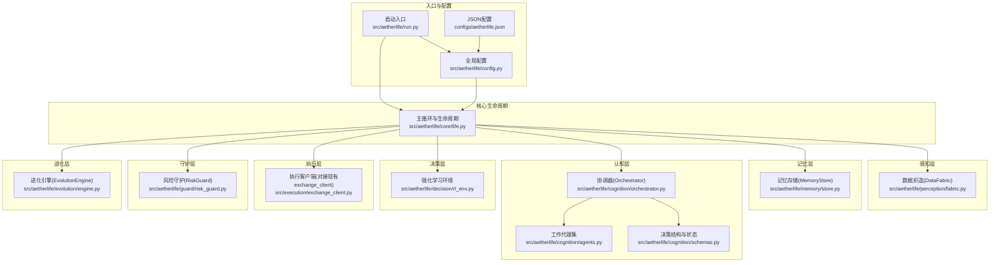
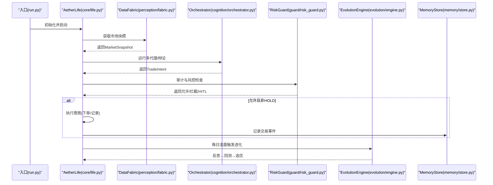
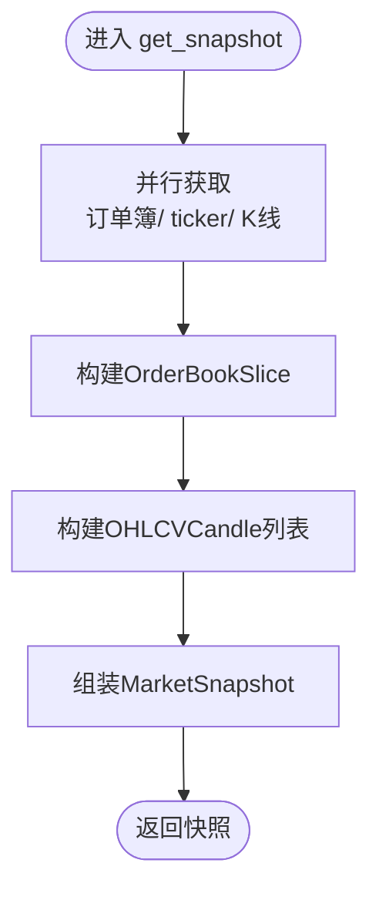
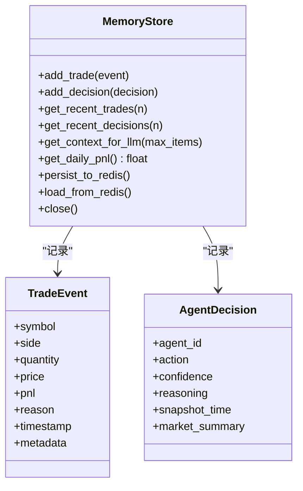
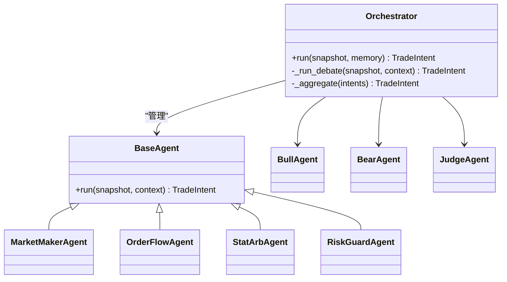
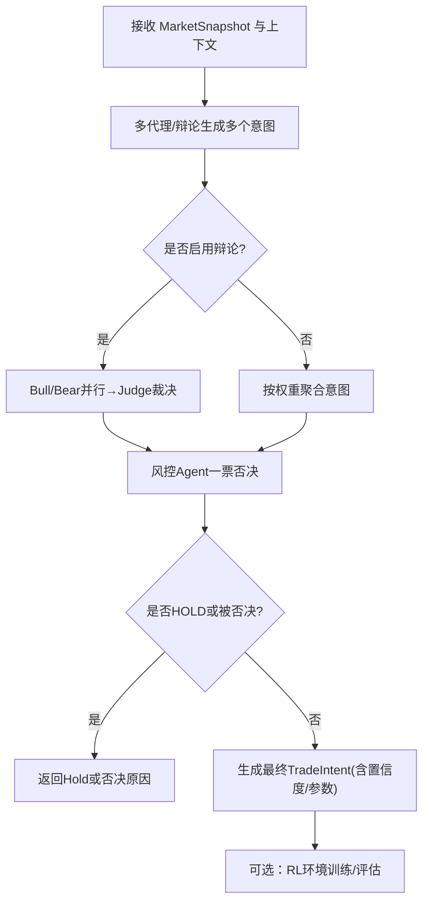
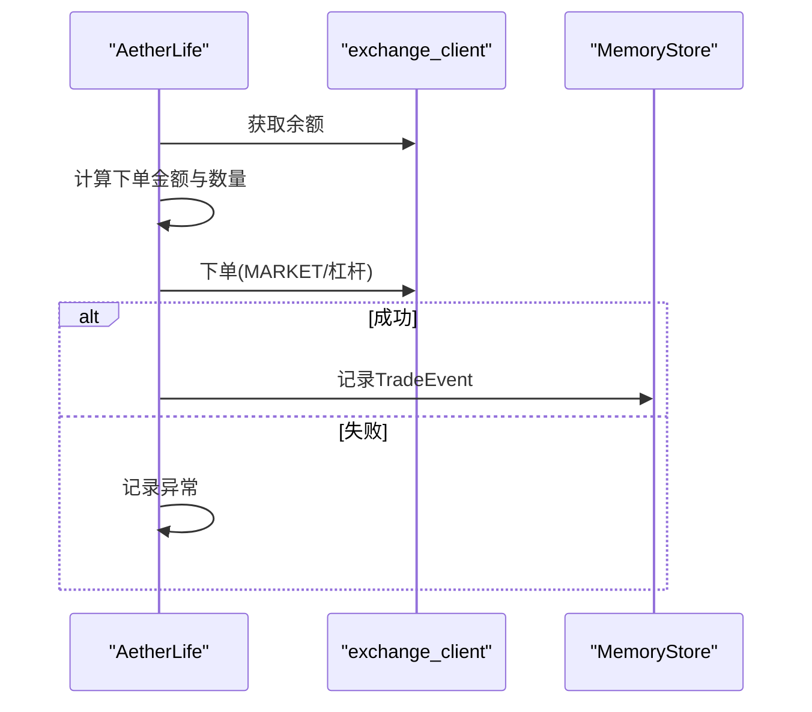
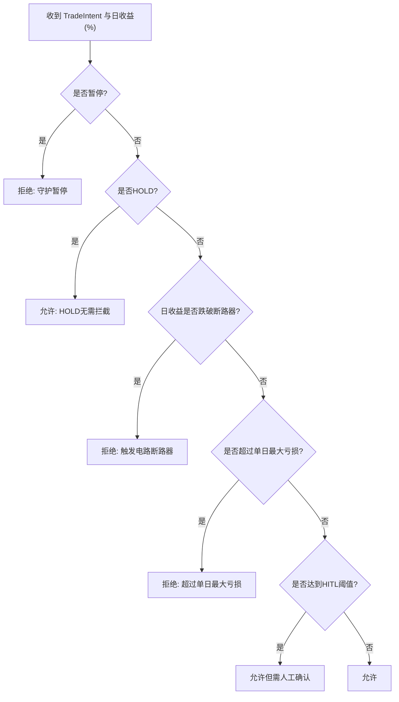
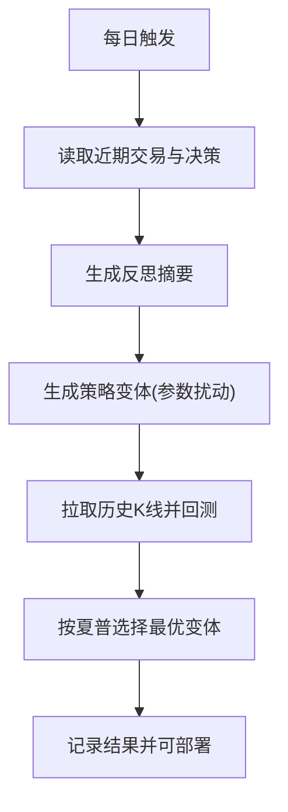
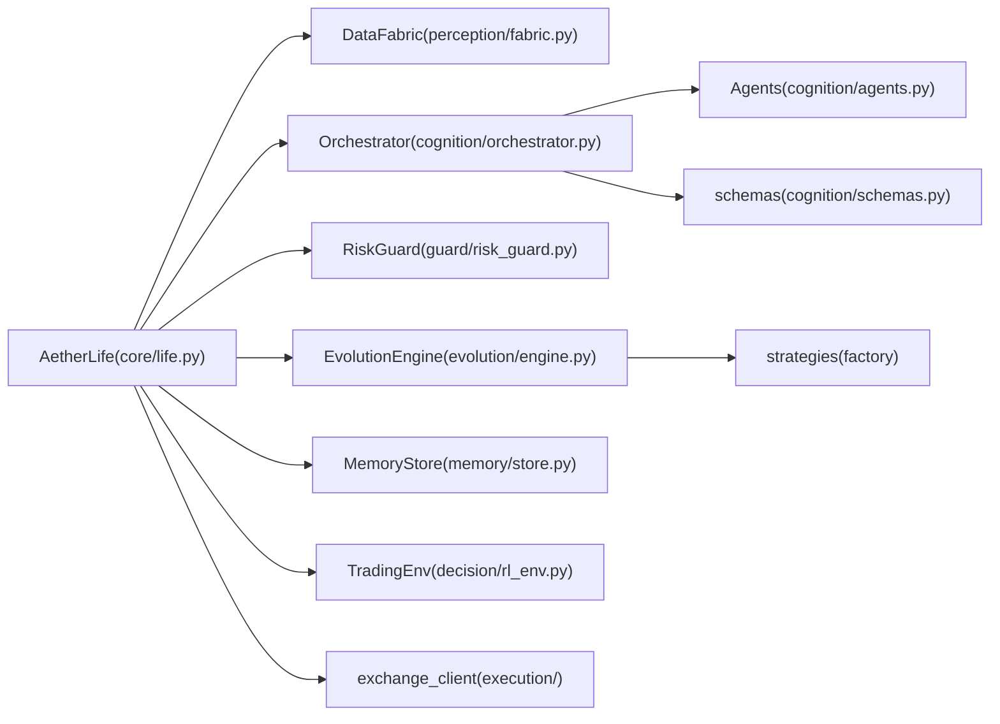

# AI增强系统 (AetherLife)

<cite>
**本文引用的文件**
- [src/aetherlife/__init__.py](file://src/aetherlife/__init__.py)
- [src/aetherlife/run.py](file://src/aetherlife/run.py)
- [src/aetherlife/config.py](file://src/aetherlife/config.py)
- [src/aetherlife/core/life.py](file://src/aetherlife/core/life.py)
- [src/aetherlife/perception/fabric.py](file://src/aetherlife/perception/fabric.py)
- [src/aetherlife/memory/store.py](file://src/aetherlife/memory/store.py)
- [src/aetherlife/cognition/orchestrator.py](file://src/aetherlife/cognition/orchestrator.py)
- [src/aetherlife/cognition/agents.py](file://src/aetherlife/cognition/agents.py)
- [src/aetherlife/cognition/schemas.py](file://src/aetherlife/cognition/schemas.py)
- [src/aetherlife/guard/risk_guard.py](file://src/aetherlife/guard/risk_guard.py)
- [src/aetherlife/evolution/engine.py](file://src/aetherlife/evolution/engine.py)
- [src/aetherlife/decision/rl_env.py](file://src/aetherlife/decision/rl_env.py)
- [src/strategies/base.py](file://src/strategies/base.py)
- [configs/aetherlife.json](file://configs/aetherlife.json)
</cite>

## 目录
1. [简介](#简介)
2. [项目结构](#项目结构)
3. [核心组件](#核心组件)
4. [架构总览](#架构总览)
5. [组件详解](#组件详解)
6. [依赖关系分析](#依赖关系分析)
7. [性能考量](#性能考量)
8. [故障排查指南](#故障排查指南)
9. [结论](#结论)
10. [附录](#附录)

## 简介
AetherLife 是一个分层的AI交易系统，采用“感知 → 记忆 → 认知(多代理) → 决策 → 执行 → 守护 → 进化”的闭环架构。系统通过多代理协作实现跨市场与专业化分工，结合强化学习环境进行策略训练与优化，并内置风险守护与自我进化能力，支持与现有交易策略无缝集成与扩展。

## 项目结构
- 分层模块清晰：感知层负责多源数据接入与快照生成；记忆层保存短期与情景记忆；认知层通过多代理与可选辩论机制聚合决策；决策层支持LLM结构化输出与强化学习；执行层对接现有客户端；守护层提供风控与审计；进化层每日反思与回测优选策略。
- 配置中心化：通过配置类与JSON配置文件统一管理各层参数。
- 示例脚本：提供感知连接器演示、多代理演示、自进化脚本等，便于快速验证与扩展。

**图表来源**
- [src/aetherlife/run.py](file://src/aetherlife/run.py#L32-L69)
- [src/aetherlife/config.py](file://src/aetherlife/config.py#L98-L131)
- [src/aetherlife/core/life.py](file://src/aetherlife/core/life.py#L20-L164)
- [src/aetherlife/perception/fabric.py](file://src/aetherlife/perception/fabric.py#L13-L88)
- [src/aetherlife/memory/store.py](file://src/aetherlife/memory/store.py#L43-L155)
- [src/aetherlife/cognition/orchestrator.py](file://src/aetherlife/cognition/orchestrator.py#L16-L93)
- [src/aetherlife/cognition/agents.py](file://src/aetherlife/cognition/agents.py#L13-L109)
- [src/aetherlife/cognition/schemas.py](file://src/aetherlife/cognition/schemas.py#L32-L219)
- [src/aetherlife/decision/rl_env.py](file://src/aetherlife/decision/rl_env.py#L26-L423)
- [src/aetherlife/guard/risk_guard.py](file://src/aetherlife/guard/risk_guard.py#L23-L84)
- [src/aetherlife/evolution/engine.py](file://src/aetherlife/evolution/engine.py#L17-L145)

**章节来源**
- [src/aetherlife/run.py](file://src/aetherlife/run.py#L1-L71)
- [src/aetherlife/config.py](file://src/aetherlife/config.py#L1-L131)

## 核心组件
- 全局配置：集中定义感知、记忆、认知、决策、执行、守护、进化等子配置，支持从字典与JSON加载。
- 主生命周期：AetherLife封装感知-认知-决策-守护-执行全流程，支持每日触发进化。
- 数据织造：统一多源数据接口，生成市场快照，支撑后续决策。
- 记忆存储：短期+情景记忆，支持可选Redis持久化，提供上下文摘要与日收益汇总。
- 多代理协调：顺序聚合或辩论(Bull/Bear/Judge)两种模式，最终由风控Agent一票否决。
- 强化学习环境：基于Gymnasium构建的交易环境，支持连续/离散动作与多维状态，内置奖励函数与惩罚项。
- 风险守护：电路断路器、单日最大亏损、大额人工确认(HITL)与审计日志。
- 自我进化：每日反思→生成变体→回测→选优，支持参数变体与策略筛选。

**章节来源**
- [src/aetherlife/config.py](file://src/aetherlife/config.py#L98-L131)
- [src/aetherlife/core/life.py](file://src/aetherlife/core/life.py#L20-L164)
- [src/aetherlife/perception/fabric.py](file://src/aetherlife/perception/fabric.py#L13-L88)
- [src/aetherlife/memory/store.py](file://src/aetherlife/memory/store.py#L43-L155)
- [src/aetherlife/cognition/orchestrator.py](file://src/aetherlife/cognition/orchestrator.py#L16-L93)
- [src/aetherlife/decision/rl_env.py](file://src/aetherlife/decision/rl_env.py#L26-L423)
- [src/aetherlife/guard/risk_guard.py](file://src/aetherlife/guard/risk_guard.py#L23-L84)
- [src/aetherlife/evolution/engine.py](file://src/aetherlife/evolution/engine.py#L17-L145)

## 架构总览
系统采用分层解耦与模块化设计，核心控制流如下：

**图表来源**
- [src/aetherlife/run.py](file://src/aetherlife/run.py#L52-L69)
- [src/aetherlife/core/life.py](file://src/aetherlife/core/life.py#L59-L149)
- [src/aetherlife/perception/fabric.py](file://src/aetherlife/perception/fabric.py#L32-L82)
- [src/aetherlife/cognition/orchestrator.py](file://src/aetherlife/cognition/orchestrator.py#L38-L53)
- [src/aetherlife/guard/risk_guard.py](file://src/aetherlife/guard/risk_guard.py#L48-L68)
- [src/aetherlife/evolution/engine.py](file://src/aetherlife/evolution/engine.py#L45-L60)

## 组件详解

### 感知层：数据织造与市场快照
- 职责：并行拉取订单簿、ticker与K线，统一为MarketSnapshot，支持未来WebSocket与Kafka接入。
- 关键点：异步并行获取，订单簿截断至前N档，时间戳规范化，蜡烛序列转换为统一结构。

**图表来源**
- [src/aetherlife/perception/fabric.py](file://src/aetherlife/perception/fabric.py#L32-L82)

**章节来源**
- [src/aetherlife/perception/fabric.py](file://src/aetherlife/perception/fabric.py#L13-L88)

### 记忆层：短期与情景记忆
- 职责：保存交易事件与Agent决策，维护短期上下文，支持Redis持久化与加载。
- 关键点：deque限制容量，短期上下文上限，提供LLM可用的文本摘要，按日汇总PnL。

**图表来源**
- [src/aetherlife/memory/store.py](file://src/aetherlife/memory/store.py#L43-L155)

**章节来源**
- [src/aetherlife/memory/store.py](file://src/aetherlife/memory/store.py#L43-L155)

### 认知层：多代理与辩论
- 职责：多代理并行分析或辩论(Bull/Bear/Judge)，聚合为最终意图；风控Agent一票否决。
- 关键点：权重聚合、置信度归一化、风控否决逻辑、可选辩论路径。

**图表来源**
- [src/aetherlife/cognition/orchestrator.py](file://src/aetherlife/cognition/orchestrator.py#L16-L93)
- [src/aetherlife/cognition/agents.py](file://src/aetherlife/cognition/agents.py#L13-L109)

**章节来源**
- [src/aetherlife/cognition/orchestrator.py](file://src/aetherlife/cognition/orchestrator.py#L16-L93)
- [src/aetherlife/cognition/agents.py](file://src/aetherlife/cognition/agents.py#L13-L109)
- [src/aetherlife/cognition/schemas.py](file://src/aetherlife/cognition/schemas.py#L32-L74)

### 决策层：结构化意图与强化学习
- 职责：统一的TradeIntent结构，支持多市场、多动作、时效性与元数据；可选强化学习环境训练策略。
- 关键点：Pydantic校验、连续/离散动作、状态向量、奖励函数（PnL、滑点、回撤、夏普）。

**图表来源**
- [src/aetherlife/cognition/orchestrator.py](file://src/aetherlife/cognition/orchestrator.py#L38-L53)
- [src/aetherlife/cognition/schemas.py](file://src/aetherlife/cognition/schemas.py#L32-L59)
- [src/aetherlife/decision/rl_env.py](file://src/aetherlife/decision/rl_env.py#L26-L423)

**章节来源**
- [src/aetherlife/cognition/schemas.py](file://src/aetherlife/cognition/schemas.py#L32-L219)
- [src/aetherlife/decision/rl_env.py](file://src/aetherlife/decision/rl_env.py#L26-L423)

### 执行层：订单管理与对接
- 职责：根据意图执行下单，计算数量，记录交易事件。
- 关键点：基于最新价格与账户余额估算下单数量，支持测试网与杠杆参数。

**图表来源**
- [src/aetherlife/core/life.py](file://src/aetherlife/core/life.py#L89-L122)

**章节来源**
- [src/aetherlife/core/life.py](file://src/aetherlife/core/life.py#L89-L122)

### 守护层：风控与审计
- 职责：电路断路器、单日最大亏损、HITL与审计日志。
- 关键点：暂停状态、日收益百分比检查、可选回调与文件审计。

**图表来源**
- [src/aetherlife/guard/risk_guard.py](file://src/aetherlife/guard/risk_guard.py#L48-L68)

**章节来源**
- [src/aetherlife/guard/risk_guard.py](file://src/aetherlife/guard/risk_guard.py#L23-L84)

### 进化层：反思-生成-回测-选优
- 职责：每日反思昨日表现→生成策略变体→回测→按夏普选择最优。
- 关键点：参数扰动(如突破周期、阈值、RSI区间)→回测→筛选部署。

**图表来源**
- [src/aetherlife/evolution/engine.py](file://src/aetherlife/evolution/engine.py#L45-L60)
- [src/aetherlife/evolution/engine.py](file://src/aetherlife/evolution/engine.py#L71-L88)
- [src/aetherlife/evolution/engine.py](file://src/aetherlife/evolution/engine.py#L90-L145)

**章节来源**
- [src/aetherlife/evolution/engine.py](file://src/aetherlife/evolution/engine.py#L17-L145)

## 依赖关系分析
- 组件耦合：AetherLife作为编排者，依赖感知、记忆、认知、守护与进化；认知层内部通过抽象基类解耦具体代理；决策层与策略工厂解耦。
- 外部依赖：gymnasium用于强化学习环境；redis用于可选持久化；dotenv用于环境变量注入。
- 循环依赖：未见明显循环导入；模块间通过接口与数据类传递信息。

**图表来源**
- [src/aetherlife/core/life.py](file://src/aetherlife/core/life.py#L20-L46)
- [src/aetherlife/cognition/orchestrator.py](file://src/aetherlife/cognition/orchestrator.py#L16-L36)
- [src/aetherlife/evolution/engine.py](file://src/aetherlife/evolution/engine.py#L39-L43)

**章节来源**
- [src/aetherlife/core/life.py](file://src/aetherlife/core/life.py#L20-L46)
- [src/aetherlife/cognition/orchestrator.py](file://src/aetherlife/cognition/orchestrator.py#L16-L36)
- [src/aetherlife/evolution/engine.py](file://src/aetherlife/evolution/engine.py#L39-L43)

## 性能考量
- 异步并行：感知层并行拉取多源数据，降低等待时间。
- 内存与容量：记忆层使用deque限制容量，避免无限增长；短期上下文上限可控。
- 计算复杂度：聚合与风控检查为线性复杂度；RL状态向量固定维度，适合在线推理。
- I/O优化：可选Redis持久化在关闭时批量写入，减少频繁IO。
- 策略回测：回测在夜间或低峰时段执行，避免影响主循环。

## 故障排查指南
- 启动与配置
  - 确认环境变量与JSON配置加载顺序与优先级。
  - 检查REDIS_URL与gymnasium安装情况。
- 记忆层
  - Redis不可用时会降级为纯内存；检查URL与网络连通。
  - 确认短期上下文与事件队列上限设置合理。
- 认知层
  - 若辩论未生效，检查配置中辩论开关与代理权重。
  - 风控否决导致Hold，检查日收益与置信度阈值。
- 决策层
  - RL环境需满足gymnasium依赖；动作/状态空间与奖励函数可按场景调整。
- 执行层
  - 测试网与API密钥配置正确；下单失败查看异常日志并核对余额与价格。
- 守护层
  - 审计日志路径存在且可写；HITL阈值与断路器参数按策略风险设定。
- 进化层
  - 回测数据拉取失败时检查exchange/testnet配置；变体过多可降低每轮生成数。

**章节来源**
- [src/aetherlife/run.py](file://src/aetherlife/run.py#L32-L49)
- [src/aetherlife/memory/store.py](file://src/aetherlife/memory/store.py#L90-L103)
- [src/aetherlife/decision/rl_env.py](file://src/aetherlife/decision/rl_env.py#L62-L63)
- [src/aetherlife/guard/risk_guard.py](file://src/aetherlife/guard/risk_guard.py#L70-L83)
- [src/aetherlife/evolution/engine.py](file://src/aetherlife/evolution/engine.py#L96-L99)

## 结论
AetherLife通过分层架构实现了从感知到进化的完整闭环，多代理协作与风控守护确保稳健性，强化学习与自我进化提供持续优化能力。系统具备良好的扩展性，可对接更多市场与策略，并在生产环境中逐步引入更复杂的认知与执行模块。

## 附录

### 使用示例与配置要点
- 启动方式：支持命令行入口与Python模块运行，周期与符号可通过环境变量配置。
- 配置文件：JSON配置覆盖默认值，支持认知辩论、守护审计路径、进化参数等。
- 代理参数：可通过权重与阈值微调聚合与风控行为；辩论模式按需开启。
- 决策流程：LLM结构化输出与RL路径可并行探索，最终由风控与守护共同把关。
- 性能优化：缩短感知刷新间隔、限制短期上下文、合理设置回测窗口与变体数量。

**章节来源**
- [src/aetherlife/run.py](file://src/aetherlife/run.py#L32-L69)
- [configs/aetherlife.json](file://configs/aetherlife.json#L1-L17)
- [src/aetherlife/config.py](file://src/aetherlife/config.py#L98-L131)

### 强化学习在决策中的角色
- 环境设计：连续/离散动作、固定维度状态向量、多维奖励函数（PnL、滑点、回撤、夏普）。
- 训练建议：先用模拟数据预训练，再结合实盘回测；注意过拟合与市场分布漂移。
- 与认知层结合：RL可作为备选决策路径，与多代理/辩论结果互为补充。

**章节来源**
- [src/aetherlife/decision/rl_env.py](file://src/aetherlife/decision/rl_env.py#L26-L423)

### 风险守护与自我进化实现原理
- 风控：断路器与单日最大亏损阈值，配合HITL与审计日志形成闭环。
- 进化：每日反思→参数/策略变体→回测→选优部署，支持策略参数与代码生成的热更新。

**章节来源**
- [src/aetherlife/guard/risk_guard.py](file://src/aetherlife/guard/risk_guard.py#L23-L84)
- [src/aetherlife/evolution/engine.py](file://src/aetherlife/evolution/engine.py#L17-L145)

### 与传统交易策略的集成与扩展
- 策略工厂：通过策略基类与工厂方法接入既有策略，统一信号生成与回测。
- 执行对接：通过现有exchange_client适配下单流程，支持测试网与实盘切换。
- 扩展方向：LangGraph状态机、跨市场信号、情绪因子、更高阶的强化学习算法。

**章节来源**
- [src/strategies/base.py](file://src/strategies/base.py#L6-L31)
- [src/aetherlife/core/life.py](file://src/aetherlife/core/life.py#L47-L57)