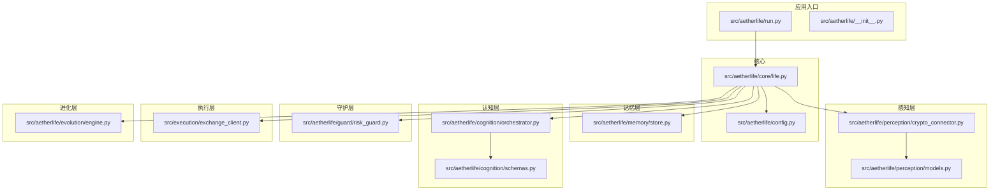
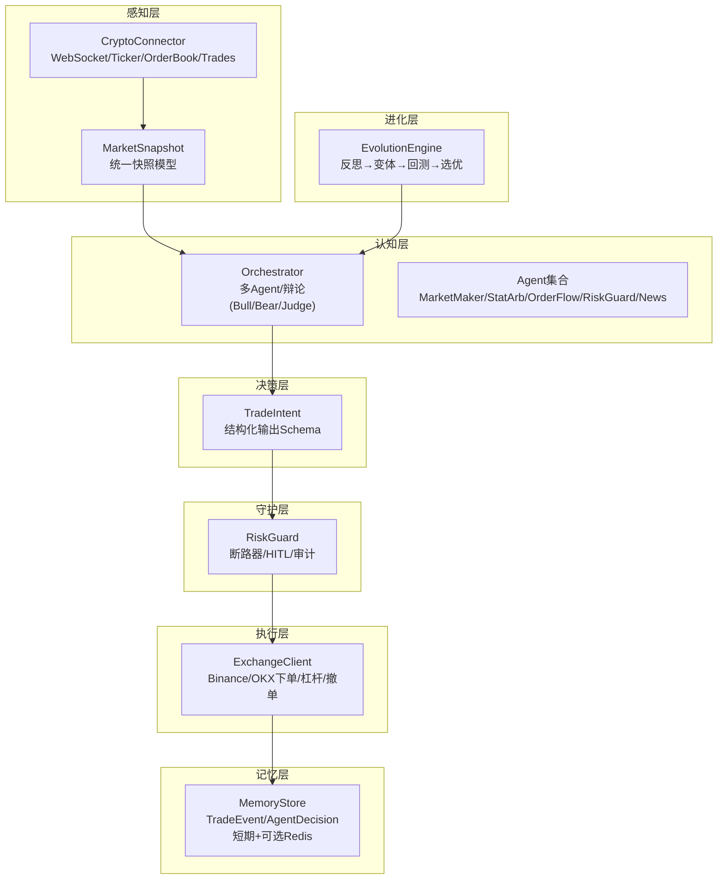
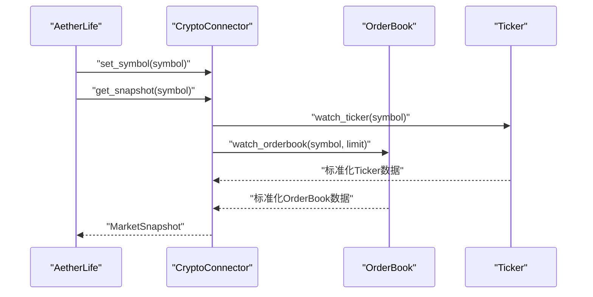
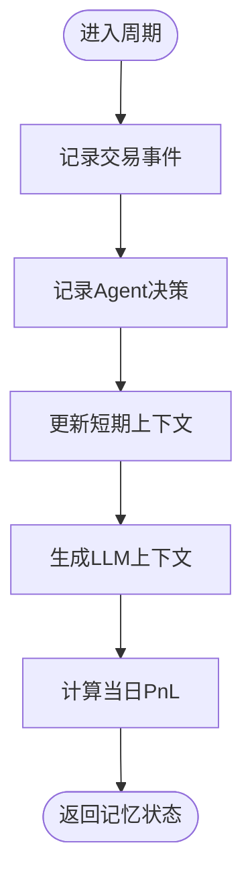
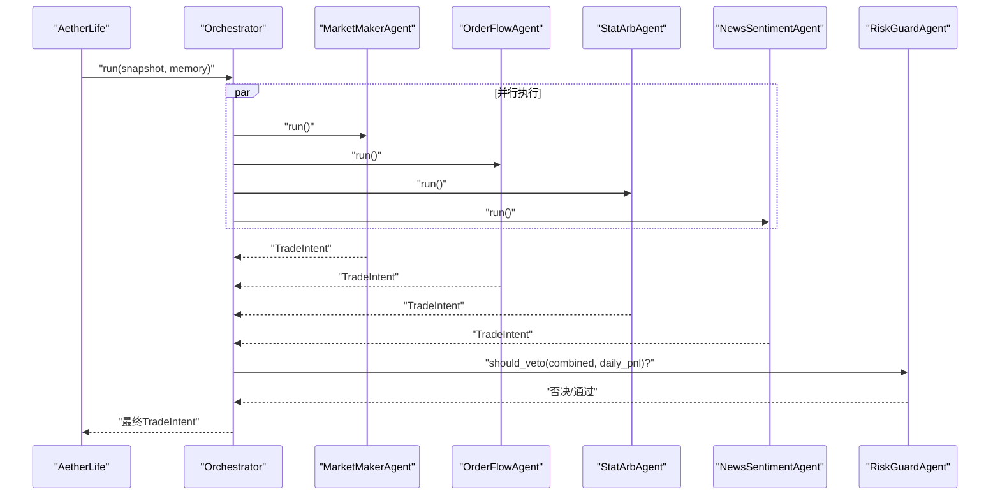
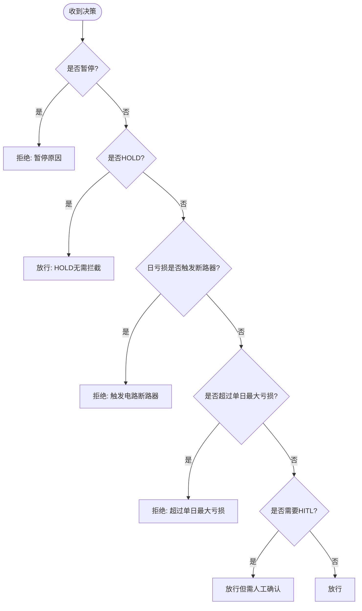
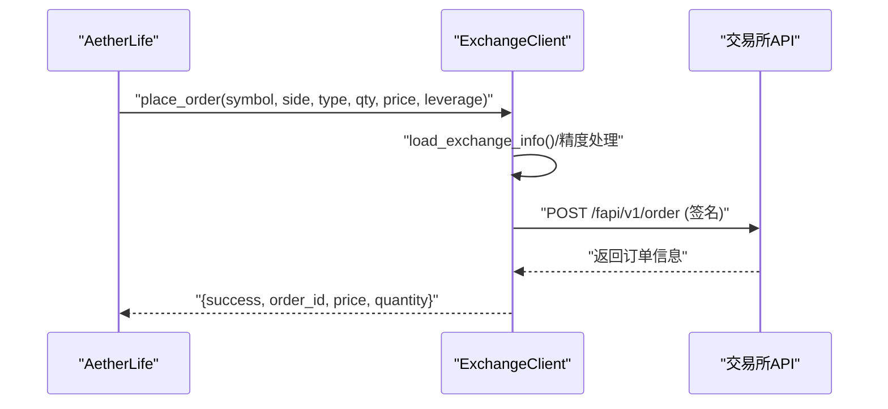
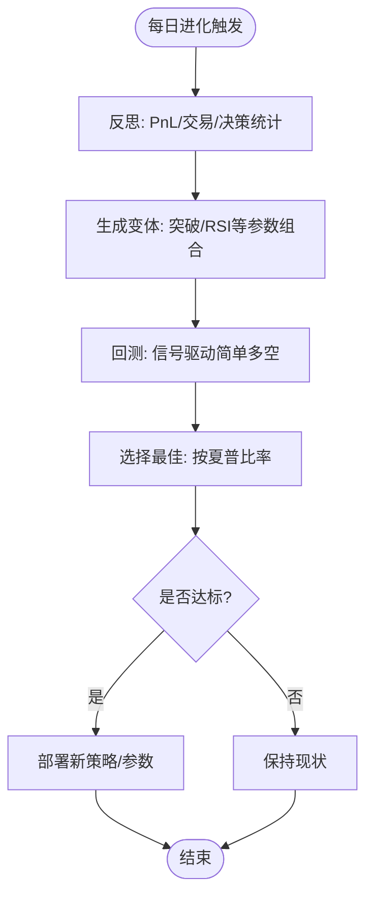
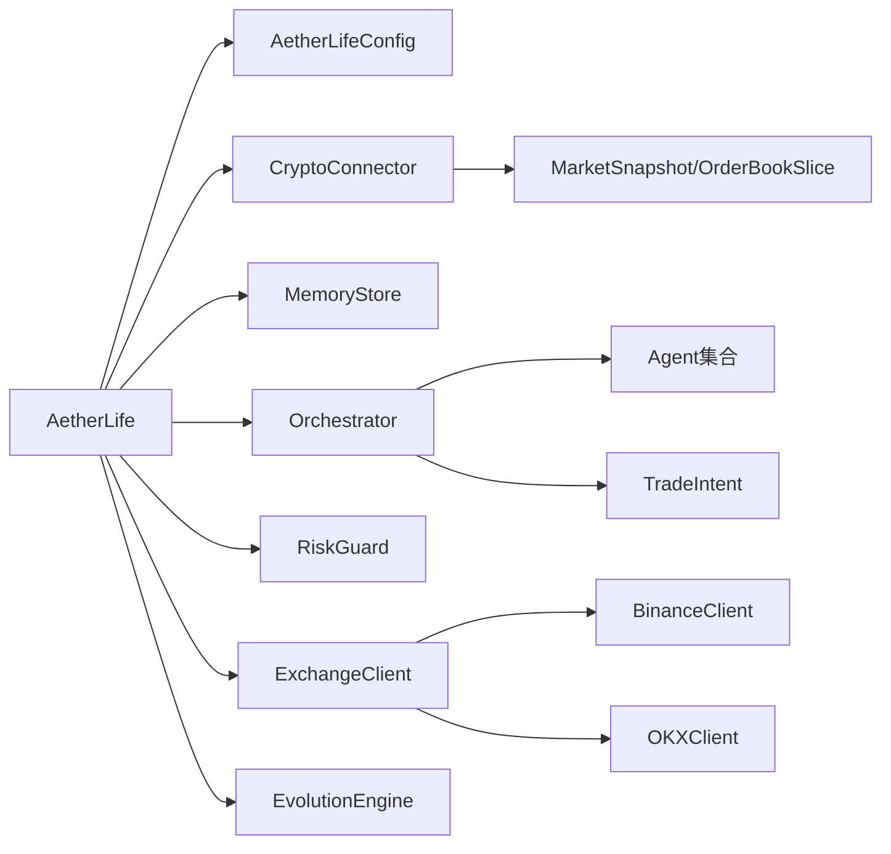
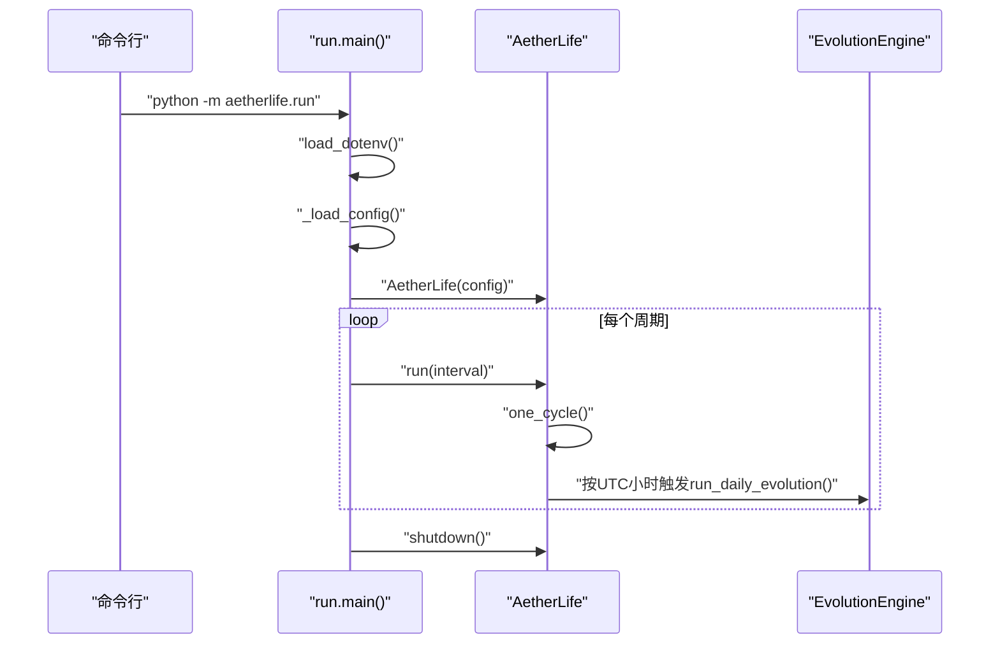

# AetherLife架构概览

<cite>
**本文引用的文件**
- [src/aetherlife/__init__.py](file://src/aetherlife/__init__.py)
- [src/aetherlife/run.py](file://src/aetherlife/run.py)
- [src/aetherlife/core/life.py](file://src/aetherlife/core/life.py)
- [src/aetherlife/config.py](file://src/aetherlife/config.py)
- [src/aetherlife/cognition/orchestrator.py](file://src/aetherlife/cognition/orchestrator.py)
- [src/aetherlife/cognition/schemas.py](file://src/aetherlife/cognition/schemas.py)
- [src/aetherlife/memory/store.py](file://src/aetherlife/memory/store.py)
- [src/aetherlife/perception/models.py](file://src/aetherlife/perception/models.py)
- [src/aetherlife/perception/crypto_connector.py](file://src/aetherlife/perception/crypto_connector.py)
- [src/aetherlife/guard/risk_guard.py](file://src/aetherlife/guard/risk_guard.py)
- [src/aetherlife/evolution/engine.py](file://src/aetherlife/evolution/engine.py)
- [src/execution/exchange_client.py](file://src/execution/exchange_client.py)
- [configs/aetherlife.json](file://configs/aetherlife.json)
</cite>

## 目录
1. [简介](#简介)
2. [项目结构](#项目结构)
3. [核心组件](#核心组件)
4. [架构总览](#架构总览)
5. [详细组件分析](#详细组件分析)
6. [依赖关系分析](#依赖关系分析)
7. [性能考虑](#性能考虑)
8. [故障排查指南](#故障排查指南)
9. [结论](#结论)
10. [附录](#附录)

## 简介
AetherLife 是一个分层智能交易系统，采用“感知 → 记忆 → 认知(多代理) → 决策 → 守护 → 执行 → 进化”的七层架构模型。系统通过多代理协作实现智能化交易决策，结合风控与审计机制保障安全运行，并在每日固定时刻触发策略进化，形成自我改进闭环。

## 项目结构
仓库采用按功能域划分的模块化组织方式，核心目录与职责如下：
- src/aetherlife：系统核心包，包含七层架构的实现
- src/execution：执行层，封装交易所客户端与下单逻辑
- src/data：数据获取与缓存工具
- src/strategies：策略工厂与多种交易策略
- src/ui：管理后台与可视化界面
- configs：系统配置文件
- scripts：演示脚本与实时数据展示
- tests：策略单元测试

图表来源
- [src/aetherlife/run.py](file://src/aetherlife/run.py#L52-L71)
- [src/aetherlife/core/life.py](file://src/aetherlife/core/life.py#L20-L46)
- [src/aetherlife/perception/crypto_connector.py](file://src/aetherlife/perception/crypto_connector.py#L23-L86)
- [src/aetherlife/memory/store.py](file://src/aetherlife/memory/store.py#L43-L63)
- [src/aetherlife/cognition/orchestrator.py](file://src/aetherlife/cognition/orchestrator.py#L16-L37)
- [src/aetherlife/guard/risk_guard.py](file://src/aetherlife/guard/risk_guard.py#L23-L43)
- [src/execution/exchange_client.py](file://src/execution/exchange_client.py#L20-L41)
- [src/aetherlife/evolution/engine.py](file://src/aetherlife/evolution/engine.py#L17-L38)

章节来源
- [src/aetherlife/run.py](file://src/aetherlife/run.py#L1-L71)
- [src/aetherlife/__init__.py](file://src/aetherlife/__init__.py#L1-L13)

## 核心组件
- AetherLife 主控制器：负责单周期生命周期编排（感知 → 认知 → 决策 → 审计 → 守护 → 执行），并按日触发进化
- 配置中心：集中管理数据、记忆、认知、决策、执行、守护、进化等子系统的参数
- 认知协调器：调度多个专业 Agent（做市、统计套利、订单流、新闻情绪等），支持辩论模式
- 记忆存储：短期事件与决策的内存队列，可选 Redis 持久化
- 风控守卫：电路断路器、单日最大亏损限制、HITL 人工确认与审计日志
- 执行客户端：封装 Binance/OKX 等交易所 API，支持下单、撤单、杠杆设置等
- 进化引擎：反思昨日表现，生成策略变体并回测，择优部署

章节来源
- [src/aetherlife/core/life.py](file://src/aetherlife/core/life.py#L20-L164)
- [src/aetherlife/config.py](file://src/aetherlife/config.py#L98-L131)
- [src/aetherlife/cognition/orchestrator.py](file://src/aetherlife/cognition/orchestrator.py#L16-L93)
- [src/aetherlife/memory/store.py](file://src/aetherlife/memory/store.py#L43-L155)
- [src/aetherlife/guard/risk_guard.py](file://src/aetherlife/guard/risk_guard.py#L23-L84)
- [src/execution/exchange_client.py](file://src/execution/exchange_client.py#L20-L432)
- [src/aetherlife/evolution/engine.py](file://src/aetherlife/evolution/engine.py#L17-L145)

## 架构总览
AetherLife 采用分层解耦的设计，各层职责清晰、边界明确，通过统一的数据模型与接口进行交互。系统支持多市场、多代理、多策略的协同与进化。

图表来源
- [src/aetherlife/perception/crypto_connector.py](file://src/aetherlife/perception/crypto_connector.py#L23-L370)
- [src/aetherlife/perception/models.py](file://src/aetherlife/perception/models.py#L15-L64)
- [src/aetherlife/memory/store.py](file://src/aetherlife/memory/store.py#L43-L155)
- [src/aetherlife/cognition/orchestrator.py](file://src/aetherlife/cognition/orchestrator.py#L16-L93)
- [src/aetherlife/cognition/schemas.py](file://src/aetherlife/cognition/schemas.py#L32-L58)
- [src/aetherlife/guard/risk_guard.py](file://src/aetherlife/guard/risk_guard.py#L23-L84)
- [src/execution/exchange_client.py](file://src/execution/exchange_client.py#L20-L432)
- [src/aetherlife/evolution/engine.py](file://src/aetherlife/evolution/engine.py#L17-L145)

## 详细组件分析

### 感知层：多源数据接入与标准化
- 职责：通过 WebSocket 实时订阅行情、订单簿与成交，提供统一的 MarketSnapshot
- 关键点：支持多交易所（Binance/Bybit/OKX），测试网适配，自动重连与回调分发
- 数据模型：OrderBookSlice、OHLCVCandle、MarketSnapshot 统一跨市场格式

图表来源
- [src/aetherlife/core/life.py](file://src/aetherlife/core/life.py#L59-L67)
- [src/aetherlife/perception/crypto_connector.py](file://src/aetherlife/perception/crypto_connector.py#L278-L329)
- [src/aetherlife/perception/models.py](file://src/aetherlife/perception/models.py#L15-L64)

章节来源
- [src/aetherlife/perception/crypto_connector.py](file://src/aetherlife/perception/crypto_connector.py#L23-L370)
- [src/aetherlife/perception/models.py](file://src/aetherlife/perception/models.py#L15-L64)

### 记忆层：短期事件与上下文
- 职责：记录交易事件与 Agent 决策，维护短期上下文，支持 Redis 持久化
- 关键点：deque 控制容量，短期列表限制长度，支持从 Redis 加载/保存
- 接口：add_trade/add_decision/get_context_for_llm/get_daily_pnl

图表来源
- [src/aetherlife/memory/store.py](file://src/aetherlife/memory/store.py#L64-L145)

章节来源
- [src/aetherlife/memory/store.py](file://src/aetherlife/memory/store.py#L43-L155)

### 认知层：多代理协作与辩论
- 职责：协调多个专业 Agent 并聚合意图，支持辩论模式（多方观点 → 判决）
- 关键点：权重聚合、风控否决、可选 LangGraph 状态机
- 接口：run(snapshot, memory) 返回 TradeIntent

图表来源
- [src/aetherlife/cognition/orchestrator.py](file://src/aetherlife/cognition/orchestrator.py#L38-L53)
- [src/aetherlife/cognition/orchestrator.py](file://src/aetherlife/cognition/orchestrator.py#L55-L63)
- [src/aetherlife/cognition/schemas.py](file://src/aetherlife/cognition/schemas.py#L32-L58)

章节来源
- [src/aetherlife/cognition/orchestrator.py](file://src/aetherlife/cognition/orchestrator.py#L16-L93)
- [src/aetherlife/cognition/schemas.py](file://src/aetherlife/cognition/schemas.py#L32-L58)

### 决策层：结构化意图与Schema
- 职责：定义 TradeIntent 的严格结构，确保 LLM/RL 输出可解析、可审计
- 关键点：动作枚举、市场类型、风控参数、时效性与元数据

章节来源
- [src/aetherlife/cognition/schemas.py](file://src/aetherlife/cognition/schemas.py#L12-L58)

### 守护层：风控与审计
- 职责：执行前最后一道关卡，断路器、单日最大亏损、HITL 人工确认与审计日志
- 关键点：check(intent, daily_pnl_pct, position_value_usd) 返回 GuardResult

图表来源
- [src/aetherlife/guard/risk_guard.py](file://src/aetherlife/guard/risk_guard.py#L48-L68)

章节来源
- [src/aetherlife/guard/risk_guard.py](file://src/aetherlife/guard/risk_guard.py#L23-L84)

### 执行层：交易所对接与下单
- 职责：封装 Binance/OKX 等交易所 API，支持下单、撤单、杠杆设置、仓位管理
- 关键点：签名、精度处理、动态步进、测试网地址切换

图表来源
- [src/aetherlife/core/life.py](file://src/aetherlife/core/life.py#L89-L122)
- [src/execution/exchange_client.py](file://src/execution/exchange_client.py#L226-L275)

章节来源
- [src/execution/exchange_client.py](file://src/execution/exchange_client.py#L20-L432)

### 进化层：每日反思与策略优化
- 职责：反思昨日表现 → 生成策略变体 → 回测 → 选优部署
- 关键点：参数空间搜索、简单回测（收益与夏普比率）、按阈值筛选

图表来源
- [src/aetherlife/evolution/engine.py](file://src/aetherlife/evolution/engine.py#L45-L60)
- [src/aetherlife/evolution/engine.py](file://src/aetherlife/evolution/engine.py#L71-L88)
- [src/aetherlife/evolution/engine.py](file://src/aetherlife/evolution/engine.py#L90-L120)
- [src/aetherlife/evolution/engine.py](file://src/aetherlife/evolution/engine.py#L140-L145)

章节来源
- [src/aetherlife/evolution/engine.py](file://src/aetherlife/evolution/engine.py#L17-L145)

## 依赖关系分析
- 组件内聚与耦合
  - AetherLife 作为编排器，向上依赖配置中心，向下依赖感知、记忆、认知、守护、执行、进化
  - Orchestrator 依赖 Agent 集合与 RiskGuard，输出 TradeIntent
  - ExchangeClient 与具体交易所实现解耦，通过工厂函数创建
- 外部依赖
  - ccxt.pro 用于 WebSocket 订阅
  - redis.asyncio 用于可选持久化
  - aiohttp 用于异步 HTTP 请求

图表来源
- [src/aetherlife/core/life.py](file://src/aetherlife/core/life.py#L23-L46)
- [src/aetherlife/cognition/orchestrator.py](file://src/aetherlife/cognition/orchestrator.py#L19-L36)
- [src/aetherlife/perception/crypto_connector.py](file://src/aetherlife/perception/crypto_connector.py#L364-L370)
- [src/execution/exchange_client.py](file://src/execution/exchange_client.py#L403-L411)

章节来源
- [src/aetherlife/core/life.py](file://src/aetherlife/core/life.py#L20-L46)
- [src/aetherlife/cognition/orchestrator.py](file://src/aetherlife/cognition/orchestrator.py#L16-L37)
- [src/execution/exchange_client.py](file://src/execution/exchange_client.py#L403-L411)

## 性能考虑
- 异步与并发
  - 感知层使用 asyncio.gather 并行订阅 Ticker/OrderBook/Trades
  - 认知层多 Agent 并行推理，Orchestrator 聚合
  - 执行层下单与风控检查串行，避免并发冲突
- 数据结构与复杂度
  - MemoryStore 使用 deque 控制容量，add/get 操作近似 O(1)
  - 订单簿切片与 Spread 计算为 O(k)，k 为档位数
- I/O 与网络
  - WebSocket 实时订阅降低延迟，自动重连提升稳定性
  - ExchangeClient 使用 aiohttp ClientSession 复用连接
- 存储与持久化
  - 可选 Redis 持久化，批量写入与裁剪控制大小

## 故障排查指南
- 启动与配置
  - 确认环境变量与配置文件加载顺序与优先级
  - 检查 .env 文件与 aetherlife.json 的合并逻辑
- 感知层
  - ccxt.pro 未安装会导致连接失败，检查依赖安装
  - 测试网地址配置错误导致无法连接，核对 exchange_id/testnet
- 记忆层
  - Redis 不可用时会降级为纯内存，检查连接 URL
- 认知层
  - 多 Agent 并行异常时，查看 Orchestrator 的 gather 结果
  - 辩论模式下，Judge 决策依赖 Bull/Bear 投票，检查投票逻辑
- 守护层
  - 断路器与 HITL 阈值过高可能导致频繁拦截，调整配置
  - 审计日志路径不存在会写入失败，检查目录权限
- 执行层
  - API Key/Secret 缺失时余额/仓位为空，下单会失败
  - 数量精度与步进不匹配导致下单失败，检查 exchange_info
- 进化层
  - 回测数据拉取失败或数据不足会导致回测结果为空，检查数据源

章节来源
- [src/aetherlife/run.py](file://src/aetherlife/run.py#L32-L49)
- [src/aetherlife/perception/crypto_connector.py](file://src/aetherlife/perception/crypto_connector.py#L37-L45)
- [src/aetherlife/memory/store.py](file://src/aetherlife/memory/store.py#L58-L63)
- [src/aetherlife/guard/risk_guard.py](file://src/aetherlife/guard/risk_guard.py#L48-L68)
- [src/execution/exchange_client.py](file://src/execution/exchange_client.py#L136-L171)
- [src/aetherlife/evolution/engine.py](file://src/aetherlife/evolution/engine.py#L94-L101)

## 结论
AetherLife 通过七层架构实现了从感知到进化的完整闭环，多代理协作与风控审计确保了决策质量与安全性。系统具备良好的扩展性与演进能力，适合在多市场、多策略场景下持续优化。

## 附录

### 系统启动流程
- 加载配置：优先读取 configs/aetherlife.json，其次根目录与 src 目录下的同名文件
- 初始化组件：DataFabric、MemoryStore、Orchestrator、RiskGuard、EvolutionEngine
- 主循环：按配置周期运行，每日固定时刻触发进化
- 关闭：释放资源，持久化短期事件至 Redis（如启用）

图表来源
- [src/aetherlife/run.py](file://src/aetherlife/run.py#L52-L71)
- [src/aetherlife/core/life.py](file://src/aetherlife/core/life.py#L123-L149)
- [src/aetherlife/evolution/engine.py](file://src/aetherlife/evolution/engine.py#L45-L60)

章节来源
- [src/aetherlife/run.py](file://src/aetherlife/run.py#L32-L69)
- [src/aetherlife/core/life.py](file://src/aetherlife/core/life.py#L123-L164)

### 配置管理
- 全局配置项：symbol、markets、log_level
- 子系统配置：data、memory、cognition、decision、execution、guard、evolution
- 配置加载：from_dict 支持嵌套字典合并，兼容 JSON 配置

章节来源
- [src/aetherlife/config.py](file://src/aetherlife/config.py#L98-L131)
- [configs/aetherlife.json](file://configs/aetherlife.json#L1-L17)