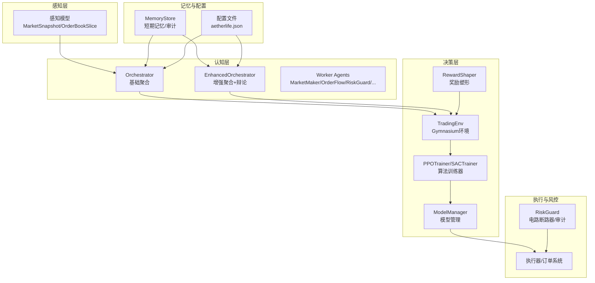
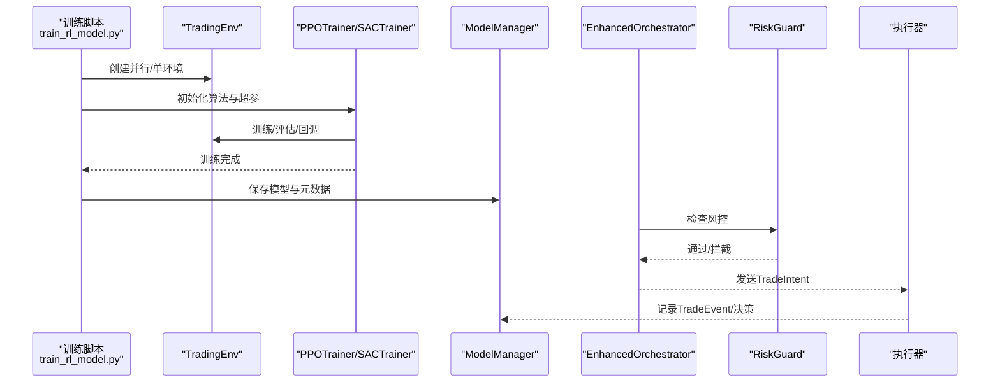
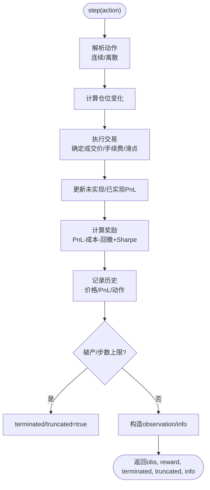
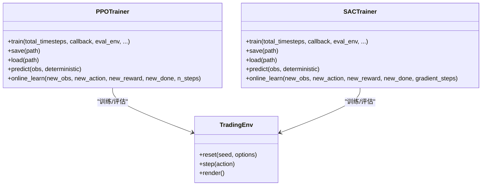
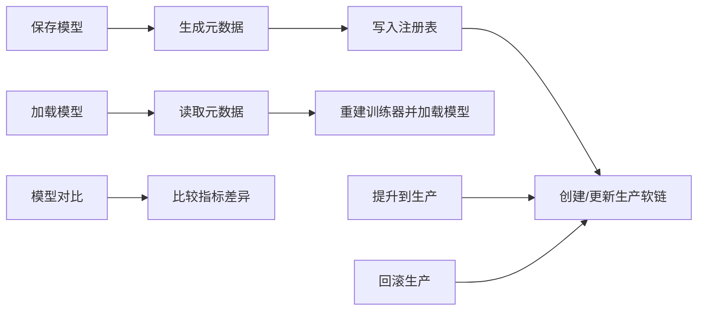
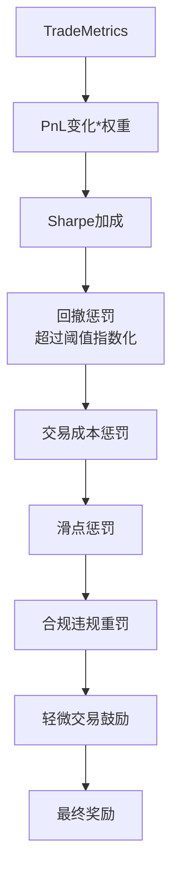
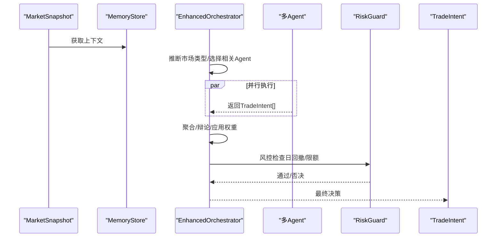
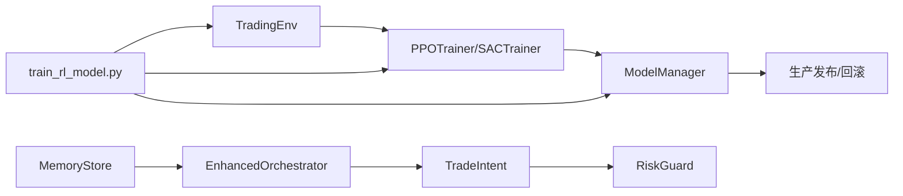

# 决策层强化学习

<cite>
**本文引用的文件**
- [src/aetherlife/decision/rl_env.py](file://src/aetherlife/decision/rl_env.py)
- [src/aetherlife/decision/ppo_agent.py](file://src/aetherlife/decision/ppo_agent.py)
- [src/aetherlife/decision/model_manager.py](file://src/aetherlife/decision/model_manager.py)
- [src/aetherlife/decision/reward_shaping.py](file://src/aetherlife/decision/reward_shaping.py)
- [src/aetherlife/cognition/orchestrator.py](file://src/aetherlife/cognition/orchestrator.py)
- [src/aetherlife/cognition/orchestrator_enhanced.py](file://src/aetherlife/cognition/orchestrator_enhanced.py)
- [src/aetherlife/cognition/agents.py](file://src/aetherlife/cognition/agents.py)
- [src/aetherlife/cognition/schemas.py](file://src/aetherlife/cognition/schemas.py)
- [src/aetherlife/memory/store.py](file://src/aetherlife/memory/store.py)
- [src/aetherlife/guard/risk_guard.py](file://src/aetherlife/guard/risk_guard.py)
- [src/aetherlife/perception/models.py](file://src/aetherlife/perception/models.py)
- [scripts/train_rl_model.py](file://scripts/train_rl_model.py)
- [configs/aetherlife.json](file://configs/aetherlife.json)
</cite>

## 目录
1. [引言](#引言)
2. [项目结构](#项目结构)
3. [核心组件](#核心组件)
4. [架构总览](#架构总览)
5. [详细组件分析](#详细组件分析)
6. [依赖关系分析](#依赖关系分析)
7. [性能考量](#性能考量)
8. [故障排查指南](#故障排查指南)
9. [结论](#结论)
10. [附录](#附录)

## 引言
本文件面向AetherLife决策层强化学习系统，聚焦于RL环境设计、PPO/SAC算法实现、模型管理与奖励塑形策略，以及与传统策略的融合与落地实践。文档旨在帮助研发与运营人员快速理解系统架构、掌握训练与部署流程，并在实盘环境中安全高效地应用强化学习。

## 项目结构
AetherLife采用“感知-认知-决策-执行-风控”分层架构。强化学习位于决策层，与多Agent协调器、记忆与风控模块协同工作，形成“数据驱动 + 规则约束”的混合智能体系。

图表来源
- [src/aetherlife/perception/models.py](file://src/aetherlife/perception/models.py#L55-L64)
- [src/aetherlife/cognition/orchestrator.py](file://src/aetherlife/cognition/orchestrator.py#L16-L53)
- [src/aetherlife/cognition/orchestrator_enhanced.py](file://src/aetherlife/cognition/orchestrator_enhanced.py#L84-L151)
- [src/aetherlife/decision/rl_env.py](file://src/aetherlife/decision/rl_env.py#L26-L118)
- [src/aetherlife/decision/ppo_agent.py](file://src/aetherlife/decision/ppo_agent.py#L66-L222)
- [src/aetherlife/decision/model_manager.py](file://src/aetherlife/decision/model_manager.py#L67-L102)
- [src/aetherlife/decision/reward_shaping.py](file://src/aetherlife/decision/reward_shaping.py#L33-L120)
- [src/aetherlife/guard/risk_guard.py](file://src/aetherlife/guard/risk_guard.py#L23-L68)
- [src/aetherlife/memory/store.py](file://src/aetherlife/memory/store.py#L43-L146)
- [configs/aetherlife.json](file://configs/aetherlife.json#L1-L17)

章节来源
- [src/aetherlife/perception/models.py](file://src/aetherlife/perception/models.py#L1-L64)
- [src/aetherlife/cognition/orchestrator.py](file://src/aetherlife/cognition/orchestrator.py#L1-L93)
- [src/aetherlife/cognition/orchestrator_enhanced.py](file://src/aetherlife/cognition/orchestrator_enhanced.py#L1-L323)
- [src/aetherlife/decision/rl_env.py](file://src/aetherlife/decision/rl_env.py#L1-L423)
- [src/aetherlife/decision/ppo_agent.py](file://src/aetherlife/decision/ppo_agent.py#L1-L457)
- [src/aetherlife/decision/model_manager.py](file://src/aetherlife/decision/model_manager.py#L1-L431)
- [src/aetherlife/decision/reward_shaping.py](file://src/aetherlife/decision/reward_shaping.py#L1-L419)
- [src/aetherlife/guard/risk_guard.py](file://src/aetherlife/guard/risk_guard.py#L1-L84)
- [src/aetherlife/memory/store.py](file://src/aetherlife/memory/store.py#L1-L155)
- [configs/aetherlife.json](file://configs/aetherlife.json#L1-L17)

## 核心组件
- 强化学习环境（TradingEnv）：基于Gymnasium构建，定义状态空间、动作空间与奖励函数，支持连续与离散动作，内置滑点、手续费、回撤与合规惩罚。
- 策略训练器（PPOTrainer/SACTrainer）：封装PPO与SAC算法，支持并行环境、评估回调、在线微调与TensorBoard日志。
- 模型管理器（ModelManager）：负责模型保存/加载、版本管理、生产发布与回滚、A/B比较与元数据追踪。
- 奖励塑形（RewardShaper）：以Sharpe、回撤、交易成本、滑点与合规为维度进行奖励函数塑形，支持A股北向滑点预测与合规检查。
- 认知协调器（Orchestrator/EnhancedOrchestrator）：多Agent聚合与辩论，结合记忆上下文与风控否决，输出TradeIntent。
- 风控（RiskGuard）：电路断路器、单日最大亏损、大额交易人工确认与审计日志。
- 记忆（MemoryStore）：短期事件与决策记录，支持Redis持久化与上下文摘要。

章节来源
- [src/aetherlife/decision/rl_env.py](file://src/aetherlife/decision/rl_env.py#L26-L118)
- [src/aetherlife/decision/ppo_agent.py](file://src/aetherlife/decision/ppo_agent.py#L66-L222)
- [src/aetherlife/decision/model_manager.py](file://src/aetherlife/decision/model_manager.py#L67-L102)
- [src/aetherlife/decision/reward_shaping.py](file://src/aetherlife/decision/reward_shaping.py#L33-L120)
- [src/aetherlife/cognition/orchestrator.py](file://src/aetherlife/cognition/orchestrator.py#L16-L53)
- [src/aetherlife/cognition/orchestrator_enhanced.py](file://src/aetherlife/cognition/orchestrator_enhanced.py#L84-L151)
- [src/aetherlife/guard/risk_guard.py](file://src/aetherlife/guard/risk_guard.py#L23-L68)
- [src/aetherlife/memory/store.py](file://src/aetherlife/memory/store.py#L43-L146)

## 架构总览
强化学习在决策层与认知层之间形成“策略建议-风控校验-执行”的闭环。训练阶段通过脚本驱动，产出可部署模型；生产阶段由模型管理器统一发布，配合风控与记忆模块实现可追溯与可回滚。

图表来源
- [scripts/train_rl_model.py](file://scripts/train_rl_model.py#L151-L228)
- [src/aetherlife/decision/rl_env.py](file://src/aetherlife/decision/rl_env.py#L119-L223)
- [src/aetherlife/decision/ppo_agent.py](file://src/aetherlife/decision/ppo_agent.py#L143-L202)
- [src/aetherlife/decision/model_manager.py](file://src/aetherlife/decision/model_manager.py#L115-L168)
- [src/aetherlife/cognition/orchestrator_enhanced.py](file://src/aetherlife/cognition/orchestrator_enhanced.py#L84-L151)
- [src/aetherlife/guard/risk_guard.py](file://src/aetherlife/guard/risk_guard.py#L48-L68)

## 详细组件分析

### RL环境设计（TradingEnv）
- 状态空间
  - 市场数据：价格、成交量、买卖价差
  - 持仓信息：当前仓位比例、未实现盈亏
  - 历史轨迹：最近N步价格变化率、累计PnL
  - 技术指标：简化RSI、近期Sharpe归一化
- 动作空间
  - 连续动作：[-1, 1]表示目标仓位（全平空/不变/全开多）
  - 离散动作：HOLD/BUY/SELL（+/-0.1仓位）
- 奖励函数
  - 基础：PnL变化百分比放大
  - 风险：回撤惩罚（超过阈值指数化）
  - 成本：交易成本与滑点惩罚
  - 风险调整：Sharpe Ratio加成（需足够历史）
  - 合规：违规重罚
- 终止条件
  - 破产（总权益<=0）
  - 步数达到上限
- 观察构建与渲染
  - 对价格/成交量/价差等进行归一化
  - 提供render便于调试

图表来源
- [src/aetherlife/decision/rl_env.py](file://src/aetherlife/decision/rl_env.py#L157-L223)
- [src/aetherlife/decision/rl_env.py](file://src/aetherlife/decision/rl_env.py#L225-L274)
- [src/aetherlife/decision/rl_env.py](file://src/aetherlife/decision/rl_env.py#L276-L312)
- [src/aetherlife/decision/rl_env.py](file://src/aetherlife/decision/rl_env.py#L314-L374)

章节来源
- [src/aetherlife/decision/rl_env.py](file://src/aetherlife/decision/rl_env.py#L26-L118)
- [src/aetherlife/decision/rl_env.py](file://src/aetherlife/decision/rl_env.py#L119-L223)
- [src/aetherlife/decision/rl_env.py](file://src/aetherlife/decision/rl_env.py#L225-L312)
- [src/aetherlife/decision/rl_env.py](file://src/aetherlife/decision/rl_env.py#L314-L374)

### PPO与SAC训练策略（PPOTrainer/SACTrainer）
- PPOTrainer
  - 策略网络：两段MLP（pi/vf均含256×2维）
  - 超参：学习率、n_steps、batch_size、n_epochs、gamma、gae_lambda、clip_range、ent_coef、vf_coef、max_grad_norm
  - 训练：支持并行环境、评估回调、TensorBoard日志、训练指标回调
  - 在线学习：基于少量步数微调
- SACTrainer
  - 适合连续动作与在线学习
  - 超参：buffer_size、batch_size、gamma、tau、ent_coef
  - 在线学习：利用Replay Buffer进行梯度更新
- 并行环境
  - make_vec_env支持Dummy/Subproc向量化

图表来源
- [src/aetherlife/decision/ppo_agent.py](file://src/aetherlife/decision/ppo_agent.py#L66-L222)
- [src/aetherlife/decision/ppo_agent.py](file://src/aetherlife/decision/ppo_agent.py#L252-L406)
- [src/aetherlife/decision/rl_env.py](file://src/aetherlife/decision/rl_env.py#L26-L118)

章节来源
- [src/aetherlife/decision/ppo_agent.py](file://src/aetherlife/decision/ppo_agent.py#L66-L222)
- [src/aetherlife/decision/ppo_agent.py](file://src/aetherlife/decision/ppo_agent.py#L252-L406)
- [src/aetherlife/decision/ppo_agent.py](file://src/aetherlife/decision/ppo_agent.py#L408-L429)

### 模型管理机制（ModelManager）
- 元数据结构：模型ID、算法、版本、创建时间、训练步数、性能指标、超参、描述
- 目录结构：models/<算法>_v<版本>_<日期>/<model.zip, metadata.json, performance.json>；production/current_model/previous_model软链
- 能力：保存/加载、列出/排序、最佳模型检索、生产发布/回滚、模型对比、删除
- 注册表：registry.json维护模型清单，便于查询与审计

图表来源
- [src/aetherlife/decision/model_manager.py](file://src/aetherlife/decision/model_manager.py#L115-L168)
- [src/aetherlife/decision/model_manager.py](file://src/aetherlife/decision/model_manager.py#L194-L230)
- [src/aetherlife/decision/model_manager.py](file://src/aetherlife/decision/model_manager.py#L292-L348)
- [src/aetherlife/decision/model_manager.py](file://src/aetherlife/decision/model_manager.py#L350-L392)

章节来源
- [src/aetherlife/decision/model_manager.py](file://src/aetherlife/decision/model_manager.py#L24-L102)
- [src/aetherlife/decision/model_manager.py](file://src/aetherlife/decision/model_manager.py#L115-L230)
- [src/aetherlife/decision/model_manager.py](file://src/aetherlife/decision/model_manager.py#L292-L392)

### 奖励塑形（RewardShaper）
- 核心思想：基础PnL + 风险调整（Sharpe）- 回撤惩罚 - 成本/滑点惩罚 - 合规重罚 - 适度持仓惩罚
- 指标计算：Sharpe Ratio（年化）、最大回撤
- A股北向滑点预测：额度紧张、时段、订单规模、波动率四要素建模
- 合规检查：A股交易时段、涨跌停、北向额度、单日回撤、杠杆限制

图表来源
- [src/aetherlife/decision/reward_shaping.py](file://src/aetherlife/decision/reward_shaping.py#L77-L119)
- [src/aetherlife/decision/reward_shaping.py](file://src/aetherlife/decision/reward_shaping.py#L121-L170)
- [src/aetherlife/decision/reward_shaping.py](file://src/aetherlife/decision/reward_shaping.py#L173-L251)
- [src/aetherlife/decision/reward_shaping.py](file://src/aetherlife/decision/reward_shaping.py#L254-L370)

章节来源
- [src/aetherlife/decision/reward_shaping.py](file://src/aetherlife/decision/reward_shaping.py#L33-L120)
- [src/aetherlife/decision/reward_shaping.py](file://src/aetherlife/decision/reward_shaping.py#L121-L170)
- [src/aetherlife/decision/reward_shaping.py](file://src/aetherlife/decision/reward_shaping.py#L173-L251)
- [src/aetherlife/decision/reward_shaping.py](file://src/aetherlife/decision/reward_shaping.py#L254-L370)

### 认知协调与风控
- Orchestrator：多Agent并行聚合，按动作加权平均数量与置信度，风控Agent可否决
- EnhancedOrchestrator：按市场类型动态选择Agent集合，支持辩论（Bull/Bear/Judge），应用市场权重，记录决策元数据
- RiskGuard：电路断路器、单日最大亏损、大额交易人工确认、审计日志
- MemoryStore：短期事件/决策记录，提供LLM上下文摘要与当日PnL

图表来源
- [src/aetherlife/cognition/orchestrator.py](file://src/aetherlife/cognition/orchestrator.py#L38-L53)
- [src/aetherlife/cognition/orchestrator_enhanced.py](file://src/aetherlife/cognition/orchestrator_enhanced.py#L84-L151)
- [src/aetherlife/guard/risk_guard.py](file://src/aetherlife/guard/risk_guard.py#L48-L68)
- [src/aetherlife/memory/store.py](file://src/aetherlife/memory/store.py#L134-L145)

章节来源
- [src/aetherlife/cognition/orchestrator.py](file://src/aetherlife/cognition/orchestrator.py#L16-L93)
- [src/aetherlife/cognition/orchestrator_enhanced.py](file://src/aetherlife/cognition/orchestrator_enhanced.py#L21-L151)
- [src/aetherlife/guard/risk_guard.py](file://src/aetherlife/guard/risk_guard.py#L23-L68)
- [src/aetherlife/memory/store.py](file://src/aetherlife/memory/store.py#L43-L146)

## 依赖关系分析
- 环境与训练
  - TradingEnv依赖Cognition的Action/Market与MemoryStore的TradeEvent
  - PPOTrainer/SACTrainer依赖stable-baselines3与TradingEnv
  - ModelManager依赖PPOTrainer/SACTrainer与元数据结构
- 认知与风控
  - EnhancedOrchestrator依赖多Agent与MemoryStore，输出TradeIntent
  - RiskGuard接收TradeIntent并结合MemoryStore的当日PnL
- 训练脚本
  - scripts/train_rl_model.py串联环境、训练器与模型管理器，支持并行环境与评估

图表来源
- [src/aetherlife/decision/rl_env.py](file://src/aetherlife/decision/rl_env.py#L26-L118)
- [src/aetherlife/decision/ppo_agent.py](file://src/aetherlife/decision/ppo_agent.py#L66-L222)
- [src/aetherlife/decision/model_manager.py](file://src/aetherlife/decision/model_manager.py#L67-L102)
- [src/aetherlife/cognition/orchestrator_enhanced.py](file://src/aetherlife/cognition/orchestrator_enhanced.py#L84-L151)
- [src/aetherlife/guard/risk_guard.py](file://src/aetherlife/guard/risk_guard.py#L48-L68)
- [scripts/train_rl_model.py](file://scripts/train_rl_model.py#L151-L228)

章节来源
- [src/aetherlife/decision/rl_env.py](file://src/aetherlife/decision/rl_env.py#L26-L118)
- [src/aetherlife/decision/ppo_agent.py](file://src/aetherlife/decision/ppo_agent.py#L66-L222)
- [src/aetherlife/decision/model_manager.py](file://src/aetherlife/decision/model_manager.py#L67-L102)
- [src/aetherlife/cognition/orchestrator_enhanced.py](file://src/aetherlife/cognition/orchestrator_enhanced.py#L84-L151)
- [src/aetherlife/guard/risk_guard.py](file://src/aetherlife/guard/risk_guard.py#L23-L68)
- [scripts/train_rl_model.py](file://scripts/train_rl_model.py#L151-L228)

## 性能考量
- 状态空间维度与归一化：确保价格/成交量/价差等特征在同一尺度，提升收敛稳定性
- 奖励塑形权重：PnL权重、Sharpe权重、回撤惩罚、成本/滑点惩罚需结合历史数据调优
- 回撤阈值与惩罚：超过阈值的回撤采用指数惩罚，防止策略在高波动下过拟合
- 并行环境与评估：使用向量化环境加速训练；定期评估验证泛化能力
- 在线学习：SAC具备Replay Buffer，适合高频微调；PPO可采用短步数微调
- 生产发布：使用软链接管理current/previous，支持一键回滚

## 故障排查指南
- 训练不收敛
  - 检查奖励塑形是否过于严厉（回撤/成本惩罚过高）
  - 调整学习率、clip_range、batch_size与n_steps
  - 增加并行环境数量与评估频率
- 回撤过大
  - 提高回撤阈值惩罚权重或引入更严格的风控
  - 检查滑点预测与手续费设置
- 模型无法加载
  - 确认算法匹配（PPO/SAC）与环境一致
  - 检查metadata.json与model.zip完整性
- 生产回滚
  - 确认production目录存在previous_model软链
  - 使用回滚接口恢复至上一个稳定版本

章节来源
- [src/aetherlife/decision/reward_shaping.py](file://src/aetherlife/decision/reward_shaping.py#L44-L76)
- [src/aetherlife/decision/ppo_agent.py](file://src/aetherlife/decision/ppo_agent.py#L143-L202)
- [src/aetherlife/decision/model_manager.py](file://src/aetherlife/decision/model_manager.py#L292-L348)

## 结论
AetherLife决策层强化学习系统通过清晰的分层架构与工程化实践，实现了从环境建模、算法训练到模型管理与风控执行的完整闭环。TradingEnv提供了贴近实盘的奖励与约束，PPO/SAC训练器支持离线与在线学习，ModelManager保障版本与生产安全，EnhancedOrchestrator与RiskGuard确保策略在可控范围内执行。结合奖励塑形与合规检查，系统在追求长期收益的同时兼顾风险与监管要求。

## 附录
- 训练与部署流程
  - 使用训练脚本创建环境与训练器，执行训练并保存模型
  - 通过ModelManager注册与发布模型，结合EnhancedOrchestrator与RiskGuard进入生产
- 配置参考
  - aetherlife.json提供认知层辩论开关、风控审计路径等配置项

章节来源
- [scripts/train_rl_model.py](file://scripts/train_rl_model.py#L294-L322)
- [configs/aetherlife.json](file://configs/aetherlife.json#L1-L17)