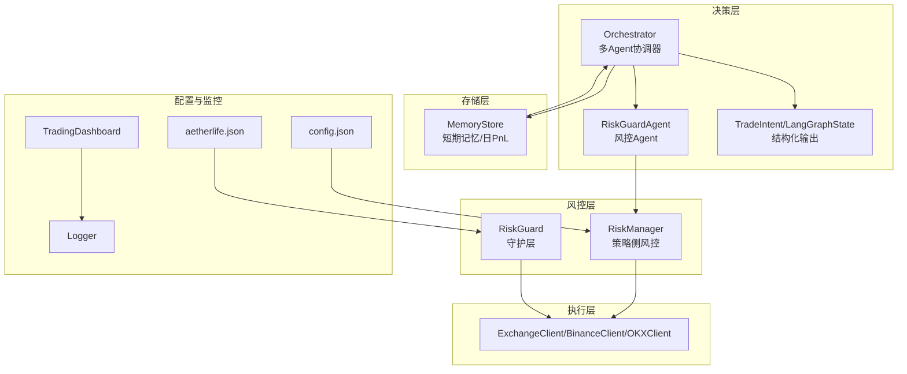
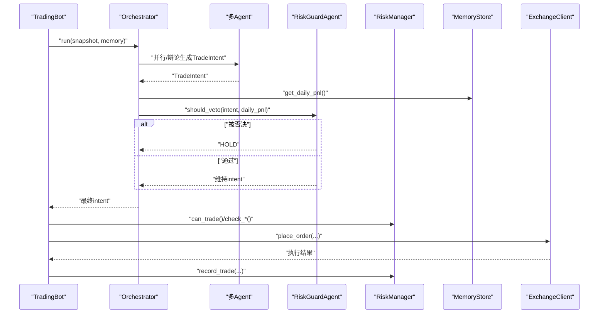
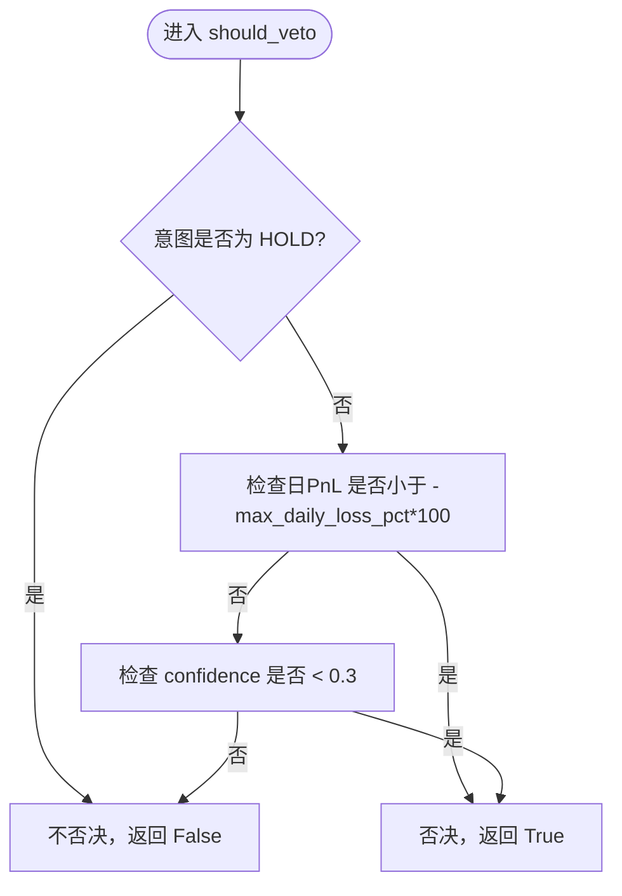
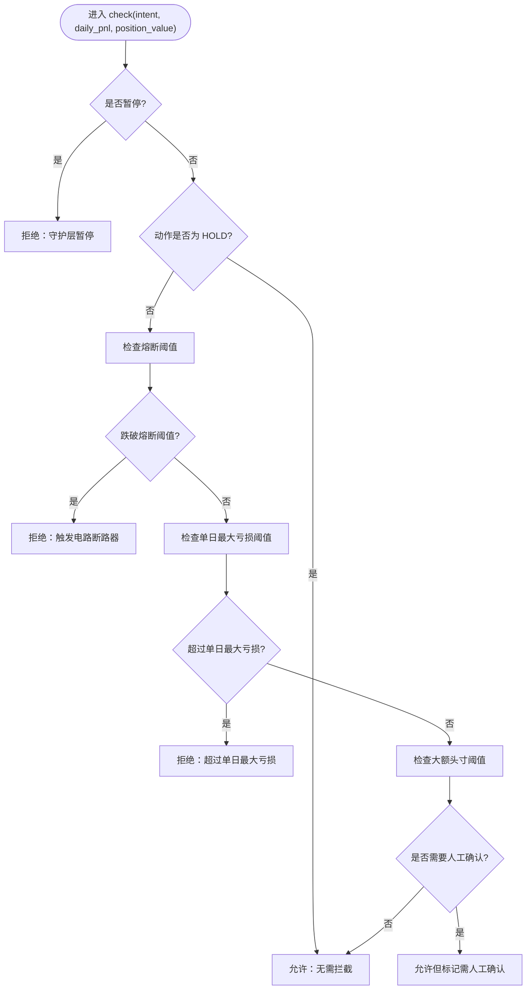
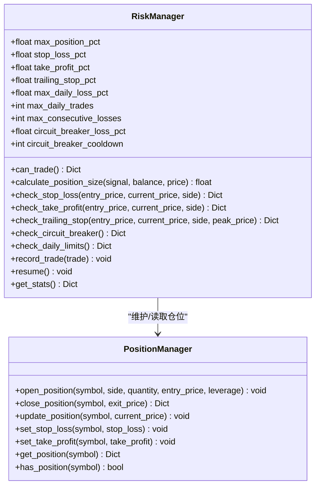
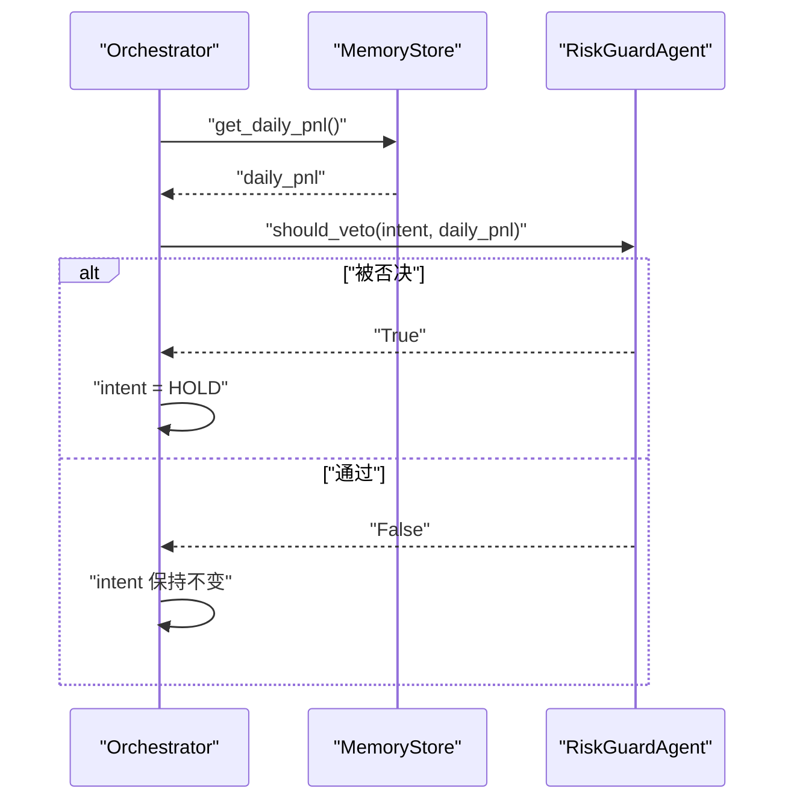
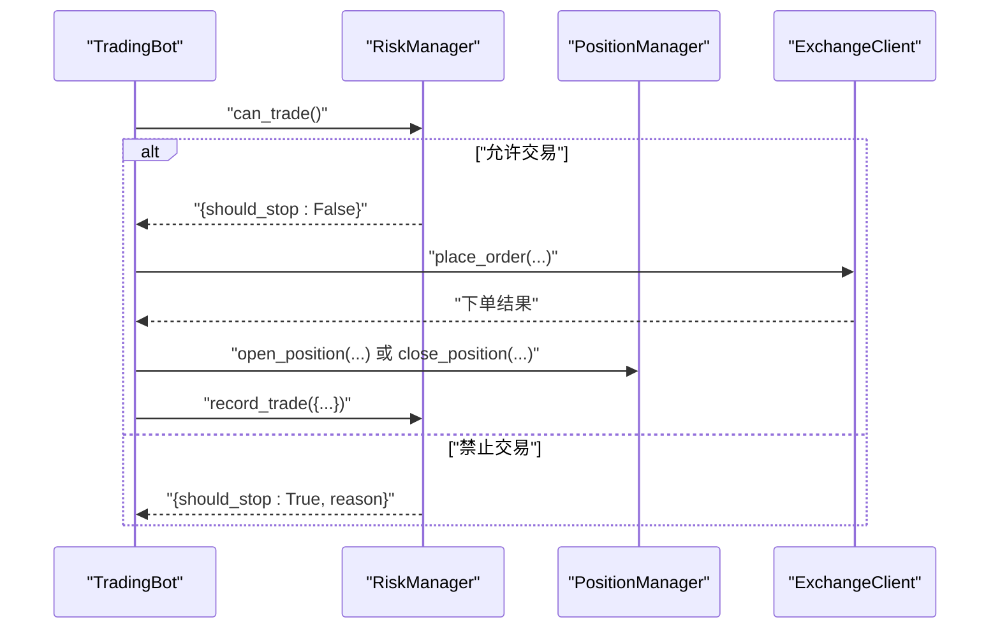
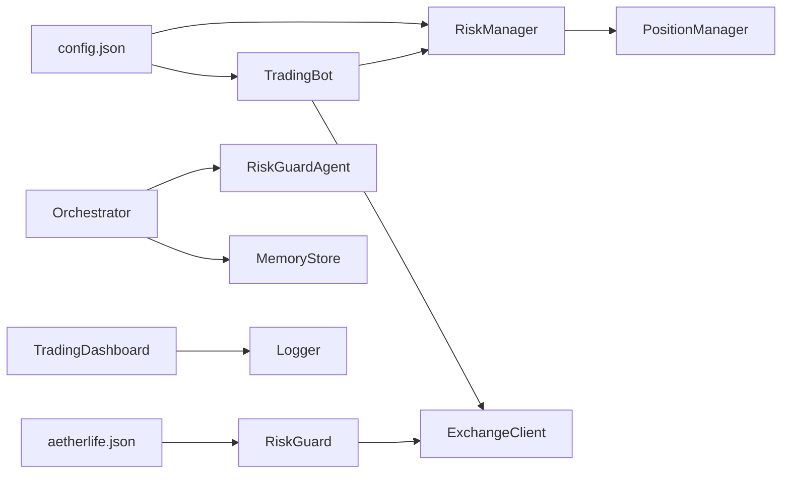

# 守护层风控系统

<cite>
**本文引用的文件**
- [src/aetherlife/guard/risk_guard.py](file://src/aetherlife/guard/risk_guard.py)
- [src/aetherlife/cognition/agents.py](file://src/aetherlife/cognition/agents.py)
- [src/aetherlife/cognition/orchestrator.py](file://src/aetherlife/cognition/orchestrator.py)
- [src/aetherlife/cognition/schemas.py](file://src/aetherlife/cognition/schemas.py)
- [src/aetherlife/memory/store.py](file://src/aetherlife/memory/store.py)
- [src/utils/risk_manager.py](file://src/utils/risk_manager.py)
- [src/trading_bot.py](file://src/trading_bot.py)
- [configs/config.json](file://configs/config.json)
- [configs/aetherlife.json](file://configs/aetherlife.json)
- [src/ui/dashboard.py](file://src/ui/dashboard.py)
- [src/utils/logger.py](file://src/utils/logger.py)
- [src/execution/exchange_client.py](file://src/execution/exchange_client.py)
</cite>

## 目录
1. [引言](#引言)
2. [项目结构](#项目结构)
3. [核心组件](#核心组件)
4. [架构总览](#架构总览)
5. [组件详解](#组件详解)
6. [依赖关系分析](#依赖关系分析)
7. [性能与优化](#性能与优化)
8. [故障排查指南](#故障排查指南)
9. [结论](#结论)
10. [附录](#附录)

## 引言
本文件面向AetherLife守护层风控系统，聚焦RiskGuardAgent的风险控制机制与执行流程，系统性阐述实时风险监控、阈值管理与自动防护策略；深入解析风控规则设计原理（止损止盈、仓位控制、熔断机制、日交易限制）；说明风控系统与决策层的交互方式（风险评估流程与决策否决机制）；提供参数配置、风险指标计算与异常处理示例；并给出在不同市场条件下的适应性调整与性能优化建议，以及监控界面与告警机制说明。

## 项目结构
围绕风控系统的关键文件组织如下：
- 决策层：RiskGuardAgent、Orchestrator、TradeIntent、LangGraphState
- 风控层：RiskManager（策略侧）、RiskGuard（守护层）
- 执行层：ExchangeClient（BinanceClient/OKXClient）
- 存储层：MemoryStore（短期记忆与日盈亏统计）
- 配置：config.json、aetherlife.json
- 监控：dashboard.py、logger

图表来源
- [src/aetherlife/cognition/orchestrator.py](file://src/aetherlife/cognition/orchestrator.py#L1-L93)
- [src/aetherlife/cognition/agents.py](file://src/aetherlife/cognition/agents.py#L50-L68)
- [src/aetherlife/cognition/schemas.py](file://src/aetherlife/cognition/schemas.py#L32-L58)
- [src/aetherlife/memory/store.py](file://src/aetherlife/memory/store.py#L140-L145)
- [src/utils/risk_manager.py](file://src/utils/risk_manager.py#L12-L52)
- [src/aetherlife/guard/risk_guard.py](file://src/aetherlife/guard/risk_guard.py#L23-L84)
- [src/execution/exchange_client.py](file://src/execution/exchange_client.py#L20-L85)
- [configs/config.json](file://configs/config.json#L15-L20)
- [configs/aetherlife.json](file://configs/aetherlife.json#L7-L10)
- [src/ui/dashboard.py](file://src/ui/dashboard.py#L13-L385)
- [src/utils/logger.py](file://src/utils/logger.py#L12-L34)

章节来源
- [src/aetherlife/cognition/orchestrator.py](file://src/aetherlife/cognition/orchestrator.py#L1-L93)
- [src/aetherlife/cognition/agents.py](file://src/aetherlife/cognition/agents.py#L50-L68)
- [src/aetherlife/cognition/schemas.py](file://src/aetherlife/cognition/schemas.py#L32-L58)
- [src/aetherlife/memory/store.py](file://src/aetherlife/memory/store.py#L140-L145)
- [src/utils/risk_manager.py](file://src/utils/risk_manager.py#L12-L52)
- [src/aetherlife/guard/risk_guard.py](file://src/aetherlife/guard/risk_guard.py#L23-L84)
- [src/execution/exchange_client.py](file://src/execution/exchange_client.py#L20-L85)
- [configs/config.json](file://configs/config.json#L15-L20)
- [configs/aetherlife.json](file://configs/aetherlife.json#L7-L10)
- [src/ui/dashboard.py](file://src/ui/dashboard.py#L13-L385)
- [src/utils/logger.py](file://src/utils/logger.py#L12-L34)

## 核心组件
- RiskGuardAgent：仅做“否决”判断，不发起交易；在决策层被调用以决定是否阻止某笔意图。
- RiskGuard（守护层）：执行前的最后一道关卡，负责熔断、单日最大亏损、大额人工复核（HITL）与审计。
- RiskManager（策略侧）：负责仓位规模、止损止盈、追踪止损、熔断冷却、日交易限制与连败限制。
- MemoryStore：提供短期记忆与日累计PnL，供决策层与风控层使用。
- ExchangeClient：抽象交易所接口，实现下单、撤单、仓位与杠杆设置等。
- 配置与监控：config.json定义策略与风控参数；aetherlife.json启用审计日志；dashboard提供可视化监控。

章节来源
- [src/aetherlife/cognition/agents.py](file://src/aetherlife/cognition/agents.py#L50-L68)
- [src/aetherlife/guard/risk_guard.py](file://src/aetherlife/guard/risk_guard.py#L23-L84)
- [src/utils/risk_manager.py](file://src/utils/risk_manager.py#L12-L52)
- [src/aetherlife/memory/store.py](file://src/aetherlife/memory/store.py#L140-L145)
- [src/execution/exchange_client.py](file://src/execution/exchange_client.py#L20-L85)
- [configs/config.json](file://configs/config.json#L15-L20)
- [configs/aetherlife.json](file://configs/aetherlife.json#L7-L10)
- [src/ui/dashboard.py](file://src/ui/dashboard.py#L13-L385)

## 架构总览
风控系统贯穿“决策层—风控层—执行层”，形成闭环：
- 决策层：多Agent聚合或辩论后输出TradeIntent，随后由RiskGuardAgent进行否决判断。
- 风控层：RiskManager在策略侧进行日常风控与止盈止损；RiskGuard在执行前进行熔断与HITL审计。
- 执行层：ExchangeClient执行下单，PositionManager跟踪仓位与PnL，RiskManager记录交易并更新日统计。
- 存储层：MemoryStore提供短期记忆与日PnL，支撑决策与风控判断。

图表来源
- [src/aetherlife/cognition/orchestrator.py](file://src/aetherlife/cognition/orchestrator.py#L38-L53)
- [src/aetherlife/cognition/agents.py](file://src/aetherlife/cognition/agents.py#L50-L68)
- [src/aetherlife/memory/store.py](file://src/aetherlife/memory/store.py#L140-L145)
- [src/utils/risk_manager.py](file://src/utils/risk_manager.py#L175-L194)
- [src/execution/exchange_client.py](file://src/execution/exchange_client.py#L226-L275)

## 组件详解

### RiskGuardAgent（决策层否决）
- 角色定位：仅输出HOLD或维持原意，核心职责是“否决”。
- 否决判定：
  - 若意图动作为HOLD，则不否决；
  - 若日PnL低于设定的最大日亏损阈值，则否决；
  - 若意图置信度过低，则否决。
- 与Orchestrator协作：Orchestrator在聚合/辩论后调用其should_veto，若返回True，将强制改为HOLD。

图表来源
- [src/aetherlife/cognition/agents.py](file://src/aetherlife/cognition/agents.py#L59-L68)

章节来源
- [src/aetherlife/cognition/agents.py](file://src/aetherlife/cognition/agents.py#L50-L68)
- [src/aetherlife/cognition/orchestrator.py](file://src/aetherlife/cognition/orchestrator.py#L48-L53)

### RiskGuard（守护层执行前检查）
- 熔断与单日最大亏损：当日PnL跌破熔断阈值或超过单日最大亏损阈值时拒绝执行。
- 大额人工复核（HITL）：当头寸价值达到阈值时，返回“需人工确认”，由上层流程介入。
- 暂停机制：支持手动暂停与原因标记，暂停期间所有意图被拒绝。
- 审计：统一记录审计事件，支持控制台、文件与回调三种输出。

图表来源
- [src/aetherlife/guard/risk_guard.py](file://src/aetherlife/guard/risk_guard.py#L48-L68)

章节来源
- [src/aetherlife/guard/risk_guard.py](file://src/aetherlife/guard/risk_guard.py#L23-L84)

### RiskManager（策略侧风控）
- 仓位管理：基于账户余额、最大仓位比例与信号强度计算下单数量，并约束最小/最大仓位。
- 止损止盈：按方向计算当前收益/回撤百分比，达到阈值即触发。
- 追踪止损：在盈利超过阈值后，动态跟随止盈价格，保护利润。
- 熔断机制：当日PnL跌破熔断阈值后进入冷却期，期间暂停交易并记录原因。
- 日交易限制与连败限制：限制单日交易次数与连续亏损次数，防止情绪化交易。
- 统计与恢复：提供日统计、连败计数、暂停状态与恢复接口。

图表来源
- [src/utils/risk_manager.py](file://src/utils/risk_manager.py#L12-L241)

章节来源
- [src/utils/risk_manager.py](file://src/utils/risk_manager.py#L12-L241)

### 决策层与风控交互（Orchestrator）
- 多Agent聚合或辩论后生成TradeIntent，随后调用RiskGuardAgent.should_veto(intent, daily_pnl)。
- 若被否决，将意图置为HOLD；否则保留原意图。
- daily_pnl来源于MemoryStore.get_daily_pnl()，确保风控基于当日累计盈亏。

图表来源
- [src/aetherlife/cognition/orchestrator.py](file://src/aetherlife/cognition/orchestrator.py#L48-L53)
- [src/aetherlife/memory/store.py](file://src/aetherlife/memory/store.py#L140-L145)
- [src/aetherlife/cognition/agents.py](file://src/aetherlife/cognition/agents.py#L59-L68)

章节来源
- [src/aetherlife/cognition/orchestrator.py](file://src/aetherlife/cognition/orchestrator.py#L38-L53)
- [src/aetherlife/memory/store.py](file://src/aetherlife/memory/store.py#L140-L145)
- [src/aetherlife/cognition/agents.py](file://src/aetherlife/cognition/agents.py#L59-L68)

### 执行层与风控联动
- TradingBot在执行信号前调用RiskManager.can_trade()进行策略侧风控检查。
- 执行下单后，RiskManager.record_trade()更新日统计；PositionManager负责开仓/平仓与PnL计算。
- ExchangeClient封装下单、撤单、杠杆设置等，保障精度与签名安全。

图表来源
- [src/trading_bot.py](file://src/trading_bot.py#L115-L205)
- [src/utils/risk_manager.py](file://src/utils/risk_manager.py#L175-L194)
- [src/utils/risk_manager.py](file://src/utils/risk_manager.py#L196-L216)
- [src/execution/exchange_client.py](file://src/execution/exchange_client.py#L226-L275)

章节来源
- [src/trading_bot.py](file://src/trading_bot.py#L115-L205)
- [src/utils/risk_manager.py](file://src/utils/risk_manager.py#L175-L216)
- [src/execution/exchange_client.py](file://src/execution/exchange_client.py#L226-L275)

## 依赖关系分析
- 决策层依赖：RiskGuardAgent依赖TradeIntent与Action枚举；Orchestrator依赖MemoryStore获取日PnL。
- 风控层依赖：RiskManager依赖配置参数；RiskGuard依赖审计回调与日志路径。
- 执行层依赖：ExchangeClient依赖aiohttp会话与签名；TradingBot串联策略、风控与执行。
- 配置依赖：config.json提供策略与风控参数；aetherlife.json启用审计日志路径。

图表来源
- [configs/config.json](file://configs/config.json#L15-L20)
- [configs/aetherlife.json](file://configs/aetherlife.json#L7-L10)
- [src/aetherlife/cognition/orchestrator.py](file://src/aetherlife/cognition/orchestrator.py#L38-L53)
- [src/aetherlife/memory/store.py](file://src/aetherlife/memory/store.py#L140-L145)
- [src/utils/risk_manager.py](file://src/utils/risk_manager.py#L12-L52)
- [src/aetherlife/guard/risk_guard.py](file://src/aetherlife/guard/risk_guard.py#L23-L43)
- [src/trading_bot.py](file://src/trading_bot.py#L50-L52)
- [src/execution/exchange_client.py](file://src/execution/exchange_client.py#L20-L85)
- [src/ui/dashboard.py](file://src/ui/dashboard.py#L13-L385)
- [src/utils/logger.py](file://src/utils/logger.py#L12-L34)

章节来源
- [configs/config.json](file://configs/config.json#L15-L20)
- [configs/aetherlife.json](file://configs/aetherlife.json#L7-L10)
- [src/aetherlife/cognition/orchestrator.py](file://src/aetherlife/cognition/orchestrator.py#L38-L53)
- [src/aetherlife/memory/store.py](file://src/aetherlife/memory/store.py#L140-L145)
- [src/utils/risk_manager.py](file://src/utils/risk_manager.py#L12-L52)
- [src/aetherlife/guard/risk_guard.py](file://src/aetherlife/guard/risk_guard.py#L23-L43)
- [src/trading_bot.py](file://src/trading_bot.py#L50-L52)
- [src/execution/exchange_client.py](file://src/execution/exchange_client.py#L20-L85)
- [src/ui/dashboard.py](file://src/ui/dashboard.py#L13-L385)
- [src/utils/logger.py](file://src/utils/logger.py#L12-L34)

## 性能与优化
- 并行与异步：决策层多Agent并行与Orchestrator异步聚合，降低延迟；执行层使用aiohttp提升I/O吞吐。
- 精度与容错：ExchangeClient对下单数量按最小步进取整，避免交易所错误；风控层对边界条件（如价格/余额<=0）进行保护。
- 冷却与暂停：熔断冷却与手动暂停减少极端行情下的反复试错成本。
- 监控与日志：统一Logger与可选审计文件/回调，便于问题定位与审计留痕。

章节来源
- [src/aetherlife/cognition/orchestrator.py](file://src/aetherlife/cognition/orchestrator.py#L48-L49)
- [src/execution/exchange_client.py](file://src/execution/exchange_client.py#L242-L254)
- [src/utils/risk_manager.py](file://src/utils/risk_manager.py#L62-L71)
- [src/utils/logger.py](file://src/utils/logger.py#L12-L34)
- [src/aetherlife/guard/risk_guard.py](file://src/aetherlife/guard/risk_guard.py#L70-L84)

## 故障排查指南
- 审计与日志
  - 启用审计日志：在aetherlife.json中开启审计并指定日志路径。
  - 审计写入失败：RiskGuard的audit方法对文件写入进行异常捕获，不影响主流程。
- 风控否决
  - 若出现频繁HOLD，检查RiskGuardAgent的阈值与daily_pnl来源；确认MemoryStore.get_daily_pnl()正确。
- 执行失败
  - ExchangeClient对非2xx与错误码进行异常抛出；下单数量精度不足会导致错误，需确保按步进取整。
- 监控界面
  - TradingDashboard提供状态、订单与统计API；若UI显示异常，检查后端API响应与网络连通性。

章节来源
- [configs/aetherlife.json](file://configs/aetherlife.json#L7-L10)
- [src/aetherlife/guard/risk_guard.py](file://src/aetherlife/guard/risk_guard.py#L70-L84)
- [src/aetherlife/cognition/orchestrator.py](file://src/aetherlife/cognition/orchestrator.py#L50-L52)
- [src/aetherlife/memory/store.py](file://src/aetherlife/memory/store.py#L140-L145)
- [src/execution/exchange_client.py](file://src/execution/exchange_client.py#L165-L170)
- [src/ui/dashboard.py](file://src/ui/dashboard.py#L338-L375)

## 结论
AetherLife守护层风控系统通过“决策层否决+策略侧风控+执行前守护”的三层协同，实现了对实时风险的强约束与可审计。RiskGuardAgent与RiskGuard分别承担“意图否决”与“执行拦截”，配合RiskManager的多维风控规则，有效覆盖止损止盈、熔断冷却、日交易限制与大额人工复核场景。结合MemoryStore的日统计与ExchangeClient的稳健执行，系统在不同市场条件下具备良好的稳定性与可运维性。

## 附录

### 风控参数配置示例
- 策略与风控参数（config.json）
  - 最大仓位比例、止损止盈、单日最大亏损、最大交易次数、连败限制、熔断阈值等。
- 守护层审计配置（aetherlife.json）
  - 启用审计日志与日志路径，便于离线审计与问题回溯。

章节来源
- [configs/config.json](file://configs/config.json#L15-L20)
- [configs/aetherlife.json](file://configs/aetherlife.json#L7-L10)

### 风险指标计算要点
- 日PnL：来自MemoryStore.get_daily_pnl()，按交易事件的pnl累加。
- 仓位规模：基于账户余额、最大仓位比例与信号强度，同时受最小/最大仓位约束。
- 止损止盈：按入场价与当前价计算百分比，方向不同公式略有差异。
- 追踪止损：在盈利超过阈值后，动态跟随止盈价格，保护利润。

章节来源
- [src/aetherlife/memory/store.py](file://src/aetherlife/memory/store.py#L140-L145)
- [src/utils/risk_manager.py](file://src/utils/risk_manager.py#L62-L71)
- [src/utils/risk_manager.py](file://src/utils/risk_manager.py#L73-L105)
- [src/utils/risk_manager.py](file://src/utils/risk_manager.py#L107-L127)

### 监控界面与告警机制
- 仪表盘：提供总权益、持仓、今日交易、胜率等关键指标；支持快速交易按钮与策略状态展示。
- 告警：统一Logger输出，结合审计文件与可选回调，满足生产环境告警集成需求。

章节来源
- [src/ui/dashboard.py](file://src/ui/dashboard.py#L13-L385)
- [src/utils/logger.py](file://src/utils/logger.py#L12-L34)
- [src/aetherlife/guard/risk_guard.py](file://src/aetherlife/guard/risk_guard.py#L70-L84)