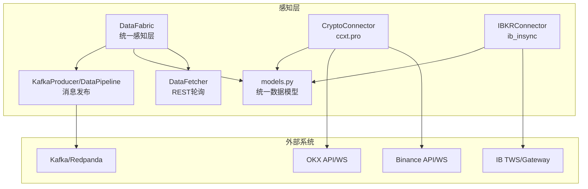
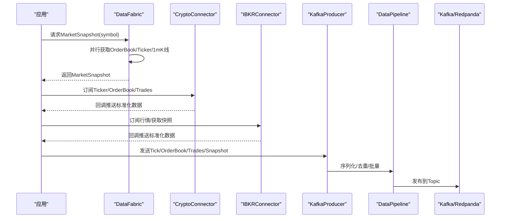
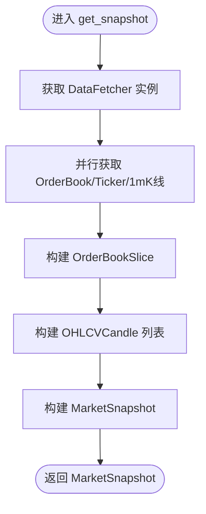
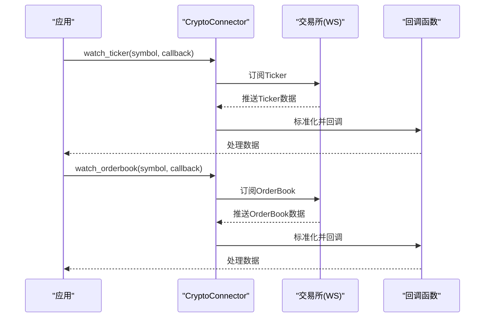
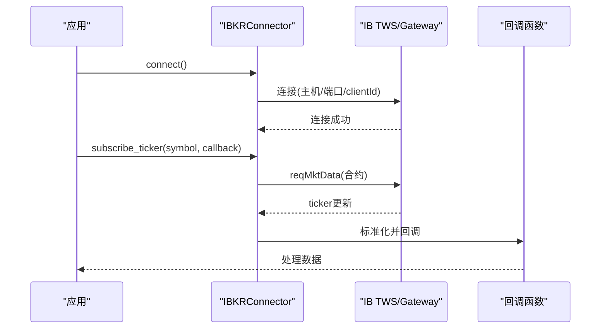
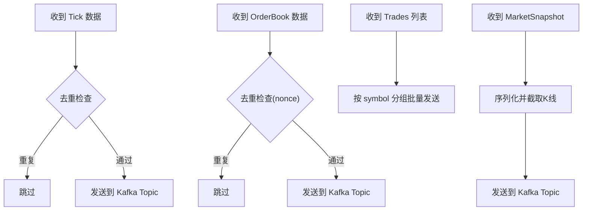
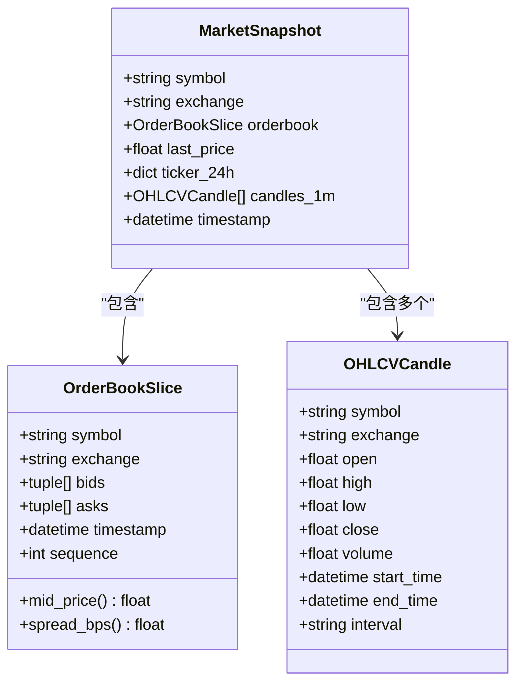
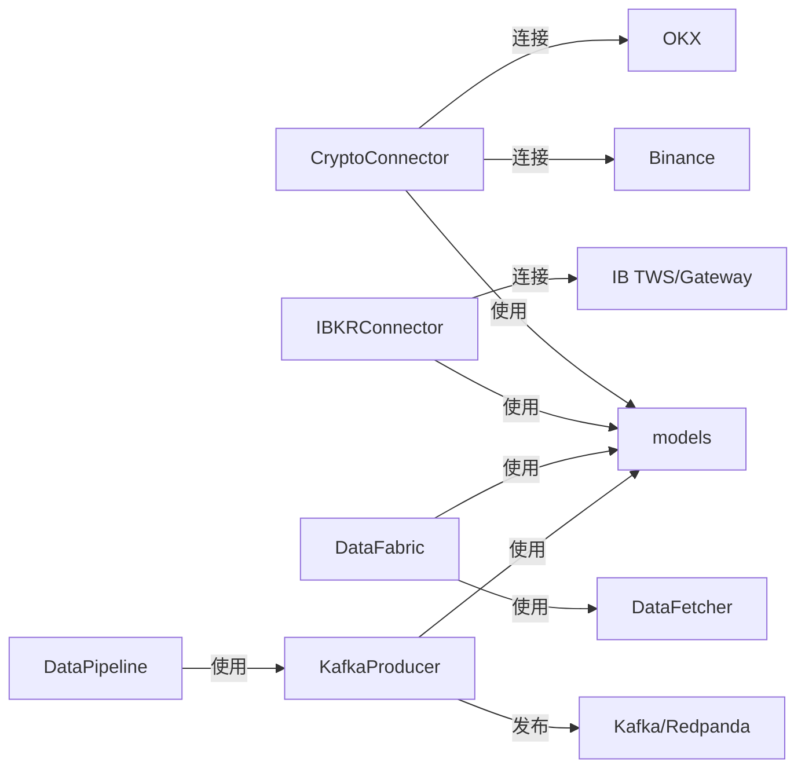

# 感知层设计

<cite>
**本文引用的文件列表**
- [fabric.py](file://src/aetherlife/perception/fabric.py)
- [crypto_connector.py](file://src/aetherlife/perception/crypto_connector.py)
- [ibkr_connector.py](file://src/aetherlife/perception/ibkr_connector.py)
- [kafka_producer.py](file://src/aetherlife/perception/kafka_producer.py)
- [models.py](file://src/aetherlife/perception/models.py)
- [data_fetcher.py](file://src/data/data_fetcher.py)
- [perception_connector_demo.py](file://scripts/perception_connector_demo.py)
- [aetherlife.json](file://configs/aetherlife.json)
- [config.py](file://src/aetherlife/config.py)
- [requirements.txt](file://requirements.txt)
- [.env.example](file://.env.example)
</cite>

## 目录
1. [引言](#引言)
2. [项目结构](#项目结构)
3. [核心组件](#核心组件)
4. [架构总览](#架构总览)
5. [组件详细分析](#组件详细分析)
6. [依赖关系分析](#依赖关系分析)
7. [性能考量](#性能考量)
8. [故障排查指南](#故障排查指南)
9. [结论](#结论)
10. [附录](#附录)

## 引言
本文件面向AetherLife感知层，聚焦DataFabric数据获取架构的设计与实现，涵盖多数据源集成、实时数据流处理与数据标准化机制。同时，详细说明CryptoConnector与IBKRConnector的实现方式（API连接管理、数据订阅机制、错误处理策略），以及KafkaProducer的消息发布机制与数据传输优化。文档提供配置示例、连接参数设置与性能调优建议，并阐述感知层如何为上层认知系统提供高质量的市场数据输入。

## 项目结构
感知层位于src/aetherlife/perception目录，围绕统一数据模型与多源数据适配器构建，向上提供标准化的MarketSnapshot，向下对接不同交易所与数据通道（REST/WS/Kafka）。关键文件如下：
- models.py：统一数据模型（OrderBookSlice、OHLCVCandle、MarketSnapshot）
- fabric.py：DataFabric统一感知层，聚合多源数据并生成MarketSnapshot
- crypto_connector.py：基于ccxt.pro的加密货币连接器，支持多交易所WebSocket订阅与快照获取
- ibkr_connector.py：基于ib_insync的IBKR连接器，支持TWS/Gateway连接、合约创建与行情订阅
- kafka_producer.py：Kafka/Redpanda生产者与数据管道，负责消息发布、序列化与去重
- data_fetcher.py：底层数据获取器（Binance/OKX），为DataFabric提供REST轮询能力
- perception_connector_demo.py：连接器演示脚本，展示各组件的使用方式
- config.py：全局配置定义，含DataFabricConfig等
- aetherlife.json：运行时配置样例
- requirements.txt：第三方依赖清单
- .env.example：API Key环境变量模板

图表来源
- [fabric.py](file://src/aetherlife/perception/fabric.py#L13-L88)
- [crypto_connector.py](file://src/aetherlife/perception/crypto_connector.py#L23-L370)
- [ibkr_connector.py](file://src/aetherlife/perception/ibkr_connector.py#L36-L323)
- [kafka_producer.py](file://src/aetherlife/perception/kafka_producer.py#L26-L287)
- [data_fetcher.py](file://src/data/data_fetcher.py#L17-L434)

章节来源
- [fabric.py](file://src/aetherlife/perception/fabric.py#L1-L88)
- [models.py](file://src/aetherlife/perception/models.py#L1-L64)
- [crypto_connector.py](file://src/aetherlife/perception/crypto_connector.py#L1-L370)
- [ibkr_connector.py](file://src/aetherlife/perception/ibkr_connector.py#L1-L323)
- [kafka_producer.py](file://src/aetherlife/perception/kafka_producer.py#L1-L287)
- [data_fetcher.py](file://src/data/data_fetcher.py#L1-L434)

## 核心组件
- 统一数据模型：OrderBookSlice、OHLCVCandle、MarketSnapshot，提供跨交易所一致的数据结构与计算方法（如mid_price、spread_bps）。
- DataFabric：多源数据聚合器，支持REST轮询（Phase 0）与WebSocket推送（Phase 1+），统一生成MarketSnapshot。
- CryptoConnector：基于ccxt.pro的加密货币连接器，支持多交易所WebSocket订阅（Ticker/OrderBook/Trades）、自动重连与回调分发。
- IBKRConnector：基于ib_insync的IBKR连接器，支持TWS/Gateway连接、合约创建（股票/期货/外汇/A股）、行情订阅与断线重连。
- KafkaProducer/DataPipeline：消息发布与数据管道，负责Topic路由、序列化、批量发送、去重与时序对齐。

章节来源
- [models.py](file://src/aetherlife/perception/models.py#L9-L64)
- [fabric.py](file://src/aetherlife/perception/fabric.py#L13-L88)
- [crypto_connector.py](file://src/aetherlife/perception/crypto_connector.py#L23-L370)
- [ibkr_connector.py](file://src/aetherlife/perception/ibkr_connector.py#L36-L323)
- [kafka_producer.py](file://src/aetherlife/perception/kafka_producer.py#L26-L287)

## 架构总览
感知层采用“统一模型 + 多源适配 + 消息管道”的三层架构：
- 统一模型层：以OrderBookSlice/OHLCVCandle/MarketSnapshot为核心，屏蔽不同交易所的数据差异。
- 多源适配层：DataFabric负责REST轮询聚合；CryptoConnector/IBKRConnector分别对接加密与传统市场WebSocket。
- 消息管道层：KafkaProducer/DataPipeline将标准化数据发布到Kafka/Redpanda，供上层认知系统消费。

图表来源
- [fabric.py](file://src/aetherlife/perception/fabric.py#L32-L82)
- [crypto_connector.py](file://src/aetherlife/perception/crypto_connector.py#L87-L330)
- [ibkr_connector.py](file://src/aetherlife/perception/ibkr_connector.py#L158-L284)
- [kafka_producer.py](file://src/aetherlife/perception/kafka_producer.py#L76-L217)

## 组件详细分析

### DataFabric：多数据源统一感知层
- 设计目标：在Phase 0阶段通过REST轮询聚合订单簿、Ticker与K线，在Phase 1+阶段切换为WebSocket推送并统一为OrderBookSlice/MarketSnapshot。
- 关键特性：
  - 并行获取：使用asyncio.gather并行拉取订单簿、Ticker与K线，提升吞吐。
  - 标准化：将不同交易所返回的字段映射为统一格式，构造OrderBookSlice与OHLCVCandle。
  - 时间戳：统一使用UTC时间，保证跨系统一致性。
- 适用场景：为上层认知系统提供一次性消费的MarketSnapshot，满足策略回放与实时分析需求。

图表来源
- [fabric.py](file://src/aetherlife/perception/fabric.py#L32-L82)
- [data_fetcher.py](file://src/data/data_fetcher.py#L40-L71)

章节来源
- [fabric.py](file://src/aetherlife/perception/fabric.py#L13-L88)
- [data_fetcher.py](file://src/data/data_fetcher.py#L17-L434)

### CryptoConnector：加密货币连接器（ccxt.pro）
- 连接管理：
  - 支持多交易所（Binance/Bybit/OKX等），测试网与主网URL切换。
  - 初始化时加载市场并建立连接，失败时记录错误并保持断开状态。
- 数据订阅机制：
  - watch_ticker/watch_orderbook/watch_trades：分别订阅实时Ticker、订单簿与成交，内部维护任务与回调列表。
  - 标准化输出：统一字段（symbol/exchange/bids/asks/last_price等），便于上层统一处理。
  - 自动重连：异常时等待5秒后重连，确保服务连续性。
- 错误处理策略：
  - 任务级异常捕获与日志记录，避免单个订阅影响整体。
  - 回调执行失败不中断主流程，继续分发其他订阅数据。
- 快照获取：get_snapshot通过REST并行获取Ticker与OrderBook，构建MarketSnapshot。

图表来源
- [crypto_connector.py](file://src/aetherlife/perception/crypto_connector.py#L87-L216)

章节来源
- [crypto_connector.py](file://src/aetherlife/perception/crypto_connector.py#L23-L370)

### IBKRConnector：IBKR TWS/Gateway连接器（ib_insync）
- 连接管理：
  - 支持配置主机、端口、clientId与只读模式，连接成功后注册断线回调。
  - 断线时启动指数退避重连循环，最大重试次数可控。
- 合约创建与订阅：
  - create_contract：支持股票、期货、外汇与A股（Stock Connect）合约创建。
  - subscribe_ticker：订阅实时行情，绑定ticker更新事件，回调标准化数据。
  - get_snapshot：一次性获取快照，构建MarketSnapshot并取消订阅。
- 错误处理策略：
  - 连接失败、合约无效、订阅失败均记录日志并抛出异常。
  - 行情更新回调异常不影响其他回调执行。

图表来源
- [ibkr_connector.py](file://src/aetherlife/perception/ibkr_connector.py#L59-L204)

章节来源
- [ibkr_connector.py](file://src/aetherlife/perception/ibkr_connector.py#L36-L323)

### KafkaProducer/DataPipeline：消息发布与数据管道
- KafkaProducer：
  - 支持多种Topic（Tick/OrderBook/Trades/Snapshot），自动JSON序列化与gzip压缩。
  - 批量发送优化：linger_ms=10，acks=all，提高吞吐与可靠性。
  - 错误处理：捕获KafkaError与序列化异常，记录日志但不阻塞主线程。
- DataPipeline：
  - 去重：基于symbol/exchange的时间戳或nonce进行去重。
  - 缓冲与批量：按symbol分组批量发送Trades，减少网络开销。
  - 时序对齐：对Snapshot中的candles_1m截取最近30根，保证上层消费效率。

图表来源
- [kafka_producer.py](file://src/aetherlife/perception/kafka_producer.py#L76-L217)
- [kafka_producer.py](file://src/aetherlife/perception/kafka_producer.py#L220-L287)

章节来源
- [kafka_producer.py](file://src/aetherlife/perception/kafka_producer.py#L26-L287)

### 统一数据模型：OrderBookSlice/OHLCVCandle/MarketSnapshot
- OrderBookSlice：统一订单簿格式，提供mid_price与spread_bps计算，便于上层策略快速评估流动性与价差。
- OHLCVCandle：统一K线格式，包含开始/结束时间与时间间隔，便于时间序列分析。
- MarketSnapshot：一次性消费的完整市场视图，包含订单簿、最新价格、24小时统计与K线片段。

图表来源
- [models.py](file://src/aetherlife/perception/models.py#L15-L64)

章节来源
- [models.py](file://src/aetherlife/perception/models.py#L1-L64)

## 依赖关系分析
- 第三方依赖：
  - ccxt/pro：加密货币WebSocket与REST访问。
  - ib_insync：IBKR TWS/Gateway连接与合约管理。
  - aiokafka：异步Kafka生产者，支持批量与压缩。
  - aiohttp/websockets：异步HTTP与WebSocket客户端。
  - pandas/numpy：数据处理与类型转换。
- 组件耦合：
  - DataFabric依赖DataFetcher（REST轮询）与models（统一模型）。
  - CryptoConnector/IBKRConnector依赖models进行数据标准化。
  - KafkaProducer/DataPipeline依赖models进行序列化与Topic路由。
- 外部依赖点：
  - 交易所API/WS（Binance/OKX/IB TWS/Gateway）。
  - Kafka/Redpanda集群。

图表来源
- [crypto_connector.py](file://src/aetherlife/perception/crypto_connector.py#L11-L16)
- [ibkr_connector.py](file://src/aetherlife/perception/ibkr_connector.py#L12-L19)
- [kafka_producer.py](file://src/aetherlife/perception/kafka_producer.py#L13-L19)
- [data_fetcher.py](file://src/data/data_fetcher.py#L6-L9)
- [requirements.txt](file://requirements.txt#L34-L38)

章节来源
- [requirements.txt](file://requirements.txt#L1-L92)
- [crypto_connector.py](file://src/aetherlife/perception/crypto_connector.py#L11-L16)
- [ibkr_connector.py](file://src/aetherlife/perception/ibkr_connector.py#L12-L19)
- [kafka_producer.py](file://src/aetherlife/perception/kafka_producer.py#L13-L19)
- [data_fetcher.py](file://src/data/data_fetcher.py#L6-L9)

## 性能考量
- 并行化与批量化：
  - DataFabric使用asyncio.gather并行获取三类数据，降低端到端延迟。
  - KafkaProducer设置linger_ms=10与acks=all，提升吞吐与可靠性。
- 压缩与序列化：
  - gzip压缩减少带宽占用；JSON序列化统一消息格式。
- 去重与时序对齐：
  - DataPipeline基于时间戳与nonce去重，避免重复消息影响上层分析。
  - Snapshot中K线截取最近30根，兼顾内存与分析时效。
- 连接与重连：
  - CryptoConnector/IBKRConnector具备自动重连与指数退避，保障服务连续性。
- 资源释放：
  - 组件提供close/flush方法，确保任务取消、连接关闭与缓冲区清空。

[本节为通用性能指导，无需具体文件分析]

## 故障排查指南
- 连接失败：
  - CryptoConnector：检查ccxt.pro安装与API Key/Secret配置，确认测试网URL正确。
  - IBKRConnector：确认TWS/Gateway运行、端口与clientId配置正确。
  - KafkaProducer：检查bootstrap_servers可达性与网络权限。
- 数据异常：
  - DataFabric：确认DataFetcher返回数据格式与字段映射正确。
  - CryptoConnector：查看Ticker/OrderBook回调日志，定位异常数据。
  - IBKRConnector：检查合约创建与reqMktData结果，关注断线重连日志。
- 消息丢失：
  - KafkaProducer：检查acks=all与flush调用，确保消息发送完成。
  - DataPipeline：确认去重逻辑与缓冲区大小配置合理。

章节来源
- [crypto_connector.py](file://src/aetherlife/perception/crypto_connector.py#L50-L86)
- [ibkr_connector.py](file://src/aetherlife/perception/ibkr_connector.py#L59-L87)
- [kafka_producer.py](file://src/aetherlife/perception/kafka_producer.py#L54-L75)
- [data_fetcher.py](file://src/data/data_fetcher.py#L14-L26)

## 结论
AetherLife感知层通过统一数据模型与多源适配器，实现了对加密与传统市场的统一接入；通过KafkaProducer/DataPipeline完成标准化消息发布，为上层认知系统提供稳定、高效、可扩展的市场数据输入。在性能方面，采用并行化、批量化与压缩等优化手段；在可靠性方面，通过自动重连与去重机制保障数据质量。

[本节为总结，无需具体文件分析]

## 附录

### 配置示例与连接参数
- 运行时配置（aetherlife.json）：
  - symbol：默认交易对（如BTCUSDT）。
  - log_level：日志级别（INFO/DEBUG等）。
  - cognition.guard：认知与风控相关配置项。
- 环境变量（.env）：
  - BINANCE_API_KEY/BINANCE_SECRET_KEY：Binance API Key。
  - OKX_API_KEY/OKX_SECRET_KEY/OKX_PASSPHRASE：OKX API Key与Passphrase。
  - BYBIT_API_KEY/BYBIT_SECRET_KEY：Bybit API Key（可选）。
- 依赖安装：
  - pip install -r requirements.txt（包含ccxt、ib_insync、aiokafka等）。

章节来源
- [aetherlife.json](file://configs/aetherlife.json#L1-L17)
- [.env.example](file://.env.example#L1-L17)
- [requirements.txt](file://requirements.txt#L28-L38)

### 使用示例与最佳实践
- 演示脚本：
  - scripts/perception_connector_demo.py展示了CryptoConnector、IBKRConnector与KafkaPipeline的集成使用。
- 最佳实践：
  - 在生产环境使用只读API Key并限制IP白名单。
  - 合理设置DataFabric刷新间隔与Kafka批量参数，平衡延迟与吞吐。
  - 对于高频场景，优先使用WebSocket订阅并结合DataPipeline去重与时序对齐。

章节来源
- [perception_connector_demo.py](file://scripts/perception_connector_demo.py#L1-L211)