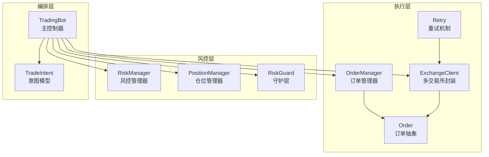
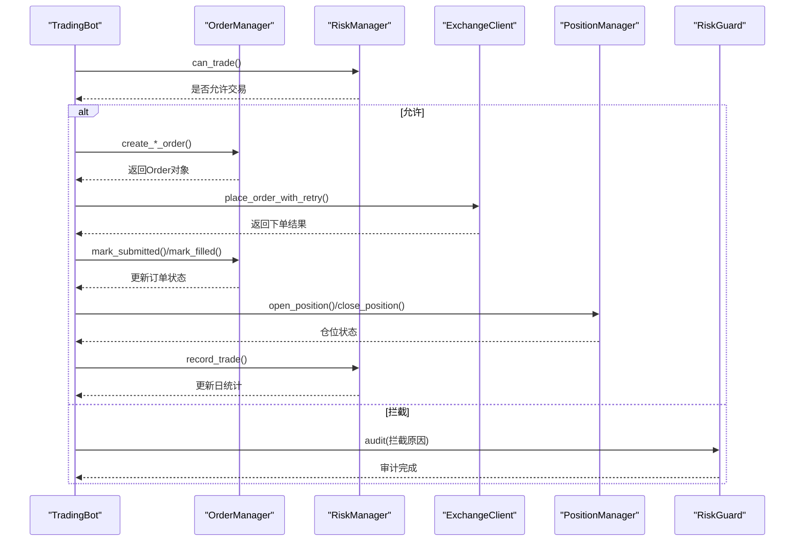
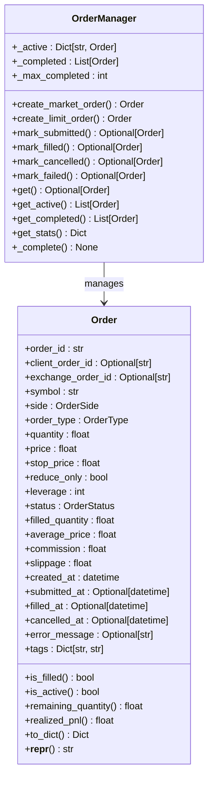
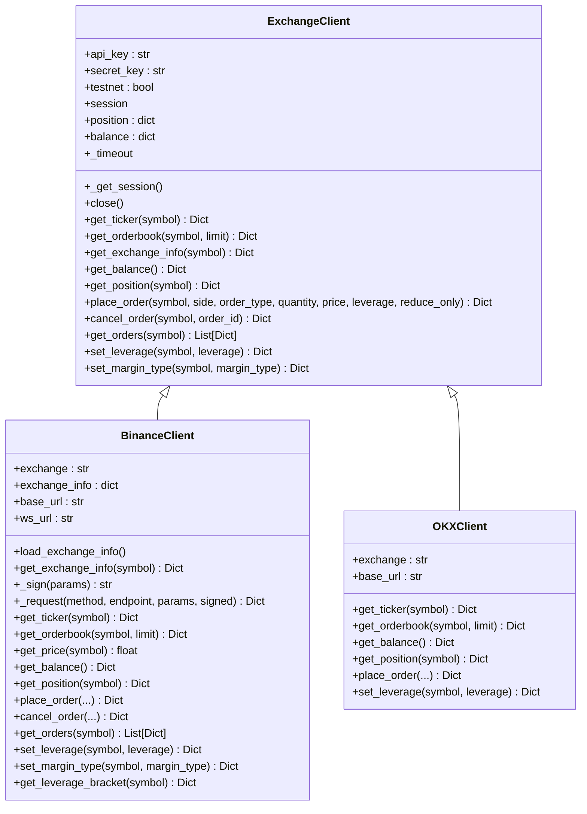
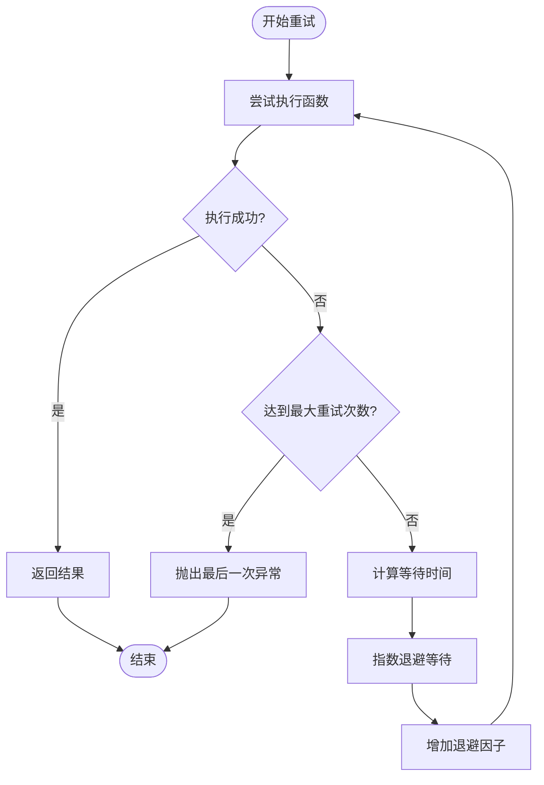
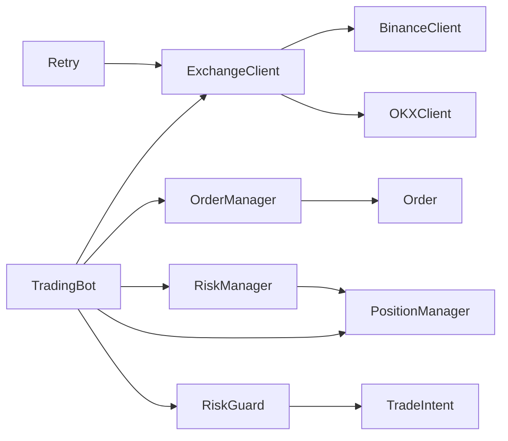

# 执行层订单管理

<cite>
**本文档引用的文件**
- [order.py](file://src/execution/order.py)
- [exchange_client.py](file://src/execution/exchange_client.py)
- [retry.py](file://src/execution/retry.py)
- [risk_guard.py](file://src/aetherlife/guard/risk_guard.py)
- [risk_manager.py](file://src/utils/risk_manager.py)
- [trading_bot.py](file://src/trading_bot.py)
- [schemas.py](file://src/aetherlife/cognition/schemas.py)
- [config.py](file://src/utils/config.py)
- [aetherlife.json](file://configs/aetherlife.json)
- [config.json](file://configs/config.json)
</cite>

## 更新摘要
**变更内容**
- 新增统一订单模型和生命周期管理
- 实现完整的重试机制（指数退避算法）
- 增强订单状态跟踪和事件处理
- 改进执行层与风控层的集成方式
- 优化订单管理器的内存管理和统计功能

## 目录
1. [简介](#简介)
2. [项目结构](#项目结构)
3. [核心组件](#核心组件)
4. [架构总览](#架构总览)
5. [详细组件分析](#详细组件分析)
6. [依赖关系分析](#依赖关系分析)
7. [性能考虑](#性能考虑)
8. [故障排查指南](#故障排查指南)
9. [结论](#结论)

## 简介
本文件面向AetherLife执行层订单管理系统，聚焦以下目标：
- 深入解释Order类的设计架构，包括订单生命周期管理、状态跟踪和事件处理机制
- 详解ExchangeClient的多交易所API封装实现，包括连接池管理、请求限流与错误重试策略
- 解释Retry机制的实现原理，包括指数退避算法、超时处理与故障恢复
- 提供订单执行的配置参数、性能优化与监控指标
- 说明订单管理与风险控制的集成方式，以及如何保证交易执行的可靠性和准确性

## 项目结构
执行层相关代码主要位于src/execution目录，配合风控层(src/utils/risk_manager.py)与守护层(src/aetherlife/guard/risk_guard.py)，并通过trading_bot.py进行编排。

**图表来源**
- [exchange_client.py](file://src/execution/exchange_client.py#L20-L85)
- [order.py](file://src/execution/order.py#L45-L123)
- [retry.py](file://src/execution/retry.py#L13-L90)
- [risk_manager.py](file://src/utils/risk_manager.py#L12-L388)
- [risk_guard.py](file://src/aetherlife/guard/risk_guard.py#L23-L84)
- [trading_bot.py](file://src/trading_bot.py#L27-L370)
- [schemas.py](file://src/aetherlife/cognition/schemas.py#L32-L59)

**章节来源**
- [exchange_client.py](file://src/execution/exchange_client.py#L1-L432)
- [trading_bot.py](file://src/trading_bot.py#L1-L370)

## 核心组件
- ExchangeClient：多交易所API封装，统一行情与交易接口，内置会话管理与错误处理
- BinanceClient/OKXClient：具体交易所实现，负责签名、请求与业务逻辑
- Order/OrderManager：统一订单模型与生命周期管理，提供状态跟踪和统计功能
- Retry：指数退避重试机制，防止网络抖动导致的指令丢失
- RiskManager/PositionManager：风控与仓位管理，提供止损止盈、熔断与日统计
- RiskGuard：守护层，执行前拦截与审计
- TradingBot：主控制器，串联数据、策略、执行与风控
- TradeIntent：结构化交易意图，支撑跨层协作

**章节来源**
- [exchange_client.py](file://src/execution/exchange_client.py#L20-L432)
- [order.py](file://src/execution/order.py#L45-L276)
- [retry.py](file://src/execution/retry.py#L13-L90)
- [risk_manager.py](file://src/utils/risk_manager.py#L12-L388)
- [risk_guard.py](file://src/aetherlife/guard/risk_guard.py#L23-L84)
- [trading_bot.py](file://src/trading_bot.py#L27-L370)
- [schemas.py](file://src/aetherlife/cognition/schemas.py#L32-L59)

## 架构总览
执行层采用"抽象接口 + 多实现 + 统一编排"的模式：
- ExchangeClient定义统一接口，BinanceClient/OKXClient分别实现
- OrderManager提供统一订单模型，管理订单生命周期和状态转换
- Retry模块为关键操作提供指数退避重试机制
- TradingBot在主循环中调用ExchangeClient下单、撤单、查询仓位与余额
- 风控层在下单前进行can_trade检查，在平仓或止盈止损时记录交易并更新统计
- 守护层在决策阶段进行拦截与审计

**图表来源**
- [trading_bot.py](file://src/trading_bot.py#L117-L207)
- [order.py](file://src/execution/order.py#L129-L276)
- [retry.py](file://src/execution/retry.py#L77-L90)
- [risk_manager.py](file://src/utils/risk_manager.py#L175-L194)
- [exchange_client.py](file://src/execution/exchange_client.py#L226-L275)
- [risk_guard.py](file://src/aetherlife/guard/risk_guard.py#L70-L84)

## 详细组件分析

### 统一订单模型与生命周期管理
- **设计要点**
  - Order类提供完整的订单数据模型，包含标识、参数、状态、时间戳和附加信息
  - OrderManager提供内存订单管理，负责创建、更新、查询订单
  - 支持多种订单类型：市价单、限价单、止损单、止盈单
  - 完整的生命周期管理：PENDING → SUBMITTED → PARTIALLY_FILLED → FILLED/CANCELLED/REJECTED/FAILED

- **订单状态跟踪**
  - 状态枚举：PENDING、SUBMITTED、PARTIALLY_FILLED、FILLED、CANCELLED、REJECTED、FAILED
  - 便捷属性：is_filled、is_active、remaining_quantity、realized_pnl
  - 时间戳管理：created_at、submitted_at、filled_at、cancelled_at
  - 统计功能：success_rate、total_commission、completed_orders等

- **订单管理器功能**
  - 创建订单：create_market_order、create_limit_order等工厂方法
  - 状态更新：mark_submitted、mark_filled、mark_cancelled、mark_failed
  - 查询功能：get、get_active、get_completed、get_stats
  - 内存管理：自动清理已完成订单，防止内存泄漏

**章节来源**
- [order.py](file://src/execution/order.py#L19-L123)
- [order.py](file://src/execution/order.py#L129-L276)

#### 类图：统一订单模型架构

**图表来源**
- [order.py](file://src/execution/order.py#L45-L276)

### ExchangeClient与多交易所封装
- **设计要点**
  - 抽象基类定义统一接口，包含行情与交易方法
  - 会话管理：延迟创建与复用，避免重复握手
  - 错误处理：统一捕获HTTP与业务错误，抛出可识别异常
  - 签名机制：Binance实现HMAC SHA256签名，携带API Key头
  - 交易精度：根据交易所规则动态调整数量精度与步长
  - 杠杆与保证金模式：提供设置接口，便于风控侧调用

- **关键接口与行为**
  - 会话管理：_get_session()按需创建，close()安全关闭
  - 行情接口：get_ticker/get_orderbook/get_price
  - 交易接口：get_balance/get_position/place_order/cancel_order/get_orders/set_leverage/set_margin_type
  - Binance实现：load_exchange_info()加载交易规则，_request()统一处理签名与响应

- **连接池与会话**
  - 使用aiohttp.ClientSession作为连接池，通过_timeout控制超时
  - 会话在首次使用时创建，关闭时置空，确保幂等

- **请求限流与错误重试**
  - 未实现显式限流器与重试器，建议在上层或独立模块补充

**章节来源**
- [exchange_client.py](file://src/execution/exchange_client.py#L20-L85)
- [exchange_client.py](file://src/execution/exchange_client.py#L87-L343)
- [exchange_client.py](file://src/execution/exchange_client.py#L345-L411)

#### 类图：ExchangeClient层次结构

**图表来源**
- [exchange_client.py](file://src/execution/exchange_client.py#L20-L411)

### Retry机制实现原理
- **实现特性**
  - 指数退避算法：基础等待时间×2^N，防止网络风暴
  - 可配置参数：最大重试次数、基础延迟、最大延迟、退避因子
  - 异常处理：可指定可重试的异常类型
  - 详细日志：记录每次重试的详细信息

- **核心功能**
  - retry_async：通用异步重试装饰器
  - cancel_with_retry：带重试的撤单功能
  - place_order_with_retry：带重试的下单功能

- **集成位置**
  - 在ExchangeClient.cancel_order()失败时触发重试
  - 在关键下单接口处增加重试包装器
  - 支持自定义可重试异常类型

**章节来源**
- [retry.py](file://src/execution/retry.py#L13-L90)

#### 流程图：重试机制工作流程

**图表来源**
- [retry.py](file://src/execution/retry.py#L13-L58)

### 订单执行配置参数
- **交易参数**
  - leverage：杠杆，默认10
  - loop_interval：主循环间隔，默认5秒
  - symbols/timeframe：交易对与时间周期
- **风控参数（risk）**
  - max_position_pct：最大仓位比例，默认0.1
  - stop_loss_pct：止损比例，默认0.02
  - take_profit_pct：止盈比例，默认0.05
  - max_daily_trades：单日最大交易次数，默认20
  - max_consecutive_losses：最大连续亏损次数，默认5
  - circuit_breaker_loss_pct：熔断阈值，默认0.2
  - circuit_breaker_cooldown：熔断冷却时间，默认3600秒

- **配置校验**
  - validate_config()校验交易所、策略、symbols格式与风险参数范围

**章节来源**
- [trading_bot.py](file://src/trading_bot.py#L324-L344)
- [config.py](file://src/utils/config.py#L15-L37)
- [risk_manager.py](file://src/utils/risk_manager.py#L15-L34)

### 性能优化与监控指标
- **性能优化**
  - 并行获取数据：TradingBot.fetch_market_data()并行请求OHLCV与Ticker
  - 会话复用：ExchangeClient复用aiohttp会话，减少连接开销
  - 精度控制：下单前按交易所规则四舍五入，避免精度错误
  - 内存管理：OrderManager限制已完成订单数量，防止内存泄漏
  - 限流建议：在ExchangeClient层引入令牌桶/漏桶限流器，或在上层调度器中限制并发

- **监控指标**
  - 交易统计：总交易次数、日交易次数、胜/负次数、累计盈亏
  - 风险状态：连败次数、熔断状态、暂停原因
  - 执行质量：平均成交时间、滑点估计、失败率
  - 订单状态：活跃订单数、完成订单数、成功率

**章节来源**
- [trading_bot.py](file://src/trading_bot.py#L94-L101)
- [risk_manager.py](file://src/utils/risk_manager.py#L233-L241)
- [order.py](file://src/execution/order.py#L254-L266)

### 风险控制集成与可靠性保障
- **集成方式**
  - TradingBot在执行信号前调用RiskManager.can_trade()，若触发熔断或限额则拦截
  - 平仓或止盈止损后调用RiskManager.record_trade()更新统计
  - 守护层RiskGuard在决策阶段检查日盈亏与大额仓位，必要时要求人工确认(HITL)

- **可靠性保障**
  - 统一错误处理：ExchangeClient对业务错误与网络错误进行分类
  - 审计日志：RiskGuard支持日志、文件与回调三种审计输出
  - 会话安全关闭：ExchangeClient与TradingBot在停止时关闭会话与资源
  - 重试机制：Retry模块提供指数退避重试，提高系统稳定性

**章节来源**
- [risk_guard.py](file://src/aetherlife/guard/risk_guard.py#L23-L84)
- [risk_manager.py](file://src/utils/risk_manager.py#L12-L388)
- [trading_bot.py](file://src/trading_bot.py#L117-L275)
- [retry.py](file://src/execution/retry.py#L13-L90)

## 依赖关系分析
- **组件耦合**
  - TradingBot高度依赖ExchangeClient与RiskManager/PositionManager
  - ExchangeClient与具体交易所实现解耦，便于扩展新交易所
  - OrderManager与RiskManager/PositionManager相对独立，通过订单状态进行交互
  - Retry模块独立于其他组件，提供通用重试功能

- **外部依赖**
  - aiohttp：异步HTTP客户端，用于交易所API
  - hmac/sha256：Binance签名
  - pydantic：TradeIntent等结构化数据模型

**图表来源**
- [trading_bot.py](file://src/trading_bot.py#L14-L24)
- [exchange_client.py](file://src/execution/exchange_client.py#L403-L411)
- [order.py](file://src/execution/order.py#L129-L139)
- [risk_manager.py](file://src/utils/risk_manager.py#L12-L388)
- [risk_guard.py](file://src/aetherlife/guard/risk_guard.py#L11-L13)
- [schemas.py](file://src/aetherlife/cognition/schemas.py#L32-L59)
- [retry.py](file://src/execution/retry.py#L13-L90)

## 性能考虑
- **I/O密集型优化**
  - 使用async/await与aiohttp，避免阻塞
  - 并行拉取多个数据源，缩短主循环周期
- **网络与限流**
  - 建议在ExchangeClient层增加限流器，避免被交易所限速
  - 对高频请求进行批量化或合并
- **内存与状态**
  - OrderManager限制已完成订单数量，防止内存泄漏
  - PositionManager与RiskManager使用字典与队列，注意内存增长
  - 定期清理历史数据，避免OOM

## 故障排查指南
- **常见问题**
  - 下单失败：检查API Key/Secret、签名参数、交易所规则与精度
  - 仓位未更新：确认get_position与update_position调用顺序
  - 熔断触发：查看RiskManager的can_trade返回reason与pause_reason
  - 审计缺失：确认RiskGuard的审计路径与回调配置
  - 订单状态异常：检查OrderManager的状态转换逻辑

- **排查步骤**
  - 启用更详细的日志级别
  - 在ExchangeClient._request中打印关键参数与响应
  - 使用默认配置启动，逐步加入自定义参数定位问题
  - 检查OrderManager的订单状态转换是否正确

**章节来源**
- [exchange_client.py](file://src/execution/exchange_client.py#L136-L171)
- [risk_manager.py](file://src/utils/risk_manager.py#L129-L154)
- [risk_guard.py](file://src/aetherlife/guard/risk_guard.py#L70-L84)
- [order.py](file://src/execution/order.py#L186-L234)

## 结论
本执行层订单管理系统通过抽象接口与多实现分离了交易所差异，结合统一的订单模型、重试机制与风控层实现了稳健的交易执行闭环。当前系统在会话管理、错误处理、订单生命周期跟踪与风控统计方面具备良好基础，建议继续完善监控与审计能力，并考虑在ExchangeClient层增加限流器以进一步提升系统的稳定性和可靠性。