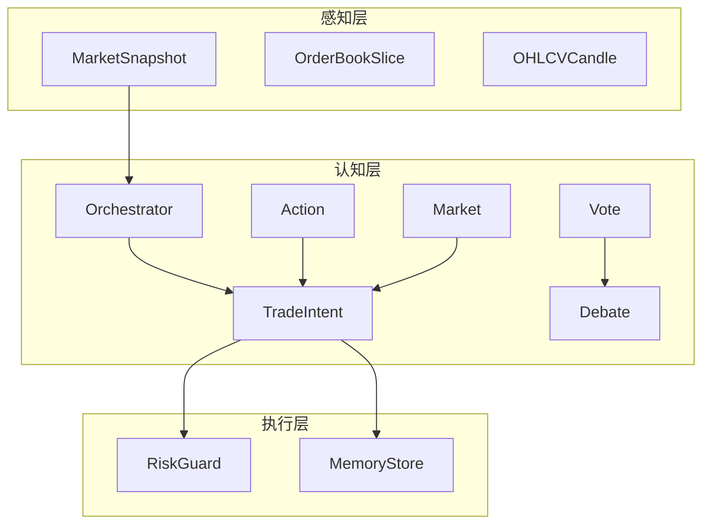
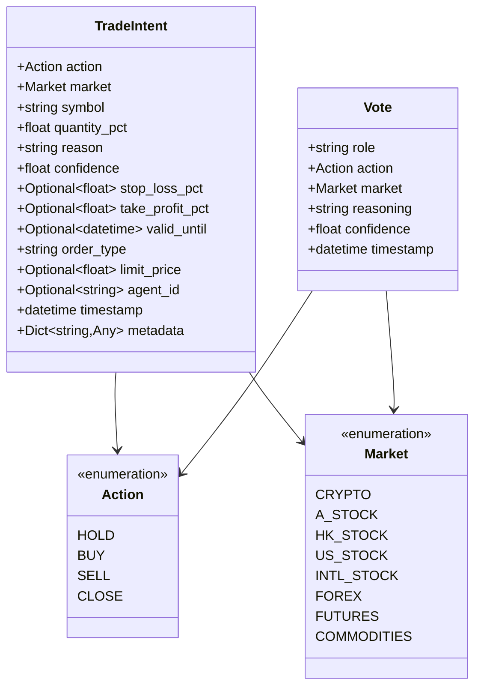
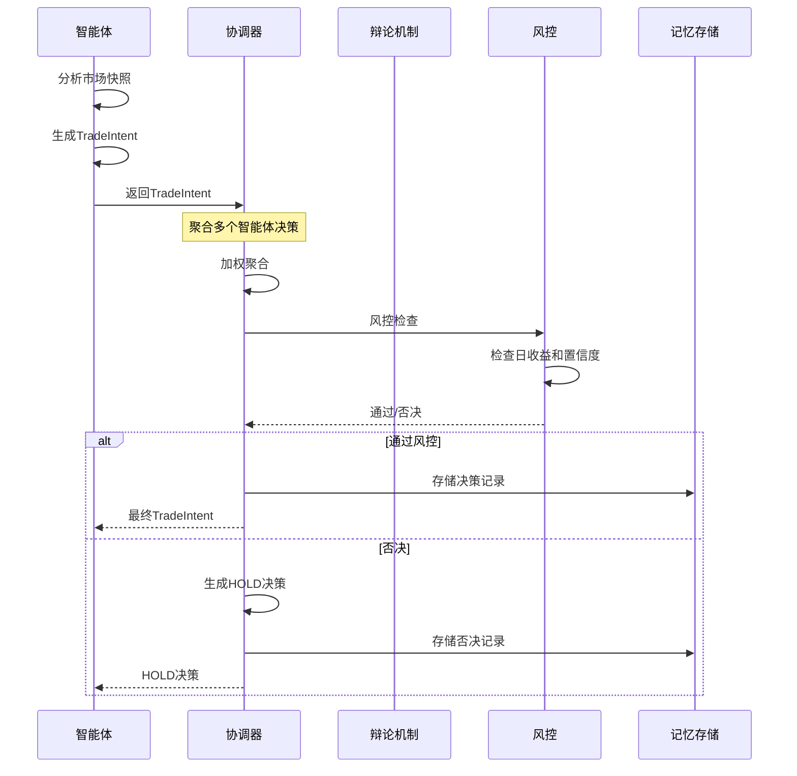
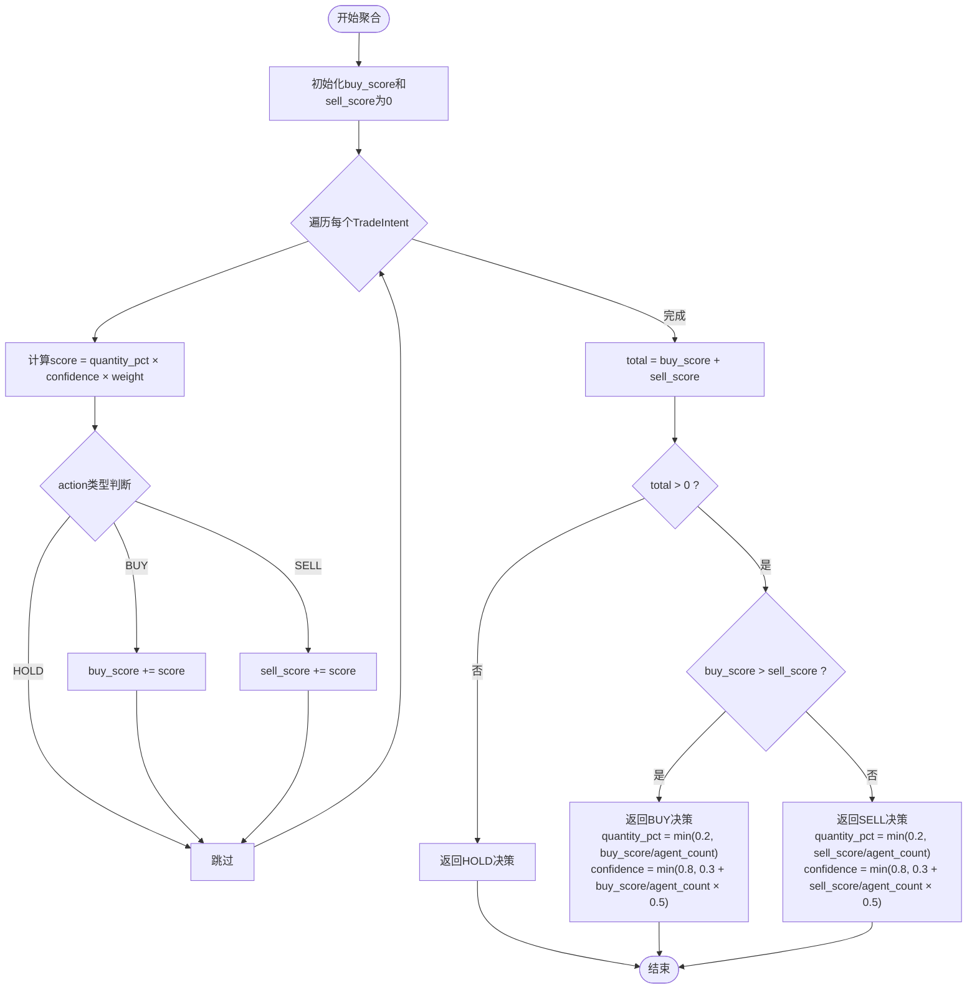
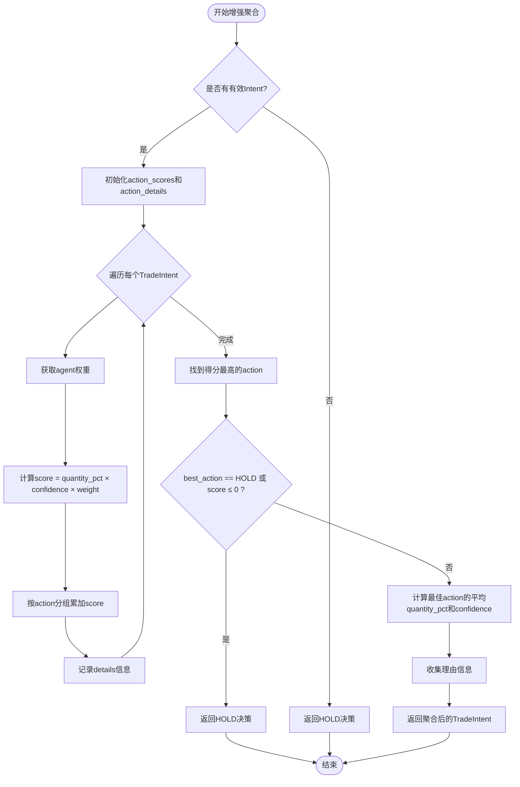
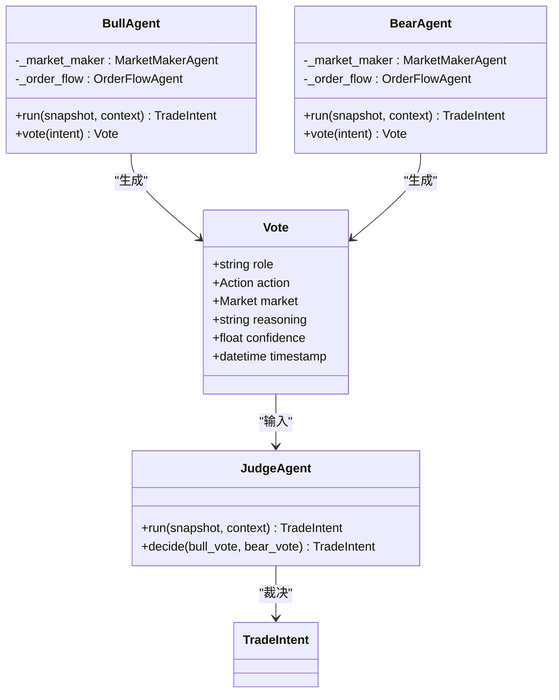
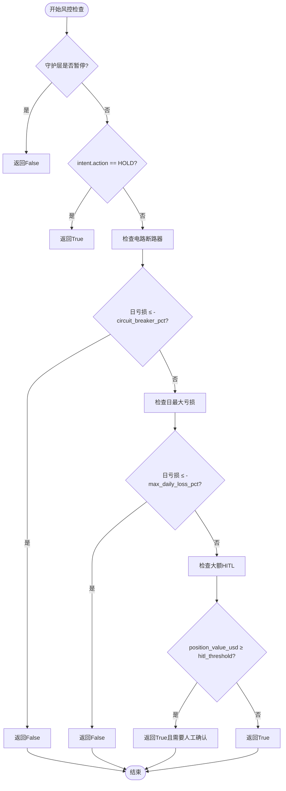
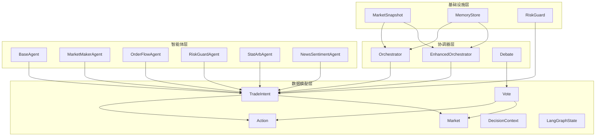

# 交易意图数据模型

<cite>
**本文档引用的文件**
- [schemas.py](file://src/aetherlife/cognition/schemas.py)
- [orchestrator.py](file://src/aetherlife/cognition/orchestrator.py)
- [orchestrator_enhanced.py](file://src/aetherlife/cognition/orchestrator_enhanced.py)
- [debate.py](file://src/aetherlife/cognition/debate.py)
- [agents.py](file://src/aetherlife/cognition/agents.py)
- [models.py](file://src/aetherlife/perception/models.py)
- [risk_guard.py](file://src/aetherlife/guard/risk_guard.py)
- [store.py](file://src/aetherlife/memory/store.py)
- [cognition_multi_agent_demo.py](file://scripts/cognition_multi_agent_demo.py)
</cite>

## 目录
1. [简介](#简介)
2. [项目结构](#项目结构)
3. [核心组件](#核心组件)
4. [架构概览](#架构概览)
5. [详细组件分析](#详细组件分析)
6. [依赖关系分析](#依赖关系分析)
7. [性能考虑](#性能考虑)
8. [故障排除指南](#故障排除指南)
9. [结论](#结论)
10. [附录](#附录)

## 简介

AetherLife交易意图数据模型是整个量化交易系统的核心数据结构，它定义了智能体决策输出的标准格式和约束条件。该模型采用Pydantic进行数据验证，确保所有LLM和强化学习输出都符合严格的schema规范。

交易意图数据模型主要包含以下关键要素：
- **Action枚举类型**：定义交易动作的标准化集合
- **TradeIntent数据结构**：封装完整的交易决策信息
- **Vote投票模型**：支持辩论机制的投票数据结构
- **多市场支持**：扩展的市场类型枚举
- **风控集成**：内置的风险控制参数

## 项目结构

AetherLife系统采用分层架构设计，交易意图数据模型位于认知层的核心位置：



**图表来源**
- [schemas.py](file://src/aetherlife/cognition/schemas.py#L12-L62)
- [orchestrator.py](file://src/aetherlife/cognition/orchestrator.py#L16-L53)
- [models.py](file://src/aetherlife/perception/models.py#L55-L64)

**章节来源**
- [schemas.py](file://src/aetherlife/cognition/schemas.py#L1-L219)
- [orchestrator.py](file://src/aetherlife/cognition/orchestrator.py#L1-L93)
- [models.py](file://src/aetherlife/perception/models.py#L1-L64)

## 核心组件

### Action枚举类型

Action枚举定义了标准化的交易动作集合，确保所有智能体输出的一致性：



**图表来源**
- [schemas.py](file://src/aetherlife/cognition/schemas.py#L12-L73)

### TradeIntent数据结构详解

TradeIntent是交易意图数据模型的核心，它包含了完整的交易决策信息：

| 字段名 | 类型 | 默认值 | 约束条件 | 描述 |
|--------|------|--------|----------|------|
| action | Action | HOLD | 必填 | 交易动作类型 |
| market | Market | CRYPTO | 必填 | 市场类型枚举 |
| symbol | string | "BTCUSDT" | 必填 | 交易标的符号 |
| quantity_pct | float | 0.0 | 0≤x≤1 | 仓位比例（0-100%） |
| reason | string | "" | 可选 | 决策理由说明 |
| confidence | float | 0.5 | 0≤x≤1 | 决策置信度 |
| stop_loss_pct | Optional[float] | None | 0≤x≤1 | 止损比例 |
| take_profit_pct | Optional[float] | None | 0≤x≤1 | 止盈比例 |
| valid_until | Optional[datetime] | None | 可选 | 有效期截止时间 |
| order_type | string | "MARKET" | 枚举限定 | 订单类型 |
| limit_price | Optional[float] | None | 可选 | 限价单价格 |
| agent_id | Optional[string] | None | 可选 | 发出决策的智能体ID |
| timestamp | datetime | 当前UTC时间 | 自动设置 | 决策时间戳 |
| metadata | Dict[string,Any] | {} | 可选 | 扩展元数据 |

**章节来源**
- [schemas.py](file://src/aetherlife/cognition/schemas.py#L32-L62)

### Vote投票模型

Vote模型用于辩论机制中的投票数据结构：

| 字段名 | 类型 | 默认值 | 约束条件 | 描述 |
|--------|------|--------|----------|------|
| role | string | - | 必填 | 投票者角色（bull/bear/judge/agent_name） |
| action | Action | HOLD | 必填 | 投票的交易动作 |
| market | Market | CRYPTO | 必填 | 市场类型 |
| reasoning | string | "" | 必填 | 投票理由 |
| confidence | float | 0.0 | 0≤x≤1 | 投票置信度 |
| timestamp | datetime | 当前UTC时间 | 自动设置 | 投票时间戳 |

**章节来源**
- [schemas.py](file://src/aetherlife/cognition/schemas.py#L64-L73)

## 架构概览

交易意图数据模型在整个系统中的流转过程如下：



**图表来源**
- [orchestrator.py](file://src/aetherlife/cognition/orchestrator.py#L38-L53)
- [risk_guard.py](file://src/aetherlife/guard/risk_guard.py#L48-L68)
- [store.py](file://src/aetherlife/memory/store.py#L77-L88)

## 详细组件分析

### 协调器聚合算法

协调器实现了两种聚合算法来处理多个智能体的交易意图：

#### 基础聚合算法

基础聚合算法采用简单的加权平均方式：



**图表来源**
- [orchestrator.py](file://src/aetherlife/cognition/orchestrator.py#L65-L92)

#### 增强聚合算法

增强聚合算法提供了更复杂的评分机制：



**图表来源**
- [orchestrator_enhanced.py](file://src/aetherlife/cognition/orchestrator_enhanced.py#L235-L312)

**章节来源**
- [orchestrator.py](file://src/aetherlife/cognition/orchestrator.py#L65-L92)
- [orchestrator_enhanced.py](file://src/aetherlife/cognition/orchestrator_enhanced.py#L235-L312)

### 辩论机制

辩论机制提供了多方观点的对比和裁决功能：



**图表来源**
- [debate.py](file://src/aetherlife/cognition/debate.py#L15-L99)

**章节来源**
- [debate.py](file://src/aetherlife/cognition/debate.py#L1-L100)

### 风控检查机制

风控机制在决策流程的最后阶段执行，确保系统的安全性：



**图表来源**
- [risk_guard.py](file://src/aetherlife/guard/risk_guard.py#L48-L68)

**章节来源**
- [risk_guard.py](file://src/aetherlife/guard/risk_guard.py#L1-L84)

## 依赖关系分析

交易意图数据模型的依赖关系图：



**图表来源**
- [schemas.py](file://src/aetherlife/cognition/schemas.py#L12-L162)
- [orchestrator.py](file://src/aetherlife/cognition/orchestrator.py#L16-L36)
- [agents.py](file://src/aetherlife/cognition/agents.py#L13-L109)
- [models.py](file://src/aetherlife/perception/models.py#L55-L64)

**章节来源**
- [schemas.py](file://src/aetherlife/cognition/schemas.py#L1-L219)
- [orchestrator.py](file://src/aetherlife/cognition/orchestrator.py#L1-L93)
- [agents.py](file://src/aetherlife/cognition/agents.py#L1-L109)
- [models.py](file://src/aetherlife/perception/models.py#L1-L64)

## 性能考虑

### 数据验证性能

交易意图数据模型采用Pydantic进行数据验证，具有以下性能特点：

1. **编译优化**：Pydantic v2使用Cython编译，提供高性能的数据验证
2. **字段级验证**：每个字段都有精确的约束检查，确保数据完整性
3. **内存效率**：使用Pydantic的字段验证机制，避免不必要的对象创建

### 聚合算法复杂度

- **基础聚合算法**：时间复杂度O(n)，空间复杂度O(1)
- **增强聚合算法**：时间复杂度O(n)，空间复杂度O(n)
- **辩论机制**：并发执行，使用asyncio.gather实现并行处理

### 内存管理

系统采用以下内存管理策略：
- 使用deque管理历史事件，限制最大长度
- 异步I/O操作，避免阻塞
- 及时清理临时数据结构

## 故障排除指南

### 常见验证错误

1. **字段类型错误**
   - 现象：Pydantic ValidationError
   - 解决：确保字段类型正确，如quantity_pct必须为float

2. **范围约束错误**
   - 现象：数值超出0-1范围
   - 解决：使用Field的ge和le参数进行约束

3. **枚举值错误**
   - 现象：Action或Market枚举值无效
   - 解决：使用预定义的枚举值

### 聚合算法问题

1. **权重配置错误**
   - 现象：聚合结果异常
   - 解决：检查weights字典的agent_id映射

2. **置信度过低**
   - 现象：风控否决频繁
   - 解决：提高智能体置信度或调整阈值

### 调试技巧

1. **启用详细日志**
   ```python
   import logging
   logging.basicConfig(level=logging.DEBUG)
   ```

2. **检查中间结果**
   - 在聚合算法中添加调试输出
   - 验证每个智能体的输出

3. **单元测试**
   - 为关键函数编写测试用例
   - 验证边界条件

**章节来源**
- [orchestrator.py](file://src/aetherlife/cognition/orchestrator.py#L65-L92)
- [orchestrator_enhanced.py](file://src/aetherlife/cognition/orchestrator_enhanced.py#L235-L312)
- [risk_guard.py](file://src/aetherlife/guard/risk_guard.py#L48-L68)

## 结论

AetherLife交易意图数据模型通过标准化的数据结构和严格的验证机制，为整个量化交易系统提供了可靠的基础。该模型的设计充分考虑了：

1. **一致性**：统一的Action和Market枚举确保跨模块的一致性
2. **可扩展性**：灵活的字段设计支持未来功能扩展
3. **安全性**：内置的风控检查和数据验证机制
4. **性能**：高效的聚合算法和内存管理策略

通过合理的使用和扩展，该数据模型能够适应各种复杂的交易场景，并为系统的智能化决策提供坚实的基础。

## 附录

### 扩展数据模型的最佳实践

1. **添加新字段**
   - 使用Field参数设置约束
   - 更新相关验证逻辑
   - 考虑序列化兼容性

2. **修改现有字段**
   - 保持向后兼容性
   - 更新默认值和约束
   - 测试迁移过程

3. **新增决策维度**
   - 扩展Action枚举
   - 添加相应的风险控制参数
   - 更新聚合算法

### 配置示例

系统提供了多种配置选项来定制交易意图行为：

- **权重配置**：为不同智能体设置权重
- **风控参数**：调整电路断路器和最大亏损限制
- **市场权重**：针对不同市场的特殊处理

这些配置可以通过环境变量或配置文件进行管理，确保系统能够适应不同的市场条件和风险偏好。