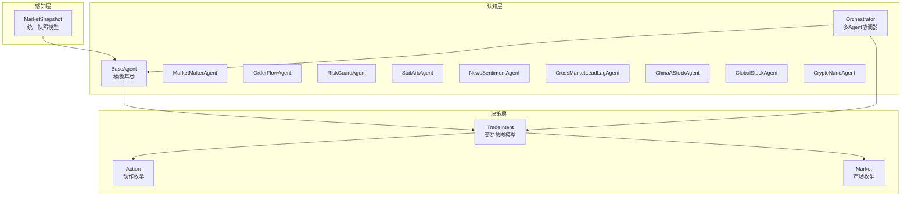
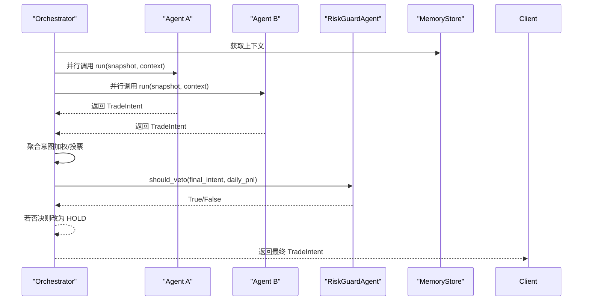
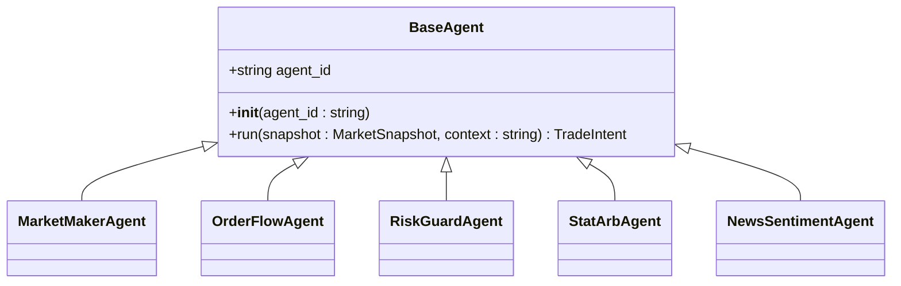
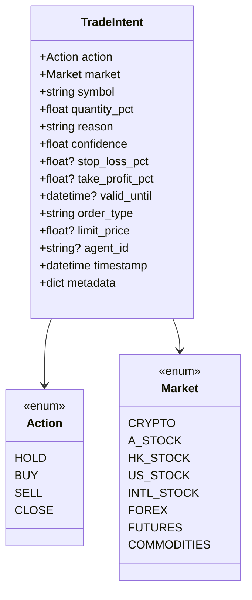
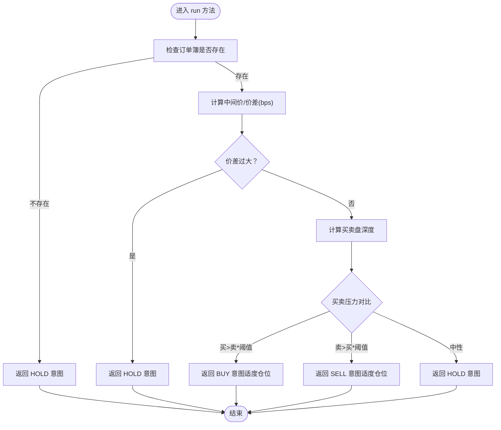
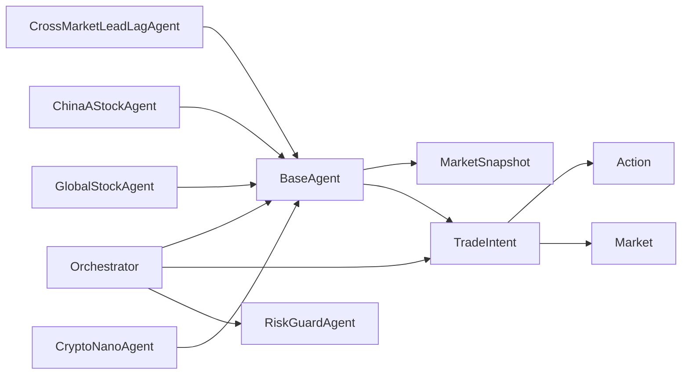

# BaseAgent基类设计

<cite>
**本文档引用的文件**
- [agents.py](file://src/aetherlife/cognition/agents.py)
- [schemas.py](file://src/aetherlife/cognition/schemas.py)
- [models.py](file://src/aetherlife/perception/models.py)
- [orchestrator.py](file://src/aetherlife/cognition/orchestrator.py)
- [cognition_multi_agent_demo.py](file://scripts/cognition_multi_agent_demo.py)
- [agent_cross_market.py](file://src/aetherlife/cognition/agent_cross_market.py)
- [agent_specialized.py](file://src/aetherlife/cognition/agent_specialized.py)
</cite>

## 目录
1. [引言](#引言)
2. [项目结构](#项目结构)
3. [核心组件](#核心组件)
4. [架构总览](#架构总览)
5. [详细组件分析](#详细组件分析)
6. [依赖关系分析](#依赖关系分析)
7. [性能考量](#性能考量)
8. [故障排查指南](#故障排查指南)
9. [结论](#结论)

## 引言
本文件围绕 BaseAgent 抽象基类进行系统化技术文档设计，重点阐述其设计理念、接口规范、数据模型、生命周期管理、异步运行模式与性能优化，并提供最佳实践与扩展指南。通过分析仓库中的 Agent 实现与 Orchestrator 协调器，帮助读者理解从“感知—决策—执行”的闭环流程中，BaseAgent 如何作为统一抽象，承载多市场、多策略的专业化 Agent 实现。

## 项目结构
本项目采用分层架构，认知层（Cognition）负责多 Agent 协同决策，感知层（Perception）提供统一的市场快照模型，决策层（Decision）提供强化学习环境，记忆层（Memory）提供短期/长期记忆抽象。BaseAgent 位于认知层，是所有具体 Agent 的抽象基类。

图表来源
- [agents.py](file://src/aetherlife/cognition/agents.py#L13-L22)
- [schemas.py](file://src/aetherlife/cognition/schemas.py#L12-L58)
- [models.py](file://src/aetherlife/perception/models.py#L54-L64)
- [orchestrator.py](file://src/aetherlife/cognition/orchestrator.py#L16-L53)

章节来源
- [agents.py](file://src/aetherlife/cognition/agents.py#L1-L109)
- [schemas.py](file://src/aetherlife/cognition/schemas.py#L1-L219)
- [models.py](file://src/aetherlife/perception/models.py#L1-L64)
- [orchestrator.py](file://src/aetherlife/cognition/orchestrator.py#L1-L93)

## 核心组件
- BaseAgent 抽象基类：定义 agent_id 标识符与异步 run 方法签名，约束所有具体 Agent 的行为契约。
- TradeIntent 交易意图模型：标准化输出结构，包含动作、市场、符号、仓位比例、置信度、风控参数、时效性、执行参数与元数据。
- Action/Market 枚举：统一的动作与市场类型定义，确保跨 Agent 的一致性。
- MarketSnapshot 市场快照：统一的输入载体，封装订单簿、最新价、24小时行情、K线等。
- Orchestrator 协调器：并行调度多个 Agent，聚合决策并通过风控否决。

章节来源
- [agents.py](file://src/aetherlife/cognition/agents.py#L13-L22)
- [schemas.py](file://src/aetherlife/cognition/schemas.py#L12-L58)
- [models.py](file://src/aetherlife/perception/models.py#L54-L64)
- [orchestrator.py](file://src/aetherlife/cognition/orchestrator.py#L16-L53)

## 架构总览
BaseAgent 作为抽象基类，要求所有子类实现异步 run 方法，接收 MarketSnapshot 与上下文字符串，返回 TradeIntent。Orchestrator 在运行时收集多个 Agent 的意图，进行加权聚合或辩论裁决，并在最后通过风控 Agent 进行否决判断。

图表来源
- [orchestrator.py](file://src/aetherlife/cognition/orchestrator.py#L38-L53)
- [agents.py](file://src/aetherlife/cognition/agents.py#L19-L22)
- [schemas.py](file://src/aetherlife/cognition/schemas.py#L32-L58)

## 详细组件分析

### BaseAgent 抽象基类
- 设计理念
  - 以最小接口约束实现“可替换”的多 Agent 架构，统一 run 方法签名，便于并行调度与聚合。
  - 通过 agent_id 标识不同 Agent，便于权重管理、日志追踪与决策溯源。
- 接口规范
  - 构造函数：接收 agent_id，作为唯一标识符。
  - run 方法：异步、接收 MarketSnapshot 与上下文字符串，返回 TradeIntent。
- 生命周期管理
  - agent_id 在实例初始化时确定，贯穿整个 Agent 生命周期，用于日志、权重映射与决策归因。
  - run 方法每次被调用即产生一次独立的 TradeIntent 输出，适合高频决策场景。
- 继承最佳实践
  - 子类需覆盖 run 方法，保持异步特性；在方法内部仅依赖 snapshot 与 context，避免外部状态耦合。
  - 输出 TradeIntent 时，合理设置 quantity_pct、confidence 与 reason，便于 Orchestrator 聚合与风控判断。
  - 可选地在构造函数中设置默认 agent_id，遵循“约定优于配置”。

图表来源
- [agents.py](file://src/aetherlife/cognition/agents.py#L13-L109)

章节来源
- [agents.py](file://src/aetherlife/cognition/agents.py#L13-L22)

### run 方法签名设计与参数含义
- 方法签名：async def run(self, snapshot: MarketSnapshot, context: str) -> TradeIntent
- 参数说明
  - snapshot：MarketSnapshot，一次性消费的市场快照，包含 symbol、exchange、orderbook、last_price、ticker_24h、candles_1m、timestamp 等字段。
  - context：str，短期记忆上下文（文本），用于传递外部信息（如情绪、新闻、风控状态等）。
- 返回值结构：TradeIntent，包含动作、市场、符号、仓位比例、理由、置信度、风控参数、时效性、执行参数与元数据。
- 设计考虑
  - 异步设计：支持并行调度多个 Agent，提升吞吐。
  - 输入最小化：仅依赖 snapshot 与 context，减少副作用。
  - 输出标准化：统一的 TradeIntent 结构便于聚合与风控。

章节来源
- [agents.py](file://src/aetherlife/cognition/agents.py#L19-L22)
- [models.py](file://src/aetherlife/perception/models.py#L54-L64)
- [schemas.py](file://src/aetherlife/cognition/schemas.py#L32-L58)

### TradeIntent 与 Action/Market 数据模型
- TradeIntent 字段
  - 动作：Action（HOLD/BUY/SELL/CLOSE）
  - 市场：Market（CRYPTO/A_STOCK/HK_STOCK/US_STOCK/INTL_STOCK/FOREX/FUTURES/COMMODITIES）
  - 符号：str，默认 BTCUSDT
  - 仓位比例：float（0~1），表示下单占可用资金的比例
  - 理由：str，解释为何做出该决策
  - 置信度：float（0~1），表示决策可信度
  - 风控参数：止盈/止损（可选百分比）
  - 时效性：valid_until（可选时间戳）
  - 执行参数：order_type（MARKET/LIMIT/FOK/IOC/POST_ONLY）、limit_price（可选）
  - 元数据：agent_id、timestamp、metadata（字典）
- Action/Market 枚举
  - Action：HOLD、BUY、SELL、CLOSE
  - Market：CRYPTO、A_STOCK、HK_STOCK、US_STOCK、INTL_STOCK、FOREX、FUTURES、COMMODITIES
- 设计优势
  - Pydantic BaseModel 提供结构化校验与序列化，便于审计与跨模块传递。
  - 字段范围约束（ge/le）保障数值合理性。
  - metadata 字段支持扩展业务元数据。

图表来源
- [schemas.py](file://src/aetherlife/cognition/schemas.py#L12-L58)

章节来源
- [schemas.py](file://src/aetherlife/cognition/schemas.py#L12-L58)

### 典型 Agent 实现与扩展指南
- 做市 Agent（MarketMakerAgent）
  - 依据订单簿的中间价与价差（bps）进行快速判断，价差过大则 HOLD，否则比较买卖压力决定 BUY/SELL。
  - 适合高频、低波动市场，强调流动性与价差控制。
- 订单流 Agent（OrderFlowAgent）
  - 基于买卖盘深度（前N档）计算买卖压力，给出中性仓位比例与置信度。
  - 适合趋势初现阶段，捕捉微观结构信号。
- 风控 Agent（RiskGuardAgent）
  - 仅输出 HOLD 或维持原意，通过 should_veto 方法进行否决判断（如置信度过低、日收益超限）。
  - 作为“一票否决”机制，保障整体风险边界。
- 跨市场 Agent（CrossMarketLeadLagAgent）
  - 通过价格历史与相关性检测跨市场 Lead-Lag 信号，建议目标市场的动作与仓位。
  - 适合多市场联动场景，结合元数据记录信号详情。
- 专业市场 Agent（ChinaAStockAgent/GlobalStockAgent/CryptoNanoAgent）
  - 针对特定市场的特殊规则（A股涨跌停、印花税、交易时段；美股流动性；加密货币高频）进行定制化策略。
  - 体现“专业化”的价值，提升在特定领域的胜率。

图表来源
- [agent_cross_market.py](file://src/aetherlife/cognition/agent_cross_market.py#L160-L215)
- [agent_specialized.py](file://src/aetherlife/cognition/agent_specialized.py#L221-L278)

章节来源
- [agents.py](file://src/aetherlife/cognition/agents.py#L25-L109)
- [agent_cross_market.py](file://src/aetherlife/cognition/agent_cross_market.py#L16-L215)
- [agent_specialized.py](file://src/aetherlife/cognition/agent_specialized.py#L17-L352)

### 异步运行模式与性能优化
- 异步设计
  - run 方法声明为 async，便于 Orchestrator 使用 asyncio.gather 并行调度多个 Agent，显著降低决策延迟。
- 并行聚合
  - Orchestrator.run 中通过 asyncio.gather 并行执行多个 Agent 的 run，随后进行加权聚合，提高吞吐。
- 性能优化要点
  - 控制 run 内部 IO 与网络请求，必要时使用缓存（如 CrossMarketLeadLagAgent 的价格历史缓存）。
  - 合理设置阈值与仓位比例，避免过度频繁交易导致滑点与手续费侵蚀。
  - 使用 TradeIntent 的 metadata 字段记录关键中间结果，便于后续审计与回放。
  - 风控前置：RiskGuardAgent 的 should_veto 在聚合后执行，避免无效决策影响整体收益。

章节来源
- [orchestrator.py](file://src/aetherlife/cognition/orchestrator.py#L38-L53)
- [agent_cross_market.py](file://src/aetherlife/cognition/agent_cross_market.py#L67-L144)

### 代码示例：实现自定义 Agent
以下示例展示如何基于 BaseAgent 实现一个自定义 Agent。请参考以下文件路径定位实现位置：
- 基类与接口：[BaseAgent.run](file://src/aetherlife/cognition/agents.py#L19-L22)
- 输入模型：[MarketSnapshot](file://src/aetherlife/perception/models.py#L54-L64)
- 输出模型：[TradeIntent](file://src/aetherlife/cognition/schemas.py#L32-L58)
- 枚举类型：[Action/Market](file://src/aetherlife/cognition/schemas.py#L12-L30)
- 示例实现参考：
  - [MarketMakerAgent.run](file://src/aetherlife/cognition/agents.py#L31-L47)
  - [OrderFlowAgent.run](file://src/aetherlife/cognition/agents.py#L77-L87)
  - [RiskGuardAgent.run](file://src/aetherlife/cognition/agents.py#L56-L68)
  - [CrossMarketLeadLagAgent.run](file://src/aetherlife/cognition/agent_cross_market.py#L32-L65)
  - [ChinaAStockAgent.run](file://src/aetherlife/cognition/agent_specialized.py#L36-L83)

章节来源
- [agents.py](file://src/aetherlife/cognition/agents.py#L13-L109)
- [agent_cross_market.py](file://src/aetherlife/cognition/agent_cross_market.py#L16-L65)
- [agent_specialized.py](file://src/aetherlife/cognition/agent_specialized.py#L17-L83)

## 依赖关系分析
- BaseAgent 依赖
  - 输入：MarketSnapshot（感知层）
  - 输出：TradeIntent（决策层）
  - 枚举：Action/Market（决策层）
- Orchestrator 依赖
  - 多个具体 Agent 实例
  - MemoryStore（短期上下文）
  - RiskGuardAgent（风控）
- 典型 Agent 依赖
  - CrossMarketLeadLagAgent：价格历史缓存、CrossMarketSignal
  - ChinaAStockAgent：A股特殊规则（涨跌停、印花税、交易时段）

图表来源
- [agents.py](file://src/aetherlife/cognition/agents.py#L13-L109)
- [orchestrator.py](file://src/aetherlife/cognition/orchestrator.py#L16-L53)
- [schemas.py](file://src/aetherlife/cognition/schemas.py#L12-L58)
- [models.py](file://src/aetherlife/perception/models.py#L54-L64)

章节来源
- [agents.py](file://src/aetherlife/cognition/agents.py#L13-L109)
- [orchestrator.py](file://src/aetherlife/cognition/orchestrator.py#L16-L53)
- [schemas.py](file://src/aetherlife/cognition/schemas.py#L12-L58)
- [models.py](file://src/aetherlife/perception/models.py#L54-L64)

## 性能考量
- 并行调度：使用 asyncio.gather 并行调用多个 Agent 的 run，显著降低决策延迟。
- 缓存与预计算：如 CrossMarketLeadLagAgent 的价格历史缓存，减少重复计算。
- 阈值与仓位：合理设置买卖阈值与仓位比例，避免过度交易导致成本侵蚀。
- 风控前置：RiskGuardAgent 的 should_veto 在聚合后执行，避免无效决策影响整体收益。
- 输出标准化：TradeIntent 的结构化输出便于后续审计与回放，降低调试成本。

[本节为通用性能指导，无需列出具体文件来源]

## 故障排查指南
- 常见问题
  - 订单簿缺失：当 snapshot.orderbook 为空时，多数 Agent 返回 HOLD 意图。检查感知层数据源与订阅配置。
  - 价差过大：某些 Agent（如 MarketMakerAgent、ForexMicroAgent、FuturesMicroAgent）在价差过大时返回 HOLD，检查市场流动性与滑点。
  - 置信度过低：RiskGuardAgent 可能否决低置信度意图，检查 Agent 决策逻辑与输入质量。
  - 上下文解析错误：SentimentAgent 从 context 解析情绪分数，若格式不正确将返回 HOLD，检查上下文拼接与格式。
- 排查步骤
  - 打印 snapshot 与 context 的关键字段，确认输入完整性。
  - 逐步注释 Agent 决策分支，定位异常逻辑。
  - 使用 TradeIntent.metadata 记录中间结果，便于回溯。
  - 在 Orchestrator 中开启调试日志，观察聚合与风控流程。

章节来源
- [agents.py](file://src/aetherlife/cognition/agents.py#L31-L47)
- [agent_cross_market.py](file://src/aetherlife/cognition/agent_cross_market.py#L160-L215)
- [agent_specialized.py](file://src/aetherlife/cognition/agent_specialized.py#L221-L278)

## 结论
BaseAgent 通过最小接口与标准化输出，构建了可替换、可并行、可聚合的多 Agent 决策框架。配合 TradeIntent 的结构化输出与 Action/Market 枚举，以及 Orchestrator 的并行调度与风控否决机制，实现了从感知到执行的高效闭环。遵循本文的扩展指南与最佳实践，可在保证一致性的前提下，快速实现专业化 Agent 并融入整体系统。