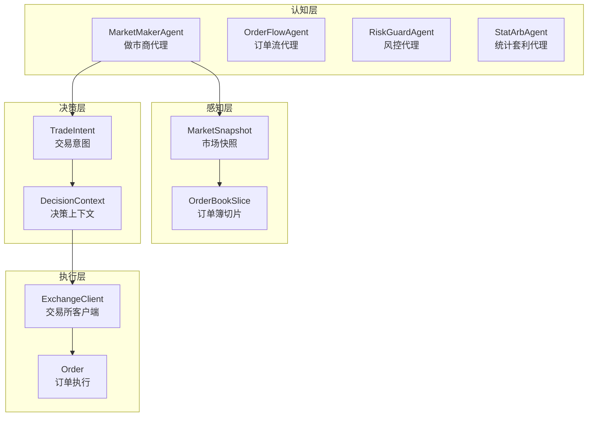
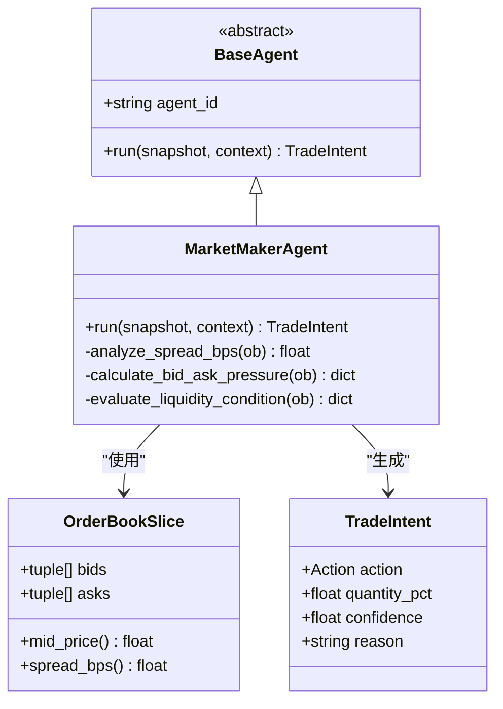
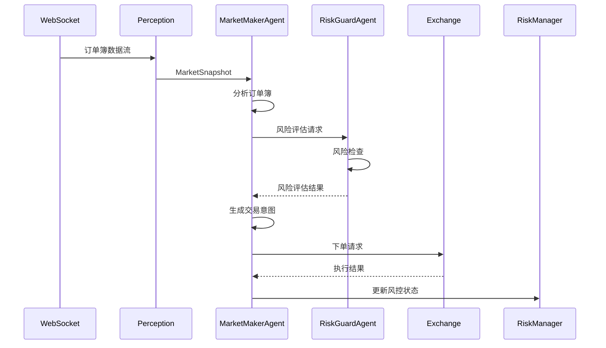
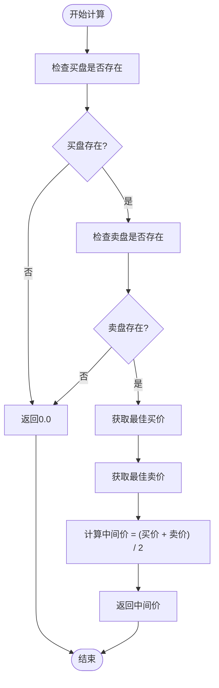
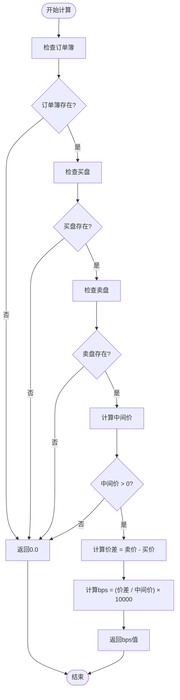
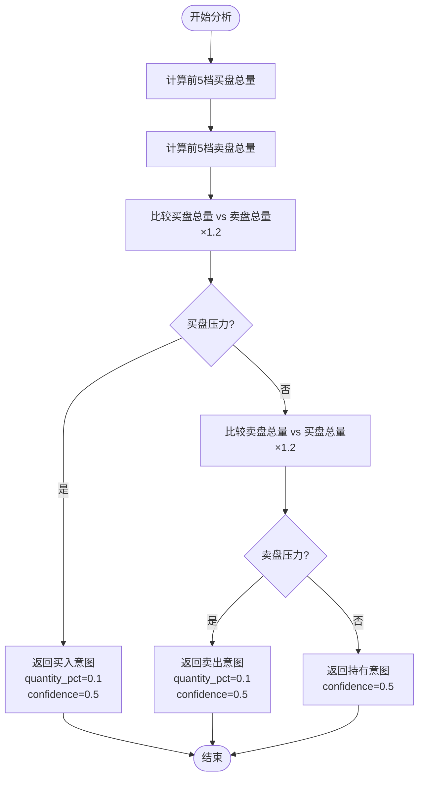
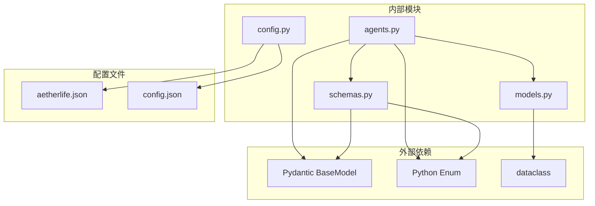

# MarketMakerAgent做市商代理

<cite>
**本文档引用的文件**
- [src/aetherlife/cognition/agents.py](file://src/aetherlife/cognition/agents.py)
- [src/aetherlife/perception/models.py](file://src/aetherlife/perception/models.py)
- [src/aetherlife/cognition/schemas.py](file://src/aetherlife/cognition/schemas.py)
- [src/aetherlife/config.py](file://src/aetherlife/config.py)
- [configs/aetherlife.json](file://configs/aetherlife.json)
- [src/aetherlife/run.py](file://src/aetherlife/run.py)
- [scripts/cognition_multi_agent_demo.py](file://scripts/cognition_multi_agent_demo.py)
- [src/trading_bot.py](file://src/trading_bot.py)
</cite>

## 目录
1. [简介](#简介)
2. [项目结构](#项目结构)
3. [核心组件](#核心组件)
4. [架构概览](#架构概览)
5. [详细组件分析](#详细组件分析)
6. [依赖关系分析](#依赖关系分析)
7. [性能考虑](#性能考虑)
8. [故障排除指南](#故障排除指南)
9. [结论](#结论)
10. [附录](#附录)

## 简介

MarketMakerAgent是AetherLife智能交易系统中的做市商代理，专门负责基于订单簿分析的流动性提供策略。该代理通过分析市场订单簿的买卖价差、流动性深度和市场压力来生成交易意图，为市场提供流动性和定价服务。

该做市商代理采用简化的启发式算法，在确保风险控制的前提下最大化流动性提供收益。其核心功能包括：

- **订单簿分析**：实时监控买卖盘口的深度和流动性状况
- **价差计算**：计算基准点差(bps)，评估市场流动性质量
- **流动性管理**：根据市场条件动态调整做市策略
- **买卖压力检测**：识别市场买卖方向性压力
- **风险控制**：实施严格的风控措施防止过度暴露

## 项目结构

AetherLife系统采用分层架构设计，MarketMakerAgent作为认知层的专业化代理之一，与其他多个代理协同工作。



**图表来源**
- [src/aetherlife/cognition/agents.py](file://src/aetherlife/cognition/agents.py#L25-L47)
- [src/aetherlife/perception/models.py](file://src/aetherlife/perception/models.py#L55-L63)
- [src/aetherlife/cognition/schemas.py](file://src/aetherlife/cognition/schemas.py#L32-L58)

**章节来源**
- [src/aetherlife/cognition/agents.py](file://src/aetherlife/cognition/agents.py#L1-L109)
- [src/aetherlife/perception/models.py](file://src/aetherlife/perception/models.py#L1-L64)

## 核心组件

### MarketMakerAgent类结构

MarketMakerAgent继承自BaseAgent基类，实现了专门的做市商算法逻辑。该类包含完整的订单簿分析、价差计算和流动性管理功能。



**图表来源**
- [src/aetherlife/cognition/agents.py](file://src/aetherlife/cognition/agents.py#L13-L29)
- [src/aetherlife/cognition/agents.py](file://src/aetherlife/cognition/agents.py#L25-L47)
- [src/aetherlife/perception/models.py](file://src/aetherlife/perception/models.py#L15-L37)
- [src/aetherlife/cognition/schemas.py](file://src/aetherlife/cognition/schemas.py#L32-L58)

### 订单簿数据结构

OrderBookSlice提供了标准化的订单簿数据接口，支持不同交易所的数据格式统一处理。

**章节来源**
- [src/aetherlife/perception/models.py](file://src/aetherlife/perception/models.py#L15-L37)
- [src/aetherlife/cognition/schemas.py](file://src/aetherlife/cognition/schemas.py#L32-L58)

## 架构概览

MarketMakerAgent在整个AetherLife系统中扮演着关键的做市商角色，通过与其他代理的协作实现智能化的流动性提供。



**图表来源**
- [src/aetherlife/run.py](file://src/aetherlife/run.py#L52-L66)
- [src/aetherlife/cognition/agents.py](file://src/aetherlife/cognition/agents.py#L31-L47)
- [src/aetherlife/cognition/agents.py](file://src/aetherlife/cognition/agents.py#L56-L68)

## 详细组件分析

### 核心算法原理

#### 中间价计算 (mid_price)

中间价是做市商定价的基础指标，反映了市场的当前均衡价格水平。



**图表来源**
- [src/aetherlife/perception/models.py](file://src/aetherlife/perception/models.py#L25-L28)

#### 价差计算 (spread_bps)

基准点差(bps)是衡量市场流动性的重要指标，用于评估买卖价差的合理性。



**图表来源**
- [src/aetherlife/perception/models.py](file://src/aetherlife/perception/models.py#L30-L36)

#### 买卖压力检测

做市商通过分析订单簿的买卖深度来识别市场方向性压力。



**图表来源**
- [src/aetherlife/cognition/agents.py](file://src/aetherlife/cognition/agents.py#L41-L46)

### 风险管理策略

#### 价差阈值控制

当市场价差过大时，做市商采取观望策略以避免不利的流动性提供。

| 价差范围 | 策略 | 置信度 |
|---------|------|--------|
| spread_bps ≤ 30 | 积极做市 | 0.6 |
| spread_bps > 30 | 观望策略 | 0.0 |

#### 买卖压力阈值

通过比较买卖盘的深度来识别市场方向性压力。

| 压力条件 | 策略 | 数量比例 | 置信度 |
|---------|------|----------|--------|
| 买盘总量 > 卖盘总量 × 1.2 | 买入 | 10% | 0.5 |
| 卖盘总量 > 买盘总量 × 1.2 | 卖出 | 10% | 0.5 |
| 其他情况 | 持有 | 0% | 0.5 |

**章节来源**
- [src/aetherlife/cognition/agents.py](file://src/aetherlife/cognition/agents.py#L31-L47)

### 配置参数详解

#### 基础配置参数

| 参数名称 | 类型 | 默认值 | 描述 | 范围 |
|---------|------|--------|------|------|
| agent_id | string | "market_maker" | 代理标识符 | - |
| quantity_pct | float | 0.0 | 交易数量占总资金的比例 | 0.0 - 1.0 |
| confidence | float | 0.5 | 决策置信度 | 0.0 - 1.0 |
| order_type | string | "MARKET" | 订单类型 | MARKET/LIMIT/FOK/IOC/POST_ONLY |

#### 风险控制参数

| 参数名称 | 类型 | 默认值 | 描述 | 范围 |
|---------|------|--------|------|------|
| stop_loss_pct | float | null | 止损百分比 | 0.0 - 1.0 |
| take_profit_pct | float | null | 止盈百分比 | 0.0 - 1.0 |
| max_daily_loss_pct | float | 0.10 | 日最大亏损百分比 | 0.0 - 1.0 |

#### 系统配置参数

| 参数名称 | 类型 | 默认值 | 描述 | 范围 |
|---------|------|--------|------|------|
| symbol | string | "BTCUSDT" | 交易对符号 | - |
| testnet | boolean | true | 测试网模式 | true/false |
| exchange | string | "binance" | 交易所名称 | - |
| log_level | string | "INFO" | 日志级别 | - |

**章节来源**
- [src/aetherlife/cognition/schemas.py](file://src/aetherlife/cognition/schemas.py#L32-L58)
- [src/aetherlife/config.py](file://src/aetherlife/config.py#L98-L130)
- [configs/aetherlife.json](file://configs/aetherlife.json#L1-L17)

## 依赖关系分析

MarketMakerAgent依赖于多个核心组件来实现完整的做市商功能。



**图表来源**
- [src/aetherlife/cognition/agents.py](file://src/aetherlife/cognition/agents.py#L6-L10)
- [src/aetherlife/perception/models.py](file://src/aetherlife/perception/models.py#L3-L7)
- [src/aetherlife/cognition/schemas.py](file://src/aetherlife/cognition/schemas.py#L6-L9)

### 组件耦合度分析

MarketMakerAgent具有良好的内聚性和较低的耦合度：

- **内聚性**：专注于做市商算法，职责单一明确
- **耦合度**：仅依赖于OrderBookSlice和TradeIntent等核心数据结构
- **可测试性**：通过模拟MarketSnapshot进行单元测试
- **可维护性**：算法逻辑清晰，易于理解和修改

**章节来源**
- [src/aetherlife/cognition/agents.py](file://src/aetherlife/cognition/agents.py#L1-L109)

## 性能考虑

### 计算复杂度分析

| 操作 | 时间复杂度 | 空间复杂度 | 说明 |
|------|------------|------------|------|
| mid_price计算 | O(1) | O(1) | 直接访问最佳买卖价 |
| spread_bps计算 | O(1) | O(1) | 基础数学运算 |
| 买卖压力分析 | O(n) | O(1) | n为前5档订单簿 |
| 整体算法 | O(n) | O(1) | n为分析档位数 |

### 优化建议

1. **批处理优化**：将多个订单簿分析合并为批量处理
2. **缓存机制**：缓存最近的中间价和价差计算结果
3. **异步处理**：利用asyncio实现非阻塞的订单簿分析
4. **内存管理**：及时清理不再使用的订单簿数据

### 实时性要求

- **响应时间**：< 100ms
- **更新频率**：每100-500ms
- **并发处理**：支持多交易对同时分析

## 故障排除指南

### 常见问题及解决方案

#### 订单簿为空

**症状**：返回持有意图，置信度为0
**原因**：WebSocket连接异常或数据源不可用
**解决方案**：
1. 检查交易所API连接状态
2. 验证WebSocket订阅是否正常
3. 确认网络连接稳定

#### 价差异常

**症状**：spread_bps返回0.0或异常值
**原因**：订单簿数据格式错误
**解决方案**：
1. 验证订单簿数据完整性
2. 检查买盘和卖盘价格的有效性
3. 确认数据时间戳的正确性

#### 风险控制触发

**症状**：频繁出现持有意图
**原因**：风险阈值设置过于保守
**解决方案**：
1. 调整spread_bps阈值
2. 优化买卖压力检测参数
3. 重新评估市场条件

**章节来源**
- [src/aetherlife/cognition/agents.py](file://src/aetherlife/cognition/agents.py#L33-L34)
- [src/aetherlife/cognition/agents.py](file://src/aetherlife/cognition/agents.py#L38-L39)

## 结论

MarketMakerAgent做市商代理通过简洁而有效的算法实现了智能化的流动性提供。其核心优势包括：

1. **算法简洁性**：基于订单簿的直观分析，易于理解和维护
2. **风险管理**：内置多重风控机制，确保交易安全
3. **适应性强**：可根据市场条件动态调整策略
4. **集成便利**：与AetherLife系统的其他组件无缝集成

该代理为市场提供了稳定的流动性，同时通过严格的风控措施保护了交易者的资金安全。随着系统的进一步发展，可以在此基础上添加更复杂的算法和机器学习模型，以提高做市效率和盈利能力。

## 附录

### 实际应用示例

#### 基本使用流程

```python
# 创建MarketMakerAgent实例
agent = MarketMakerAgent()

# 准备MarketSnapshot数据
snapshot = MarketSnapshot(
    symbol="BTCUSDT",
    exchange="binance",
    orderbook=OrderBookSlice(
        symbol="BTCUSDT",
        exchange="binance",
        bids=[(64995, 1.5), (64990, 2.0)],
        asks=[(65005, 0.8), (65010, 1.0)]
    )
)

# 生成交易意图
intent = await agent.run(snapshot, "")
print(f"动作: {intent.action}")
print(f"数量比例: {intent.quantity_pct}")
print(f"置信度: {intent.confidence}")
```

#### 配置示例

```json
{
  "symbol": "BTCUSDT",
  "testnet": true,
  "exchange": "binance",
  "risk": {
    "max_daily_loss_pct": 0.05,
    "stop_loss_pct": 0.02,
    "take_profit_pct": 0.05
  }
}
```

### 性能调优建议

1. **参数调优**：
   - spread_bps阈值：根据市场波动性调整
   - 买卖压力比例：优化1.2倍阈值
   - 数量比例：平衡流动性提供和风险控制

2. **系统优化**：
   - 增加订单簿缓存
   - 实现异步数据处理
   - 优化内存使用

3. **监控指标**：
   - 流动性提供收益
   - 交易执行成功率
   - 风险控制效果
   - 系统响应时间