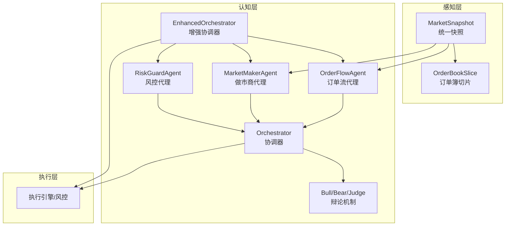
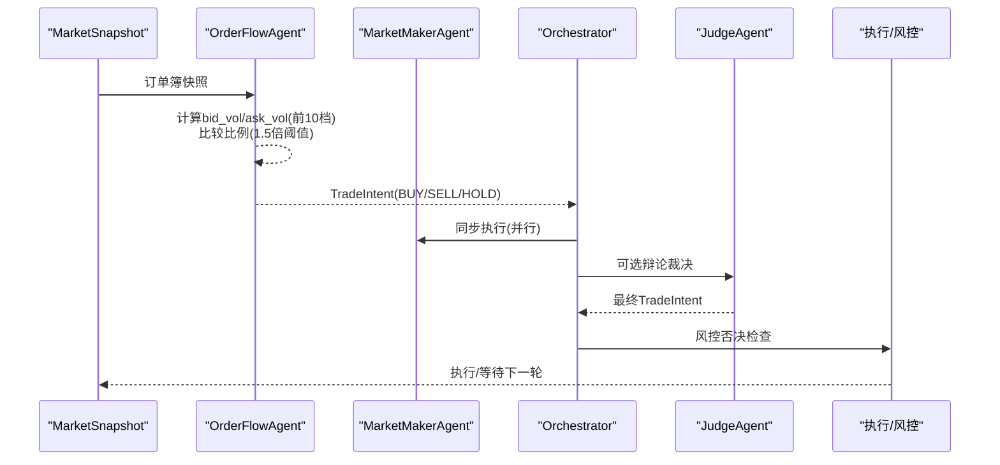
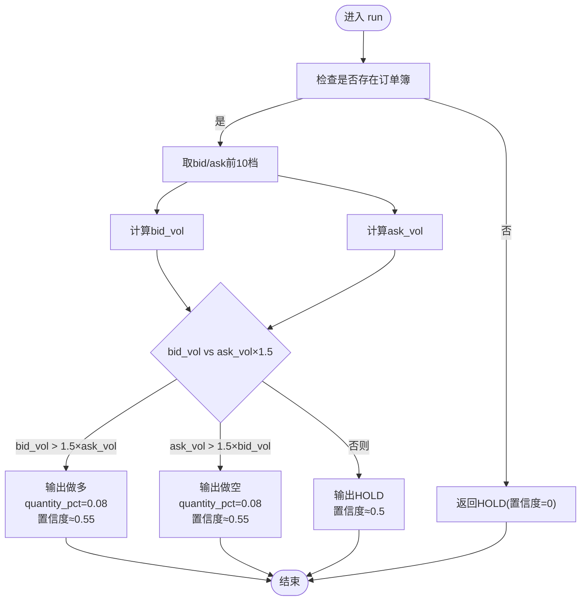
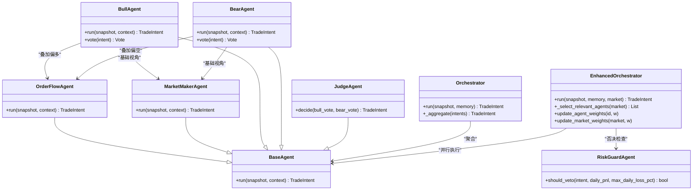
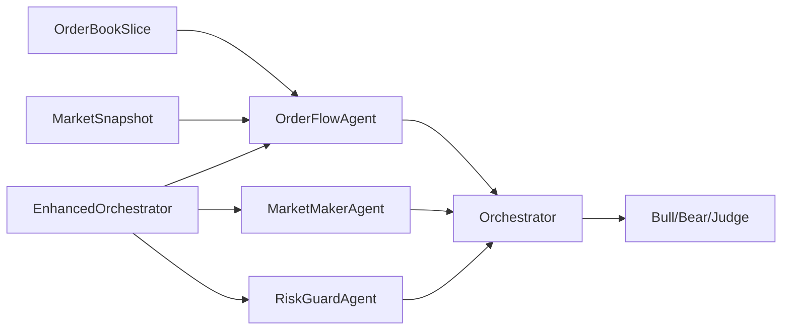

# OrderFlowAgent订单流代理

<cite>
**本文引用的文件**
- [src/aetherlife/cognition/agents.py](file://src/aetherlife/cognition/agents.py)
- [src/aetherlife/cognition/debate.py](file://src/aetherlife/cognition/debate.py)
- [src/aetherlife/cognition/orchestrator.py](file://src/aetherlife/cognition/orchestrator.py)
- [src/aetherlife/cognition/orchestrator_enhanced.py](file://src/aetherlife/cognition/orchestrator_enhanced.py)
- [src/aetherlife/cognition/schemas.py](file://src/aetherlife/cognition/schemas.py)
- [src/aetherlife/perception/models.py](file://src/aetherlife/perception/models.py)
- [src/aetherlife/cognition/agent_cross_market.py](file://src/aetherlife/cognition/agent_cross_market.py)
- [src/aetherlife/cognition/agent_specialized.py](file://src/aetherlife/cognition/agent_specialized.py)
- [scripts/cognition_multi_agent_demo.py](file://scripts/cognition_multi_agent_demo.py)
</cite>

## 目录
1. [引言](#引言)
2. [项目结构](#项目结构)
3. [核心组件](#核心组件)
4. [架构总览](#架构总览)
5. [详细组件分析](#详细组件分析)
6. [依赖关系分析](#依赖关系分析)
7. [性能考量](#性能考量)
8. [故障排查指南](#故障排查指南)
9. [结论](#结论)
10. [附录](#附录)

## 引言
本文件面向OrderFlowAgent订单流代理，系统性阐述其在微观结构分析与流动性检测方面的原理与实现，并结合多Agent协作框架给出与其他代理的配合使用方法。重点内容包括：
- 订单流分析的核心原理：基于订单簿bid/ask深度的成交量统计与比例判断
- 订单簿深度分析算法：bid_vol与ask_vol的计算范围（前N档）与权重分配策略
- 订单流偏移检测机制：1.5倍阈值判断与quantity_pct数量比例设置
- 与其他代理的协同：做市商Agent、风控Agent、辩论机制、Orchestrator聚合
- 实战应用示例与性能优化建议

## 项目结构
本项目采用分层架构，认知层（cognition）负责多Agent决策与协调，感知层（perception）提供统一的市场快照模型，执行层负责下单与风控。OrderFlowAgent位于认知层，作为基础Agent之一参与Orchestrator的聚合或辩论流程。

图表来源
- [src/aetherlife/cognition/agents.py](file://src/aetherlife/cognition/agents.py#L71-L88)
- [src/aetherlife/cognition/orchestrator.py](file://src/aetherlife/cognition/orchestrator.py#L16-L53)
- [src/aetherlife/cognition/orchestrator_enhanced.py](file://src/aetherlife/cognition/orchestrator_enhanced.py#L21-L151)
- [src/aetherlife/perception/models.py](file://src/aetherlife/perception/models.py#L55-L64)

章节来源
- [src/aetherlife/cognition/agents.py](file://src/aetherlife/cognition/agents.py#L1-L109)
- [src/aetherlife/cognition/orchestrator.py](file://src/aetherlife/cognition/orchestrator.py#L1-L93)
- [src/aetherlife/cognition/orchestrator_enhanced.py](file://src/aetherlife/cognition/orchestrator_enhanced.py#L1-L323)
- [src/aetherlife/perception/models.py](file://src/aetherlife/perception/models.py#L1-L64)

## 核心组件
- OrderFlowAgent：订单流/微观结构代理，基于订单簿bid/ask前N档成交量进行偏移检测，输出交易意图
- MarketMakerAgent：做市商代理，侧重价差与库存，作为辩论机制的基础视角
- RiskGuardAgent：风控代理，对任意非HOLD意图进行否决判断
- Orchestrator/EnhancedOrchestrator：多Agent协调器，支持并行执行、加权聚合、辩论裁决与专业化Agent选择
- Bull/Bear/Judge：辩论工作流，多方/空方视角解读同一快照，Judge基于置信度裁决
- MarketSnapshot/OrderBookSlice：统一的市场快照与订单簿模型，提供mid_price与spread_bps等工具

章节来源
- [src/aetherlife/cognition/agents.py](file://src/aetherlife/cognition/agents.py#L71-L88)
- [src/aetherlife/cognition/debate.py](file://src/aetherlife/cognition/debate.py#L15-L99)
- [src/aetherlife/cognition/orchestrator.py](file://src/aetherlife/cognition/orchestrator.py#L16-L93)
- [src/aetherlife/cognition/orchestrator_enhanced.py](file://src/aetherlife/cognition/orchestrator_enhanced.py#L21-L323)
- [src/aetherlife/perception/models.py](file://src/aetherlife/perception/models.py#L15-L64)

## 架构总览
OrderFlowAgent在系统中的位置与交互如下：

图表来源
- [src/aetherlife/cognition/agents.py](file://src/aetherlife/cognition/agents.py#L77-L87)
- [src/aetherlife/cognition/orchestrator.py](file://src/aetherlife/cognition/orchestrator.py#L38-L53)
- [src/aetherlife/cognition/debate.py](file://src/aetherlife/cognition/debate.py#L74-L99)

## 详细组件分析

### 订单流代理（OrderFlowAgent）核心算法
- 输入：MarketSnapshot.orderbook（包含bids/asks）
- 计算范围：取bid/ask列表的前N档（默认10档），累加对应档位的挂单量得到bid_vol与ask_vol
- 判断逻辑：
  - 若bid_vol > ask_vol × 1.5，则输出做多意图，quantity_pct=0.08，置信度≈0.55
  - 若ask_vol > bid_vol × 1.5，则输出做空意图，quantity_pct=0.08，置信度≈0.55
  - 否则输出中性持有，置信度≈0.5
- 异常处理：若无订单簿，直接返回HOLD且置信度为0

图表来源
- [src/aetherlife/cognition/agents.py](file://src/aetherlife/cognition/agents.py#L77-L87)

章节来源
- [src/aetherlife/cognition/agents.py](file://src/aetherlife/cognition/agents.py#L71-L88)

### 订单簿深度分析算法与权重分配
- 计算范围：默认前10档（可在不同专业化Agent中调整为5/10/15/20档）
- 权重分配：EnhancedOrchestrator支持按Agent与市场类型动态加权，聚合时以“数量占比×置信度×权重”加权平均
- 代表性实现对比：
  - MarketMakerAgent：前5档，阈值1.2倍
  - ForexMicroAgent：前10档，阈值1.25倍
  - FuturesMicroAgent：前15档，阈值1.35倍
  - GlobalStockAgent：前10档，阈值1.4倍
  - ChinaAStockAgent：前5档，阈值1.3倍
  - CryptoNanoAgent：前20档，阈值1.2倍

章节来源
- [src/aetherlife/cognition/agents.py](file://src/aetherlife/cognition/agents.py#L41-L46)
- [src/aetherlife/cognition/agent_cross_market.py](file://src/aetherlife/cognition/agent_cross_market.py#L185-L207)
- [src/aetherlife/cognition/agent_cross_market.py](file://src/aetherlife/cognition/agent_cross_market.py#L255-L284)
- [src/aetherlife/cognition/agent_specialized.py](file://src/aetherlife/cognition/agent_specialized.py#L162-L198)
- [src/aetherlife/cognition/agent_specialized.py](file://src/aetherlife/cognition/agent_specialized.py#L248-L278)
- [src/aetherlife/cognition/agent_specialized.py](file://src/aetherlife/cognition/agent_specialized.py#L321-L343)

### 订单流偏移检测机制
- 阈值设定：1.5倍（OrderFlowAgent），不同专业化Agent采用1.2–1.4倍不等
- 数量比例：当满足阈值时，quantity_pct固定为0.08（OrderFlowAgent），部分Agent为0.08–0.12
- 置信度：OrderFlowAgent为0.55左右，随市场条件与上下文可被Orchestrator进一步调整

章节来源
- [src/aetherlife/cognition/agents.py](file://src/aetherlife/cognition/agents.py#L83-L86)
- [src/aetherlife/cognition/agent_cross_market.py](file://src/aetherlife/cognition/agent_cross_market.py#L189-L206)
- [src/aetherlife/cognition/agent_cross_market.py](file://src/aetherlife/cognition/agent_cross_market.py#L259-L277)
- [src/aetherlife/cognition/agent_specialized.py](file://src/aetherlife/cognition/agent_specialized.py#L180-L197)
- [src/aetherlife/cognition/agent_specialized.py](file://src/aetherlife/cognition/agent_specialized.py#L252-L270)
- [src/aetherlife/cognition/agent_specialized.py](file://src/aetherlife/cognition/agent_specialized.py#L325-L343)

### 与其他代理的配合使用
- 与做市商Agent配合：BullAgent与BearAgent分别以MarketMakerAgent为基础，叠加OrderFlowAgent的偏多/偏空信号，形成多方/空方视角解读
- 与Orchestrator配合：EnhancedOrchestrator按市场类型选择相关Agent（如CryptoNanoAgent、ForexMicroAgent、FuturesMicroAgent等），并行执行后加权聚合，最终经RiskGuardAgent否决检查
- 与风控Agent配合：RiskGuardAgent对任何非HOLD意图进行否决判断，确保整体风险可控

图表来源
- [src/aetherlife/cognition/agents.py](file://src/aetherlife/cognition/agents.py#L13-L88)
- [src/aetherlife/cognition/debate.py](file://src/aetherlife/cognition/debate.py#L15-L99)
- [src/aetherlife/cognition/orchestrator.py](file://src/aetherlife/cognition/orchestrator.py#L16-L93)
- [src/aetherlife/cognition/orchestrator_enhanced.py](file://src/aetherlife/cognition/orchestrator_enhanced.py#L21-L323)

章节来源
- [src/aetherlife/cognition/debate.py](file://src/aetherlife/cognition/debate.py#L15-L99)
- [src/aetherlife/cognition/orchestrator.py](file://src/aetherlife/cognition/orchestrator.py#L16-L93)
- [src/aetherlife/cognition/orchestrator_enhanced.py](file://src/aetherlife/cognition/orchestrator_enhanced.py#L21-L323)

### 实际交易场景中的应用示例
- 加密货币高频交易：CryptoNanoAgent采用前20档、1.2倍阈值，适合高波动、高灵敏度场景
- 外汇日内交易：ForexMicroAgent采用前10档、1.25倍阈值，关注点差与流动性
- 期货主力合约：FuturesMicroAgent采用前15档、1.35倍阈值，结合展期与基差
- A股震荡区间：ChinaAStockAgent采用前5档、1.3倍阈值，结合涨跌停与印花税成本
- 全球股票：GlobalStockAgent采用前10档、1.4倍阈值，关注流动性与价差

章节来源
- [src/aetherlife/cognition/agent_specialized.py](file://src/aetherlife/cognition/agent_specialized.py#L281-L351)
- [src/aetherlife/cognition/agent_cross_market.py](file://src/aetherlife/cognition/agent_cross_market.py#L147-L285)
- [src/aetherlife/cognition/agent_specialized.py](file://src/aetherlife/cognition/agent_specialized.py#L17-L205)

### 性能优化技巧
- 并行执行：EnhancedOrchestrator使用asyncio.gather并行执行相关Agent，显著降低延迟
- 动态权重：通过update_agent_weights与update_market_weights动态调整权重，提升响应速度与稳定性
- 计算范围折中：在高频场景下可减少档位数（如5/10档）以降低计算开销
- 缓存与上下文：利用MemoryStore缓存上下文，减少重复计算与I/O

章节来源
- [src/aetherlife/cognition/orchestrator_enhanced.py](file://src/aetherlife/cognition/orchestrator_enhanced.py#L117-L134)
- [src/aetherlife/cognition/orchestrator_enhanced.py](file://src/aetherlife/cognition/orchestrator_enhanced.py#L314-L322)

## 依赖关系分析
- OrderFlowAgent依赖MarketSnapshot与OrderBookSlice提供的bids/asks与mid_price/spread_bps工具
- 与Orchestrator/EnhancedOrchestrator的耦合体现在并行执行与聚合逻辑
- 与Bull/Bear/Judge的耦合体现在辩论工作流中的视角叠加与裁决

图表来源
- [src/aetherlife/perception/models.py](file://src/aetherlife/perception/models.py#L15-L64)
- [src/aetherlife/cognition/agents.py](file://src/aetherlife/cognition/agents.py#L71-L88)
- [src/aetherlife/cognition/orchestrator.py](file://src/aetherlife/cognition/orchestrator.py#L16-L53)
- [src/aetherlife/cognition/debate.py](file://src/aetherlife/cognition/debate.py#L15-L99)
- [src/aetherlife/cognition/orchestrator_enhanced.py](file://src/aetherlife/cognition/orchestrator_enhanced.py#L21-L151)

章节来源
- [src/aetherlife/perception/models.py](file://src/aetherlife/perception/models.py#L15-L64)
- [src/aetherlife/cognition/agents.py](file://src/aetherlife/cognition/agents.py#L71-L88)
- [src/aetherlife/cognition/orchestrator.py](file://src/aetherlife/cognition/orchestrator.py#L16-L53)
- [src/aetherlife/cognition/debate.py](file://src/aetherlife/cognition/debate.py#L15-L99)
- [src/aetherlife/cognition/orchestrator_enhanced.py](file://src/aetherlife/cognition/orchestrator_enhanced.py#L21-L151)

## 性能考量
- 计算复杂度：订单流计算为O(N)，N为取档数（默认10），在高频场景下可降至5或10档
- 并发执行：并行执行多个Agent，I/O密集场景收益显著
- 内存占用：TradeIntent与Vote均为轻量级数据结构，聚合时注意避免大对象复制
- 风控成本：RiskGuardAgent否决检查为O(1)，对整体性能影响可忽略

[本节为通用性能讨论，无需特定文件引用]

## 故障排查指南
- 无订单簿：OrderFlowAgent直接返回HOLD且置信度为0，需检查感知层数据源
- 价差过大：MarketMakerAgent/FuturesMicroAgent/ForexMicroAgent等在价差过大时返回HOLD，需检查流动性与点差
- 阈值不敏感：适当提高阈值或扩大计算档位，或在EnhancedOrchestrator中提高Agent权重
- 风控否决：RiskGuardAgent对置信度过低或日亏损超限的意图进行否决，需检查风控参数与历史表现

章节来源
- [src/aetherlife/cognition/agents.py](file://src/aetherlife/cognition/agents.py#L77-L87)
- [src/aetherlife/cognition/agent_cross_market.py](file://src/aetherlife/cognition/agent_cross_market.py#L173-L183)
- [src/aetherlife/cognition/agent_cross_market.py](file://src/aetherlife/cognition/agent_cross_market.py#L244-L253)
- [src/aetherlife/cognition/orchestrator.py](file://src/aetherlife/cognition/orchestrator.py#L50-L53)

## 结论
OrderFlowAgent通过简洁而稳健的订单流偏移检测，在高频与多市场环境中提供了可靠的交易信号。结合MarketMakerAgent、Bull/Bear/Judge与EnhancedOrchestrator的多Agent协作，能够实现更稳健的决策与风控。实践中可根据市场特性调整档位数、阈值与权重，以获得更好的性能与稳定性。

[本节为总结性内容，无需特定文件引用]

## 附录
- 订单流代理在多Agent演示脚本中的使用方式可参考：[scripts/cognition_multi_agent_demo.py](file://scripts/cognition_multi_agent_demo.py#L14-L22)
- 订单流代理在Orchestrator中的默认参与方式可参考：[src/aetherlife/cognition/orchestrator.py](file://src/aetherlife/cognition/orchestrator.py#L25-L30)

章节来源
- [scripts/cognition_multi_agent_demo.py](file://scripts/cognition_multi_agent_demo.py#L1-L265)
- [src/aetherlife/cognition/orchestrator.py](file://src/aetherlife/cognition/orchestrator.py#L25-L30)