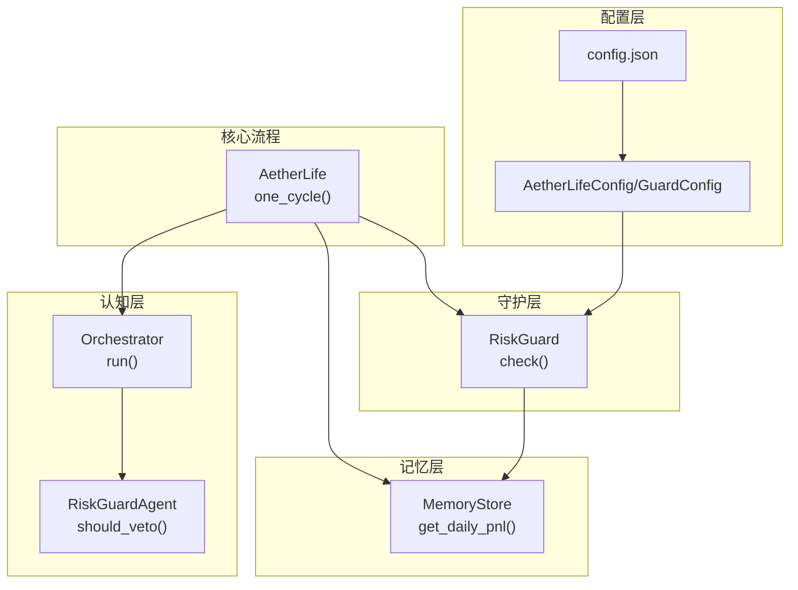
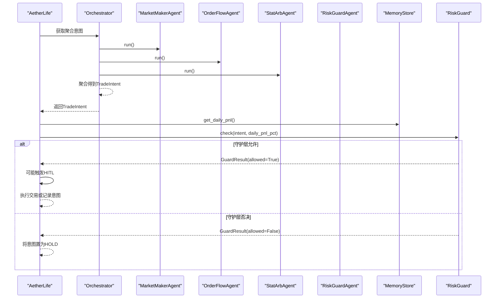
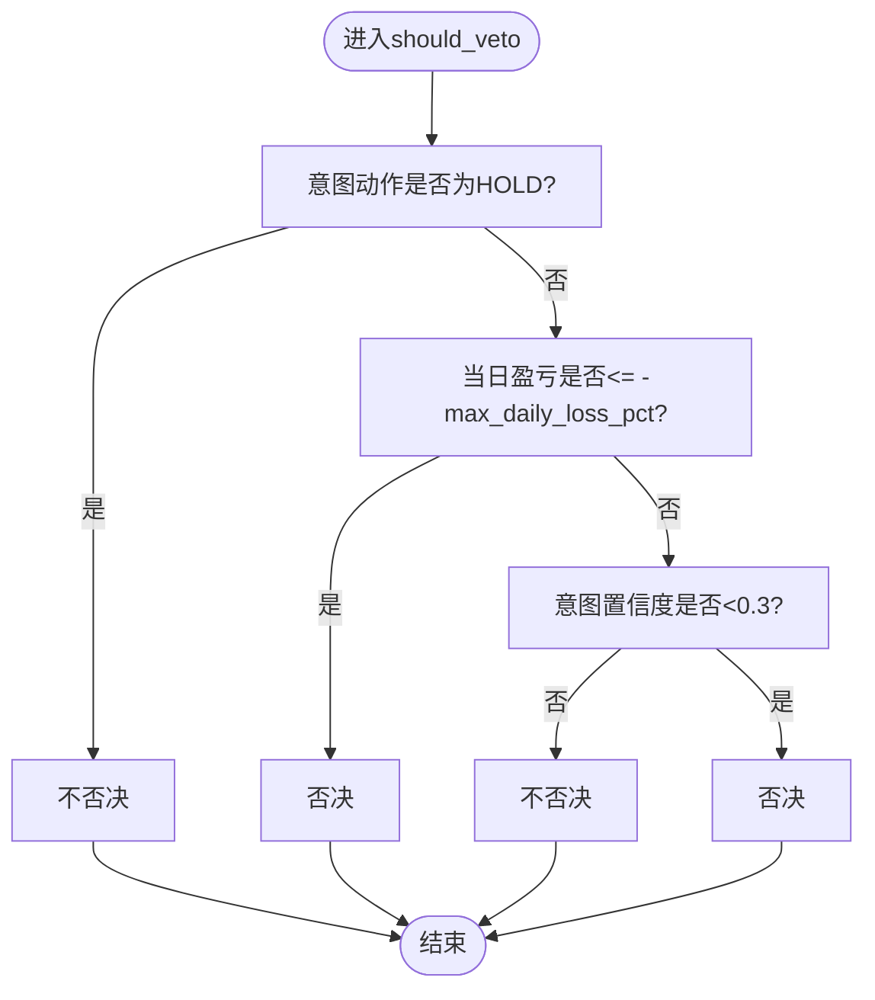
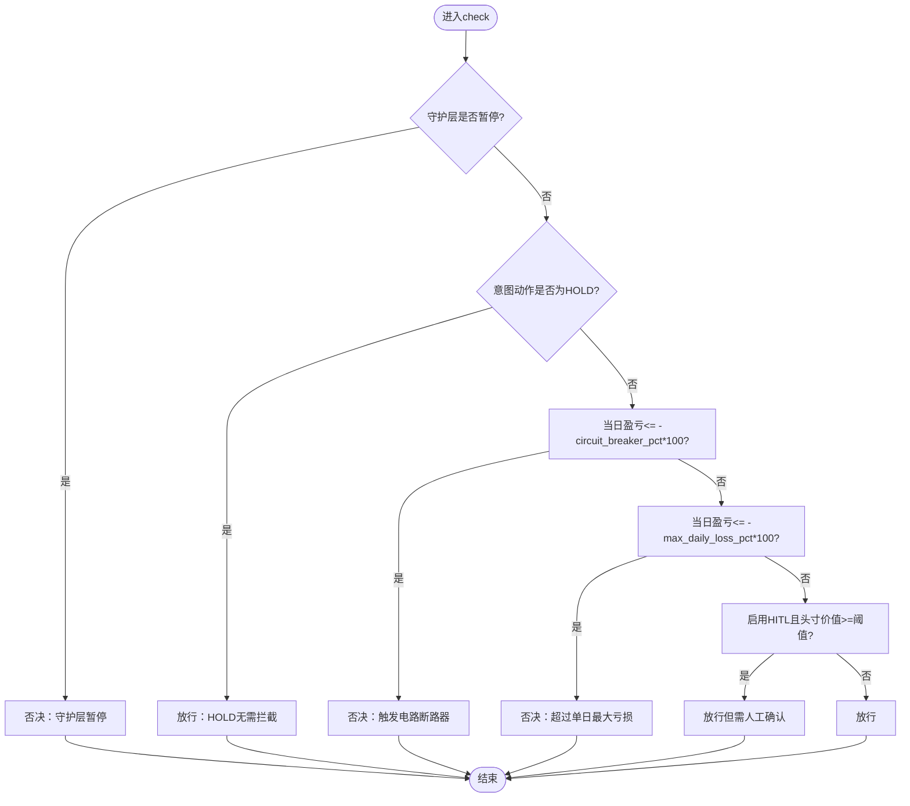
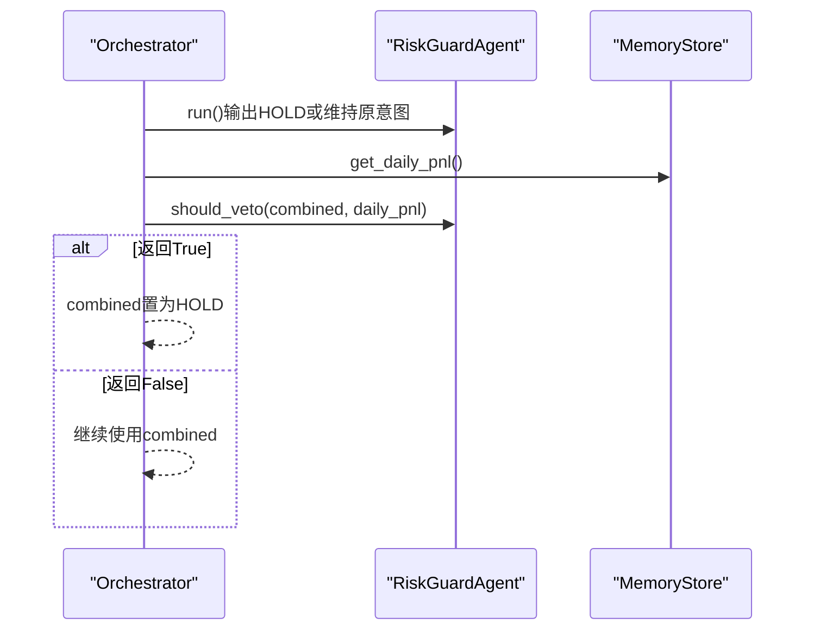
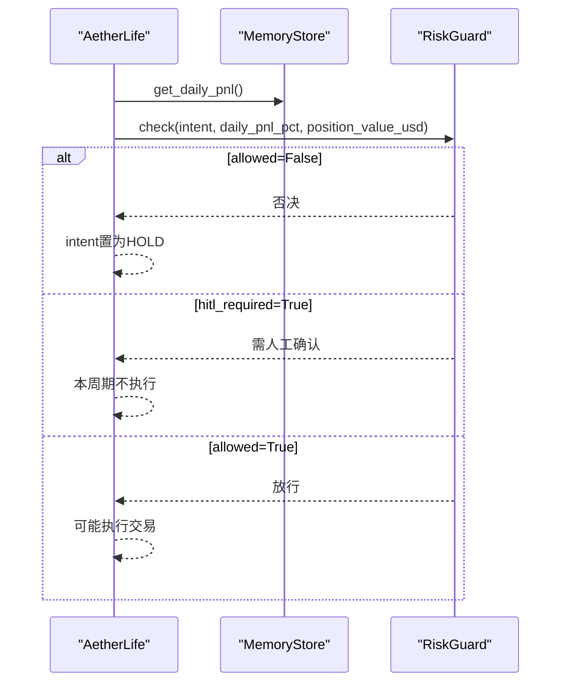
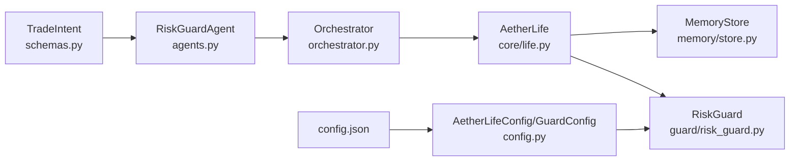

# RiskGuardAgent风控代理

<cite>
**本文档引用的文件**
- [src/aetherlife/cognition/agents.py](file://src/aetherlife/cognition/agents.py)
- [src/aetherlife/cognition/orchestrator.py](file://src/aetherlife/cognition/orchestrator.py)
- [src/aetherlife/guard/risk_guard.py](file://src/aetherlife/guard/risk_guard.py)
- [src/aetherlife/core/life.py](file://src/aetherlife/core/life.py)
- [src/aetherlife/memory/store.py](file://src/aetherlife/memory/store.py)
- [src/aetherlife/config.py](file://src/aetherlife/config.py)
- [configs/config.json](file://configs/config.json)
- [src/aetherlife/cognition/schemas.py](file://src/aetherlife/cognition/schemas.py)
</cite>

## 目录
1. [简介](#简介)
2. [项目结构](#项目结构)
3. [核心组件](#核心组件)
4. [架构总览](#架构总览)
5. [详细组件分析](#详细组件分析)
6. [依赖关系分析](#依赖关系分析)
7. [性能考量](#性能考量)
8. [故障排查指南](#故障排查指南)
9. [结论](#结论)
10. [附录](#附录)

## 简介
本文件面向RiskGuardAgent风控代理，系统性阐述其“一票否决”机制的设计与实现，包括should_veto方法的决策逻辑与触发条件；解释daily_pnl每日盈亏、max_daily_loss_pct最大日损失百分比与confidence置信度之间的关系；说明风控代理与其他代理的协作模式及其对交易意图执行的影响；提供风控参数配置指南与最佳实践，并给出实际应用案例与故障处理方案。

## 项目结构
围绕风控代理的关键文件组织如下：
- 认知层：RiskGuardAgent定义于agents.py，负责输出HOLD或维持原意图，核心否决逻辑在should_veto方法
- 协调器：Orchestrator在聚合多Agent意图后调用RiskGuardAgent进行否决
- 守护层：RiskGuard执行实时风控检查，支持电路断路器、单日最大亏损、大额人工确认（HITL）
- 记忆层：MemoryStore提供get_daily_pnl用于计算当日累计盈亏
- 核心流程：AetherLife主循环在决策后调用守护层检查
- 配置层：AetherLifeConfig与config.json提供风控参数来源

图表来源
- [src/aetherlife/cognition/orchestrator.py](file://src/aetherlife/cognition/orchestrator.py#L38-L53)
- [src/aetherlife/cognition/agents.py](file://src/aetherlife/cognition/agents.py#L50-L68)
- [src/aetherlife/guard/risk_guard.py](file://src/aetherlife/guard/risk_guard.py#L48-L68)
- [src/aetherlife/memory/store.py](file://src/aetherlife/memory/store.py#L140-L145)
- [src/aetherlife/core/life.py](file://src/aetherlife/core/life.py#L59-L87)
- [src/aetherlife/config.py](file://src/aetherlife/config.py#L70-L82)
- [configs/config.json](file://configs/config.json#L15-L20)

章节来源
- [src/aetherlife/cognition/orchestrator.py](file://src/aetherlife/cognition/orchestrator.py#L16-L53)
- [src/aetherlife/cognition/agents.py](file://src/aetherlife/cognition/agents.py#L50-L68)
- [src/aetherlife/guard/risk_guard.py](file://src/aetherlife/guard/risk_guard.py#L23-L68)
- [src/aetherlife/memory/store.py](file://src/aetherlife/memory/store.py#L140-L145)
- [src/aetherlife/core/life.py](file://src/aetherlife/core/life.py#L59-L87)
- [src/aetherlife/config.py](file://src/aetherlife/config.py#L70-L82)
- [configs/config.json](file://configs/config.json#L15-L20)

## 核心组件
- RiskGuardAgent：仅输出HOLD或维持原意图，核心否决逻辑在should_veto方法，依据意图动作、置信度与当日盈亏阈值进行判断
- Orchestrator：聚合多Agent意图后，调用RiskGuardAgent进行“一票否决”
- RiskGuard：实时风控检查，支持电路断路器、单日最大亏损、大额人工确认（HITL），并提供审计能力
- MemoryStore：提供get_daily_pnl用于计算当日累计盈亏
- AetherLife：主循环在决策后调用守护层检查，决定是否执行交易

章节来源
- [src/aetherlife/cognition/agents.py](file://src/aetherlife/cognition/agents.py#L50-L68)
- [src/aetherlife/cognition/orchestrator.py](file://src/aetherlife/cognition/orchestrator.py#L38-L53)
- [src/aetherlife/guard/risk_guard.py](file://src/aetherlife/guard/risk_guard.py#L23-L68)
- [src/aetherlife/memory/store.py](file://src/aetherlife/memory/store.py#L140-L145)
- [src/aetherlife/core/life.py](file://src/aetherlife/core/life.py#L59-L87)

## 架构总览
风控代理在系统中的位置与交互如下：

图表来源
- [src/aetherlife/core/life.py](file://src/aetherlife/core/life.py#L59-L87)
- [src/aetherlife/cognition/orchestrator.py](file://src/aetherlife/cognition/orchestrator.py#L38-L53)
- [src/aetherlife/guard/risk_guard.py](file://src/aetherlife/guard/risk_guard.py#L48-L68)
- [src/aetherlife/memory/store.py](file://src/aetherlife/memory/store.py#L140-L145)

## 详细组件分析

### RiskGuardAgent：一票否决机制
- 角色定位：仅输出HOLD或维持原意图，不主动发起交易，专门负责“否决”
- 决策方法：should_veto(intent, daily_pnl, max_daily_loss_pct)
  - 若意图动作为HOLD，则不否决
  - 若当日盈亏小于等于-max_daily_loss_pct（百分比形式），则否决
  - 若意图置信度低于阈值（例如0.3），则否决
- 设计要点：
  - 与Orchestrator配合：Orchestrator在聚合意图后调用should_veto，若返回True则将最终意图置为HOLD
  - 与RiskGuard协同：RiskGuard在守护层执行更严格的实时检查，包括电路断路器与HITL

图表来源
- [src/aetherlife/cognition/agents.py](file://src/aetherlife/cognition/agents.py#L60-L68)

章节来源
- [src/aetherlife/cognition/agents.py](file://src/aetherlife/cognition/agents.py#L50-L68)

### RiskGuard：实时风控检查
- 功能职责：执行前最后一道关卡，支持电路断路器、单日最大亏损、HITL与审计
- 关键参数：
  - circuit_breaker_pct：电路断路器触发阈值（百分比）
  - max_daily_loss_pct：单日最大亏损阈值（百分比）
  - hitl_enabled：是否启用大额人工确认
  - hitl_threshold_usd：大额阈值（美元）
- 检查逻辑：
  - 若守护层被暂停，则直接否决
  - 若意图动作为HOLD，则放行
  - 若当日盈亏≤-circuit_breaker_pct*100%，触发断路器，否决
  - 若当日盈亏≤-max_daily_loss_pct*100%，超过单日最大亏损，否决
  - 若启用HITL且头寸价值≥阈值，则放行但标记需要人工确认
  - 否则放行

图表来源
- [src/aetherlife/guard/risk_guard.py](file://src/aetherlife/guard/risk_guard.py#L48-L68)

章节来源
- [src/aetherlife/guard/risk_guard.py](file://src/aetherlife/guard/risk_guard.py#L23-L68)

### Orchestrator：多代理聚合与否决
- 职责：并行运行多个Agent，聚合得到TradeIntent，随后调用RiskGuardAgent进行“一票否决”
- 关键流程：
  - 并行调用Agent.run()，聚合得到combined
  - 读取MemoryStore.get_daily_pnl()作为daily_pnl
  - 调用RiskGuardAgent.should_veto(combined, daily_pnl)
  - 若返回True，将combined置为HOLD

图表来源
- [src/aetherlife/cognition/orchestrator.py](file://src/aetherlife/cognition/orchestrator.py#L38-L53)
- [src/aetherlife/cognition/agents.py](file://src/aetherlife/cognition/agents.py#L50-L68)
- [src/aetherlife/memory/store.py](file://src/aetherlife/memory/store.py#L140-L145)

章节来源
- [src/aetherlife/cognition/orchestrator.py](file://src/aetherlife/cognition/orchestrator.py#L16-L53)

### AetherLife主循环：守护层集成
- 在one_cycle中：
  - 获取MemoryStore.get_daily_pnl()，换算为daily_pnl_pct（百分比）
  - 调用RiskGuard.check(intent, daily_pnl_pct, position_value_usd=0)
  - 若allowed=False，将intent置为HOLD
  - 若hitl_required=True，本周期不执行，等待人工确认

图表来源
- [src/aetherlife/core/life.py](file://src/aetherlife/core/life.py#L59-L87)
- [src/aetherlife/guard/risk_guard.py](file://src/aetherlife/guard/risk_guard.py#L48-L68)
- [src/aetherlife/memory/store.py](file://src/aetherlife/memory/store.py#L140-L145)

章节来源
- [src/aetherlife/core/life.py](file://src/aetherlife/core/life.py#L59-L87)

### daily_pnl、max_daily_loss_pct与confidence的关系
- daily_pnl：由MemoryStore.get_daily_pnl()计算，为当日累计盈亏（单位通常为货币）
- daily_pnl_pct：在AetherLife中换算为百分比（基于基准估算），用于RiskGuard.check与RiskGuardAgent.should_veto
- max_daily_loss_pct：风控阈值，决定是否触发“超过单日最大亏损”的否决
- confidence：RiskGuardAgent.should_veto中对意图置信度的阈值检查，避免低置信度交易导致风险放大
- 关系总结：
  - RiskGuard.check优先级更高：若触发电路断路器或超过单日最大亏损，直接否决
  - RiskGuardAgent.should_veto作为第二道防线：在RiskGuard放行的前提下，进一步过滤低置信度或高风险意图

章节来源
- [src/aetherlife/memory/store.py](file://src/aetherlife/memory/store.py#L140-L145)
- [src/aetherlife/core/life.py](file://src/aetherlife/core/life.py#L75-L77)
- [src/aetherlife/guard/risk_guard.py](file://src/aetherlife/guard/risk_guard.py#L48-L68)
- [src/aetherlife/cognition/agents.py](file://src/aetherlife/cognition/agents.py#L60-L68)

## 依赖关系分析
- RiskGuardAgent依赖：
  - TradeIntent结构（包含action、confidence等）
  - Orchestrator在聚合后调用should_veto
- RiskGuard依赖：
  - GuardResult返回值
  - MemoryStore.get_daily_pnl()提供的daily_pnl
  - 配置参数（来自AetherLifeConfig/GuardConfig）
- AetherLife依赖：
  - Orchestrator与RiskGuard的协作
  - MemoryStore提供daily_pnl
  - 配置参数注入到RiskGuard

图表来源
- [src/aetherlife/cognition/schemas.py](file://src/aetherlife/cognition/schemas.py#L32-L58)
- [src/aetherlife/cognition/agents.py](file://src/aetherlife/cognition/agents.py#L50-L68)
- [src/aetherlife/cognition/orchestrator.py](file://src/aetherlife/cognition/orchestrator.py#L38-L53)
- [src/aetherlife/core/life.py](file://src/aetherlife/core/life.py#L59-L87)
- [src/aetherlife/memory/store.py](file://src/aetherlife/memory/store.py#L140-L145)
- [src/aetherlife/guard/risk_guard.py](file://src/aetherlife/guard/risk_guard.py#L23-L68)
- [src/aetherlife/config.py](file://src/aetherlife/config.py#L70-L82)
- [configs/config.json](file://configs/config.json#L15-L20)

章节来源
- [src/aetherlife/cognition/schemas.py](file://src/aetherlife/cognition/schemas.py#L32-L58)
- [src/aetherlife/cognition/orchestrator.py](file://src/aetherlife/cognition/orchestrator.py#L16-L53)
- [src/aetherlife/core/life.py](file://src/aetherlife/core/life.py#L59-L87)
- [src/aetherlife/guard/risk_guard.py](file://src/aetherlife/guard/risk_guard.py#L23-L68)
- [src/aetherlife/config.py](file://src/aetherlife/config.py#L70-L82)
- [configs/config.json](file://configs/config.json#L15-L20)

## 性能考量
- RiskGuardAgent.should_veto为轻量逻辑，仅进行数值比较，对整体延迟影响极小
- RiskGuard.check在AetherLife主循环中调用，属于高频检查，建议保持简单判断逻辑
- MemoryStore.get_daily_pnl()基于内存队列求和，复杂度与当日交易数量线性相关，建议合理设置事件上限
- 配置参数应结合交易频率与资金规模调整，避免过于严苛导致频繁否决或过于宽松带来风险

## 故障排查指南
- 现象：交易意图被风控否决
  - 检查RiskGuard.check返回原因：是否触发电路断路器、超过单日最大亏损、守护层暂停
  - 检查daily_pnl_pct是否异常（例如基准换算错误）
  - 检查AetherLifeConfig/GuardConfig参数是否正确注入
- 现象：HITL提示但未执行
  - 确认position_value_usd是否达到阈值
  - 确认hitl_enabled是否开启
- 现象：RiskGuardAgent.should_veto仍放行低置信度意图
  - 检查conf阈值是否过低
  - 确认Orchestrator是否正确调用should_veto
- 现象：审计日志缺失
  - 检查audit_log_path配置与权限
  - 检查回调函数是否正确设置

章节来源
- [src/aetherlife/guard/risk_guard.py](file://src/aetherlife/guard/risk_guard.py#L70-L84)
- [src/aetherlife/core/life.py](file://src/aetherlife/core/life.py#L75-L83)
- [src/aetherlife/config.py](file://src/aetherlife/config.py#L70-L82)

## 结论
RiskGuardAgent与RiskGuard共同构成系统的“一票否决”风控体系：前者在认知阶段对低置信度或高风险意图进行二次过滤，后者在执行前进行实时风控检查。二者配合电路断路器、单日最大亏损与HITL机制，有效平衡了系统灵活性与安全性。通过合理的参数配置与监控审计，可在不同市场环境下稳定运行。

## 附录

### 配置指南与最佳实践
- 配置来源
  - AetherLifeConfig/GuardConfig：提供电路断路器、单日最大亏损、HITL开关与阈值、审计路径等
  - config.json：提供risk相关参数（如max_daily_loss）
- 参数建议
  - circuit_breaker_pct：建议设置为max_daily_loss_pct的约50%-70%，形成“预警-保护”两级机制
  - max_daily_loss_pct：根据资金规模与交易频率设定，一般在5%-15%区间
  - hitl_enabled与hitl_threshold_usd：大额交易场景建议开启，阈值根据账户规模设定
  - confidence阈值：建议不低于0.3，避免低置信度交易引发系统性风险
- 最佳实践
  - 分阶段验证：先以保守参数运行，逐步放宽
  - 审计留痕：确保audit_log_path可用，便于事后追溯
  - 监控告警：结合日志与UI仪表盘，关注否决率与HITL触发频次

章节来源
- [src/aetherlife/config.py](file://src/aetherlife/config.py#L70-L82)
- [configs/config.json](file://configs/config.json#L15-L20)
- [src/aetherlife/guard/risk_guard.py](file://src/aetherlife/guard/risk_guard.py#L26-L40)

### 实际应用案例
- 场景A：单日连续亏损接近max_daily_loss_pct
  - RiskGuard.check触发“超过单日最大亏损”，intent被置为HOLD，避免进一步扩大损失
- 场景B：意图置信度极低
  - RiskGuardAgent.should_veto返回True，即使RiskGuard放行，最终仍被置为HOLD
- 场景C：大额头寸
  - RiskGuard.check返回hitl_required=True，系统提示人工确认，本周期不执行

章节来源
- [src/aetherlife/guard/risk_guard.py](file://src/aetherlife/guard/risk_guard.py#L48-L68)
- [src/aetherlife/cognition/agents.py](file://src/aetherlife/cognition/agents.py#L60-L68)
- [src/aetherlife/core/life.py](file://src/aetherlife/core/life.py#L75-L83)