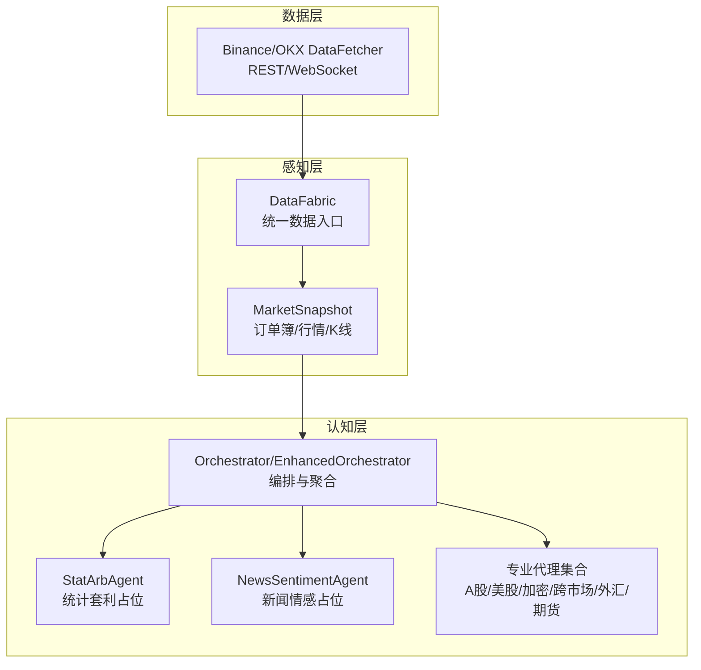
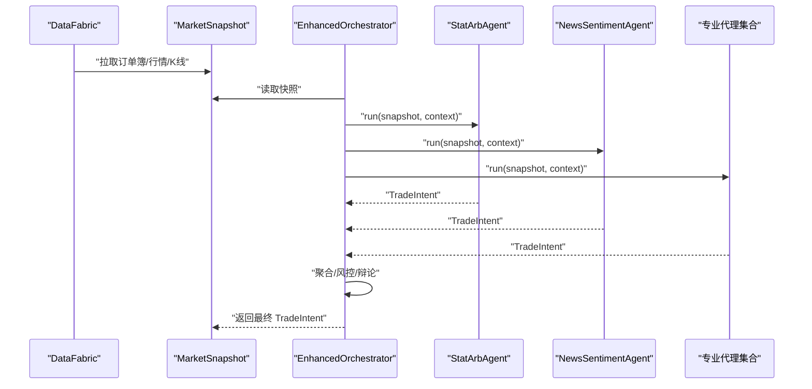
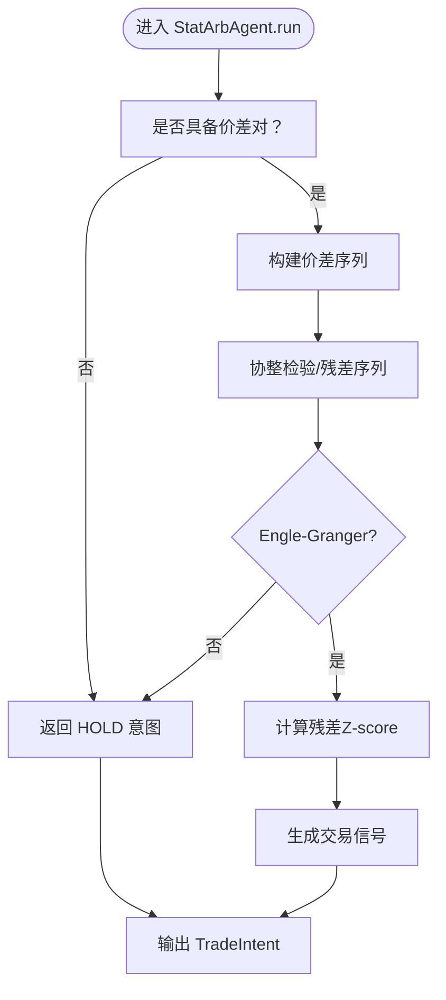
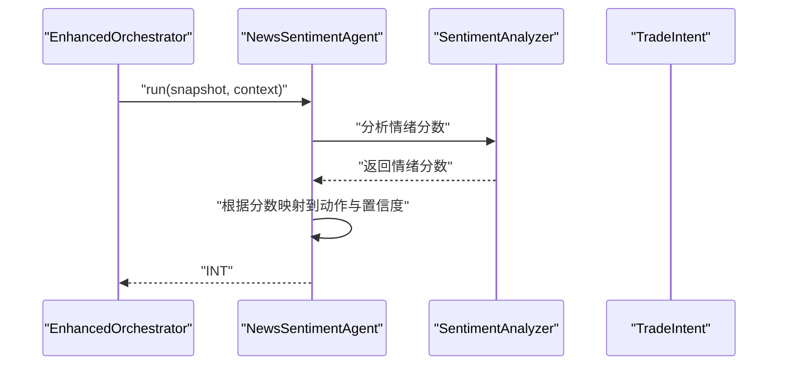
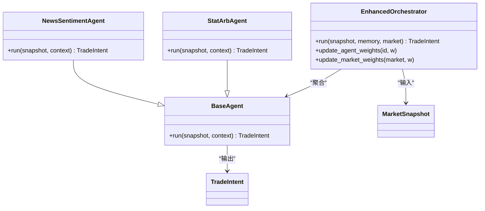
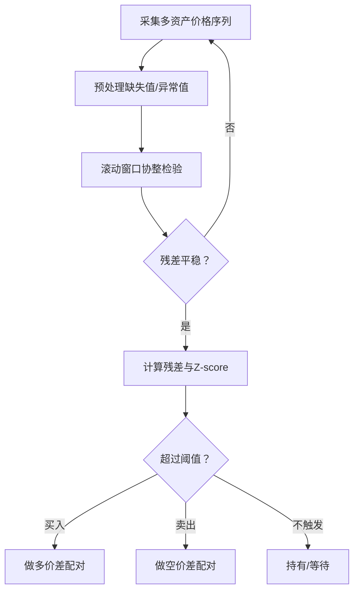
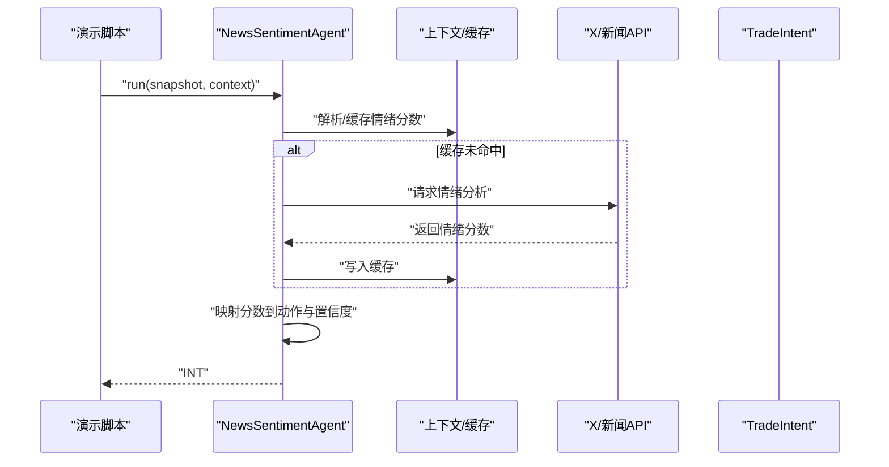
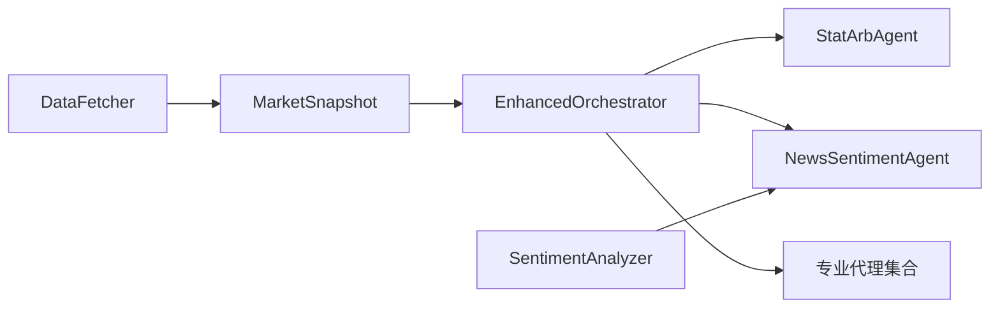

# 专业代理集合

<cite>
**本文引用的文件**
- [src/aetherlife/cognition/agents.py](file://src/aetherlife/cognition/agents.py)
- [src/aetherlife/cognition/agent_specialized.py](file://src/aetherlife/cognition/agent_specialized.py)
- [src/aetherlife/cognition/agent_cross_market.py](file://src/aetherlife/cognition/agent_cross_market.py)
- [src/aetherlife/cognition/schemas.py](file://src/aetherlife/cognition/schemas.py)
- [src/aetherlife/cognition/orchestrator.py](file://src/aetherlife/cognition/orchestrator.py)
- [src/aetherlife/cognition/orchestrator_enhanced.py](file://src/aetherlife/cognition/orchestrator_enhanced.py)
- [src/aetherlife/perception/models.py](file://src/aetherlife/perception/models.py)
- [src/aetherlife/perception/fabric.py](file://src/aetherlife/perception/fabric.py)
- [src/data/data_fetcher.py](file://src/data/data_fetcher.py)
- [configs/config.json](file://configs/config.json)
- [scripts/cognition_multi_agent_demo.py](file://scripts/cognition_multi_agent_demo.py)
- [docs/COGNITION_UPGRADE_GUIDE.md](file://docs/COGNITION_UPGRADE_GUIDE.md)
- [src/utils/ai_enhancer.py](file://src/utils/ai_enhancer.py)
</cite>

## 目录
1. [引言](#引言)
2. [项目结构](#项目结构)
3. [核心组件](#核心组件)
4. [架构总览](#架构总览)
5. [详细组件分析](#详细组件分析)
6. [依赖关系分析](#依赖关系分析)
7. [性能考量](#性能考量)
8. [故障排查指南](#故障排查指南)
9. [结论](#结论)
10. [附录](#附录)

## 引言
本文件面向“专业代理集合”的技术文档，聚焦两类核心代理：StatArbAgent（统计套利代理）与NewsSentimentAgent（新闻情感代理）。文档将系统阐述其算法原理、实现框架、与感知层/编排器的交互方式，并给出专业代理的分类体系、应用场景、配置参数、性能特点与使用建议，同时提供扩展开发指南与集成最佳实践。

## 项目结构
专业代理位于认知层（Cognition），围绕统一的决策输出模型（TradeIntent）进行协作，通过编排器（Orchestrator/EnhancedOrchestrator）聚合多代理意见，结合风控与记忆系统，形成最终交易意图。感知层负责统一市场快照（MarketSnapshot）与订单簿（OrderBookSlice）等数据结构。

图表来源
- [src/aetherlife/perception/fabric.py](file://src/aetherlife/perception/fabric.py#L32-L82)
- [src/aetherlife/perception/models.py](file://src/aetherlife/perception/models.py#L54-L64)
- [src/aetherlife/cognition/orchestrator_enhanced.py](file://src/aetherlife/cognition/orchestrator_enhanced.py#L84-L151)
- [src/aetherlife/cognition/agents.py](file://src/aetherlife/cognition/agents.py#L90-L108)
- [src/data/data_fetcher.py](file://src/data/data_fetcher.py#L400-L407)

章节来源
- [src/aetherlife/perception/fabric.py](file://src/aetherlife/perception/fabric.py#L13-L82)
- [src/aetherlife/perception/models.py](file://src/aetherlife/perception/models.py#L15-L64)
- [src/aetherlife/cognition/orchestrator_enhanced.py](file://src/aetherlife/cognition/orchestrator_enhanced.py#L21-L151)

## 核心组件
- 代理基类与通用代理
  - BaseAgent：抽象基类，定义 run 接口
  - MarketMakerAgent、OrderFlowAgent、RiskGuardAgent、StatArbAgent、NewsSentimentAgent：通用代理
- 专业代理集合
  - ChinaAStockAgent、GlobalStockAgent、CryptoNanoAgent：按市场细分
  - CrossMarketLeadLagAgent、ForexMicroAgent、FuturesMicroAgent、SentimentAgent：跨市场/微结构/情绪
- 决策输出与上下文
  - TradeIntent：标准化输出（动作、市场、符号、仓位、置信度、风控参数、元数据）
  - DecisionContext、LangGraphState：上下文与状态机
- 编排器
  - Orchestrator（基础）、EnhancedOrchestrator（增强版）：并行执行、聚合、风控、辩论

章节来源
- [src/aetherlife/cognition/agents.py](file://src/aetherlife/cognition/agents.py#L13-L108)
- [src/aetherlife/cognition/agent_specialized.py](file://src/aetherlife/cognition/agent_specialized.py#L17-L351)
- [src/aetherlife/cognition/agent_cross_market.py](file://src/aetherlife/cognition/agent_cross_market.py#L16-L404)
- [src/aetherlife/cognition/schemas.py](file://src/aetherlife/cognition/schemas.py#L32-L162)
- [src/aetherlife/cognition/orchestrator.py](file://src/aetherlife/cognition/orchestrator.py#L16-L93)
- [src/aetherlife/cognition/orchestrator_enhanced.py](file://src/aetherlife/cognition/orchestrator_enhanced.py#L21-L323)

## 架构总览
下图展示了从感知层到决策层的关键交互路径，以及两类目标代理在整体中的位置与职责。

图表来源
- [src/aetherlife/perception/fabric.py](file://src/aetherlife/perception/fabric.py#L32-L82)
- [src/aetherlife/cognition/orchestrator_enhanced.py](file://src/aetherlife/cognition/orchestrator_enhanced.py#L113-L151)
- [src/aetherlife/cognition/agents.py](file://src/aetherlife/cognition/agents.py#L90-L108)

## 详细组件分析

### StatArbAgent（统计套利代理）
- 角色定位
  - 通用代理之一，标注 Phase 1+ 可接入协整等统计套利方法
  - 当前实现为占位：单资产 MVP 无价差对，直接返回观望
- 设计要点
  - 保持与 TradeIntent 的一致输出，便于编排器聚合
  - 为后续协整/价差对构建留出扩展点
- 性能与复杂度
  - 当前复杂度 O(1)，未来若引入协整检验与滚动回归，时间复杂度将取决于样本长度与频率
- 配置与使用
  - 在 Orchestrator/EnhancedOrchestrator 中作为基础代理参与聚合
  - 可通过权重调节其影响力

图表来源
- [src/aetherlife/cognition/agents.py](file://src/aetherlife/cognition/agents.py#L90-L98)

章节来源
- [src/aetherlife/cognition/agents.py](file://src/aetherlife/cognition/agents.py#L90-L98)

### NewsSentimentAgent（新闻情感代理）
- 角色定位
  - 通用代理之一，标注 Phase 1+ 接入 X/新闻 API
  - 当前实现为占位：返回 HOLD
- 设计要点
  - 与 DecisionContext/SentimentData 结构兼容，便于接入真实情绪数据
  - 可通过上下文 context 或外部情绪分析器（如 AI 增强模块）注入情绪分数
- 性能与复杂度
  - 当前复杂度 O(1)，未来接入外部 API 时主要受网络延迟与缓存命中率影响
- 配置与使用
  - 在 Orchestrator/EnhancedOrchestrator 中作为基础代理参与聚合
  - 可通过权重提升其影响力（见演示脚本）

图表来源
- [src/aetherlife/cognition/agents.py](file://src/aetherlife/cognition/agents.py#L101-L108)
- [src/utils/ai_enhancer.py](file://src/utils/ai_enhancer.py#L15-L32)

章节来源
- [src/aetherlife/cognition/agents.py](file://src/aetherlife/cognition/agents.py#L101-L108)
- [src/utils/ai_enhancer.py](file://src/utils/ai_enhancer.py#L15-L32)

### 专业代理分类体系与应用场景
- A股专家（ChinaAStockAgent）
  - 场景：沪深A股（通过 Stock Connect）
  - 特性：北向额度、交易时段、涨跌停、印花税、T+1
- 全球股票专家（GlobalStockAgent）
  - 场景：美股、港股、国际股票
  - 特性：盘前盘后、Fractional shares、多时区
- 加密货币专家（CryptoNanoAgent）
  - 场景：加密货币 nano 永续
  - 特性：高频、24/7、资金费率（待接入）
- 跨市场套利专家（CrossMarketLeadLagAgent）
  - 场景：跨市场领先-滞后效应（如 BTC→A股科技股）
  - 特性：价格历史缓存、相关性计算、延迟信号
- 外汇专家（ForexMicroAgent）
  - 场景：外汇 Micro 合约
  - 特性：点差敏感、日内波动
- 期货专家（FuturesMicroAgent）
  - 场景：Micro E-mini、nano 期货
  - 特性：基差分析（待接入）、展期换月（待接入）
- 情绪专家（SentimentAgent）
  - 场景：多源情绪数据（X/新闻/微信/雪球/Reddit）
  - 特性：情绪分数映射到交易意图

章节来源
- [src/aetherlife/cognition/agent_specialized.py](file://src/aetherlife/cognition/agent_specialized.py#L17-L351)
- [src/aetherlife/cognition/agent_cross_market.py](file://src/aetherlife/cognition/agent_cross_market.py#L16-L404)
- [docs/COGNITION_UPGRADE_GUIDE.md](file://docs/COGNITION_UPGRADE_GUIDE.md#L5-L125)

### 编排器与多代理协作
- 基础编排器（Orchestrator）
  - 并行执行多个代理，简单加权聚合，风控否决
- 增强编排器（EnhancedOrchestrator）
  - 自动推断市场类型，按市场选择相关代理，支持辩论模式，动态权重调整，应用市场权重

图表来源
- [src/aetherlife/cognition/orchestrator_enhanced.py](file://src/aetherlife/cognition/orchestrator_enhanced.py#L21-L323)
- [src/aetherlife/cognition/agents.py](file://src/aetherlife/cognition/agents.py#L13-L108)

章节来源
- [src/aetherlife/cognition/orchestrator.py](file://src/aetherlife/cognition/orchestrator.py#L16-L93)
- [src/aetherlife/cognition/orchestrator_enhanced.py](file://src/aetherlife/cognition/orchestrator_enhanced.py#L84-L323)

### 协整分析与价差对构建（面向 StatArbAgent 的实现蓝图）
- 数据准备
  - 通过 DataFabric 与 DataFetcher 获取多资产历史价格序列（K线/成交）
- 价差对筛选
  - 基于滚动协整检验（如 Engle-Granger 两步法）识别平稳残差序列
  - 计算残差 Z-score，设定阈值生成交易信号
- 风险控制
  - 设置止损止盈、动态头寸管理、回撤控制
- 性能优化
  - 使用滑动窗口与缓存，减少重复计算
  - 并行化多资产协整检验

图表来源
- [src/aetherlife/perception/fabric.py](file://src/aetherlife/perception/fabric.py#L32-L82)
- [src/data/data_fetcher.py](file://src/data/data_fetcher.py#L40-L119)
- [src/aetherlife/cognition/agents.py](file://src/aetherlife/cognition/agents.py#L90-L98)

章节来源
- [src/aetherlife/perception/fabric.py](file://src/aetherlife/perception/fabric.py#L32-L82)
- [src/data/data_fetcher.py](file://src/data/data_fetcher.py#L40-L119)
- [src/aetherlife/cognition/agents.py](file://src/aetherlife/cognition/agents.py#L90-L98)

### 新闻情感代理架构与 X/新闻 API 集成
- 架构设计
  - 从上下文或外部情绪分析器获取情绪分数（-1 到 1）
  - 将情绪映射到 Buy/Sell/Hold 与置信度
- X/新闻 API 集成建议
  - Twitter/X：获取话题热度、关键词趋势
  - 新闻：NewsAPI/GDELT，抓取宏观事件与个股新闻
  - 社媒：微信公众号、雪球、Reddit
- 情绪分析器（AI 增强）
  - SentimentAnalyzer：统一情绪分数接口，支持缓存与指数查询

图表来源
- [scripts/cognition_multi_agent_demo.py](file://scripts/cognition_multi_agent_demo.py#L109-L117)
- [src/aetherlife/cognition/agents.py](file://src/aetherlife/cognition/agents.py#L101-L108)
- [src/utils/ai_enhancer.py](file://src/utils/ai_enhancer.py#L15-L32)

章节来源
- [scripts/cognition_multi_agent_demo.py](file://scripts/cognition_multi_agent_demo.py#L109-L117)
- [src/aetherlife/cognition/agents.py](file://src/aetherlife/cognition/agents.py#L101-L108)
- [src/utils/ai_enhancer.py](file://src/utils/ai_enhancer.py#L15-L32)

## 依赖关系分析
- 组件耦合
  - 代理均依赖 MarketSnapshot 与 TradeIntent，耦合度低，内聚性高
  - 编排器通过抽象接口聚合代理，支持动态选择与权重调整
- 外部依赖
  - 数据层：Binance/OKX REST/WebSocket
  - 情绪分析：可插拔的 SentimentAnalyzer
- 潜在循环依赖
  - 未发现循环导入；模块间通过接口解耦

图表来源
- [src/data/data_fetcher.py](file://src/data/data_fetcher.py#L400-L407)
- [src/aetherlife/perception/models.py](file://src/aetherlife/perception/models.py#L54-L64)
- [src/aetherlife/cognition/orchestrator_enhanced.py](file://src/aetherlife/cognition/orchestrator_enhanced.py#L113-L151)
- [src/utils/ai_enhancer.py](file://src/utils/ai_enhancer.py#L15-L32)

章节来源
- [src/data/data_fetcher.py](file://src/data/data_fetcher.py#L400-L407)
- [src/aetherlife/cognition/orchestrator_enhanced.py](file://src/aetherlife/cognition/orchestrator_enhanced.py#L113-L151)

## 性能考量
- 并行执行
  - 编排器使用 asyncio.gather 并行调用代理，显著降低端到端延迟
- 聚合算法
  - 加权平均 quantity_pct 与 confidence，限制最大仓位（≤20%），避免过度集中
- 风控前置
  - 风控 Agent 在最终决策前进行否决判断，避免高风险执行
- 缓存与降噪
  - 情绪分析器缓存结果，减少重复请求
- I/O 优化
  - DataFabric 并行拉取订单簿/行情/K线，减少等待时间

章节来源
- [src/aetherlife/cognition/orchestrator_enhanced.py](file://src/aetherlife/cognition/orchestrator_enhanced.py#L113-L151)
- [src/aetherlife/cognition/agents.py](file://src/aetherlife/cognition/agents.py#L60-L68)
- [src/utils/ai_enhancer.py](file://src/utils/ai_enhancer.py#L15-L32)
- [src/aetherlife/perception/fabric.py](file://src/aetherlife/perception/fabric.py#L36-L41)

## 故障排查指南
- 代理返回 HOLD
  - 检查 MarketSnapshot 是否包含订单簿与必要字段
  - 确认上下文（context）是否包含必要的市场/情绪信息
- 聚合结果异常
  - 检查权重设置是否合理，是否存在极端权重导致偏差
  - 查看编排器日志，确认并行执行是否出现异常
- 风控否决
  - 检查当日收益与最大回撤阈值，必要时临时提高权重或降低仓位
- 外部 API 失败
  - 情绪分析器/数据获取器需具备超时与重试机制，确保稳定性

章节来源
- [src/aetherlife/cognition/orchestrator.py](file://src/aetherlife/cognition/orchestrator.py#L50-L53)
- [src/aetherlife/cognition/orchestrator_enhanced.py](file://src/aetherlife/cognition/orchestrator_enhanced.py#L136-L147)
- [src/data/data_fetcher.py](file://src/data/data_fetcher.py#L14-L25)

## 结论
专业代理集合以统一的 TradeIntent 为核心，通过编排器实现多代理并行与聚合，辅以风控与记忆系统，形成稳健的决策闭环。StatArbAgent 与 NewsSentimentAgent 当前处于占位阶段，为后续接入协整与情绪分析预留了清晰的扩展路径。借助模块化设计与可插拔的外部服务，系统可在不同市场与场景下灵活部署与优化。

## 附录

### 配置参数与使用建议
- 系统级配置（示例）
  - 交易所、测试网、标的、时间框架、策略、杠杆、风控、AI增强开关
- 代理权重与市场权重
  - 可通过增强编排器动态调整，适应不同市场环境
- 使用建议
  - 熊市降低加密货币市场权重，牛市提升情绪分析权重
  - 协整策略建议采用滚动窗口与缓存，避免频繁再平衡

章节来源
- [configs/config.json](file://configs/config.json#L1-L28)
- [src/aetherlife/cognition/orchestrator_enhanced.py](file://src/aetherlife/cognition/orchestrator_enhanced.py#L314-L322)
- [docs/COGNITION_UPGRADE_GUIDE.md](file://docs/COGNITION_UPGRADE_GUIDE.md#L149-L193)

### 扩展开发指南与集成最佳实践
- 新增代理
  - 继承 BaseAgent，实现 run 方法，返回 TradeIntent
  - 在增强编排器中注册，按需加入市场映射
- 协整实现
  - 使用滚动窗口与协整检验，注意数据质量与异常值处理
- 情绪分析
  - 统一情绪分数接口，结合缓存与指数查询，减少外部依赖
- 集成最佳实践
  - 保持输出格式一致，便于编排器聚合
  - 为每个代理编写单元测试与演示脚本
  - 通过配置文件与命令行参数控制行为

章节来源
- [src/aetherlife/cognition/agents.py](file://src/aetherlife/cognition/agents.py#L13-L22)
- [src/aetherlife/cognition/orchestrator_enhanced.py](file://src/aetherlife/cognition/orchestrator_enhanced.py#L189-L221)
- [scripts/cognition_multi_agent_demo.py](file://scripts/cognition_multi_agent_demo.py#L197-L235)