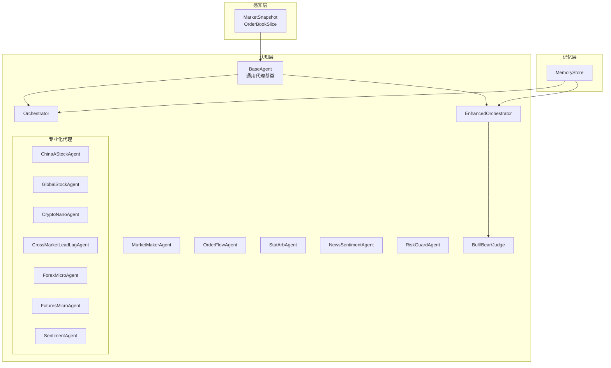
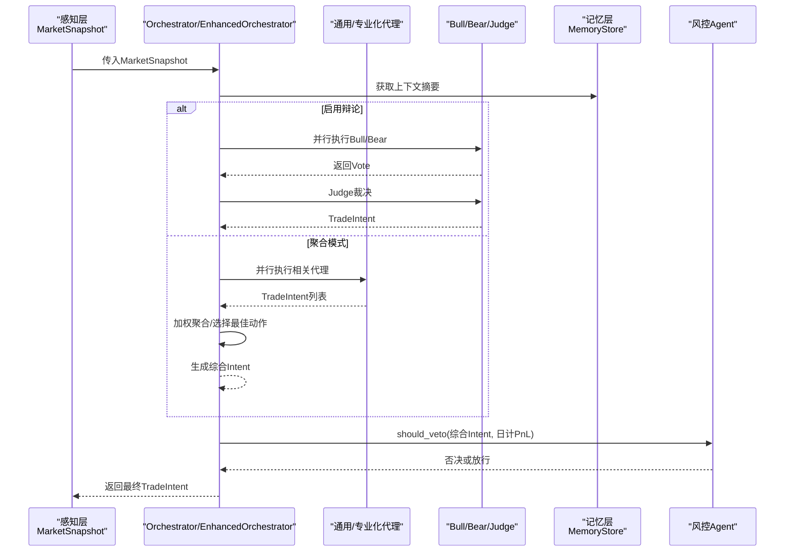
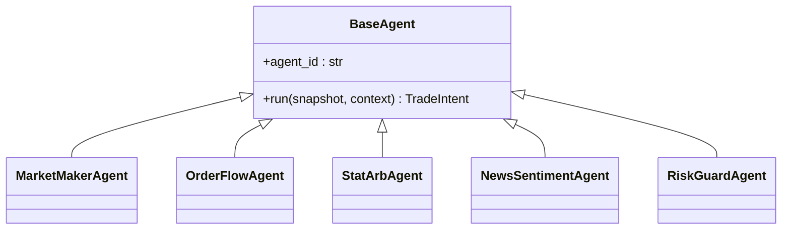
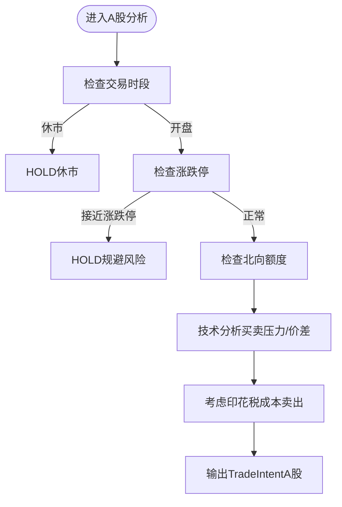
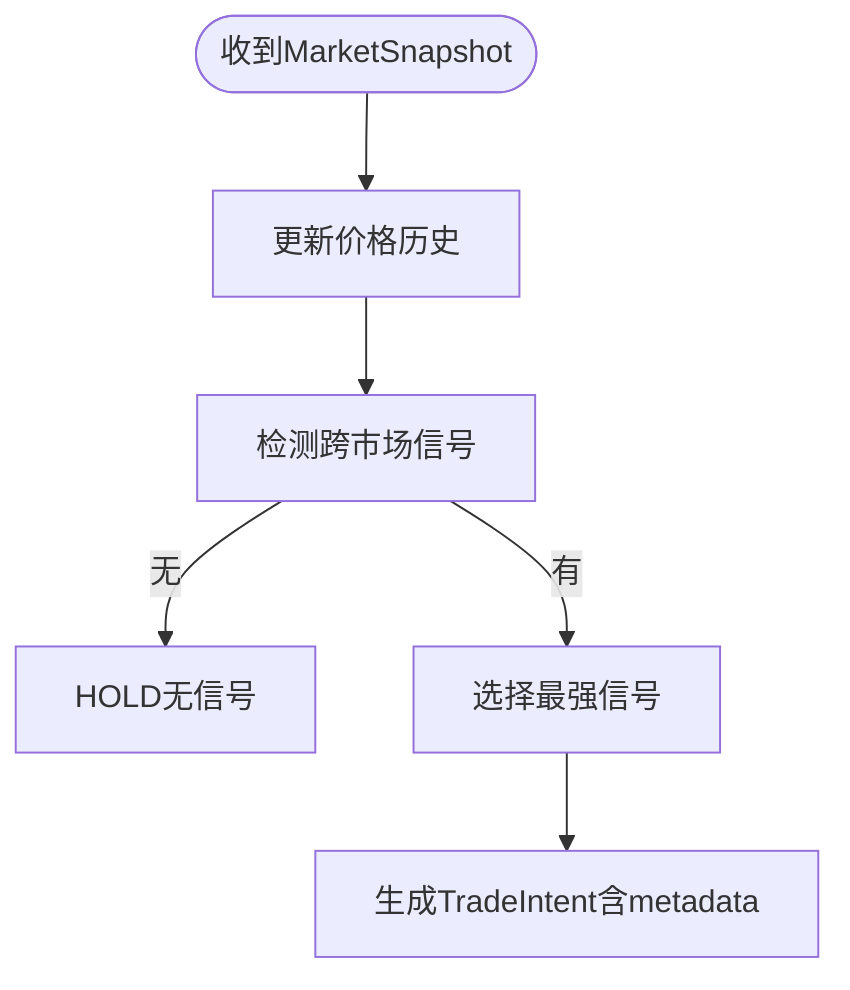
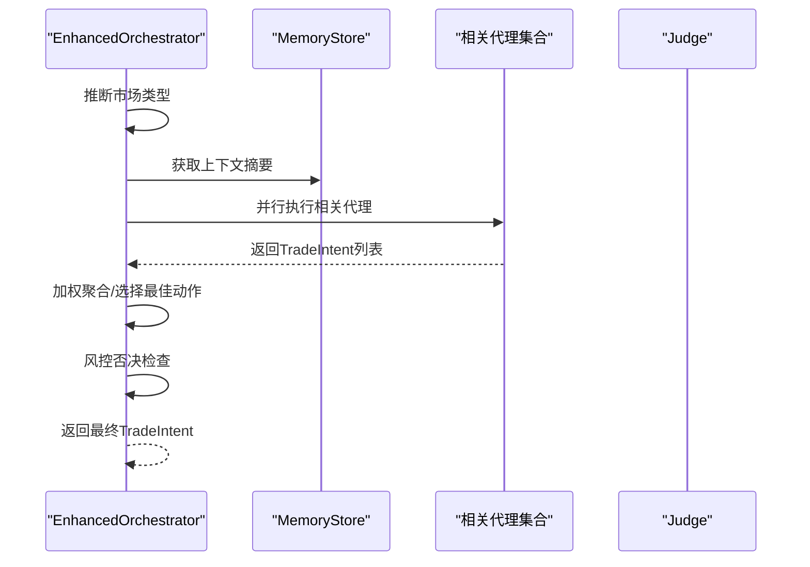
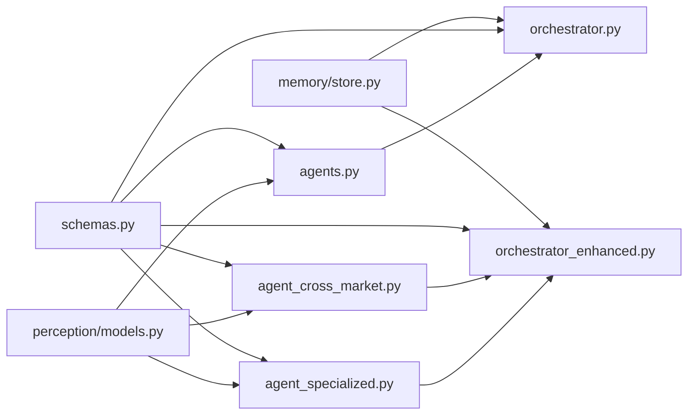

# 代理类型与功能

<cite>
**本文引用的文件**
- [src/aetherlife/cognition/agents.py](file://src/aetherlife/cognition/agents.py)
- [src/aetherlife/cognition/agent_specialized.py](file://src/aetherlife/cognition/agent_specialized.py)
- [src/a/aetherlife/cognition/agent_cross_market.py](file://src/aetherlife/cognition/agent_cross_market.py)
- [src/aetherlife/cognition/schemas.py](file://src/aetherlife/cognition/schemas.py)
- [src/aetherlife/cognition/orchestrator.py](file://src/aetherlife/cognition/orchestrator.py)
- [src/aetherlife/cognition/orchestrator_enhanced.py](file://src/aetherlife/cognition/orchestrator_enhanced.py)
- [src/aetherlife/cognition/debate.py](file://src/aetherlife/cognition/debate.py)
- [src/aetherlife/perception/models.py](file://src/aetherlife/perception/models.py)
- [src/aetherlife/memory/store.py](file://src/aetherlife/memory/store.py)
- [configs/aetherlife.json](file://configs/aetherlife.json)
- [src/aetherlife/cognition/__init__.py](file://src/aetherlife/cognition/__init__.py)
- [docs/DECISION_LAYER_GUIDE.md](file://docs/DECISION_LAYER_GUIDE.md)
</cite>

## 目录
1. [引言](#引言)
2. [项目结构](#项目结构)
3. [核心组件](#核心组件)
4. [架构总览](#架构总览)
5. [详细组件分析](#详细组件分析)
6. [依赖关系分析](#依赖关系分析)
7. [性能考量](#性能考量)
8. [故障排查指南](#故障排查指南)
9. [结论](#结论)
10. [附录](#附录)

## 引言
本文件面向AetherLife的认知层代理体系，系统性阐述代理类型、功能特性、算法原理与适用场景，并对比“跨市场代理”与“专业代理”的差异与协作机制。文档覆盖基础代理（做市商、订单流、统计套利、新闻情感、风控）、专业化代理（A股、全球股票、加密货币nano、跨市场Lead-Lag、外汇micro、期货micro、情绪Agent）以及编排器（Orchestrator与EnhancedOrchestrator）的工作流与数据传递方式，同时给出配置参数、性能调优方法与实际应用示例。

## 项目结构
认知层位于src/aetherlife/cognition目录，围绕“代理（Agent）—编排（Orchestrator）—感知（Perception）—记忆（Memory）”四条主线组织：
- 代理基类与通用代理：agents.py
- 专业化代理：agent_specialized.py、agent_cross_market.py
- 编排器：orchestrator.py、orchestrator_enhanced.py
- 辩论机制：debate.py
- 结构化数据模型：schemas.py
- 感知层数据模型：perception/models.py
- 记忆存储：memory/store.py
- 配置：configs/aetherlife.json
- 导出入口：cognition/__init__.py

图表来源
- [src/aetherlife/cognition/agents.py](file://src/aetherlife/cognition/agents.py#L13-L109)
- [src/aetherlife/cognition/agent_specialized.py](file://src/aetherlife/cognition/agent_specialized.py#L17-L352)
- [src/aetherlife/cognition/agent_cross_market.py](file://src/aetherlife/cognition/agent_cross_market.py#L16-L405)
- [src/aetherlife/cognition/orchestrator.py](file://src/aetherlife/cognition/orchestrator.py#L16-L93)
- [src/aetherlife/cognition/orchestrator_enhanced.py](file://src/aetherlife/cognition/orchestrator_enhanced.py#L21-L323)
- [src/aetherlife/cognition/debate.py](file://src/aetherlife/cognition/debate.py#L15-L100)
- [src/aetherlife/perception/models.py](file://src/aetherlife/perception/models.py#L15-L64)
- [src/aetherlife/memory/store.py](file://src/aetherlife/memory/store.py#L43-L155)

章节来源
- [src/aetherlife/cognition/__init__.py](file://src/aetherlife/cognition/__init__.py#L1-L86)

## 核心组件
- BaseAgent：抽象基类，定义统一的异步run接口，接收MarketSnapshot与上下文字符串，返回TradeIntent。
- 通用代理：MarketMakerAgent（订单簿价差与库存视角）、OrderFlowAgent（订单流压力）、StatArbAgent（统计套利）、NewsSentimentAgent（新闻/情绪）、RiskGuardAgent（风控否决）。
- 专业化代理：针对不同市场的专家Agent（A股、全球股票、加密nano、跨市场Lead-Lag、外汇micro、期货micro、情绪Agent）。
- 编排器：Orchestrator（顺序/加权聚合或辩论）、EnhancedOrchestrator（多市场推断、并行执行、权重与风控集成）。
- 辩论机制：Bull/Bear并行解读同一快照，Judge基于置信度裁决。
- 数据模型：Action、Market、TradeIntent、DecisionContext、LangGraphState、CrossMarketSignal、SentimentData等。
- 感知模型：MarketSnapshot、OrderBookSlice（mid_price、spread_bps）。
- 记忆存储：短期/情景记忆、上下文摘要、日计收益。

章节来源
- [src/aetherlife/cognition/agents.py](file://src/aetherlife/cognition/agents.py#L13-L109)
- [src/aetherlife/cognition/schemas.py](file://src/aetherlife/cognition/schemas.py#L12-L219)
- [src/aetherlife/perception/models.py](file://src/aetherlife/perception/models.py#L15-L64)
- [src/aetherlife/memory/store.py](file://src/aetherlife/memory/store.py#L43-L155)

## 架构总览
下图展示从感知到决策再到风控的整体流程，以及代理间协作与数据传递：

图表来源
- [src/aetherlife/cognition/orchestrator.py](file://src/aetherlife/cognition/orchestrator.py#L38-L93)
- [src/aetherlife/cognition/orchestrator_enhanced.py](file://src/aetherlife/cognition/orchestrator_enhanced.py#L84-L151)
- [src/aetherlife/cognition/debate.py](file://src/aetherlife/cognition/debate.py#L55-L100)
- [src/aetherlife/cognition/agents.py](file://src/aetherlife/cognition/agents.py#L50-L68)
- [src/aetherlife/memory/store.py](file://src/aetherlife/memory/store.py#L140-L145)

## 详细组件分析

### BaseAgent基类与通用接口
- 设计要点
  - 统一异步run接口，输入MarketSnapshot与上下文字符串，输出TradeIntent。
  - 通过agent_id标识代理身份，便于编排与审计。
- 通用代理职责
  - MarketMakerAgent：基于订单簿深度与价差判断，优先关注流动性与买卖压力。
  - OrderFlowAgent：以买卖盘量比衡量订单流方向，给出中性/偏多/偏空意图。
  - StatArbAgent：当前为占位实现，后续可接入协整等统计套利。
  - NewsSentimentAgent：占位实现，后续接入新闻与社交媒体情绪。
  - RiskGuardAgent：仅做否决判断，不主动发起交易，依据日计损益与置信度阈值否决。

图表来源
- [src/aetherlife/cognition/agents.py](file://src/aetherlife/cognition/agents.py#L13-L109)

章节来源
- [src/aetherlife/cognition/agents.py](file://src/aetherlife/cognition/agents.py#L13-L109)

### 专业代理：A股、全球股票、加密nano
- 中国A股专家（ChinaAStockAgent）
  - 特殊规则：交易时段（9:30-11:30, 13:00-15:00）、涨跌停检测（±9.5%近似）、印花税成本（卖出0.1%）折算置信度、北向额度监控。
  - 算法：订单簿买卖压力与价差阈值驱动，保守仓位。
- 全球股票专家（GlobalStockAgent）
  - 特点：盘前盘后、Fractional shares、多市场时区。
  - 算法：基于spread与买卖压力，中等激进度。
- 加密nano专家（CryptoNanoAgent）
  - 特点：24/7、高频、高杠杆、资金费率监控。
  - 算法：更低阈值的订单流敏感度，更高仓位。

图表来源
- [src/aetherlife/cognition/agent_specialized.py](file://src/aetherlife/cognition/agent_specialized.py#L36-L205)

章节来源
- [src/aetherlife/cognition/agent_specialized.py](file://src/aetherlife/cognition/agent_specialized.py#L17-L352)

### 跨市场代理与情绪代理
- 跨市场Lead-Lag（CrossMarketLeadLagAgent）
  - 功能：基于价格历史与相关性检测跨市场领先-滞后信号（示例：BTC→A股科技股）。
  - 算法：缓存价格序列、计算N分钟涨跌幅、归一化强度、建议目标市场与符号、按强度调整仓位。
- 外汇micro（ForexMicroAgent）
  - 功能：点差敏感、日内波动捕捉。
  - 算法：极小点差阈值、订单流压力判断。
- 期货micro（FuturesMicroAgent）
  - 功能：展期换月、基差分析、持仓成本。
  - 算法：中等阈值的价差与订单流压力。
- 情绪Agent（SentimentAgent）
  - 功能：整合多源情绪（X/新闻/微信/雪球/Reddit）。
  - 算法：缓存情绪分数，按强度分级给出做多/做空/中性意图。

图表来源
- [src/aetherlife/cognition/agent_cross_market.py](file://src/aetherlife/cognition/agent_cross_market.py#L32-L110)

章节来源
- [src/aetherlife/cognition/agent_cross_market.py](file://src/aetherlife/cognition/agent_cross_market.py#L16-L405)

### 编排器与辩论机制
- Orchestrator
  - 功能：并行执行通用代理，加权聚合得到综合Intent，风控否决。
  - 可选辩论：Bull/Bear并行解读，Judge按置信度裁决。
- EnhancedOrchestrator
  - 功能：多市场推断、按市场选择相关代理、并行执行、加权聚合、风控否决、市场权重缩放。
  - 可选辩论：同上。
- 辩论机制
  - Bull/Bear分别对MarketMaker与OrderFlow的结果进行偏向解读，Judge综合双方置信度与动作做出裁决。

图表来源
- [src/aetherlife/cognition/orchestrator_enhanced.py](file://src/aetherlife/cognition/orchestrator_enhanced.py#L84-L151)
- [src/aetherlife/cognition/debate.py](file://src/aetherlife/cognition/debate.py#L55-L100)

章节来源
- [src/aetherlife/cognition/orchestrator.py](file://src/aetherlife/cognition/orchestrator.py#L16-L93)
- [src/aetherlife/cognition/orchestrator_enhanced.py](file://src/aetherlife/cognition/orchestrator_enhanced.py#L21-L323)
- [src/aetherlife/cognition/debate.py](file://src/aetherlife/cognition/debate.py#L15-L100)

### 数据模型与结构化输出
- Action、Market枚举统一动作与市场类型。
- TradeIntent：标准化输出，包含动作、市场、符号、仓位比例、理由、置信度、风控止盈止损、有效期、订单类型与限价、元数据、时间戳等。
- DecisionContext：供Agent使用的上下文输入，包含订单簿、持仓、24h行情、情绪、风控状态、记忆上下文等。
- LangGraphState：为LangGraph状态机预留的全局状态容器。
- CrossMarketSignal：跨市场信号结构，包含源/目标市场与符号、信号类型、强度、滞后秒数、相关系数、建议动作与理由。
- SentimentData：情绪数据结构，包含来源、符号、情绪分数、原始统计与关键词、时间窗口。

章节来源
- [src/aetherlife/cognition/schemas.py](file://src/aetherlife/cognition/schemas.py#L12-L219)

### 感知层与记忆层
- MarketSnapshot：统一的市场快照，包含symbol/exchange/orderbook/last_price/ticker_24h/candles_1m等。
- OrderBookSlice：统一订单簿，提供mid_price与spread_bps计算。
- MemoryStore：短期/情景记忆、上下文摘要、日计PnL、可选Redis持久化。

章节来源
- [src/aetherlife/perception/models.py](file://src/aetherlife/perception/models.py#L15-L64)
- [src/aetherlife/memory/store.py](file://src/aetherlife/memory/store.py#L43-L155)

## 依赖关系分析
- 代理依赖感知层的MarketSnapshot与OrderBookSlice，输出TradeIntent。
- 编排器依赖代理集合、记忆层上下文与风控Agent。
- 专业化代理与跨市场代理在EnhancedOrchestrator中按市场类型动态选择。
- schemas提供统一的数据契约，确保编排与执行链路的可解析性与可审计性。

图表来源
- [src/aetherlife/perception/models.py](file://src/aetherlife/perception/models.py#L15-L64)
- [src/aetherlife/cognition/agents.py](file://src/aetherlife/cognition/agents.py#L9-L10)
- [src/aetherlife/cognition/agent_specialized.py](file://src/aetherlife/cognition/agent_specialized.py#L10-L12)
- [src/aetherlife/cognition/agent_cross_market.py](file://src/aetherlife/cognition/agent_cross_market.py#L9-L11)
- [src/aetherlife/cognition/schemas.py](file://src/aetherlife/cognition/schemas.py#L32-L62)
- [src/aetherlife/cognition/orchestrator.py](file://src/aetherlife/cognition/orchestrator.py#L9-L13)
- [src/aetherlife/cognition/orchestrator_enhanced.py](file://src/aetherlife/cognition/orchestrator_enhanced.py#L10-L16)
- [src/aetherlife/memory/store.py](file://src/aetherlife/memory/store.py#L43-L57)

章节来源
- [src/aetherlife/cognition/__init__.py](file://src/aetherlife/cognition/__init__.py#L6-L45)

## 性能考量
- 并行执行：EnhancedOrchestrator使用asyncio.gather并行执行相关代理，显著降低延迟。
- 权重与市场权重：支持动态调整Agent权重与市场权重，以适配不同市场与策略表现。
- 风控集成：RiskGuardAgent在编排末尾进行否决检查，避免极端风险暴露。
- 记忆层优化：MemoryStore提供上下文摘要与日计PnL查询，减少重复计算。
- 强化学习补充：决策层（docs/DECISION_LAYER_GUIDE.md）提供RL环境、奖励塑形、模型管理等能力，可用于进一步提升策略稳定性与收益风险比。

章节来源
- [src/aetherlife/cognition/orchestrator_enhanced.py](file://src/aetherlife/cognition/orchestrator_enhanced.py#L117-L151)
- [src/aetherlife/cognition/orchestrator.py](file://src/aetherlife/cognition/orchestrator.py#L48-L53)
- [src/aetherlife/memory/store.py](file://src/aetherlife/memory/store.py#L140-L145)
- [docs/DECISION_LAYER_GUIDE.md](file://docs/DECISION_LAYER_GUIDE.md#L1-L648)

## 故障排查指南
- 代理均值失败
  - 现象：并行执行后无有效Intent。
  - 处理：EnhancedOrchestrator会返回HOLD并提示“所有Agent执行失败”，检查代理实现与上下文。
- 风控否决
  - 现象：最终Intent被风控否决。
  - 处理：检查日计PnL与置信度阈值，适当降低仓位或收紧风控参数。
- 订单簿缺失
  - 现象：部分代理返回HOLD且理由为“无订单簿”。
  - 处理：确认感知层数据源与MarketSnapshot完整性。
- 辩论分歧
  - 现象：Judge返回HOLD且理由为分歧。
  - 处理：调整Agent权重或放宽置信度阈值差异。

章节来源
- [src/aetherlife/cognition/orchestrator_enhanced.py](file://src/aetherlife/cognition/orchestrator_enhanced.py#L122-L134)
- [src/aetherlife/cognition/orchestrator.py](file://src/aetherlife/cognition/orchestrator.py#L51-L52)
- [src/aetherlife/cognition/agents.py](file://src/aetherlife/cognition/agents.py#L31-L47)
- [src/aetherlife/cognition/debate.py](file://src/aetherlife/cognition/debate.py#L77-L99)

## 结论
AetherLife的代理体系通过“通用代理+专业化代理+跨市场代理”的分层设计，结合编排器的并行聚合与风控否决，形成稳健的多市场决策闭环。EnhancedOrchestrator进一步引入多市场推断、动态权重与辩论机制，提升了适应性与鲁棒性。配合记忆层与强化学习能力，可在不同市场与周期内持续优化策略表现。

## 附录

### 代理类型与功能概览
- 基础代理
  - MarketMakerAgent：订单簿价差与买卖压力，保守策略。
  - OrderFlowAgent：订单流压力，中性/偏多/偏空。
  - StatArbAgent：占位，后续接入协整等。
  - NewsSentimentAgent：占位，后续接入多源情绪。
  - RiskGuardAgent：风控否决，不主动交易。
- 专业化代理（多市场）
  - ChinaAStockAgent：A股交易时段、涨跌停、印花税、北向额度。
  - GlobalStockAgent：盘前盘后、Fractional shares、多市场时区。
  - CryptoNanoAgent：高频、24/7、高杠杆、资金费率。
- 跨市场代理
  - CrossMarketLeadLagAgent：跨市场领先-滞后信号检测。
  - ForexMicroAgent：点差敏感、日内波动。
  - FuturesMicroAgent：展期换月、基差分析。
  - SentimentAgent：多源情绪聚合。

章节来源
- [src/aetherlife/cognition/agents.py](file://src/aetherlife/cognition/agents.py#L25-L109)
- [src/aetherlife/cognition/agent_specialized.py](file://src/aetherlife/cognition/agent_specialized.py#L17-L352)
- [src/aetherlife/cognition/agent_cross_market.py](file://src/aetherlife/cognition/agent_cross_market.py#L16-L405)

### 配置参数与使用建议
- 配置文件（configs/aetherlife.json）
  - 交易对与日志级别：symbol、log_level。
  - 认知层：debate_enabled（启用辩论）。
  - 风控审计：audit_log_enabled、audit_log_path。
  - 进化层：evolution_hour_utc、strategy_variants_per_round、min_sharpe_to_deploy。
- 使用建议
  - 开发阶段启用辩论（debate_enabled=true）以观察多Agent分歧与裁决过程。
  - 生产阶段根据市场波动性调整市场权重与Agent权重，结合风控阈值。
  - A股场景需关注交易时段与涨跌停阈值，合理设置仓位与成本因子。

章节来源
- [configs/aetherlife.json](file://configs/aetherlife.json#L1-L17)

### 性能调优方法
- 并行与聚合
  - 使用EnhancedOrchestrator并行执行相关代理，减少响应时间。
  - 调整Agent权重与市场权重，使高表现策略主导决策。
- 风控与置信度
  - 风控否决阈值与日计PnL联动，避免极端风险暴露。
  - 置信度阈值与仓位上限协同，防止过度交易。
- 强化学习补充
  - 参考决策层指南（docs/DECISION_LAYER_GUIDE.md）中的奖励塑形、模型管理与在线学习策略，进一步提升收益风险比。

章节来源
- [src/aetherlife/cognition/orchestrator_enhanced.py](file://src/aetherlife/cognition/orchestrator_enhanced.py#L323-L323)
- [docs/DECISION_LAYER_GUIDE.md](file://docs/DECISION_LAYER_GUIDE.md#L196-L648)

### 实际应用示例
- A股日内交易
  - 场景：开盘时段、订单簿深度充足、接近涨跌停。
  - 建议：使用ChinaAStockAgent，严格控制仓位与印花税影响，必要时Hold规避。
- 跨市场跟随
  - 场景：BTC大幅波动（5分钟涨跌幅>2%）→ 预期A股科技股跟随。
  - 建议：CrossMarketLeadLagAgent检测到信号后，按强度调整仓位至CRYPTO市场对应标的。
- 加密高频
  - 场景：24/7、点差小、订单流敏感。
  - 建议：CryptoNanoAgent以更高敏感度捕捉买卖压力，采用较小止盈止损与较高仓位。

章节来源
- [src/aetherlife/cognition/agent_specialized.py](file://src/aetherlife/cognition/agent_specialized.py#L95-L205)
- [src/aetherlife/cognition/agent_cross_market.py](file://src/aetherlife/cognition/agent_cross_market.py#L92-L110)
- [src/aetherlife/cognition/agent_specialized.py](file://src/aetherlife/cognition/agent_specialized.py#L295-L351)