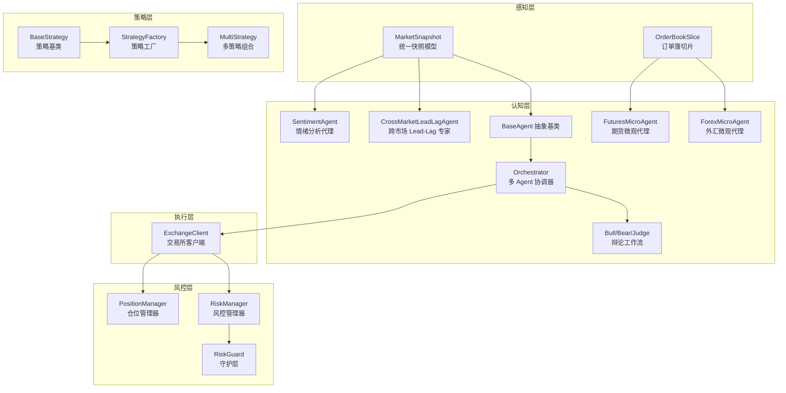
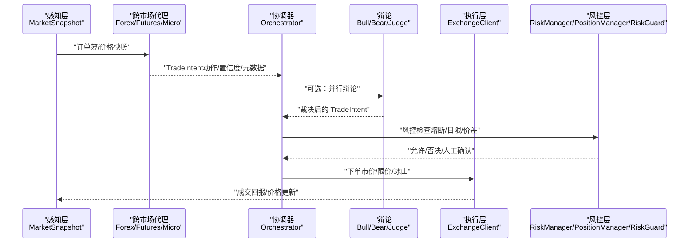
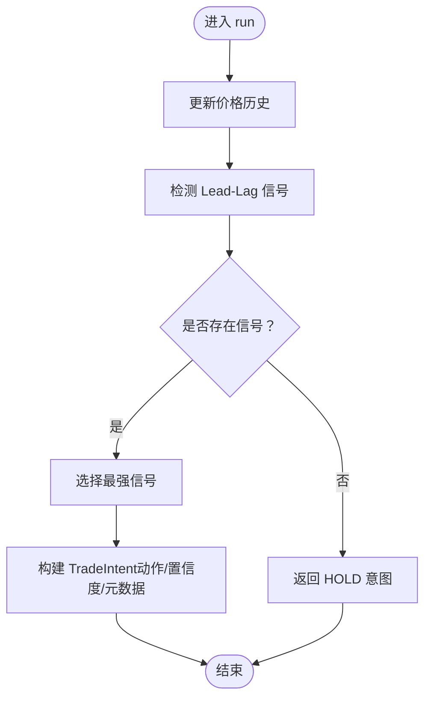
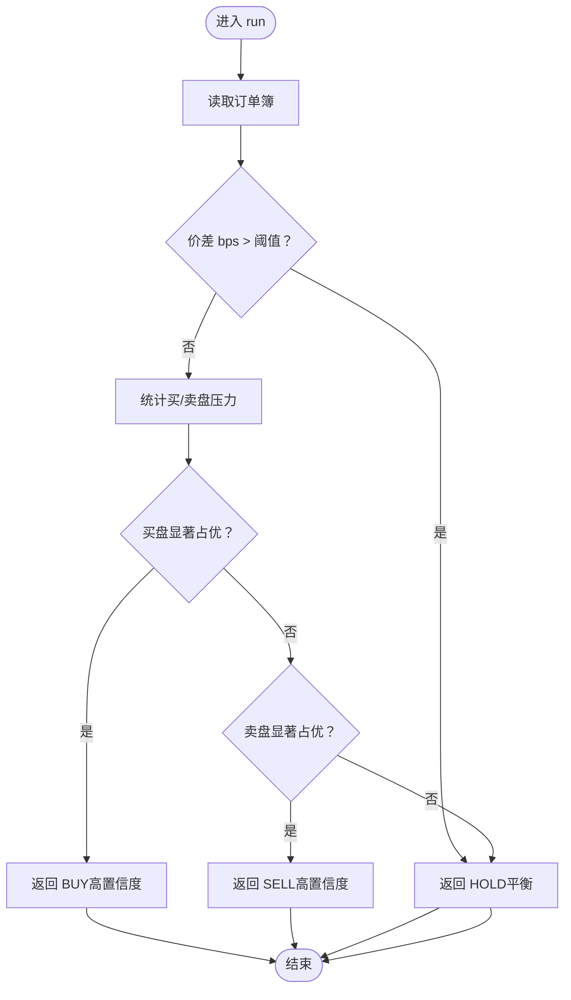
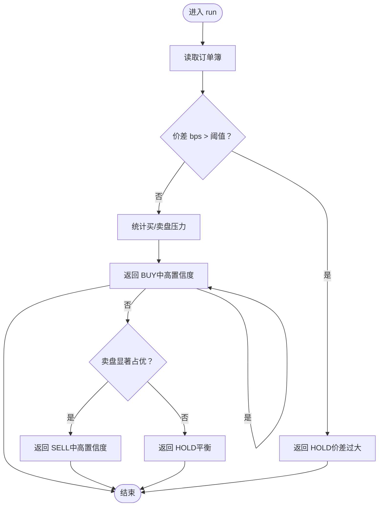
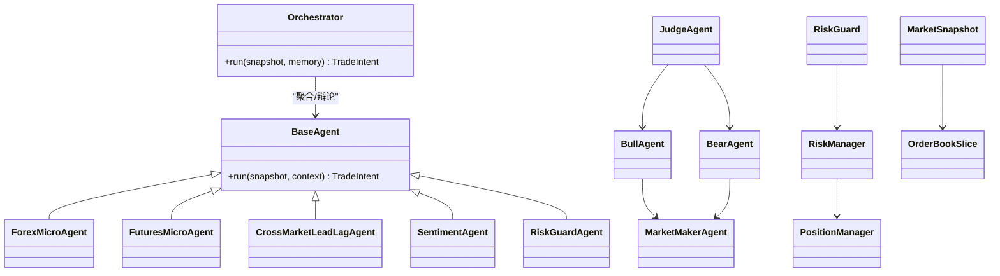

# 跨市场代理集合

<cite>
**本文引用的文件**
- [src/aetherlife/cognition/agent_cross_market.py](file://src/aetherlife/cognition/agent_cross_market.py)
- [src/aetherlife/cognition/agents.py](file://src/aetherlife/cognition/agents.py)
- [src/aetherlife/cognition/schemas.py](file://src/aetherlife/cognition/schemas.py)
- [src/aetherlife/cognition/orchestrator.py](file://src/aetherlife/cognition/orchestrator.py)
- [src/aetherlife/cognition/debate.py](file://src/aetherlife/cognition/debate.py)
- [src/aetherlife/guard/risk_guard.py](file://src/aetherlife/guard/risk_guard.py)
- [src/aetherlife/memory/store.py](file://src/aetherlife/memory/store.py)
- [src/aetherlife/perception/models.py](file://src/aetherlife/perception/models.py)
- [src/utils/risk_manager.py](file://src/utils/risk_manager.py)
- [configs/config.json](file://configs/config.json)
- [src/trading_bot.py](file://src/trading_bot.py)
- [src/strategies/base.py](file://src/strategies/base.py)
- [src/strategies/factory.py](file://src/strategies/factory.py)
- [src/strategies/multi.py](file://src/strategies/multi.py)
</cite>

## 目录
1. [引言](#引言)
2. [项目结构](#项目结构)
3. [核心组件](#核心组件)
4. [架构总览](#架构总览)
5. [详细组件分析](#详细组件分析)
6. [依赖关系分析](#依赖关系分析)
7. [性能考量](#性能考量)
8. [故障排查指南](#故障排查指南)
9. [结论](#结论)
10. [附录](#附录)

## 引言
本技术文档围绕“跨市场代理集合”展开，系统阐述多市场协同策略与微观代理的算法实现。重点覆盖：
- 跨市场 Lead-Lag 套利专家的设计理念与信号生成流程
- ForexMicroAgent 外汇微观代理的订单流与点差敏感策略
- FuturesMicroAgent 期货微观代理的订单流与价差控制策略
- 跨市场代理的配置参数与风险管理方法
- 多市场交易的应用实践与性能优化建议

## 项目结构
该系统采用分层架构：感知层负责统一市场数据模型；认知层包含通用 Agent 与跨市场 Agent；执行层对接交易所客户端；风控层贯穿于交易生命周期；策略层提供信号生成能力。

图表来源
- [src/aetherlife/perception/models.py](file://src/aetherlife/perception/models.py#L54-L64)
- [src/aetherlife/cognition/agents.py](file://src/aetherlife/cognition/agents.py#L13-L22)
- [src/aetherlife/cognition/agent_cross_market.py](file://src/aetherlife/cognition/agent_cross_market.py#L147-L216)
- [src/aetherlife/cognition/agent_cross_market.py](file://src/aetherlife/cognition/agent_cross_market.py#L218-L285)
- [src/aetherlife/cognition/agent_cross_market.py](file://src/aetherlife/cognition/agent_cross_market.py#L16-L145)
- [src/aetherlife/cognition/debate.py](file://src/aetherlife/cognition/debate.py#L15-L99)
- [src/aetherlife/cognition/orchestrator.py](file://src/aetherlife/cognition/orchestrator.py#L16-L93)
- [src/utils/risk_manager.py](file://src/utils/risk_manager.py#L12-L241)
- [src/aetherlife/guard/risk_guard.py](file://src/aetherlife/guard/risk_guard.py#L23-L84)
- [src/strategies/base.py](file://src/strategies/base.py#L6-L31)
- [src/strategies/factory.py](file://src/strategies/factory.py#L10-L36)
- [src/strategies/multi.py](file://src/strategies/multi.py#L6-L38)

章节来源
- [src/aetherlife/perception/models.py](file://src/aetherlife/perception/models.py#L1-L64)
- [src/aetherlife/cognition/agents.py](file://src/aetherlife/cognition/agents.py#L1-L109)
- [src/aetherlife/cognition/agent_cross_market.py](file://src/aetherlife/cognition/agent_cross_market.py#L1-L405)
- [src/aetherlife/cognition/orchestrator.py](file://src/aetherlife/cognition/orchestrator.py#L1-L93)
- [src/aetherlife/cognition/debate.py](file://src/aetherlife/cognition/debate.py#L1-L100)
- [src/aetherlife/guard/risk_guard.py](file://src/aetherlife/guard/risk_guard.py#L1-L84)
- [src/aetherlife/memory/store.py](file://src/aetherlife/memory/store.py#L1-L155)
- [src/utils/risk_manager.py](file://src/utils/risk_manager.py#L1-L388)
- [src/strategies/base.py](file://src/strategies/base.py#L1-L31)
- [src/strategies/factory.py](file://src/strategies/factory.py#L1-L36)
- [src/strategies/multi.py](file://src/strategies/multi.py#L1-L38)
- [configs/config.json](file://configs/config.json#L1-L28)
- [src/trading_bot.py](file://src/trading_bot.py#L1-L346)

## 核心组件
- 统一数据模型：MarketSnapshot、OrderBookSlice 提供跨市场的统一接口，屏蔽底层交易所差异。
- 通用 Agent：BaseAgent 定义抽象接口，MarketMakerAgent、OrderFlowAgent、RiskGuardAgent 等提供基础能力。
- 跨市场 Agent：ForexMicroAgent、FuturesMicroAgent、CrossMarketLeadLagAgent、SentimentAgent 实现特定市场的微观策略与跨市场联动。
- 协调器：Orchestrator 支持并行聚合与辩论裁决，RiskGuardAgent 作为一票否决的风控入口。
- 风控体系：RiskManager、PositionManager、RiskGuard 构成完整的风控闭环。
- 策略工厂：StrategyFactory 与 MultiStrategy 支持策略组合与参数化配置。

章节来源
- [src/aetherlife/perception/models.py](file://src/aetherlife/perception/models.py#L15-L64)
- [src/aetherlife/cognition/agents.py](file://src/aetherlife/cognition/agents.py#L13-L109)
- [src/aetherlife/cognition/agent_cross_market.py](file://src/aetherlife/cognition/agent_cross_market.py#L16-L405)
- [src/aetherlife/cognition/orchestrator.py](file://src/aetherlife/cognition/orchestrator.py#L16-L93)
- [src/aetherlife/cognition/debate.py](file://src/aetherlife/cognition/debate.py#L15-L99)
- [src/aetherlife/guard/risk_guard.py](file://src/aetherlife/guard/risk_guard.py#L23-L84)
- [src/utils/risk_manager.py](file://src/utils/risk_manager.py#L12-L241)
- [src/strategies/factory.py](file://src/strategies/factory.py#L10-L36)
- [src/strategies/multi.py](file://src/strategies/multi.py#L6-L38)

## 架构总览
下图展示从感知到执行的关键交互路径，以及风控与记忆在其中的作用。

图表来源
- [src/aetherlife/cognition/agent_cross_market.py](file://src/aetherlife/cognition/agent_cross_market.py#L147-L216)
- [src/aetherlife/cognition/agent_cross_market.py](file://src/aetherlife/cognition/agent_cross_market.py#L218-L285)
- [src/aetherlife/cognition/orchestrator.py](file://src/aetherlife/cognition/orchestrator.py#L38-L53)
- [src/aetherlife/cognition/debate.py](file://src/aetherlife/cognition/debate.py#L55-L63)
- [src/aetherlife/guard/risk_guard.py](file://src/aetherlife/guard/risk_guard.py#L48-L68)
- [src/trading_bot.py](file://src/trading_bot.py#L115-L205)

## 详细组件分析

### 跨市场 Lead-Lag 套利专家
设计理念
- 捕捉跨市场领先-滞后效应，以高流动性资产（如 BTC）驱动其他市场的日内联动。
- 通过历史价格缓存与短期涨跌幅阈值识别潜在信号，结合订单流与价差进行二次过滤。

算法流程
- 更新价格历史：维护每种标的的历史价格序列，限制长度以控制内存。
- 计算短期涨跌幅：基于固定分钟窗口计算价格变化率。
- 生成信号：当涨跌幅超过阈值时，构造跨市场信号对象，包含目标市场、目标标的、建议动作与置信度。

图表来源
- [src/aetherlife/cognition/agent_cross_market.py](file://src/aetherlife/cognition/agent_cross_market.py#L32-L65)
- [src/aetherlife/cognition/agent_cross_market.py](file://src/aetherlife/cognition/agent_cross_market.py#L67-L144)

章节来源
- [src/aetherlife/cognition/agent_cross_market.py](file://src/aetherlife/cognition/agent_cross_market.py#L16-L145)

### 外汇微观代理（ForexMicroAgent）
运作机制
- 订单簿点差敏感：对外汇市场设定严格价差阈值，避免在高波动或流动性不足时交易。
- 订单流压力检测：比较前 N 档买盘与卖盘总量，形成多/空倾向的判断。
- 动作输出：根据压力比给出买入/卖出/持有，并设置相应仓位比例与置信度。

图表来源
- [src/aetherlife/cognition/agent_cross_market.py](file://src/aetherlife/cognition/agent_cross_market.py#L160-L215)

章节来源
- [src/aetherlife/cognition/agent_cross_market.py](file://src/aetherlife/cognition/agent_cross_market.py#L147-L216)

### 期货微观代理（FuturesMicroAgent）
运作机制
- 价差控制：期货市场价差阈值相对更高，反映不同合约的流动性特征。
- 订单流分析：扩大观察档位以捕捉更广泛的订单分布，提升稳定性。
- 动作输出：依据买/卖盘压力比决定方向与仓位，同时保留置信度与元数据。

图表来源
- [src/aetherlife/cognition/agent_cross_market.py](file://src/aetherlife/cognition/agent_cross_market.py#L231-L285)

章节来源
- [src/aetherlife/cognition/agent_cross_market.py](file://src/aetherlife/cognition/agent_cross_market.py#L218-L285)

### 情绪分析代理（SentimentAgent）
实现要点
- 情绪分数缓存：对同标的情緒评分进行缓存，减少重复计算。
- 上下文解析：从上下文中提取情绪分数（简化实现），实际可接入外部情绪分析服务。
- 决策映射：根据阈值区间输出买入/卖出/持有，并携带置信度与元数据。

章节来源
- [src/aetherlife/cognition/agent_cross_market.py](file://src/aetherlife/cognition/agent_cross_market.py#L288-L405)

### 协调器与辩论工作流
- 并行聚合：默认并行调用多个 Agent，按权重与置信度合成最终意图。
- 辩论裁决：Bull/Bear 分别从多/空视角解读同一快照，Judge 基于置信度与动作进行裁决。
- 风控否决：RiskGuardAgent 对任意非 HOLD 决议进行否决判断，确保安全边界。

章节来源
- [src/aetherlife/cognition/orchestrator.py](file://src/aetherlife/cognition/orchestrator.py#L16-L93)
- [src/aetherlife/cognition/debate.py](file://src/aetherlife/cognition/debate.py#L15-L99)
- [src/aetherlife/cognition/agents.py](file://src/aetherlife/cognition/agents.py#L50-L68)

### 风控体系
- RiskManager：提供仓位规模、止损止盈、追踪止损、熔断与日限检查，支持动态统计与暂停恢复。
- PositionManager：管理开仓、平仓、浮动盈亏更新与止盈止损设置。
- RiskGuard：执行前最后一道关卡，支持熔断、日最大亏损、大额人工确认（HITL）与审计日志。

章节来源
- [src/utils/risk_manager.py](file://src/utils/risk_manager.py#L12-L241)
- [src/utils/risk_manager.py](file://src/utils/risk_manager.py#L244-L339)
- [src/aetherlife/guard/risk_guard.py](file://src/aetherlife/guard/risk_guard.py#L23-L84)

### 记忆与上下文
- MemoryStore：短期事件与决策的记忆，支持 Redis 持久化与 LLM 上下文摘要，提供日累计盈亏查询。

章节来源
- [src/aetherlife/memory/store.py](file://src/aetherlife/memory/store.py#L43-L155)

### 策略层集成
- 策略工厂：按类型创建单一或组合策略，支持多策略加权融合。
- MultiStrategy：对子策略信号进行加权汇总并归一化到 -1/0/1。

章节来源
- [src/strategies/factory.py](file://src/strategies/factory.py#L10-L36)
- [src/strategies/multi.py](file://src/strategies/multi.py#L6-L38)
- [src/strategies/base.py](file://src/strategies/base.py#L6-L31)

## 依赖关系分析

图表来源
- [src/aetherlife/cognition/agents.py](file://src/aetherlife/cognition/agents.py#L13-L109)
- [src/aetherlife/cognition/agent_cross_market.py](file://src/aetherlife/cognition/agent_cross_market.py#L16-L405)
- [src/aetherlife/cognition/orchestrator.py](file://src/aetherlife/cognition/orchestrator.py#L16-L93)
- [src/aetherlife/cognition/debate.py](file://src/aetherlife/cognition/debate.py#L15-L99)
- [src/aetherlife/perception/models.py](file://src/aetherlife/perception/models.py#L54-L64)
- [src/utils/risk_manager.py](file://src/utils/risk_manager.py#L12-L241)
- [src/aetherlife/guard/risk_guard.py](file://src/aetherlife/guard/risk_guard.py#L23-L84)

## 性能考量
- 订单簿窗口与缓存
  - 外汇与期货的订单流统计档位不同，需根据流动性特征调整观察范围，避免噪声干扰。
  - 价差阈值应结合市场波动与滑点成本设定，防止在高波动时段触发无效交易。
- 信号强度与仓位
  - 跨市场 Lead-Lag 信号的强度可线性影响仓位占比，建议与 RiskManager 的最大仓位上限协同使用。
  - 情绪代理的置信度可作为辅助信号，避免与价格驱动策略产生冲突。
- 并行与聚合
  - Orchestrator 的并行调用与权重分配可提升响应速度，但需注意上下文传递与风控检查的时序。
- 熔断与日限
  - 熔断冷却时间与日限策略应结合回测结果动态调整，避免过度保护导致错失趋势。

## 故障排查指南
- 订单簿缺失或为空
  - 现象：返回 HOLD 并提示无订单簿。
  - 排查：确认连接状态、订阅频道与数据推送频率。
- 价差过大
  - 现象：返回 HOLD 并提示价差超出阈值。
  - 排查：检查市场流动性、滑点与手续费；必要时提高阈值或切换标的。
- 风控否决
  - 现象：最终决策被 RiskGuardAgent 否决。
  - 排查：检查日累计盈亏、置信度阈值与风控参数；确认是否触发熔断或 HITL。
- 审计与日志
  - 使用 RiskGuard 的审计功能记录事件，定位异常交易路径与决策原因。

章节来源
- [src/aetherlife/cognition/agent_cross_market.py](file://src/aetherlife/cognition/agent_cross_market.py#L164-L171)
- [src/aetherlife/cognition/agent_cross_market.py](file://src/aetherlife/cognition/agent_cross_market.py#L244-L253)
- [src/aetherlife/guard/risk_guard.py](file://src/aetherlife/guard/risk_guard.py#L48-L68)

## 结论
跨市场代理集合通过统一的数据模型与灵活的 Agent 设计，实现了外汇与期货市场的微观策略落地，并以跨市场 Lead-Lag 专家捕捉多市场联动机会。配合 Orchestrator 的聚合与辩论、RiskGuard 的执行前检查与 RiskManager 的全链路风控，系统在追求收益的同时兼顾安全性与可审计性。建议在实盘部署中持续优化信号强度与风控参数，并结合多策略组合提升鲁棒性。

## 附录

### 配置参数与最佳实践
- 交易配置
  - 交易所、测试网、交易对、时间周期、杠杆、策略类型与参数、风险参数、AI 增强开关。
- 风险参数
  - 最大仓位比例、止损/止盈/追踪止损阈值、单日最大亏损、单日最大交易次数、连续亏损限制、熔断阈值与冷却时间。
- 策略参数
  - 策略工厂支持多策略组合，可通过权重进行信号融合。

章节来源
- [configs/config.json](file://configs/config.json#L1-L28)
- [src/utils/risk_manager.py](file://src/utils/risk_manager.py#L15-L34)
- [src/strategies/factory.py](file://src/strategies/factory.py#L10-L36)
- [src/strategies/multi.py](file://src/strategies/multi.py#L9-L37)

### 实际应用案例
- 外汇日内交易
  - 使用 ForexMicroAgent 在流动性充足且价差可控时捕捉订单流驱动的短周期波动，结合 RiskManager 设置止损与止盈。
- 期货跨期套利
  - 使用 FuturesMicroAgent 观察主力与近月合约的订单流差异，识别潜在轮动机会；通过 PositionManager 控制多空头寸与止损。
- 跨市场联动
  - 使用 CrossMarketLeadLagAgent 监控 BTC 等高流动性资产的短期涨跌幅，作为其他市场（如 A 股科技股）的先行信号，结合 SentimentAgent 的情绪因子进行二次确认。

章节来源
- [src/aetherlife/cognition/agent_cross_market.py](file://src/aetherlife/cognition/agent_cross_market.py#L82-L110)
- [src/aetherlife/cognition/agent_cross_market.py](file://src/aetherlife/cognition/agent_cross_market.py#L147-L216)
- [src/aetherlife/cognition/agent_cross_market.py](file://src/aetherlife/cognition/agent_cross_market.py#L218-L285)
- [src/aetherlife/cognition/agent_cross_market.py](file://src/aetherlife/cognition/agent_cross_market.py#L288-L405)