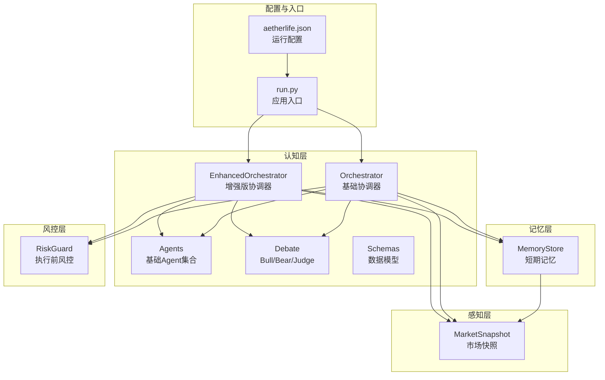
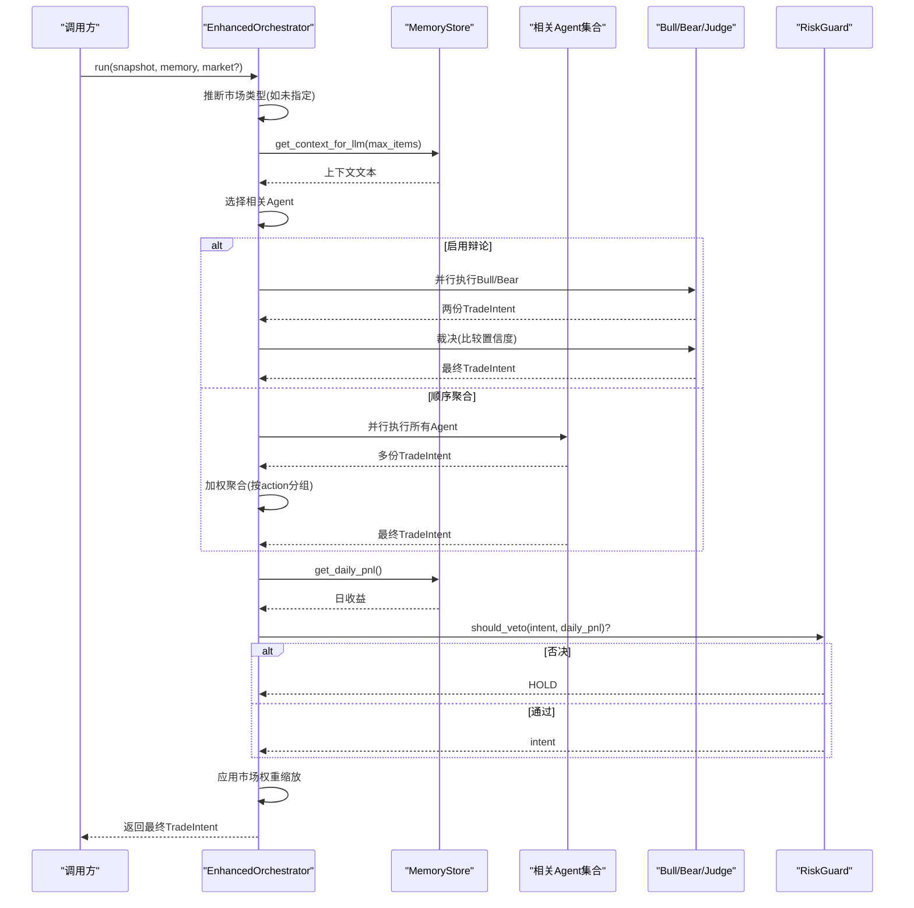
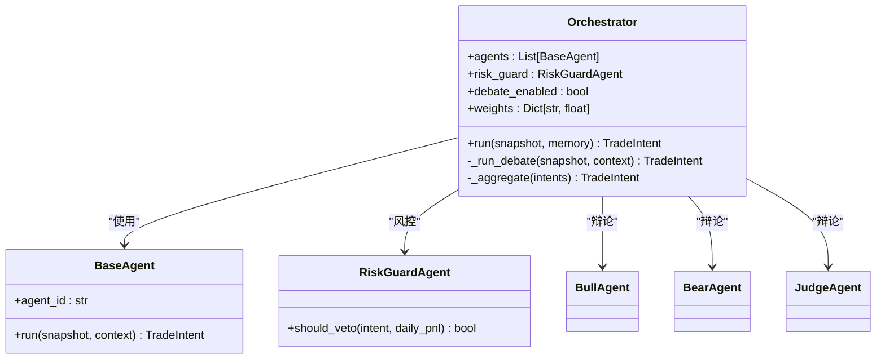
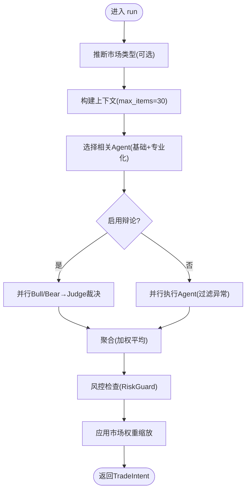
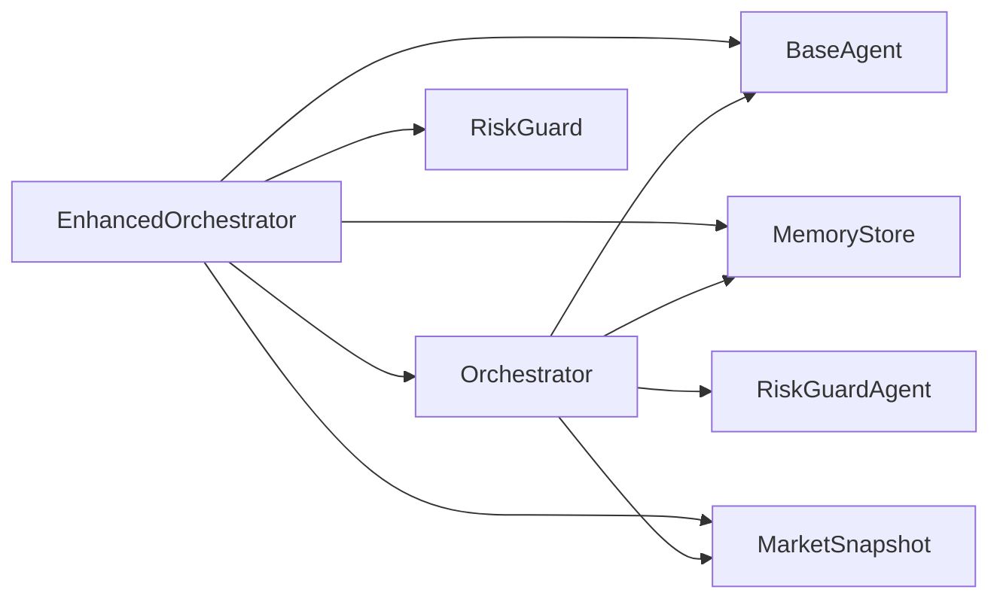

# 协调器核心机制

<cite>
**本文引用的文件列表**
- [orchestrator.py](file://src/aetherlife/cognition/orchestrator.py)
- [orchestrator_enhanced.py](file://src/aetherlife/cognition/orchestrator_enhanced.py)
- [agents.py](file://src/aetherlife/cognition/agents.py)
- [debate.py](file://src/aetherlife/cognition/debate.py)
- [schemas.py](file://src/aetherlife/cognition/schemas.py)
- [store.py](file://src/aetherlife/memory/store.py)
- [models.py](file://src/aetherlife/perception/models.py)
- [risk_guard.py](file://src/aetherlife/guard/risk_guard.py)
- [aetherlife.json](file://configs/aetherlife.json)
- [cognition_multi_agent_demo.py](file://scripts/cognition_multi_agent_demo.py)
- [run.py](file://src/aetherlife/run.py)
</cite>

## 目录
1. [简介](#简介)
2. [项目结构](#项目结构)
3. [核心组件](#核心组件)
4. [架构总览](#架构总览)
5. [详细组件分析](#详细组件分析)
6. [依赖关系分析](#依赖关系分析)
7. [性能考量](#性能考量)
8. [故障排查指南](#故障排查指南)
9. [结论](#结论)
10. [附录](#附录)

## 简介
本文档聚焦于AetherLife协调器的核心机制，系统阐述Orchestrator类的设计架构与实现细节，涵盖两种运行模式：顺序调用+加权聚合模式与LangGraph状态机模式。文档深入解释run方法的执行流程，包括上下文获取、代理调用、结果聚合与风控检查；详解_weights权重系统的原理与配置方法；并对比增强版协调器与基础协调器的差异与升级优势。最后提供可直接参考的代码示例路径，帮助读者快速初始化协调器、配置代理权重并执行完整的决策流程。

## 项目结构
围绕协调器相关的模块组织如下：
- 认知层：orchestrator、orchestrator_enhanced、agents、debate、schemas
- 记忆层：memory/store.py
- 感知层：perception/models.py
- 风控层：guard/risk_guard.py
- 配置与示例：configs/aetherlife.json、scripts/cognition_multi_agent_demo.py、src/aetherlife/run.py

图表来源
- [orchestrator.py](file://src/aetherlife/cognition/orchestrator.py#L16-L93)
- [orchestrator_enhanced.py](file://src/aetherlife/cognition/orchestrator_enhanced.py#L21-L323)
- [agents.py](file://src/aetherlife/cognition/agents.py#L13-L109)
- [debate.py](file://src/aetherlife/cognition/debate.py#L15-L100)
- [schemas.py](file://src/aetherlife/cognition/schemas.py#L32-L219)
- [store.py](file://src/aetherlife/memory/store.py#L43-L155)
- [models.py](file://src/aetherlife/perception/models.py#L54-L64)
- [risk_guard.py](file://src/aetherlife/guard/risk_guard.py#L23-L84)
- [aetherlife.json](file://configs/aetherlife.json#L1-L17)
- [run.py](file://src/aetherlife/run.py#L52-L71)

章节来源
- [orchestrator.py](file://src/aetherlife/cognition/orchestrator.py#L1-L93)
- [orchestrator_enhanced.py](file://src/aetherlife/cognition/orchestrator_enhanced.py#L1-L323)
- [agents.py](file://src/aetherlife/cognition/agents.py#L1-L109)
- [debate.py](file://src/aetherlife/cognition/debate.py#L1-L100)
- [schemas.py](file://src/aetherlife/cognition/schemas.py#L1-L219)
- [store.py](file://src/aetherlife/memory/store.py#L1-L155)
- [models.py](file://src/aetherlife/perception/models.py#L1-L64)
- [risk_guard.py](file://src/aetherlife/guard/risk_guard.py#L1-L84)
- [aetherlife.json](file://configs/aetherlife.json#L1-L17)
- [run.py](file://src/aetherlife/run.py#L1-L71)

## 核心组件
- Orchestrator（基础协调器）：提供顺序调用+加权聚合与辩论（Bull/Bear/Judge）两种模式，支持权重配置与风控否决。
- EnhancedOrchestrator（增强版协调器）：在基础协调器之上扩展多市场专业化Agent、自动市场推断、相关Agent选择、异常容错、动态权重调整与市场权重调节。
- Agents（基础Agent集合）：MarketMakerAgent、OrderFlowAgent、StatArbAgent、NewsSentimentAgent、RiskGuardAgent等。
- Debate（辩论机制）：BullAgent、BearAgent、JudgeAgent，形成“多方/空方并行→裁决”的投票式决策。
- Schemas（数据模型）：TradeIntent、Action、Market、LangGraphState、DecisionContext等，统一结构化输出与状态管理。
- MemoryStore（记忆存储）：短期记忆摘要与日收益汇总，为LLM提供上下文。
- RiskGuard（执行前风控）：电路断路器、日最大亏损限制、大额人工确认（HITL）与审计日志。

章节来源
- [orchestrator.py](file://src/aetherlife/cognition/orchestrator.py#L16-L93)
- [orchestrator_enhanced.py](file://src/aetherlife/cognition/orchestrator_enhanced.py#L21-L323)
- [agents.py](file://src/aetherlife/cognition/agents.py#L13-L109)
- [debate.py](file://src/aetherlife/cognition/debate.py#L15-L100)
- [schemas.py](file://src/aetherlife/cognition/schemas.py#L32-L219)
- [store.py](file://src/aetherlife/memory/store.py#L43-L155)
- [risk_guard.py](file://src/aetherlife/guard/risk_guard.py#L23-L84)

## 架构总览
协调器作为多Agent的编排中枢，负责：
- 获取上下文：从MemoryStore提取短期记忆摘要
- 选择Agent：根据市场类型或辩论开关决定执行路径
- 并行执行：使用asyncio.gather并发调用Agent
- 结果聚合：按action分组加权平均quantity_pct与confidence
- 风控检查：RiskGuardAgent或RiskGuard进行否决判断
- 市场权重：增强版协调器对不同市场的置信度进行缩放

图表来源
- [orchestrator_enhanced.py](file://src/aetherlife/cognition/orchestrator_enhanced.py#L84-L151)
- [debate.py](file://src/aetherlife/cognition/debate.py#L23-L99)
- [store.py](file://src/aetherlife/memory/store.py#L140-L145)
- [risk_guard.py](file://src/aetherlife/guard/risk_guard.py#L48-L68)

## 详细组件分析

### Orchestrator（基础协调器）
- 设计要点
  - 默认包含MarketMaker、OrderFlow、StatArb、NewsSentiment四类Agent
  - 可选启用辩论（Bull/Bear/Judge），否则采用顺序并行+加权聚合
  - 权重系统：按agent_id映射权重，默认为1.0
  - 风控：RiskGuardAgent进行否决判断
- 运行模式
  - 顺序调用+加权聚合：收集所有Agent输出，按action分组加权平均quantity_pct与confidence，择优返回
  - 辩论模式：Bull/Bear并行输出，Judge基于置信度裁决
- 关键方法
  - run：执行一轮决策，整合上下文、Agent输出与风控
  - _run_debate：并行执行Bull/Bear并由Judge裁决
  - _aggregate：按action分组加权聚合，归一化后返回最优action

图表来源
- [orchestrator.py](file://src/aetherlife/cognition/orchestrator.py#L16-L93)
- [agents.py](file://src/aetherlife/cognition/agents.py#L13-L109)
- [debate.py](file://src/aetherlife/cognition/debate.py#L15-L100)

章节来源
- [orchestrator.py](file://src/aetherlife/cognition/orchestrator.py#L16-L93)
- [agents.py](file://src/aetherlife/cognition/agents.py#L13-L109)
- [debate.py](file://src/aetherlife/cognition/debate.py#L15-L100)

### EnhancedOrchestrator（增强版协调器）
- 设计要点
  - 在基础协调器基础上扩展：多市场专业化Agent、自动市场推断、相关Agent选择、异常容错、动态权重调整、市场权重缩放
  - 自动推断市场类型：根据exchange与symbol特征识别CRYPTO/A_STOCK/US_STOCK/FOREX/FUTURES
  - 相关Agent选择：按市场类型映射到基础Agent与专业化Agent集合
  - 并行执行与异常过滤：捕获Agent执行异常，确保至少有一个有效决策
  - 动态权重：update_agent_weights与update_market_weights支持运行时调整
- 运行流程
  - 推断市场类型（若未显式提供）
  - 构建上下文（max_items=30）
  - 选择相关Agent（基础+专业化）
  - 并行执行（debate_enabled控制路径）
  - 聚合与风控（同基础协调器）
  - 应用市场权重缩放
- 关键方法
  - _infer_market：根据exchange与symbol推断Market
  - _select_relevant_agents：按市场类型选择Agent集合
  - _run_debate：并行Bull/Bear并Judge裁决
  - _aggregate：按action分组加权聚合，记录元数据（agent_count、action_scores）

图表来源
- [orchestrator_enhanced.py](file://src/aetherlife/cognition/orchestrator_enhanced.py#L84-L151)
- [orchestrator_enhanced.py](file://src/aetherlife/cognition/orchestrator_enhanced.py#L153-L187)
- [orchestrator_enhanced.py](file://src/aetherlife/cognition/orchestrator_enhanced.py#L189-L221)
- [orchestrator_enhanced.py](file://src/aetherlife/cognition/orchestrator_enhanced.py#L223-L233)
- [orchestrator_enhanced.py](file://src/aetherlife/cognition/orchestrator_enhanced.py#L235-L312)

章节来源
- [orchestrator_enhanced.py](file://src/aetherlife/cognition/orchestrator_enhanced.py#L21-L323)

### 权重系统（_weights）与市场权重
- Agent权重
  - 作用：在聚合阶段对不同Agent的决策进行加权，影响最终quantity_pct与confidence
  - 配置：构造时传入weights或默认按agent_id初始化为1.0
  - 动态调整：EnhancedOrchestrator提供update_agent_weights方法，支持运行时调整
- 市场权重
  - 作用：对不同市场的置信度进行缩放，例如加密货币默认1.0，A股0.8，美股0.9等
  - 配置：构造时初始化，EnhancedOrchestrator提供update_market_weights方法动态调整
- 聚合算法
  - 将每个Agent的intent.quantity_pct与intent.confidence乘以权重，按action分组求和
  - 选择得分最高的action，计算该action的加权平均quantity_pct与confidence
  - 限制最大仓位与最高置信度，确保稳健性

章节来源
- [orchestrator.py](file://src/aetherlife/cognition/orchestrator.py#L65-L92)
- [orchestrator_enhanced.py](file://src/aetherlife/cognition/orchestrator_enhanced.py#L235-L312)
- [orchestrator_enhanced.py](file://src/aetherlife/cognition/orchestrator_enhanced.py#L314-L322)

### 数据模型与上下文
- TradeIntent：统一的交易意图输出，包含action、market、symbol、quantity_pct、reason、confidence、stop_loss_pct、take_profit_pct、order_type、limit_price、agent_id、timestamp、metadata等
- DecisionContext：供Agent使用的决策上下文，包含symbol、market、last_price、bid_price、ask_price、spread_bps、current_position、unrealized_pnl、volume_24h、volatility、trend、sentiment_score、news_count、daily_pnl_pct、max_drawdown、memory_context、northbound_quota_pct、limit_up_price、limit_down_price、timestamp等
- Market：枚举类型，覆盖CRYPTO、A_STOCK、HK_STOCK、US_STOCK、INTL_STOCK、FOREX、FUTURES、COMMODITIES
- MemoryStore.get_context_for_llm：将近期事件与决策摘要转为文本上下文，供LLM消费
- MarketSnapshot：感知层统一数据模型，包含symbol、exchange、orderbook、last_price、ticker_24h、candles_1m、timestamp

章节来源
- [schemas.py](file://src/aetherlife/cognition/schemas.py#L32-L219)
- [store.py](file://src/aetherlife/memory/store.py#L134-L145)
- [models.py](file://src/aetherlife/perception/models.py#L54-L64)

### 风控与审计
- RiskGuardAgent（基础）：should_veto根据intent.action与confidence以及日收益进行否决判断
- RiskGuard（执行前风控）：check提供电路断路器、日最大亏损限制、大额HITL与审计回调
- 审计日志：支持console与文件落盘，可选异步回调

章节来源
- [agents.py](file://src/aetherlife/cognition/agents.py#L50-L68)
- [risk_guard.py](file://src/aetherlife/guard/risk_guard.py#L23-L84)

## 依赖关系分析
- 组件耦合
  - Orchestrator/EnhancedOrchestrator依赖BaseAgent接口，通过run方法输出TradeIntent
  - 记忆层MemoryStore为LLM提供上下文，同时提供日收益查询
  - 感知层MarketSnapshot为Agent提供统一输入
  - 风控层RiskGuardAgent/RiskGuard参与最终决策的否决与审计
- 外部依赖
  - asyncio.gather用于并行执行Agent
  - pydantic模型用于结构化输出与校验
  - 可选redis持久化（MemoryStore）

图表来源
- [orchestrator.py](file://src/aetherlife/cognition/orchestrator.py#L9-L13)
- [orchestrator_enhanced.py](file://src/aetherlife/cognition/orchestrator_enhanced.py#L10-L16)
- [agents.py](file://src/aetherlife/cognition/agents.py#L9-L10)
- [store.py](file://src/aetherlife/memory/store.py#L43-L63)
- [models.py](file://src/aetherlife/perception/models.py#L54-L64)
- [risk_guard.py](file://src/aetherlife/guard/risk_guard.py#L23-L41)

章节来源
- [orchestrator.py](file://src/aetherlife/cognition/orchestrator.py#L1-L93)
- [orchestrator_enhanced.py](file://src/aetherlife/cognition/orchestrator_enhanced.py#L1-L323)
- [agents.py](file://src/aetherlife/cognition/agents.py#L1-L109)
- [store.py](file://src/aetherlife/memory/store.py#L1-L155)
- [models.py](file://src/aetherlife/perception/models.py#L1-L64)
- [risk_guard.py](file://src/aetherlife/guard/risk_guard.py#L1-L84)

## 性能考量
- 并行执行：使用asyncio.gather并发调用Agent，显著降低整体延迟
- 异常容错：EnhancedOrchestrator在并行执行时过滤异常，保证至少一个有效决策
- 权重与限额：聚合阶段对quantity_pct与confidence进行上限控制，避免过度集中
- 记忆上下文：MemoryStore.get_context_for_llm限制max_items，避免LLM上下文过长
- 市场权重：按市场类型动态缩放置信度，提升跨市场适应性

[本节为通用性能讨论，不直接分析具体文件]

## 故障排查指南
- Agent执行异常
  - 现象：EnhancedOrchestrator并行执行时出现异常
  - 处理：框架会过滤非TradeIntent结果，若全部失败则返回HOLD
  - 参考路径：[orchestrator_enhanced.py](file://src/aetherlife/cognition/orchestrator_enhanced.py#L117-L134)
- 风控否决
  - 现象：最终返回HOLD且reason为“风控否决”
  - 处理：检查日收益与置信度阈值，必要时调整权重或风控参数
  - 参考路径：[orchestrator_enhanced.py](file://src/aetherlife/cognition/orchestrator_enhanced.py#L136-L146)、[agents.py](file://src/aetherlife/cognition/agents.py#L60-L68)
- 权重配置不当
  - 现象：聚合结果偏向某Agent或市场
  - 处理：使用update_agent_weights与update_market_weights动态调整
  - 参考路径：[orchestrator_enhanced.py](file://src/aetherlife/cognition/orchestrator_enhanced.py#L314-L322)
- 上下文为空
  - 现象：LLM上下文为“(无近期事件)”
  - 处理：检查MemoryStore初始化与事件注入
  - 参考路径：[store.py](file://src/aetherlife/memory/store.py#L134-L138)

章节来源
- [orchestrator_enhanced.py](file://src/aetherlife/cognition/orchestrator_enhanced.py#L117-L134)
- [agents.py](file://src/aetherlife/cognition/agents.py#L60-L68)
- [store.py](file://src/aetherlife/memory/store.py#L134-L138)

## 结论
EnhancedOrchestrator在基础协调器之上实现了多市场专业化、自动市场推断、异常容错与动态权重调整，显著提升了跨市场适配能力与鲁棒性。通过加权聚合与风控否决机制，协调器能够在复杂市场环境下做出稳健的交易决策。配合可配置的辩论模式与丰富的数据模型，为后续LangGraph状态机集成奠定了坚实基础。

[本节为总结性内容，不直接分析具体文件]

## 附录

### 初始化协调器与执行决策示例（代码路径）
- 基础协调器（顺序+加权聚合）
  - 初始化与执行：[orchestrator.py](file://src/aetherlife/cognition/orchestrator.py#L19-L53)
  - 辩论模式：[orchestrator.py](file://src/aetherlife/cognition/orchestrator.py#L45-L63)
- 增强版协调器（多市场+专业化Agent）
  - 初始化与执行：[orchestrator_enhanced.py](file://src/aetherlife/cognition/orchestrator_enhanced.py#L32-L151)
  - 自动市场推断：[orchestrator_enhanced.py](file://src/aetherlife/cognition/orchestrator_enhanced.py#L153-L187)
  - 相关Agent选择：[orchestrator_enhanced.py](file://src/aetherlife/cognition/orchestrator_enhanced.py#L189-L221)
  - 动态权重调整：[orchestrator_enhanced.py](file://src/aetherlife/cognition/orchestrator_enhanced.py#L314-L322)
- 记忆存储与上下文
  - 上下文构建：[store.py](file://src/aetherlife/memory/store.py#L134-L138)
  - 日收益查询：[store.py](file://src/aetherlife/memory/store.py#L140-L145)
- 配置与入口
  - 运行配置：[aetherlife.json](file://configs/aetherlife.json#L1-L17)
  - 应用入口：[run.py](file://src/aetherlife/run.py#L52-L71)
- 演示脚本
  - 多Agent演示：[cognition_multi_agent_demo.py](file://scripts/cognition_multi_agent_demo.py#L120-L235)

章节来源
- [orchestrator.py](file://src/aetherlife/cognition/orchestrator.py#L19-L53)
- [orchestrator_enhanced.py](file://src/aetherlife/cognition/orchestrator_enhanced.py#L32-L151)
- [store.py](file://src/aetherlife/memory/store.py#L134-L145)
- [aetherlife.json](file://configs/aetherlife.json#L1-L17)
- [run.py](file://src/aetherlife/run.py#L52-L71)
- [cognition_multi_agent_demo.py](file://scripts/cognition_multi_agent_demo.py#L120-L235)