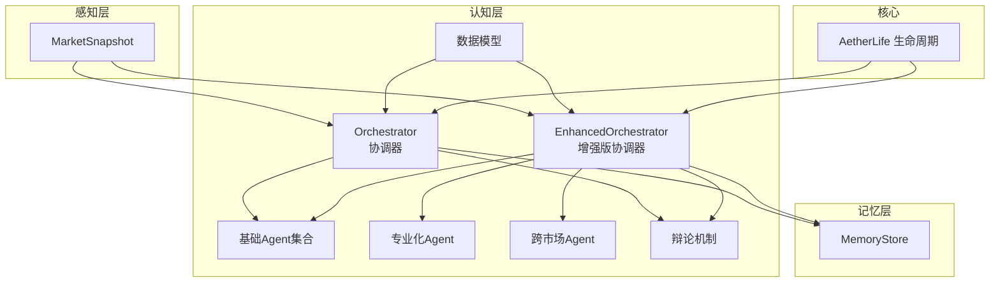
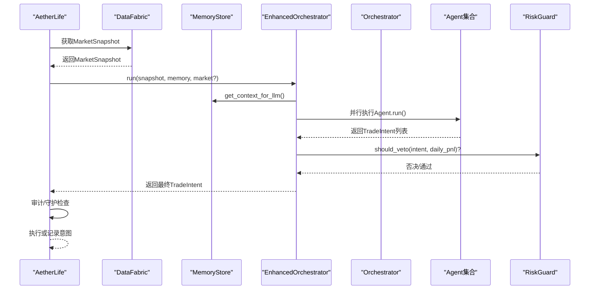
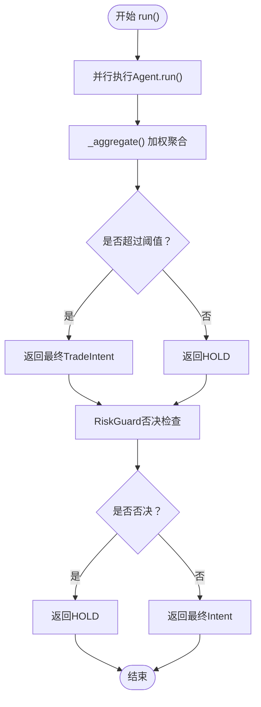
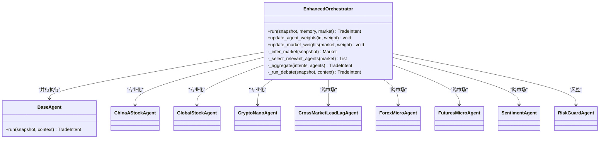
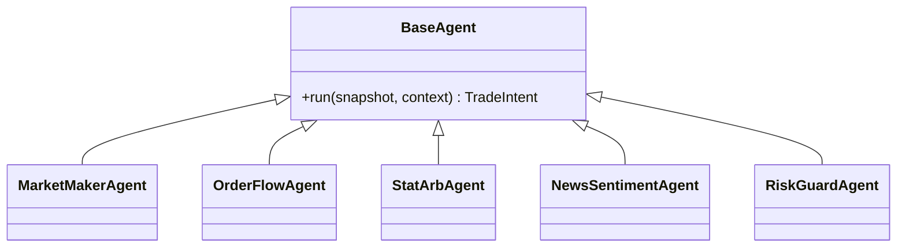
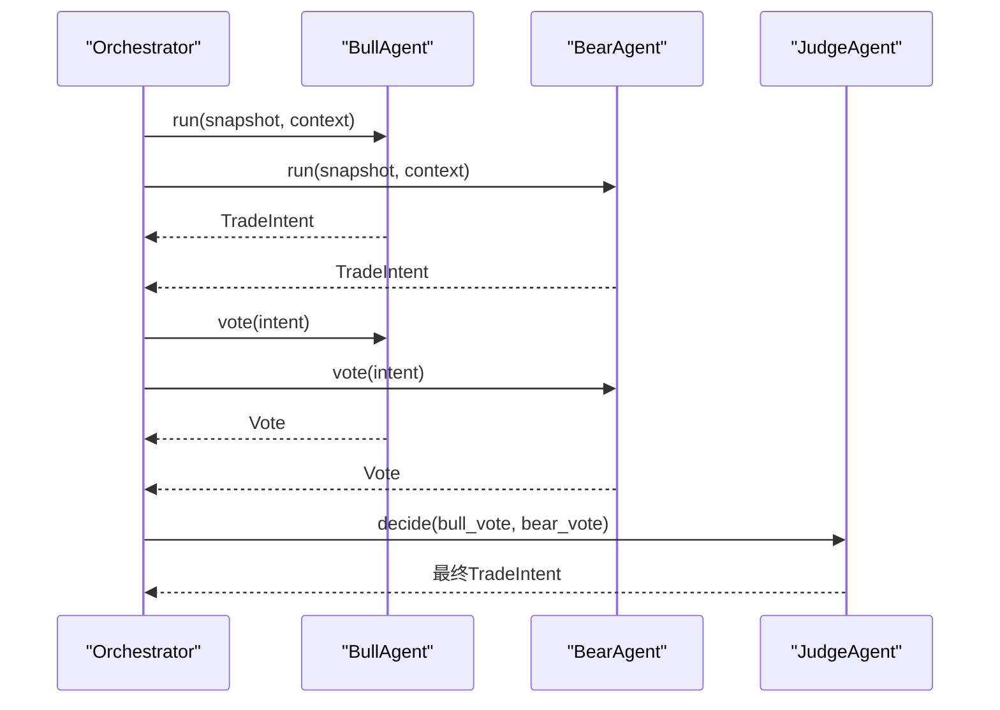
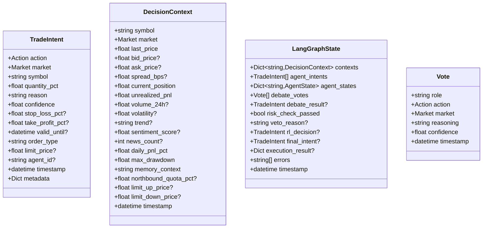
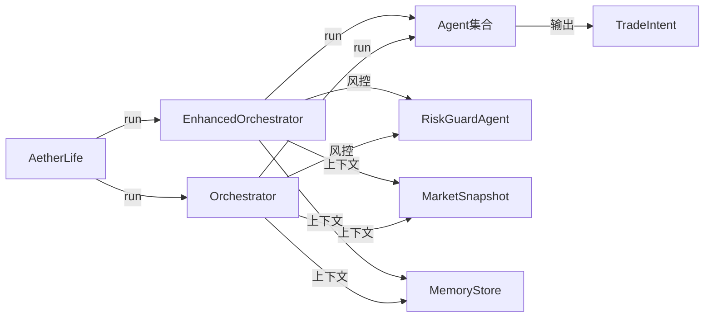

# 认知层多代理系统

<cite>
**本文引用的文件**
- [orchestrator.py](file://src/aetherlife/cognition/orchestrator.py)
- [orchestrator_enhanced.py](file://src/aetherlife/cognition/orchestrator_enhanced.py)
- [agents.py](file://src/aetherlife/cognition/agents.py)
- [agent_specialized.py](file://src/aetherlife/cognition/agent_specialized.py)
- [agent_cross_market.py](file://src/aetherlife/cognition/agent_cross_market.py)
- [debate.py](file://src/aetherlife/cognition/debate.py)
- [schemas.py](file://src/aetherlife/cognition/schemas.py)
- [models.py](file://src/aetherlife/perception/models.py)
- [store.py](file://src/aetherlife/memory/store.py)
- [life.py](file://src/aetherlife/core/life.py)
- [config.py](file://src/aetherlife/config.py)
- [aetherlife.json](file://configs/aetherlife.json)
- [cognition_multi_agent_demo.py](file://scripts/cognition_multi_agent_demo.py)
- [COGNITION_UPGRADE_GUIDE.md](file://docs/COGNITION_UPGRADE_GUIDE.md)
</cite>

## 目录
1. [简介](#简介)
2. [项目结构](#项目结构)
3. [核心组件](#核心组件)
4. [架构总览](#架构总览)
5. [详细组件分析](#详细组件分析)
6. [依赖关系分析](#依赖关系分析)
7. [性能考量](#性能考量)
8. [故障排查指南](#故障排查指南)
9. [结论](#结论)
10. [附录](#附录)

## 简介
本文件面向AetherLife认知层多代理系统，聚焦于Orchestrator协调器的设计理念与两种运行模式：顺序调用+加权投票与LangGraph状态机；深入解析多代理协作机制，覆盖MarketMakerAgent、OrderFlowAgent、StatArbAgent、NewsSentimentAgent等基础代理，以及跨市场代理与专业代理的区别与适用场景；详解“辩论机制”（Bull/Bear/Judge）的实现原理与决策过程；提供代理参数配置、权重设置与性能调优示例；说明TradeIntent数据模型与决策流程的实现细节。

## 项目结构
认知层位于src/aetherlife/cognition目录，围绕以下核心模块组织：
- orchestrator.py：基础Orchestrator协调器（顺序+加权聚合）
- orchestrator_enhanced.py：增强版Orchestrator（多市场、专业化Agent、动态权重、LangGraph预留）
- agents.py：基础Worker Agent集合（MarketMaker、OrderFlow、StatArb、NewsSentiment、RiskGuard）
- agent_specialized.py：专业化Agent（A股、全球股票、加密货币nano）
- agent_cross_market.py：跨市场Agent（Lead-Lag、Forex Micro、Futures Micro、Sentiment）
- debate.py：辩论机制（Bull/Bear/Judge）
- schemas.py：数据模型（TradeIntent、DecisionContext、LangGraphState等）
- models.py：感知层统一数据模型（MarketSnapshot、OrderBookSlice等）
- store.py：记忆存储（短期+情景记忆）
- life.py：核心生命周期（感知→认知→决策→守护→执行）
- config.py：全局配置（含认知层配置）
- aetherlife.json：运行时配置样例
- scripts/cognition_multi_agent_demo.py：多Agent演示脚本
- docs/COGNITION_UPGRADE_GUIDE.md：认知层升级文档

**图表来源**
- [orchestrator.py](file://src/aetherlife/cognition/orchestrator.py#L16-L93)
- [orchestrator_enhanced.py](file://src/aetherlife/cognition/orchestrator_enhanced.py#L21-L323)
- [agents.py](file://src/aetherlife/cognition/agents.py#L13-L109)
- [agent_specialized.py](file://src/aetherlife/cognition/agent_specialized.py#L17-L352)
- [agent_cross_market.py](file://src/aetherlife/cognition/agent_cross_market.py#L16-L405)
- [debate.py](file://src/aetherlife/cognition/debate.py#L15-L100)
- [schemas.py](file://src/aetherlife/cognition/schemas.py#L32-L219)
- [models.py](file://src/aetherlife/perception/models.py#L55-L64)
- [store.py](file://src/aetherlife/memory/store.py#L43-L155)
- [life.py](file://src/aetherlife/core/life.py#L20-L169)

**章节来源**
- [orchestrator.py](file://src/aetherlife/cognition/orchestrator.py#L1-L93)
- [orchestrator_enhanced.py](file://src/aetherlife/cognition/orchestrator_enhanced.py#L1-L323)
- [agents.py](file://src/aetherlife/cognition/agents.py#L1-L109)
- [agent_specialized.py](file://src/aetherlife/cognition/agent_specialized.py#L1-L352)
- [agent_cross_market.py](file://src/aetherlife/cognition/agent_cross_market.py#L1-L405)
- [debate.py](file://src/aetherlife/cognition/debate.py#L1-L100)
- [schemas.py](file://src/aetherlife/cognition/schemas.py#L1-L219)
- [models.py](file://src/aetherlife/perception/models.py#L1-L64)
- [store.py](file://src/aetherlife/memory/store.py#L1-L155)
- [life.py](file://src/aetherlife/core/life.py#L1-L169)
- [config.py](file://src/aetherlife/config.py#L36-L48)
- [aetherlife.json](file://configs/aetherlife.json#L1-L17)
- [cognition_multi_agent_demo.py](file://scripts/cognition_multi_agent_demo.py#L1-L265)
- [COGNITION_UPGRADE_GUIDE.md](file://docs/COGNITION_UPGRADE_GUIDE.md#L1-L406)

## 核心组件
- Orchestrator（基础协调器）：支持顺序调用+加权聚合与可选辩论（Bull/Bear/Judge），并集成风控否决。
- EnhancedOrchestrator（增强版协调器）：支持多市场自动推断、专业化Agent选择、并行执行、动态权重调整、LangGraph状态机预留接口。
- Worker Agents：MarketMaker、OrderFlow、StatArb、NewsSentiment、RiskGuard，输出结构化TradeIntent。
- 专业化Agent：ChinaAStock、GlobalStock、CryptoNano，针对特定市场的特殊规则与风控。
- 跨市场Agent：CrossMarketLeadLag、ForexMicro、FuturesMicro、Sentiment，捕捉跨市场联动与情绪。
- 数据模型：TradeIntent、DecisionContext、LangGraphState、Vote等，确保可审计与可扩展。
- 记忆存储：短期+情景记忆，支持Redis持久化，提供LLM上下文与风控所需的历史数据。
- 生命周期：AetherLife主循环，串联感知、认知、决策、守护与执行。

**章节来源**
- [orchestrator.py](file://src/aetherlife/cognition/orchestrator.py#L16-L93)
- [orchestrator_enhanced.py](file://src/aetherlife/cognition/orchestrator_enhanced.py#L21-L323)
- [agents.py](file://src/aetherlife/cognition/agents.py#L13-L109)
- [agent_specialized.py](file://src/aetherlife/cognition/agent_specialized.py#L17-L352)
- [agent_cross_market.py](file://src/aetherlife/cognition/agent_cross_market.py#L16-L405)
- [schemas.py](file://src/aetherlife/cognition/schemas.py#L32-L219)
- [store.py](file://src/aetherlife/memory/store.py#L43-L155)
- [life.py](file://src/aetherlife/core/life.py#L20-L169)

## 架构总览
下图展示了认知层与核心生命周期的交互关系，以及两种Orchestrator模式的差异与协同。

**图表来源**
- [life.py](file://src/aetherlife/core/life.py#L59-L87)
- [orchestrator_enhanced.py](file://src/aetherlife/cognition/orchestrator_enhanced.py#L84-L151)
- [orchestrator.py](file://src/aetherlife/cognition/orchestrator.py#L38-L53)
- [store.py](file://src/aetherlife/memory/store.py#L134-L145)

## 详细组件分析

### Orchestrator协调器（顺序+加权聚合）
- 设计理念：在无需复杂状态机的前提下，通过并行执行多个Agent，基于加权聚合得到最终TradeIntent，并在最后进行风控否决。
- 关键流程：
  - 并行执行Agent.run()，收集TradeIntent列表。
  - 加权聚合：按action分组，计算得分=quantity_pct×confidence×权重，取最高得分action作为最终动作；归一化后限制最大仓位与置信度。
  - 风控否决：RiskGuardAgent.should_veto根据当日盈亏与置信度判断是否否决。
- 适用场景：快速落地、低延迟、规则明确的策略组合。

**图表来源**
- [orchestrator.py](file://src/aetherlife/cognition/orchestrator.py#L38-L93)

**章节来源**
- [orchestrator.py](file://src/aetherlife/cognition/orchestrator.py#L16-L93)

### EnhancedOrchestrator（多市场+专业化+动态权重）
- 设计理念：为LangGraph状态机预留接口，支持多市场自动推断、专业化Agent选择、并行执行、异常容错、动态权重调整与市场权重应用。
- 核心能力：
  - 多市场推断：根据交易所与symbol自动识别市场类型（CRYPTO/A_STOCK/US_STOCK/FOREX/FUTURES）。
  - Agent选择：按市场类型动态选择相关Agent集合（基础Agent+专业化Agent）。
  - 并行执行：使用gather并行调用，过滤异常，保障鲁棒性。
  - 加权聚合：按action分组加权平均quantity_pct与confidence，限制最大仓位与置信度。
  - 动态权重：支持实时调整Agent权重与市场权重，便于策略自适应。
  - 风控应用：在最终决策上乘以市场权重，再进行风控否决。
- 适用场景：多市场、多资产类别、需要自适应与可扩展的状态机演进。

**图表来源**
- [orchestrator_enhanced.py](file://src/aetherlife/cognition/orchestrator_enhanced.py#L21-L323)
- [agent_specialized.py](file://src/aetherlife/cognition/agent_specialized.py#L17-L352)
- [agent_cross_market.py](file://src/aetherlife/cognition/agent_cross_market.py#L16-L405)
- [agents.py](file://src/aetherlife/cognition/agents.py#L13-L109)

**章节来源**
- [orchestrator_enhanced.py](file://src/aetherlife/cognition/orchestrator_enhanced.py#L21-L323)

### Worker Agents（基础代理）
- MarketMakerAgent：基于订单簿深度与价差判断，优先关注流动性与买卖压力。
- OrderFlowAgent：基于订单流（bid/ask volume）判断短期趋势。
- StatArbAgent：当前为占位，未来可接入协整等统计套利。
- NewsSentimentAgent：当前占位，未来接入新闻与社交媒体情绪。
- RiskGuardAgent：仅做否决判断，不发起交易。

**图表来源**
- [agents.py](file://src/aetherlife/cognition/agents.py#L13-L109)

**章节来源**
- [agents.py](file://src/aetherlife/cognition/agents.py#L13-L109)

### 专业化Agent（跨市场与专业领域）
- ChinaAStockAgent：A股特有逻辑（交易时段、涨跌停、北向额度、印花税、T+1），强调合规与成本控制。
- GlobalStockAgent：美股/港股/国际股票，考虑流动性与盘前盘后交易。
- CryptoNanoAgent：加密货币nano永续，高频、高灵敏度、高杠杆适用场景。

**章节来源**
- [agent_specialized.py](file://src/aetherlife/cognition/agent_specialized.py#L17-L352)

### 跨市场Agent（联动与情绪）
- CrossMarketLeadLagAgent：捕捉跨市场领先-滞后效应，生成跨市场信号与建议动作。
- ForexMicroAgent：外汇微合约，对点差极其敏感，日内波动捕捉。
- FuturesMicroAgent：期货微合约，关注价差与订单流。
- SentimentAgent：多源情绪分析，基于情绪分数驱动交易意图。

**章节来源**
- [agent_cross_market.py](file://src/aetherlife/cognition/agent_cross_market.py#L16-L405)

### 辩论机制（Bull/Bear/Judge）
- BullAgent：从做多角度解读MarketMaker与OrderFlow，偏向做多。
- BearAgent：从做空角度解读，偏向做空。
- JudgeAgent：根据双方confidence与action进行裁决，若分歧过大则观望。
- 运行流程：并行执行Bull/Bear，各自投票，Judge依据投票结果决定最终TradeIntent。

**图表来源**
- [debate.py](file://src/aetherlife/cognition/debate.py#L15-L100)

**章节来源**
- [debate.py](file://src/aetherlife/cognition/debate.py#L15-L100)

### TradeIntent数据模型与决策流程
- TradeIntent：标准化交易意图，包含动作、市场、symbol、仓位、理由、置信度、风控参数、执行参数、元数据与时间戳。
- DecisionContext：为Agent提供的决策上下文，包含市场快照、持仓、情绪、风控状态、A股特有字段等。
- LangGraphState：为LangGraph状态机预留的全局状态，包含contexts、agent_intents、debate_votes、risk_check、rl_decision、final_intent、execution_result、errors等。
- Vote：辩论投票结构，包含角色、action、reasoning、confidence与timestamp。

**图表来源**
- [schemas.py](file://src/aetherlife/cognition/schemas.py#L32-L219)

**章节来源**
- [schemas.py](file://src/aetherlife/cognition/schemas.py#L32-L219)

### 多代理协作机制与跨市场/专业代理区别
- 基础代理：MarketMaker、OrderFlow、StatArb、NewsSentiment、RiskGuard，适用于通用市场与规则策略。
- 专业化代理：针对特定市场（A股、美股、加密货币nano）的特殊规则与成本，强调合规与市场特性。
- 跨市场代理：捕捉跨市场联动（Lead-Lag）、外汇与期货微合约的特殊流动性特征，以及多源情绪驱动。
- 选择策略：EnhancedOrchestrator按市场类型动态选择Agent集合，既保证通用性又兼顾专业性。

**章节来源**
- [orchestrator_enhanced.py](file://src/aetherlife/cognition/orchestrator_enhanced.py#L189-L221)
- [agent_specialized.py](file://src/aetherlife/cognition/agent_specialized.py#L17-L352)
- [agent_cross_market.py](file://src/aetherlife/cognition/agent_cross_market.py#L16-L405)

### 参数配置、权重设置与性能调优
- 配置入口：
  - 运行时配置：aetherlife.json（如启用辩论、风控审计路径等）。
  - 全局配置：CognitionConfig（worker_agents、debate_enabled、parallel_analysts等）。
- 权重设置：
  - Agent权重：update_agent_weights(agent_id, weight)，范围0-2.0。
  - 市场权重：update_market_weights(market, weight)，范围0-1.0。
- 性能调优建议：
  - 并行深度：根据CPU与网络带宽调整并行Agent数量。
  - 聚合阈值：适当提高最低得分阈值以减少噪声。
  - 市场权重：在震荡/高波动市场降低市场权重，抑制过度自信。
  - 异常处理：确保并行执行中的异常被过滤，避免影响整体决策。

**章节来源**
- [aetherlife.json](file://configs/aetherlife.json#L1-L17)
- [config.py](file://src/aetherlife/config.py#L36-L48)
- [orchestrator_enhanced.py](file://src/aetherlife/cognition/orchestrator_enhanced.py#L314-L322)
- [cognition_multi_agent_demo.py](file://scripts/cognition_multi_agent_demo.py#L197-L235)

## 依赖关系分析
- Orchestrator依赖：
  - Agent集合：MarketMaker、OrderFlow、StatArb、NewsSentiment、RiskGuard。
  - 记忆存储：MemoryStore提供上下文与风控所需的历史数据。
  - 感知层：MarketSnapshot统一多交易所数据。
- EnhancedOrchestrator扩展依赖：
  - 专业化Agent与跨市场Agent集合。
  - 动态权重与市场权重映射。
  - LangGraph状态机预留接口。
- 核心生命周期依赖：
  - AetherLife主循环调用Orchestrator，随后进行审计与守护检查，必要时执行交易。

**图表来源**
- [life.py](file://src/aetherlife/core/life.py#L59-L87)
- [orchestrator_enhanced.py](file://src/aetherlife/cognition/orchestrator_enhanced.py#L84-L151)
- [orchestrator.py](file://src/aetherlife/cognition/orchestrator.py#L38-L53)
- [store.py](file://src/aetherlife/memory/store.py#L134-L145)
- [models.py](file://src/aetherlife/perception/models.py#L55-L64)

**章节来源**
- [life.py](file://src/aetherlife/core/life.py#L20-L169)
- [orchestrator_enhanced.py](file://src/aetherlife/cognition/orchestrator_enhanced.py#L21-L323)
- [orchestrator.py](file://src/aetherlife/cognition/orchestrator.py#L16-L93)
- [store.py](file://src/aetherlife/memory/store.py#L43-L155)
- [models.py](file://src/aetherlife/perception/models.py#L55-L64)

## 性能考量
- 并行执行：使用asyncio.gather并行调用Agent，显著降低决策延迟；注意异常过滤与超时控制。
- 聚合算法：加权平均与阈值控制，避免噪声导致的频繁交易；限制最大仓位与置信度，提升稳健性。
- 记忆与上下文：MemoryStore提供LLM上下文摘要与风控所需的历史数据，建议合理设置max_items与max_events。
- 动态权重：根据市场状态与历史表现动态调整权重，提升策略自适应能力。
- LangGraph预留：为后续状态机演进做好接口准备，避免重复重构。

## 故障排查指南
- Agent执行失败：检查MarketSnapshot.orderbook是否为空；EnhancedOrchestrator已过滤异常，但需关注返回Intent数量。
- 聚合决策为HOLD：可能是Agent得分过低或权重设置不当；适当降低阈值或提高关键Agent权重。
- 跨市场信号缺失：价格历史数据不足，需运行系统至少数分钟以累积数据。
- 风控否决：检查当日盈亏与置信度阈值；可通过降低市场权重缓解。
- 配置问题：确认aetherlife.json与CognitionConfig中的debate_enabled、worker_agents等设置。

**章节来源**
- [COGNITION_UPGRADE_GUIDE.md](file://docs/COGNITION_UPGRADE_GUIDE.md#L379-L398)
- [orchestrator_enhanced.py](file://src/aetherlife/cognition/orchestrator_enhanced.py#L113-L134)
- [store.py](file://src/aetherlife/memory/store.py#L134-L145)

## 结论
AetherLife认知层通过Orchestrator协调器实现了从规则与启发式到专业化与跨市场策略的渐进演进。基础Orchestrator适合快速落地与低延迟场景，增强版Orchestrator则为多市场、专业化Agent与LangGraph状态机预留了充分空间。配合完善的TradeIntent数据模型、记忆存储与风控机制，系统在可解释性、可审计性与可扩展性方面具备良好基础。建议在实际部署中结合市场状态动态调整权重，并逐步引入LLM与LangGraph以实现更高级别的智能协作。

## 附录
- 快速开始：运行演示脚本查看单Agent与多Agent协作效果，了解动态权重调整对决策的影响。
- 集成参考：在AetherLife主循环中使用EnhancedOrchestrator，读取配置并执行决策与守护流程。

**章节来源**
- [cognition_multi_agent_demo.py](file://scripts/cognition_multi_agent_demo.py#L1-L265)
- [COGNITION_UPGRADE_GUIDE.md](file://docs/COGNITION_UPGRADE_GUIDE.md#L284-L317)