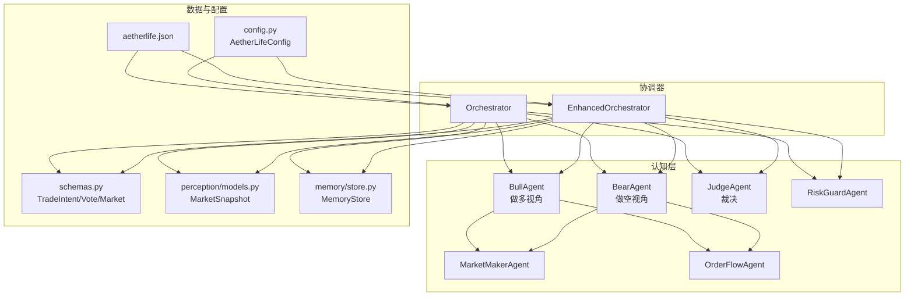
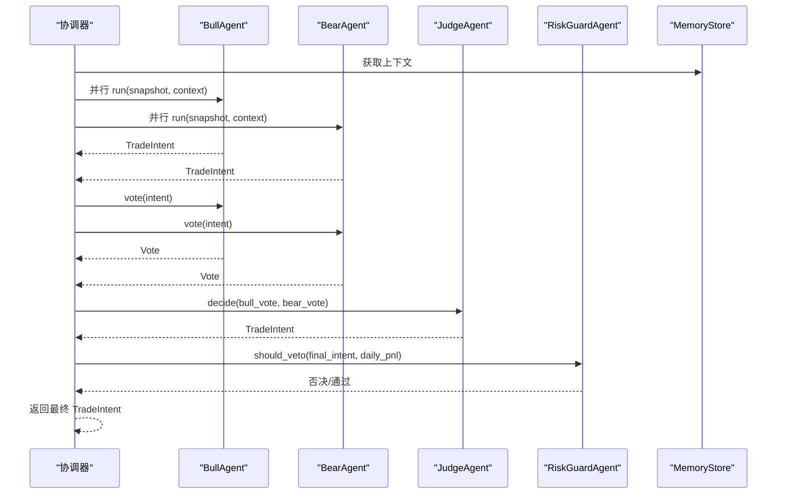
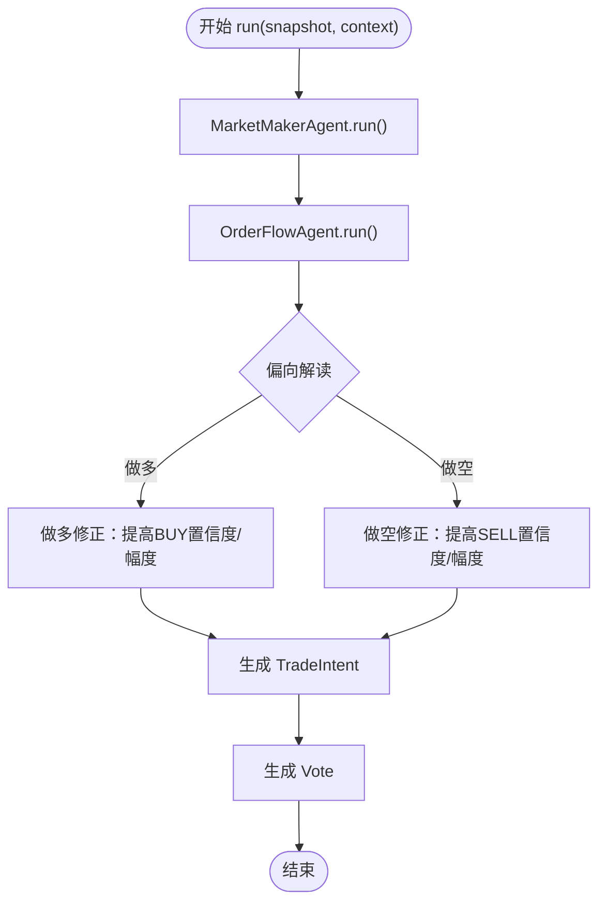
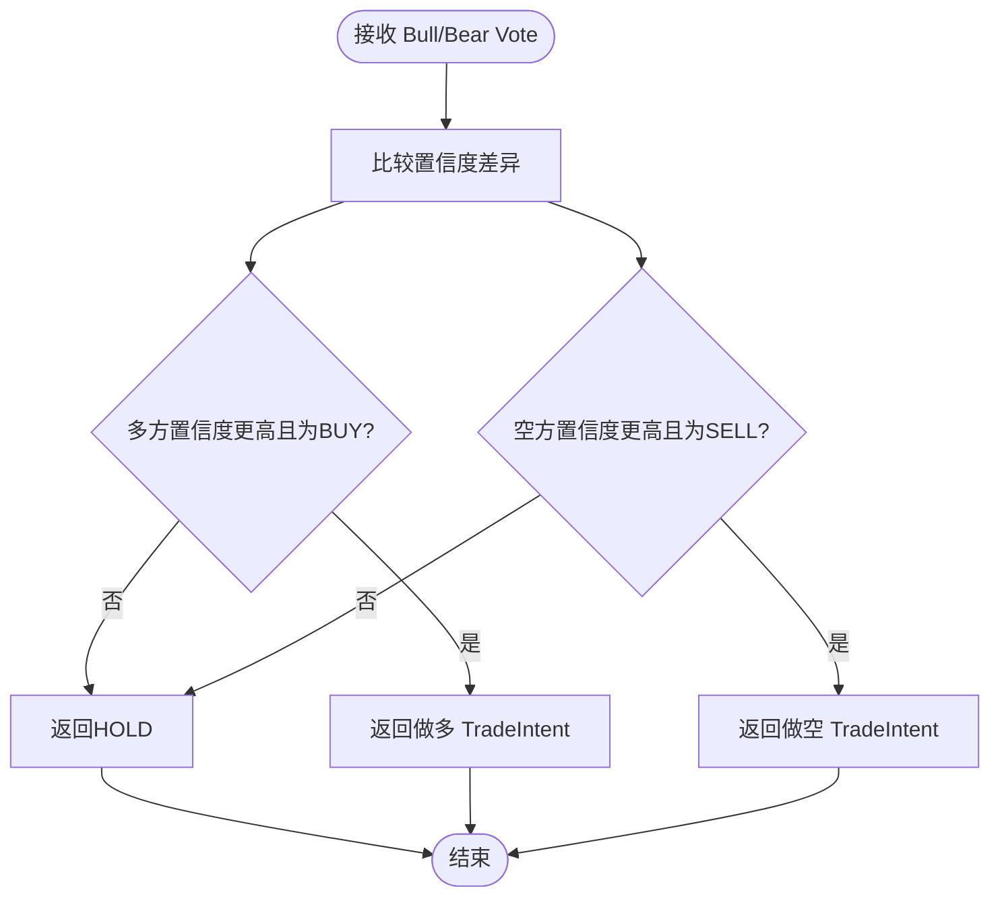
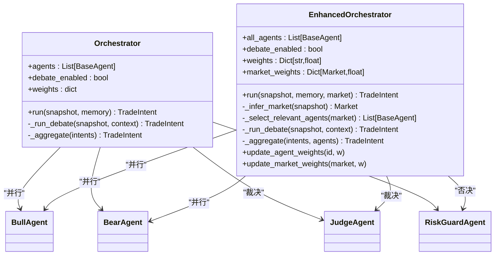
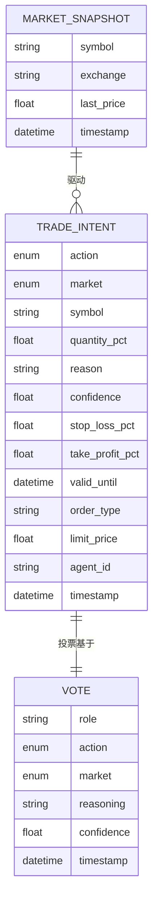
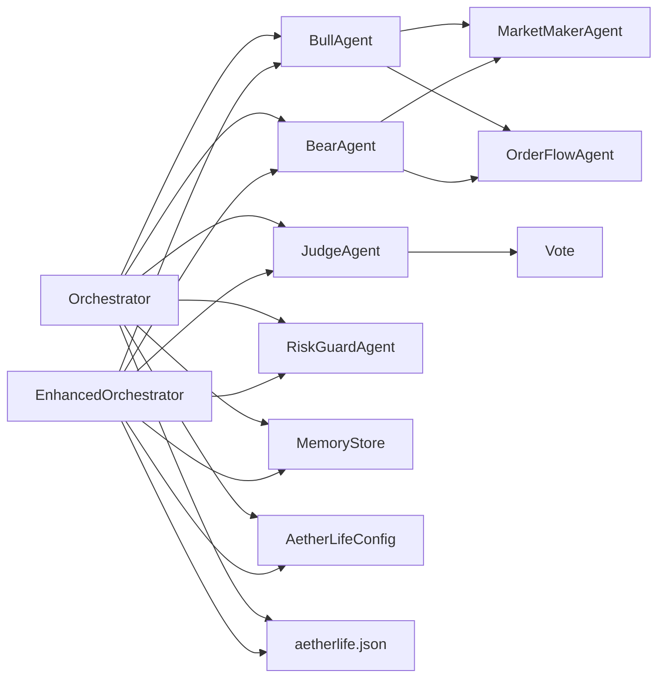

# 辩论机制

<cite>
**本文引用的文件列表**
- [src/aetherlife/cognition/debate.py](file://src/aetherlife/cognition/debate.py)
- [src/aetherlife/cognition/agents.py](file://src/aetherlife/cognition/agents.py)
- [src/aetherlife/cognition/orchestrator.py](file://src/aetherlife/cognition/orchestrator.py)
- [src/aetherlife/cognition/orchestrator_enhanced.py](file://src/aetherlife/cognition/orchestrator_enhanced.py)
- [src/aetherlife/cognition/schemas.py](file://src/aetherlife/cognition/schemas.py)
- [src/aetherlife/memory/store.py](file://src/aetherlife/memory/store.py)
- [src/aetherlife/perception/models.py](file://src/aetherlife/perception/models.py)
- [src/aetherlife/config.py](file://src/aetherlife/config.py)
- [configs/aetherlife.json](file://configs/aetherlife.json)
- [scripts/cognition_multi_agent_demo.py](file://scripts/cognition_multi_agent_demo.py)
</cite>

## 目录
1. [引言](#引言)
2. [项目结构](#项目结构)
3. [核心组件](#核心组件)
4. [架构总览](#架构总览)
5. [详细组件分析](#详细组件分析)
6. [依赖关系分析](#依赖关系分析)
7. [性能考量](#性能考量)
8. [故障排查指南](#故障排查指南)
9. [结论](#结论)
10. [附录](#附录)

## 引言
本文件面向AetherLife的“辩论机制”，系统性阐述Bull（多方）、Bear（空方）、Judge（裁判）三代理辩论系统的设计理念、实现原理与运行流程。重点包括：
- 多头代理与空头代理的并行决策过程
- 裁判代理的裁决算法与权重计算
- 投票机制、权重计算与最终决策生成
- 配置选项、性能优化建议与调试方法
- 何时启用辩论模式及对系统性能的影响
- 具体的代码示例路径，展示辩论过程的执行与结果处理

## 项目结构
围绕辩论机制的关键文件组织如下：
- 认知层：Bull/Bear/Judge三代理与通用Agent
- 协调器：Orchestrator与EnhancedOrchestrator
- 数据模型：TradeIntent、Vote、MarketSnapshot等
- 记忆与风控：MemoryStore、RiskGuardAgent
- 配置：全局配置与JSON配置文件

图表来源
- [src/aetherlife/cognition/debate.py](file://src/aetherlife/cognition/debate.py#L15-L100)
- [src/aetherlife/cognition/agents.py](file://src/aetherlife/cognition/agents.py#L25-L109)
- [src/aetherlife/cognition/orchestrator.py](file://src/aetherlife/cognition/orchestrator.py#L16-L93)
- [src/aetherlife/cognition/orchestrator_enhanced.py](file://src/aetherlife/cognition/orchestrator_enhanced.py#L21-L323)
- [src/aetherlife/cognition/schemas.py](file://src/aetherlife/cognition/schemas.py#L32-L74)
- [src/aetherlife/perception/models.py](file://src/aetherlife/perception/models.py#L55-L64)
- [src/aetherlife/memory/store.py](file://src/aetherlife/memory/store.py#L43-L155)
- [src/aetherlife/config.py](file://src/aetherlife/config.py#L36-L48)
- [configs/aetherlife.json](file://configs/aetherlife.json#L1-L17)

章节来源
- [src/aetherlife/cognition/debate.py](file://src/aetherlife/cognition/debate.py#L1-L100)
- [src/aetherlife/cognition/orchestrator.py](file://src/aetherlife/cognition/orchestrator.py#L1-L93)
- [src/aetherlife/cognition/orchestrator_enhanced.py](file://src/aetherlife/cognition/orchestrator_enhanced.py#L1-L323)
- [src/aetherlife/cognition/schemas.py](file://src/aetherlife/cognition/schemas.py#L1-L219)
- [src/aetherlife/memory/store.py](file://src/aetherlife/memory/store.py#L1-L155)
- [src/aetherlife/perception/models.py](file://src/aetherlife/perception/models.py#L1-L64)
- [src/aetherlife/config.py](file://src/aetherlife/config.py#L1-L131)
- [configs/aetherlife.json](file://configs/aetherlife.json#L1-L17)

## 核心组件
- BullAgent：从做多角度解读市场快照，偏向做多，结合MarketMaker与OrderFlow的结果进行修正与增强。
- BearAgent：从做空角度解读市场快照，偏向做空，同样结合MarketMaker与OrderFlow的结果进行修正与增强。
- JudgeAgent：接收Bull/Bear的投票，基于置信度差异与行动方向进行裁决，输出最终TradeIntent。
- Orchestrator：基础协调器，支持辩论或并行聚合两种路径，最后经风控Agent否决。
- EnhancedOrchestrator：增强版协调器，支持多市场专业化Agent、并行动态权重、市场权重与辩论模式。
- TradeIntent/Vote：结构化决策输出与投票载体，确保可审计与可追踪。
- MemoryStore：短期记忆与上下文构建，提供给Agent与协调器使用。
- MarketSnapshot：统一的市场快照数据结构，承载订单簿、价格、K线等。

章节来源
- [src/aetherlife/cognition/debate.py](file://src/aetherlife/cognition/debate.py#L15-L100)
- [src/aetherlife/cognition/orchestrator.py](file://src/aetherlife/cognition/orchestrator.py#L16-L93)
- [src/aetherlife/cognition/orchestrator_enhanced.py](file://src/aetherlife/cognition/orchestrator_enhanced.py#L21-L323)
- [src/aetherlife/cognition/schemas.py](file://src/aetherlife/cognition/schemas.py#L32-L74)
- [src/aetherlife/memory/store.py](file://src/aetherlife/memory/store.py#L43-L155)
- [src/aetherlife/perception/models.py](file://src/aetherlife/perception/models.py#L55-L64)

## 架构总览
辩论机制采用“并行双视角 + 统一裁决”的设计，核心流程如下：
- 并行执行：BullAgent与BearAgent同时基于同一MarketSnapshot与上下文生成TradeIntent
- 投票阶段：双方将TradeIntent转换为Vote（含角色、行动、置信度与理由）
- 裁决阶段：JudgeAgent比较双方置信度差异与行动方向，输出最终TradeIntent
- 风控阶段：RiskGuardAgent对最终决策进行否决检查

图表来源
- [src/aetherlife/cognition/orchestrator.py](file://src/aetherlife/cognition/orchestrator.py#L55-L63)
- [src/aetherlife/cognition/debate.py](file://src/aetherlife/cognition/debate.py#L77-L99)
- [src/aetherlife/cognition/agents.py](file://src/aetherlife/cognition/agents.py#L50-L68)

章节来源
- [src/aetherlife/cognition/orchestrator.py](file://src/aetherlife/cognition/orchestrator.py#L38-L53)
- [src/aetherlife/cognition/debate.py](file://src/aetherlife/cognition/debate.py#L74-L99)

## 详细组件分析

### BullAgent 与 BearAgent 并行决策
- 设计理念：通过“做多”与“做空”两个视角对同一市场快照进行独立分析，形成互补观点。
- 决策流程：
  - 调用MarketMakerAgent与OrderFlowAgent，得到基础TradeIntent
  - 根据自身偏向（做多/做空）对基础Intent进行修正：
    - 若MarketMaker建议相反方向，则降低置信度或转为HOLD
    - 若OrderFlow支持自身方向，则提升行动强度与置信度
- 投票输出：将最终TradeIntent转换为Vote，包含角色、行动、置信度与理由。

图表来源
- [src/aetherlife/cognition/debate.py](file://src/aetherlife/cognition/debate.py#L23-L36)
- [src/aetherlife/cognition/debate.py](file://src/aetherlife/cognition/debate.py#L50-L62)

章节来源
- [src/aetherlife/cognition/debate.py](file://src/aetherlife/cognition/debate.py#L15-L66)

### JudgeAgent 裁决算法
- 输入：Bull与Bear的Vote
- 裁决条件：
  - 若多方置信度显著高于空方且行动为BUY，则采纳多方
  - 若空方置信度显著高于多方且行动为SELL，则采纳空方
  - 否则输出HOLD，表示分歧
- 输出：最终TradeIntent，包含行动、置信度与理由

图表来源
- [src/aetherlife/cognition/debate.py](file://src/aetherlife/cognition/debate.py#L77-L99)

章节来源
- [src/aetherlife/cognition/debate.py](file://src/aetherlife/cognition/debate.py#L68-L99)

### Orchestrator 与 EnhancedOrchestrator 的辩论路径
- Orchestrator（基础）：
  - 支持辩论模式与并行聚合两种路径
  - 辩论路径：并行执行Bull/Bear，收集投票并交由Judge裁决
  - 聚合路径：并行执行多个Agent，按权重聚合为最终Intent
  - 最终经RiskGuard否决
- EnhancedOrchestrator（增强）：
  - 支持多市场专业化Agent
  - 自动推断市场类型并选择相关Agent
  - 动态权重（Agent权重与市场权重），支持运行时调整
  - 更完善的异常处理与日志记录

图表来源
- [src/aetherlife/cognition/orchestrator.py](file://src/aetherlife/cognition/orchestrator.py#L16-L93)
- [src/aetherlife/cognition/orchestrator_enhanced.py](file://src/aetherlife/cognition/orchestrator_enhanced.py#L21-L323)

章节来源
- [src/aetherlife/cognition/orchestrator.py](file://src/aetherlife/cognition/orchestrator.py#L16-L93)
- [src/aetherlife/cognition/orchestrator_enhanced.py](file://src/aetherlife/cognition/orchestrator_enhanced.py#L21-L323)

### 数据模型与投票机制
- TradeIntent：标准化的交易意图输出，包含动作、市场、符号、仓位比例、置信度、理由、时效性、执行参数与元数据。
- Vote：辩论投票载体，包含角色、动作、市场、理由与置信度，以及投票时间戳。
- MarketSnapshot：统一的市场快照，包含订单簿、最新价格、24小时统计、K线与时间戳。

图表来源
- [src/aetherlife/cognition/schemas.py](file://src/aetherlife/cognition/schemas.py#L32-L74)
- [src/aetherlife/perception/models.py](file://src/aetherlife/perception/models.py#L55-L64)

章节来源
- [src/aetherlife/cognition/schemas.py](file://src/aetherlife/cognition/schemas.py#L32-L74)
- [src/aetherlife/perception/models.py](file://src/aetherlife/perception/models.py#L55-L64)

## 依赖关系分析
- 组件耦合：
  - Bull/Bear依赖MarketMakerAgent与OrderFlowAgent，体现“双视角+基础分析”的组合
  - Judge依赖Vote结构，强调“以置信度差异为依据”的裁决
  - Orchestrator/EnhancedOrchestrator依赖MemoryStore构建上下文，依赖RiskGuard进行风控
- 外部依赖：
  - 记忆层：MemoryStore提供短期上下文与日志摘要
  - 配置层：全局配置与JSON配置控制辩论开关、并行深度与日志级别

图表来源
- [src/aetherlife/cognition/debate.py](file://src/aetherlife/cognition/debate.py#L15-L100)
- [src/aetherlife/cognition/orchestrator.py](file://src/aetherlife/cognition/orchestrator.py#L16-L93)
- [src/aetherlife/cognition/orchestrator_enhanced.py](file://src/aetherlife/cognition/orchestrator_enhanced.py#L21-L323)
- [src/aetherlife/memory/store.py](file://src/aetherlife/memory/store.py#L43-L155)
- [src/aetherlife/config.py](file://src/aetherlife/config.py#L36-L48)
- [configs/aetherlife.json](file://configs/aetherlife.json#L1-L17)

章节来源
- [src/aetherlife/cognition/debate.py](file://src/aetherlife/cognition/debate.py#L15-L100)
- [src/aetherlife/cognition/orchestrator.py](file://src/aetherlife/cognition/orchestrator.py#L16-L93)
- [src/aetherlife/cognition/orchestrator_enhanced.py](file://src/aetherlife/cognition/orchestrator_enhanced.py#L21-L323)
- [src/aetherlife/memory/store.py](file://src/aetherlife/memory/store.py#L43-L155)
- [src/aetherlife/config.py](file://src/aetherlife/config.py#L36-L48)
- [configs/aetherlife.json](file://configs/aetherlife.json#L1-L17)

## 性能考量
- 并行执行：
  - 使用asyncio.gather并行执行Bull/Bear，减少总等待时间
  - 在EnhancedOrchestrator中，可并行执行多个专业化Agent，但需注意资源占用
- 权重与市场权重：
  - 动态调整Agent权重与市场权重，可在不同市场环境下平衡决策质量与速度
- 异常处理：
  - EnhancedOrchestrator对并行执行的异常进行过滤，避免整体失败
- 日志与审计：
  - 配置文件开启审计日志，便于定位性能瓶颈与错误来源

章节来源
- [src/aetherlife/cognition/orchestrator.py](file://src/aetherlife/cognition/orchestrator.py#L48-L53)
- [src/aetherlife/cognition/orchestrator_enhanced.py](file://src/aetherlife/cognition/orchestrator_enhanced.py#L117-L134)
- [configs/aetherlife.json](file://configs/aetherlife.json#L7-L10)

## 故障排查指南
- 辩论模式未生效：
  - 检查配置文件中的辩论开关与全局配置
  - 确认Orchestrator/EnhancedOrchestrator初始化时debate_enabled为True
- 决策始终为HOLD：
  - 检查Bull/Bear的置信度差异是否满足裁决阈值
  - 查看MarketMaker与OrderFlowAgent的输出是否合理
- 风控否决频繁：
  - 检查RiskGuardAgent的否决条件（日收益、置信度）
  - 调整风控阈值或临时关闭风控进行对比测试
- 性能问题：
  - 减少并行Agent数量或动态权重
  - 优化日志级别，避免过多I/O
  - 使用MemoryStore的Redis持久化能力进行离线分析

章节来源
- [src/aetherlife/cognition/orchestrator.py](file://src/aetherlife/cognition/orchestrator.py#L45-L53)
- [src/aetherlife/cognition/orchestrator_enhanced.py](file://src/aetherlife/cognition/orchestrator_enhanced.py#L136-L147)
- [src/aetherlife/cognition/agents.py](file://src/aetherlife/cognition/agents.py#L50-L68)
- [src/aetherlife/memory/store.py](file://src/aetherlife/memory/store.py#L140-L145)

## 结论
AetherLife的辩论机制通过“并行双视角 + 统一裁决”的设计，实现了对市场快照的多维度审视与稳健决策。Bull/Bear分别代表做多与做空的独立判断，Judge基于置信度差异做出最终裁决，配合风控与记忆系统，形成可审计、可追踪、可优化的闭环。在实际部署中，应根据市场特性与资源情况选择合适的并行深度与权重策略，并通过配置与日志进行持续监控与优化。

## 附录

### 配置选项
- 全局配置（AetherLifeConfig）：
  - 认知层：debate_enabled、parallel_analysts
  - 守护层：audit_log_enabled、audit_log_path
- JSON配置（aetherlife.json）：
  - cognition.debate_enabled：启用/禁用辩论模式
  - guard.audit_log_enabled：启用/禁用审计日志
  - evolution.*：进化相关参数

章节来源
- [src/aetherlife/config.py](file://src/aetherlife/config.py#L36-L48)
- [configs/aetherlife.json](file://configs/aetherlife.json#L1-L17)

### 何时启用辩论模式
- 市场波动较大、方向不明朗时，通过双视角对比提升决策稳健性
- 需要快速验证不同市场解读的一致性与分歧点
- 对风控要求较高，希望引入“裁决”环节进行二次把关

### 代码示例路径
- 基础Orchestrator运行辩论流程
  - [src/aetherlife/cognition/orchestrator.py](file://src/aetherlife/cognition/orchestrator.py#L45-L63)
- 增强Orchestrator运行辩论流程
  - [src/aetherlife/cognition/orchestrator_enhanced.py](file://src/aetherlife/cognition/orchestrator_enhanced.py#L223-L233)
- Bull/Bear投票与Judge裁决
  - [src/aetherlife/cognition/debate.py](file://src/aetherlife/cognition/debate.py#L38-L65)
  - [src/aetherlife/cognition/debate.py](file://src/aetherlife/cognition/debate.py#L77-L99)
- 记忆与上下文
  - [src/aetherlife/memory/store.py](file://src/aetherlife/memory/store.py#L134-L145)
- 示例脚本（演示与权重调整）
  - [scripts/cognition_multi_agent_demo.py](file://scripts/cognition_multi_agent_demo.py#L120-L194)
  - [scripts/cognition_multi_agent_demo.py](file://scripts/cognition_multi_agent_demo.py#L197-L235)