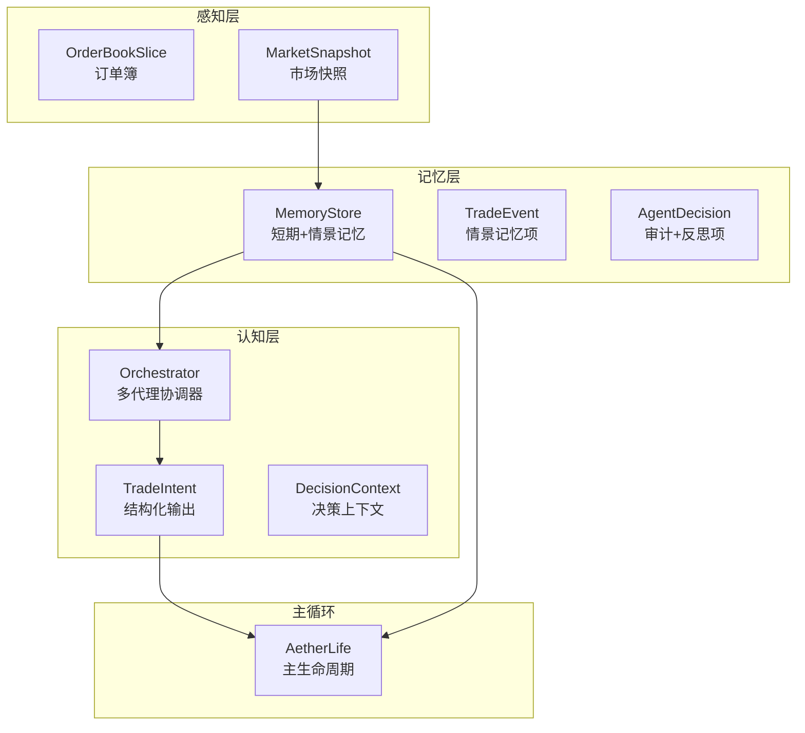
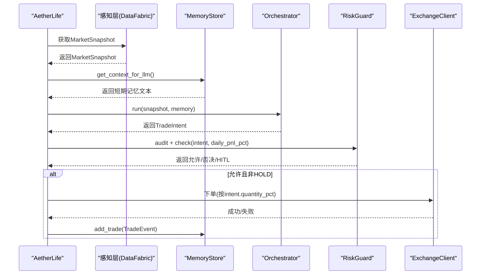
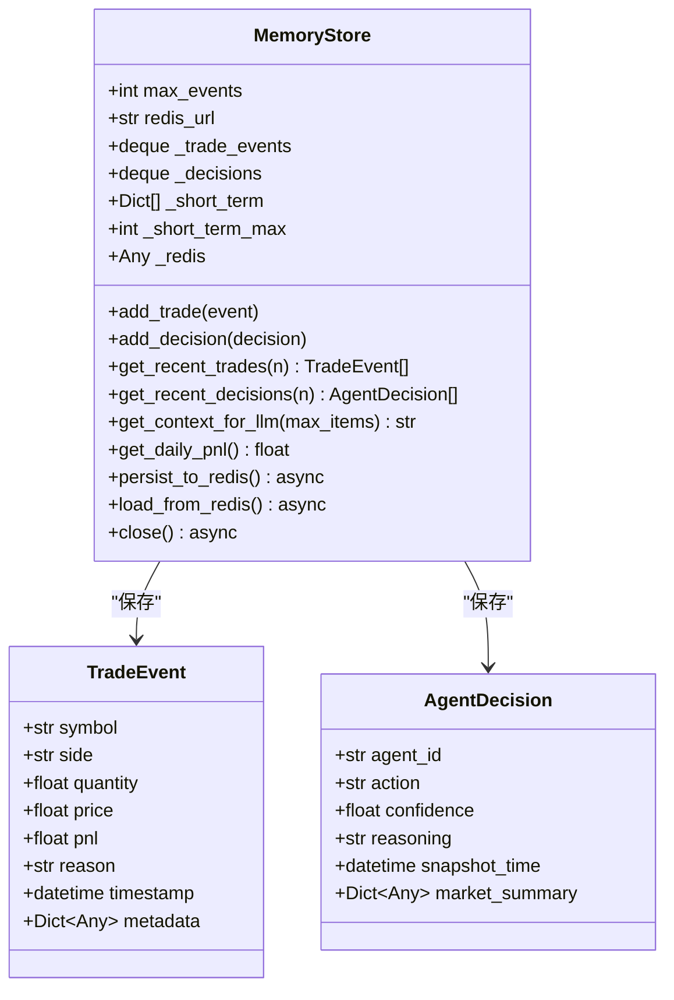
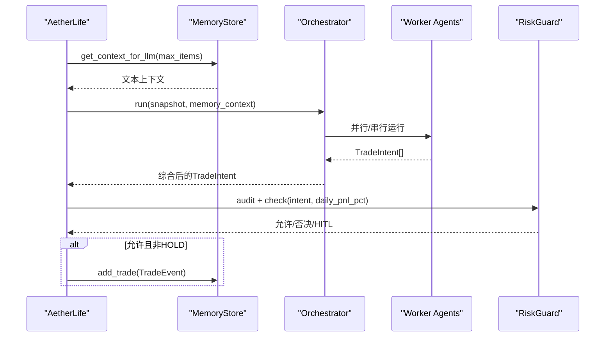
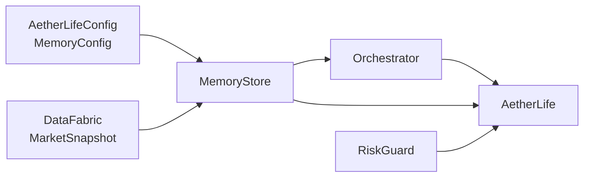

# 记忆层实现

<cite>
**本文引用的文件**
- [src/aetherlife/memory/store.py](file://src/aetherlife/memory/store.py)
- [src/aetherlife/cognition/schemas.py](file://src/aetherlife/cognition/schemas.py)
- [src/aetherlife/cognition/agents.py](file://src/aetherlife/cognition/agents.py)
- [src/aetherlife/cognition/orchestrator.py](file://src/aetherlife/cognition/orchestrator.py)
- [src/aetherlife/cognition/debate.py](file://src/aetherlife/cognition/debate.py)
- [src/aetherlife/perception/models.py](file://src/aetherlife/perception/models.py)
- [src/aetherlife/config.py](file://src/aetherlife/config.py)
- [src/aetherlife/core/life.py](file://src/aetherlife/core/life.py)
- [src/aetherlife/run.py](file://src/aetherlife/run.py)
- [configs/aetherlife.json](file://configs/aetherlife.json)
</cite>

## 目录
1. [简介](#简介)
2. [项目结构](#项目结构)
3. [核心组件](#核心组件)
4. [架构总览](#架构总览)
5. [详细组件分析](#详细组件分析)
6. [依赖关系分析](#依赖关系分析)
7. [性能考量](#性能考量)
8. [故障排查指南](#故障排查指南)
9. [结论](#结论)
10. [附录](#附录)

## 简介
本文件面向AetherLife记忆层，聚焦于MemoryStore的存储架构设计与上下文数据管理，解释短期记忆、情景记忆与可选Redis持久化的结合策略，阐述历史数据检索与时间序列组织方式，并说明记忆层如何支撑LLM推理所需的上下文构建（数据压缩、索引优化与查询性能）。同时提供API使用示例、数据访问模式与性能优化建议，并讨论多代理协作中的作用及一致性与完整性保障。

## 项目结构
记忆层位于src/aetherlife/memory目录，核心为MemoryStore类，配合感知层MarketSnapshot、认知层TradeIntent/DecisionContext等Schema，以及AetherLife主循环进行集成。

图表来源
- [src/aetherlife/memory/store.py](file://src/aetherlife/memory/store.py#L43-L155)
- [src/aetherlife/perception/models.py](file://src/aetherlife/perception/models.py#L15-L64)
- [src/aetherlife/cognition/schemas.py](file://src/aetherlife/cognition/schemas.py#L32-L125)
- [src/aetherlife/cognition/orchestrator.py](file://src/aetherlife/cognition/orchestrator.py#L16-L93)
- [src/aetherlife/core/life.py](file://src/aetherlife/core/life.py#L20-L169)

章节来源
- [src/aetherlife/memory/store.py](file://src/aetherlife/memory/store.py#L1-L155)
- [src/aetherlife/perception/models.py](file://src/aetherlife/perception/models.py#L1-L64)
- [src/aetherlife/cognition/schemas.py](file://src/aetherlife/cognition/schemas.py#L1-L219)
- [src/aetherlife/cognition/orchestrator.py](file://src/aetherlife/cognition/orchestrator.py#L1-L93)
- [src/aetherlife/core/life.py](file://src/aetherlife/core/life.py#L1-L169)

## 核心组件
- MemoryStore：短期+情景记忆容器，支持内存队列与可选Redis持久化；提供最近事件检索、上下文摘要、当日盈亏汇总与Redis读写接口。
- TradeEvent：单笔交易事件（情景记忆），包含标的、方向、数量、价格、盈亏、原因、时间戳与元数据。
- AgentDecision：单次Agent决策记录（审计+反思），包含Agent标识、动作、置信度、推理、快照时间与市场摘要。
- 记忆上下文接口：get_context_for_llm，将短期记忆序列化为文本，供LLM作为上下文输入。
- Redis集成：可选连接，支持持久化写入与启动时加载，具备列表修剪与错误容错。

章节来源
- [src/aetherlife/memory/store.py](file://src/aetherlife/memory/store.py#L19-L155)

## 架构总览
记忆层在AetherLife主循环中承担“短期记忆”与“情景记忆”的职责：
- 每个周期开始时，感知层提供MarketSnapshot，记忆层生成上下文字符串传给Orchestrator。
- Orchestrator聚合多个Worker Agent的TradeIntent，RiskGuard基于记忆层的当日盈亏进行否决判断。
- 执行阶段若产生真实交易，会将TradeEvent写入记忆层，形成历史轨迹。

图表来源
- [src/aetherlife/core/life.py](file://src/aetherlife/core/life.py#L59-L122)
- [src/aetherlife/memory/store.py](file://src/aetherlife/memory/store.py#L134-L145)
- [src/aetherlife/cognition/orchestrator.py](file://src/aetherlife/cognition/orchestrator.py#L38-L53)

## 详细组件分析

### MemoryStore：短期+情景记忆与Redis持久化
- 数据结构
  - _trade_events：双端队列，保存最近的TradeEvent，受max_events限制。
  - _decisions：双端队列，保存最近的AgentDecision。
  - _short_term：列表，保存最近的轻量级事件摘要，用于LLM上下文，受_short_term_max限制。
  - 可选Redis连接：_redis，键空间包含交易列表与短期列表，具备最大长度修剪。
- 关键方法
  - add_trade/add_decision：写入队列与短时摘要，超出上限时弹出最旧项。
  - get_recent_trades/get_recent_decisions：返回最近N条记录。
  - get_context_for_llm：将最近短时事件序列化为文本，便于LLM消费。
  - get_daily_pnl：按UTC日期计算当日累计盈亏。
  - persist_to_redis/load_from_redis：异步写入Redis或从Redis加载近期事件。
  - close：关闭Redis连接。
- 存储策略
  - 内存优先：deque与list提供O(1)插入与近似O(1)随机访问，满足高频写入场景。
  - Redis可选持久化：在shutdown或定时任务中写入，startup时加载，避免重启丢失。
  - 短时摘要：仅保存必要字段，降低LLM上下文开销。
- 时间序列组织
  - 以事件时间戳排序，最近事件在末尾；get_recent_*按切片取最后N条，天然形成时间序列视图。
- 上下文构建
  - get_context_for_llm将短时事件转为紧凑文本，控制最大条目数，避免超过LLM上下文窗口。

图表来源
- [src/aetherlife/memory/store.py](file://src/aetherlife/memory/store.py#L19-L155)

章节来源
- [src/aetherlife/memory/store.py](file://src/aetherlife/memory/store.py#L43-L155)

### 记忆层与认知层的交互
- 上下文传递：AetherLife在每轮周期中调用MemoryStore.get_context_for_llm，将文本上下文传给Orchestrator.run，后者再传给各Worker Agent。
- 决策整合：Orchestrator聚合多个Agent的TradeIntent，RiskGuard基于记忆层的当日盈亏进行否决判断。
- 执行记录：若执行成功，AetherLife将真实交易封装为TradeEvent写入MemoryStore，形成历史轨迹。

图表来源
- [src/aetherlife/core/life.py](file://src/aetherlife/core/life.py#L59-L87)
- [src/aetherlife/cognition/orchestrator.py](file://src/aetherlife/cognition/orchestrator.py#L38-L53)

章节来源
- [src/aetherlife/core/life.py](file://src/aetherlife/core/life.py#L59-L122)
- [src/aetherlife/cognition/orchestrator.py](file://src/aetherlife/cognition/orchestrator.py#L16-L93)

### 记忆层在多代理协作中的作用
- 信息共享：所有Worker Agent通过相同的上下文字符串共享短期记忆，确保不同Agent在同一背景上推理。
- 一致性保障：MemoryStore的add_trade/add_decision是原子性写入，避免并发竞态导致的数据不一致。
- 完整性保障：RiskGuard在决策前读取当日盈亏，结合记忆层的历史记录进行否决，防止连续亏损扩大。
- 可审计性：AgentDecision记录了推理与置信度，便于事后复盘与审计。

章节来源
- [src/aetherlife/cognition/orchestrator.py](file://src/aetherlife/cognition/orchestrator.py#L16-L93)
- [src/aetherlife/cognition/agents.py](file://src/aetherlife/cognition/agents.py#L1-L109)
- [src/aetherlife/core/life.py](file://src/aetherlife/core/life.py#L74-L83)

### API使用示例与数据访问模式
- 获取最近交易与决策
  - 获取最近N笔交易：调用get_recent_trades(n)，返回TradeEvent列表。
  - 获取最近N次决策：调用get_recent_decisions(n)，返回AgentDecision列表。
- 构建LLM上下文
  - 调用get_context_for_llm(max_items)获取文本上下文，适合直接注入LLM提示词。
- 日常统计
  - 调用get_daily_pnl()获取当日累计盈亏，用于风控判断。
- Redis持久化
  - 启动时调用load_from_redis()加载近期事件。
  - 关闭时调用persist_to_redis()写入Redis并修剪列表长度。
  - 最后调用close()释放Redis连接。
- 数据访问模式
  - 写入：add_trade/add_decision，O(1)均摊复杂度。
  - 读取：get_recent_*按切片取尾部，O(N)；get_context_for_llm序列化短时事件，O(N)。
  - Redis读写：异步操作，避免阻塞主循环。

章节来源
- [src/aetherlife/memory/store.py](file://src/aetherlife/memory/store.py#L64-L145)

### 数据压缩、索引优化与查询性能
- 数据压缩
  - 短时摘要仅保存必要字段，减少LLM上下文体积；对reasoning字段截断，避免冗长文本影响性能。
- 索引优化
  - 内存侧使用deque与list，天然支持O(1)尾部插入与切片访问；Redis侧使用列表与LRANGE/RPUSH/LTRIM组合，具备修剪能力。
- 查询性能
  - get_recent_*与get_context_for_llm均为线性扫描，但受限于max_items与_short_term_max，实际开销可控。
  - Redis读写采用异步I/O，避免阻塞主循环。

章节来源
- [src/aetherlife/memory/store.py](file://src/aetherlife/memory/store.py#L90-L127)

### 时间序列数据组织
- 事件按时间戳排序，最近事件在末尾；get_recent_*通过切片获取最近N条，形成自然的时间序列视图。
- get_daily_pnl按UTC日期聚合，便于日级别统计与风控。

章节来源
- [src/aetherlife/memory/store.py](file://src/aetherlife/memory/store.py#L128-L145)

## 依赖关系分析
- MemoryStore依赖感知层的MarketSnapshot（通过上下文字符串间接使用）与配置层的MemoryConfig。
- AetherLife主循环在启动时加载Redis历史，在关闭时持久化并释放资源。
- Orchestrator在运行时从MemoryStore获取上下文并进行风险检查。

图表来源
- [src/aetherlife/config.py](file://src/aetherlife/config.py#L23-L33)
- [src/aetherlife/core/life.py](file://src/aetherlife/core/life.py#L23-L46)
- [src/aetherlife/cognition/orchestrator.py](file://src/aetherlife/cognition/orchestrator.py#L19-L36)

章节来源
- [src/aetherlife/config.py](file://src/aetherlife/config.py#L1-L131)
- [src/aetherlife/core/life.py](file://src/aetherlife/core/life.py#L1-L169)
- [src/aetherlife/cognition/orchestrator.py](file://src/aetherlife/cognition/orchestrator.py#L1-L93)

## 性能考量
- 内存队列容量：max_events控制历史规模，建议根据内存与查询需求调整。
- 短时摘要上限：_short_term_max限制LLM上下文大小，避免超限。
- Redis写入频率：建议在周期结束或定时任务中批量写入，减少I/O次数。
- 异步I/O：Redis读写为异步，注意事件循环负载与错误处理。
- 上下文窗口：结合AetherLifeConfig.context_max_tokens，合理设置max_items与_short_term_max。

[本节为通用指导，无需特定文件来源]

## 故障排查指南
- Redis不可用
  - 现象：初始化时无法创建Redis连接，_redis为None。
  - 处理：检查redis_url环境变量或配置；确认Redis服务可用。
- Redis写入异常
  - 现象：persist_to_redis抛出异常或无响应。
  - 处理：捕获异常并忽略，确保不影响主流程；检查网络与权限。
- 启动加载失败
  - 现象：load_from_redis读取失败或解析异常。
  - 处理：捕获异常并跳过损坏条目，确保系统继续运行。
- 内存溢出
  - 现象：max_events过大导致内存占用上升。
  - 处理：适当减小max_events或启用Redis持久化。

章节来源
- [src/aetherlife/memory/store.py](file://src/aetherlife/memory/store.py#L58-L63)
- [src/aetherlife/memory/store.py](file://src/aetherlife/memory/store.py#L90-L103)
- [src/aetherlife/memory/store.py](file://src/aetherlife/memory/store.py#L105-L126)

## 结论
MemoryStore通过“内存为主 + 可选Redis持久化”的策略，实现了短期记忆与情景记忆的高效管理。它以简洁的数据结构与异步I/O满足高频写入与低延迟读取需求，并通过上下文摘要与日级统计为LLM与风控提供关键信息。在多代理协作中，MemoryStore确保了Agent间的信息共享与一致性，配合RiskGuard实现安全的决策执行闭环。

[本节为总结，无需特定文件来源]

## 附录

### 配置要点
- MemoryConfig
  - redis_url：Redis连接地址，默认从环境变量读取。
  - context_max_tokens：LLM上下文窗口上限（用于控制max_items）。
  - use_vector_memory：预留向量记忆开关（当前未在store中使用）。
  - episodic_max_events：事件/交易历史保留条数。
- AetherLifeConfig
  - symbol：交易标的。
  - log_level：日志级别。
  - cognition.debate_enabled：是否启用辩论工作流。
  - guard.audit_log_enabled/audit_log_path：审计日志开关与路径。
  - evolution.evolution_hour_utc/strategy_variants_per_round/min_sharpe_to_deploy：每日进化配置。

章节来源
- [src/aetherlife/config.py](file://src/aetherlife/config.py#L23-L33)
- [src/aetherlife/config.py](file://src/aetherlife/config.py#L98-L131)
- [configs/aetherlife.json](file://configs/aetherlife.json#L1-L17)

### 运行入口与生命周期
- 入口脚本：src/aetherlife/run.py，加载配置并启动AetherLife主循环。
- 主循环：AetherLife.run，周期性执行one_cycle，支持每日进化与Redis持久化。

章节来源
- [src/aetherlife/run.py](file://src/aetherlife/run.py#L52-L71)
- [src/aetherlife/core/life.py](file://src/aetherlife/core/life.py#L123-L169)