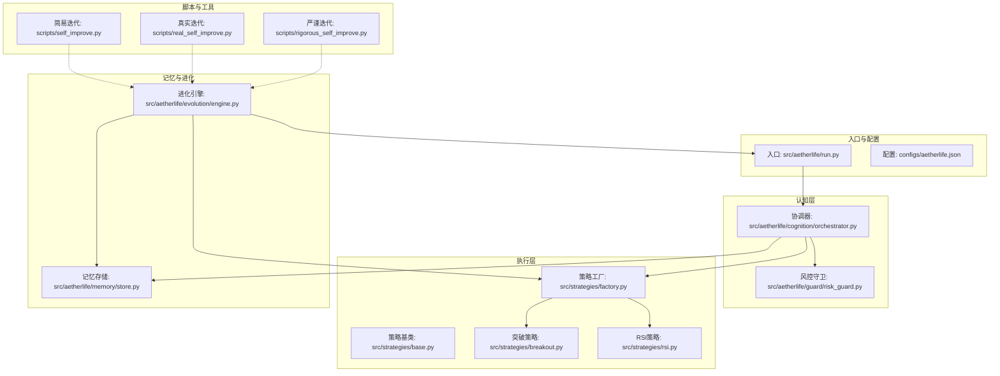
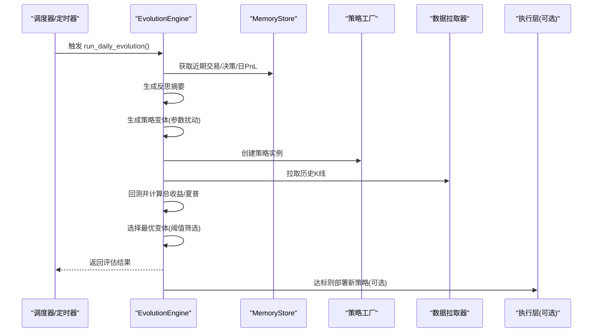
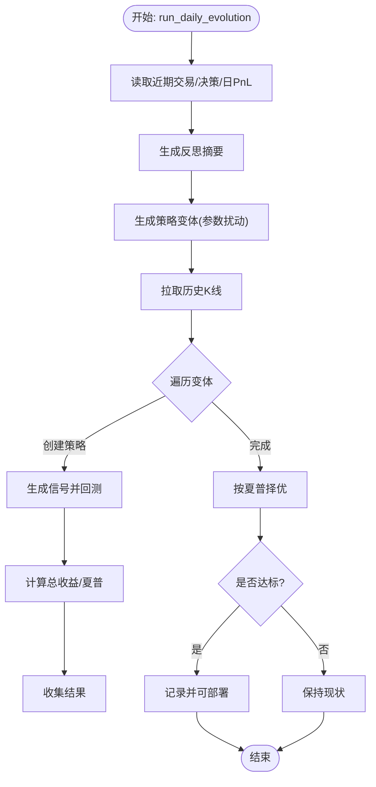
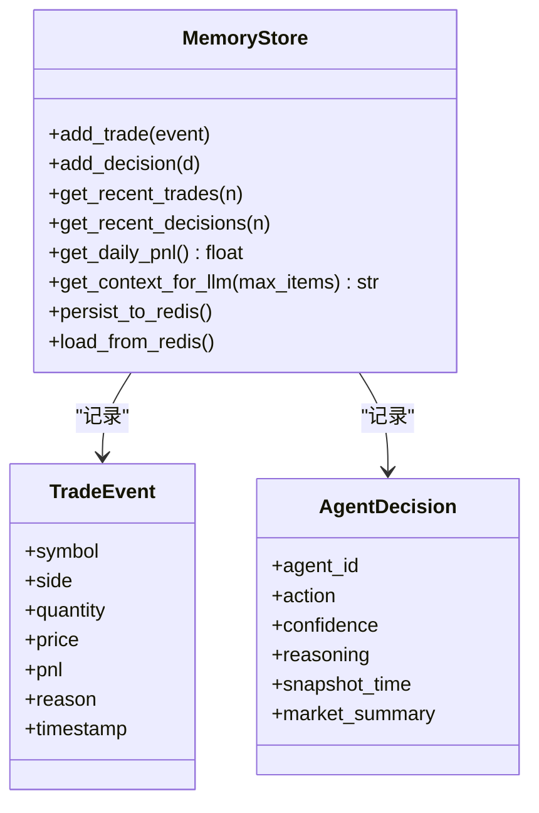
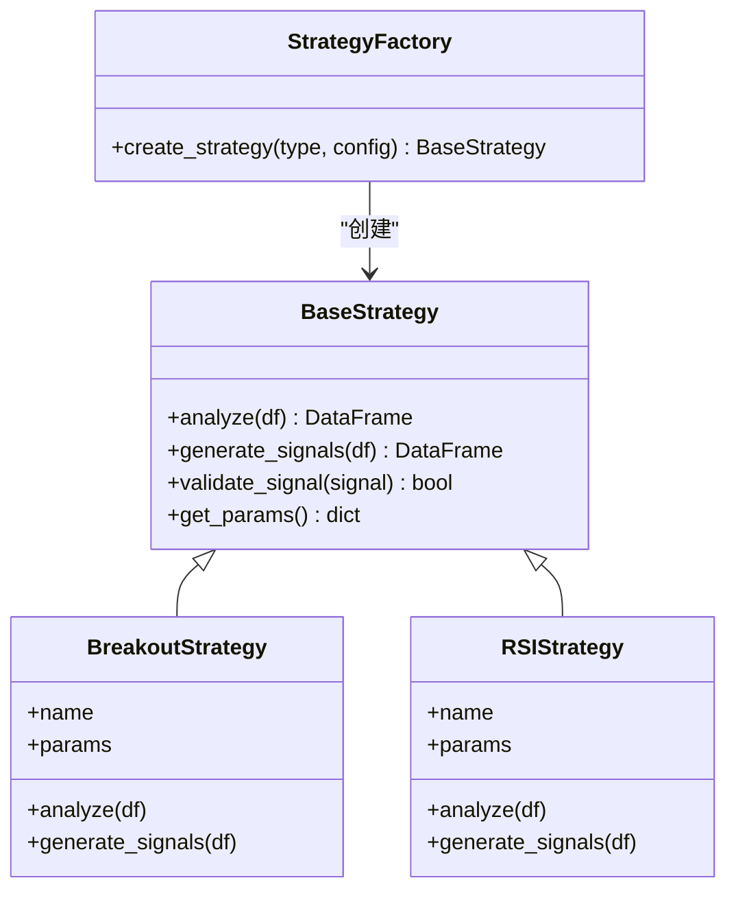
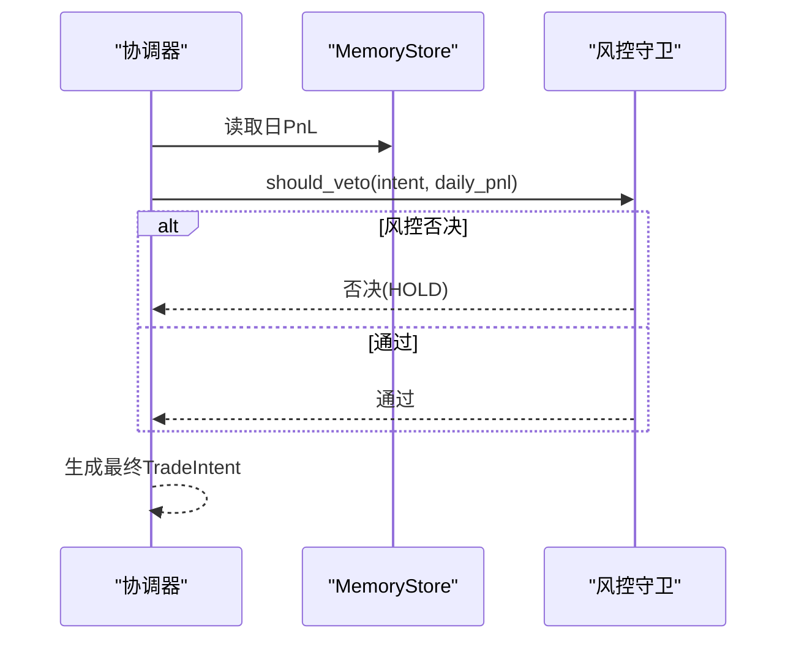
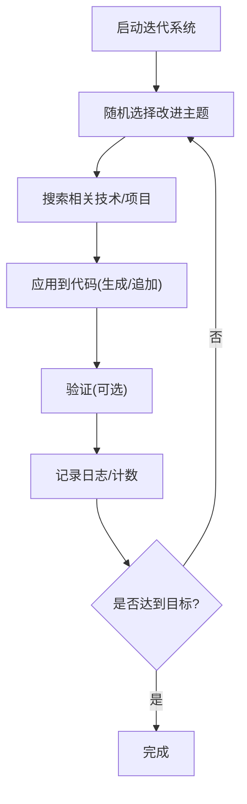
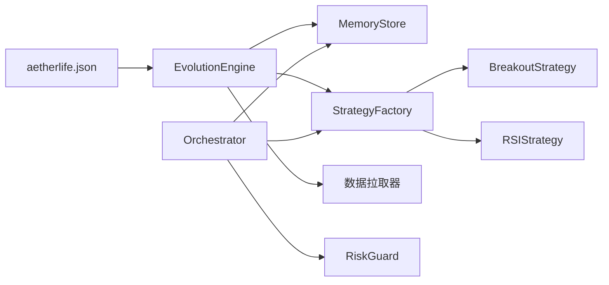

# 进化层自我改进

<cite>
**本文引用的文件**
- [src/aetherlife/evolution/engine.py](file://src/aetherlife/evolution/engine.py)
- [src/aetherlife/memory/store.py](file://src/aetherlife/memory/store.py)
- [src/strategies/factory.py](file://src/strategies/factory.py)
- [src/strategies/breakout.py](file://src/strategies/breakout.py)
- [src/strategies/rsi.py](file://src/strategies/rsi.py)
- [src/strategies/base.py](file://src/strategies/base.py)
- [src/aetherlife/guard/risk_guard.py](file://src/aetherlife/guard/risk_guard.py)
- [src/aetherlife/cognition/orchestrator.py](file://src/aetherlife/cognition/orchestrator.py)
- [src/aetherlife/run.py](file://src/aetherlife/run.py)
- [configs/aetherlife.json](file://configs/aetherlife.json)
- [scripts/self_improve.py](file://scripts/self_improve.py)
- [scripts/real_self_improve.py](file://scripts/real_self_improve.py)
- [scripts/rigorous_self_improve.py](file://scripts/rigorous_self_improve.py)
</cite>

## 目录
1. [引言](#引言)
2. [项目结构](#项目结构)
3. [核心组件](#核心组件)
4. [架构总览](#架构总览)
5. [详细组件分析](#详细组件分析)
6. [依赖关系分析](#依赖关系分析)
7. [性能考量](#性能考量)
8. [故障排查指南](#故障排查指南)
9. [结论](#结论)
10. [附录](#附录)

## 引言
本文件面向AetherLife“进化层自我改进”系统，聚焦EvolutionEngine的自我进化机制，系统性阐述其策略优化、参数自适应与学习流程；解释如何利用历史数据反馈进行持续改进，包括性能评估、瓶颈识别与优化建议生成；明确自我改进的触发条件与执行策略（定期评估、异常检测、紧急修复）；给出进化参数配置、改进效果评估与风险控制的实操示例；说明与认知层、感知层、执行层的集成方式，并提供监控指标与性能对比分析方法。

## 项目结构
本项目采用分层架构：感知层负责市场数据接入与缓存；认知层组织多Agent进行决策聚合或辩论；执行层封装策略工厂与回测；进化层在每日固定时刻触发，基于历史表现生成策略变体并回测择优；风控层在执行前进行断路器与审计等安全控制；入口脚本负责加载配置与启动主循环。

**图示来源**
- [src/aetherlife/run.py](file://src/aetherlife/run.py#L52-L71)
- [src/aetherlife/cognition/orchestrator.py](file://src/aetherlife/cognition/orchestrator.py#L16-L93)
- [src/aetherlife/guard/risk_guard.py](file://src/aetherlife/guard/risk_guard.py#L23-L84)
- [src/strategies/factory.py](file://src/strategies/factory.py#L10-L36)
- [src/strategies/breakout.py](file://src/strategies/breakout.py#L6-L79)
- [src/strategies/rsi.py](file://src/strategies/rsi.py#L6-L42)
- [src/aetherlife/memory/store.py](file://src/aetherlife/memory/store.py#L43-L155)
- [src/aetherlife/evolution/engine.py](file://src/aetherlife/evolution/engine.py#L17-L145)
- [configs/aetherlife.json](file://configs/aetherlife.json#L11-L16)
- [scripts/self_improve.py](file://scripts/self_improve.py#L15-L64)
- [scripts/real_self_improve.py](file://scripts/real_self_improve.py#L17-L56)
- [scripts/rigorous_self_improve.py](file://scripts/rigorous_self_improve.py#L20-L67)

**章节来源**
- [src/aetherlife/run.py](file://src/aetherlife/run.py#L32-L71)
- [configs/aetherlife.json](file://configs/aetherlife.json#L1-L17)

## 核心组件
- EvolutionEngine：每日触发，读取近期交易与决策、生成反思摘要，构造策略参数变体，回测并择优部署。
- MemoryStore：短期/情景记忆，提供最近交易、决策与日度PnL，支撑反思与回测。
- 策略体系：工厂模式统一创建策略，支持突破与RSI等策略；回测使用简单多空逻辑与夏普比率评估。
- 风控守卫：在执行前进行断路器与大额人工确认等安全控制。
- 协调器：多Agent聚合或辩论，结合风控否决形成最终交易意图。
- 配置与脚本：aetherlife.json定义进化参数；多套迭代脚本演示不同强度的“自我改进”。

**章节来源**
- [src/aetherlife/evolution/engine.py](file://src/aetherlife/evolution/engine.py#L17-L145)
- [src/aetherlife/memory/store.py](file://src/aetherlife/memory/store.py#L43-L155)
- [src/strategies/factory.py](file://src/strategies/factory.py#L10-L36)
- [src/strategies/breakout.py](file://src/strategies/breakout.py#L6-L79)
- [src/strategies/rsi.py](file://src/strategies/rsi.py#L6-L42)
- [src/aetherlife/guard/risk_guard.py](file://src/aetherlife/guard/risk_guard.py#L23-L84)
- [src/aetherlife/cognition/orchestrator.py](file://src/aetherlife/cognition/orchestrator.py#L16-L93)
- [configs/aetherlife.json](file://configs/aetherlife.json#L11-L16)
- [scripts/self_improve.py](file://scripts/self_improve.py#L15-L115)
- [scripts/real_self_improve.py](file://scripts/real_self_improve.py#L17-L166)
- [scripts/rigorous_self_improve.py](file://scripts/rigorous_self_improve.py#L20-L216)

## 架构总览
进化层位于系统“认知-执行-风控”闭环之外，以“反思-生成-回测-择优”的流水线形式工作，既可作为每日定时任务触发，也可由上层调度器按需调用。其输入来自MemoryStore的历史数据，输出是候选策略变体及其评估结果，满足部署门槛后进入执行层参与真实交易。

**图示来源**
- [src/aetherlife/evolution/engine.py](file://src/aetherlife/evolution/engine.py#L45-L60)
- [src/aetherlife/memory/store.py](file://src/aetherlife/memory/store.py#L128-L145)
- [src/strategies/factory.py](file://src/strategies/factory.py#L10-L36)
- [src/aetherlife/evolution/engine.py](file://src/aetherlife/evolution/engine.py#L90-L120)

## 详细组件分析

### EvolutionEngine：自我进化引擎
- 触发与节奏：每日固定UTC小时触发，由外部调度器调用run_daily_evolution()。
- 反思阶段：汇总最近交易、决策与日度PnL，生成简要反思文本，用于指导变体生成。
- 变体生成：基于突破与RSI策略的参数空间（如窗口期、阈值、超买超卖线）组合，限定每轮生成数量。
- 回测评估：拉取历史K线，逐个变体生成信号并计算总收益与夏普比率，过滤无效结果。
- 选优与部署：按夏普择优，仅当达到最小阈值才视为可部署候选。

**图示来源**
- [src/aetherlife/evolution/engine.py](file://src/aetherlife/evolution/engine.py#L45-L60)
- [src/aetherlife/evolution/engine.py](file://src/aetherlife/evolution/engine.py#L71-L88)
- [src/aetherlife/evolution/engine.py](file://src/aetherlife/evolution/engine.py#L90-L120)
- [src/aetherlife/evolution/engine.py](file://src/aetherlife/evolution/engine.py#L140-L145)

**章节来源**
- [src/aetherlife/evolution/engine.py](file://src/aetherlife/evolution/engine.py#L17-L145)
- [configs/aetherlife.json](file://configs/aetherlife.json#L11-L16)

### MemoryStore：历史数据与反思基础
- 提供最近交易事件、决策记录与短期上下文摘要，支撑反思文本生成与风控判断。
- 支持可选Redis持久化，便于重启后恢复近期事件。

**图示来源**
- [src/aetherlife/memory/store.py](file://src/aetherlife/memory/store.py#L43-L155)

**章节来源**
- [src/aetherlife/memory/store.py](file://src/aetherlife/memory/store.py#L43-L155)

### 策略体系：工厂与回测
- 工厂模式：根据类型创建具体策略实例，支持多策略组合。
- 回测逻辑：基于信号序列与收盘价计算持仓收益，得到总收益与年化夏普比率。

**图示来源**
- [src/strategies/base.py](file://src/strategies/base.py#L6-L31)
- [src/strategies/breakout.py](file://src/strategies/breakout.py#L6-L79)
- [src/strategies/rsi.py](file://src/strategies/rsi.py#L6-L42)
- [src/strategies/factory.py](file://src/strategies/factory.py#L10-L36)

**章节来源**
- [src/strategies/factory.py](file://src/strategies/factory.py#L10-L36)
- [src/strategies/breakout.py](file://src/strategies/breakout.py#L6-L79)
- [src/strategies/rsi.py](file://src/strategies/rsi.py#L6-L42)
- [src/strategies/base.py](file://src/strategies/base.py#L6-L31)

### 风控守卫与协调器：安全与决策
- RiskGuard：在执行前检查断路器、日最大亏损与大额人工确认阈值，必要时阻断或要求人工审核。
- Orchestrator：多Agent聚合或辩论，结合风控否决形成最终交易意图，作为进化引擎的上游输入来源。

**图示来源**
- [src/aetherlife/cognition/orchestrator.py](file://src/aetherlife/cognition/orchestrator.py#L38-L53)
- [src/aetherlife/guard/risk_guard.py](file://src/aetherlife/guard/risk_guard.py#L48-L68)

**章节来源**
- [src/aetherlife/guard/risk_guard.py](file://src/aetherlife/guard/risk_guard.py#L23-L84)
- [src/aetherlife/cognition/orchestrator.py](file://src/aetherlife/cognition/orchestrator.py#L16-L93)

### 自我改进脚本：从概念到严谨落地
- self_improve.py：展示“迭代改进”清单与进度管理，适合快速原型与概念验证。
- real_self_improve.py：引入网络搜索主题，模拟“真正学习新技术并应用”，适合探索性改进。
- rigorous_self_improve.py：严谨版，每次迭代搜索GitHub项目并生成/追加代码，形成可验证的改进闭环。

**图示来源**
- [scripts/self_improve.py](file://scripts/self_improve.py#L85-L115)
- [scripts/real_self_improve.py](file://scripts/real_self_improve.py#L129-L166)
- [scripts/rigorous_self_improve.py](file://scripts/rigorous_self_improve.py#L131-L184)

**章节来源**
- [scripts/self_improve.py](file://scripts/self_improve.py#L15-L115)
- [scripts/real_self_improve.py](file://scripts/real_self_improve.py#L17-L166)
- [scripts/rigorous_self_improve.py](file://scripts/rigorous_self_improve.py#L20-L216)

## 依赖关系分析
- EvolutionEngine依赖MemoryStore提供反思素材与日度指标，依赖策略工厂与数据拉取器进行回测。
- 策略工厂依赖具体策略实现（如突破、RSI），回测使用统一的信号-收益计算流程。
- Orchestrator依赖MemoryStore与策略工厂，风控守卫在执行前介入，形成闭环。
- 配置文件aetherlife.json集中定义进化触发时间、每轮变体数与部署阈值。

**图示来源**
- [src/aetherlife/evolution/engine.py](file://src/aetherlife/evolution/engine.py#L39-L43)
- [src/aetherlife/memory/store.py](file://src/aetherlife/memory/store.py#L128-L145)
- [src/strategies/factory.py](file://src/strategies/factory.py#L10-L36)
- [src/aetherlife/cognition/orchestrator.py](file://src/aetherlife/cognition/orchestrator.py#L16-L53)
- [src/aetherlife/guard/risk_guard.py](file://src/aetherlife/guard/risk_guard.py#L23-L68)
- [configs/aetherlife.json](file://configs/aetherlife.json#L11-L16)

**章节来源**
- [src/aetherlife/evolution/engine.py](file://src/aetherlife/evolution/engine.py#L39-L43)
- [src/strategies/factory.py](file://src/strategies/factory.py#L10-L36)
- [src/aetherlife/cognition/orchestrator.py](file://src/aetherlife/cognition/orchestrator.py#L16-L53)
- [src/aetherlife/guard/risk_guard.py](file://src/aetherlife/guard/risk_guard.py#L23-L68)
- [configs/aetherlife.json](file://configs/aetherlife.json#L11-L16)

## 性能考量
- 回测复杂度：每轮回测对每个变体执行一次信号生成与收益计算，整体复杂度近似O(N×M)，其中N为变体数，M为K线长度。可通过并发与缓存K线降低延迟。
- 数据拉取：避免重复拉取，可在EvolutionEngine内部复用fetcher实例；对历史数据进行本地缓存可显著提升吞吐。
- 评估指标：总收益与夏普比率兼顾绝对收益与波动风险；可扩展加入最大回撤、胜率、收益回撤比等。
- 部署门槛：通过最小夏普阈值控制部署质量，防止劣化策略上线。

[本节为通用性能讨论，不直接分析具体文件]

## 故障排查指南
- 回测失败：检查数据拉取器可用性与K线长度，确保df非空且包含必要列；查看日志中的异常堆栈定位问题。
- 变体无效：确认策略工厂类型正确、参数配置合法；检查信号列是否存在。
- 风控阻断：关注断路器与日最大亏损阈值，必要时临时放宽或暂停以恢复业务。
- 迭代脚本异常：核对迭代计数文件与日志文件路径权限；确保网络搜索与GitHub API访问正常。

**章节来源**
- [src/aetherlife/evolution/engine.py](file://src/aetherlife/evolution/engine.py#L95-L120)
- [src/aetherlife/guard/risk_guard.py](file://src/aetherlife/guard/risk_guard.py#L59-L68)
- [scripts/rigorous_self_improve.py](file://scripts/rigorous_self_improve.py#L145-L159)

## 结论
EvolutionEngine以“反思-生成-回测-择优”为核心闭环，结合MemoryStore的历史数据与策略工厂的可插拔能力，实现了参数层面的自我进化。通过aetherlife.json集中配置进化参数，配合多种迭代脚本，系统既能进行概念验证，也能走向严谨落地。风控守卫与协调器确保执行前的安全性，而回测指标与部署阈值则保障改进质量。建议在生产环境中引入并发回测、缓存与更丰富的评估指标，并建立灰度发布与A/B对比机制以进一步提升稳定性与收益。

[本节为总结性内容，不直接分析具体文件]

## 附录

### 进化参数配置示例
- 进化触发UTC小时：在配置文件中设置，决定每日回测与选优的时间点。
- 每轮策略变体数：控制回测规模与资源占用，建议从较小值起步逐步扩大。
- 最小夏普阈值：决定是否部署新策略，过高会降低部署频率，过低可能引入劣化策略。

**章节来源**
- [configs/aetherlife.json](file://configs/aetherlife.json#L11-L16)

### 改进效果评估与风险控制
- 评估维度：总收益、年化夏普、最大回撤、胜率、收益回撤比、交易次数与频率。
- 风险控制：断路器、日最大亏损、大额人工确认、部署阈值、回滚预案与灰度发布。
- 对比分析：以“改进前/后”两组回测结果对比关键指标，观察夏普与收益稳定性变化。

[本节为通用方法论，不直接分析具体文件]

### 与各层集成方式
- 与认知层：通过MemoryStore共享短期记忆与日度指标，为反思与决策提供依据。
- 与执行层：通过策略工厂创建新策略实例，回测通过后可纳入执行流程。
- 与风控层：在执行前由风控守卫进行断路器与限额检查，确保系统安全。

**章节来源**
- [src/aetherlife/memory/store.py](file://src/aetherlife/memory/store.py#L128-L145)
- [src/strategies/factory.py](file://src/strategies/factory.py#L10-L36)
- [src/aetherlife/guard/risk_guard.py](file://src/aetherlife/guard/risk_guard.py#L48-L68)