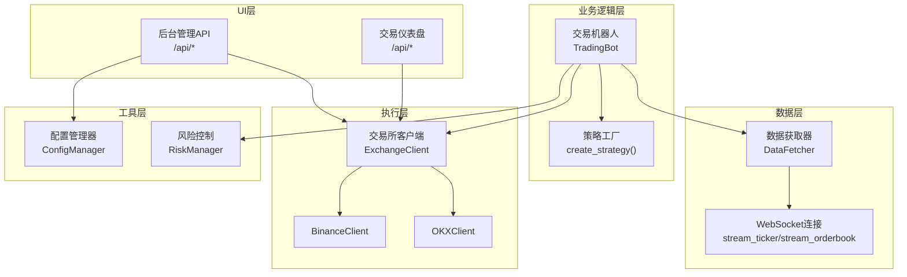
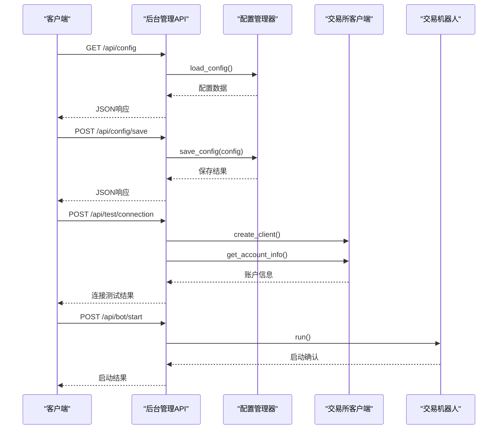
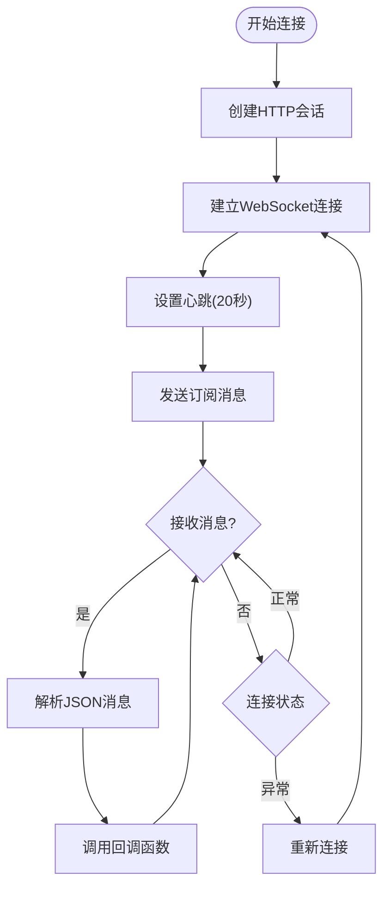
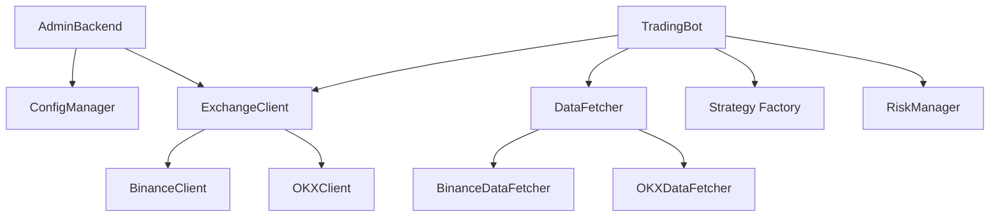

# API参考文档

<cite>
**本文档引用的文件**
- [src/ui/admin_backend.py](file://src/ui/admin_backend.py)
- [src/ui/dashboard.py](file://src/ui/dashboard.py)
- [src/data/data_fetcher.py](file://src/data/data_fetcher.py)
- [src/execution/exchange_client.py](file://src/execution/exchange_client.py)
- [src/utils/config_manager.py](file://src/utils/config_manager.py)
- [src/trading_bot.py](file://src/trading_bot.py)
- [scripts/ws_realtime_demo.py](file://scripts/ws_realtime_demo.py)
- [configs/config.json](file://configs/config.json)
- [configs/aetherlife.json](file://configs/aetherlife.json)
- [requirements.txt](file://requirements.txt)
</cite>

## 目录
1. [简介](#简介)
2. [项目结构](#项目结构)
3. [核心组件](#核心组件)
4. [架构概览](#架构概览)
5. [详细组件分析](#详细组件分析)
6. [依赖关系分析](#依赖关系分析)
7. [性能考虑](#性能考虑)
8. [故障排除指南](#故障排除指南)
9. [结论](#结论)
10. [附录](#附录)

## 简介
本文件为量化交易系统的API接口参考文档，涵盖以下内容：
- RESTful API：HTTP方法、URL模式、请求/响应模式、认证方法
- WebSocket API：连接处理、消息格式、事件类型、实时交互模式
- 内部API接口：模块间通信协议、数据帧格式、状态管理
- 协议特定示例、错误处理策略、安全考虑、速率限制和版本信息
- 常见用例、客户端实现指南、性能优化技巧
- 协议特定的调试工具和监控方法
- 已弃用功能的迁移指南和向后兼容性说明
- 使用示例和最佳实践，包括错误处理和重试机制

## 项目结构
该系统采用模块化架构，主要分为数据层、策略层、执行层、UI层和工具层：
- 数据层：负责从交易所获取市场数据（K线、行情、订单簿、资金费率等）
- 策略层：定义交易策略接口及多种具体策略实现
- 执行层：封装交易所API，提供下单、撤单、仓位管理等功能
- UI层：提供后台管理界面和交易仪表盘
- 工具层：配置管理、风险控制、日志记录等

**图表来源**
- [src/ui/admin_backend.py](file://src/ui/admin_backend.py#L29-L56)
- [src/ui/dashboard.py](file://src/ui/dashboard.py#L21-L30)
- [src/trading_bot.py](file://src/trading_bot.py#L14-L22)
- [src/data/data_fetcher.py](file://src/data/data_fetcher.py#L17-L26)
- [src/execution/exchange_client.py](file://src/execution/exchange_client.py#L20-L31)

**章节来源**
- [src/ui/admin_backend.py](file://src/ui/admin_backend.py#L1-L50)
- [src/ui/dashboard.py](file://src/ui/dashboard.py#L13-L30)
- [src/trading_bot.py](file://src/trading_bot.py#L27-L91)

## 核心组件
本节概述系统中的关键API组件及其职责。

### 后台管理API（RESTful）
提供配置管理、API测试、交易所信息查询、策略信息查询、Bot控制等接口：
- 配置管理：获取、保存、重置、导出配置
- API测试：连接测试、公开接口测试
- 交易所信息：支持的交易所列表、交易对列表
- 策略信息：可用策略列表
- Bot控制：启动、停止、状态查询

### 交易仪表盘API（RESTful）
提供前端展示所需的实时数据接口：
- 状态接口：账户余额、盈亏、持仓数量、当日交易数、胜率
- 持仓接口：当前持仓列表
- 订单接口：历史订单列表
- 统计接口：总交易数、胜/负次数、总盈亏
- 配置接口：更新策略配置
- 下单接口：手动下单（模拟）

### 数据获取API（WebSocket）
提供实时市场数据订阅：
- 行情订阅：最新价、买卖价、成交量等
- 订单簿订阅：买卖盘口深度数据
- 支持交易所：Binance、OKX
- 支持模式：测试网/正式网切换

### 交易执行API（RESTful + WebSocket）
提供下单、撤单、仓位管理等交易功能：
- 行情接口：获取24小时行情、订单簿
- 交易接口：获取账户余额、仓位、下单、撤单、设置杠杆/保证金模式
- WebSocket：实时成交推送（部分实现）

**章节来源**
- [src/ui/admin_backend.py](file://src/ui/admin_backend.py#L29-L56)
- [src/ui/dashboard.py](file://src/ui/dashboard.py#L21-L30)
- [src/data/data_fetcher.py](file://src/data/data_fetcher.py#L64-L70)
- [src/execution/exchange_client.py](file://src/execution/exchange_client.py#L42-L84)

## 架构概览
系统采用分层架构，各层职责清晰，通过明确的接口进行交互：

**图表来源**
- [src/ui/admin_backend.py](file://src/ui/admin_backend.py#L57-L109)
- [src/ui/admin_backend.py](file://src/ui/admin_backend.py#L159-L209)
- [src/ui/admin_backend.py](file://src/ui/admin_backend.py#L323-L349)

**章节来源**
- [src/ui/admin_backend.py](file://src/ui/admin_backend.py#L20-L56)
- [src/trading_bot.py](file://src/trading_bot.py#L256-L297)

## 详细组件分析

### 后台管理API详解

#### 配置管理接口
- 获取配置：GET /api/config
  - 成功响应：包含配置数据，敏感信息会被遮蔽显示
  - 错误响应：返回错误信息和HTTP状态码
- 保存配置：POST /api/config/save
  - 请求体：包含完整的配置对象
  - 参数验证：必须包含交易所信息
  - 成功响应：配置保存成功消息
- 重置配置：POST /api/config/reset
  - 功能：恢复到默认配置
  - 成功响应：包含默认配置数据
- 导出配置：GET /api/config/export?include_sensitive=false
  - 参数：include_sensitive（是否包含敏感信息）
  - 成功响应：配置数据（可选择性隐藏敏感字段）

#### API测试接口
- 连接测试：POST /api/test/connection
  - 请求体：包含exchange、api_key、secret_key、testnet
  - 功能：验证API密钥格式并尝试连接交易所
  - 成功响应：连接成功信息和账户余额
- 公开接口测试：POST /api/test/api
  - 请求体：包含exchange、testnet
  - 功能：测试公开接口可用性
  - 成功响应：交易所API正常信息和当前价格

#### 交易所与策略信息接口
- 交易所列表：GET /api/exchanges
  - 返回支持的交易所列表及特性
- 交易对列表：GET /api/symbols?exchange=binance
  - 返回常见交易对列表
- 策略列表：GET /api/strategies
  - 返回可用策略列表及参数说明

#### Bot控制接口
- 启动Bot：POST /api/bot/start
  - 功能：启动交易机器人（异步任务）
  - 错误响应：当Bot未初始化或已在运行时
- 停止Bot：POST /api/bot/stop
  - 功能：停止交易机器人
  - 错误响应：当Bot未初始化或未在运行时
- 查询状态：GET /api/bot/status
  - 返回Bot运行状态、交易所、策略等信息

**章节来源**
- [src/ui/admin_backend.py](file://src/ui/admin_backend.py#L57-L157)
- [src/ui/admin_backend.py](file://src/ui/admin_backend.py#L159-L244)
- [src/ui/admin_backend.py](file://src/ui/admin_backend.py#L246-L396)

### 交易仪表盘API详解

#### 前端展示接口
- 状态接口：GET /api/status
  - 返回：总权益、盈亏、持仓数量、当日交易数、胜率、运行状态
- 持仓接口：GET /api/positions
  - 返回：当前持仓列表（空数组占位）
- 订单接口：GET /api/orders
  - 返回：历史订单列表（空数组占位）
- 统计接口：GET /api/stats
  - 返回：总交易数、胜/负次数、总盈亏

#### 交互控制接口
- 配置接口：POST /api/config
  - 接收前端传入的配置参数
  - 返回：操作成功状态
- 下单接口：POST /api/order
  - 请求体：包含symbol、side
  - 返回：下单成功信息和模拟订单号

**章节来源**
- [src/ui/dashboard.py](file://src/ui/dashboard.py#L338-L374)

### WebSocket实时数据接口

#### Binance WebSocket
- 行情订阅：stream_ticker(symbol, callback)
  - 订阅频道：{symbol}@bookTicker
  - 心跳间隔：20秒
  - 消息格式：包含symbol、bid_price、ask_price、bid_qty、ask_qty、update_id
- 订单簿订阅：stream_orderbook(symbol, depth, callback)
  - 订阅频道：{symbol}@depth@100ms
  - 心跳间隔：20秒
  - 消息格式：包含symbol、event_time、bids、asks（按depth截断）

#### OKX WebSocket
- 行情订阅：stream_ticker(symbol, callback)
  - 连接地址：wss://ws.okx.com:8443/ws/v5/public
  - 订阅消息：{"op":"subscribe","args":[{"channel":"tickers","instId":symbol}]}
  - 消息格式：包含instId、last、bidPx、askPx、vol24h、ts
- 订单簿订阅：stream_orderbook(symbol, depth, callback)
  - 订阅通道：books5（depth<=5）或books（depth>5）
  - 订阅消息：{"op":"subscribe","args":[{"channel":"books5","instId":symbol}]}
  - 消息格式：包含instId、ts、bids、asks（按depth截断）

#### 连接处理流程

**图表来源**
- [src/data/data_fetcher.py](file://src/data/data_fetcher.py#L188-L234)
- [src/data/data_fetcher.py](file://src/data/data_fetcher.py#L327-L396)

**章节来源**
- [src/data/data_fetcher.py](file://src/data/data_fetcher.py#L64-L70)
- [src/data/data_fetcher.py](file://src/data/data_fetcher.py#L188-L234)
- [src/data/data_fetcher.py](file://src/data/data_fetcher.py#L327-L396)
- [scripts/ws_realtime_demo.py](file://scripts/ws_realtime_demo.py#L30-L58)

### 交易执行API详解

#### BinanceClient接口
- 行情接口：
  - get_ticker(symbol)：获取24小时行情
  - get_orderbook(symbol, limit)：获取订单簿
  - get_price(symbol)：获取当前价格
- 交易接口：
  - get_balance()：获取账户余额（USDT）
  - get_position(symbol)：获取仓位信息
  - place_order(symbol, side, order_type, quantity, price, leverage, reduce_only)：下单
  - cancel_order(symbol, order_id)：取消订单
  - get_orders(symbol)：获取活跃订单
  - set_leverage(symbol, leverage)：设置杠杆
  - set_margin_type(symbol, margin_type)：设置保证金模式
- 认证机制：
  - HMAC-SHA256签名
  - X-MBX-APIKEY请求头
  - timestamp参数（毫秒级）

#### OKXClient接口
- 行情接口：
  - get_ticker(symbol)：获取24小时行情
  - get_orderbook(symbol, limit)：获取订单簿
- 交易接口：
  - get_balance()：获取账户余额（占位实现）
  - get_position(symbol)：获取仓位信息（占位实现）
  - place_order(symbol, side, order_type, quantity, price, leverage, reduce_only)：下单（占位实现）
  - set_leverage(symbol, leverage)：设置杠杆（占位实现）

**章节来源**
- [src/execution/exchange_client.py](file://src/execution/exchange_client.py#L87-L343)
- [src/execution/exchange_client.py](file://src/execution/exchange_client.py#L345-L400)

### 配置管理API详解

#### 配置存储与加密
- 配置文件分离：普通配置存储在config.json，敏感信息加密存储在secure.enc
- 加密算法：Fernet（基于AES-128-CBC）
- 密钥管理：自动生成并安全存储于.key文件（权限0600）

#### 配置操作接口
- 保存配置：save_config(config)
  - 自动分离敏感字段（api_key、secret_key、passphrase）
  - 普通配置明文存储，敏感信息加密存储
- 加载配置：load_config()
  - 合并普通配置和解密后的敏感配置
- 默认配置：get_default_config()
  - 包含交易所、测试网、交易对、时间周期、策略等默认值
- API密钥验证：validate_api_keys(exchange, api_key, secret_key, testnet)
  - 格式验证：长度至少20字符
  - 内容验证：非空检查

**章节来源**
- [src/utils/config_manager.py](file://src/utils/config_manager.py#L48-L101)
- [src/utils/config_manager.py](file://src/utils/config_manager.py#L117-L144)
- [src/utils/config_manager.py](file://src/utils/config_manager.py#L146-L160)

## 依赖关系分析

### 外部依赖
系统使用以下关键外部依赖：
- aiohttp>=3.9.0：异步HTTP客户端和服务端
- ccxt>=4.2.0：统一的交易所接口（增强WebSocket支持）
- fastapi>=0.109.0、uvicorn>=0.27.0：后台管理API框架
- pandas>=2.0.0、numpy>=1.24.0：数据处理
- cryptography>=41.0.0：配置文件加密
- websockets>=12.0：WebSocket客户端（用于演示脚本）

### 内部模块依赖

**图表来源**
- [src/ui/admin_backend.py](file://src/ui/admin_backend.py#L16-L17)
- [src/trading_bot.py](file://src/trading_bot.py#L14-L21)
- [src/data/data_fetcher.py](file://src/data/data_fetcher.py#L400-L407)
- [src/execution/exchange_client.py](file://src/execution/exchange_client.py#L403-L410)

**章节来源**
- [requirements.txt](file://requirements.txt#L1-L70)
- [src/ui/admin_backend.py](file://src/ui/admin_backend.py#L16-L17)
- [src/trading_bot.py](file://src/trading_bot.py#L14-L21)

## 性能考虑
- 异步编程模型：全程采用async/await，提高并发性能
- 并行数据获取：使用asyncio.gather并行获取OHLCV和Ticker数据
- 连接池管理：复用HTTP会话，避免频繁创建连接
- 心跳机制：WebSocket设置20秒心跳，确保连接稳定性
- 数据缓存：交易所客户端缓存交易规则信息，减少重复请求
- 超时控制：统一的请求超时配置（总超时15秒，连接超时5秒）

## 故障排除指南

### 常见错误类型与处理
- HTTP 400错误：请求参数无效或格式错误
  - 配置保存失败：检查配置对象是否包含必需字段
  - API密钥验证失败：确认API Key和Secret Key长度至少20字符
- HTTP 401错误：认证失败
  - Binance签名错误：检查API Key格式和签名计算
  - 请求头缺失：确认X-MBX-APIKEY头设置
- HTTP 500错误：服务器内部错误
  - 配置文件读写失败：检查文件权限和磁盘空间
  - 交易所API调用异常：检查网络连接和API配额

### WebSocket连接问题
- 连接中断：检查网络连接和防火墙设置
- 心跳超时：调整heartbeat参数或检查服务器负载
- 订阅失败：确认交易对格式和订阅频道正确性

### 配置管理问题
- 加密密钥丢失：检查.key文件权限（0600）和存在性
- 配置文件损坏：使用默认配置作为回退方案
- 敏感信息泄露：确认secure.enc文件的加密完整性

**章节来源**
- [src/ui/admin_backend.py](file://src/ui/admin_backend.py#L75-L79)
- [src/ui/admin_backend.py](file://src/ui/admin_backend.py#L108-L112)
- [src/execution/exchange_client.py](file://src/execution/exchange_client.py#L165-L170)
- [src/utils/config_manager.py](file://src/utils/config_manager.py#L74-L80)

## 结论
本量化交易系统提供了完整的API生态系统，包括：
- 清晰的RESTful API用于配置管理和交易控制
- 高效的WebSocket接口用于实时数据订阅
- 安全的配置管理机制和严格的错误处理
- 模块化的架构设计便于扩展和维护

建议在生产环境中：
- 使用HTTPS和强认证机制
- 实施适当的速率限制和熔断保护
- 建立完善的监控和告警系统
- 定期备份配置文件和交易日志

## 附录

### API版本信息
- 当前版本：1.0.0
- 兼容性：向后兼容现有接口
- 升级路径：新增功能通过扩展而非破坏性变更

### 安全最佳实践
- API密钥管理：使用环境变量存储，定期轮换
- 数据传输：启用TLS加密，避免明文传输
- 权限控制：最小权限原则，分环境隔离
- 审计日志：记录所有敏感操作和异常事件

### 性能优化建议
- 连接复用：重用HTTP和WebSocket连接
- 批量请求：合并多个API调用
- 缓存策略：合理利用本地缓存减少重复请求
- 异步处理：充分利用异步I/O提升吞吐量

### 迁移指南
- 从旧版本升级：检查配置文件格式变更
- API变更：遵循向后兼容性原则
- 数据格式：关注JSON字段的新增和删除
- 认证方式：从Basic Auth迁移到HMAC签名

**章节来源**
- [configs/config.json](file://configs/config.json#L1-L28)
- [configs/aetherlife.json](file://configs/aetherlife.json#L1-L17)
- [requirements.txt](file://requirements.txt#L64-L66)