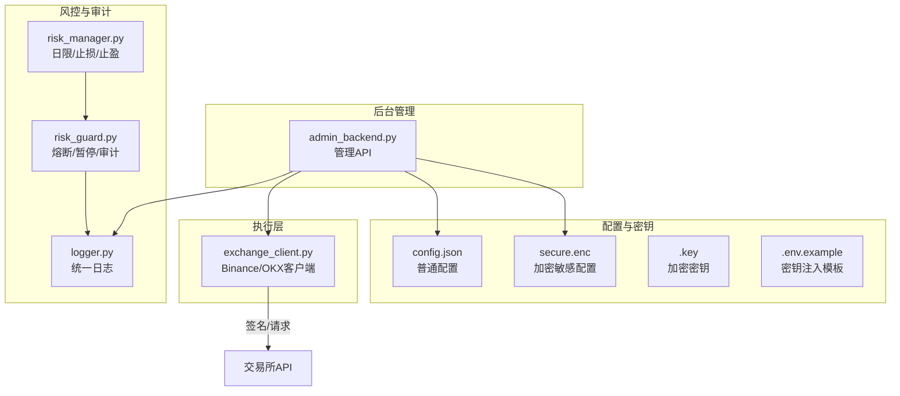
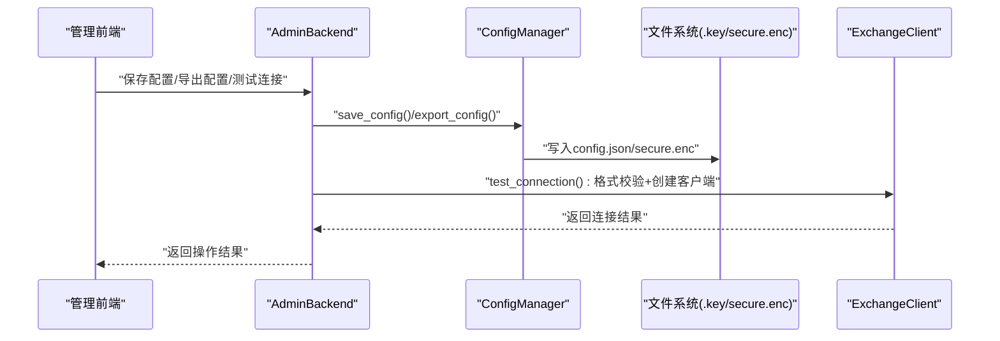
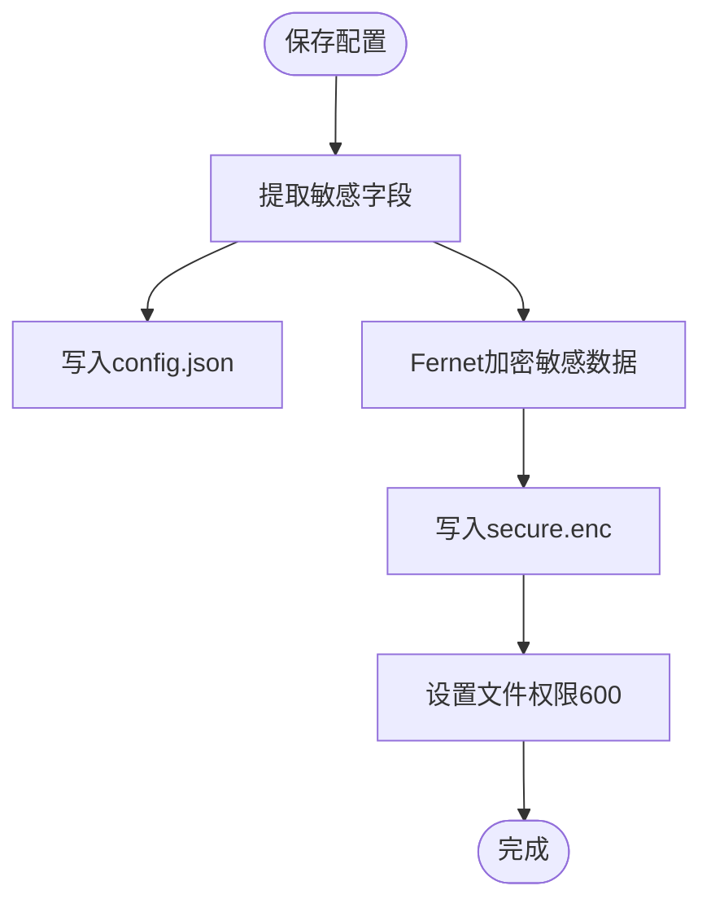
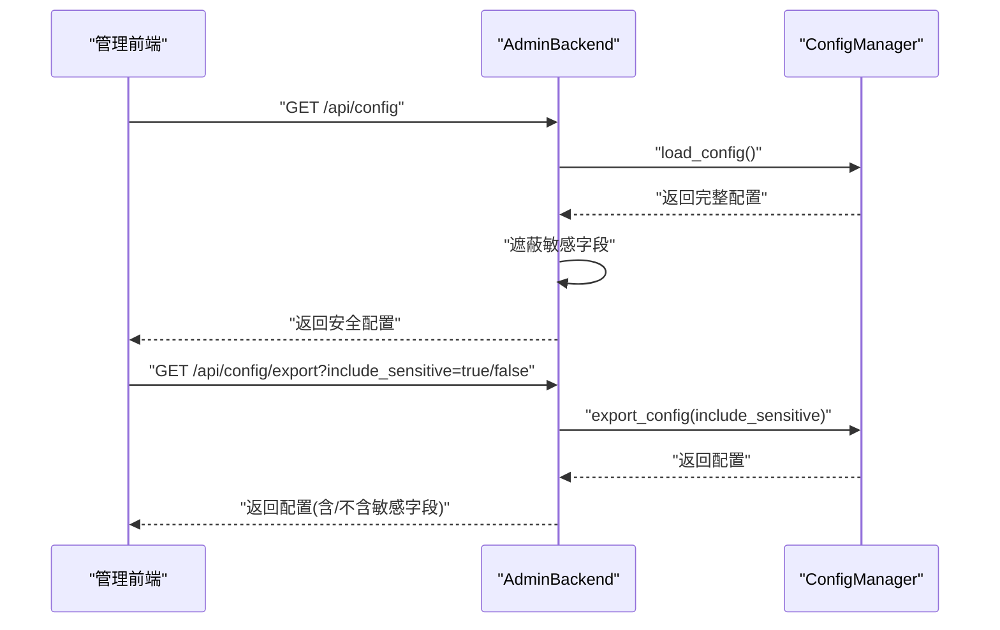
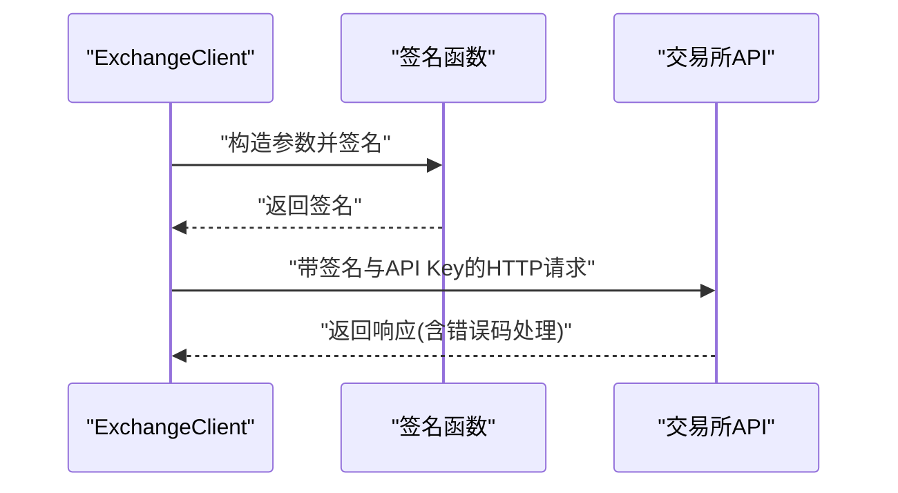
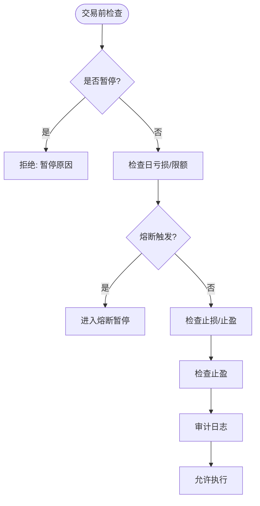
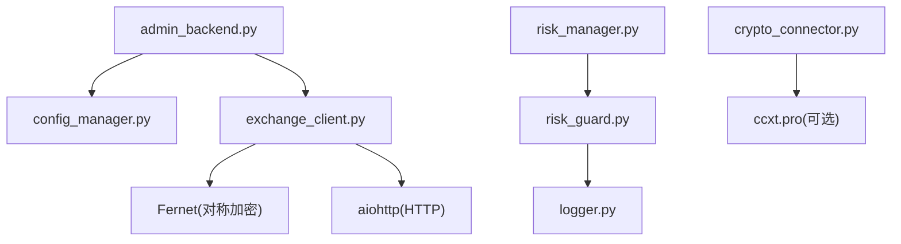

# API认证与安全

<cite>
**本文引用的文件**
- [src/utils/config_manager.py](file://src/utils/config_manager.py)
- [configs/config.json](file://configs/config.json)
- [configs/aetherlife.json](file://configs/aetherlife.json)
- [configs/.key](file://configs/.key)
- [.env.example](file://.env.example)
- [src/ui/admin_backend.py](file://src/ui/admin_backend.py)
- [src/execution/exchange_client.py](file://src/execution/exchange_client.py)
- [src/aetherlife/guard/risk_guard.py](file://src/aetherlife/guard/risk_guard.py)
- [src/utils/risk_manager.py](file://src/utils/risk_manager.py)
- [src/aetherlife/perception/crypto_connector.py](file://src/aetherlife/perception/crypto_connector.py)
- [src/utils/logger.py](file://src/utils/logger.py)
- [docs/ADMIN_GUIDE.md](file://docs/ADMIN_GUIDE.md)
</cite>

## 目录
1. [简介](#简介)
2. [项目结构](#项目结构)
3. [核心组件](#核心组件)
4. [架构总览](#架构总览)
5. [详细组件分析](#详细组件分析)
6. [依赖关系分析](#依赖关系分析)
7. [性能考量](#性能考量)
8. [故障排除指南](#故障排除指南)
9. [结论](#结论)
10. [附录](#附录)

## 简介
本文件面向量化交易系统的API认证与安全机制，聚焦以下主题：
- API密钥管理：存储、加密、导出安全选项
- 认证流程：密钥格式校验、连接测试、签名机制
- 访问控制策略：敏感信息遮蔽、导出白名单、文件权限
- 会话与令牌：当前实现以密钥+签名为主，无独立令牌
- 安全最佳实践：密钥轮换、最小权限、网络隔离
- 合规与审计：审计日志、熔断与暂停机制
- 安全审计与应急响应：检测方法与处置流程

## 项目结构
围绕认证与安全的关键文件分布如下：
- 配置与密钥
  - 配置文件：普通配置与加密密钥分离存储
  - 加密密钥文件：本地生成与权限保护
  - 环境变量模板：API密钥注入入口
- 后台管理与API
  - 管理API：配置保存、导出、连接测试
  - 交易所客户端：签名与请求封装
- 风控与审计
  - 风控守卫：熔断、暂停、审计日志
  - 风险管理：日限、止损止盈、追踪止损
  - 统一日志：统一输出与异常记录

**图表来源**
- [src/ui/admin_backend.py](file://src/ui/admin_backend.py#L29-L56)
- [src/utils/config_manager.py](file://src/utils/config_manager.py#L25-L26)
- [src/execution/exchange_client.py](file://src/execution/exchange_client.py#L128-L171)
- [src/aetherlife/guard/risk_guard.py](file://src/aetherlife/guard/risk_guard.py#L70-L84)
- [src/utils/risk_manager.py](file://src/utils/risk_manager.py#L129-L154)
- [src/utils/logger.py](file://src/utils/logger.py#L12-L28)

**章节来源**
- [src/utils/config_manager.py](file://src/utils/config_manager.py#L17-L46)
- [configs/config.json](file://configs/config.json#L1-L28)
- [configs/aetherlife.json](file://configs/aetherlife.json#L1-L17)
- [configs/.key](file://configs/.key#L1-L1)
- [.env.example](file://.env.example#L1-L17)
- [src/ui/admin_backend.py](file://src/ui/admin_backend.py#L29-L56)
- [src/execution/exchange_client.py](file://src/execution/exchange_client.py#L128-L171)
- [src/aetherlife/guard/risk_guard.py](file://src/aetherlife/guard/risk_guard.py#L70-L84)
- [src/utils/risk_manager.py](file://src/utils/risk_manager.py#L129-L154)
- [src/utils/logger.py](file://src/utils/logger.py#L12-L28)

## 核心组件
- 配置管理器
  - 分离存储：普通配置与敏感配置分别保存
  - 加密存储：Fernet对称加密，密钥文件权限600
  - 导出安全：可选择是否包含敏感字段
  - 校验：API密钥格式校验
- 后台管理API
  - 配置获取：隐藏敏感字段（部分遮蔽）
  - 导出：支持含/不含敏感信息两种模式
  - 连接测试：格式校验+实际连接测试占位
- 交易所客户端
  - 签名机制：HMAC-SHA256签名，请求头携带API Key
  - 请求封装：统一超时、错误处理
- 风控与审计
  - 熔断与暂停：日亏损阈值、冷却时间
  - 审计日志：内存与文件双通道
  - 风险管理：止损止盈、追踪止损、日限

**章节来源**
- [src/utils/config_manager.py](file://src/utils/config_manager.py#L48-L116)
- [src/ui/admin_backend.py](file://src/ui/admin_backend.py#L57-L74)
- [src/ui/admin_backend.py](file://src/ui/admin_backend.py#L137-L157)
- [src/ui/admin_backend.py](file://src/ui/admin_backend.py#L159-L209)
- [src/execution/exchange_client.py](file://src/execution/exchange_client.py#L128-L171)
- [src/aetherlife/guard/risk_guard.py](file://src/aetherlife/guard/risk_guard.py#L23-L68)
- [src/aetherlife/guard/risk_guard.py](file://src/aetherlife/guard/risk_guard.py#L70-L84)
- [src/utils/risk_manager.py](file://src/utils/risk_manager.py#L129-L154)

## 架构总览
下图展示从管理API到配置存储、再到交易所API的整体流程与安全边界。

**图表来源**
- [src/ui/admin_backend.py](file://src/ui/admin_backend.py#L81-L113)
- [src/ui/admin_backend.py](file://src/ui/admin_backend.py#L137-L157)
- [src/ui/admin_backend.py](file://src/ui/admin_backend.py#L159-L209)
- [src/utils/config_manager.py](file://src/utils/config_manager.py#L48-L80)
- [src/execution/exchange_client.py](file://src/execution/exchange_client.py#L403-L411)

## 详细组件分析

### 配置与密钥管理
- 存储与权限
  - 普通配置：config.json
  - 加密敏感配置：secure.enc
  - 加密密钥：.key（文件权限600）
- 加密算法
  - Fernet对称加密，密钥自动生成并安全存放
- 导出安全
  - 可选是否包含敏感字段（api_key/secret_key/passphrase）
- 管理API中的遮蔽
  - 获取配置时对敏感字段进行部分遮蔽显示

**图表来源**
- [src/utils/config_manager.py](file://src/utils/config_manager.py#L48-L80)

**章节来源**
- [src/utils/config_manager.py](file://src/utils/config_manager.py#L25-L80)
- [configs/.key](file://configs/.key#L1-L1)
- [src/ui/admin_backend.py](file://src/ui/admin_backend.py#L64-L70)
- [src/ui/admin_backend.py](file://src/ui/admin_backend.py#L137-L157)

### 后台管理API与敏感信息处理
- 配置获取
  - 遮蔽策略：仅显示部分字符，避免泄露
- 导出配置
  - include_sensitive参数决定是否包含敏感字段
- 连接测试
  - 先进行格式校验，再尝试建立客户端连接（占位）

**图表来源**
- [src/ui/admin_backend.py](file://src/ui/admin_backend.py#L57-L74)
- [src/ui/admin_backend.py](file://src/ui/admin_backend.py#L137-L157)
- [src/utils/config_manager.py](file://src/utils/config_manager.py#L181-L194)

**章节来源**
- [src/ui/admin_backend.py](file://src/ui/admin_backend.py#L57-L74)
- [src/ui/admin_backend.py](file://src/ui/admin_backend.py#L137-L157)
- [src/utils/config_manager.py](file://src/utils/config_manager.py#L181-L194)

### 交易所API认证与签名
- 签名流程
  - 生成查询字符串并HMAC-SHA256签名
  - 在请求头中携带API Key
- 请求封装
  - 统一超时、错误处理、状态码判断
- 客户端类型
  - BinanceClient：合约接口，支持签名请求
  - OKXClient：占位实现，后续扩展

**图表来源**
- [src/execution/exchange_client.py](file://src/execution/exchange_client.py#L128-L171)

**章节来源**
- [src/execution/exchange_client.py](file://src/execution/exchange_client.py#L128-L171)

### 风控与审计机制
- 熔断与暂停
  - 日亏损达到阈值触发熔断并进入冷却
  - 可手动设置暂停与原因
- 审计日志
  - 控制台输出与可选文件落盘
  - 异步回调扩展
- 风险管理
  - 止损止盈、追踪止损、日限与连败限制

**图表来源**
- [src/aetherlife/guard/risk_guard.py](file://src/aetherlife/guard/risk_guard.py#L48-L68)
- [src/aetherlife/guard/risk_guard.py](file://src/aetherlife/guard/risk_guard.py#L70-L84)
- [src/utils/risk_manager.py](file://src/utils/risk_manager.py#L129-L154)

**章节来源**
- [src/aetherlife/guard/risk_guard.py](file://src/aetherlife/guard/risk_guard.py#L23-L68)
- [src/aetherlife/guard/risk_guard.py](file://src/aetherlife/guard/risk_guard.py#L70-L84)
- [src/utils/risk_manager.py](file://src/utils/risk_manager.py#L129-L154)

### 会话与令牌机制
- 当前实现
  - 无独立会话/令牌；采用API Key+签名的直接认证
  - 管理API未实现鉴权与会话持久化
- 建议
  - 引入JWT或短期令牌，配合HTTPS与CORS策略
  - 会话绑定IP/UA白名单与滑动过期

**章节来源**
- [src/ui/admin_backend.py](file://src/ui/admin_backend.py#L29-L56)
- [src/execution/exchange_client.py](file://src/execution/exchange_client.py#L128-L171)

## 依赖关系分析
- 组件耦合
  - AdminBackend依赖ConfigManager进行配置存取
  - ExchangeClient依赖签名机制与HTTP会话
  - RiskGuard与RiskManager共同构成风控闭环
- 外部依赖
  - Fernet用于对称加密
  - aiohttp用于异步HTTP请求
  - ccxt.pro用于WebSocket行情（可选）

**图表来源**
- [src/ui/admin_backend.py](file://src/ui/admin_backend.py#L16-L17)
- [src/utils/config_manager.py](file://src/utils/config_manager.py#L11)
- [src/execution/exchange_client.py](file://src/execution/exchange_client.py#L6-L14)
- [src/aetherlife/perception/crypto_connector.py](file://src/aetherlife/perception/crypto_connector.py#L11-L16)

**章节来源**
- [src/ui/admin_backend.py](file://src/ui/admin_backend.py#L16-L17)
- [src/utils/config_manager.py](file://src/utils/config_manager.py#L11)
- [src/execution/exchange_client.py](file://src/execution/exchange_client.py#L6-L14)
- [src/aetherlife/perception/crypto_connector.py](file://src/aetherlife/perception/crypto_connector.py#L11-L16)

## 性能考量
- 异步I/O
  - 使用aiohttp进行HTTP请求，降低阻塞
- 超时控制
  - 统一请求超时配置，避免长时间挂起
- 加密成本
  - Fernet加解密在本地进行，对性能影响有限
- WebSocket
  - 行情订阅采用CCXT Pro，具备自动重连能力

**章节来源**
- [src/execution/exchange_client.py](file://src/execution/exchange_client.py#L16-L17)
- [src/aetherlife/perception/crypto_connector.py](file://src/aetherlife/perception/crypto_connector.py#L11-L16)

## 故障排除指南
- 配置加载失败
  - 检查config.json与secure.enc是否存在
  - 确认.key文件权限为600且可读
- 加密解密异常
  - 核对密钥一致性与文件完整性
- 管理API错误
  - 查看返回的错误信息，确认必填字段
- 交易所连接失败
  - 校验API Key格式与网络连通性
  - 检查测试网/主网配置
- 审计日志问题
  - 确认审计日志路径可写
  - 检查回调函数异常

**章节来源**
- [src/utils/config_manager.py](file://src/utils/config_manager.py#L82-L116)
- [src/ui/admin_backend.py](file://src/ui/admin_backend.py#L159-L209)
- [src/aetherlife/guard/risk_guard.py](file://src/aetherlife/guard/risk_guard.py#L70-L84)

## 结论
本系统在本地实现了API密钥的加密存储与导出安全控制，并通过签名机制对接交易所API。管理API提供了配置保存、导出与连接测试能力，同时在UI层面进行了敏感信息遮蔽。建议在生产环境中进一步引入HTTPS、令牌机制与访问控制，完善会话管理与审计留痕，以满足更高安全等级与合规要求。

## 附录

### 认证配置示例
- 环境变量模板
  - 参考示例文件填写各交易所API Key/Secret/Passphrase
- 配置文件位置
  - 普通配置：config.json
  - 加密敏感配置：secure.enc
  - 加密密钥：.key（权限600）

**章节来源**
- [.env.example](file://.env.example#L1-L17)
- [docs/ADMIN_GUIDE.md](file://docs/ADMIN_GUIDE.md#L153-L174)

### 安全最佳实践
- 密钥管理
  - 不共享.key文件
  - 定期轮换API密钥
  - 仅授予必要权限（禁止提币）
- 配置与导出
  - 导出时默认不包含敏感信息
  - 重要配置定期备份
- 网络与部署
  - 优先使用HTTPS
  - 限制管理API访问来源
  - 生产环境禁用调试输出

**章节来源**
- [docs/ADMIN_GUIDE.md](file://docs/ADMIN_GUIDE.md#L161-L181)

### 常见安全威胁与防护
- 威胁类型
  - 密钥泄露、中间人攻击、未授权访问
- 防护措施
  - HTTPS/TLS、最小权限、密钥轮换、文件权限控制
  - 管理API鉴权与速率限制

**章节来源**
- [src/utils/config_manager.py](file://src/utils/config_manager.py#L43-L44)
- [src/ui/admin_backend.py](file://src/ui/admin_backend.py#L29-L56)

### 合规要求说明
- 审计日志
  - 启用并保留审计日志文件
  - 审计事件包含时间戳与负载
- 熔断与暂停
  - 通过熔断机制限制潜在损失
  - 人工干预与暂停机制确保可控

**章节来源**
- [configs/aetherlife.json](file://configs/aetherlife.json#L7-L10)
- [src/aetherlife/guard/risk_guard.py](file://src/aetherlife/guard/risk_guard.py#L70-L84)
- [src/utils/risk_manager.py](file://src/utils/risk_manager.py#L129-L154)

### API安全审计指南
- 审计清单
  - 配置文件完整性与权限
  - 密钥文件存在性与权限
  - 导出配置是否脱敏
  - 管理API访问日志
  - 交易所连接测试结果
- 工具建议
  - 文件权限检查工具
  - 日志分析与告警

**章节来源**
- [src/ui/admin_backend.py](file://src/ui/admin_backend.py#L137-L157)
- [src/execution/exchange_client.py](file://src/execution/exchange_client.py#L195-L209)

### 漏洞检测方法
- 代码扫描
  - 静态分析敏感信息硬编码
  - 依赖库版本与CVE检查
- 渗透测试
  - 管理API未授权访问测试
  - 配置导出敏感信息泄露测试
  - 交易所API签名绕过测试

**章节来源**
- [src/utils/config_manager.py](file://src/utils/config_manager.py#L56-L60)
- [src/ui/admin_backend.py](file://src/ui/admin_backend.py#L159-L209)

### 应急响应流程
- 发生密钥泄露
  - 立即轮换API密钥
  - 撤销旧密钥权限
  - 检查最近导出配置
- 系统异常
  - 检查日志与审计文件
  - 回滚至最近安全备份
  - 评估影响范围并上报

**章节来源**
- [src/utils/logger.py](file://src/utils/logger.py#L31-L34)
- [src/aetherlife/guard/risk_guard.py](file://src/aetherlife/guard/risk_guard.py#L70-L84)