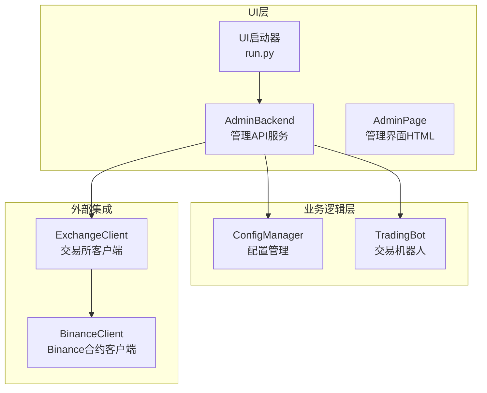
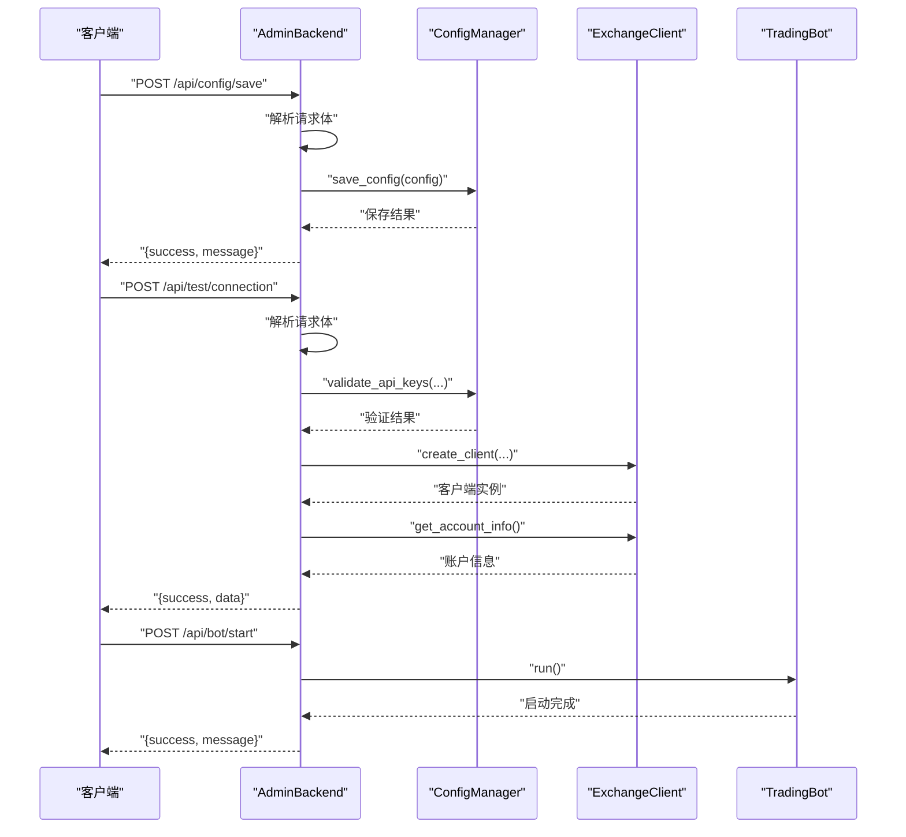
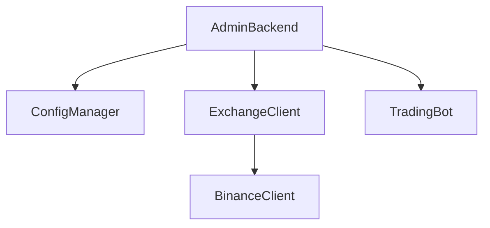

# RESTful API接口

<cite>
**本文档引用的文件**
- [admin_backend.py](file://src/ui/admin_backend.py)
- [admin_page.html](file://src/ui/admin_page.html)
- [run.py](file://src/ui/run.py)
- [config_manager.py](file://src/utils/config_manager.py)
- [exchange_client.py](file://src/execution/exchange_client.py)
- [config.json](file://configs/config.json)
</cite>

## 目录
1. [简介](#简介)
2. [项目结构](#项目结构)
3. [核心组件](#核心组件)
4. [架构总览](#架构总览)
5. [详细接口文档](#详细接口文档)
6. [依赖关系分析](#依赖关系分析)
7. [性能考虑](#性能考虑)
8. [故障排除指南](#故障排除指南)
9. [结论](#结论)

## 简介
本文件为量化交易系统的RESTful API接口参考文档，覆盖后台管理API服务的所有HTTP接口，包括配置管理、API测试、交易所信息、策略信息以及Bot控制等接口。文档详细说明每个接口的HTTP方法、URL路径、请求参数、响应格式、状态码含义、错误处理机制，并提供请求示例、参数验证规则、权限控制要求及最佳实践。

## 项目结构
系统采用分层架构：
- UI层：提供Web管理界面与API服务
- 业务逻辑层：配置管理、策略、风控、执行
- 外部集成：交易所API客户端

**图表来源**
- [admin_backend.py](file://src/ui/admin_backend.py#L20-L56)
- [run.py](file://src/ui/run.py#L34-L72)
- [config_manager.py](file://src/utils/config_manager.py#L14-L30)
- [exchange_client.py](file://src/execution/exchange_client.py#L20-L85)

**章节来源**
- [admin_backend.py](file://src/ui/admin_backend.py#L20-L56)
- [run.py](file://src/ui/run.py#L34-L72)

## 核心组件
- AdminBackend：提供所有REST API接口，负责配置管理、API测试、交易所信息查询、策略信息查询、Bot控制等。
- ConfigManager：负责配置文件的读取、保存、加密存储、默认配置生成与导出。
- ExchangeClient/BinanceClient：封装交易所API访问，提供行情、账户、下单等接口。
- TradingBot：交易机器人核心，提供启动、停止、状态查询等能力。

**章节来源**
- [admin_backend.py](file://src/ui/admin_backend.py#L20-L56)
- [config_manager.py](file://src/utils/config_manager.py#L14-L30)
- [exchange_client.py](file://src/execution/exchange_client.py#L20-L85)
- [trading_bot.py](file://src/trading_bot.py#L27-L63)

## 架构总览
管理API服务通过aiohttp框架提供REST接口，统一返回JSON格式响应，包含success字段表示操作结果，data字段承载业务数据，error字段承载错误信息。部分接口需要有效的API密钥进行身份验证。

**图表来源**
- [admin_backend.py](file://src/ui/admin_backend.py#L81-L112)
- [admin_backend.py](file://src/ui/admin_backend.py#L159-L209)
- [admin_backend.py](file://src/ui/admin_backend.py#L323-L349)

## 详细接口文档

### 配置管理接口

#### GET /api/config
- 功能：获取当前配置，敏感信息会被隐藏。
- 请求参数：无
- 成功响应字段：
  - success: true
  - data: 配置对象（敏感字段被遮蔽）
- 失败响应字段：
  - success: false
  - error: 错误描述
- 状态码：200 成功；500 服务器内部错误
- 权限控制：无
- 参数验证：无
- 示例请求：curl -X GET http://localhost:8080/api/config
- 示例响应：{"success":true,"data":{"exchange":"binance","testnet":true,...}}

**章节来源**
- [admin_backend.py](file://src/ui/admin_backend.py#L57-L79)

#### POST /api/config/save
- 功能：保存配置。
- 请求头：Content-Type: application/json
- 请求体字段：
  - config: 配置对象（必填）
    - exchange: 交易所名称（必填）
    - testnet: 是否使用测试网（可选）
    - api_key: API Key（可选）
    - secret_key: Secret Key（可选）
    - 其他策略、风控、AI增强等配置
- 成功响应字段：
  - success: true
  - message: 保存成功消息
- 失败响应字段：
  - success: false
  - error: 错误描述
- 状态码：200 成功；400 客户端错误；500 服务器内部错误
- 权限控制：无
- 参数验证：
  - 必须包含exchange字段
  - 敏感字段会单独加密保存
- 示例请求：curl -X POST http://localhost:8080/api/config/save -H "Content-Type: application/json" -d '{"config":{"exchange":"binance","testnet":true,...}}'

**章节来源**
- [admin_backend.py](file://src/ui/admin_backend.py#L81-L112)
- [config_manager.py](file://src/utils/config_manager.py#L48-L72)

#### POST /api/config/reset
- 功能：重置为默认配置。
- 请求参数：无
- 成功响应字段：
  - success: true
  - message: 重置成功消息
  - data: 默认配置对象
- 失败响应字段：
  - success: false
  - error: 错误描述
- 状态码：200 成功；500 服务器内部错误
- 权限控制：无
- 参数验证：无
- 示例请求：curl -X POST http://localhost:8080/api/config/reset

**章节来源**
- [admin_backend.py](file://src/ui/admin_backend.py#L114-L135)

#### GET /api/config/export
- 功能：导出配置，可选择是否包含敏感信息。
- 查询参数：
  - include_sensitive: 是否包含敏感信息（可选，默认false）
- 成功响应字段：
  - success: true
  - data: 配置对象
- 失败响应字段：
  - success: false
  - error: 错误描述
- 状态码：200 成功；404 未找到；500 服务器内部错误
- 权限控制：无
- 参数验证：无
- 示例请求：curl -X GET "http://localhost:8080/api/config/export?include_sensitive=true"

**章节来源**
- [admin_backend.py](file://src/ui/admin_backend.py#L137-L157)
- [config_manager.py](file://src/utils/config_manager.py#L181-L193)

### API测试接口

#### POST /api/test/connection
- 功能：测试交易所连接，需要API密钥。
- 请求头：Content-Type: application/json
- 请求体字段：
  - exchange: 交易所名称（可选，默认binance）
  - api_key: API Key（必填）
  - secret_key: Secret Key（必填）
  - testnet: 是否使用测试网（可选，默认true）
- 成功响应字段：
  - success: true
  - message: 连接成功消息
  - data:
    - exchange: 交易所名称
    - testnet: 测试网状态
    - balance: 账户总余额
- 失败响应字段：
  - success: false
  - error: 错误描述
- 状态码：200 成功；400 客户端错误；500 服务器内部错误
- 权限控制：无
- 参数验证：
  - api_key和secret_key不能为空
  - 长度需满足最小长度要求
- 示例请求：curl -X POST http://localhost:8080/api/test/connection -H "Content-Type: application/json" -d '{"exchange":"binance","api_key":"your_api_key","secret_key":"your_secret_key","testnet":true}'
- 示例响应：{"success":true,"message":"连接成功！","data":{"exchange":"binance","testnet":true,"balance":"10000.00"}}

**章节来源**
- [admin_backend.py](file://src/ui/admin_backend.py#L159-L209)
- [config_manager.py](file://src/utils/config_manager.py#L146-L160)

#### POST /api/test/api
- 功能：测试API可用性（公开接口，无需密钥）。
- 请求头：Content-Type: application/json
- 请求体字段：
  - exchange: 交易所名称（可选，默认binance）
  - testnet: 是否使用测试网（可选，默认true）
- 成功响应字段：
  - success: true
  - message: API正常消息
  - data:
    - exchange: 交易所名称
    - testnet: 测试网状态
    - price: BTCUSDT最新价格
- 失败响应字段：
  - success: false
  - error: 错误描述
- 状态码：200 成功；500 服务器内部错误
- 权限控制：无
- 参数验证：无
- 示例请求：curl -X POST http://localhost:8080/api/test/api -H "Content-Type: application/json" -d '{"exchange":"binance","testnet":true}'

**章节来源**
- [admin_backend.py](file://src/ui/admin_backend.py#L211-L244)

### 交易所信息接口

#### GET /api/exchanges
- 功能：获取支持的交易所列表。
- 请求参数：无
- 成功响应字段：
  - success: true
  - data: 交易所数组
    - id: 交易所标识
    - name: 交易所名称
    - support_testnet: 是否支持测试网
    - features: 支持的功能列表
- 失败响应字段：
  - success: false
- 状态码：200 成功
- 权限控制：无
- 参数验证：无
- 示例请求：curl -X GET http://localhost:8080/api/exchanges

**章节来源**
- [admin_backend.py](file://src/ui/admin_backend.py#L246-L266)

#### GET /api/symbols
- 功能：获取交易对列表。
- 请求参数：
  - exchange: 交易所名称（可选，默认binance）
- 成功响应字段：
  - success: true
  - data: 交易对数组
- 失败响应字段：
  - success: false
- 状态码：200 成功
- 权限控制：无
- 参数验证：无
- 示例请求：curl -X GET "http://localhost:8080/api/symbols?exchange=binance"

**章节来源**
- [admin_backend.py](file://src/ui/admin_backend.py#L268-L281)

### 策略信息接口

#### GET /api/strategies
- 功能：获取可用策略列表。
- 请求参数：无
- 成功响应字段：
  - success: true
  - data: 策略数组
    - id: 策略标识
    - name: 策略名称
    - description: 策略描述
    - params: 策略参数列表
- 失败响应字段：
  - success: false
- 状态码：200 成功
- 权限控制：无
- 参数验证：无
- 示例请求：curl -X GET http://localhost:8080/api/strategies

**章节来源**
- [admin_backend.py](file://src/ui/admin_backend.py#L283-L321)

### Bot控制接口

#### POST /api/bot/start
- 功能：启动交易机器人。
- 请求参数：无
- 成功响应字段：
  - success: true
  - message: 启动成功消息
- 失败响应字段：
  - success: false
  - error: 错误描述
- 状态码：200 成功；400 客户端错误；500 服务器内部错误
- 权限控制：无
- 参数验证：Bot实例必须存在且未在运行
- 示例请求：curl -X POST http://localhost:8080/api/bot/start

**章节来源**
- [admin_backend.py](file://src/ui/admin_backend.py#L323-L349)

#### POST /api/bot/stop
- 功能：停止交易机器人。
- 请求参数：无
- 成功响应字段：
  - success: true
  - message: 停止成功消息
- 失败响应字段：
  - success: false
  - error: 错误描述
- 状态码：200 成功；400 客户端错误；500 服务器内部错误
- 权限控制：无
- 参数验证：Bot实例必须存在且正在运行
- 示例请求：curl -X POST http://localhost:8080/api/bot/stop

**章节来源**
- [admin_backend.py](file://src/ui/admin_backend.py#L351-L376)

#### GET /api/bot/status
- 功能：获取Bot状态。
- 请求参数：无
- 成功响应字段：
  - success: true
  - data:
    - running: 是否在运行
    - exchange: 交易所名称
    - strategy: 策略名称
- 失败响应字段：
  - success: false
- 状态码：200 成功
- 权限控制：无
- 参数验证：无
- 示例请求：curl -X GET http://localhost:8080/api/bot/status

**章节来源**
- [admin_backend.py](file://src/ui/admin_backend.py#L378-L396)

### 管理界面接口
- GET /admin：返回管理界面HTML页面
- GET /：返回仪表盘页面（仅仪表盘模式）

**章节来源**
- [admin_backend.py](file://src/ui/admin_backend.py#L398-L401)
- [run.py](file://src/ui/run.py#L56-L61)

## 依赖关系分析

**图表来源**
- [admin_backend.py](file://src/ui/admin_backend.py#L16-L25)
- [exchange_client.py](file://src/execution/exchange_client.py#L20-L30)

### 关键依赖点
- 配置管理：ConfigManager负责配置的读取、保存、加密存储，支持默认配置与敏感信息分离。
- 交易所集成：ExchangeClient抽象了交易所API，BinanceClient实现了具体接口，支持测试网与正式网切换。
- Bot控制：AdminBackend直接依赖TradingBot实例，提供启动、停止、状态查询功能。

**章节来源**
- [config_manager.py](file://src/utils/config_manager.py#L48-L100)
- [exchange_client.py](file://src/execution/exchange_client.py#L87-L121)
- [trading_bot.py](file://src/trading_bot.py#L27-L63)

## 性能考虑
- 异步处理：所有API接口均使用异步实现，提高并发处理能力。
- 超时控制：交易所API请求设置了合理的超时时间，避免长时间阻塞。
- 缓存策略：交易所客户端会缓存交易规则信息，减少重复请求。
- 资源管理：正确关闭HTTP会话，避免资源泄漏。

## 故障排除指南
- API密钥验证失败：检查API Key和Secret Key格式，确保长度满足要求。
- 连接测试失败：确认网络连通性，检查测试网/正式网配置，验证API权限。
- 配置保存失败：检查配置文件写入权限，确认磁盘空间充足。
- Bot启动失败：检查Bot实例初始化状态，确认配置正确无误。
- 响应格式异常：确保请求头Content-Type为application/json。

**章节来源**
- [admin_backend.py](file://src/ui/admin_backend.py#L168-L174)
- [config_manager.py](file://src/utils/config_manager.py#L146-L160)

## 结论
本RESTful API接口提供了完整的量化交易系统管理能力，涵盖配置管理、API测试、交易所信息、策略信息与Bot控制等核心功能。接口设计遵循统一的JSON响应格式，具备良好的错误处理机制与状态码约定。建议在生产环境中结合HTTPS与认证机制进一步提升安全性，并根据实际需求扩展更多监控与告警接口。