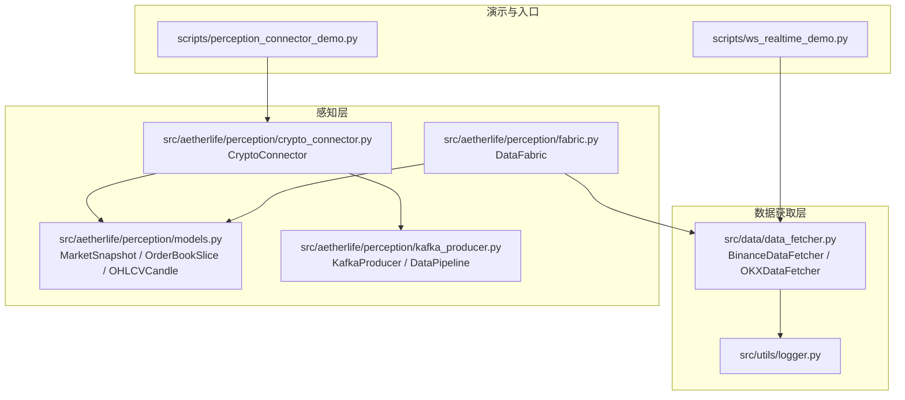
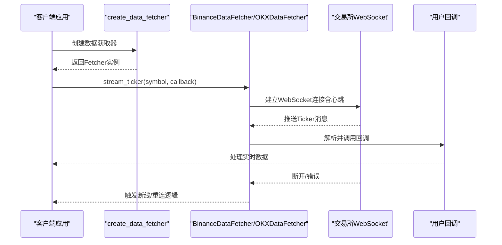
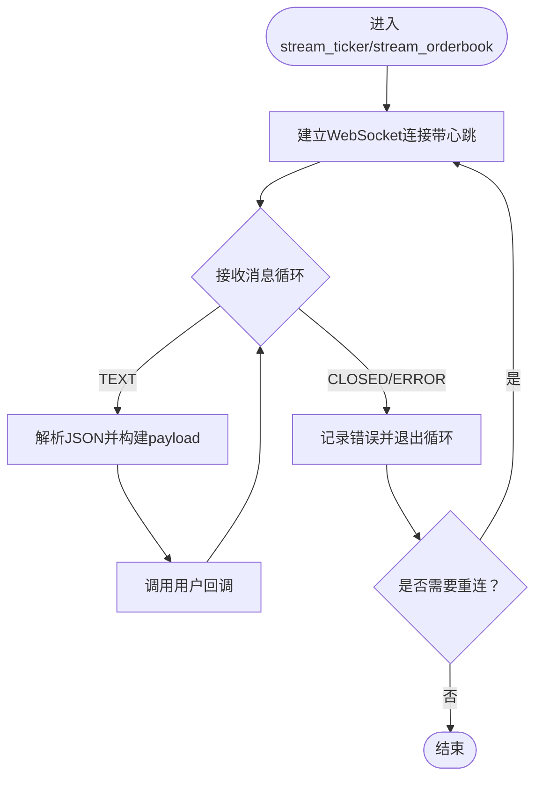
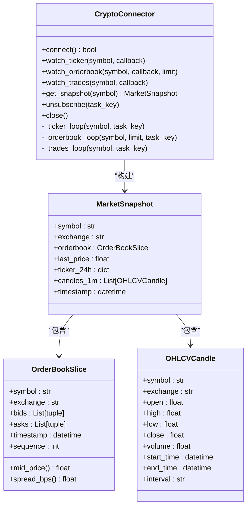
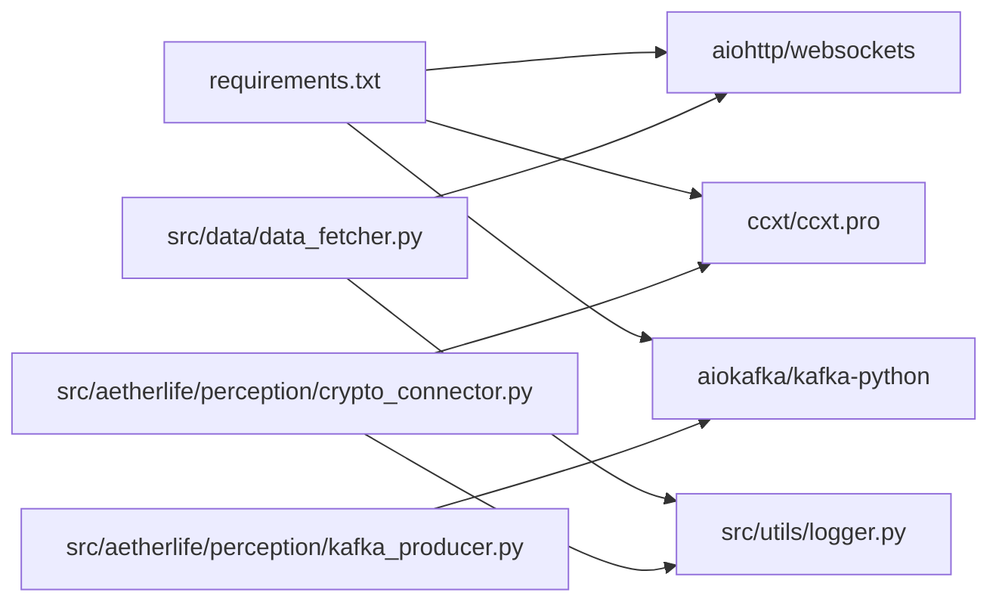

# WebSocket实时数据接口

<cite>
**本文档引用的文件**
- [scripts/ws_realtime_demo.py](file://scripts/ws_realtime_demo.py)
- [src/data/data_fetcher.py](file://src/data/data_fetcher.py)
- [src/aetherlife/perception/crypto_connector.py](file://src/aetherlife/perception/crypto_connector.py)
- [src/aetherlife/perception/models.py](file://src/aetherlife/perception/models.py)
- [src/aetherlife/perception/fabric.py](file://src/aetherlife/perception/fabric.py)
- [src/aetherlife/perception/kafka_producer.py](file://src/aetherlife/perception/kafka_producer.py)
- [src/utils/logger.py](file://src/utils/logger.py)
- [scripts/perception_connector_demo.py](file://scripts/perception_connector_demo.py)
- [configs/config.json](file://configs/config.json)
- [requirements.txt](file://requirements.txt)
</cite>

## 目录
1. [简介](#简介)
2. [项目结构](#项目结构)
3. [核心组件](#核心组件)
4. [架构总览](#架构总览)
5. [详细组件分析](#详细组件分析)
6. [依赖关系分析](#依赖关系分析)
7. [性能考虑](#性能考虑)
8. [故障排除指南](#故障排除指南)
9. [结论](#结论)
10. [附录](#附录)

## 简介
本文件为量化交易系统的WebSocket实时数据接口参考文档，覆盖以下主题：
- WebSocket连接建立流程与心跳机制
- 断线重连策略与错误处理
- 实时数据推送格式（Ticker、OrderBook、Trades）
- 订阅管理与消息路由规则
- 连接示例代码、消息格式定义、事件回调与错误处理
- 实时数据消费最佳实践、性能优化建议与故障排除

## 项目结构
该系统围绕“数据获取器”和“感知层连接器”两条主线提供WebSocket实时数据能力，并支持统一的数据模型与Kafka数据管道。

**图表来源**
- [scripts/ws_realtime_demo.py](file://scripts/ws_realtime_demo.py#L1-L62)
- [src/data/data_fetcher.py](file://src/data/data_fetcher.py#L1-L434)
- [src/aetherlife/perception/crypto_connector.py](file://src/aetherlife/perception/crypto_connector.py#L1-L369)
- [src/aetherlife/perception/models.py](file://src/aetherlife/perception/models.py#L1-L64)
- [src/aetherlife/perception/fabric.py](file://src/aetherlife/perception/fabric.py#L1-L88)
- [src/aetherlife/perception/kafka_producer.py](file://src/aetherlife/perception/kafka_producer.py#L1-L286)
- [src/utils/logger.py](file://src/utils/logger.py#L1-L34)

**章节来源**
- [scripts/ws_realtime_demo.py](file://scripts/ws_realtime_demo.py#L1-L62)
- [src/data/data_fetcher.py](file://src/data/data_fetcher.py#L1-L434)
- [src/aetherlife/perception/crypto_connector.py](file://src/aetherlife/perception/crypto_connector.py#L1-L369)
- [src/aetherlife/perception/models.py](file://src/aetherlife/perception/models.py#L1-L64)
- [src/aetherlife/perception/fabric.py](file://src/aetherlife/perception/fabric.py#L1-L88)
- [src/aetherlife/perception/kafka_producer.py](file://src/aetherlife/perception/kafka_producer.py#L1-L286)
- [src/utils/logger.py](file://src/utils/logger.py#L1-L34)

## 核心组件
- 数据获取器（DataFetcher）：封装Binance与OKX的WebSocket订阅与HTTP拉取接口，提供统一的实时/历史数据访问。
- CryptoConnector：基于ccxt.pro的统一连接器，支持多交易所WebSocket实时订阅（Ticker、OrderBook、Trades），内置自动重连与回调分发。
- 数据模型（models）：统一的OrderBookSlice、OHLCVCandle、MarketSnapshot，便于跨组件数据交换。
- DataFabric：面向上层的统一快照接口，聚合订单簿、Ticker与K线，支持未来从WebSocket缓存读取。
- KafkaProducer/DataPipeline：将实时数据标准化后写入Kafka/Redpanda，支持批量发送与去重。

**章节来源**
- [src/data/data_fetcher.py](file://src/data/data_fetcher.py#L17-L71)
- [src/aetherlife/perception/crypto_connector.py](file://src/aetherlife/perception/crypto_connector.py#L23-L369)
- [src/aetherlife/perception/models.py](file://src/aetherlife/perception/models.py#L15-L64)
- [src/aetherlife/perception/fabric.py](file://src/aetherlife/perception/fabric.py#L13-L88)
- [src/aetherlife/perception/kafka_producer.py](file://src/aetherlife/perception/kafka_producer.py#L26-L286)

## 架构总览
WebSocket实时数据接口采用“工厂创建 + 事件驱动回调”的模式，支持两类接入方式：
- 直接使用DataFetcher（aiohttp）：按交易所分别实现订阅逻辑，内置心跳与断线检测。
- 使用CryptoConnector（ccxt.pro）：统一多交易所WebSocket，自动重连与回调分发。

**图表来源**
- [src/data/data_fetcher.py](file://src/data/data_fetcher.py#L188-L234)
- [src/data/data_fetcher.py](file://src/data/data_fetcher.py#L327-L359)

**章节来源**
- [src/data/data_fetcher.py](file://src/data/data_fetcher.py#L188-L234)
- [src/data/data_fetcher.py](file://src/data/data_fetcher.py#L327-L359)

## 详细组件分析

### 组件A：DataFetcher（aiohttp WebSocket）
- 连接建立：根据交易所选择WS URL，使用aiohttp.ws_connect建立连接，并设置heartbeat参数以启用心跳。
- 心跳机制：heartbeat=20表示每20秒进行一次心跳检查，若连接异常将触发CLOSED/ERROR事件。
- 断线重连：在消息循环中捕获CLOSED/ERROR后退出当前循环，由上层逻辑决定是否重建连接。
- 订阅管理：通过URL路径或订阅指令（OKX）实现Ticker/OrderBook订阅。
- 消息路由：解析文本消息为JSON，构建标准化payload后调用回调函数。

**图表来源**
- [src/data/data_fetcher.py](file://src/data/data_fetcher.py#L188-L234)
- [src/data/data_fetcher.py](file://src/data/data_fetcher.py#L327-L359)

**章节来源**
- [src/data/data_fetcher.py](file://src/data/data_fetcher.py#L188-L234)
- [src/data/data_fetcher.py](file://src/data/data_fetcher.py#L327-L359)

### 组件B：CryptoConnector（ccxt.pro WebSocket）
- 连接建立：动态加载ccxtpro交易所类，初始化markets，支持测试网配置。
- 订阅管理：watch_ticker/watch_orderbook/watch_trades分别注册回调并创建独立监听任务。
- 心跳与断线：内部使用ccxt.pro的WebSocket实现，异常时自动sleep后重连。
- 回调分发：同一symbol的多个回调均被调用，支持协程与同步回调混用。
- 快照获取：get_snapshot并行获取Ticker与OrderBook，构建MarketSnapshot。

**图表来源**
- [src/aetherlife/perception/crypto_connector.py](file://src/aetherlife/perception/crypto_connector.py#L23-L369)
- [src/aetherlife/perception/models.py](file://src/aetherlife/perception/models.py#L15-L64)

**章节来源**
- [src/aetherlife/perception/crypto_connector.py](file://src/aetherlife/perception/crypto_connector.py#L23-L369)
- [src/aetherlife/perception/models.py](file://src/aetherlife/perception/models.py#L15-L64)

### 组件C：DataFabric（统一快照）
- 目标：为上层提供统一的MarketSnapshot接口，当前阶段通过DataFetcher并行拉取实现。
- 优化方向：未来可直接从WebSocket缓存读取，减少轮询成本。

**章节来源**
- [src/aetherlife/perception/fabric.py](file://src/aetherlife/perception/fabric.py#L13-L88)

### 组件D：KafkaProducer/DataPipeline（消息路由）
- 主题定义：market_data_tick、market_data_orderbook、market_data_trades、market_data_snapshot。
- 序列化：统一JSON序列化，时间戳转字符串。
- 去重：OrderBook按nonce去重，Trades按唯一ID去重。
- 批量发送：通过linger_ms与acks配置提升吞吐。

**章节来源**
- [src/aetherlife/perception/kafka_producer.py](file://src/aetherlife/perception/kafka_producer.py#L26-L286)

## 依赖关系分析
- 交易所WebSocket：Binance（bookTicker/depth）、OKX（tickers/books5/books）。
- 第三方库：aiohttp（WebSocket）、ccxt/ccxt.pro（统一接口）、aiokafka（Kafka）。
- 日志：统一logger，便于问题定位与监控接入。

**图表来源**
- [requirements.txt](file://requirements.txt#L1-L92)
- [src/data/data_fetcher.py](file://src/data/data_fetcher.py#L1-L434)
- [src/aetherlife/perception/crypto_connector.py](file://src/aetherlife/perception/crypto_connector.py#L1-L369)
- [src/aetherlife/perception/kafka_producer.py](file://src/aetherlife/perception/kafka_producer.py#L1-L286)
- [src/utils/logger.py](file://src/utils/logger.py#L1-L34)

**章节来源**
- [requirements.txt](file://requirements.txt#L1-L92)
- [src/data/data_fetcher.py](file://src/data/data_fetcher.py#L1-L434)
- [src/aetherlife/perception/crypto_connector.py](file://src/aetherlife/perception/crypto_connector.py#L1-L369)
- [src/aetherlife/perception/kafka_producer.py](file://src/aetherlife/perception/kafka_producer.py#L1-L286)
- [src/utils/logger.py](file://src/utils/logger.py#L1-L34)

## 性能考虑
- 心跳与超时：DataFetcher使用heartbeat参数维持连接活跃，避免中间设备误判空闲断开。
- 并行拉取：DataFabric通过asyncio.gather并行获取OrderBook/Ticker/K线，降低快照生成延迟。
- 批量发送：KafkaProducer配置linger_ms与acks=all，提升吞吐并保证可靠性。
- 去重与限流：OrderBook按nonce去重，Ticker/Trades按业务规则去重，避免重复处理。
- 资源释放：统一close逻辑，取消任务、关闭连接，防止资源泄漏。

[本节为通用性能建议，无需特定文件分析]

## 故障排除指南
- 连接失败
  - 检查网络与代理设置，确认WS URL可达。
  - 核对测试网/正式网配置（Binance测试网、Bybit测试网）。
- 心跳异常
  - aiohttp心跳参数需与交易所要求匹配；若频繁断开，适当增大heartbeat间隔。
- 回调异常
  - CryptoConnector对回调执行try/except保护，异常会被记录但不影响主循环。
- 重连策略
  - DataFetcher：在消息循环中检测CLOSED/ERROR后退出，由上层决定是否重建连接。
  - CryptoConnector：监听异常后sleep等待，若仍连接则自动重连。
- Kafka发送失败
  - 检查Kafka服务可用性与Topic权限；查看序列化与时间戳转换是否正确。

**章节来源**
- [src/data/data_fetcher.py](file://src/data/data_fetcher.py#L188-L234)
- [src/aetherlife/perception/crypto_connector.py](file://src/aetherlife/perception/crypto_connector.py#L146-L154)
- [src/aetherlife/perception/kafka_producer.py](file://src/aetherlife/perception/kafka_producer.py#L172-L205)

## 结论
本系统提供了两条WebSocket实时数据接入路径：aiohttp直连与ccxt.pro统一接口。前者适合轻量定制，后者适合多交易所统一管理。配合统一数据模型与Kafka数据管道，可满足从高频交易到流式分析的多样化需求。建议在生产环境中结合心跳、断线重连、回调异常处理与Kafka批量发送策略，持续优化稳定性与性能。

[本节为总结性内容，无需特定文件分析]

## 附录

### 连接示例代码
- 使用DataFetcher（aiohttp）
  - Binance Ticker订阅：参见 [stream_ticker](file://src/data/data_fetcher.py#L188-L212)
  - Binance OrderBook订阅：参见 [stream_orderbook](file://src/data/data_fetcher.py#L213-L234)
  - OKX Ticker订阅：参见 [stream_ticker](file://src/data/data_fetcher.py#L327-L359)
  - OKX OrderBook订阅：参见 [stream_orderbook](file://src/data/data_fetcher.py#L361-L396)
- 使用CryptoConnector（ccxt.pro）
  - 创建连接器：参见 [create_crypto_connector](file://src/aetherlife/perception/crypto_connector.py#L362-L369)
  - 订阅Ticker：参见 [watch_ticker](file://src/aetherlife/perception/crypto_connector.py#L87-L114)
  - 订阅OrderBook：参见 [watch_orderbook](file://src/aetherlife/perception/crypto_connector.py#L155-L183)
  - 订阅Trades：参见 [watch_trades](file://src/aetherlife/perception/crypto_connector.py#L216-L243)
- 演示脚本
  - 实时演示：参见 [ws_realtime_demo.py](file://scripts/ws_realtime_demo.py#L30-L58)
  - 感知层演示：参见 [perception_connector_demo.py](file://scripts/perception_connector_demo.py#L22-L76)

**章节来源**
- [src/data/data_fetcher.py](file://src/data/data_fetcher.py#L188-L234)
- [src/data/data_fetcher.py](file://src/data/data_fetcher.py#L327-L396)
- [src/aetherlife/perception/crypto_connector.py](file://src/aetherlife/perception/crypto_connector.py#L87-L114)
- [src/aetherlife/perception/crypto_connector.py](file://src/aetherlife/perception/crypto_connector.py#L155-L183)
- [src/aetherlife/perception/crypto_connector.py](file://src/aetherlife/perception/crypto_connector.py#L216-L243)
- [scripts/ws_realtime_demo.py](file://scripts/ws_realtime_demo.py#L30-L58)
- [scripts/perception_connector_demo.py](file://scripts/perception_connector_demo.py#L22-L76)

### 消息格式定义
- Ticker（Binance）
  - 字段：symbol、bid_price、bid_qty、ask_price、ask_qty、update_id
  - 参考： [Binance stream_ticker](file://src/data/data_fetcher.py#L196-L209)
- Ticker（OKX）
  - 字段：symbol、last_price、bid_price、ask_price、volume、timestamp
  - 参考： [OKX stream_ticker](file://src/data/data_fetcher.py#L340-L357)
- OrderBook（Binance）
  - 字段：symbol、event_time、bids、asks（按depth截断）
  - 参考： [Binance stream_orderbook](file://src/data/data_fetcher.py#L221-L233)
- OrderBook（OKX）
  - 字段：symbol、timestamp、bids、asks（按depth截断）
  - 参考： [OKX stream_orderbook](file://src/data/data_fetcher.py#L368-L394)
- 订单簿切片（统一模型）
  - 字段：symbol、exchange、bids、asks、timestamp、sequence
  - 方法：mid_price、spread_bps
  - 参考： [OrderBookSlice](file://src/aetherlife/perception/models.py#L15-L37)
- 市场快照（统一模型）
  - 字段：symbol、exchange、orderbook、last_price、ticker_24h、candles_1m、timestamp
  - 参考： [MarketSnapshot](file://src/aetherlife/perception/models.py#L54-L64)

**章节来源**
- [src/data/data_fetcher.py](file://src/data/data_fetcher.py#L188-L234)
- [src/data/data_fetcher.py](file://src/data/data_fetcher.py#L327-L396)
- [src/aetherlife/perception/models.py](file://src/aetherlife/perception/models.py#L15-L64)

### 事件处理与回调
- 回调注册
  - DataFetcher：在stream_*方法中传入回调，消息到达后直接调用。
  - CryptoConnector：watch_*方法注册回调，内部循环中逐一调用。
- 回调规范
  - 支持协程与同步回调混用，内部自动判断并await。
  - 异常被捕获并记录，不中断主循环。
- 取消订阅
  - CryptoConnector：unsubscribe(task_key)取消对应任务并清理回调。
  - DataFetcher：当前实现为一次性订阅，断线后需重新建立连接。

**章节来源**
- [src/data/data_fetcher.py](file://src/data/data_fetcher.py#L188-L234)
- [src/aetherlife/perception/crypto_connector.py](file://src/aetherlife/perception/crypto_connector.py#L87-L114)
- [src/aetherlife/perception/crypto_connector.py](file://src/aetherlife/perception/crypto_connector.py#L155-L183)
- [src/aetherlife/perception/crypto_connector.py](file://src/aetherlife/perception/crypto_connector.py#L216-L243)
- [src/aetherlife/perception/crypto_connector.py](file://src/aetherlife/perception/crypto_connector.py#L330-L340)

### 错误处理与重连逻辑
- DataFetcher
  - 心跳：heartbeat=20；断线检测：CLOSED/ERROR事件。
  - 重连：在消息循环外层由上层决定是否重建连接。
- CryptoConnector
  - 心跳：依赖ccxt.pro内部实现。
  - 重连：异常后sleep等待，若仍连接则自动重连。
- KafkaProducer
  - 错误：KafkaError与序列化异常被捕获并记录。
  - 去重：OrderBook按nonce去重，Trades按唯一ID去重。

**章节来源**
- [src/data/data_fetcher.py](file://src/data/data_fetcher.py#L188-L234)
- [src/aetherlife/perception/crypto_connector.py](file://src/aetherlife/perception/crypto_connector.py#L146-L154)
- [src/aetherlife/perception/kafka_producer.py](file://src/aetherlife/perception/kafka_producer.py#L172-L205)

### 实时数据消费最佳实践
- 选择合适的接入方式：多交易所统一管理优先使用CryptoConnector；定制化强使用DataFetcher。
- 合理设置心跳与超时：与交易所要求一致，避免误断。
- 回调幂等：确保回调处理无副作用，支持重复数据。
- 批量与去重：利用KafkaProducer的批量发送与去重策略，降低重复处理成本。
- 监控与日志：统一使用logger输出，便于问题定位与运维监控。

[本节为通用最佳实践，无需特定文件分析]