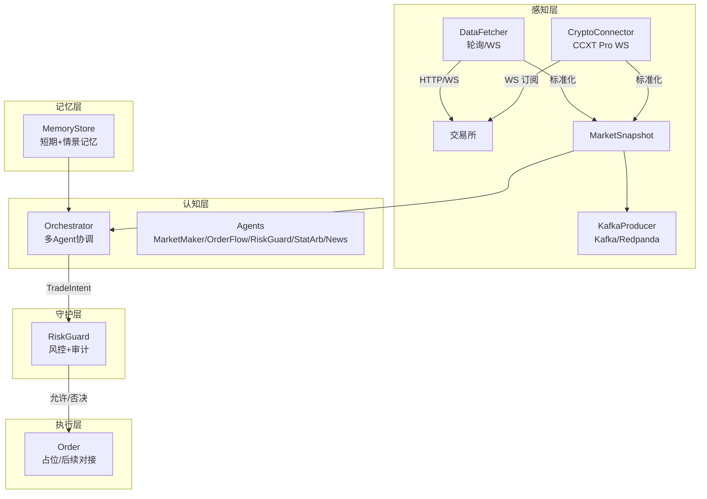
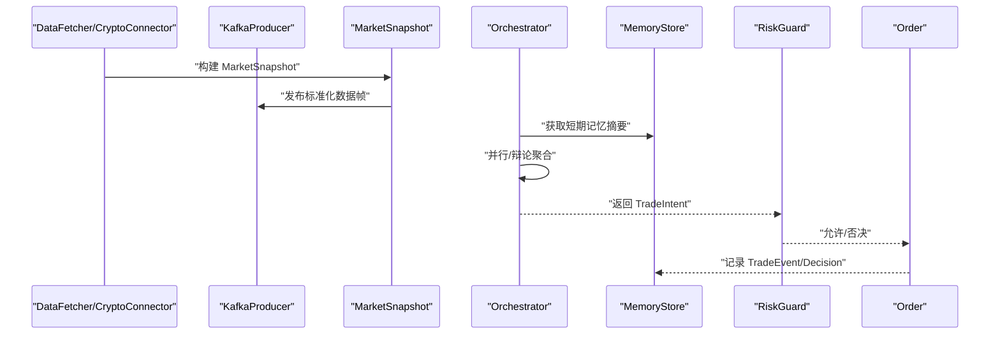
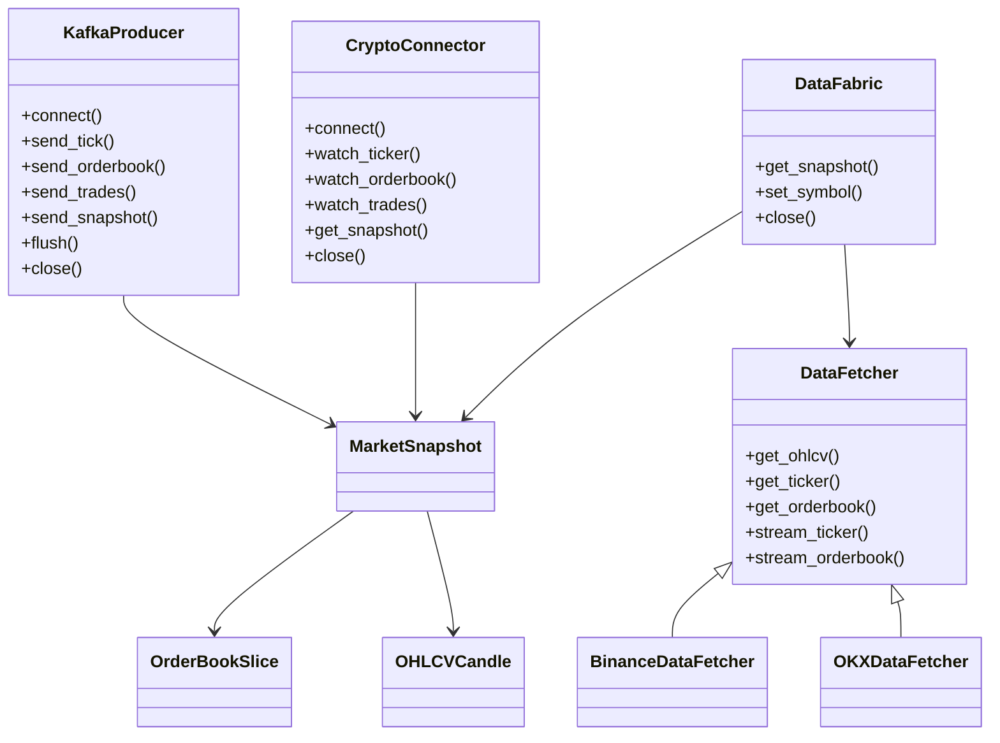
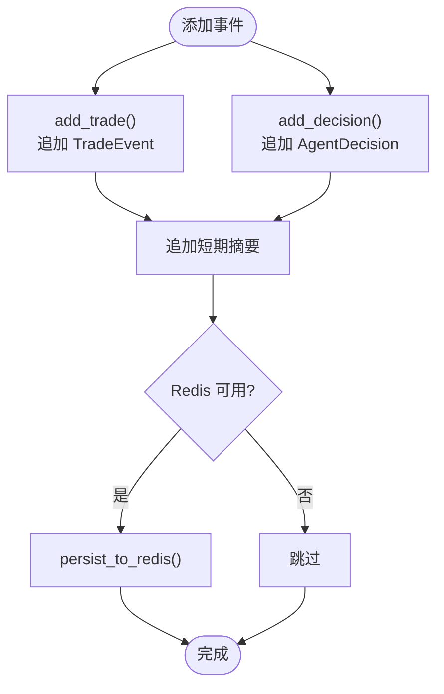
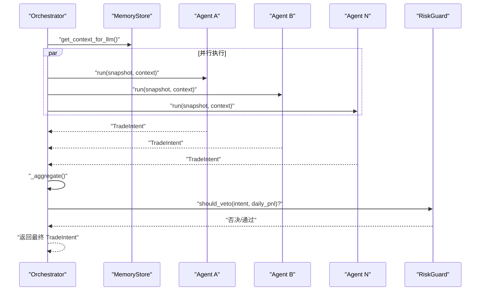
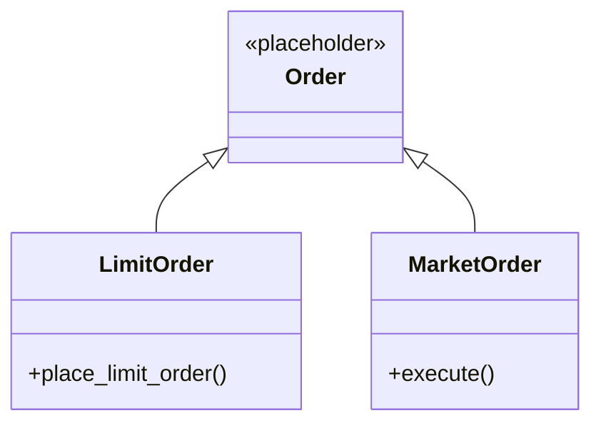
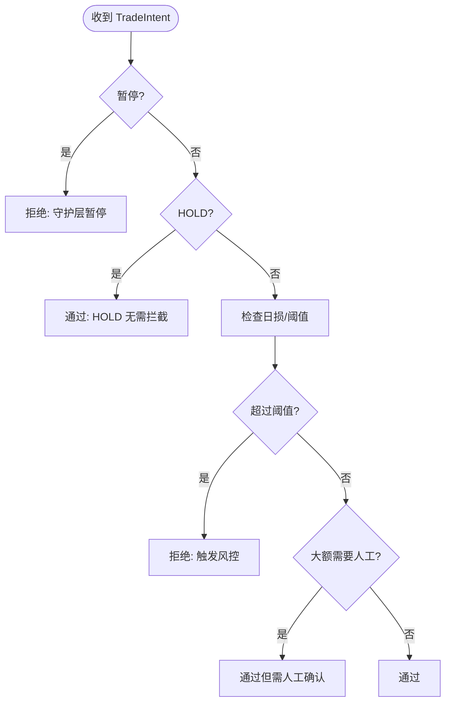
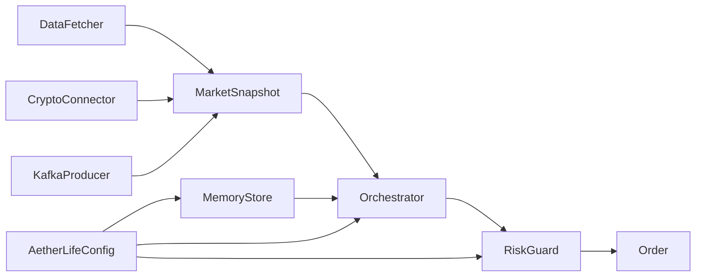

# 内部模块通信接口

<cite>
**本文引用的文件**
- [src/aetherlife/perception/fabric.py](file://src/aetherlife/perception/fabric.py)
- [src/aetherlife/perception/models.py](file://src/aetherlife/perception/models.py)
- [src/aetherlife/perception/crypto_connector.py](file://src/aetherlife/perception/crypto_connector.py)
- [src/aetherlife/perception/kafka_producer.py](file://src/aetherlife/perception/kafka_producer.py)
- [src/aetherlife/cognition/orchestrator.py](file://src/aetherlife/cognition/orchestrator.py)
- [src/aetherlife/cognition/schemas.py](file://src/aetherlife/cognition/schemas.py)
- [src/aetherlife/cognition/agents.py](file://src/aetherlife/cognition/agents.py)
- [src/aetherlife/memory/store.py](file://src/aetherlife/memory/store.py)
- [src/aetherlife/guard/risk_guard.py](file://src/aetherlife/guard/risk_guard.py)
- [src/data/data_fetcher.py](file://src/data/data_fetcher.py)
- [src/aetherlife/config.py](file://src/aetherlife/config.py)
- [src/aetherlife/run.py](file://src/aetherlife/run.py)
- [src/utils/logger.py](file://src/utils/logger.py)
</cite>

## 目录
1. [简介](#简介)
2. [项目结构](#项目结构)
3. [核心组件](#核心组件)
4. [架构总览](#架构总览)
5. [详细组件分析](#详细组件分析)
6. [依赖关系分析](#依赖关系分析)
7. [性能考量](#性能考量)
8. [故障排查指南](#故障排查指南)
9. [结论](#结论)
10. [附录](#附录)

## 简介
本文件面向量化交易系统的内部模块通信接口，系统采用分层架构：感知层（Perception）、记忆层（Memory）、认知层（Cognition）、决策层（Decision）、执行层（Execution）、守护层（Guard）、进化层（Evolution）。本文重点说明模块间通信协议、数据帧格式、状态管理机制，以及感知层与认知层的数据传递、记忆层的存储接口、执行层的订单管理接口。同时覆盖内部消息格式、事件总线机制、异步通信模式、错误传播规则，并给出模块间调用示例、数据序列化格式、接口版本兼容性、性能监控指标、扩展指南、调试技巧与系统集成最佳实践。

## 项目结构
系统采用“分层 + 模块化”的组织方式，核心模块如下：
- 感知层：负责多源数据采集、标准化与发布（WebSocket/Kafka/轮询）
- 记忆层：短期+情景记忆，支持可选 Redis 持久化
- 认知层：多 Agent 协调器，支持辩论与聚合
- 决策层：结构化输出 TradeIntent，支持 LLM/RL/Hybrid
- 执行层：订单管理接口（当前为占位，后续对接交易所客户端）
- 守护层：风控与审计
- 配置层：集中式配置对象，支持 JSON 加载与环境变量覆盖

图表来源
- [src/aetherlife/perception/fabric.py](file://src/aetherlife/perception/fabric.py#L1-L88)
- [src/aetherlife/perception/crypto_connector.py](file://src/aetherlife/perception/crypto_connector.py#L1-L369)
- [src/aetherlife/perception/kafka_producer.py](file://src/aetherlife/perception/kafka_producer.py#L1-L287)
- [src/aetherlife/cognition/orchestrator.py](file://src/aetherlife/cognition/orchestrator.py#L1-L93)
- [src/aetherlife/memory/store.py](file://src/aetherlife/memory/store.py#L1-L155)
- [src/aetherlife/guard/risk_guard.py](file://src/aetherlife/guard/risk_guard.py#L1-L84)
- [src/data/data_fetcher.py](file://src/data/data_fetcher.py#L1-L434)

章节来源
- [src/aetherlife/perception/fabric.py](file://src/aetherlife/perception/fabric.py#L1-L88)
- [src/aetherlife/perception/crypto_connector.py](file://src/aetherlife/perception/crypto_connector.py#L1-L369)
- [src/aetherlife/perception/kafka_producer.py](file://src/aetherlife/perception/kafka_producer.py#L1-L287)
- [src/aetherlife/cognition/orchestrator.py](file://src/aetherlife/cognition/orchestrator.py#L1-L93)
- [src/aetherlife/memory/store.py](file://src/aetherlife/memory/store.py#L1-L155)
- [src/aetherlife/guard/risk_guard.py](file://src/aetherlife/guard/risk_guard.py#L1-L84)
- [src/data/data_fetcher.py](file://src/data/data_fetcher.py#L1-L434)

## 核心组件
- 感知层数据模型：统一的 MarketSnapshot、OrderBookSlice、OHLCVCandle，确保多交易所数据格式一致
- 认知层决策模型：TradeIntent、Vote、DecisionContext、LangGraphState，支撑结构化输出与状态机
- 记忆层存储：短期记忆（最近事件/决策摘要）与可选 Redis 持久化
- 执行层订单：当前为占位，定义了限价单与市价单的接口形态
- 守护层风控：电路断路器、大额 HITL、审计日志
- 配置层：集中式配置对象，支持 JSON 加载与环境变量覆盖

章节来源
- [src/aetherlife/perception/models.py](file://src/aetherlife/perception/models.py#L1-L64)
- [src/aetherlife/cognition/schemas.py](file://src/aetherlife/cognition/schemas.py#L1-L219)
- [src/aetherlife/memory/store.py](file://src/aetherlife/memory/store.py#L1-L155)
- [src/execution/order.py](file://src/execution/order.py#L1-L26)
- [src/aetherlife/guard/risk_guard.py](file://src/aetherlife/guard/risk_guard.py#L1-L84)
- [src/aetherlife/config.py](file://src/aetherlife/config.py#L1-L131)

## 架构总览
系统采用“异步 + 事件驱动”的通信模式：
- 感知层通过 DataFetcher/CryptoConnector/KafkaProducer 提供标准化数据帧
- 认知层通过 Orchestrator 聚合多 Agent 的 TradeIntent，并结合记忆层上下文进行风控否决
- 执行层接收最终 TradeIntent，经守护层风控后执行
- 记忆层提供短期记忆摘要与可选 Redis 持久化，支撑 LLM 上下文与回放

图表来源
- [src/aetherlife/perception/fabric.py](file://src/aetherlife/perception/fabric.py#L32-L82)
- [src/aetherlife/perception/kafka_producer.py](file://src/aetherlife/perception/kafka_producer.py#L131-L170)
- [src/aetherlife/cognition/orchestrator.py](file://src/aetherlife/cognition/orchestrator.py#L38-L53)
- [src/aetherlife/memory/store.py](file://src/aetherlife/memory/store.py#L134-L145)
- [src/aetherlife/guard/risk_guard.py](file://src/aetherlife/guard/risk_guard.py#L48-L68)

## 详细组件分析

### 感知层：数据采集与发布
- DataFabric：统一入口，聚合订单簿、ticker、K线，输出 MarketSnapshot
- CryptoConnector：基于 CCXT Pro 的 WebSocket 实时订阅（Ticker/OrderBook/Trades），支持自动重连
- KafkaProducer：将 Tick/OrderBook/Trades/Snapshot 序列化为 JSON 发布到 Kafka/Redpanda，支持批量与压缩
- DataFetcher：多交易所适配（Binance/OKX），提供 HTTP/WS 两种通道

图表来源
- [src/data/data_fetcher.py](file://src/data/data_fetcher.py#L17-L62)
- [src/aetherlife/perception/crypto_connector.py](file://src/aetherlife/perception/crypto_connector.py#L23-L369)
- [src/aetherlife/perception/fabric.py](file://src/aetherlife/perception/fabric.py#L13-L88)
- [src/aetherlife/perception/kafka_producer.py](file://src/aetherlife/perception/kafka_producer.py#L26-L218)
- [src/aetherlife/perception/models.py](file://src/aetherlife/perception/models.py#L15-L64)

章节来源
- [src/aetherlife/perception/fabric.py](file://src/aetherlife/perception/fabric.py#L1-L88)
- [src/aetherlife/perception/crypto_connector.py](file://src/aetherlife/perception/crypto_connector.py#L1-L369)
- [src/aetherlife/perception/kafka_producer.py](file://src/aetherlife/perception/kafka_producer.py#L1-L287)
- [src/data/data_fetcher.py](file://src/data/data_fetcher.py#L1-L434)
- [src/aetherlife/perception/models.py](file://src/aetherlife/perception/models.py#L1-L64)

### 记忆层：存储接口与上下文
- MemoryStore：短期事件队列（TradeEvent/AgentDecision）+ 短期上下文摘要（供 LLM），可选 Redis 持久化
- 上下文生成：get_context_for_llm 输出文本摘要，限制最大条目数
- 日常损益：get_daily_pnl 按日汇总

图表来源
- [src/aetherlife/memory/store.py](file://src/aetherlife/memory/store.py#L64-L104)

章节来源
- [src/aetherlife/memory/store.py](file://src/aetherlife/memory/store.py#L1-L155)

### 认知层：多 Agent 协调与决策
- Orchestrator：可选辩论（Bull/Bear/Judge）或并行聚合，权重加权平均 quantity_pct 与 confidence，风控一票否决
- Agents：MarketMaker、OrderFlow、RiskGuard、StatArb、NewsSentiment，均实现统一 run 接口
- 决策模型：TradeIntent、Vote、DecisionContext、LangGraphState，支持多市场与多枚举

图表来源
- [src/aetherlife/cognition/orchestrator.py](file://src/aetherlife/cognition/orchestrator.py#L38-L53)
- [src/aetherlife/cognition/agents.py](file://src/aetherlife/cognition/agents.py#L13-L109)
- [src/aetherlife/cognition/schemas.py](file://src/aetherlife/cognition/schemas.py#L32-L62)

章节来源
- [src/aetherlife/cognition/orchestrator.py](file://src/aetherlife/cognition/orchestrator.py#L1-L93)
- [src/aetherlife/cognition/agents.py](file://src/aetherlife/cognition/agents.py#L1-L109)
- [src/aetherlife/cognition/schemas.py](file://src/aetherlife/cognition/schemas.py#L1-L219)

### 执行层：订单管理接口
- 当前为占位实现，定义了限价单与市价单的基本接口形态
- 后续将对接交易所客户端（exchange_client），实现下单、撤单、查询等

图表来源
- [src/execution/order.py](file://src/execution/order.py#L1-L26)

章节来源
- [src/execution/order.py](file://src/execution/order.py#L1-L26)

### 守护层：风控与审计
- RiskGuard：电路断路器、单日最大亏损、大额 HITL、暂停机制、审计日志落盘与回调
- 审计：支持文件与回调双通道，统一 JSONL 格式

图表来源
- [src/aetherlife/guard/risk_guard.py](file://src/aetherlife/guard/risk_guard.py#L48-L68)

章节来源
- [src/aetherlife/guard/risk_guard.py](file://src/aetherlife/guard/risk_guard.py#L1-L84)

## 依赖关系分析
- 感知层依赖：DataFetcher/CryptoConnector 产出 MarketSnapshot；KafkaProducer 作为事件总线发布
- 认知层依赖：Orchestrator 依赖 MemoryStore 的上下文与风控；依赖多个 Agent 的 run 接口
- 执行层依赖：RiskGuard 的放行结果；后续对接 exchange_client
- 配置层：AetherLifeConfig 作为全局配置，贯穿各层

图表来源
- [src/aetherlife/perception/fabric.py](file://src/aetherlife/perception/fabric.py#L32-L82)
- [src/aetherlife/perception/kafka_producer.py](file://src/aetherlife/perception/kafka_producer.py#L131-L170)
- [src/aetherlife/cognition/orchestrator.py](file://src/aetherlife/cognition/orchestrator.py#L38-L53)
- [src/aetherlife/memory/store.py](file://src/aetherlife/memory/store.py#L134-L145)
- [src/aetherlife/guard/risk_guard.py](file://src/aetherlife/guard/risk_guard.py#L48-L68)
- [src/aetherlife/config.py](file://src/aetherlife/config.py#L98-L131)

章节来源
- [src/aetherlife/config.py](file://src/aetherlife/config.py#L1-L131)

## 性能考量
- 异步并发：感知层使用 asyncio.gather 并行拉取订单簿、ticker、K线；Orchestrator 并行执行多个 Agent
- 事件总线：KafkaProducer 使用 gzip 压缩、linger_ms 批量发送，降低网络开销
- 内存与持久化：MemoryStore 使用 deque 控制容量，Redis 可选持久化；注意序列化成本
- 时序与去重：DataPipeline 对 Tick/OrderBook 做去重（时间戳/nonce），避免重复处理
- 配置化：通过 AetherLifeConfig 调整刷新间隔、并行深度、上下文长度等

章节来源
- [src/aetherlife/perception/fabric.py](file://src/aetherlife/perception/fabric.py#L37-L41)
- [src/aetherlife/cognition/orchestrator.py](file://src/aetherlife/cognition/orchestrator.py#L48-L49)
- [src/aetherlife/perception/kafka_producer.py](file://src/aetherlife/perception/kafka_producer.py#L54-L75)
- [src/aetherlife/perception/kafka_producer.py](file://src/aetherlife/perception/kafka_producer.py#L172-L205)
- [src/aetherlife/perception/kafka_producer.py](file://src/aetherlife/perception/kafka_producer.py#L237-L270)
- [src/aetherlife/memory/store.py](file://src/aetherlife/memory/store.py#L50-L63)
- [src/aetherlife/config.py](file://src/aetherlife/config.py#L11-L131)

## 故障排查指南
- 日志系统：统一 Logger，支持控制台输出与异常追踪
- Kafka 连接失败：检查 aiokafka 安装与 broker 地址；查看连接/发送异常日志
- CCXT 连接失败：检查 API Key/Secret 与测试网配置；确认自动重连逻辑
- Redis 持久化：捕获连接/写入异常，优雅降级为内存模式
- 审计日志：确认文件路径可写与回调可用；核对 JSONL 格式一致性
- 配置加载：优先级为环境变量覆盖 JSON 配置，注意符号与市场列表

章节来源
- [src/utils/logger.py](file://src/utils/logger.py#L1-L34)
- [src/aetherlife/perception/kafka_producer.py](file://src/aetherlife/perception/kafka_producer.py#L54-L75)
- [src/aetherlife/perception/crypto_connector.py](file://src/aetherlife/perception/crypto_connector.py#L50-L85)
- [src/aetherlife/memory/store.py](file://src/aetherlife/memory/store.py#L90-L104)
- [src/aetherlife/guard/risk_guard.py](file://src/aetherlife/guard/risk_guard.py#L70-L84)
- [src/aetherlife/run.py](file://src/aetherlife/run.py#L32-L49)
- [src/aetherlife/config.py](file://src/aetherlife/config.py#L112-L131)

## 结论
本系统通过统一的数据模型与事件总线，实现了感知、记忆、认知、执行、守护的清晰分层与松耦合通信。TradeIntent 作为跨层契约，确保了决策的结构化与可审计性；MemoryStore 与 RiskGuard 提供了必要的上下文与风控保障。后续可在执行层对接真实交易所客户端，并扩展 Kafka/Redpanda 作为事件总线，满足高吞吐与可扩展需求。

## 附录

### 内部消息格式与序列化
- MarketSnapshot：包含 symbol/exchange/orderbook/last_price/ticker_24h/candles_1m/timestamp
- OrderBookSlice：包含 bids/asks/mid_price/spread_bps/timestamp/sequence
- OHLCVCandle：包含 open/high/low/close/volume/start_time/end_time/interval
- TradeIntent：包含 action/market/symbol/quantity_pct/reason/confidence/stop_loss_pct/take_profit_pct/valid_until/order_type/limit_price/agent_id/timestamp/metadata
- KafkaProducer：统一 JSON 序列化，Topic 分类包括 tick/orderbook/trades/snapshot

章节来源
- [src/aetherlife/perception/models.py](file://src/aetherlife/perception/models.py#L15-L64)
- [src/aetherlife/cognition/schemas.py](file://src/aetherlife/cognition/schemas.py#L32-L58)
- [src/aetherlife/perception/kafka_producer.py](file://src/aetherlife/perception/kafka_producer.py#L131-L170)

### 事件总线机制
- KafkaProducer 提供 send_tick/send_orderbook/send_trades/send_snapshot 四类消息发布
- DataPipeline 负责去重与时序对齐，支持批量发送与 flush
- 支持 gzip 压缩与 acks=all，提升可靠性

章节来源
- [src/aetherlife/perception/kafka_producer.py](file://src/aetherlife/perception/kafka_producer.py#L26-L218)
- [src/aetherlife/perception/kafka_producer.py](file://src/aetherlife/perception/kafka_producer.py#L220-L287)

### 异步通信模式
- 感知层：DataFetcher/CryptoConnector 均为异步接口，使用 asyncio.gather 并行拉取
- 认知层：Orchestrator 并行执行多个 Agent，支持辩论模式
- 记忆层：Redis 操作为异步，失败时静默降级

章节来源
- [src/aetherlife/perception/fabric.py](file://src/aetherlife/perception/fabric.py#L37-L41)
- [src/aetherlife/cognition/orchestrator.py](file://src/aetherlife/cognition/orchestrator.py#L48-L63)
- [src/aetherlife/memory/store.py](file://src/aetherlife/memory/store.py#L90-L104)

### 错误传播规则
- Kafka 发送异常：记录错误并继续运行，不影响主流程
- CCXT/WS 异常：自动重连，回调失败记录日志
- Redis 写入异常：忽略并继续运行
- 审计失败：记录调试日志，不影响业务

章节来源
- [src/aetherlife/perception/kafka_producer.py](file://src/aetherlife/perception/kafka_producer.py#L201-L204)
- [src/aetherlife/perception/crypto_connector.py](file://src/aetherlife/perception/crypto_connector.py#L146-L154)
- [src/aetherlife/memory/store.py](file://src/aetherlife/memory/store.py#L102-L103)
- [src/aetherlife/guard/risk_guard.py](file://src/aetherlife/guard/risk_guard.py#L80-L83)

### 接口版本兼容性
- 配置层支持 from_dict 加载，兼容不同版本的配置字段
- TradeIntent 字段具备默认值与范围约束，便于演进
- Kafka 消息字段保持向后兼容，新增字段建议可选

章节来源
- [src/aetherlife/config.py](file://src/aetherlife/config.py#L112-L131)
- [src/aetherlife/cognition/schemas.py](file://src/aetherlife/cognition/schemas.py#L60-L62)

### 性能监控指标
- KafkaProducer：发送速率、失败率、批量大小、压缩比
- Orchestrator：并行执行耗时、聚合耗时、风控否决率
- MemoryStore：短期上下文长度、Redis 写入耗时
- DataFetcher/CryptoConnector：请求成功率、WS 重连次数、去重命中率

章节来源
- [src/aetherlife/perception/kafka_producer.py](file://src/aetherlife/perception/kafka_producer.py#L57-L64)
- [src/aetherlife/cognition/orchestrator.py](file://src/aetherlife/cognition/orchestrator.py#L48-L49)
- [src/aetherlife/memory/store.py](file://src/aetherlife/memory/store.py#L90-L104)
- [src/aetherlife/perception/crypto_connector.py](file://src/aetherlife/perception/crypto_connector.py#L116-L154)

### 扩展指南
- 新增 Agent：继承 BaseAgent，实现 run 方法，参与 Orchestrator 聚合
- 新增数据源：实现 DataFetcher 接口或使用 CryptoConnector，输出 MarketSnapshot
- 新增 Kafka Topic：在 KafkaProducer 中定义 Topic 常量并实现 send_* 方法
- 新增风控规则：在 RiskGuard 中扩展 check 逻辑，支持更多阈值与条件

章节来源
- [src/aetherlife/cognition/agents.py](file://src/aetherlife/cognition/agents.py#L13-L23)
- [src/aetherlife/cognition/orchestrator.py](file://src/aetherlife/cognition/orchestrator.py#L19-L36)
- [src/aetherlife/perception/kafka_producer.py](file://src/aetherlife/perception/kafka_producer.py#L38-L43)
- [src/aetherlife/guard/risk_guard.py](file://src/aetherlife/guard/risk_guard.py#L48-L68)

### 调试技巧
- 使用统一 Logger 输出时间戳与级别，便于串联日志
- 在 KafkaProducer 中开启 debug 级别日志，定位发送问题
- 在 CryptoConnector 中观察回调异常，快速定位数据格式问题
- 在 MemoryStore 中打印 get_context_for_llm 摘要，验证上下文长度与质量

章节来源
- [src/utils/logger.py](file://src/utils/logger.py#L12-L28)
- [src/aetherlife/perception/kafka_producer.py](file://src/aetherlife/perception/kafka_producer.py#L199-L200)
- [src/aetherlife/perception/crypto_connector.py](file://src/aetherlife/perception/crypto_connector.py#L140-L145)
- [src/aetherlife/memory/store.py](file://src/aetherlife/memory/store.py#L134-L138)

### 系统集成最佳实践
- 配置优先：通过环境变量覆盖 JSON 配置，确保部署灵活性
- 事件总线：统一使用 KafkaProducer 发布 MarketSnapshot，下游消费者按需订阅
- 记忆与风控：在 Orchestrator 之前注入 MemoryStore 上下文，风控在执行前统一检查
- 执行层：先实现占位接口，再逐步对接真实交易所客户端，确保回放与审计能力

章节来源
- [src/aetherlife/run.py](file://src/aetherlife/run.py#L32-L49)
- [src/aetherlife/perception/kafka_producer.py](file://src/aetherlife/perception/kafka_producer.py#L131-L170)
- [src/aetherlife/cognition/orchestrator.py](file://src/aetherlife/cognition/orchestrator.py#L44-L53)
- [src/aetherlife/guard/risk_guard.py](file://src/aetherlife/guard/risk_guard.py#L48-L68)