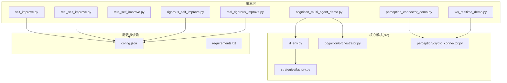
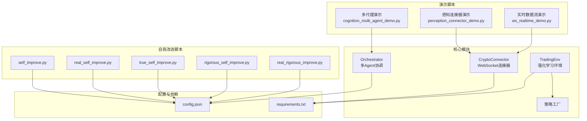
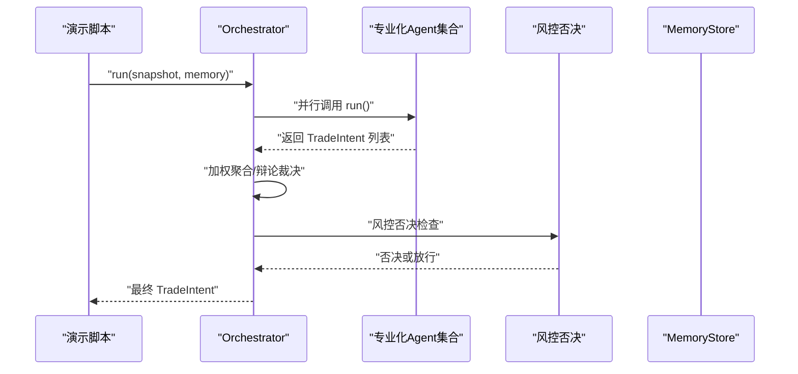
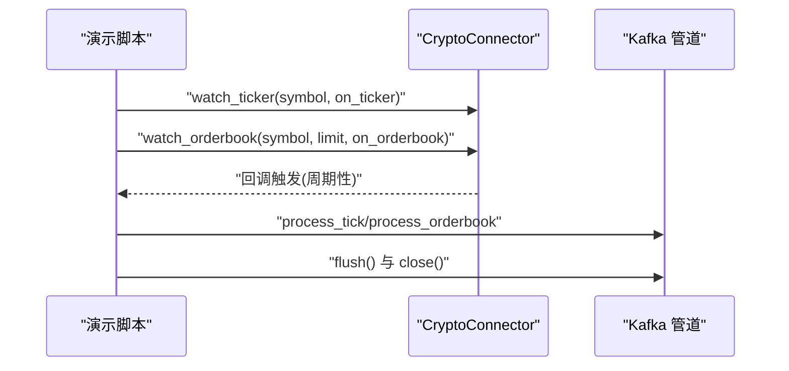
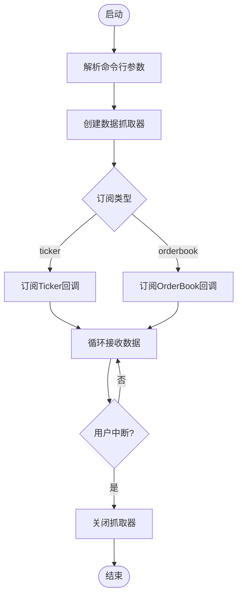
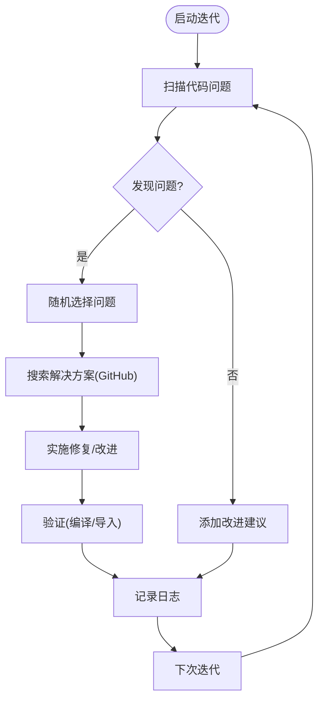
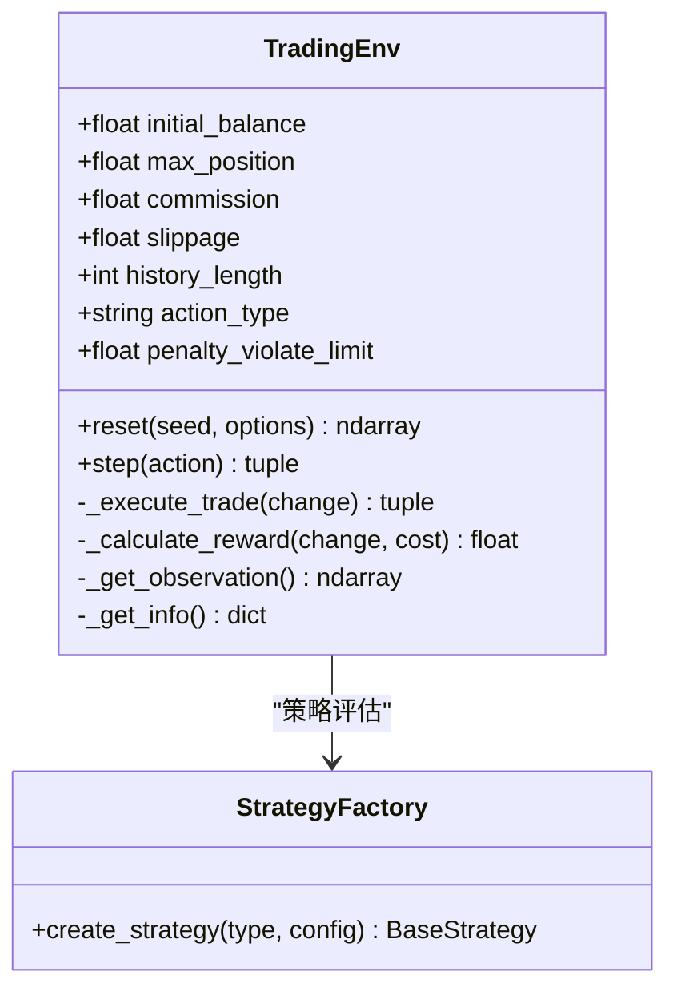
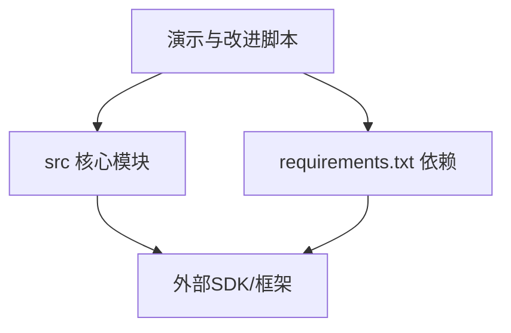

# 工具和脚本

<cite>
**本文引用的文件**
- [scripts/cognition_multi_agent_demo.py](file://scripts/cognition_multi_agent_demo.py)
- [scripts/perception_connector_demo.py](file://scripts/perception_connector_demo.py)
- [scripts/ws_realtime_demo.py](file://scripts/ws_realtime_demo.py)
- [scripts/self_improve.py](file://scripts/self_improve.py)
- [scripts/real_self_improve.py](file://scripts/real_self_improve.py)
- [scripts/true_self_improve.py](file://scripts/true_self_improve.py)
- [scripts/rigorous_self_improve.py](file://scripts/rigorous_self_improve.py)
- [scripts/real_rigorous_improve.py](file://scripts/real_rigorous_improve.py)
- [src/aetherlife/decision/rl_env.py](file://src/aetherlife/decision/rl_env.py)
- [src/aetherlife/perception/crypto_connector.py](file://src/aetherlife/perception/crypto_connector.py)
- [src/aetherlife/cognition/orchestrator.py](file://src/aetherlife/cognition/orchestrator.py)
- [src/strategies/factory.py](file://src/strategies/factory.py)
- [configs/config.json](file://configs/config.json)
- [requirements.txt](file://requirements.txt)
</cite>

## 目录
1. [简介](#简介)
2. [项目结构](#项目结构)
3. [核心组件](#核心组件)
4. [架构总览](#架构总览)
5. [详细组件分析](#详细组件分析)
6. [依赖关系分析](#依赖关系分析)
7. [性能考虑](#性能考虑)
8. [故障排查指南](#故障排查指南)
9. [结论](#结论)
10. [附录](#附录)

## 简介
本文件面向量化交易系统的使用者与开发者，系统性梳理仓库中的演示脚本与自我改进脚本，覆盖以下主题：
- 多代理认知演示：展示专业化 Agent 的协作决策流程与权重动态调整。
- 感知连接器演示：展示加密货币、IBKR、Kafka 管道的集成使用。
- 实时数据流演示：通过 WebSocket 订阅行情与订单簿。
- 自我改进脚本：从“自动迭代”到“真正迭代”，再到“严谨迭代”的演进路径，涵盖自适应学习、策略优化与性能提升的实现思路与应用场景。
- 强化学习模型训练脚本：提供环境配置、训练参数与评估指标的使用方法。

同时，文档给出前置条件、依赖要求、输出解读、扩展定制与调试技巧，帮助快速上手并安全地进行二次开发。

## 项目结构
本仓库采用“脚本演示 + 核心模块 + 配置 + 依赖”的分层组织方式：
- scripts：各类演示与自动化脚本，便于快速验证与集成。
- src：核心业务模块，包含认知层、感知层、策略工厂、强化学习环境等。
- configs：系统配置样例，如交易所、策略、风控与AI增强开关。
- requirements.txt：项目依赖清单，含异步网络、数据处理、API客户端、Kafka、时序数据库、Redis、多Agent框架、强化学习、深度学习等。

图示来源
- [scripts/cognition_multi_agent_demo.py](file://scripts/cognition_multi_agent_demo.py#L1-L265)
- [scripts/perception_connector_demo.py](file://scripts/perception_connector_demo.py#L1-L211)
- [scripts/ws_realtime_demo.py](file://scripts/ws_realtime_demo.py#L1-L62)
- [src/aetherlife/decision/rl_env.py](file://src/aetherlife/decision/rl_env.py#L1-L224)
- [src/aetherlife/cognition/orchestrator.py](file://src/aetherlife/cognition/orchestrator.py#L1-L93)
- [src/aetherlife/perception/crypto_connector.py](file://src/aetherlife/perception/crypto_connector.py#L1-L200)
- [src/strategies/factory.py](file://src/strategies/factory.py#L1-L36)
- [configs/config.json](file://configs/config.json#L1-L28)
- [requirements.txt](file://requirements.txt#L1-L70)

章节来源
- [scripts/cognition_multi_agent_demo.py](file://scripts/cognition_multi_agent_demo.py#L1-L265)
- [scripts/perception_connector_demo.py](file://scripts/perception_connector_demo.py#L1-L211)
- [scripts/ws_realtime_demo.py](file://scripts/ws_realtime_demo.py#L1-L62)
- [src/aetherlife/decision/rl_env.py](file://src/aetherlife/decision/rl_env.py#L1-L224)
- [src/aetherlife/cognition/orchestrator.py](file://src/aetherlife/cognition/orchestrator.py#L1-L93)
- [src/aetherlife/perception/crypto_connector.py](file://src/aetherlife/perception/crypto_connector.py#L1-L200)
- [src/strategies/factory.py](file://src/strategies/factory.py#L1-L36)
- [configs/config.json](file://configs/config.json#L1-L28)
- [requirements.txt](file://requirements.txt#L1-L70)

## 核心组件
- 认知层协调器：负责多 Agent 决策聚合与风控否决，支持辩论模式与加权聚合。
- 感知层连接器：统一加密货币 WebSocket 接口，支持实时 Ticker/OrderBook 订阅与自动重连。
- 强化学习环境：基于 Gymnasium 的交易环境，定义状态空间、动作空间与奖励函数，适配 PPO/SAC 等算法。
- 策略工厂：根据配置创建单一或组合策略，支持多子策略与权重。

章节来源
- [src/aetherlife/cognition/orchestrator.py](file://src/aetherlife/cognition/orchestrator.py#L16-L93)
- [src/aetherlife/perception/crypto_connector.py](file://src/aetherlife/perception/crypto_connector.py#L23-L200)
- [src/aetherlife/decision/rl_env.py](file://src/aetherlife/decision/rl_env.py#L26-L224)
- [src/strategies/factory.py](file://src/strategies/factory.py#L10-L36)

## 架构总览
下图展示了“演示脚本 → 核心模块 → 配置与依赖”的交互关系，以及自我改进脚本如何与系统配置和代码目录协同工作。

图示来源
- [scripts/cognition_multi_agent_demo.py](file://scripts/cognition_multi_agent_demo.py#L1-L265)
- [scripts/perception_connector_demo.py](file://scripts/perception_connector_demo.py#L1-L211)
- [scripts/ws_realtime_demo.py](file://scripts/ws_realtime_demo.py#L1-L62)
- [src/aetherlife/cognition/orchestrator.py](file://src/aetherlife/cognition/orchestrator.py#L16-L93)
- [src/aetherlife/perception/crypto_connector.py](file://src/aetherlife/perception/crypto_connector.py#L23-L200)
- [src/aetherlife/decision/rl_env.py](file://src/aetherlife/decision/rl_env.py#L26-L224)
- [src/strategies/factory.py](file://src/strategies/factory.py#L10-L36)
- [scripts/self_improve.py](file://scripts/self_improve.py#L1-L115)
- [scripts/real_self_improve.py](file://scripts/real_self_improve.py#L1-L166)
- [scripts/true_self_improve.py](file://scripts/true_self_improve.py#L1-L229)
- [scripts/rigorous_self_improve.py](file://scripts/rigorous_self_improve.py#L1-L216)
- [scripts/real_rigorous_improve.py](file://scripts/real_rigorous_improve.py#L1-L261)
- [configs/config.json](file://configs/config.json#L1-L28)
- [requirements.txt](file://requirements.txt#L1-L70)

## 详细组件分析

### 多代理认知演示
- 功能概述
  - 展示单个专业化 Agent 的决策过程（A股、加密货币、美股、情绪分析）。
  - 展示 Orchestrator 多 Agent 协作与加权聚合，支持市场权重与 Agent 权重动态调整。
- 关键流程
  - 初始化 Orchestrator，启用专业化 Agent 与可选辩论。
  - 构造 MarketSnapshot 与 OrderBookSlice，调用 run 获取 TradeIntent。
  - 通过 update_agent_weights 与 update_market_weights 调整权重，观察决策变化。
- 输出解读
  - 决策动作（买入/卖出/持有）、目标仓位百分比、理由与置信度。
  - 可选元数据包含辅助信息，便于溯源与复盘。
- 扩展与定制
  - 在 Orchestrator 中新增 Agent 类型与权重映射。
  - 结合 MemoryStore 上下文，引入更多领域知识（如新闻、情绪）以提升置信度。
- 常见问题
  - 权重设置不当导致决策偏向某一 Agent：建议通过 A/B 对比实验校准权重。
  - 市场权重与实际市场不匹配：结合历史回测与滚动窗口评估权重有效性。

图示来源
- [scripts/cognition_multi_agent_demo.py](file://scripts/cognition_multi_agent_demo.py#L120-L195)
- [src/aetherlife/cognition/orchestrator.py](file://src/aetherlife/cognition/orchestrator.py#L38-L53)

章节来源
- [scripts/cognition_multi_agent_demo.py](file://scripts/cognition_multi_agent_demo.py#L35-L236)
- [src/aetherlife/cognition/orchestrator.py](file://src/aetherlife/cognition/orchestrator.py#L16-L93)

### 感知连接器演示
- 功能概述
  - 加密货币连接器：创建连接器，订阅 Ticker 与 OrderBook，支持测试网。
  - IBKR 连接器：通过配置连接 TWS/Gateway，订阅美股与 A 股（Stock Connect）行情。
  - Kafka 数据管道：将实时 Tick/OrderBook 转发至 Kafka，支持缓冲刷新。
- 关键流程
  - 创建连接器与订阅回调，等待若干秒后统计接收次数。
  - 对于 Kafka 管道，订阅完成后 flush 缓冲并关闭连接。
- 输出解读
  - Ticker 更新包含最新价、买卖价与成交量；OrderBook 更新包含档位数量与中间价。
  - Kafka 转发条数反映数据吞吐能力与稳定性。
- 扩展与定制
  - 增加新的订阅类型（如 trades、ohlcv）与回调处理。
  - 在 Kafka 管道中加入数据清洗、压缩与分区策略。

图示来源
- [scripts/perception_connector_demo.py](file://scripts/perception_connector_demo.py#L22-L182)
- [src/aetherlife/perception/crypto_connector.py](file://src/aetherlife/perception/crypto_connector.py#L87-L200)

章节来源
- [scripts/perception_connector_demo.py](file://scripts/perception_connector_demo.py#L22-L204)
- [src/aetherlife/perception/crypto_connector.py](file://src/aetherlife/perception/crypto_connector.py#L23-L200)

### 实时数据流演示
- 功能概述
  - 通过命令行参数指定交易所、交易对、订阅类型（ticker/orderbook）、深度与测试网。
  - 使用数据抓取器创建 WebSocket 订阅，打印关键字段。
- 关键流程
  - 解析参数，创建数据抓取器。
  - 根据 stream 参数选择订阅 Ticker 或 OrderBook。
  - 退出时关闭连接。
- 输出解读
  - Ticker：bid/ask/last。
  - OrderBook：best_bid/best_ask/depth。
- 扩展与定制
  - 增加更多订阅类型与字段映射。
  - 将输出接入日志系统或消息队列。

图示来源
- [scripts/ws_realtime_demo.py](file://scripts/ws_realtime_demo.py#L20-L58)

章节来源
- [scripts/ws_realtime_demo.py](file://scripts/ws_realtime_demo.py#L1-L62)

### 自我改进脚本
- 自动迭代优化器（self_improve.py）
  - 用途：按预设清单随机选择 UI/策略/风控/数据/执行/AI 改进项，循环推进。
  - 适用场景：快速原型阶段的增量改进与演示。
- 真正自我迭代系统（real_self_improve.py）
  - 用途：从主题池随机选择迭代主题，模拟搜索并记录改进，适合探索性学习。
  - 产出：迭代日志 JSON，统计各类别改进次数。
- 真正自我迭代系统（true_self_improve.py）
  - 用途：基于 GitHub 搜索结果，真正修改代码文件，按类别（UI/策略/风控/数据/执行/基础设施）生成改进代码。
  - 产出：在 src 目录写入或追加改进代码，形成可运行的迭代产物。
- 严谨版自我迭代（rigorous_self_improve.py）
  - 用途：每个任务明确文件、搜索关键词与改进代码模板，确保可落地实施。
  - 产出：在指定文件中追加类或模块，参考热门项目实现。
- 真正严谨版自我迭代（real_rigorous_improve.py）
  - 用途：完整流程“扫描 → 搜索 → 实施 → 验证”，自动扫描代码问题并修复，最后编译验证。
  - 产出：迭代日志包含问题类型、修复结果与验证状态。

图示来源
- [scripts/real_rigorous_improve.py](file://scripts/real_rigorous_improve.py#L163-L231)

章节来源
- [scripts/self_improve.py](file://scripts/self_improve.py#L1-L115)
- [scripts/real_self_improve.py](file://scripts/real_self_improve.py#L1-L166)
- [scripts/true_self_improve.py](file://scripts/true_self_improve.py#L1-L229)
- [scripts/rigorous_self_improve.py](file://scripts/rigorous_self_improve.py#L1-L216)
- [scripts/real_rigorous_improve.py](file://scripts/real_rigorous_improve.py#L1-L261)

### 强化学习模型训练脚本使用指南
- 环境配置
  - 依赖：gymnasium、stable-baselines3、torch、numpy、pandas 等。
  - 环境类 TradingEnv 定义了状态空间、动作空间与奖励函数，支持连续/离散动作。
- 训练参数
  - 初始资金、最大仓位、手续费、滑点、历史长度、动作类型、违规惩罚等。
- 评估指标
  - 奖励函数包含收益、夏普比率、滑点惩罚、回撤惩罚与合规惩罚等。
  - 可结合策略工厂创建多策略组合，评估组合表现。
- 使用方法
  - 在训练前准备历史数据，构造 TradingEnv 实例，选择算法（如 PPO/SAC）进行训练。
  - 使用策略工厂创建单一或组合策略，评估其在环境中的表现。

图示来源
- [src/aetherlife/decision/rl_env.py](file://src/aetherlife/decision/rl_env.py#L26-L224)
- [src/strategies/factory.py](file://src/strategies/factory.py#L10-L36)

章节来源
- [src/aetherlife/decision/rl_env.py](file://src/aetherlife/decision/rl_env.py#L26-L224)
- [src/strategies/factory.py](file://src/strategies/factory.py#L10-L36)
- [requirements.txt](file://requirements.txt#L54-L62)

## 依赖关系分析
- 脚本依赖
  - 演示脚本通过 sys.path.insert 引入 src，直接调用核心模块。
  - 强化学习脚本依赖 gymnasium、stable-baselines3、torch 等。
- 外部依赖
  - 加密货币：ccxt.pro（WebSocket）、官方 SDK（可选）。
  - Kafka：kafka-python/aiokafka。
  - 时序数据库：clickhouse-driver。
  - 缓存与向量：redis。
  - 多 Agent：langgraph、langchain。
  - 深度学习：torch、sentence-transformers。
  - API 框架：fastapi、uvicorn。
  - 数据验证：pydantic。

图示来源
- [requirements.txt](file://requirements.txt#L1-L70)
- [scripts/cognition_multi_agent_demo.py](file://scripts/cognition_multi_agent_demo.py#L12-L25)
- [scripts/perception_connector_demo.py](file://scripts/perception_connector_demo.py#L11-L19)
- [scripts/ws_realtime_demo.py](file://scripts/ws_realtime_demo.py#L14-L17)

章节来源
- [requirements.txt](file://requirements.txt#L1-L70)
- [scripts/cognition_multi_agent_demo.py](file://scripts/cognition_multi_agent_demo.py#L12-L25)
- [scripts/perception_connector_demo.py](file://scripts/perception_connector_demo.py#L11-L19)
- [scripts/ws_realtime_demo.py](file://scripts/ws_realtime_demo.py#L14-L17)

## 性能考虑
- 异步优先：脚本与连接器均采用 asyncio，减少阻塞，提高并发吞吐。
- 订阅粒度：合理设置 OrderBook 深度与回调频率，避免过度回调导致 CPU 压力。
- 缓冲与批处理：Kafka 管道支持 flush，建议在高吞吐场景下批量发送。
- 环境参数：在强化学习环境中，适当调整历史长度与动作类型，平衡状态维度与训练效率。
- 资源隔离：多 Agent 场景下，建议限制并发任务数量，避免内存与网络拥塞。

## 故障排查指南
- 连接器无法连接
  - 检查网络与代理设置；确认测试网 URL 与凭据正确。
  - 观察日志错误，必要时重连或降级为轮询模式。
- 订阅无数据
  - 确认交易对与交易所是否支持；检查回调注册与任务是否仍在运行。
  - 对于 Kafka，确认 broker 可达且主题已创建。
- 强化学习报错
  - 确认 gymnasium/stable-baselines3/torch 已安装且版本兼容。
  - 检查状态/动作空间维度与数据类型一致性。
- 自我改进脚本异常
  - 检查 .iteration_count 与 .iteration_log.json 的读写权限。
  - 对于 GitHub 搜索，注意超时与速率限制，适当增加延时。

章节来源
- [src/aetherlife/perception/crypto_connector.py](file://src/aetherlife/perception/crypto_connector.py#L50-L85)
- [scripts/perception_connector_demo.py](file://scripts/perception_connector_demo.py#L75-L134)
- [src/aetherlife/decision/rl_env.py](file://src/aetherlife/decision/rl_env.py#L62-L63)
- [scripts/real_rigorous_improve.py](file://scripts/real_rigorous_improve.py#L86-L100)

## 结论
本仓库提供了从感知、认知到执行与自我改进的完整工具链。演示脚本帮助快速理解系统能力，自我改进脚本则展示了从概念到代码的自动化演进路径。结合强化学习环境与策略工厂，可进一步构建高性能、可扩展的量化交易系统。建议在生产环境中逐步引入更严格的风控与可观测性，并持续通过自我改进脚本保持系统活力。

## 附录
- 前置条件与依赖
  - 安装依赖：pip install -r requirements.txt
  - 准备配置：复制 .env.example 为 .env 并填写密钥；调整 configs/config.json 中的策略、风控与 AI 增强选项。
  - 权限设置：确保脚本与日志文件目录具备读写权限。
- 运行示例
  - 多代理演示：python scripts/cognition_multi_agent_demo.py
  - 感知连接器演示：python scripts/perception_connector_demo.py
  - 实时数据流演示：python scripts/ws_realtime_demo.py --exchange binance --symbol BTCUSDT --stream ticker
  - 自我改进：python scripts/self_improve.py 或 python scripts/true_self_improve.py
- 输出解读与结果分析
  - 多代理：关注动作、仓位、置信度与理由，结合历史回测评估策略稳定性。
  - 感知连接器：统计订阅次数与延迟，评估网络质量与回调性能。
  - 强化学习：对比不同策略与参数组合的回报曲线、最大回撤与胜率。
- 扩展与定制
  - 新增 Agent：在 Orchestrator 中注册并设置权重。
  - 新增数据源：在感知层新增连接器并接入 Kafka 管道。
  - 新增策略：在策略工厂中注册并配置参数。
- 最佳实践
  - 分层测试：先在演示脚本验证逻辑，再在小规模数据上训练模型。
  - 渐进式改进：使用自我改进脚本的阶段性版本，避免一次性大规模变更。
  - 可观测性：为关键路径增加日志与指标，便于定位问题与评估效果。