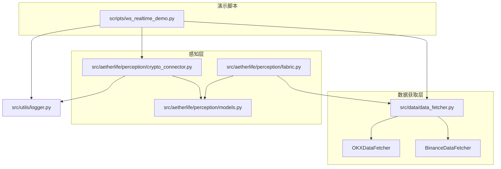
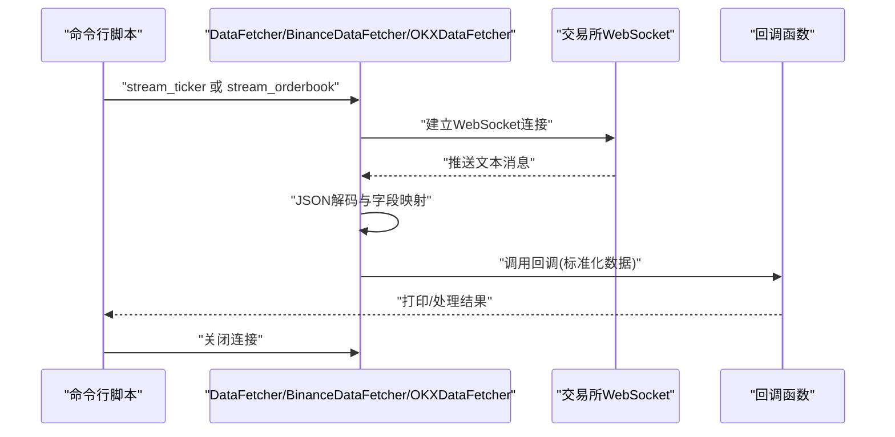
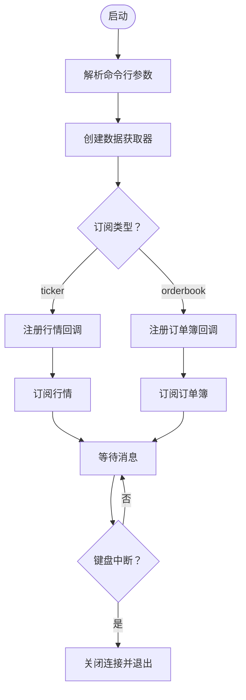
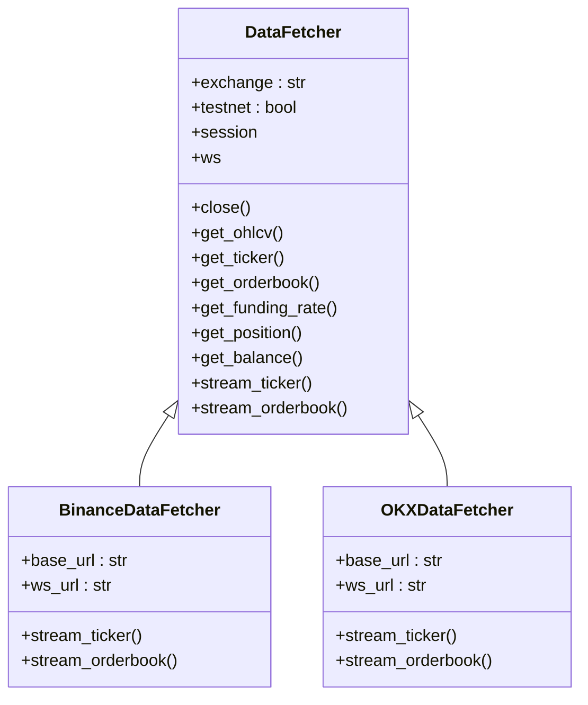
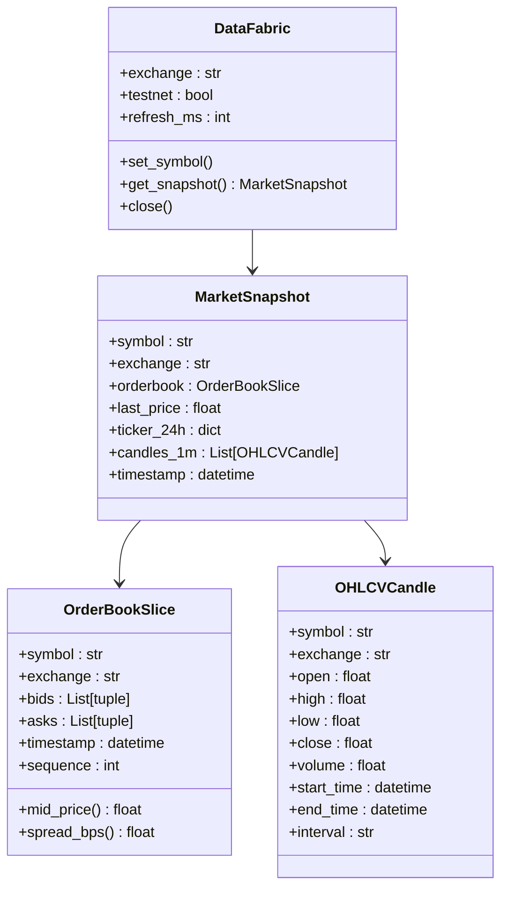
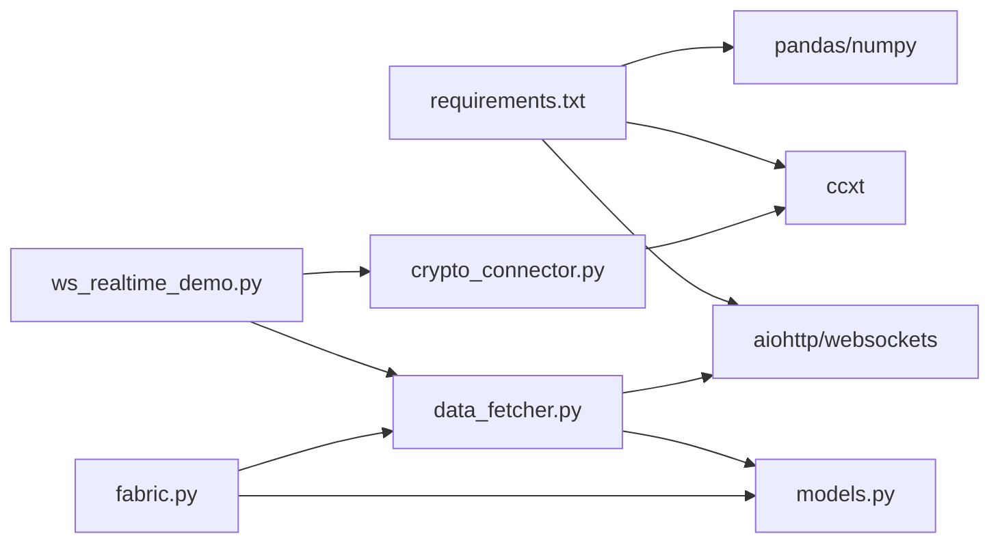

# WebSocket实时数据演示

<cite>
**本文引用的文件**
- [scripts/ws_realtime_demo.py](file://scripts/ws_realtime_demo.py)
- [src/data/data_fetcher.py](file://src/data/data_fetcher.py)
- [src/aetherlife/perception/crypto_connector.py](file://src/aetherlife/perception/crypto_connector.py)
- [src/aetherlife/perception/models.py](file://src/aetherlife/perception/models.py)
- [src/aetherlife/perception/fabric.py](file://src/aetherlife/perception/fabric.py)
- [src/utils/logger.py](file://src/utils/logger.py)
- [requirements.txt](file://requirements.txt)
- [configs/config.json](file://configs/config.json)
- [scripts/perception_connector_demo.py](file://scripts/perception_connector_demo.py)
</cite>

## 目录
1. [简介](#简介)
2. [项目结构](#项目结构)
3. [核心组件](#核心组件)
4. [架构总览](#架构总览)
5. [详细组件分析](#详细组件分析)
6. [依赖关系分析](#依赖关系分析)
7. [性能考虑](#性能考虑)
8. [故障排除指南](#故障排除指南)
9. [结论](#结论)
10. [附录](#附录)

## 简介
本文件面向WebSocket实时数据演示脚本，系统性说明其如何实现WebSocket连接建立、消息订阅与实时数据接收。内容覆盖：
- 连接建立流程：URL配置、认证机制与连接参数设置
- 消息订阅机制：频道订阅、消息过滤与数据格式解析
- 实时数据接收处理：数据解码、事件分发与回调函数处理
- 错误处理机制：连接异常、消息丢失与重连策略
- 运行方法：服务器配置、客户端连接与数据监听
- 输出数据解读：实时价格更新、交易量变化与市场深度数据
- 调试技巧与性能优化：连接池管理、消息缓冲与内存优化
- 生产环境差异与注意事项

## 项目结构
该仓库包含多个与实时数据相关的模块与演示脚本，其中与WebSocket实时演示最直接相关的是：
- scripts/ws_realtime_demo.py：命令行入口，负责参数解析与回调注册
- src/data/data_fetcher.py：封装Binance/OKX的WebSocket订阅与数据转换
- src/aetherlife/perception/crypto_connector.py：基于ccxt.pro的统一连接器（含自动重连）
- src/aetherlife/perception/models.py：统一数据模型（OrderBookSlice、MarketSnapshot等）
- src/aetherlife/perception/fabric.py：数据织造器（统一多源数据）
- src/utils/logger.py：统一日志
- requirements.txt：依赖清单
- configs/config.json：策略与风险配置（非实时数据直接相关）



图表来源
- [scripts/ws_realtime_demo.py](file://scripts/ws_realtime_demo.py#L1-L62)
- [src/data/data_fetcher.py](file://src/data/data_fetcher.py#L1-L434)
- [src/aetherlife/perception/crypto_connector.py](file://src/aetherlife/perception/crypto_connector.py#L1-L369)
- [src/aetherlife/perception/models.py](file://src/aetherlife/perception/models.py#L1-L64)
- [src/aetherlife/perception/fabric.py](file://src/aetherlife/perception/fabric.py#L1-L88)
- [src/utils/logger.py](file://src/utils/logger.py#L1-L34)

章节来源
- [scripts/ws_realtime_demo.py](file://scripts/ws_realtime_demo.py#L1-L62)
- [src/data/data_fetcher.py](file://src/data/data_fetcher.py#L1-L434)
- [src/aetherlife/perception/crypto_connector.py](file://src/aetherlife/perception/crypto_connector.py#L1-L369)
- [src/aetherlife/perception/models.py](file://src/aetherlife/perception/models.py#L1-L64)
- [src/aetherlife/perception/fabric.py](file://src/aetherlife/perception/fabric.py#L1-L88)
- [src/utils/logger.py](file://src/utils/logger.py#L1-L34)

## 核心组件
- WebSocket演示脚本：解析命令行参数，创建数据获取器，注册回调，启动订阅，并在退出时释放资源。
- 数据获取器：封装Binance与OKX的WebSocket订阅逻辑，负责消息解码与标准化输出。
- 统一连接器（ccxt.pro）：提供自动重连、多通道订阅与回调分发能力。
- 数据模型：统一订单簿、快照与K线的数据结构，便于跨模块复用。
- 数据织造器：将多源数据整合为统一的市场快照对象。

章节来源
- [scripts/ws_realtime_demo.py](file://scripts/ws_realtime_demo.py#L20-L62)
- [src/data/data_fetcher.py](file://src/data/data_fetcher.py#L17-L71)
- [src/aetherlife/perception/crypto_connector.py](file://src/aetherlife/perception/crypto_connector.py#L23-L86)
- [src/aetherlife/perception/models.py](file://src/aetherlife/perception/models.py#L15-L64)
- [src/aetherlife/perception/fabric.py](file://src/aetherlife/perception/fabric.py#L13-L88)

## 架构总览
WebSocket实时数据演示采用“脚本入口 → 数据获取器/连接器 → 回调处理”的分层架构。脚本负责参数与生命周期管理，数据获取器负责具体交易所的WebSocket订阅与消息转换，统一连接器提供更高级的抽象与自动重连能力，数据模型与织造器保证跨模块一致性。



图表来源
- [scripts/ws_realtime_demo.py](file://scripts/ws_realtime_demo.py#L30-L58)
- [src/data/data_fetcher.py](file://src/data/data_fetcher.py#L188-L234)
- [src/data/data_fetcher.py](file://src/data/data_fetcher.py#L327-L396)

## 详细组件分析

### 组件A：WebSocket演示脚本（命令行入口）
- 参数解析：支持交易所选择、交易对、订阅类型、订单簿深度、测试网开关。
- 回调注册：根据订阅类型注册不同的回调（行情/订单簿），并在键盘中断时优雅退出。
- 生命周期管理：创建数据获取器，启动订阅，捕获中断信号，最终关闭资源。



图表来源
- [scripts/ws_realtime_demo.py](file://scripts/ws_realtime_demo.py#L20-L62)

章节来源
- [scripts/ws_realtime_demo.py](file://scripts/ws_realtime_demo.py#L20-L62)

### 组件B：数据获取器（WebSocket订阅与消息转换）
- BinanceDataFetcher
  - 行情订阅：使用bookTicker通道，心跳设置为20秒，消息解码后提取关键字段并标准化输出。
  - 订单簿订阅：使用depth通道（100ms更新），按指定深度截断并标准化输出。
- OKXDataFetcher
  - 行情订阅：通过WebSocket发送订阅指令，按tickers通道接收消息，标准化输出。
  - 订单簿订阅：根据深度选择books5或books通道，标准化输出。
- 公共特性：均要求回调不为空，连接关闭或错误时退出循环；提供统一的close方法释放资源。



图表来源
- [src/data/data_fetcher.py](file://src/data/data_fetcher.py#L17-L71)
- [src/data/data_fetcher.py](file://src/data/data_fetcher.py#L73-L235)
- [src/data/data_fetcher.py](file://src/data/data_fetcher.py#L237-L396)

章节来源
- [src/data/data_fetcher.py](file://src/data/data_fetcher.py#L17-L71)
- [src/data/data_fetcher.py](file://src/data/data_fetcher.py#L73-L235)
- [src/data/data_fetcher.py](file://src/data/data_fetcher.py#L237-L396)

### 组件C：统一连接器（ccxt.pro，自动重连）
- 连接建立：根据交易所与测试网配置创建ccxt.pro实例，加载市场。
- 订阅管理：支持Ticker、OrderBook、Trades三类订阅，内部维护任务与回调列表。
- 自动重连：监听异常时延迟重连，确保订阅持续性。
- 数据标准化：将不同交易所的数据映射为统一字典结构，便于上层处理。

```mermaid
sequenceDiagram
participant App as "应用"
participant Conn as "CryptoConnector"
participant Ex as "ccxt.pro 交易所"
participant Loop as "订阅循环"
App->>Conn : "connect()"
Conn->>Ex : "创建实例并加载市场"
Ex-->>Conn : "连接成功"
App->>Conn : "watch_ticker/watch_orderbook"
Conn->>Loop : "创建任务并启动"
Loop->>Ex : "watch_* 请求"
Ex-->>Loop : "返回数据"
Loop->>App : "回调(标准化数据)"
Loop->>Conn : "异常？"
Conn->>Conn : "延迟重连"
```

图表来源
- [src/aetherlife/perception/crypto_connector.py](file://src/aetherlife/perception/crypto_connector.py#L50-L86)
- [src/aetherlife/perception/crypto_connector.py](file://src/aetherlife/perception/crypto_connector.py#L87-L154)
- [src/aetherlife/perception/crypto_connector.py](file://src/aetherlife/perception/crypto_connector.py#L155-L214)

章节来源
- [src/aetherlife/perception/crypto_connector.py](file://src/aetherlife/perception/crypto_connector.py#L23-L369)

### 组件D：数据模型与织造器
- 数据模型：定义统一的订单簿切片、K线与市场快照结构，便于跨模块共享。
- 数据织造器：将订单簿、24小时行情与K线整合为统一的市场快照对象，支持异步并行获取。



图表来源
- [src/aetherlife/perception/models.py](file://src/aetherlife/perception/models.py#L15-L64)
- [src/aetherlife/perception/fabric.py](file://src/aetherlife/perception/fabric.py#L13-L88)

章节来源
- [src/aetherlife/perception/models.py](file://src/aetherlife/perception/models.py#L1-L64)
- [src/aetherlife/perception/fabric.py](file://src/aetherlife/perception/fabric.py#L1-L88)

## 依赖关系分析
- 运行时依赖：aiohttp/websockets用于异步HTTP与WebSocket；ccxt用于统一交易所接口；pandas/numpy用于数据处理。
- 模块耦合：演示脚本依赖数据获取器；数据获取器与统一连接器分别独立工作；数据模型与织造器为通用支撑。



图表来源
- [requirements.txt](file://requirements.txt#L1-L92)
- [scripts/ws_realtime_demo.py](file://scripts/ws_realtime_demo.py#L1-L62)
- [src/data/data_fetcher.py](file://src/data/data_fetcher.py#L1-L434)
- [src/aetherlife/perception/crypto_connector.py](file://src/aetherlife/perception/crypto_connector.py#L1-L369)
- [src/aetherlife/perception/models.py](file://src/aetherlife/perception/models.py#L1-L64)
- [src/aetherlife/perception/fabric.py](file://src/aetherlife/perception/fabric.py#L1-L88)

章节来源
- [requirements.txt](file://requirements.txt#L1-L92)

## 性能考虑
- 连接池与会话复用：数据获取器在首次使用时创建会话，避免重复握手开销。
- 心跳与超时：WebSocket心跳设置为20秒，HTTP请求超时合理配置，减少无效占用。
- 消息缓冲与内存优化：统一连接器通过回调分发，避免在消息层做大量中间缓存；数据织造器按需并行获取，避免阻塞。
- 订阅粒度控制：订单簿深度参数可按需调整，降低带宽与CPU消耗。
- 日志级别：统一日志便于定位问题，同时避免在高频场景下产生过多I/O。

[本节为通用性能建议，无需特定文件来源]

## 故障排除指南
- 连接异常
  - Binance/OKX：检查网络与代理设置，确认URL与通道名称正确；查看回调循环中的关闭/错误分支是否触发。
  - ccxt.pro：确认安装依赖并可用；检查测试网/正式网配置；观察重连日志。
- 消息丢失
  - 确认订阅通道与交易对格式一致；检查回调是否被正确注册；关注心跳与保活设置。
- 重连策略
  - 统一连接器在异常时进行延迟重连；若持续失败，检查网络稳定性与交易所限流策略。
- 资源释放
  - 确保在退出前调用close方法，释放WebSocket与会话资源。

章节来源
- [src/data/data_fetcher.py](file://src/data/data_fetcher.py#L188-L234)
- [src/data/data_fetcher.py](file://src/data/data_fetcher.py#L327-L396)
- [src/aetherlife/perception/crypto_connector.py](file://src/aetherlife/perception/crypto_connector.py#L146-L154)
- [src/aetherlife/perception/crypto_connector.py](file://src/aetherlife/perception/crypto_connector.py#L210-L214)

## 结论
WebSocket实时数据演示脚本通过清晰的分层设计与标准化的数据模型，实现了从连接建立、消息订阅到实时数据接收的完整闭环。结合统一连接器的自动重连能力与织造器的数据整合能力，可在开发与生产环境中稳定地获取并处理实时市场数据。建议在生产部署中进一步完善日志监控、限流与容错策略，并根据业务需求调整订阅粒度与数据处理链路。

[本节为总结性内容，无需特定文件来源]

## 附录

### 运行方法
- 安装依赖：参考依赖清单安装所需包。
- 运行演示脚本：
  - 订阅Binance行情：python3 scripts/ws_realtime_demo.py --exchange binance --symbol BTCUSDT --stream ticker
  - 订阅OKX订单簿：python3 scripts/ws_realtime_demo.py --exchange okx --symbol BTC-USDT-SWAP --stream orderbook --depth 5
  - 使用测试网：添加 --testnet 参数
- 停止方式：按 Ctrl+C 中断订阅，脚本会自动关闭连接并退出。

章节来源
- [scripts/ws_realtime_demo.py](file://scripts/ws_realtime_demo.py#L4-L7)
- [scripts/ws_realtime_demo.py](file://scripts/ws_realtime_demo.py#L30-L58)
- [requirements.txt](file://requirements.txt#L1-L92)

### 输出数据解读
- 行情数据（Ticker）
  - 字段含义：交易对、买一价、卖一价、最新价、成交量等。脚本会以简洁格式打印关键指标。
- 订单簿数据（OrderBook）
  - 字段含义：交易对、最优买卖价档位数量、深度等。脚本会打印最佳买卖价与当前深度。
- 统一模型（MarketSnapshot）
  - 字段含义：交易对、交易所、订单簿切片、最新价、24小时统计、K线序列、时间戳等。可用于后续策略与可视化。

章节来源
- [src/data/data_fetcher.py](file://src/data/data_fetcher.py#L188-L234)
- [src/data/data_fetcher.py](file://src/data/data_fetcher.py#L327-L396)
- [src/aetherlife/perception/models.py](file://src/aetherlife/perception/models.py#L15-L64)

### 调试技巧
- 日志：使用统一日志模块输出时间戳、级别与消息，便于定位问题。
- 订阅验证：先用短时长订阅验证回调是否正常触发，再延长订阅时间。
- 网络诊断：检查本地网络与代理设置，确认WebSocket URL可达。

章节来源
- [src/utils/logger.py](file://src/utils/logger.py#L1-L34)
- [src/aetherlife/perception/crypto_connector.py](file://src/aetherlife/perception/crypto_connector.py#L20-L21)

### 生产环境差异与注意事项
- 依赖安装：确保生产环境安装ccxt与相关依赖；在容器中固定版本以避免兼容性问题。
- 认证与安全：统一连接器支持API密钥与私有通道，演示脚本未涉及私有通道；生产中应妥善管理密钥与证书。
- 监控与告警：结合日志与指标系统，监控连接状态、消息延迟与错误率。
- 限流与退避：遵循交易所速率限制，必要时增加退避策略与熔断保护。
- 数据一致性：在高并发场景下，确保回调处理与数据模型转换的原子性与幂等性。

章节来源
- [requirements.txt](file://requirements.txt#L1-L92)
- [src/aetherlife/perception/crypto_connector.py](file://src/aetherlife/perception/crypto_connector.py#L35-L86)