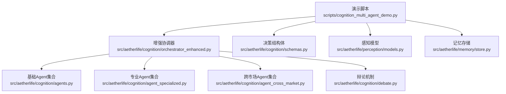
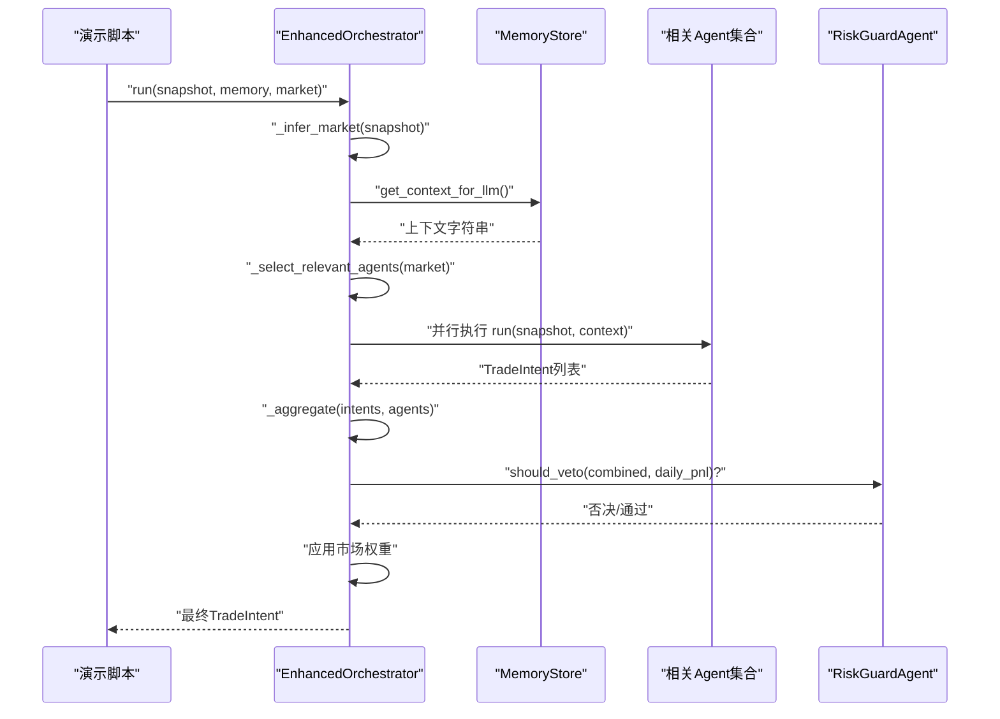
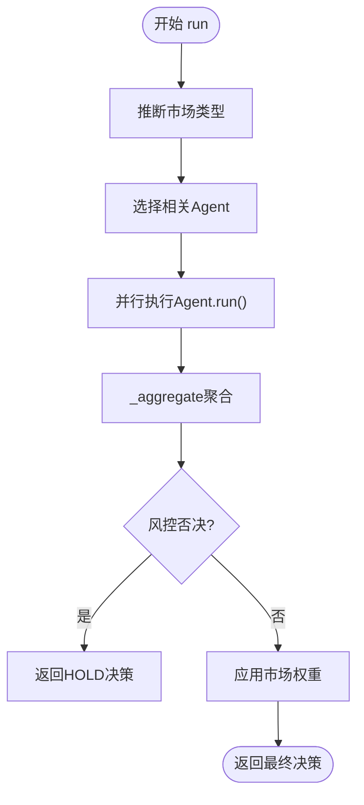
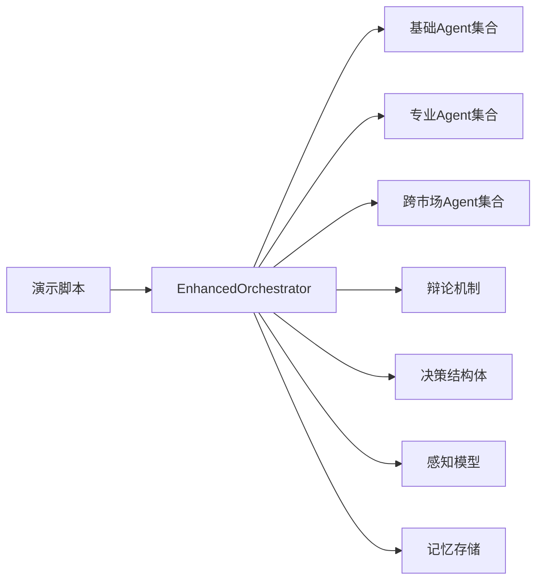

# 多代理认知演示

<cite>
**本文引用的文件列表**
- [cognition_multi_agent_demo.py](file://scripts/cognition_multi_agent_demo.py)
- [orchestrator_enhanced.py](file://src/aetherlife/cognition/orchestrator_enhanced.py)
- [agents.py](file://src/aetherlife/cognition/agents.py)
- [agent_specialized.py](file://src/aetherlife/cognition/agent_specialized.py)
- [agent_cross_market.py](file://src/aetherlife/cognition/agent_cross_market.py)
- [debate.py](file://src/aetherlife/cognition/debate.py)
- [schemas.py](file://src/aetherlife/cognition/schemas.py)
- [models.py](file://src/aetherlife/perception/models.py)
- [store.py](file://src/aetherlife/memory/store.py)
- [requirements.txt](file://requirements.txt)
</cite>

## 目录
1. [简介](#简介)
2. [项目结构](#项目结构)
3. [核心组件](#核心组件)
4. [架构总览](#架构总览)
5. [详细组件分析](#详细组件分析)
6. [依赖关系分析](#依赖关系分析)
7. [性能考量](#性能考量)
8. [故障排查指南](#故障排查指南)
9. [结论](#结论)
10. [附录](#附录)

## 简介
本文件面向“多代理认知演示脚本”的使用者与开发者，系统性讲解7个专业化Agent如何协作完成跨市场的智能决策，以及EnhancedOrchestrator多Agent协作机制的实现原理。文档覆盖以下要点：
- 7个专业Agent的功能与决策逻辑：A股专家、美股专家、加密货币专家、跨市场领先滞后、情绪分析专家等
- EnhancedOrchestrator的协作机制：Agent权重分配、决策融合算法、最终决策生成
- 单Agent演示：每个专业Agent如何基于MarketSnapshot和OrderBookSlice进行独立决策
- Orchestrator演示：多场景测试（加密货币BTC/USDT与A股600000）
- 权重动态调整：update_agent_weights与update_market_weights方法
- 运行方式、输出解读与调试技巧

## 项目结构
该演示脚本位于scripts目录，核心逻辑集中在src/aetherlife/cognition包中，涉及感知层数据模型、记忆存储、Agent基类与具体Agent实现、以及Orchestrator协调器。

图表来源
- [cognition_multi_agent_demo.py](file://scripts/cognition_multi_agent_demo.py#L1-L265)
- [orchestrator_enhanced.py](file://src/aetherlife/cognition/orchestrator_enhanced.py#L1-L323)
- [agents.py](file://src/aetherlife/cognition/agents.py#L1-L109)
- [agent_specialized.py](file://src/aetherlife/cognition/agent_specialized.py#L1-L352)
- [agent_cross_market.py](file://src/aetherlife/cognition/agent_cross_market.py#L1-L405)
- [debate.py](file://src/aetherlife/cognition/debate.py#L1-L100)
- [schemas.py](file://src/aetherlife/cognition/schemas.py#L1-L219)
- [models.py](file://src/aetherlife/perception/models.py#L1-L64)
- [store.py](file://src/aetherlife/memory/store.py#L1-L155)

章节来源
- [cognition_multi_agent_demo.py](file://scripts/cognition_multi_agent_demo.py#L1-L265)
- [orchestrator_enhanced.py](file://src/aetherlife/cognition/orchestrator_enhanced.py#L1-L323)

## 核心组件
- 增强协调器EnhancedOrchestrator：负责市场类型推断、相关Agent选择、并行执行、聚合决策、风控否决、市场权重应用与权重动态调整
- 基础Agent集合：做市Agent、风控Agent、订单流Agent、统计套利Agent、新闻情绪Agent
- 专业Agent集合：A股专家、美股专家、加密货币专家、跨市场领先滞后、外汇微策略、期货微策略、情绪分析专家
- 决策结构体：TradeIntent、Action、Market、Vote、DecisionContext等
- 感知模型：MarketSnapshot、OrderBookSlice等
- 记忆存储：MemoryStore，提供短期记忆摘要与风控上下文

章节来源
- [orchestrator_enhanced.py](file://src/aetherlife/cognition/orchestrator_enhanced.py#L21-L323)
- [agents.py](file://src/aetherlife/cognition/agents.py#L13-L109)
- [agent_specialized.py](file://src/aetherlife/cognition/agent_specialized.py#L17-L352)
- [agent_cross_market.py](file://src/aetherlife/cognition/agent_cross_market.py#L16-L405)
- [schemas.py](file://src/aetherlife/cognition/schemas.py#L12-L219)
- [models.py](file://src/aetherlife/perception/models.py#L15-L64)
- [store.py](file://src/aetherlife/memory/store.py#L43-L155)

## 架构总览
下图展示了从演示脚本到各Agent与协调器的交互流程，以及决策融合与风控否决的关键节点。

图表来源
- [cognition_multi_agent_demo.py](file://scripts/cognition_multi_agent_demo.py#L120-L195)
- [orchestrator_enhanced.py](file://src/aetherlife/cognition/orchestrator_enhanced.py#L84-L151)
- [store.py](file://src/aetherlife/memory/store.py#L134-L145)
- [agents.py](file://src/aetherlife/cognition/agents.py#L50-L68)

## 详细组件分析

### 增强协调器EnhancedOrchestrator
- 市场类型推断：根据交易所与符号特征自动识别CRYPTO/A_STOCK/US_STOCK/FOREX/FUTURES等
- 相关Agent选择：按市场类型映射到相应专业Agent集合
- 并行执行：使用asyncio.gather并行运行相关Agent
- 决策聚合：按action分组，以quantity_pct×confidence×权重加权求和，取最高分action，并限制最大仓位与置信度
- 风控否决：结合当日盈亏与置信度阈值进行一票否决
- 市场权重：对最终confidence乘以对应市场的权重系数
- 权重动态调整：update_agent_weights与update_market_weights方法支持实时调节

图表来源
- [orchestrator_enhanced.py](file://src/aetherlife/cognition/orchestrator_enhanced.py#L84-L151)
- [orchestrator_enhanced.py](file://src/aetherlife/cognition/orchestrator_enhanced.py#L235-L312)
- [agents.py](file://src/aetherlife/cognition/agents.py#L50-L68)

章节来源
- [orchestrator_enhanced.py](file://src/aetherlife/cognition/orchestrator_enhanced.py#L21-L323)

### 基础Agent集合
- MarketMakerAgent：基于订单簿spread与买卖压力给出HOLD/BUY/SELL
- RiskGuardAgent：仅做否决判断，不发起交易
- OrderFlowAgent：基于订单流深度给出HOLD/BUY/SELL
- StatArbAgent：单品种统计套利（当前返回HOLD）
- NewsSentimentAgent：新闻/情绪模块占位（当前返回HOLD）

章节来源
- [agents.py](file://src/aetherlife/cognition/agents.py#L25-L109)

### 专业Agent集合
- ChinaAStockAgent（A股专家）：交易时段检查、涨跌停检测、北向额度解析、印花税成本调整、基于订单簿的买卖压力分析
- GlobalStockAgent（美股专家）：流动性与订单流分析，适用于美股/港股/国际股票
- CryptoNanoAgent（加密货币专家）：高频、高灵敏度的订单流策略，适用于加密货币永续/mini合约

章节来源
- [agent_specialized.py](file://src/aetherlife/cognition/agent_specialized.py#L17-L352)

### 跨市场Agent集合
- CrossMarketLeadLagAgent：基于历史价格序列检测跨市场领先-滞后信号，建议目标市场与符号的行动
- ForexMicroAgent：外汇对点差敏感，基于订单流给出HOLD/BUY/SELL
- FuturesMicroAgent：期货基差与展期换月处理，基于订单流给出HOLD/BUY/SELL
- SentimentAgent：从上下文解析情绪分数，给出BUY/SELL/HOLD

章节来源
- [agent_cross_market.py](file://src/aetherlife/cognition/agent_cross_market.py#L16-L405)

### 决策结构体与感知模型
- TradeIntent：标准化的交易意图输出，包含action、market、symbol、quantity_pct、reason、confidence、metadata等
- Action/Market枚举：统一的动作与市场类型定义
- DecisionContext：供Agent使用的上下文输入，包含市场状态、情绪、风控状态等
- MarketSnapshot/OrderBookSlice：统一的市场快照与订单簿数据结构，提供mid_price与spread_bps等便捷方法

章节来源
- [schemas.py](file://src/aetherlife/cognition/schemas.py#L32-L219)
- [models.py](file://src/aetherlife/perception/models.py#L15-L64)

### 记忆存储与风控上下文
- MemoryStore：短期事件与决策的内存队列，提供get_context_for_llm生成LLM可用的上下文摘要
- get_daily_pnl：用于风控否决的当日盈亏汇总

章节来源
- [store.py](file://src/aetherlife/memory/store.py#L43-L155)

### 辩论机制（可选）
- BullAgent/BearAgent：分别从做多/做空视角解读同一快照，增强决策多样性
- JudgeAgent：根据双方confidence与action进行裁决，若分歧过大则HOLD

章节来源
- [debate.py](file://src/aetherlife/cognition/debate.py#L15-L100)

## 依赖关系分析
- 演示脚本依赖EnhancedOrchestrator、各类Agent、MarketSnapshot/OrderBookSlice、MemoryStore
- Orchestrator依赖Agent基类与各Agent实现、决策结构体、感知模型、记忆存储
- 各Agent依赖感知模型与决策结构体
- 记忆存储为Orchestrator与Agent提供上下文与风控数据

图表来源
- [cognition_multi_agent_demo.py](file://scripts/cognition_multi_agent_demo.py#L14-L25)
- [orchestrator_enhanced.py](file://src/aetherlife/cognition/orchestrator_enhanced.py#L10-L16)

章节来源
- [requirements.txt](file://requirements.txt#L1-L92)

## 性能考量
- 并行执行：Orchestrator使用asyncio.gather并行运行相关Agent，显著提升吞吐
- 决策聚合：按action分组加权求和，避免复杂排序，时间复杂度近似O(N)
- 市场权重：在聚合后一次性乘以权重，开销极小
- 记忆存储：deque与固定长度列表，避免内存膨胀
- 辩论机制：可选启用，启用时会增加一次并行执行与一次裁决

## 故障排查指南
- 所有Agent执行失败：聚合阶段过滤异常后返回HOLD，置信度为0
- 订单簿缺失：多数Agent在无订单簿时返回HOLD，需检查感知层数据源
- 风控否决：当daily_pnl低于阈值或confidence过低时，Orchestrator会返回HOLD
- 权重设置异常：update_agent_weights/update_market_weights对权重做了边界约束，确保合法范围
- 日志与调试：演示脚本使用标准日志输出，便于定位问题

章节来源
- [orchestrator_enhanced.py](file://src/aetherlife/cognition/orchestrator_enhanced.py#L114-L151)
- [agents.py](file://src/aetherlife/cognition/agents.py#L50-L68)
- [store.py](file://src/aetherlife/memory/store.py#L140-L145)

## 结论
本演示脚本完整展示了7个专业化Agent在多市场环境下的协作决策过程，EnhancedOrchestrator通过并行执行、加权聚合与风控否决，形成稳健的最终决策。通过update_agent_weights与update_market_weights，系统具备动态权重调节能力，适配不同市场与策略阶段。建议在生产环境中结合真实数据源与更丰富的策略模块，逐步引入LLM与强化学习以提升决策质量。

## 附录

### 运行方法
- 环境准备：安装依赖（见requirements.txt）
- 运行演示：在项目根目录执行演示脚本
- 输出解读：日志包含各Agent决策与最终决策，包含动作、市场、仓位、理由与置信度

章节来源
- [requirements.txt](file://requirements.txt#L1-L92)
- [cognition_multi_agent_demo.py](file://scripts/cognition_multi_agent_demo.py#L238-L265)

### 单Agent演示要点
- A股专家：检查交易时段、涨跌停、北向额度与印花税成本，基于订单簿买卖压力给出决策
- 加密货币专家：对价差与订单流更敏感，适合高频策略
- 全球股票专家：适用于美股/港股/国际股票，关注流动性与订单流
- 情绪分析专家：从上下文解析情绪分数，给出BUY/SELL/HOLD

章节来源
- [cognition_multi_agent_demo.py](file://scripts/cognition_multi_agent_demo.py#L35-L118)
- [agent_specialized.py](file://src/aetherlife/cognition/agent_specialized.py#L36-L205)
- [agent_cross_market.py](file://src/aetherlife/cognition/agent_cross_market.py#L288-L374)

### Orchestrator演示要点
- 场景1：加密货币BTC/USDT，最终决策包含动作、市场、仓位、理由与置信度
- 场景2：A股600000（浦发银行），包含24小时行情，最终决策同上

章节来源
- [cognition_multi_agent_demo.py](file://scripts/cognition_multi_agent_demo.py#L120-L195)

### 权重动态调整演示
- 默认权重：各Agent初始权重均为1.0
- 提高情绪分析Agent权重：从1.0提升至2.0，观察最终决策变化
- 降低加密货币市场权重：从1.0降至0.6，观察最终置信度变化

章节来源
- [cognition_multi_agent_demo.py](file://scripts/cognition_multi_agent_demo.py#L197-L236)
- [orchestrator_enhanced.py](file://src/aetherlife/cognition/orchestrator_enhanced.py#L314-L322)