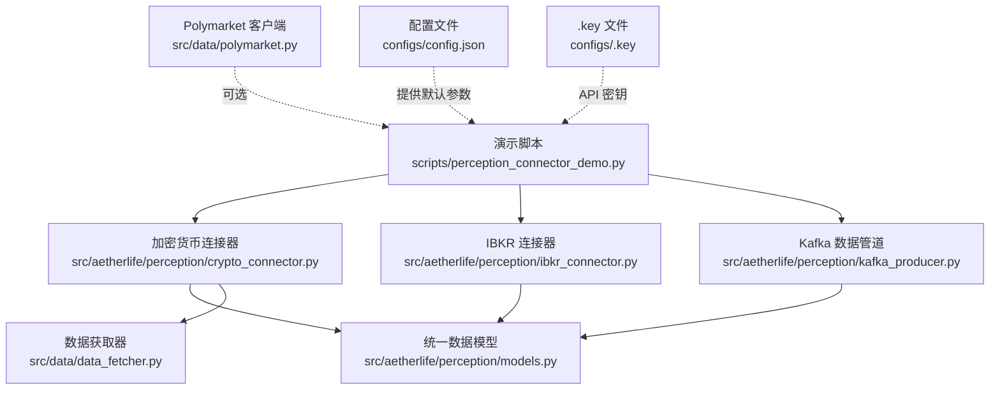
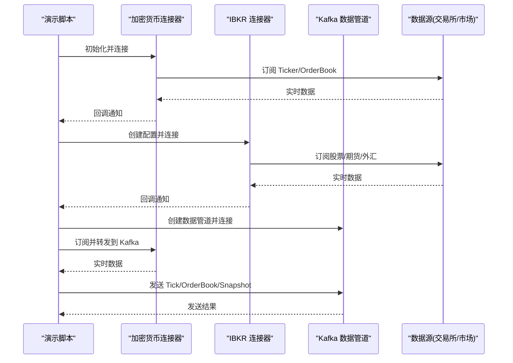
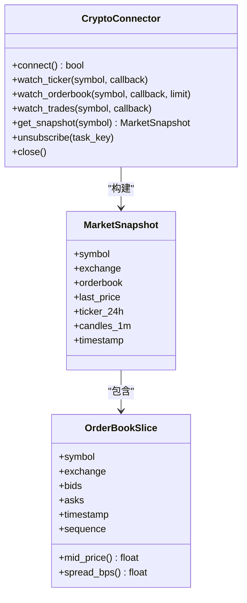
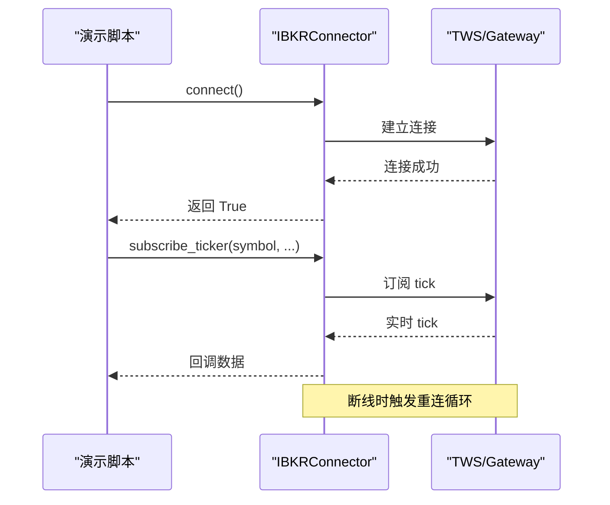
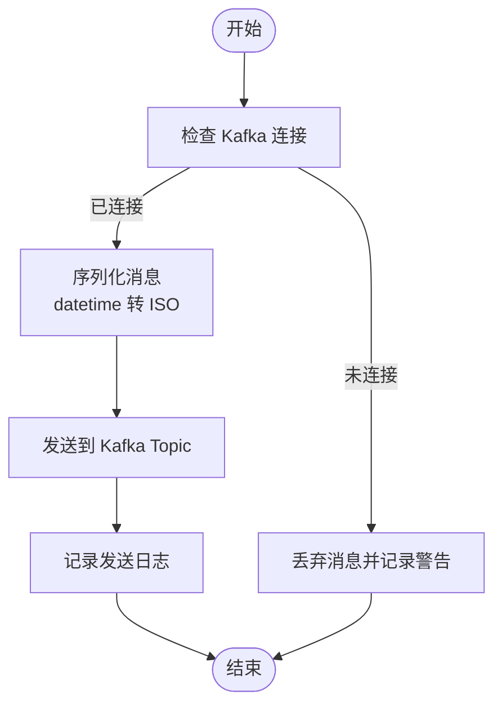
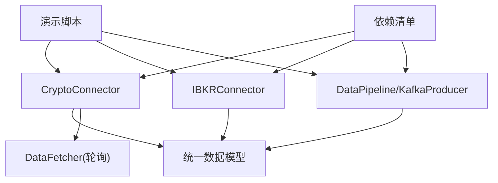

# 感知连接器演示

<cite>
**本文引用的文件**
- [scripts/perception_connector_demo.py](file://scripts/perception_connector_demo.py)
- [src/aetherlife/perception/crypto_connector.py](file://src/aetherlife/perception/crypto_connector.py)
- [src/aetherlife/perception/ibkr_connector.py](file://src/aetherlife/perception/ibkr_connector.py)
- [src/aetherlife/perception/kafka_producer.py](file://src/aetherlife/perception/kafka_producer.py)
- [src/aetherlife/perception/models.py](file://src/aetherlife/perception/models.py)
- [src/aetherlife/perception/fabric.py](file://src/aetherlife/perception/fabric.py)
- [src/data/data_fetcher.py](file://src/data/data_fetcher.py)
- [src/data/polymarket.py](file://src/data/polymarket.py)
- [requirements.txt](file://requirements.txt)
- [configs/config.json](file://configs/config.json)
- [configs/.key](file://configs/.key)
</cite>

## 目录
1. [简介](#简介)
2. [项目结构](#项目结构)
3. [核心组件](#核心组件)
4. [架构总览](#架构总览)
5. [详细组件分析](#详细组件分析)
6. [依赖关系分析](#依赖关系分析)
7. [性能考量](#性能考量)
8. [故障排查指南](#故障排查指南)
9. [结论](#结论)
10. [附录](#附录)

## 简介
本文件面向开发者与运维人员，系统性说明“感知连接器演示脚本”的使用方法与实现原理，涵盖以下主题：
- 如何初始化与使用 DataFabric 数据连接器
- 如何建立与维护多数据源连接（Binance、OKX、Polymarket 等）
- 实时数据获取流程（市场快照、订单簿切片、价格数据）
- 连接状态管理（连接建立、心跳检测、断线重连、错误处理）
- 运行前置条件（API 密钥、网络、权限）
- 输出数据格式与含义（MarketSnapshot、时间戳、数据校验）
- 常见连接问题排查与解决方案

## 项目结构
演示脚本位于 scripts 目录，核心感知层组件集中在 src/aetherlife/perception 下，数据源适配器位于 src/data。整体采用分层设计：演示层负责编排与可视化，感知层负责统一数据模型与连接管理，数据层负责具体交易所/市场的 API 适配。

图表来源
- [scripts/perception_connector_demo.py](file://scripts/perception_connector_demo.py#L1-L211)
- [src/aetherlife/perception/crypto_connector.py](file://src/aetherlife/perception/crypto_connector.py#L1-L369)
- [src/aetherlife/perception/ibkr_connector.py](file://src/aetherlife/perception/ibkr_connector.py#L1-L322)
- [src/aetherlife/perception/kafka_producer.py](file://src/aetherlife/perception/kafka_producer.py#L1-L287)
- [src/aetherlife/perception/models.py](file://src/aetherlife/perception/models.py#L1-L64)
- [src/data/data_fetcher.py](file://src/data/data_fetcher.py#L1-L434)
- [src/data/polymarket.py](file://src/data/polymarket.py#L1-L284)
- [configs/config.json](file://configs/config.json#L1-L28)
- [configs/.key](file://configs/.key#L1-L1)

章节来源
- [scripts/perception_connector_demo.py](file://scripts/perception_connector_demo.py#L1-L211)
- [requirements.txt](file://requirements.txt#L1-L92)

## 核心组件
- 加密货币连接器（CryptoConnector）：基于 CCXT Pro，支持 Binance、Bybit、OKX 的 WebSocket 实时数据订阅与单次快照获取，具备自动重连能力。
- IBKR 连接器（IBKRConnector）：基于 ib_insync，连接 TWS/Gateway，支持股票、期货、外汇及 A 股（Stock Connect）的实时行情与订单簿快照。
- Kafka 数据管道（DataPipeline/KafkaProducer）：将标准化后的 Tick、OrderBook、Trades、Snapshot 发布到 Kafka/Redpanda，支持去重与批量发送。
- 统一数据模型（models.py）：定义 MarketSnapshot、OrderBookSlice、OHLCVCandle 等数据结构，提供 mid_price、spread_bps 等派生指标。
- DataFabric：统一入口，封装轮询式数据拉取（Phase 0），为后续 WebSocket 推送做准备。
- Polymarket 客户端：提供预测市场数据获取与策略扫描（可选）。

章节来源
- [src/aetherlife/perception/crypto_connector.py](file://src/aetherlife/perception/crypto_connector.py#L23-L369)
- [src/aetherlife/perception/ibkr_connector.py](file://src/aetherlife/perception/ibkr_connector.py#L36-L322)
- [src/aetherlife/perception/kafka_producer.py](file://src/aetherlife/perception/kafka_producer.py#L26-L287)
- [src/aetherlife/perception/models.py](file://src/aetherlife/perception/models.py#L15-L64)
- [src/aetherlife/perception/fabric.py](file://src/aetherlife/perception/fabric.py#L13-L88)
- [src/data/polymarket.py](file://src/data/polymarket.py#L13-L284)

## 架构总览
演示脚本按顺序执行三大演示：加密货币连接器、IBKR 连接器、Kafka 数据管道。每个演示均展示连接建立、实时订阅与数据消费，并在最后进行资源清理。

图表来源
- [scripts/perception_connector_demo.py](file://scripts/perception_connector_demo.py#L22-L200)
- [src/aetherlife/perception/crypto_connector.py](file://src/aetherlife/perception/crypto_connector.py#L50-L369)
- [src/aetherlife/perception/ibkr_connector.py](file://src/aetherlife/perception/ibkr_connector.py#L59-L322)
- [src/aetherlife/perception/kafka_producer.py](file://src/aetherlife/perception/kafka_producer.py#L54-L287)

## 详细组件分析

### 加密货币连接器（CryptoConnector）
- 初始化与连接
  - 支持 Binance、Bybit、OKX，测试网/正式网切换通过配置 URL。
  - 自动加载市场并标记连接状态。
- 实时订阅
  - Ticker：标准化字段包含最新价、买卖价、成交量、24h 涨跌等，回调异步/同步均可。
  - OrderBook：标准化 bids/asks，支持 limit 深度，包含 nonce 与时间戳。
  - Trades：标准化每笔成交，包含价格、数量、方向、时间戳。
- 快照获取
  - 并行获取 ticker 与 orderbook，构建 MarketSnapshot，包含 24h 指标与 K 线片段。
- 断线与重连
  - 监听循环捕获异常后等待 5 秒并触发 connect() 重连。
- 资源清理
  - 取消所有订阅任务，关闭交易所连接，清空内部状态。

图表来源
- [src/aetherlife/perception/crypto_connector.py](file://src/aetherlife/perception/crypto_connector.py#L23-L369)
- [src/aetherlife/perception/models.py](file://src/aetherlife/perception/models.py#L15-L64)

章节来源
- [src/aetherlife/perception/crypto_connector.py](file://src/aetherlife/perception/crypto_connector.py#L50-L369)
- [src/aetherlife/perception/models.py](file://src/aetherlife/perception/models.py#L15-L64)

### IBKR 连接器（IBKRConnector）
- 连接建立
  - 通过 ib_insync 连接 TWS/Gateway，支持纸面与实盘端口，设置断线回调。
- 实时订阅
  - 支持股票（STK）、期货（FUT）、外汇（CASH）与 A 股（Stock Connect）。
  - 订阅 tick 数据并通过回调传递标准化字段。
- 快照获取
  - 获取单次行情与订单簿，构建 MarketSnapshot。
- 断线重连
  - 断线事件触发指数退避重连，最多尝试若干次，并恢复订阅。
- 资源清理
  - 断开连接，清理订阅与回调。

图表来源
- [src/aetherlife/perception/ibkr_connector.py](file://src/aetherlife/perception/ibkr_connector.py#L59-L115)
- [src/aetherlife/perception/ibkr_connector.py](file://src/aetherlife/perception/ibkr_connector.py#L158-L284)

章节来源
- [src/aetherlife/perception/ibkr_connector.py](file://src/aetherlife/perception/ibkr_connector.py#L36-L322)

### Kafka 数据管道（DataPipeline/KafkaProducer）
- 生产者
  - 支持 Tick、OrderBook、Trades、Snapshot 四类 Topic，启用 gzip 压缩与批量发送。
  - 发送前将 datetime 序列化为 ISO 字符串，保证下游解析稳定。
- 数据管道
  - Tick 去重（基于 timestamp），OrderBook 去重（基于 nonce），Trades 不去重。
  - 提供 flush 方法确保缓冲区消息全部发送。
- 连接与关闭
  - connect() 建立连接，close() 停止生产者并置连接状态为 False。

图表来源
- [src/aetherlife/perception/kafka_producer.py](file://src/aetherlife/perception/kafka_producer.py#L172-L210)

章节来源
- [src/aetherlife/perception/kafka_producer.py](file://src/aetherlife/perception/kafka_producer.py#L26-L287)

### DataFabric（统一入口）
- 通过工厂函数创建对应交易所的数据获取器，聚合订单簿、24h 行情与 K 线，统一输出 MarketSnapshot。
- 为 Phase 1 WebSocket 推送做准备，当前为轮询模式。

章节来源
- [src/aetherlife/perception/fabric.py](file://src/aetherlife/perception/fabric.py#L13-L88)

### Polymarket 客户端（可选）
- 提供市场列表、订单簿、价格、24h 行情等接口，支持趋势市场扫描与简单策略分析。
- 可作为预测市场数据源补充到演示或策略模块。

章节来源
- [src/data/polymarket.py](file://src/data/polymarket.py#L13-L284)

## 依赖关系分析
- 演示脚本依赖感知层连接器与 Kafka 管道，以及统一数据模型。
- CryptoConnector 依赖 CCXT Pro 与数据获取器（轮询模式下）。
- IBKRConnector 依赖 ib_insync。
- KafkaProducer 依赖 aiokafka。
- Polymarket 客户端依赖 aiohttp。

图表来源
- [requirements.txt](file://requirements.txt#L28-L49)
- [scripts/perception_connector_demo.py](file://scripts/perception_connector_demo.py#L22-L200)

章节来源
- [requirements.txt](file://requirements.txt#L1-L92)

## 性能考量
- 并行获取：CryptoConnector 在快照阶段并行获取 ticker 与 orderbook，降低等待时间。
- 批量发送：KafkaProducer 使用 linger_ms 与 gzip 压缩，减少网络往返与带宽占用。
- 去重策略：DataPipeline 对 Tick（基于时间戳）与 OrderBook（基于 nonce）进行去重，避免重复数据进入下游。
- 心跳与超时：各连接器设置合理的 heartbeat 与超时，提升稳定性。
- 资源回收：演示脚本在完成后主动关闭连接与任务，避免资源泄漏。

## 故障排查指南
- 无法导入第三方库
  - 现象：ImportError 或 ModuleNotFoundError。
  - 处理：安装 requirements 中缺失的包，特别是 ccxt、aiokafka、ib_insync 等。
  - 参考：[requirements.txt](file://requirements.txt#L28-L49)
- 无法连接 Kafka
  - 现象：Kafka 连接失败日志。
  - 处理：确认 Kafka/Redpanda 地址与端口正确，网络可达；检查 Topic 是否存在或由服务端自动创建。
  - 参考：[src/aetherlife/perception/kafka_producer.py](file://src/aetherlife/perception/kafka_producer.py#L54-L75)
- 无法连接 IBKR TWS/Gateway
  - 现象：连接超时或断开。
  - 处理：确认 TWS/Gateway 已启动，端口与 clientId 正确；若为纸面交易，使用 7497 端口。
  - 参考：[src/aetherlife/perception/ibkr_connector.py](file://src/aetherlife/perception/ibkr_connector.py#L59-L86)
- 无法连接加密货币交易所
  - 现象：CCXT 连接失败或加载市场异常。
  - 处理：检查测试网/正式网配置、API 密钥是否正确；确认网络可达。
  - 参考：[src/aetherlife/perception/crypto_connector.py](file://src/aetherlife/perception/crypto_connector.py#L50-L85)
- 数据为空或字段缺失
  - 现象：返回的 MarketSnapshot 或 Tick 数据字段不完整。
  - 处理：检查上游交易所返回格式，必要时增加容错与默认值；确认订阅深度与 symbol 格式。
  - 参考：[src/aetherlife/perception/models.py](file://src/aetherlife/perception/models.py#L15-L64)
- 日志与调试
  - 使用演示脚本中的日志级别查看连接状态、订阅进度与错误信息。
  - 参考：[scripts/perception_connector_demo.py](file://scripts/perception_connector_demo.py#L14-L19)

章节来源
- [requirements.txt](file://requirements.txt#L28-L49)
- [src/aetherlife/perception/kafka_producer.py](file://src/aetherlife/perception/kafka_producer.py#L54-L75)
- [src/aetherlife/perception/ibkr_connector.py](file://src/aetherlife/perception/ibkr_connector.py#L59-L86)
- [src/aetherlife/perception/crypto_connector.py](file://src/aetherlife/perception/crypto_connector.py#L50-L85)
- [src/aetherlife/perception/models.py](file://src/aetherlife/perception/models.py#L15-L64)
- [scripts/perception_connector_demo.py](file://scripts/perception_connector_demo.py#L14-L19)

## 结论
感知连接器演示脚本展示了如何在统一数据模型之上，接入多数据源并实现稳定的实时数据流。通过 CryptoConnector、IBKRConnector 与 Kafka 数据管道的组合，开发者可以快速搭建从数据采集到消息发布的完整链路。建议在生产环境中结合断线重连、去重与压缩策略，持续监控日志与指标，确保系统稳定运行。

## 附录

### 运行前置条件
- Python 依赖
  - 安装 requirements 中列出的所有依赖，特别是 ccxt、aiokafka、ib_insync、aiohttp 等。
  - 参考：[requirements.txt](file://requirements.txt#L1-L92)
- API 密钥与配置
  - 若使用加密货币连接器，可在 create_crypto_connector 中传入 API 密钥与密文。
  - 若使用 Polymarket，可在客户端构造时传入 API Key。
  - 参考：[configs/.key](file://configs/.key#L1-L1)
- 网络与服务
  - Kafka/Redpanda：确保地址与端口可达。
  - IBKR：确保 TWS/Gateway 已启动并可访问。
  - 交易所：确保网络可达，测试网/正式网配置正确。
- 数据权限
  - 确认账户具有相应数据权限与订阅额度。

### 输出数据格式与含义
- MarketSnapshot
  - 字段：symbol、exchange、orderbook（可选）、last_price、ticker_24h、candles_1m（可选）、timestamp。
  - 用途：一次性消费的全量市场快照。
  - 参考：[src/aetherlife/perception/models.py](file://src/aetherlife/perception/models.py#L55-L64)
- OrderBookSlice
  - 字段：bids/asks（价格、数量元组）、timestamp、sequence（可选）。
  - 指标：mid_price、spread_bps。
  - 参考：[src/aetherlife/perception/models.py](file://src/aetherlife/perception/models.py#L16-L37)
- 时间戳处理
  - 所有 datetime 字段在发送到 Kafka 前会被序列化为 ISO 字符串，便于下游解析。
  - 参考：[src/aetherlife/perception/kafka_producer.py](file://src/aetherlife/perception/kafka_producer.py#L186-L189)

### 常见问题与解决方案
- 连接不稳定
  - 增大心跳间隔与超时，启用指数退避重连。
  - 参考：[src/aetherlife/perception/ibkr_connector.py](file://src/aetherlife/perception/ibkr_connector.py#L96-L115)
- 数据重复
  - 使用 DataPipeline 的去重逻辑；Tick 基于时间戳，OrderBook 基于 nonce。
  - 参考：[src/aetherlife/perception/kafka_producer.py](file://src/aetherlife/perception/kafka_producer.py#L237-L270)
- 性能瓶颈
  - 启用 gzip 压缩与批量发送；合理设置订阅深度与频率。
  - 参考：[src/aetherlife/perception/kafka_producer.py](file://src/aetherlife/perception/kafka_producer.py#L57-L64)