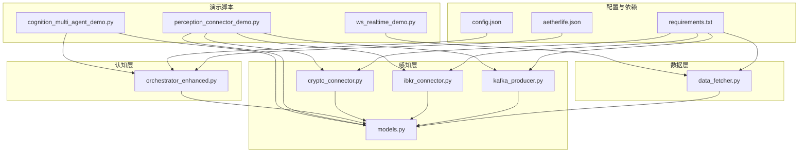
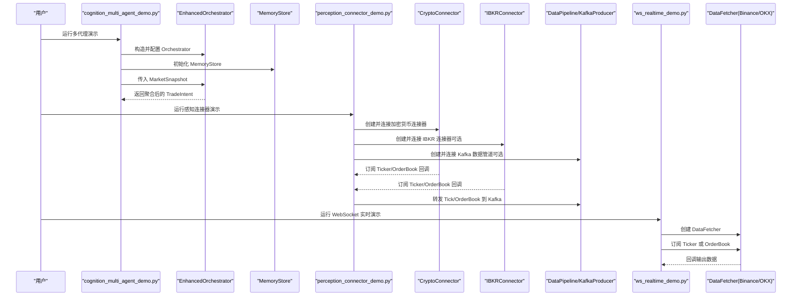
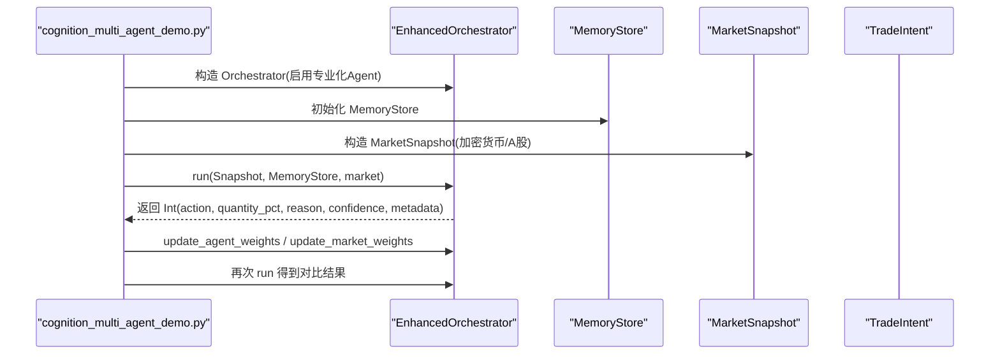
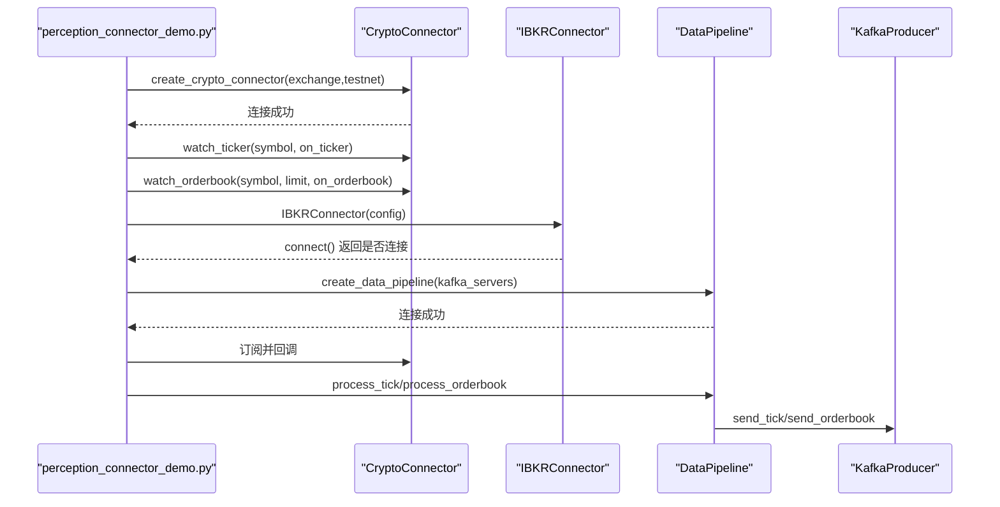
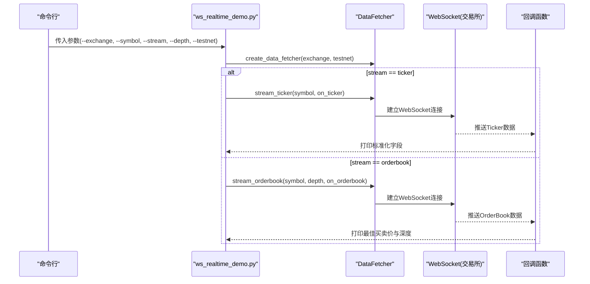
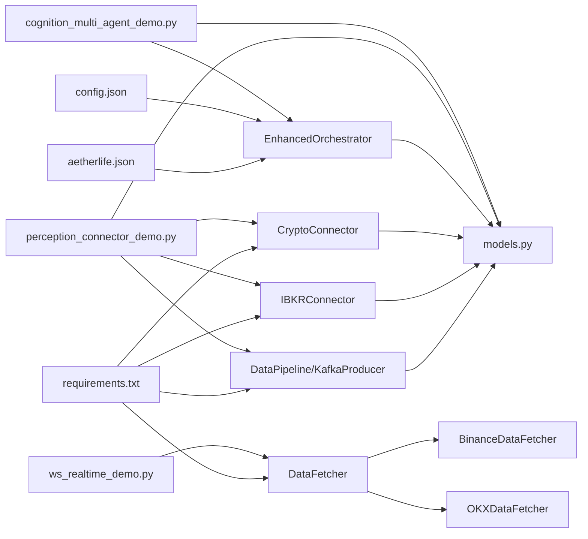

# 演示脚本

<cite>
**本文引用的文件**
- [cognition_multi_agent_demo.py](file://scripts/cognition_multi_agent_demo.py)
- [perception_connector_demo.py](file://scripts/perception_connector_demo.py)
- [ws_realtime_demo.py](file://scripts/ws_realtime_demo.py)
- [orchestrator_enhanced.py](file://src/aetherlife/cognition/orchestrator_enhanced.py)
- [crypto_connector.py](file://src/aetherlife/perception/crypto_connector.py)
- [ibkr_connector.py](file://src/aetherlife/perception/ibkr_connector.py)
- [kafka_producer.py](file://src/aetherlife/perception/kafka_producer.py)
- [models.py](file://src/aetherlife/perception/models.py)
- [data_fetcher.py](file://src/data/data_fetcher.py)
- [requirements.txt](file://requirements.txt)
- [config.json](file://configs/config.json)
- [aetherlife.json](file://configs/aetherlife.json)
- [PERCEPTION_UPGRADE_GUIDE.md](file://docs/PERCEPTION_UPGRADE_GUIDE.md)
</cite>

## 目录
1. [简介](#简介)
2. [项目结构](#项目结构)
3. [核心组件](#核心组件)
4. [架构总览](#架构总览)
5. [详细组件分析](#详细组件分析)
6. [依赖关系分析](#依赖关系分析)
7. [性能与稳定性建议](#性能与稳定性建议)
8. [故障排查指南](#故障排查指南)
9. [结论](#结论)
10. [附录：参数与配置](#附录参数与配置)

## 简介
本文件面向量化交易系统的演示脚本使用，涵盖以下三个脚本：
- 多代理认知演示脚本：展示多 Agent 协同决策、权重动态调整与结果聚合。
- 感知连接器演示脚本：展示加密货币、IBKR、Kafka 的连接与数据订阅流程。
- WebSocket 实时数据流演示脚本：展示 Binance/OKX 的 WebSocket 行情与订单簿订阅。

文档将从系统架构、数据流、控制逻辑、错误处理、性能与调试等方面进行深入说明，并提供运行前置条件、参数配置与自定义选项，帮助开发者快速上手并按需定制。

## 项目结构
演示脚本位于 scripts/ 目录，核心业务逻辑分布在 src/ 下的认知与感知子系统，配置文件位于 configs/，依赖清单在 requirements.txt。

图表来源
- [cognition_multi_agent_demo.py](file://scripts/cognition_multi_agent_demo.py#L1-L265)
- [perception_connector_demo.py](file://scripts/perception_connector_demo.py#L1-L211)
- [ws_realtime_demo.py](file://scripts/ws_realtime_demo.py#L1-L62)
- [orchestrator_enhanced.py](file://src/aetherlife/cognition/orchestrator_enhanced.py#L21-L322)
- [crypto_connector.py](file://src/aetherlife/perception/crypto_connector.py#L23-L370)
- [ibkr_connector.py](file://src/aetherlife/perception/ibkr_connector.py#L36-L322)
- [kafka_producer.py](file://src/aetherlife/perception/kafka_producer.py#L1-L286)
- [models.py](file://src/aetherlife/perception/models.py#L1-L64)
- [data_fetcher.py](file://src/data/data_fetcher.py#L1-L434)
- [config.json](file://configs/config.json#L1-L28)
- [aetherlife.json](file://configs/aetherlife.json#L1-L17)
- [requirements.txt](file://requirements.txt#L1-L70)

章节来源
- [cognition_multi_agent_demo.py](file://scripts/cognition_multi_agent_demo.py#L1-L265)
- [perception_connector_demo.py](file://scripts/perception_connector_demo.py#L1-L211)
- [ws_realtime_demo.py](file://scripts/ws_realtime_demo.py#L1-L62)

## 核心组件
- 多代理协调器（EnhancedOrchestrator）：负责聚合多个专业化 Agent 的决策，支持权重动态调整与可选辩论模式。
- 感知连接器族：包含加密货币连接器、IBKR 连接器、Kafka 数据管道，统一输出 MarketSnapshot/OrderBookSlice 等数据模型。
- WebSocket 数据获取器：封装 Binance/OKX 的 WebSocket 行情与订单簿订阅，提供回调驱动的数据流。

章节来源
- [orchestrator_enhanced.py](file://src/aetherlife/cognition/orchestrator_enhanced.py#L21-L322)
- [crypto_connector.py](file://src/aetherlife/perception/crypto_connector.py#L23-L370)
- [ibkr_connector.py](file://src/aetherlife/perception/ibkr_connector.py#L36-L322)
- [kafka_producer.py](file://src/aetherlife/perception/kafka_producer.py#L1-L286)
- [models.py](file://src/aetherlife/perception/models.py#L1-L64)
- [data_fetcher.py](file://src/data/data_fetcher.py#L1-L434)

## 架构总览
下图展示了三个演示脚本与核心模块之间的交互关系与数据流向。

图表来源
- [cognition_multi_agent_demo.py](file://scripts/cognition_multi_agent_demo.py#L120-L235)
- [perception_connector_demo.py](file://scripts/perception_connector_demo.py#L22-L200)
- [ws_realtime_demo.py](file://scripts/ws_realtime_demo.py#L30-L58)
- [orchestrator_enhanced.py](file://src/aetherlife/cognition/orchestrator_enhanced.py#L21-L322)
- [crypto_connector.py](file://src/aetherlife/perception/crypto_connector.py#L87-L216)
- [ibkr_connector.py](file://src/aetherlife/perception/ibkr_connector.py#L36-L322)
- [kafka_producer.py](file://src/aetherlife/perception/kafka_producer.py#L220-L286)
- [data_fetcher.py](file://src/data/data_fetcher.py#L188-L396)

## 详细组件分析

### 多代理认知演示脚本（cognition_multi_agent_demo.py）
功能概述
- 展示单个 Agent 决策（A 股、加密货币、美股、情绪分析）。
- 展示 Orchestrator 多 Agent 协作与聚合决策。
- 展示动态调整 Agent 权重与市场权重对最终决策的影响。

关键流程与要点
- 单 Agent 演示：分别构造不同市场的 MarketSnapshot，调用对应 Agent 的 run 方法，输出动作、仓位、理由与置信度。
- Orchestrator 协作：创建 EnhancedOrchestrator，注入 MemoryStore，针对不同市场（加密货币、A 股）生成 TradeIntent。
- 权重动态调整：通过 update_agent_weights 与 update_market_weights 修改权重，观察对最终决策与置信度的影响。

图表来源
- [cognition_multi_agent_demo.py](file://scripts/cognition_multi_agent_demo.py#L35-L118)
- [cognition_multi_agent_demo.py](file://scripts/cognition_multi_agent_demo.py#L120-L195)
- [cognition_multi_agent_demo.py](file://scripts/cognition_multi_agent_demo.py#L197-L236)
- [orchestrator_enhanced.py](file://src/aetherlife/cognition/orchestrator_enhanced.py#L21-L322)

章节来源
- [cognition_multi_agent_demo.py](file://scripts/cognition_multi_agent_demo.py#L35-L236)
- [orchestrator_enhanced.py](file://src/aetherlife/cognition/orchestrator_enhanced.py#L21-L322)

### 感知连接器演示脚本（perception_connector_demo.py）
功能概述
- 加密货币连接器演示：创建连接器、获取快照、订阅 Ticker/OrderBook 并统计回调次数。
- IBKR 连接器演示：创建连接器、尝试连接 TWS/Gateway、订阅美股与 A 股行情。
- Kafka 数据管道演示：创建数据管道与加密货币连接器，订阅并转发 Tick/OrderBook 到 Kafka。

关键流程与要点
- 加密货币：通过 create_crypto_connector 创建 CryptoConnector，使用 watch_ticker/watch_orderbook 订阅，回调中计算中间价与档位数量。
- IBKR：通过 IBKRConnector 连接 TWS/Gateway，若未连接则跳过演示；支持股票、期货、外汇与 A 股（Stock Connect）。
- Kafka：通过 create_data_pipeline 创建 DataPipeline，订阅数据并通过 process_tick/process_orderbook 转发到 Kafka。

图表来源
- [perception_connector_demo.py](file://scripts/perception_connector_demo.py#L22-L77)
- [perception_connector_demo.py](file://scripts/perception_connector_demo.py#L79-L135)
- [perception_connector_demo.py](file://scripts/perception_connector_demo.py#L137-L182)
- [crypto_connector.py](file://src/aetherlife/perception/crypto_connector.py#L35-L370)
- [ibkr_connector.py](file://src/aetherlife/perception/ibkr_connector.py#L36-L322)
- [kafka_producer.py](file://src/aetherlife/perception/kafka_producer.py#L220-L286)

章节来源
- [perception_connector_demo.py](file://scripts/perception_connector_demo.py#L22-L182)
- [crypto_connector.py](file://src/aetherlife/perception/crypto_connector.py#L35-L370)
- [ibkr_connector.py](file://src/aetherlife/perception/ibkr_connector.py#L36-L322)
- [kafka_producer.py](file://src/aetherlife/perception/kafka_producer.py#L220-L286)

### WebSocket 实时数据流演示脚本（ws_realtime_demo.py）
功能概述
- 基于 DataFetcher 封装 Binance/OKX 的 WebSocket 行情与订单簿订阅。
- 支持命令行参数：交易所、交易对、订阅类型、深度、测试网开关。
- 输出格式：Ticker 输出 bid/ask/last；OrderBook 输出最佳买卖价与深度。

关键流程与要点
- 参数解析：解析 --exchange/--symbol/--stream/--depth/--testnet。
- 数据获取器：create_data_fetcher(exchange, testnet) 返回 BinanceDataFetcher 或 OKXDataFetcher。
- 订阅回调：根据 stream 类型选择 stream_ticker 或 stream_orderbook，并在回调中打印标准化字段。

图表来源
- [ws_realtime_demo.py](file://scripts/ws_realtime_demo.py#L20-L58)
- [data_fetcher.py](file://src/data/data_fetcher.py#L188-L396)

章节来源
- [ws_realtime_demo.py](file://scripts/ws_realtime_demo.py#L20-L58)
- [data_fetcher.py](file://src/data/data_fetcher.py#L188-L396)

## 依赖关系分析
- 演示脚本依赖 src/ 下的认知与感知模块，统一使用 MarketSnapshot/OrderBookSlice 等数据模型。
- WebSocket 实时演示直接依赖 DataFetcher 抽象，内部区分 Binance 与 OKX 的实现。
- 感知连接器演示依赖 CryptoConnector、IBKRConnector、DataPipeline/KafkaProducer，后者依赖 aiokafka 与 ccxt.pro。
- 配置文件提供默认策略、风控参数与 AetherLife 的认知与风控开关。

图表来源
- [cognition_multi_agent_demo.py](file://scripts/cognition_multi_agent_demo.py#L14-L25)
- [perception_connector_demo.py](file://scripts/perception_connector_demo.py#L24-L140)
- [ws_realtime_demo.py](file://scripts/ws_realtime_demo.py#L17-L17)
- [orchestrator_enhanced.py](file://src/aetherlife/cognition/orchestrator_enhanced.py#L21-L65)
- [crypto_connector.py](file://src/aetherlife/perception/crypto_connector.py#L23-L50)
- [ibkr_connector.py](file://src/aetherlife/perception/ibkr_connector.py#L36-L58)
- [kafka_producer.py](file://src/aetherlife/perception/kafka_producer.py#L1-L22)
- [models.py](file://src/aetherlife/perception/models.py#L1-L64)
- [data_fetcher.py](file://src/data/data_fetcher.py#L17-L71)
- [config.json](file://configs/config.json#L1-L28)
- [aetherlife.json](file://configs/aetherlife.json#L1-L17)
- [requirements.txt](file://requirements.txt#L1-L70)

章节来源
- [requirements.txt](file://requirements.txt#L1-L70)
- [config.json](file://configs/config.json#L1-L28)
- [aetherlife.json](file://configs/aetherlife.json#L1-L17)

## 性能与稳定性建议
- 连接池与会话复用：DataFetcher 与感知连接器均维护 aiohttp 会话与 WebSocket 连接，避免频繁创建销毁带来的开销。
- 回调异步化：Ticker/OrderBook 订阅回调应尽量保持轻量，避免阻塞事件循环。
- 去重与缓冲：Kafka 数据管道对 Tick/OrderBook 进行去重与时序对齐，建议在生产环境中设置合适的缓冲大小与刷新周期。
- 超时与心跳：WebSocket 订阅设置了心跳与超时，异常断线会自动重连，确保长时间稳定运行。
- 日志级别：建议在演示阶段使用 INFO 级别，生产环境可根据需要调整至 WARNING/ERROR 以减少日志噪声。

[本节为通用建议，不直接分析具体文件]

## 故障排查指南
常见问题与定位方法
- WebSocket 订阅无数据
  - 检查网络与代理设置，确认交易所 WebSocket 地址可达。
  - 查看 DataFetcher 的 stream_* 是否正确调用回调。
- 订阅回调报错
  - 检查回调函数签名与异步性，确保回调能被正确调用。
  - 观察日志中的“Ticker 回调失败”“OrderBook 回调失败”等错误信息。
- Kafka 发送失败
  - 确认 Kafka/Redpanda 服务正常，Topic 已创建。
  - 检查 aiokafka 依赖是否安装，序列化/压缩配置是否匹配消费者端。
- IBKR 连接失败
  - 确认 TWS/Gateway 已启动，端口与客户端 ID 正确。
  - 若连接失败，脚本会记录警告并跳过后续演示。
- 权重调整无效
  - 确认 update_agent_weights/update_market_weights 调用顺序与参数范围（Agent 权重 0~2，市场权重 0~1）。

章节来源
- [data_fetcher.py](file://src/data/data_fetcher.py#L188-L396)
- [crypto_connector.py](file://src/aetherlife/perception/crypto_connector.py#L116-L216)
- [kafka_producer.py](file://src/aetherlife/perception/kafka_producer.py#L237-L278)
- [ibkr_connector.py](file://src/aetherlife/perception/ibkr_connector.py#L59-L76)
- [perception_connector_demo.py](file://scripts/perception_connector_demo.py#L96-L101)

## 结论
上述三个演示脚本覆盖了多代理认知决策、多源感知连接与 WebSocket 实时数据流三大核心能力。通过统一的数据模型与抽象接口，系统实现了跨市场、跨协议的稳定数据接入与决策协同。建议在开发过程中结合配置文件与依赖清单，按需启用相关功能，并通过日志与回调输出进行调试与性能监控。

[本节为总结性内容，不直接分析具体文件]

## 附录：参数与配置

### 运行前置条件
- 安装依赖：参考 requirements.txt 中列出的第三方库，特别是 ccxt、aiokafka、ib_insync 等。
- 环境变量：如需使用 .env 文件，请确保项目根目录存在相应配置。
- 服务依赖：若需测试 Kafka，需先启动 Kafka/Redpanda；若需测试 IBKR，需先启动 TWS/Gateway。

章节来源
- [requirements.txt](file://requirements.txt#L1-L70)
- [PERCEPTION_UPGRADE_GUIDE.md](file://docs/PERCEPTION_UPGRADE_GUIDE.md#L189-L201)

### 脚本参数与自定义选项
- 多代理认知演示脚本
  - 不涉及命令行参数，可通过修改脚本中的 MarketSnapshot 字段与权重调整函数来自定义演示场景。
  - 可扩展：新增 Agent 类型或调整权重范围，观察对最终决策的影响。

- 感知连接器演示脚本
  - 加密货币连接器：支持 exchange/testnet 参数，可切换 Binance/Bybit/OKX（需 ccxt.pro 支持）。
  - IBKR 连接器：通过 IBKRConfig 指定 host/port/client_id，支持股票/期货/外汇/A股订阅。
  - Kafka 管道：通过 create_data_pipeline 指定 kafka_servers，支持批量发送与刷新。

- WebSocket 实时数据流演示脚本
  - --exchange：binance 或 okx，默认 binance。
  - --symbol：交易对，默认 BTCUSDT（OKX 默认为 BTC-USDT-SWAP）。
  - --stream：ticker 或 orderbook，默认 ticker。
  - --depth：订单簿深度，默认 5。
  - --testnet：是否使用测试网，默认关闭。

章节来源
- [cognition_multi_agent_demo.py](file://scripts/cognition_multi_agent_demo.py#L197-L236)
- [perception_connector_demo.py](file://scripts/perception_connector_demo.py#L22-L200)
- [ws_realtime_demo.py](file://scripts/ws_realtime_demo.py#L20-L27)
- [data_fetcher.py](file://src/data/data_fetcher.py#L400-L408)

### 输出解读与调试技巧
- 多代理演示输出
  - 单 Agent：输出动作、仓位占比、理由与置信度，便于对比不同 Agent 的偏好。
  - Orchestrator：输出聚合后的动作、市场、仓位、理由与元数据（含各 Agent 的动作分布）。
  - 权重调整：比较默认权重与调整后的决策差异，关注置信度变化。

- 感知连接器演示输出
  - 加密货币：Ticker 回调输出最新价与买卖价，OrderBook 回调输出中间价与档位数。
  - IBKR：Ticker 回调输出最新价与买卖价/量，注意 A 股通过 Stock Connect 的特殊格式。
  - Kafka：统计转发消息条数，最后刷新缓冲区。

- WebSocket 实时演示输出
  - Ticker：打印 bid/ask/last，便于观察流动性与价格波动。
  - OrderBook：打印最佳买卖价与深度，便于评估市场深度与流动性。

调试技巧
- 使用更细粒度的日志（如 DEBUG）观察回调触发频率与异常。
- 在回调中加入计数器与采样输出，避免过多日志影响性能。
- 对于 Kafka：确认 Topic 存在、分区与副本配置，以及消费者组偏移。

章节来源
- [cognition_multi_agent_demo.py](file://scripts/cognition_multi_agent_demo.py#L35-L236)
- [perception_connector_demo.py](file://scripts/perception_connector_demo.py#L22-L200)
- [ws_realtime_demo.py](file://scripts/ws_realtime_demo.py#L39-L57)