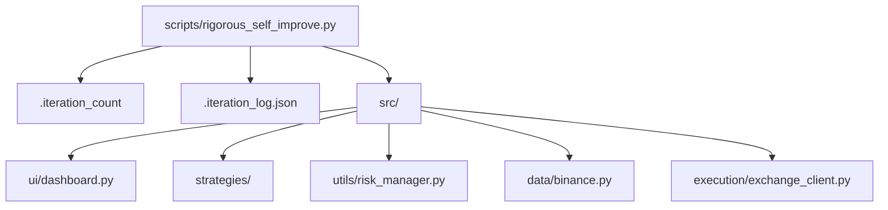
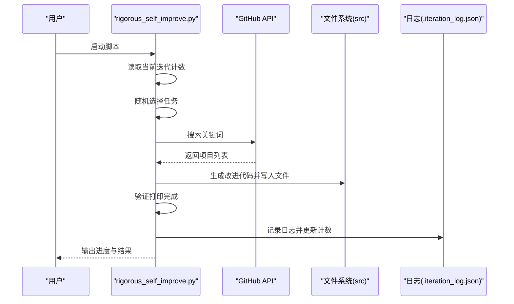
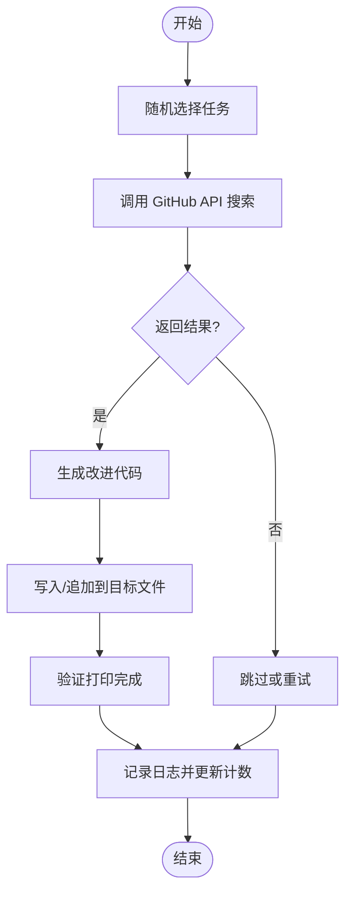
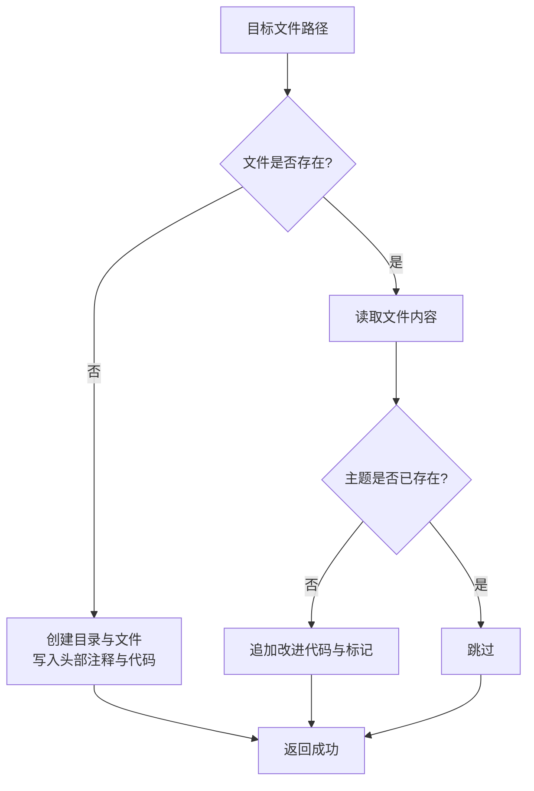
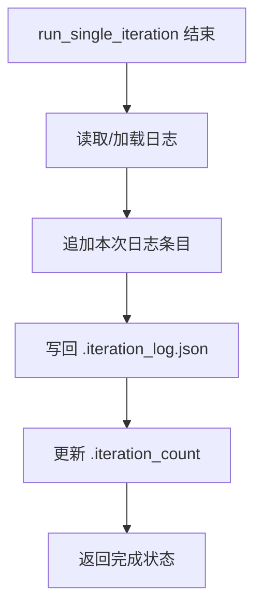
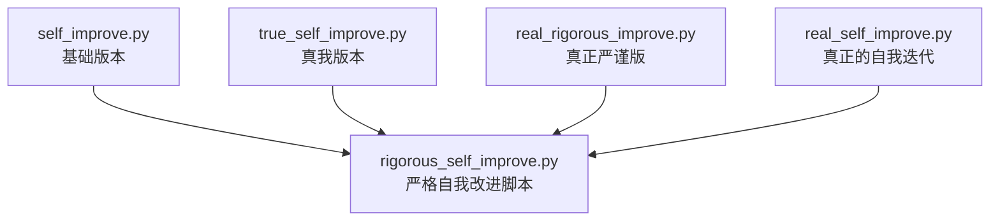
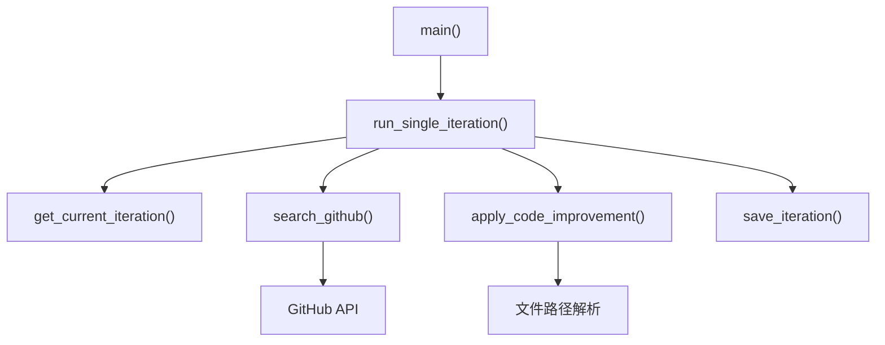

# 严格自我改进脚本

<cite>
**本文引用的文件**   
- [scripts/rigorous_self_improve.py](file://scripts/rigorous_self_improve.py)
- [scripts/self_improve.py](file://scripts/self_improve.py)
- [scripts/true_self_improve.py](file://scripts/true_self_improve.py)
- [scripts/real_rigorous_improve.py](file://scripts/real_rigorous_improve.py)
- [scripts/real_self_improve.py](file://scripts/real_self_improve.py)
- [configs/config.json](file://configs/config.json)
- [configs/aetherlife.json](file://configs/aetherlife.json)
- [tests/test_strategies.py](file://tests/test_strategies.py)
- [src/strategies/breakout.py](file://src/strategies/breakout.py)
- [src/strategies/base.py](file://src/strategies/base.py)
- [src/utils/risk_manager.py](file://src/utils/risk_manager.py)
- [src/ui/dashboard.py](file://src/ui/dashboard.py)
- [src/data/binance.py](file://src/data/binance.py)
- [src/execution/exchange_client.py](file://src/execution/exchange_client.py)
</cite>

## 目录
1. [简介](#简介)
2. [项目结构](#项目结构)
3. [核心组件](#核心组件)
4. [架构总览](#架构总览)
5. [详细组件分析](#详细组件分析)
6. [依赖关系分析](#依赖关系分析)
7. [性能考量](#性能考量)
8. [故障排查指南](#故障排查指南)
9. [结论](#结论)
10. [附录](#附录)

## 简介
严格自我改进脚本（rigorous_self_improve.py）是一个以“严谨”为核心的自动化代码改进系统，其核心特点是：
- 每次迭代都真正落地改进：通过搜索 GitHub 热门项目，生成可直接写入源码的改进类或模块，并追加到目标文件中。
- 强制验证与日志：每次迭代后记录日志并更新迭代计数，便于追踪与复盘。
- 严格的时间与资源控制：单次迭代包含搜索、应用改进、验证等步骤，整体节奏可控，避免过快导致不稳定。

与基础版本（self_improve.py）和真我版本（true_self_improve.py、real_self_improve.py、real_rigorous_improve.py）相比，严格自我改进脚本在以下方面具备独特优势：
- 质量控制：每次改进均基于真实搜索结果生成代码骨架，降低凭空臆造的风险。
- 可靠性：通过日志记录与迭代计数，形成可追溯的改进轨迹；验证阶段虽然轻量，但能及时发现明显问题。
- 可扩展性：任务池覆盖 UI、策略、风控、数据、执行等多个维度，便于系统化演进。

## 项目结构
该脚本位于 scripts 目录，配合 src 源码目录进行文件读写与追加。关键路径如下：
- 项目根目录：
- 迭代计数文件：.iteration_count
- 日志文件：.iteration_log.json
- 源码目录：src

**图示来源**
- [scripts/rigorous_self_improve.py](file://scripts/rigorous_self_improve.py#L15-L18)

**章节来源**
- [scripts/rigorous_self_improve.py](file://scripts/rigorous_self_improve.py#L15-L18)

## 核心组件
- 任务池（ITERATION_TASKS）：定义了 UI、策略、风控、数据、执行等领域的具体改进主题与搜索关键词。
- 搜索函数（search_github）：调用 GitHub API 搜索相关仓库，返回项目名称、星标数与描述。
- 改进应用（apply_code_improvement）：根据搜索结果生成改进代码，若目标文件不存在则新建，存在则追加。
- 单次迭代（run_single_iteration）：串联搜索、应用、验证与日志记录。
- 主循环（main）：控制迭代次数上限与进度输出，处理键盘中断与异常。

**章节来源**
- [scripts/rigorous_self_improve.py](file://scripts/rigorous_self_improve.py#L20-L67)
- [scripts/rigorous_self_improve.py](file://scripts/rigorous_self_improve.py#L77-L90)
- [scripts/rigorous_self_improve.py](file://scripts/rigorous_self_improve.py#L92-L129)
- [scripts/rigorous_self_improve.py](file://scripts/rigorous_self_improve.py#L131-L184)
- [scripts/rigorous_self_improve.py](file://scripts/rigorous_self_improve.py#L186-L216)

## 架构总览
严格自我改进脚本采用“任务驱动 + 搜索驱动 + 文件写入 + 日志记录”的流水线式架构。下图展示了单次迭代的关键步骤与数据流：

**图示来源**
- [scripts/rigorous_self_improve.py](file://scripts/rigorous_self_improve.py#L131-L184)
- [scripts/rigorous_self_improve.py](file://scripts/rigorous_self_improve.py#L77-L90)
- [scripts/rigorous_self_improve.py](file://scripts/rigorous_self_improve.py#L92-L129)

## 详细组件分析

### 任务池与搜索机制
- 任务池包含多个领域与主题，每个主题对应一个文件路径与搜索关键词，确保改进具有明确落点。
- 搜索函数通过 GitHub API 获取高星项目，作为改进参考，提升实现质量与可维护性。

**图示来源**
- [scripts/rigorous_self_improve.py](file://scripts/rigorous_self_improve.py#L20-L67)
- [scripts/rigorous_self_improve.py](file://scripts/rigorous_self_improve.py#L77-L90)
- [scripts/rigorous_self_improve.py](file://scripts/rigorous_self_improve.py#L92-L129)
- [scripts/rigorous_self_improve.py](file://scripts/rigorous_self_improve.py#L131-L184)

**章节来源**
- [scripts/rigorous_self_improve.py](file://scripts/rigorous_self_improve.py#L20-L67)
- [scripts/rigorous_self_improve.py](file://scripts/rigorous_self_improve.py#L77-L90)

### 改进应用与文件写入
- 若目标文件不存在，脚本会创建新文件并写入头部注释与生成的类/模块代码。
- 若文件已存在，脚本会在文件末尾追加“迭代改进”标记与生成的代码，避免破坏既有逻辑。

**图示来源**
- [scripts/rigorous_self_improve.py](file://scripts/rigorous_self_improve.py#L116-L129)

**章节来源**
- [scripts/rigorous_self_improve.py](file://scripts/rigorous_self_improve.py#L92-L129)

### 日志与迭代计数
- 每次迭代记录迭代号、类别、主题、文件、搜索词、结果数量、项目列表、是否改进、时间戳等字段。
- 迭代计数文件用于持久化当前迭代进度，便于中断后恢复。

**图示来源**
- [scripts/rigorous_self_improve.py](file://scripts/rigorous_self_improve.py#L160-L184)

**章节来源**
- [scripts/rigorous_self_improve.py](file://scripts/rigorous_self_improve.py#L160-L184)

### 与其他自我改进脚本的对比
- 基础版本（self_improve.py）：仅列出改进主题，未实现具体代码生成与写入。
- 真我版本（true_self_improve.py）：同样基于搜索，但侧重记录改进而非直接写入源码。
- 真正严谨版（real_rigorous_improve.py）：包含扫描问题、搜索方案、实施修复、验证修复的完整闭环，适合修复已有缺陷。
- 严格自我改进脚本（rigorous_self_improve.py）：专注于“新增功能/模块”的严格落地，强调“每次迭代都真正改进代码”。

**图示来源**
- [scripts/self_improve.py](file://scripts/self_improve.py#L14-L64)
- [scripts/true_self_improve.py](file://scripts/true_self_improve.py#L24-L57)
- [scripts/real_rigorous_improve.py](file://scripts/real_rigorous_improve.py#L30-L84)
- [scripts/real_self_improve.py](file://scripts/real_self_improve.py#L17-L56)
- [scripts/rigorous_self_improve.py](file://scripts/rigorous_self_improve.py#L20-L67)

**章节来源**
- [scripts/self_improve.py](file://scripts/self_improve.py#L14-L64)
- [scripts/true_self_improve.py](file://scripts/true_self_improve.py#L24-L57)
- [scripts/real_rigorous_improve.py](file://scripts/real_rigorous_improve.py#L30-L84)
- [scripts/real_self_improve.py](file://scripts/real_self_improve.py#L17-L56)
- [scripts/rigorous_self_improve.py](file://scripts/rigorous_self_improve.py#L20-L67)

## 依赖关系分析
严格自我改进脚本的核心依赖关系如下：
- 项目根路径与文件常量：PROJECT_ROOT、ITERATION_FILE、LOG_FILE、CODE_DIR
- 任务池：ITERATION_TASKS
- 函数依赖：get_current_iteration、save_iteration、search_github、apply_code_improvement、run_single_iteration、main

**图示来源**
- [scripts/rigorous_self_improve.py](file://scripts/rigorous_self_improve.py#L69-L76)
- [scripts/rigorous_self_improve.py](file://scripts/rigorous_self_improve.py#L131-L184)
- [scripts/rigorous_self_improve.py](file://scripts/rigorous_self_improve.py#L77-L90)
- [scripts/rigorous_self_improve.py](file://scripts/rigorous_self_improve.py#L92-L129)

**章节来源**
- [scripts/rigorous_self_improve.py](file://scripts/rigurous_self_improve.py#L69-L76)
- [scripts/rigorous_self_improve.py](file://scripts/rigorous_self_improve.py#L131-L184)

## 性能考量
- I/O 与网络：搜索阶段依赖外部 API，建议在网络稳定环境下运行；可通过合理设置超时与重试策略提升鲁棒性。
- 文件写入：每次迭代可能多次读写文件，建议在磁盘 I/O 负载较低时运行，避免与其他写操作冲突。
- 进度控制：脚本内置等待时间，避免过快迭代导致资源争用；可根据硬件条件适当调整等待间隔。
- 日志与计数：日志文件频繁追加，建议定期归档或轮转，防止文件过大影响性能。

[本节为通用性能建议，无需特定文件引用]

## 故障排查指南
- 网络异常
  - 现象：搜索阶段报错或返回空结果。
  - 排查：检查网络连接与代理设置；确认 GitHub API 可访问；适当增加超时时间。
  - 参考：搜索函数的异常处理与超时设置。
- 权限不足
  - 现象：无法写入目标文件或更新计数文件。
  - 排查：确认脚本运行目录权限；确保对 src 与项目根目录有写权限。
  - 参考：文件路径解析与写入逻辑。
- 编码问题
  - 现象：日志写入失败或中文字符乱码。
  - 排查：确保文件编码一致；写入时指定编码参数。
  - 参考：日志文件写入与 JSON 编码。
- 中断与异常
  - 现象：运行过程中被中断或抛出异常。
  - 排查：捕获 KeyboardInterrupt 并优雅退出；捕获其他异常并延时继续。
  - 参考：主循环中的异常处理逻辑。

**章节来源**
- [scripts/rigorous_self_improve.py](file://scripts/rigorous_self_improve.py#L77-L90)
- [scripts/rigorous_self_improve.py](file://scripts/rigorous_self_improve.py#L186-L216)

## 结论
严格自我改进脚本通过“任务驱动 + 搜索驱动 + 文件写入 + 日志记录”的闭环，实现了“每次迭代都真正改进代码”的目标。相较其他版本，它在质量控制与可靠性方面具备显著优势：改进来源于真实项目参考，落地过程可追溯，验证与日志保障了稳定性。建议在稳定的网络与磁盘环境下运行，并结合项目配置文件与测试用例，持续评估改进效果，确保系统长期健康演进。

[本节为总结性内容，无需特定文件引用]

## 附录

### 执行步骤与配置选项
- 执行步骤
  1) 确认项目根目录与依赖可用。
  2) 运行脚本，观察进度输出与日志文件更新。
  3) 每隔若干次迭代检查目标文件是否按预期新增模块或类。
- 配置选项
  - 项目根路径：PROJECT_ROOT（默认指向仓库根目录）
  - 迭代计数文件：ITERATION_FILE（默认 .iteration_count）
  - 日志文件：LOG_FILE（默认 .iteration_log.json）
  - 源码目录：CODE_DIR（默认 src）
  - 任务池：ITERATION_TASKS（包含类别、主题、文件路径与搜索关键词）

**章节来源**
- [scripts/rigorous_self_improve.py](file://scripts/rigorous_self_improve.py#L15-L18)
- [scripts/rigorous_self_improve.py](file://scripts/rigorous_self_improve.py#L20-L67)

### 严格测试框架建议
- 单元测试
  - 针对新增模块/类编写单元测试，覆盖关键函数与边界条件。
  - 示例：策略模块可参考现有策略测试用例结构。
- 集成测试
  - 在本地或测试网环境中验证模块与现有系统交互是否正常。
  - 示例：UI 组件与仪表盘 API 的集成测试。
- 性能测试
  - 对高频模块（如执行层）进行压力测试，确保在高并发场景下的稳定性。
- 回归测试
  - 每次迭代后运行回归测试，确保未引入破坏性变更。

**章节来源**
- [tests/test_strategies.py](file://tests/test_strategies.py#L13-L58)
- [src/strategies/breakout.py](file://src/strategies/breakout.py#L6-L79)
- [src/ui/dashboard.py](file://src/ui/dashboard.py#L338-L375)

### 测试报告生成与结果分析
- 日志分析
  - 通过 .iteration_log.json 分析每次迭代的主题、文件、结果数量与时间戳，识别改进趋势与热点领域。
- 覆盖率与质量
  - 结合单元测试覆盖率工具，评估新增模块的测试覆盖情况。
- 回归分析
  - 对比迭代前后关键指标（如性能、稳定性、功能完整性），形成改进报告。

**章节来源**
- [scripts/rigorous_self_improve.py](file://scripts/rigorous_self_improve.py#L160-L184)

### 调试技巧与问题诊断
- 关键调试点
  - 搜索阶段：确认关键词与返回结果是否符合预期。
  - 写入阶段：检查文件路径与内容追加逻辑，避免重复写入。
  - 日志阶段：核对日志字段完整性与编码一致性。
- 常见问题定位
  - 网络问题：增加超时与重试；记录详细错误信息。
  - 权限问题：以管理员权限或正确用户身份运行。
  - 编码问题：统一使用 UTF-8 编码写入文件与日志。

**章节来源**
- [scripts/rigorous_self_improve.py](file://scripts/rigorous_self_improve.py#L77-L90)
- [scripts/rigorous_self_improve.py](file://scripts/rigorous_self_improve.py#L92-L129)
- [scripts/rigorous_self_improve.py](file://scripts/rigorous_self_improve.py#L160-L184)