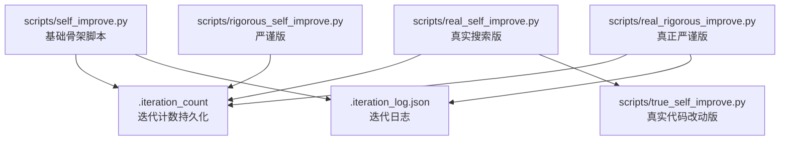
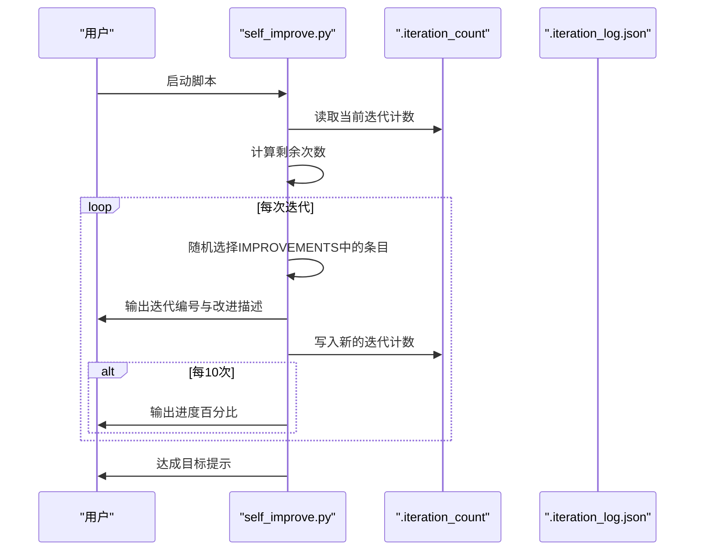
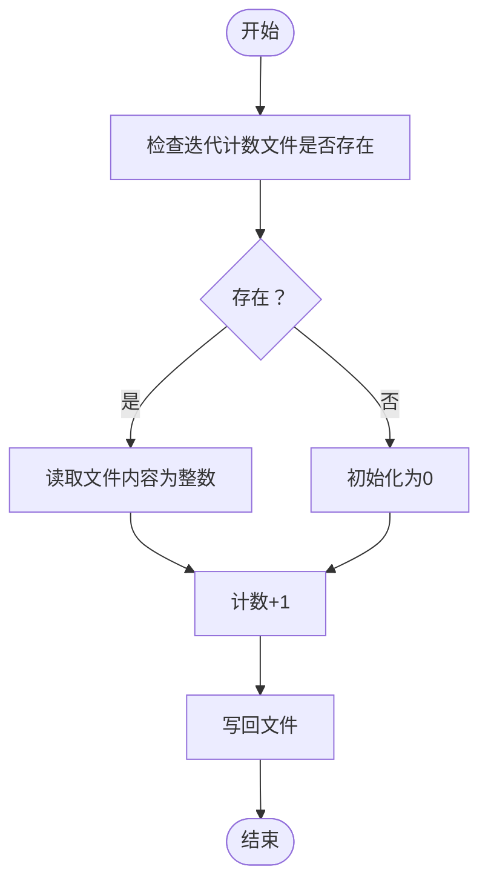
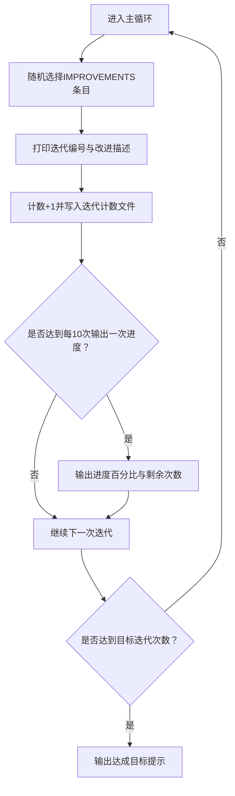
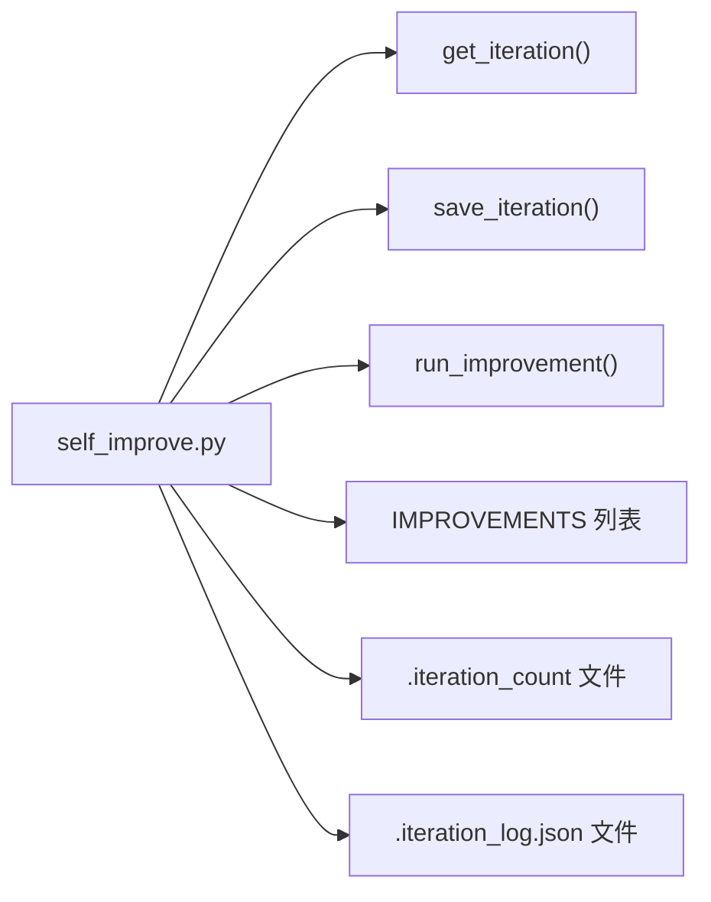

# 基础自我改进脚本

<cite>
**本文引用的文件**
- [scripts/self_improve.py](file://scripts/self_improve.py)
- [.iteration_count](file://.iteration_count)
- [.iteration_log.json](file://.iteration_log.json)
- [scripts/real_self_improve.py](file://scripts/real_self_improve.py)
- [scripts/true_self_improve.py](file://scripts/true_self_improve.py)
- [scripts/rigorous_self_improve.py](file://scripts/rigorous_self_improve.py)
- [scripts/real_rigorous_improve.py](file://scripts/real_rigorous_improve.py)
- [.iteration_log.md](file://.iteration_log.md)
</cite>

## 目录
1. [简介](#简介)
2. [项目结构](#项目结构)
3. [核心组件](#核心组件)
4. [架构总览](#架构总览)
5. [详细组件分析](#详细组件分析)
6. [依赖关系分析](#依赖关系分析)
7. [性能考量](#性能考量)
8. [故障排除指南](#故障排除指南)
9. [结论](#结论)
10. [附录](#附录)

## 简介
本指南面向“基础自我改进脚本（self_improve.py）”，帮助您理解其核心功能与使用方式，包括：
- 迭代机制与目标设定
- 改进清单（IMPROVEMENTS）的分类与条目
- 进度跟踪与迭代计数器工作原理
- 随机选择改进项的算法与执行流程
- 完整运行示例（命令行、输出格式、进度显示）
- 如何修改改进清单以适配不同需求
- 如何扩展脚本功能
- 最佳实践与常见问题解决方案

## 项目结构
该仓库提供了多个版本的“自我改进”脚本，从最基础的骨架脚本到具备真实代码改动能力的高级版本。基础脚本位于 scripts/self_improve.py，其他版本展示了更完整的迭代流程与代码集成能力。

图示来源
- [scripts/self_improve.py](file://scripts/self_improve.py#L1-L115)
- [.iteration_count](file://.iteration_count#L1-L1)
- [.iteration_log.json](file://.iteration_log.json#L1-L800)

章节来源
- [scripts/self_improve.py](file://scripts/self_improve.py#L1-L115)
- [.iteration_count](file://.iteration_count#L1-L1)
- [.iteration_log.json](file://.iteration_log.json#L1-L800)

## 核心组件
- 迭代计数器：通过本地文件记录当前迭代次数，作为脚本的持久状态。
- 改进清单（IMPROVEMENTS）：按类别组织的改进项列表，用于随机选择。
- 随机选择与执行：每次迭代随机挑选一个改进项并打印描述。
- 进度输出：每10次迭代输出一次进度百分比与剩余次数。
- 日志记录：基础脚本预留日志接口，其他版本提供更完善的日志结构。

章节来源
- [scripts/self_improve.py](file://scripts/self_improve.py#L12-L115)

## 架构总览
基础脚本采用“骨架-扩展”模式：核心逻辑集中在主循环与计数器读写，改进项由外部列表提供，便于替换与扩展。

图示来源
- [scripts/self_improve.py](file://scripts/self_improve.py#L85-L115)

## 详细组件分析

### 迭代计数器与文件读写
- 文件位置：脚本中定义了固定路径的迭代计数文件。
- 读取逻辑：若文件存在则读取整数；否则返回初始值。
- 写入逻辑：每次迭代结束后将计数+1并写回文件。
- 作用：保证脚本重启后能从上次中断处继续迭代。

图示来源
- [scripts/self_improve.py](file://scripts/self_improve.py#L66-L77)

章节来源
- [scripts/self_improve.py](file://scripts/self_improve.py#L66-L77)
- [.iteration_count](file://.iteration_count#L1-L1)

### 改进清单（IMPROVEMENTS）与类别
IMPROVEMENTS 是一个元组列表，每个元素包含：
- 类别标签：如 ui、strategy、risk、data、execution、ai、infra
- 描述文本：简要说明改进内容

类别与典型改进项举例：
- UI（界面与可视化）
  - 改进Dashboard样式，添加更多图表类型
  - 添加实时数据推送支持
  - 优化移动端响应式布局
  - 添加暗黑/亮色主题切换
  - 添加数据导出功能
- 策略（交易策略）
  - 添加新的突破策略变体
  - 实现自适应止损
  - 添加仓位动态调整
  - 实现多时间周期分析
  - 添加技术指标库
- 风控（风险管理）
  - 增加熔断机制
  - 添加最大回撤控制
  - 实现动态杠杆调整
  - 添加风险分散策略
  - 实现对冲机制
- 数据（数据采集与处理）
  - 添加更多交易所支持
  - 实现数据缓存层
  - 添加数据回测功能
  - 实现跨交易所套利检测
  - 添加链上数据集成
- 执行（订单执行与交易执行）
  - 优化订单执行速度
  - 添加冰山订单支持
  - 实现智能滑点控制
  - 添加订单重试机制
  - 实现费用优化
- AI（人工智能与预测）
  - 集成机器学习模型
  - 添加情绪分析模块
  - 实现预测模型
  - 添加自然语言策略
  - 实现自学习机制
- 基础设施（系统与运维）
  - 添加Docker支持
  - 实现集群部署
  - 添加监控告警
  - 实现日志系统
  - 添加性能优化

章节来源
- [scripts/self_improve.py](file://scripts/self_improve.py#L15-L64)

### 随机选择算法与执行流程
- 随机选择：每次迭代从IMPROVEMENTS中随机选取一个条目。
- 执行占位：run_improvement 函数目前仅打印描述，实际业务逻辑可在后续扩展。
- 间隔控制：每次迭代后短暂休眠，避免输出过快。

图示来源
- [scripts/self_improve.py](file://scripts/self_improve.py#L94-L111)

章节来源
- [scripts/self_improve.py](file://scripts/self_improve.py#L94-L111)

### 进度跟踪与日志
- 进度输出：每10次迭代打印一次进度百分比与剩余次数。
- 日志文件：基础脚本预留日志接口，其他版本提供结构化的JSON日志文件，记录每次迭代的类别、主题、搜索结果数量等信息。

章节来源
- [scripts/self_improve.py](file://scripts/self_improve.py#L105-L107)
- [.iteration_log.json](file://.iteration_log.json#L1-L800)

### 与其他版本的关系与扩展参考
- 真实搜索版（real_self_improve.py）：引入异步搜索主题并记录结果。
- 真实代码改动版（true_self_improve.py）：根据类别直接修改对应源码文件。
- 严谨版（rigorous_self_improve.py）：每个任务明确指向具体文件与改进代码片段。
- 真正严谨版（real_rigorous_improve.py）：完整流程：扫描问题 → 搜索方案 → 实施修复 → 验证。

这些版本展示了从“打印描述”到“真实代码改动”的演进路径，可作为扩展基础脚本的参考。

章节来源
- [scripts/real_self_improve.py](file://scripts/real_self_improve.py#L1-L166)
- [scripts/true_self_improve.py](file://scripts/true_self_improve.py#L1-L229)
- [scripts/rigorous_self_improve.py](file://scripts/rigorous_self_improve.py#L1-L216)
- [scripts/real_rigorous_improve.py](file://scripts/real_rigorous_improve.py#L1-L261)

## 依赖关系分析
基础脚本的内部依赖关系如下：

图示来源
- [scripts/self_improve.py](file://scripts/self_improve.py#L66-L115)

章节来源
- [scripts/self_improve.py](file://scripts/self_improve.py#L66-L115)

## 性能考量
- I/O开销：每次迭代均进行文件读写，频繁写入可能带来磁盘压力。建议在高并发场景下合并写入或使用更高效的存储。
- 随机选择：使用内置随机库，复杂度为O(1)；IMPROVEMENTS规模较大时可考虑预洗牌以降低重复概率。
- 输出频率：默认每10次输出一次进度，可根据终端吞吐量调整。
- 休眠控制：当前脚本在每次迭代后有短暂停顿，避免输出过快；如需加速可减少休眠时间。

## 故障排除指南
- 迭代计数文件不可读/不可写
  - 检查文件权限与路径是否正确。
  - 确认脚本运行目录与文件路径一致。
- 进度显示异常
  - 确认目标迭代次数与当前计数的计算逻辑。
  - 检查每10次输出条件是否触发。
- 改进项未生效
  - 基础脚本的 run_improvement 仅为占位，需要自行实现具体业务逻辑。
- 日志文件格式错误
  - 其他版本会解析已有日志并追加新条目；如遇JSON解析失败，先备份再清理损坏部分。

章节来源
- [scripts/self_improve.py](file://scripts/self_improve.py#L66-L115)
- [.iteration_log.json](file://.iteration_log.json#L1-L800)

## 结论
基础自我改进脚本提供了清晰的迭代框架与持久化计数机制，适合快速启动自动化改进流程。通过扩展 run_improvement 与 IMPROVEMENTS 列表，即可将其升级为具备真实业务价值的自动化改进引擎。同时，仓库中的其他版本为“真实搜索”、“真实代码改动”和“严谨流程”提供了丰富的参考实现。

## 附录

### 使用示例
- 命令行执行
  - 在项目根目录执行：python3 scripts/self_improve.py
- 输出格式
  - 启动信息：显示当前迭代、目标与剩余次数
  - 每次迭代：显示迭代编号与改进描述
  - 每10次：显示进度百分比与剩余次数
  - 达成目标：提示完成指定次数的迭代
- 进度显示
  - 示例：进度: 10/1000 (1.0%)

章节来源
- [scripts/self_improve.py](file://scripts/self_improve.py#L85-L111)

### 修改改进清单以适配不同需求
- 新增类别
  - 在 IMPROVEMENTS 中添加新的元组，类别标签与描述自定义
- 调整权重
  - 通过重复条目提高某类别的出现频率
- 动态选择
  - 可在随机选择前加入权重或优先级逻辑

章节来源
- [scripts/self_improve.py](file://scripts/self_improve.py#L15-L64)

### 扩展脚本功能的建议
- 实现 run_improvement 的真实逻辑：如调用外部API、修改源码文件、生成配置等
- 引入日志系统：记录每次迭代的详细信息，便于回溯与分析
- 并发与异步：在需要网络请求或文件操作时采用异步或并发策略
- 可视化：将进度与统计数据输出到仪表板或报告

章节来源
- [scripts/self_improve.py](file://scripts/self_improve.py#L78-L84)
- [scripts/real_self_improve.py](file://scripts/real_self_improve.py#L78-L127)
- [scripts/true_self_improve.py](file://scripts/true_self_improve.py#L89-L138)
- [scripts/rigorous_self_improve.py](file://scripts/rigorous_self_improve.py#L92-L129)
- [scripts/real_rigorous_improve.py](file://scripts/real_rigorous_improve.py#L102-L145)