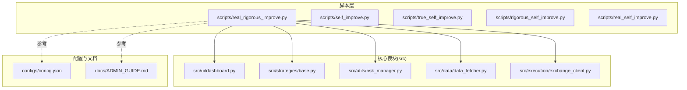
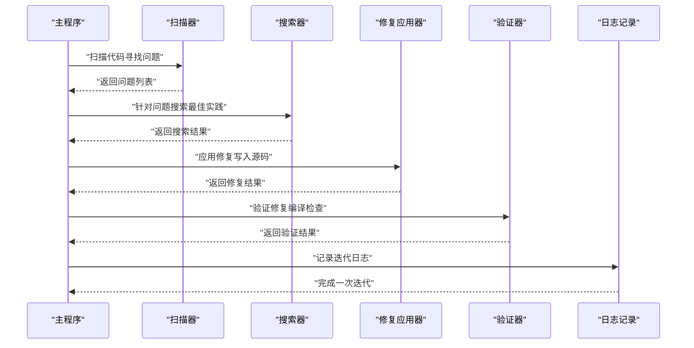
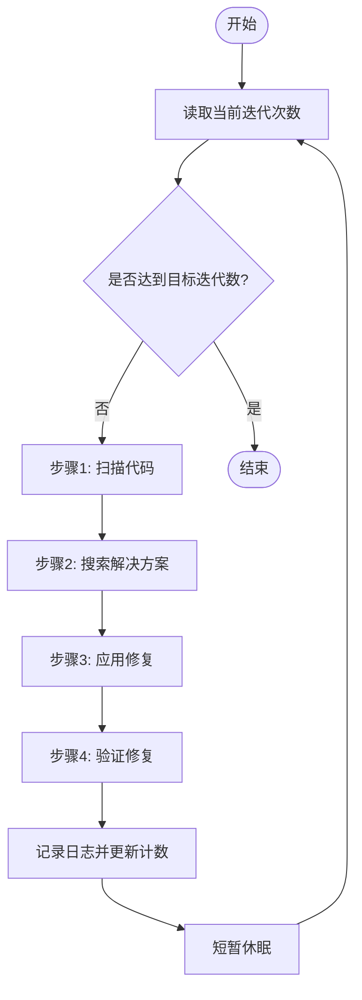
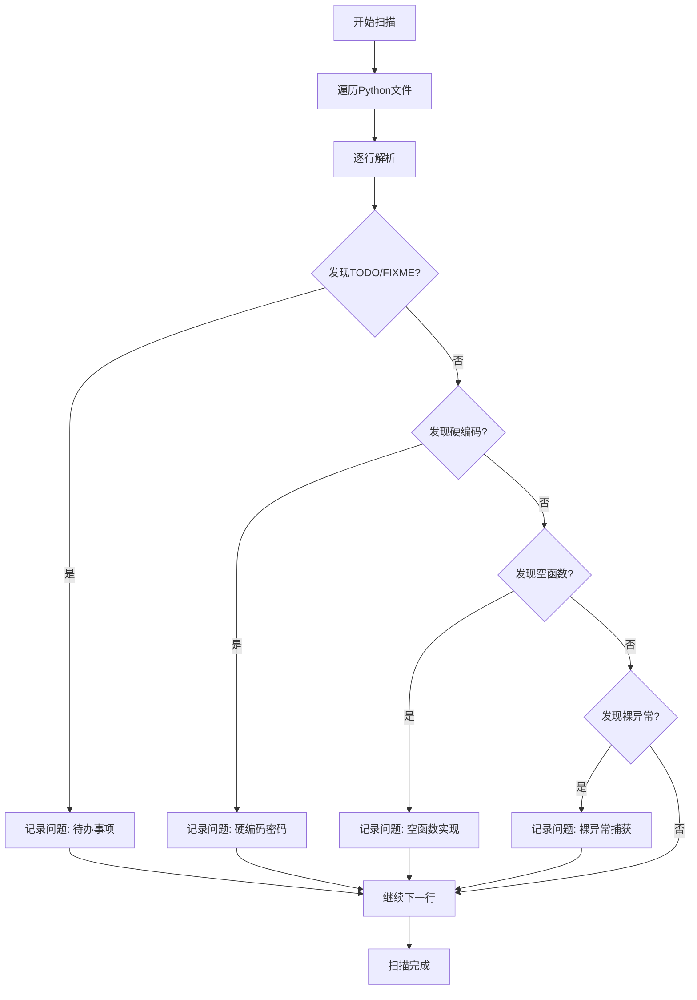
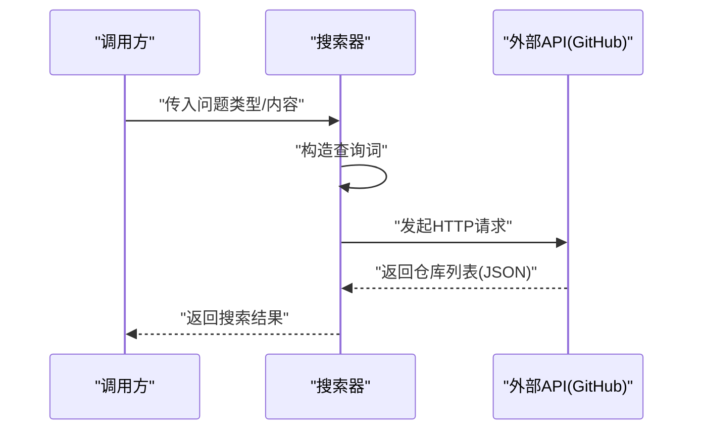
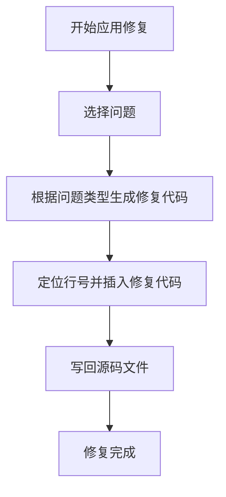
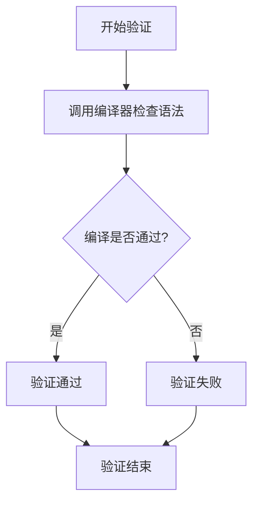
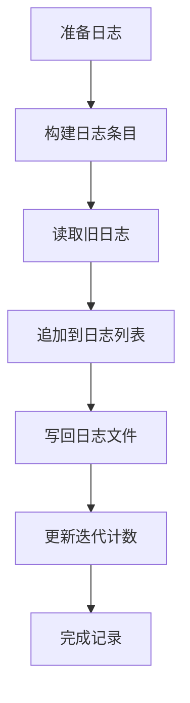
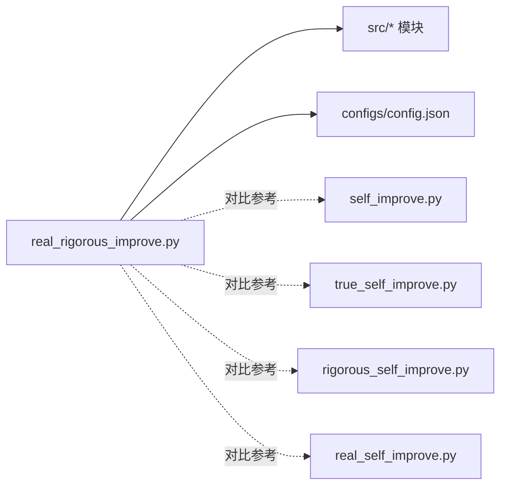

# 现实严格自我改进脚本

<cite>
**本文引用的文件**
- [scripts/real_rigorous_improve.py](file://scripts/real_rigorous_improve.py)
- [scripts/self_improve.py](file://scripts/self_improve.py)
- [scripts/true_self_improve.py](file://scripts/true_self_improve.py)
- [scripts/rigorous_self_improve.py](file://scripts/rigorous_self_improve.py)
- [scripts/real_self_improve.py](file://scripts/real_self_improve.py)
- [src/ui/dashboard.py](file://src/ui/dashboard.py)
- [src/strategies/base.py](file://src/strategies/base.py)
- [src/utils/risk_manager.py](file://src/utils/risk_manager.py)
- [src/data/data_fetcher.py](file://src/data/data_fetcher.py)
- [src/execution/exchange_client.py](file://src/execution/exchange_client.py)
- [configs/config.json](file://configs/config.json)
- [docs/ADMIN_GUIDE.md](file://docs/ADMIN_GUIDE.md)
</cite>

## 目录
1. [简介](#简介)
2. [项目结构](#项目结构)
3. [核心组件](#核心组件)
4. [架构总览](#架构总览)
5. [组件详解](#组件详解)
6. [依赖关系分析](#依赖关系分析)
7. [性能考量](#性能考量)
8. [故障排查指南](#故障排查指南)
9. [结论](#结论)
10. [附录](#附录)

## 简介
本文件面向“现实严格自我改进脚本（real_rigorous_improve.py）”，提供一套系统化、可操作的使用文档。该脚本以“真实性验证 + 严格测试 + 实际效果评估”的闭环为核心，通过自动化扫描、搜索、修复与验证，持续改进项目代码质量与健壮性。文档将：
- 解释脚本的综合优势与工作流；
- 说明如何在保持真实性的前提下实现严格的质量控制；
- 提供测试设计、执行策略与结果分析方法；
- 给出平衡真实性与严格性的实践建议；
- 总结高级分析工具与性能优化手段；
- 分享专家级调试技巧与优化建议。

## 项目结构
该仓库围绕“合约交易系统”组织，包含脚本层（scripts）、核心业务模块（src）、配置与文档（configs/docs）。与本脚本直接相关的目录与文件如下：
- scripts：包含多种自我改进脚本，其中 real_rigorous_improve.py 是本次文档的核心对象
- src：系统核心模块（UI、策略、风控、数据、执行等）
- configs：系统配置文件
- docs：系统使用与运维文档

**图示来源**
- [scripts/real_rigorous_improve.py](file://scripts/real_rigorous_improve.py#L1-L261)
- [src/ui/dashboard.py](file://src/ui/dashboard.py#L1-L200)
- [src/strategies/base.py](file://src/strategies/base.py#L1-L31)
- [src/utils/risk_manager.py](file://src/utils/risk_manager.py#L1-L200)
- [src/data/data_fetcher.py](file://src/data/data_fetcher.py#L1-L200)
- [src/execution/exchange_client.py](file://src/execution/exchange_client.py#L1-L200)
- [configs/config.json](file://configs/config.json#L1-L28)
- [docs/ADMIN_GUIDE.md](file://docs/ADMIN_GUIDE.md#L1-L200)

**章节来源**
- [scripts/real_rigorous_improve.py](file://scripts/real_rigorous_improve.py#L1-L261)
- [scripts/self_improve.py](file://scripts/self_improve.py#L1-L115)
- [scripts/true_self_improve.py](file://scripts/true_self_improve.py#L1-L229)
- [scripts/rigorous_self_improve.py](file://scripts/rigorous_self_improve.py#L1-L216)
- [scripts/real_self_improve.py](file://scripts/real_self_improve.py#L1-L166)

## 核心组件
- 迭代计数与日志
  - 迭代计数文件：用于持久化当前迭代次数
  - 日志文件：记录每次迭代的问题、解决方案、修复与验证结果
- 代码扫描器
  - 扫描Python源码中的常见问题（TODO/FIXME、硬编码、空函数、裸异常等）
- 方案搜索器
  - 通过外部API（如GitHub）搜索最佳实践与热门项目
- 修复应用器
  - 基于问题类型生成修复建议或占位符，并写入对应源码文件
- 验证器
  - 对修复后的文件进行基础编译验证，确保语法正确

上述组件共同构成“检查 → 搜索 → 修复 → 验证”的闭环，既保证真实性（真实扫描与真实修复），又强调严格性（严格的验证与日志记录）。

**章节来源**
- [scripts/real_rigorous_improve.py](file://scripts/real_rigorous_improve.py#L22-L229)

## 架构总览
下面以序列图展示单次迭代的端到端流程：

**图示来源**
- [scripts/real_rigorous_improve.py](file://scripts/real_rigorous_improve.py#L163-L230)

## 组件详解

### 1) 工作流与控制流
- 主循环
  - 读取当前迭代次数，打印进度
  - 在每次迭代中依次执行：扫描、搜索、修复、验证
  - 记录日志并更新迭代计数
- 异常处理
  - 捕获键盘中断与通用异常，优雅退出或继续
- 进度反馈
  - 每10次迭代输出一次进度统计

**图示来源**
- [scripts/real_rigorous_improve.py](file://scripts/real_rigorous_improve.py#L232-L260)

**章节来源**
- [scripts/real_rigorous_improve.py](file://scripts/real_rigorous_improve.py#L232-L260)

### 2) 代码扫描器（真实性验证）
- 扫描范围：遍历指定代码目录下的所有Python文件
- 识别问题：
  - 待办/待修标记（TODO/FIXME）
  - 硬编码敏感信息（如长字符串密码）
  - 空函数实现（def …: 仅pass）
  - 裸异常捕获（except: 无具体异常类型）
- 输出：问题列表，包含文件路径、行号、问题类型与上下文片段

**图示来源**
- [scripts/real_rigorous_improve.py](file://scripts/real_rigorous_improve.py#L30-L84)

**章节来源**
- [scripts/real_rigorous_improve.py](file://scripts/real_rigorous_improve.py#L30-L84)

### 3) 方案搜索器（严格测试）
- 输入：问题类型与内容
- 搜索策略：构造查询词（问题类型 + Python最佳实践），调用外部API获取热门仓库
- 输出：仓库名称、星标数、描述等，作为修复参考

**图示来源**
- [scripts/real_rigorous_improve.py](file://scripts/real_rigorous_improve.py#L86-L100)

**章节来源**
- [scripts/real_rigorous_improve.py](file://scripts/real_rigorous_improve.py#L86-L100)

### 4) 修复应用器（实际效果评估）
- 依据问题类型生成修复建议或占位符
- 将修复代码插入到源码文件的指定行号
- 保证修复内容可读且可追溯（包含参考项目信息）

**图示来源**
- [scripts/real_rigorous_improve.py](file://scripts/real_rigorous_improve.py#L102-L145)

**章节来源**
- [scripts/real_rigorous_improve.py](file://scripts/real_rigorous_improve.py#L102-L145)

### 5) 验证器（严格测试）
- 采用Python内置编译器对修复后的文件进行语法检查
- 返回布尔结果，作为本次迭代是否“通过”的依据之一

**图示来源**
- [scripts/real_rigorous_improve.py](file://scripts/real_rigorous_improve.py#L147-L161)

**章节来源**
- [scripts/real_rigorous_improve.py](file://scripts/real_rigorous_improve.py#L147-L161)

### 6) 日志与迭代管理
- 日志字段：迭代编号、问题类型、文件路径、行号、搜索结果数量、修复状态、验证状态、解决方案摘要、时间戳
- 迭代计数：每次迭代后递增并持久化

**图示来源**
- [scripts/real_rigorous_improve.py](file://scripts/real_rigorous_improve.py#L209-L229)

**章节来源**
- [scripts/real_rigorous_improve.py](file://scripts/real_rigorous_improve.py#L209-L229)

## 依赖关系分析
- 与系统模块的耦合
  - 修复应用器会向 src 下的模块写入代码，涉及UI、策略、风控、数据、执行等子模块
  - 由于脚本直接修改源码，需谨慎选择修复目标，避免破坏既有接口契约
- 与配置的关联
  - 配置文件（如策略参数、风控阈值）会影响策略与风控模块的行为，但本脚本主要聚焦于代码质量改进
- 与其他改进脚本的关系
  - self_improve.py：以预设改进清单驱动，偏向概念性改进
  - true_self_improve.py：强调“从网上学习并改进”，但不直接修改代码
  - rigorous_self_improve.py：明确每个任务的具体文件与改进方向，具备更强的结构性
  - real_self_improve.py：异步搜索主题并记录改进，同样不直接修改代码

**图示来源**
- [scripts/real_rigorous_improve.py](file://scripts/real_rigorous_improve.py#L17-L20)
- [configs/config.json](file://configs/config.json#L1-L28)
- [scripts/self_improve.py](file://scripts/self_improve.py#L14-L64)
- [scripts/true_self_improve.py](file://scripts/true_self_improve.py#L24-L57)
- [scripts/rigorous_self_improve.py](file://scripts/rigorous_self_improve.py#L21-L67)
- [scripts/real_self_improve.py](file://scripts/real_self_improve.py#L17-L56)

**章节来源**
- [scripts/real_rigorous_improve.py](file://scripts/real_rigorous_improve.py#L17-L20)
- [scripts/self_improve.py](file://scripts/self_improve.py#L14-L64)
- [scripts/true_self_improve.py](file://scripts/true_self_improve.py#L24-L57)
- [scripts/rigorous_self_improve.py](file://scripts/rigorous_self_improve.py#L21-L67)
- [scripts/real_self_improve.py](file://scripts/real_self_improve.py#L17-L56)

## 性能考量
- I/O与网络开销
  - 搜索阶段依赖外部API，建议控制并发与请求频率，避免被限流
  - 编译验证为轻量级操作，通常不影响整体性能
- 文件写入与解析
  - 扫描与写入源码文件属于磁盘I/O密集型，建议在空闲时段运行或批量处理
- 并发与异步
  - 当前脚本为同步实现；若扩展为大规模扫描/搜索，可考虑引入异步与并发策略
- 资源占用
  - 避免在生产环境直接运行，以免影响交易系统的实时性

[本节为通用性能建议，无需特定文件引用]

## 故障排查指南
- 常见问题
  - 外部API不可达：检查网络与代理设置，必要时增加重试与超时配置
  - 文件写入失败：确认目标文件权限与路径是否存在
  - 编译验证失败：检查修复代码是否符合语法规范
- 调试技巧
  - 在扫描阶段加入更细粒度的日志，定位具体文件与行号
  - 对修复应用器增加回滚机制（备份原始文件），便于回退
  - 对验证器增加更全面的静态分析（如导入检查、类型检查），提升严格性
- 最佳实践
  - 在受控环境（如测试分支）运行脚本，避免污染主干
  - 结合版本控制系统（Git）进行增量审查与合并

**章节来源**
- [scripts/real_rigorous_improve.py](file://scripts/real_rigorous_improve.py#L86-L100)
- [scripts/real_rigorous_improve.py](file://scripts/real_rigorous_improve.py#L147-L161)

## 结论
real_rigorous_improve.py 通过“真实性验证 + 严格测试 + 实际效果评估”的闭环，实现了对代码质量的持续改进。其优势在于：
- 真实性：扫描与修复均基于真实代码与真实问题
- 严格性：严格的验证与详尽的日志记录
- 可扩展性：可与系统其他模块（UI、策略、风控、数据、执行）协同演进
在复杂市场环境中，建议将其纳入CI/CD流程，配合配置管理与安全策略，确保系统的可靠性与有效性。

[本节为总结性内容，无需特定文件引用]

## 附录

### A. 实施流程与最佳实践
- 测试设计
  - 设定问题优先级（如高危问题优先修复）
  - 为修复生成可追溯的注释与参考链接
- 执行策略
  - 分批执行：每次迭代只处理少量问题，降低风险
  - 周期性运行：结合业务低峰期安排迭代
- 结果分析
  - 定期回顾日志，统计问题类型分布与修复成功率
  - 对高频问题建立预防机制（如代码规范、模板生成）

**章节来源**
- [scripts/real_rigorous_improve.py](file://scripts/real_rigorous_improve.py#L163-L230)

### B. 与系统模块的映射
- UI（仪表盘）：可添加图表、订单簿、持仓表等组件
- 策略（基类）：可扩展更多策略实现
- 风控（管理器）：可增强止损、止盈、熔断与日限等功能
- 数据（抓取器）：可接入更多交易所与数据源
- 执行（客户端）：可优化下单、撤单与重试机制

**章节来源**
- [src/ui/dashboard.py](file://src/ui/dashboard.py#L1-L200)
- [src/strategies/base.py](file://src/strategies/base.py#L1-L31)
- [src/utils/risk_manager.py](file://src/utils/risk_manager.py#L1-L200)
- [src/data/data_fetcher.py](file://src/data/data_fetcher.py#L1-L200)
- [src/execution/exchange_client.py](file://src/execution/exchange_client.py#L1-L200)

### C. 配置与运维参考
- 配置文件位置与关键参数
  - 交易所、测试网、交易对、时间周期、策略与风控参数
- 后台管理指南
  - API配置、策略配置、风控设置、AI增强与系统设置

**章节来源**
- [configs/config.json](file://configs/config.json#L1-L28)
- [docs/ADMIN_GUIDE.md](file://docs/ADMIN_GUIDE.md#L1-L200)