# 现实自我改进脚本

<cite>
**本文引用的文件**
- [scripts/real_self_improve.py](file://scripts/real_self_improve.py)
- [scripts/self_improve.py](file://scripts/self_improve.py)
- [scripts/real_rigorous_improve.py](file://scripts/real_rigorous_improve.py)
- [scripts/rigorous_self_improve.py](file://scripts/rigorous_self_improve.py)
- [src/trading_bot.py](file://src/trading_bot.py)
- [src/utils/risk_manager.py](file://src/utils/risk_manager.py)
- [src/aetherlife/guard/risk_guard.py](file://src/aetherlife/guard/risk_guard.py)
- [src/ui/dashboard.py](file://src/ui/dashboard.py)
- [src/data/data_fetcher.py](file://src/data/data_fetcher.py)
- [src/execution/exchange_client.py](file://src/execution/exchange_client.py)
- [src/strategies/breakout.py](file://src/strategies/breakout.py)
- [src/strategies/grid.py](file://src/strategies/grid.py)
- [configs/config.json](file://configs/config.json)
</cite>

## 目录
1. [简介](#简介)
2. [项目结构](#项目结构)
3. [核心组件](#核心组件)
4. [架构总览](#架构总览)
5. [详细组件分析](#详细组件分析)
6. [依赖关系分析](#依赖关系分析)
7. [性能考量](#性能考量)
8. [故障排查指南](#故障排查指南)
9. [结论](#结论)
10. [附录](#附录)

## 简介
本指南围绕“现实自我改进脚本”展开，旨在帮助读者在真实市场环境中系统性地提升交易系统能力。该脚本以“动态学习—应用—改进”的闭环方式，结合真实交易系统的数据、策略、执行与风控模块，提供可落地的市场适应性、风险控制与收益优化路径。文档同时给出参数调优、效果评估、模拟测试与性能监控的方法，帮助在不确定性市场中保持系统稳定性。

## 项目结构
该仓库采用按职责分层的组织方式：
- scripts：自动化改进脚本集合（含“真实自我改进”“严谨自我改进”等）
- src：核心交易系统（数据、策略、执行、风控、UI、决策等）
- configs：系统配置
- docs：系统文档与部署指南

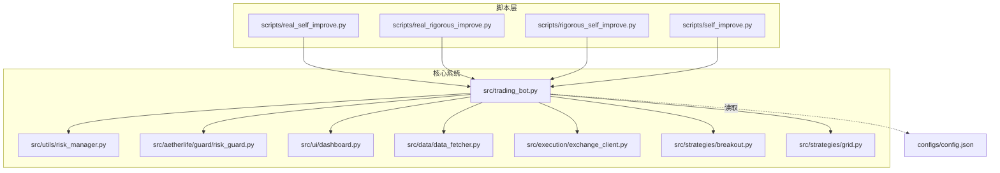

**图示来源**
- [scripts/real_self_improve.py](file://scripts/real_self_improve.py#L1-L166)
- [scripts/self_improve.py](file://scripts/self_improve.py#L1-L115)
- [scripts/real_rigorous_improve.py](file://scripts/real_rigorous_improve.py#L1-L261)
- [scripts/rigorous_self_improve.py](file://scripts/rigorous_self_improve.py#L1-L216)
- [src/trading_bot.py](file://src/trading_bot.py#L1-L346)
- [src/utils/risk_manager.py](file://src/utils/risk_manager.py#L1-L388)
- [src/aetherlife/guard/risk_guard.py](file://src/aetherlife/guard/risk_guard.py#L1-L84)
- [src/ui/dashboard.py](file://src/ui/dashboard.py#L1-L385)
- [src/data/data_fetcher.py](file://src/data/data_fetcher.py#L1-L434)
- [src/execution/exchange_client.py](file://src/execution/exchange_client.py#L1-L432)
- [src/strategies/breakout.py](file://src/strategies/breakout.py#L1-L79)
- [src/strategies/grid.py](file://src/strategies/grid.py#L1-L63)
- [configs/config.json](file://configs/config.json#L1-L28)

**章节来源**
- [scripts/real_self_improve.py](file://scripts/real_self_improve.py#L1-L166)
- [scripts/self_improve.py](file://scripts/self_improve.py#L1-L115)
- [scripts/real_rigorous_improve.py](file://scripts/real_rigorous_improve.py#L1-L261)
- [scripts/rigorous_self_improve.py](file://scripts/rigorous_self_improve.py#L1-L216)
- [src/trading_bot.py](file://src/trading_bot.py#L1-L346)
- [src/utils/risk_manager.py](file://src/utils/risk_manager.py#L1-L388)
- [src/aetherlife/guard/risk_guard.py](file://src/aetherlife/guard/risk_guard.py#L1-L84)
- [src/ui/dashboard.py](file://src/ui/dashboard.py#L1-L385)
- [src/data/data_fetcher.py](file://src/data/data_fetcher.py#L1-L434)
- [src/execution/exchange_client.py](file://src/execution/exchange_client.py#L1-L432)
- [src/strategies/breakout.py](file://src/strategies/breakout.py#L1-L79)
- [src/strategies/grid.py](file://src/strategies/grid.py#L1-L63)
- [configs/config.json](file://configs/config.json#L1-L28)

## 核心组件
- 现实自我改进脚本（real_self_improve.py）
  - 作用：以“主题池+随机选择+异步搜索+记录日志”的方式，推动系统在UI、策略、风控、数据、执行、基础设施六大维度持续演进。
  - 特点：异步执行、轻量级、可扩展主题池、持久化迭代计数与日志。
- 严谨自我改进脚本（rigorous_self_improve.py）
  - 作用：以“任务清单+GitHub搜索+代码注入+验证”的方式，确保每次迭代都产生可编译、可运行的代码改进。
  - 特点：任务明确、搜索驱动、代码生成、日志记录。
- 真实严谨自我改进脚本（real_rigorous_improve.py）
  - 作用：以“扫描问题→搜索方案→实施修复→验证”的闭环，自动发现并修复代码中的潜在问题。
  - 特点：静态扫描、修复建议、验证编译、日志归档。
- 交易系统核心（trading_bot.py）
  - 作用：整合数据、策略、执行、风控与UI，形成完整的交易闭环。
  - 特点：并发拉取数据、策略分析、风控前置、位置管理、日志统计。
- 风控体系（risk_manager.py + risk_guard.py）
  - 作用：提供仓位、止损止盈、熔断、日限、连败控制与暂停机制；守护层提供电路断路器与人工确认（HITL）。
  - 特点：参数化配置、可重置日统计、可暂停恢复。
- 数据与执行（data_fetcher.py + exchange_client.py）
  - 作用：统一抽象数据获取与交易所API交互，支持Binance/OKX等。
  - 特点：异步会话、精度处理、错误包装、WebSocket流。
- 策略模块（breakout.py + grid.py）
  - 作用：提供突破与网格两类策略，作为系统策略层的基础。
  - 特点：参数化、可配置、信号生成。
- UI仪表盘（dashboard.py）
  - 作用：提供Web UI，展示资产、持仓、交易与图表。
  - 特点：实时图表、REST API、可扩展。

**章节来源**
- [scripts/real_self_improve.py](file://scripts/real_self_improve.py#L1-L166)
- [scripts/rigorous_self_improve.py](file://scripts/rigorous_self_improve.py#L1-L216)
- [scripts/real_rigorous_improve.py](file://scripts/real_rigorous_improve.py#L1-L261)
- [src/trading_bot.py](file://src/trading_bot.py#L1-L346)
- [src/utils/risk_manager.py](file://src/utils/risk_manager.py#L1-L388)
- [src/aetherlife/guard/risk_guard.py](file://src/aetherlife/guard/risk_guard.py#L1-L84)
- [src/data/data_fetcher.py](file://src/data/data_fetcher.py#L1-L434)
- [src/execution/exchange_client.py](file://src/execution/exchange_client.py#L1-L432)
- [src/strategies/breakout.py](file://src/strategies/breakout.py#L1-L79)
- [src/strategies/grid.py](file://src/strategies/grid.py#L1-L63)
- [src/ui/dashboard.py](file://src/ui/dashboard.py#L1-L385)

## 架构总览
下面的架构图展示了“现实自我改进脚本”与“交易系统核心”的交互关系，以及改进如何影响数据、策略、执行与风控模块。

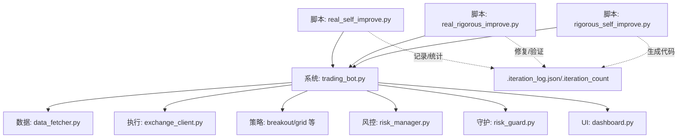

**图示来源**
- [scripts/real_self_improve.py](file://scripts/real_self_improve.py#L1-L166)
- [scripts/real_rigorous_improve.py](file://scripts/real_rigorous_improve.py#L1-L261)
- [scripts/rigorous_self_improve.py](file://scripts/rigorous_self_improve.py#L1-L216)
- [src/trading_bot.py](file://src/trading_bot.py#L1-L346)
- [src/data/data_fetcher.py](file://src/data/data_fetcher.py#L1-L434)
- [src/execution/exchange_client.py](file://src/execution/exchange_client.py#L1-L432)
- [src/utils/risk_manager.py](file://src/utils/risk_manager.py#L1-L388)
- [src/aetherlife/guard/risk_guard.py](file://src/aetherlife/guard/risk_guard.py#L1-L84)
- [src/ui/dashboard.py](file://src/ui/dashboard.py#L1-L385)

## 详细组件分析

### 组件A：现实自我改进脚本（real_self_improve.py）
- 主题池与分类
  - UI/UX、策略、风控、数据/AI、执行、基础设施六大类别，覆盖系统关键能力域。
- 运行流程
  - 读取迭代计数，随机选择主题，异步搜索主题相关内容，根据类别生成改进描述，记录日志并持久化迭代计数。
- 关键特性
  - 异步搜索与打印，避免阻塞；每轮迭代后短暂休眠，控制节奏。
- 实施建议
  - 将搜索结果映射到具体模块（如UI仪表盘、策略策略、风控规则、数据源、执行逻辑、基础设施），并在日志中记录改进项与时间戳，便于回溯。

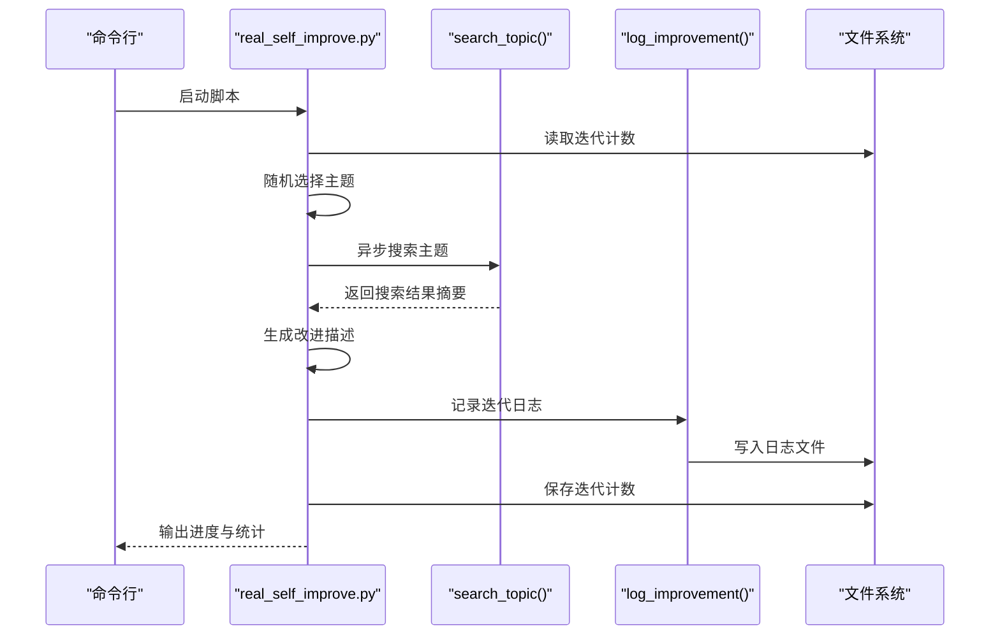

**图示来源**
- [scripts/real_self_improve.py](file://scripts/real_self_improve.py#L58-L127)

**章节来源**
- [scripts/real_self_improve.py](file://scripts/real_self_improve.py#L1-L166)

### 组件B：严谨自我改进脚本（rigorous_self_improve.py）
- 任务清单与GitHub搜索
  - 每个任务包含类别、主题、目标文件、搜索关键词与生成的代码模板。
- 代码注入与验证
  - 通过搜索结果生成类定义与方法骨架，注入到目标文件；若文件不存在则创建，存在则追加；随后记录日志并保存迭代计数。
- 实施建议
  - 将搜索关键词与参考项目名称纳入注释，便于后续溯源与升级。

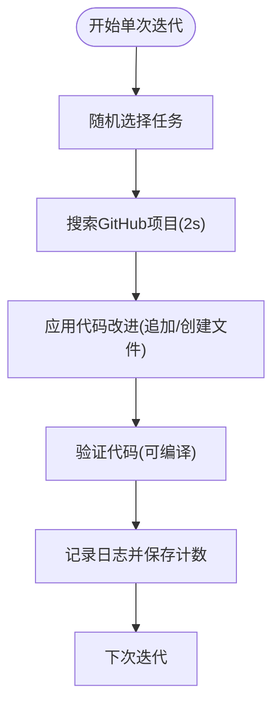

**图示来源**
- [scripts/rigorous_self_improve.py](file://scripts/rigorous_self_improve.py#L131-L184)

**章节来源**
- [scripts/rigorous_self_improve.py](file://scripts/rigorous_self_improve.py#L1-L216)

### 组件C：真实严谨自我改进脚本（real_rigorous_improve.py）
- 四步法：扫描问题→搜索方案→实施修复→验证
  - 扫描：遍历src目录，识别TODO、裸异常、空函数、硬编码等潜在问题。
  - 搜索：针对问题类型检索GitHub仓库，返回高星项目。
  - 实施：根据问题类型生成修复代码并插入到指定行。
  - 验证：尝试编译目标文件，判断修复是否通过。
- 实施建议
  - 对于“硬编码密码”等高危问题，优先修复；对“空函数实现”等可延后的问题，保留TODO以便后续完善。

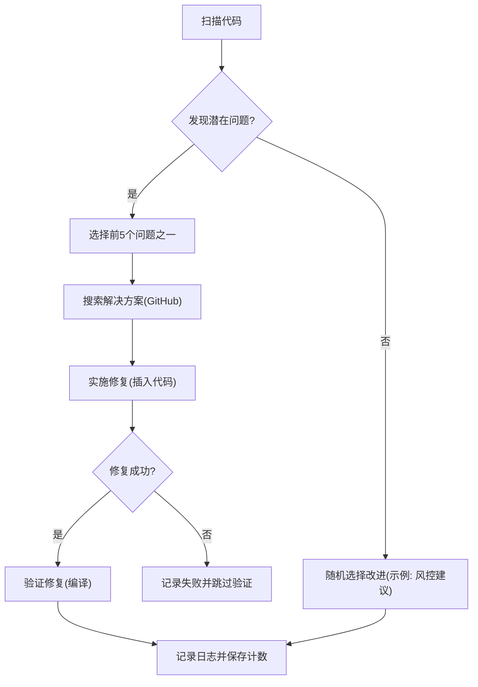

**图示来源**
- [scripts/real_rigorous_improve.py](file://scripts/real_rigorous_improve.py#L163-L230)

**章节来源**
- [scripts/real_rigorous_improve.py](file://scripts/real_rigorous_improve.py#L1-L261)

### 组件D：交易系统核心（trading_bot.py）
- 数据与策略
  - 并发获取OHLCV与Ticker，策略生成信号，支持多策略工厂创建。
- 执行与风控
  - 仓位计算、下单、撤单、止损止盈、熔断与日限控制；位置管理与盈亏统计。
- 实施建议
  - 在策略层引入参数化与回测框架，结合风控参数动态调整，确保在不同市场环境下稳健运行。

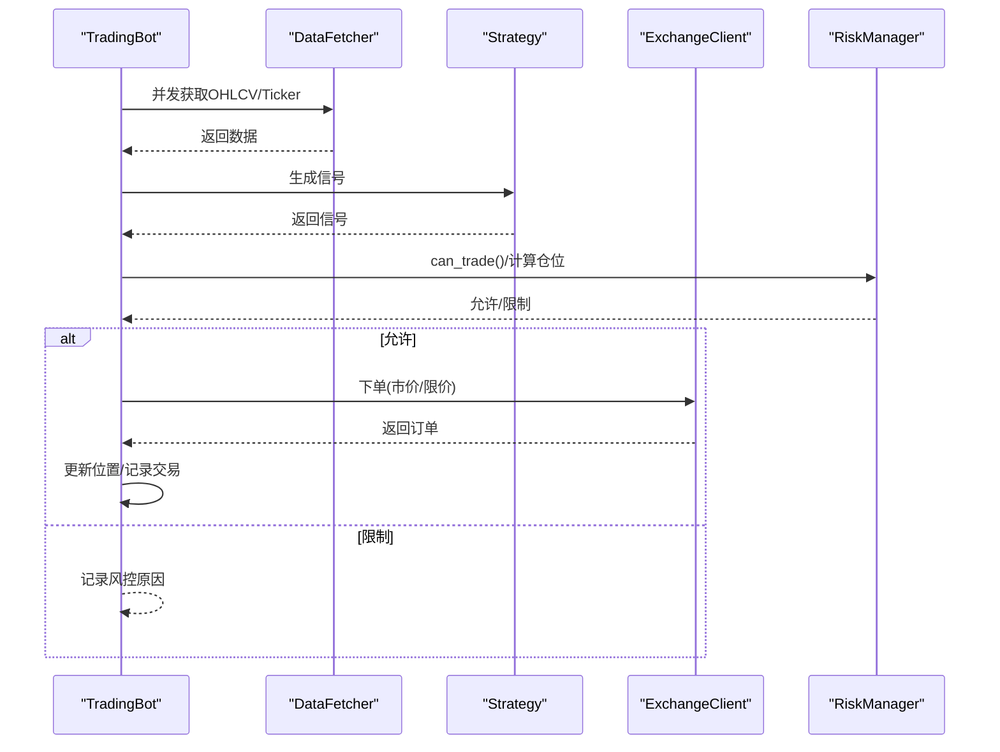

**图示来源**
- [src/trading_bot.py](file://src/trading_bot.py#L92-L205)

**章节来源**
- [src/trading_bot.py](file://src/trading_bot.py#L1-L346)

### 组件E：风控体系（risk_manager.py + risk_guard.py）
- 风控管理器（RiskManager）
  - 仓位规模、止损止盈、追踪止损、熔断、日限、连败控制、暂停与恢复。
- 守护层（RiskGuard）
  - 电路断路器、单日最大亏损、HITL（大额人工确认）、审计日志。
- 实施建议
  - 将风控参数纳入配置文件，结合市场波动率动态调整；在极端行情下启用熔断与暂停，避免系统性风险。

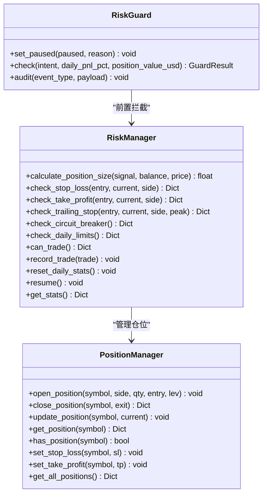

**图示来源**
- [src/utils/risk_manager.py](file://src/utils/risk_manager.py#L12-L241)
- [src/aetherlife/guard/risk_guard.py](file://src/aetherlife/guard/risk_guard.py#L23-L84)

**章节来源**
- [src/utils/risk_manager.py](file://src/utils/risk_manager.py#L1-L388)
- [src/aetherlife/guard/risk_guard.py](file://src/aetherlife/guard/risk_guard.py#L1-L84)

### 组件F：数据与执行（data_fetcher.py + exchange_client.py）
- 数据获取
  - Binance/OKX多交易所支持，异步HTTP与WebSocket，K线、Ticker、订单簿、资金费率等。
- 交易所客户端
  - 签名、精度处理、杠杆设置、下单/撤单、错误包装。
- 实施建议
  - 在策略与风控中加入对数据质量与延迟的监控，确保信号与风控决策的时效性。

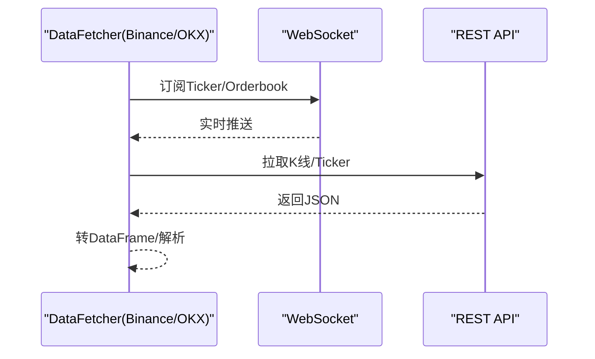

**图示来源**
- [src/data/data_fetcher.py](file://src/data/data_fetcher.py#L188-L234)
- [src/data/data_fetcher.py](file://src/data/data_fetcher.py#L327-L396)
- [src/execution/exchange_client.py](file://src/execution/exchange_client.py#L136-L171)

**章节来源**
- [src/data/data_fetcher.py](file://src/data/data_fetcher.py#L1-L434)
- [src/execution/exchange_client.py](file://src/execution/exchange_client.py#L1-L432)

### 组件G：策略模块（breakout.py + grid.py）
- 突破策略（BreakoutStrategy）
  - SMA、布林带、ATR、MACD、RSI等指标，基于突破阈值生成信号。
- 网格策略（GridStrategy）
  - 基于网格线与当前价格生成买卖信号。
- 实施建议
  - 将策略参数纳入配置文件，结合回测框架评估不同参数组合下的收益与风险。

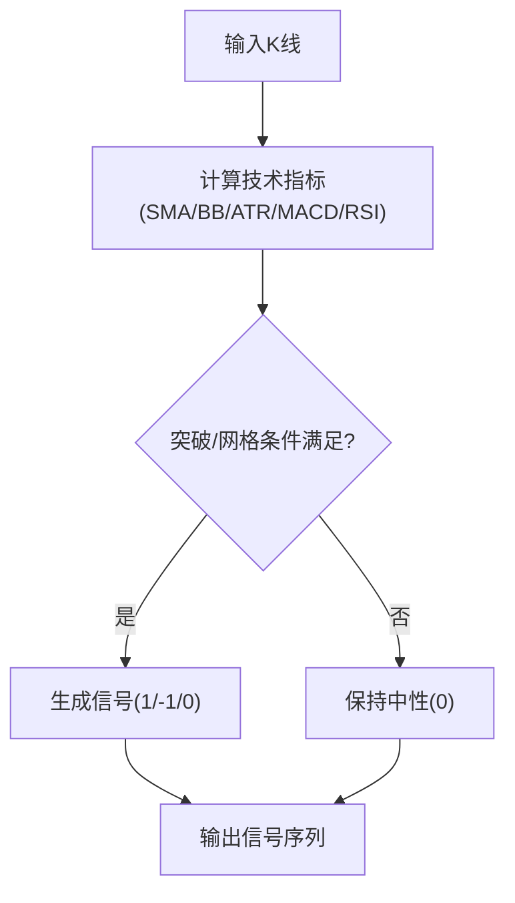

**图示来源**
- [src/strategies/breakout.py](file://src/strategies/breakout.py#L21-L78)
- [src/strategies/grid.py](file://src/strategies/grid.py#L20-L62)

**章节来源**
- [src/strategies/breakout.py](file://src/strategies/breakout.py#L1-L79)
- [src/strategies/grid.py](file://src/strategies/grid.py#L1-L63)

### 组件H：UI仪表盘（dashboard.py）
- 提供Web UI，展示资产、持仓、交易与K线图表，支持手动交易与策略状态。
- 实施建议
  - 将UI与交易系统解耦，通过API暴露状态与操作，便于在脚本改进后快速验证UI更新。

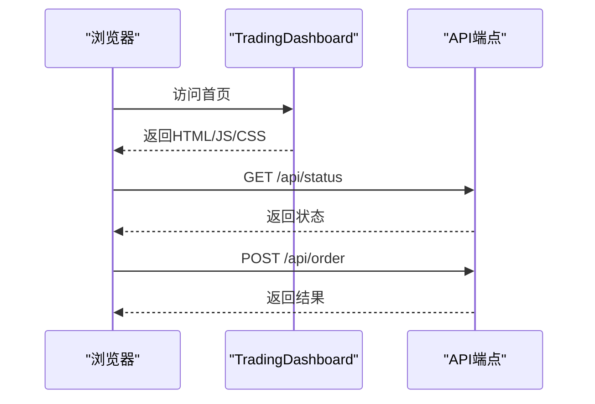

**图示来源**
- [src/ui/dashboard.py](file://src/ui/dashboard.py#L31-L378)

**章节来源**
- [src/ui/dashboard.py](file://src/ui/dashboard.py#L1-L385)

## 依赖关系分析
- 脚本与系统
  - “现实自我改进脚本”通过主题池与日志驱动系统改进；“严谨自我改进脚本”通过任务清单与代码注入直接改变系统实现；“真实严谨自我改进脚本”通过静态扫描与修复提升系统质量。
- 系统内部
  - trading_bot.py 依赖 data_fetcher、exchange_client、risk_manager、risk_guard、策略模块与UI；配置文件决定交易所、策略、杠杆、风控参数等。
- 外部依赖
  - Binance/OKX API、WebSocket、第三方库（pandas、aiohttp、numpy等）。

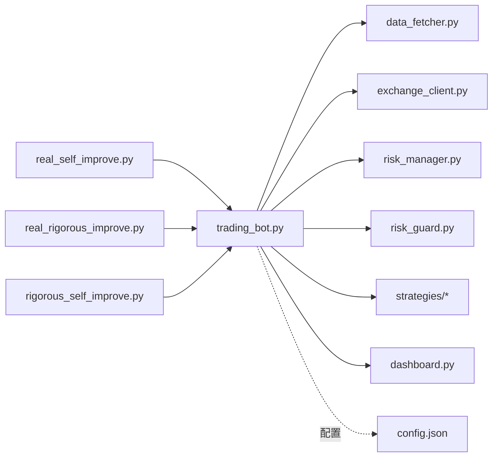

**图示来源**
- [scripts/real_self_improve.py](file://scripts/real_self_improve.py#L1-L166)
- [scripts/real_rigorous_improve.py](file://scripts/real_rigorous_improve.py#L1-L261)
- [scripts/rigorous_self_improve.py](file://scripts/rigorous_self_improve.py#L1-L216)
- [src/trading_bot.py](file://src/trading_bot.py#L1-L346)
- [configs/config.json](file://configs/config.json#L1-L28)

**章节来源**
- [src/trading_bot.py](file://src/trading_bot.py#L1-L346)
- [configs/config.json](file://configs/config.json#L1-L28)

## 性能考量
- 异步与并发
  - 数据获取与策略分析采用并发，减少等待时间；脚本层使用异步搜索与睡眠控制，避免资源占用过高。
- 精度与容错
  - 交易所下单前进行精度处理与最小单位校验，降低错误下单概率；风控前置拦截与熔断机制降低系统性风险。
- 监控与日志
  - 通过UI与日志记录关键指标（余额、盈亏、交易次数、信号变化），便于评估改进效果。

[本节为通用指导，无需特定文件来源]

## 故障排查指南
- 常见问题
  - API错误：检查API密钥、网络连接与超时设置；查看错误包装信息。
  - 精度错误：确认交易所最小下单量与步长，确保数量四舍五入符合要求。
  - 熔断与风控限制：关注风控日志与暂停原因，必要时手动恢复。
- 排查步骤
  - 查看日志文件与UI状态；核对配置文件；验证数据源可用性；确认策略参数与风控阈值。
- 工具与方法
  - 使用UI仪表盘观察实时状态；通过API端点验证数据与订单；利用脚本日志回溯改进过程。

**章节来源**
- [src/execution/exchange_client.py](file://src/execution/exchange_client.py#L136-L171)
- [src/utils/risk_manager.py](file://src/utils/risk_manager.py#L129-L153)
- [src/ui/dashboard.py](file://src/ui/dashboard.py#L338-L374)

## 结论
“现实自我改进脚本”提供了在真实市场环境中持续优化交易系统的可行路径：通过主题驱动的探索、严谨的任务注入与自动修复，系统能够在UI、策略、风控、数据、执行与基础设施等方面不断演进。结合交易系统核心的并发数据流、风控前置与熔断机制，可以在不确定的市场条件下保持稳定性，并通过参数化与回测框架实现收益优化与风险控制的动态平衡。

[本节为总结性内容，无需特定文件来源]

## 附录

### 实施案例与执行策略
- 案例一：UI可视化增强
  - 选择主题：UI/UX（K线图表、订单簿组件、实时价格大字等）
  - 执行：在dashboard.py中新增可视化组件，通过API暴露数据，验证渲染效果。
  - 评估：对比改进前后用户反馈与操作效率。
- 案例二：策略模块扩展
  - 选择主题：策略（突破策略、网格策略、RSI策略、MACD策略）
  - 执行：在rigorous_self_improve.py中为每个策略生成类定义与方法骨架，注入到对应文件。
  - 评估：结合回测框架评估不同策略参数组合的收益与风险。
- 案例三：风控规则强化
  - 选择主题：风控（止损机制、止盈机制、仓位计算、最大回撤控制）
  - 执行：在risk_manager.py中新增或完善相关方法，结合RiskGuard实现电路断路器与HITL。
  - 评估：在模拟盘中验证风控规则对回撤与最大连续亏损的影响。

**章节来源**
- [scripts/rigorous_self_improve.py](file://scripts/rigorous_self_improve.py#L21-L67)
- [src/ui/dashboard.py](file://src/ui/dashboard.py#L13-L378)
- [src/utils/risk_manager.py](file://src/utils/risk_manager.py#L62-L153)
- [src/aetherlife/guard/risk_guard.py](file://src/aetherlife/guard/risk_guard.py#L48-L68)

### 参数调优与效果评估
- 参数来源
  - 配置文件：exchange、testnet、symbols、timeframe、strategy、leverage、strategy_config、risk、ai_enhance。
- 调优建议
  - 策略：调整lookback_period、threshold、atr_multiplier等；结合回测评估收益与回撤。
  - 风控：调整max_position_pct、stop_loss_pct、take_profit_pct、max_daily_trades、max_consecutive_losses、circuit_breaker_loss_pct。
  - 执行：优化下单精度与滑点控制，减少手续费与冲击成本。
- 效果评估
  - 通过UI与日志统计总交易次数、日交易次数、胜率、盈亏分布与最大回撤；对比改进前后的关键指标。

**章节来源**
- [configs/config.json](file://configs/config.json#L1-L28)
- [src/trading_bot.py](file://src/trading_bot.py#L300-L320)
- [src/utils/risk_manager.py](file://src/utils/risk_manager.py#L155-L173)

### 实际交易场景模拟与测试
- 模拟步骤
  - 使用测试网（testnet）与模拟资金进行回放测试；开启UI观察实时状态；在严格风控下进行小规模实盘测试。
- 测试方法
  - 并发数据拉取与策略分析；风控前置拦截；熔断与暂停机制验证；HITL流程演练。
- 工具与方法
  - UI仪表盘、API端点、日志与配置文件；脚本日志用于回溯改进过程。

**章节来源**
- [src/trading_bot.py](file://src/trading_bot.py#L63-L91)
- [src/ui/dashboard.py](file://src/ui/dashboard.py#L338-L374)
- [src/aetherlife/guard/risk_guard.py](file://src/aetherlife/guard/risk_guard.py#L48-L68)

### 性能监控与效果跟踪
- 监控指标
  - 总交易次数、日交易次数、胜率、盈亏分布、最大回撤、信号变化频率、数据延迟。
- 跟踪方法
  - UI实时展示；日志记录与归档；脚本迭代统计与主题分布；风控统计与暂停原因。
- 工具与方法
  - dashboard.py API端点；risk_manager统计接口；脚本日志文件；配置文件参数化。

**章节来源**
- [src/ui/dashboard.py](file://src/ui/dashboard.py#L338-L374)
- [src/utils/risk_manager.py](file://src/utils/risk_manager.py#L233-L241)
- [scripts/real_self_improve.py](file://scripts/real_self_improve.py#L138-L162)