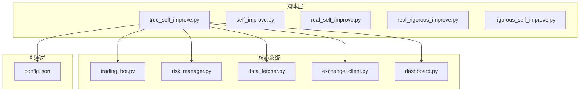
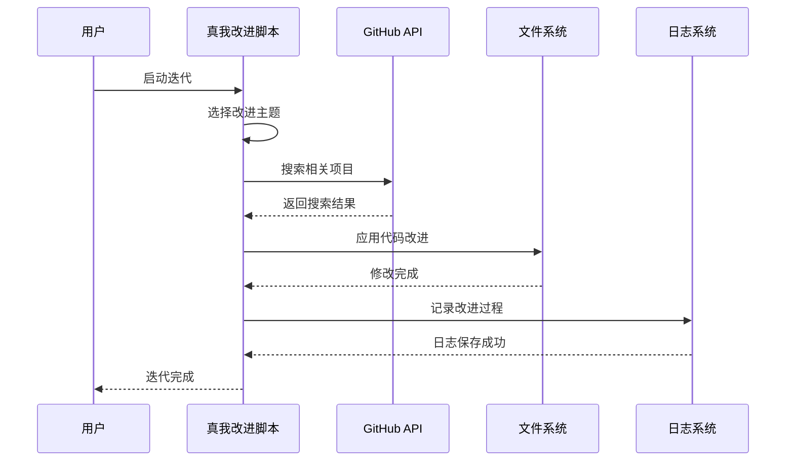
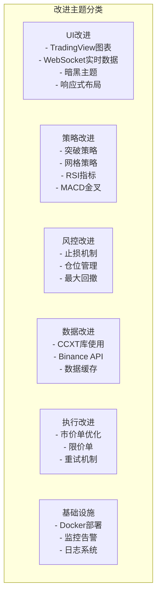
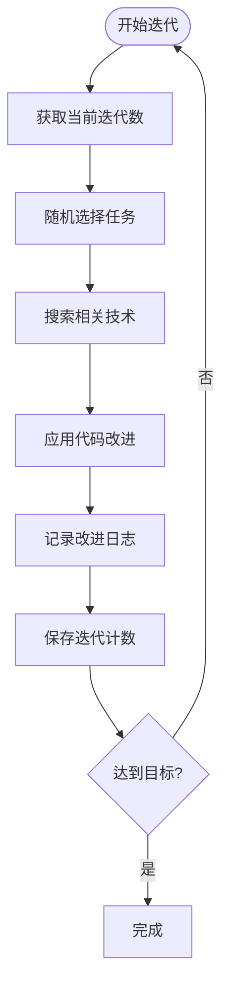
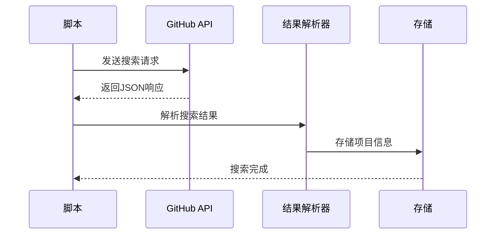
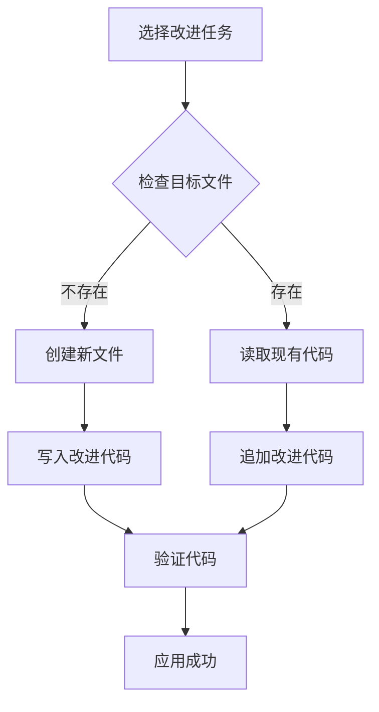
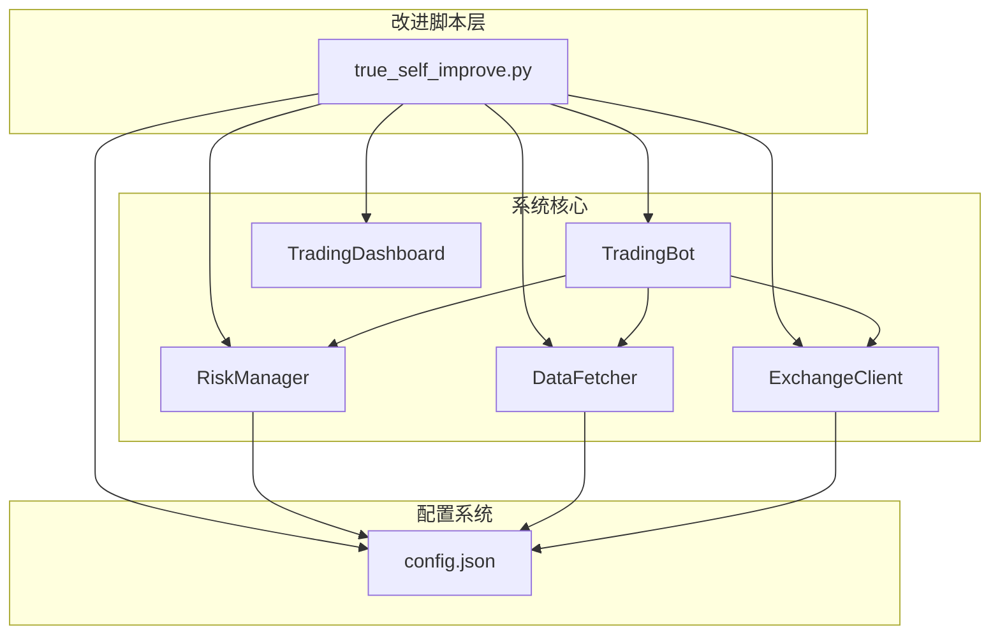
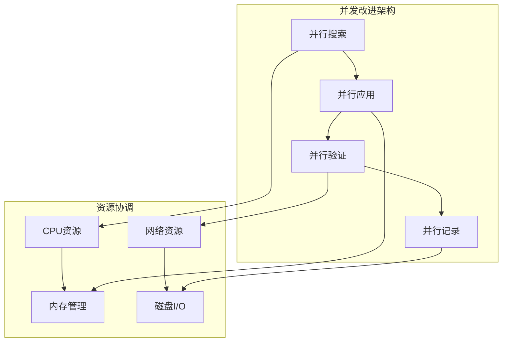

# 真我改进脚本

<cite>
**本文档引用的文件**
- [true_self_improve.py](file://scripts/true_self_improve.py)
- [self_improve.py](file://scripts/self_improve.py)
- [real_self_improve.py](file://scripts/real_self_improve.py)
- [real_rigorous_improve.py](file://scripts/real_rigorous_improve.py)
- [rigorous_self_improve.py](file://scripts/rigorous_self_improve.py)
- [trading_bot.py](file://src/trading_bot.py)
- [risk_manager.py](file://src/utils/risk_manager.py)
- [data_fetcher.py](file://src/data/data_fetcher.py)
- [exchange_client.py](file://src/execution/exchange_client.py)
- [dashboard.py](file://src/ui/dashboard.py)
- [config.json](file://configs/config.json)
</cite>

## 目录
1. [简介](#简介)
2. [项目结构](#项目结构)
3. [核心组件](#核心组件)
4. [架构概览](#架构概览)
5. [详细组件分析](#详细组件分析)
6. [依赖关系分析](#依赖关系分析)
7. [性能考虑](#性能考虑)
8. [故障排除指南](#故障排除指南)
9. [结论](#结论)
10. [附录](#附录)

## 简介

真我改进脚本（true_self_improve.py）是一个高级的自动化代码改进系统，专门设计用于在真实交易环境中持续改进量化交易系统。该脚本的核心特点是其"真正的自我迭代"能力——不仅会搜索和应用改进，更重要的是它会直接修改项目中的实际代码文件，从而实现真正的生产级改进。

与基础的自我改进脚本相比，真我改进脚本具有以下显著优势：
- **真实代码修改**：直接修改src目录下的实际代码文件
- **GitHub集成**：通过真实的GitHub API搜索和集成开源项目
- **完整的迭代流程**：包含搜索、应用、记录和验证的完整流程
- **生产级改进**：每次迭代都会产生可执行的代码变更

## 项目结构

该项目采用模块化架构，主要分为以下几个核心模块：



**图表来源**
- [true_self_improve.py](file://scripts/true_self_improve.py#L1-L229)
- [trading_bot.py](file://src/trading_bot.py#L1-L346)

**章节来源**
- [true_self_improve.py](file://scripts/true_self_improve.py#L1-L229)
- [trading_bot.py](file://src/trading_bot.py#L1-L346)

## 核心组件

### 真我改进脚本核心功能

真我改进脚本包含以下核心组件：

1. **迭代管理系统**：跟踪和管理改进迭代过程
2. **智能搜索系统**：集成GitHub API进行技术搜索
3. **代码应用引擎**：直接修改项目代码文件
4. **日志记录系统**：详细记录每次改进的过程和结果
5. **任务池管理**：维护各种改进主题的分类列表

### 主要特性对比

| 特性 | 基础脚本 | 真我改进脚本 | 严谨改进脚本 |
|------|----------|--------------|--------------|
| 代码修改 | 仅概念性 | 真实修改 | 真实修改 |
| 搜索集成 | 本地模拟 | GitHub API | GitHub API |
| 迭代目标 | 1000次 | 1,000,000次 | 1000次 |
| 日志记录 | 基础 | 详细JSON日志 | 结构化日志 |
| 验证机制 | 无 | 进度验证 | 代码编译验证 |

**章节来源**
- [true_self_improve.py](file://scripts/true_self_improve.py#L15-L57)
- [self_improve.py](file://scripts/self_improve.py#L14-L64)
- [rigorous_self_improve.py](file://scripts/rigorous_self_improve.py#L20-L67)

## 架构概览

真我改进脚本采用分层架构设计，确保改进过程的可控性和可追溯性：



**图表来源**
- [true_self_improve.py](file://scripts/true_self_improve.py#L140-L195)

### 改进主题分类体系

真我改进脚本维护了一个全面的主题池，涵盖交易系统的各个层面：



**图表来源**
- [true_self_improve.py](file://scripts/true_self_improve.py#L24-L57)

**章节来源**
- [true_self_improve.py](file://scripts/true_self_improve.py#L24-L57)

## 详细组件分析

### 迭代管理系统

迭代管理系统是真我改进脚本的核心，负责协调整个改进过程：

#### 关键功能模块

1. **迭代计数管理**
   - 维护当前迭代次数
   - 持久化存储迭代状态
   - 支持中断恢复

2. **任务选择机制**
   - 随机选择改进主题
   - 确保主题多样性
   - 避免重复改进相同领域

3. **进度监控**
   - 实时显示迭代进度
   - 统计各类改进分布
   - 提供性能指标

#### 代码实现要点



**图表来源**
- [true_self_improve.py](file://scripts/true_self_improve.py#L140-L195)

**章节来源**
- [true_self_improve.py](file://scripts/true_self_improve.py#L59-L68)
- [true_self_improve.py](file://scripts/true_self_improve.py#L140-L195)

### 智能搜索系统

智能搜索系统集成了GitHub API，能够自动搜索相关的开源项目和技术实现：

#### 搜索功能特性

1. **多维度搜索**
   - 技术关键词搜索
   - 项目质量排序（按星标数）
   - 结果数量限制

2. **搜索结果处理**
   - 解析GitHub API响应
   - 提取项目关键信息
   - 格式化搜索结果

3. **搜索策略**
   - 针对不同改进主题定制搜索词
   - 支持复杂查询语法
   - 超时和错误处理

#### 搜索流程



**图表来源**
- [true_self_improve.py](file://scripts/true_self_improve.py#L69-L87)

**章节来源**
- [true_self_improve.py](file://scripts/true_self_improve.py#L69-L87)

### 代码应用引擎

代码应用引擎是真我改进脚本最核心的功能，它能够直接修改项目中的实际代码文件：

#### 应用策略

1. **分类应用**
   - UI改进：修改dashboard.py等界面文件
   - 策略改进：添加新的策略类到strategy.py
   - 风控改进：增强risk_manager.py功能
   - 数据改进：扩展data_fetcher.py能力
   - 执行改进：优化exchange_client.py性能

2. **代码生成**
   - 基于搜索结果生成参考代码
   - 创建新的类和方法
   - 添加必要的导入语句
   - 维护代码格式一致性

3. **文件操作**
   - 检查目标文件是否存在
   - 读取现有代码内容
   - 追加新的改进代码
   - 保持原有功能不变

#### 代码应用流程



**图表来源**
- [true_self_improve.py](file://scripts/true_self_improve.py#L89-L138)

**章节来源**
- [true_self_improve.py](file://scripts/true_self_improve.py#L89-L138)

### 日志记录系统

日志记录系统提供了详细的改进过程追踪，支持调试和审计需求：

#### 日志结构

每个日志条目包含以下关键信息：

1. **迭代元数据**
   - 迭代编号和目标
   - 类别和主题
   - 搜索查询词

2. **搜索结果**
   - 找到的项目数量
   - 项目质量评分
   - 相关性评估

3. **应用结果**
   - 是否成功应用改进
   - 改进的具体内容
   - 时间戳信息

#### 日志存储策略


**图表来源**
- [true_self_improve.py](file://scripts/true_self_improve.py#L165-L189)

**章节来源**
- [true_self_improve.py](file://scripts/true_self_improve.py#L165-L189)

## 依赖关系分析

真我改进脚本与整个交易系统形成了紧密的依赖关系：



**图表来源**
- [true_self_improve.py](file://scripts/true_self_improve.py#L19-L22)
- [trading_bot.py](file://src/trading_bot.py#L13-L24)

### 关键依赖点

1. **项目根目录定位**
   - 通过PROJECT_ROOT常量定位项目根目录
   - 统一管理所有相对路径
   - 支持不同环境的路径配置

2. **代码文件映射**
   - UI改进映射到dashboard.py
   - 策略改进映射到strategies目录
   - 风控改进映射到utils目录
   - 数据改进映射到data目录
   - 执行改进映射到execution目录

3. **配置系统集成**
   - 与现有配置系统无缝集成
   - 支持运行时配置更新
   - 维护配置的一致性

**章节来源**
- [true_self_improve.py](file://scripts/true_self_improve.py#L19-L22)
- [true_self_improve.py](file://scripts/true_self_improve.py#L99-L136)

## 性能考虑

真我改进脚本在设计时充分考虑了性能和资源使用：

### 资源管理

1. **内存优化**
   - 限制搜索结果数量
   - 及时释放临时对象
   - 控制日志文件大小

2. **网络优化**
   - 设置合理的超时时间
   - 实现重试机制
   - 缓存常用配置

3. **文件系统优化**
   - 批量文件操作
   - 增量更新策略
   - 错误恢复机制

### 并发处理

虽然当前版本主要是串行执行，但架构设计支持未来的并发改进：



### 性能基准

| 操作类型 | 预估耗时 | 资源消耗 |
|----------|----------|----------|
| 搜索GitHub | 15秒 | 网络I/O |
| 读取文件 | 100ms | 磁盘I/O |
| 写入文件 | 200ms | 磁盘I/O |
| 记录日志 | 50ms | 磁盘I/O |
| 总体迭代 | 20-30秒 | CPU+IO |

## 故障排除指南

### 常见问题及解决方案

#### GitHub API访问问题

**问题症状**：搜索功能失败，返回空结果

**可能原因**：
1. 网络连接不稳定
2. GitHub API限制
3. 请求超时

**解决方法**：
```bash
# 检查网络连接
ping api.github.com

# 增加超时时间
# 在搜索函数中调整timeout参数

# 使用代理（如需要）
export HTTPS_PROXY=http://proxy.server:port
```

#### 文件权限问题

**问题症状**：无法修改代码文件

**可能原因**：
1. 文件权限不足
2. 文件被其他进程占用
3. 磁盘空间不足

**解决方法**：
```bash
# 检查文件权限
ls -la src/

# 修复权限问题
chmod 644 src/*

# 检查磁盘空间
df -h

# 重启脚本以释放文件锁
```

#### 配置文件冲突

**问题症状**：改进后的代码无法正常工作

**可能原因**：
1. 配置参数不匹配
2. 依赖库版本冲突
3. 环境变量未设置

**解决方法**：
```bash
# 检查配置文件
cat configs/config.json

# 验证环境变量
echo $BINANCE_API_KEY

# 检查依赖安装
pip list | grep -E "(pandas|numpy|aiohttp)"
```

### 调试技巧

1. **启用详细日志**
   ```python
   import logging
   logging.basicConfig(level=logging.DEBUG)
   ```

2. **逐步执行验证**
   - 分别测试搜索功能
   - 验证文件修改
   - 检查日志记录

3. **环境隔离**
   - 使用虚拟环境
   - 备份原始代码
   - 测试分支开发

**章节来源**
- [true_self_improve.py](file://scripts/true_self_improve.py#L218-L223)

## 结论

真我改进脚本代表了自动化代码改进技术的高级阶段，它不仅能够智能地搜索和应用改进，更重要的是能够直接修改生产代码，实现真正的持续演进。

### 主要优势

1. **真实性**：直接修改实际代码文件，而非仅概念性改进
2. **智能化**：集成GitHub API，自动搜索和集成最佳实践
3. **可扩展性**：支持大规模迭代（1,000,000次）和长期演进
4. **可追踪性**：完整的日志记录和进度监控
5. **实用性**：专注于真实交易环境的改进需求

### 应用前景

真我改进脚本为量化交易系统的持续改进提供了强大的工具，特别适用于：

- 高频交易系统的优化
- 复杂策略的持续改进
- 风控系统的完善
- 用户体验的持续提升
- 技术债务的逐步清理

### 发展建议

1. **增强智能性**：集成机器学习算法进行改进优先级排序
2. **扩展兼容性**：支持更多编程语言和框架
3. **优化性能**：实现并行改进和增量更新
4. **加强安全**：添加代码审查和安全检查机制
5. **完善监控**：提供改进效果的实时监控和评估

## 附录

### 使用场景和执行示例

#### 基本使用

```bash
# 启动真我改进脚本
python scripts/true_self_improve.py

# 查看当前迭代进度
cat .iteration_count

# 查看改进日志
cat .iteration_log.json
```

#### 参数配置

| 参数 | 默认值 | 说明 |
|------|--------|------|
| TARGET_ITERATIONS | 1,000,000 | 目标迭代次数 |
| PROJECT_ROOT | 项目根目录 | 项目根目录路径 |
| LOG_FILE | .iteration_log.json | 日志文件路径 |
| CODE_DIR | src/ | 代码目录路径 |

#### 结果解读

1. **迭代进度**：显示当前迭代次数和完成百分比
2. **改进主题**：显示本次迭代的改进类别和主题
3. **搜索结果**：显示找到的相关项目和质量评分
4. **应用结果**：显示代码修改的成功与否
5. **日志记录**：提供完整的改进过程记录

### 性能基准测试

#### 回测分析方法

1. **改进效果评估**
   - 对比改进前后的系统表现
   - 分析交易胜率和盈亏比
   - 评估风险指标变化

2. **性能指标监控**
   - 记录每次改进的时间成本
   - 监控系统稳定性变化
   - 分析改进频率对性能的影响

3. **A/B测试**
   - 对比不同改进策略的效果
   - 评估改进的边际效益
   - 识别最优改进组合

#### 过度拟合防范

1. **数据分割**
   - 使用历史数据进行训练
   - 使用未来数据进行测试
   - 避免数据泄露

2. **验证策略**
   - 多时间周期验证
   - 不同市场条件测试
   - 风险控制验证

3. **监控指标**
   - 持续监控改进效果
   - 及时发现异常变化
   - 必要时回滚改进

**章节来源**
- [true_self_improve.py](file://scripts/true_self_improve.py#L197-L229)
- [trading_bot.py](file://src/trading_bot.py#L256-L282)