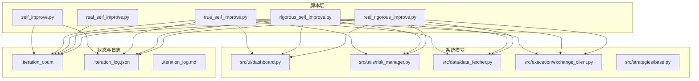
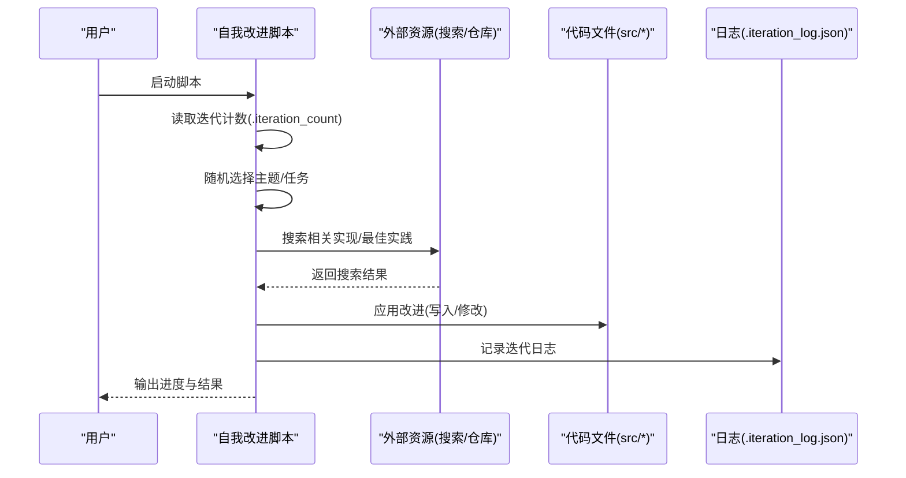
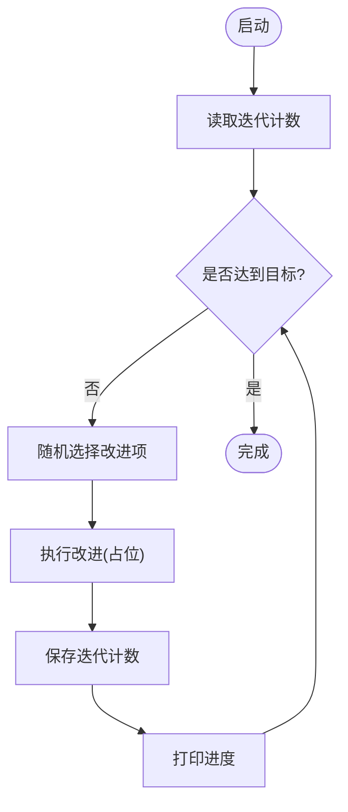
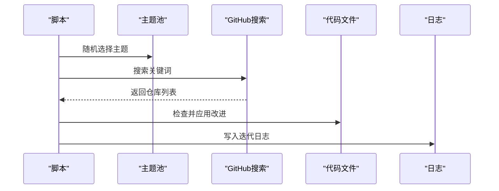
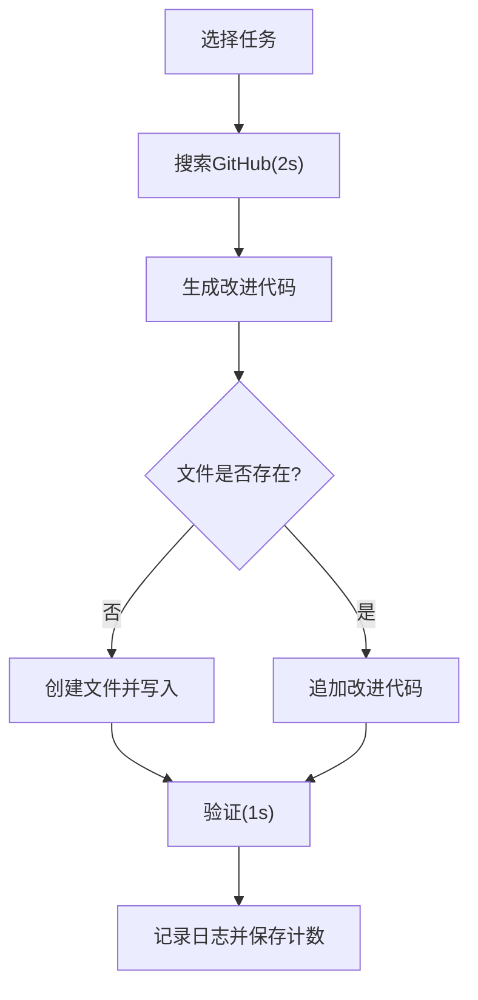
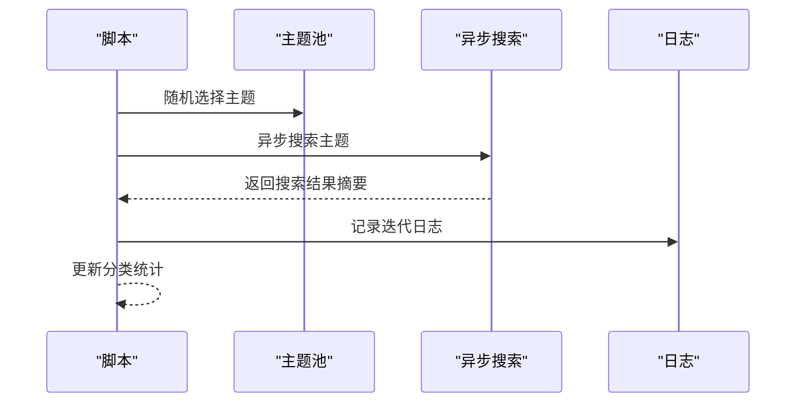
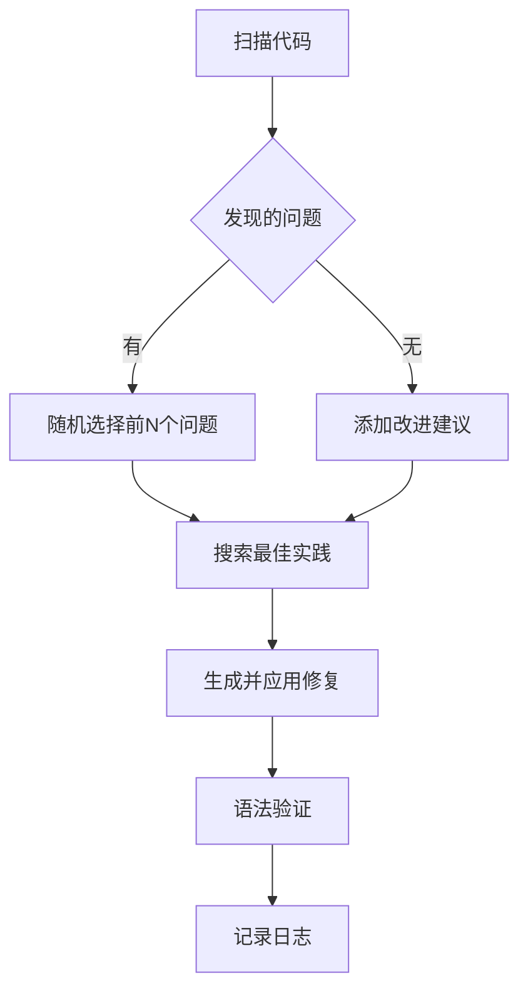
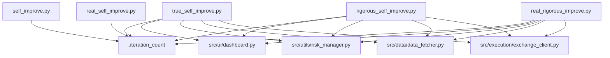

# 自我改进脚本

<cite>
**本文引用的文件**
- [scripts/self_improve.py](file://scripts/self_improve.py)
- [scripts/true_self_improve.py](file://scripts/true_self_improve.py)
- [scripts/rigorous_self_improve.py](file://scripts/rigorous_self_improve.py)
- [scripts/real_self_improve.py](file://scripts/real_self_improve.py)
- [scripts/real_rigorous_improve.py](file://scripts/real_rigorous_improve.py)
- [requirements.txt](file://requirements.txt)
- [.iteration_count](file://.iteration_count)
- [.iteration_log.json](file://.iteration_log.json)
- [.iteration_log.md](file://.iteration_log.md)
- [src/ui/dashboard.py](file://src/ui/dashboard.py)
- [src/utils/risk_manager.py](file://src/utils/risk_manager.py)
- [src/data/data_fetcher.py](file://src/data/data_fetcher.py)
- [src/execution/exchange_client.py](file://src/execution/exchange_client.py)
- [src/strategies/base.py](file://src/strategies/base.py)
</cite>

## 目录
1. [简介](#简介)
2. [项目结构](#项目结构)
3. [核心组件](#核心组件)
4. [架构概览](#架构概览)
5. [详细组件分析](#详细组件分析)
6. [依赖分析](#依赖分析)
7. [性能考虑](#性能考虑)
8. [故障排除指南](#故障排除指南)
9. [结论](#结论)
10. [附录](#附录)

## 简介
本指南面向量化交易系统的自我改进脚本，系统性解析以下五类脚本的设计理念、工作机制与最佳实践：
- 基础自我改进脚本（self_improve.py）：演示型迭代引擎，负责维护改进清单、迭代计数与进度跟踪。
- 真我改进脚本（true_self_improve.py）：联网搜索驱动的改进脚本，按主题池随机选择并应用到代码文件。
- 严格自我改进脚本（rigorous_self_improve.py）：严谨版迭代，针对具体任务生成代码并写入文件，强调“搜索-改进-验证”的闭环。
- 现实自我改进脚本（real_self_improve.py）：异步搜索与主题驱动的改进脚本，统计各分类改进分布。
- 现实严格自我改进脚本（real_rigorous_improve.py）：以代码扫描发现问题、搜索方案、实施修复并验证的完整流程。

这些脚本共同构成系统持续演进的“自我迭代引擎”，既可用于概念验证，也可作为真实项目改进的参考范式。

## 项目结构
脚本位于 scripts/ 目录，核心系统模块位于 src/ 目录，迭代状态与日志分别由 .iteration_count 和 .iteration_log.json/.iteration_log.md 管理。

**图示来源**
- [scripts/self_improve.py](file://scripts/self_improve.py#L1-L115)
- [scripts/true_self_improve.py](file://scripts/true_self_improve.py#L1-L229)
- [scripts/rigorous_self_improve.py](file://scripts/rigorous_self_improve.py#L1-L216)
- [scripts/real_self_improve.py](file://scripts/real_self_improve.py#L1-L166)
- [scripts/real_rigorous_improve.py](file://scripts/real_rigorous_improve.py#L1-L261)
- [.iteration_count](file://.iteration_count#L1-L1)
- [.iteration_log.json](file://.iteration_log.json#L1-L800)
- [.iteration_log.md](file://.iteration_log.md#L1-L11)
- [src/ui/dashboard.py](file://src/ui/dashboard.py#L1-L385)
- [src/utils/risk_manager.py](file://src/utils/risk_manager.py#L1-L388)
- [src/data/data_fetcher.py](file://src/data/data_fetcher.py#L1-L434)
- [src/execution/exchange_client.py](file://src/execution/exchange_client.py#L1-L432)

**章节来源**
- [scripts/self_improve.py](file://scripts/self_improve.py#L1-L115)
- [scripts/true_self_improve.py](file://scripts/true_self_improve.py#L1-L229)
- [scripts/rigorous_self_improve.py](file://scripts/rigorous_self_improve.py#L1-L216)
- [scripts/real_self_improve.py](file://scripts/real_self_improve.py#L1-L166)
- [scripts/real_rigorous_improve.py](file://scripts/real_rigorous_improve.py#L1-L261)

## 核心组件
- 迭代计数与日志
  - 迭代计数文件：.iteration_count，记录当前迭代轮次。
  - 迭代日志：.iteration_log.json，记录每次迭代的主题、搜索结果、改进应用情况；.iteration_log.md 提供摘要格式。
- 改进清单与主题池
  - 基础脚本维护统一的改进清单（IMPROVEMENTS/IMPROVEMENTS），涵盖UI、策略、风控、数据、执行、AI、基础设施等维度。
  - 真我/严格/现实脚本维护主题池（ITERATION_TASKS/ITERATION_THEMES），按类别随机选择改进主题。
- 代码应用与验证
  - 真我/严格脚本直接修改 src/ 下对应模块文件，严格脚本按任务生成类或函数并写入文件。
  - 严格/现实严格脚本包含验证步骤（如语法编译验证），确保改进质量。

**章节来源**
- [.iteration_count](file://.iteration_count#L1-L1)
- [.iteration_log.json](file://.iteration_log.json#L1-L800)
- [.iteration_log.md](file://.iteration_log.md#L1-L11)
- [scripts/self_improve.py](file://scripts/self_improve.py#L14-L64)
- [scripts/true_self_improve.py](file://scripts/true_self_improve.py#L24-L57)
- [scripts/rigorous_self_improve.py](file://scripts/rigorous_self_improve.py#L20-L67)
- [scripts/real_self_improve.py](file://scripts/real_self_improve.py#L17-L56)

## 架构概览
五类自我改进脚本采用统一的“主题选择-搜索-应用-记录”流程，但侧重点不同：
- 基础脚本：以清单驱动，适合演示与轻量迭代。
- 真我脚本：联网搜索，主题池驱动，强调“从网络学习并应用”。
- 严格脚本：任务驱动，生成代码并写入文件，强调“可落地的改进”。
- 现实脚本：异步搜索与主题池，统计各分类改进分布。
- 现实严格脚本：扫描代码发现问题，搜索方案，实施修复并验证，形成“发现问题-搜索-修复-验证”的闭环。

**图示来源**
- [scripts/true_self_improve.py](file://scripts/true_self_improve.py#L140-L195)
- [scripts/rigorous_self_improve.py](file://scripts/rigorous_self_improve.py#L131-L184)
- [scripts/real_self_improve.py](file://scripts/real_self_improve.py#L94-L127)
- [scripts/real_rigorous_improve.py](file://scripts/real_rigorous_improve.py#L163-L230)
- [.iteration_log.json](file://.iteration_log.json#L1-L800)

## 详细组件分析

### 基础自我改进脚本（self_improve.py）
- 迭代机制
  - 从 .iteration_count 读取当前迭代轮次，达到目标后停止。
  - 每轮从统一改进清单中随机选择一项，调用 run_improvement 执行（当前占位，实际改进逻辑可在后续扩展）。
- 改进清单管理
  - 统一维护UI、策略、风控、数据、执行、AI、基础设施等领域的改进条目。
- 进度跟踪
  - 每10轮打印一次进度百分比；每次迭代后保存计数到 .iteration_count。

**图示来源**
- [scripts/self_improve.py](file://scripts/self_improve.py#L66-L111)

**章节来源**
- [scripts/self_improve.py](file://scripts/self_improve.py#L14-L64)
- [scripts/self_improve.py](file://scripts/self_improve.py#L66-L111)
- [.iteration_count](file://.iteration_count#L1-L1)

### 真我改进脚本（true_self_improve.py）
- 主题池与搜索
  - 维护包含类别、主题与搜索关键词的主题池，随机选择后调用 search_web 搜索GitHub仓库。
- 代码应用
  - 根据类别定位 src/ 下对应文件，检查是否已存在改进标记，若无则追加改进注释。
- 日志记录
  - 记录迭代号、类别、主题、搜索关键词、结果数量、应用改进数量与时间戳。

**图示来源**
- [scripts/true_self_improve.py](file://scripts/true_self_improve.py#L140-L195)
- [scripts/true_self_improve.py](file://scripts/true_self_improve.py#L89-L138)

**章节来源**
- [scripts/true_self_improve.py](file://scripts/true_self_improve.py#L15-L57)
- [scripts/true_self_improve.py](file://scripts/true_self_improve.py#L69-L88)
- [scripts/true_self_improve.py](file://scripts/true_self_improve.py#L89-L138)
- [scripts/true_self_improve.py](file://scripts/true_self_improve.py#L140-L195)

### 严格自我改进脚本（rigorous_self_improve.py）
- 任务驱动与代码生成
  - 维护包含类别、主题、目标文件、搜索关键词与改进代码片段的任务池。
  - 搜索GitHub仓库后，生成类或函数代码并写入指定文件；若文件不存在则创建。
- 验证机制
  - 每次迭代后进行简单验证（如语法编译），确保改进后的代码可被正确解析。

**图示来源**
- [scripts/rigorous_self_improve.py](file://scripts/rigorous_self_improve.py#L131-L184)
- [scripts/rigorous_self_improve.py](file://scripts/rigorous_self_improve.py#L92-L129)

**章节来源**
- [scripts/rigorous_self_improve.py](file://scripts/rigorous_self_improve.py#L20-L67)
- [scripts/rigorous_self_improve.py](file://scripts/rigorous_self_improve.py#L77-L90)
- [scripts/rigorous_self_improve.py](file://scripts/rigorous_self_improve.py#L92-L129)
- [scripts/rigorous_self_improve.py](file://scripts/rigorous_self_improve.py#L131-L184)

### 现实自我改进脚本（real_self_improve.py）
- 异步搜索与主题池
  - 使用异步方式搜索主题，主题池包含UI/UX、策略、风控、数据/AI、执行、基础设施等方向。
- 统计与记录
  - 统计各分类改进次数，每次迭代记录主题与改进描述到 .iteration_log.json。

**图示来源**
- [scripts/real_self_improve.py](file://scripts/real_self_improve.py#L94-L127)
- [scripts/real_self_improve.py](file://scripts/real_self_improve.py#L129-L162)

**章节来源**
- [scripts/real_self_improve.py](file://scripts/real_self_improve.py#L17-L56)
- [scripts/real_self_improve.py](file://scripts/real_self_improve.py#L58-L67)
- [scripts/real_self_improve.py](file://scripts/real_self_improve.py#L78-L93)
- [scripts/real_self_improve.py](file://scripts/real_self_improve.py#L94-L127)
- [scripts/real_self_improve.py](file://scripts/real_self_improve.py#L129-L162)

### 现实严格自我改进脚本（real_rigorous_improve.py）
- 代码扫描发现问题
  - 扫描 src/ 下所有Python文件，识别TODO/FIXME、硬编码密码、空函数实现、裸异常捕获等问题。
- 搜索与修复
  - 对每个问题生成搜索查询，调用GitHub搜索获取最佳实践，生成修复代码并插入到文件中。
- 验证与记录
  - 通过语法编译验证修复是否有效；记录迭代日志包含问题类型、文件路径、解决方案数量、修复状态与验证结果。

**图示来源**
- [scripts/real_rigorous_improve.py](file://scripts/real_rigorous_improve.py#L163-L230)
- [scripts/real_rigorous_improve.py](file://scripts/real_rigorous_improve.py#L30-L84)
- [scripts/real_rigorous_improve.py](file://scripts/real_rigorous_improve.py#L102-L145)
- [scripts/real_rigorous_improve.py](file://scripts/real_rigorous_improve.py#L147-L161)

**章节来源**
- [scripts/real_rigorous_improve.py](file://scripts/real_rigorous_improve.py#L30-L84)
- [scripts/real_rigorous_improve.py](file://scripts/real_rigorous_improve.py#L86-L100)
- [scripts/real_rigorous_improve.py](file://scripts/real_rigorous_improve.py#L102-L145)
- [scripts/real_rigorous_improve.py](file://scripts/real_rigurous_improve.py#L147-L161)
- [scripts/real_rigorous_improve.py](file://scripts/real_rigorous_improve.py#L163-L230)

## 依赖分析
- 外部依赖
  - 网络搜索：GitHub API（curl）、BraveSearch（real_self_improve.py）。
  - 异步HTTP：aiohttp（real_self_improve.py）。
  - 代码质量：py_compile（real_rigorous_improve.py）。
- 内部模块
  - UI：src/ui/dashboard.py（真我/严格脚本会在此文件添加注释或改进）。
  - 风控：src/utils/risk_manager.py（真我/严格脚本会在此文件添加注释或改进）。
  - 数据：src/data/data_fetcher.py（真我/严格脚本会在此文件添加注释或改进）。
  - 执行：src/execution/exchange_client.py（真我/严格脚本会在此文件添加注释或改进）。

**图示来源**
- [scripts/true_self_improve.py](file://scripts/true_self_improve.py#L19-L22)
- [scripts/rigorous_self_improve.py](file://scripts/rigorous_self_improve.py#L15-L18)
- [scripts/real_rigorous_improve.py](file://scripts/real_rigorous_improve.py#L17-L20)
- [src/ui/dashboard.py](file://src/ui/dashboard.py#L1-L385)
- [src/utils/risk_manager.py](file://src/utils/risk_manager.py#L1-L388)
- [src/data/data_fetcher.py](file://src/data/data_fetcher.py#L1-L434)
- [src/execution/exchange_client.py](file://src/execution/exchange_client.py#L1-L432)

**章节来源**
- [requirements.txt](file://requirements.txt#L1-L92)
- [scripts/true_self_improve.py](file://scripts/true_self_improve.py#L19-L22)
- [scripts/rigorous_self_improve.py](file://scripts/rigorous_self_improve.py#L15-L18)
- [scripts/real_rigorous_improve.py](file://scripts/real_rigorous_improve.py#L17-L20)

## 性能考虑
- I/O 密集与并发
  - 真我/严格/现实脚本大量依赖网络搜索与文件写入，建议在稳定网络环境下运行，避免频繁并发导致API限流。
- 资源占用
  - 严格/现实严格脚本在生成与写入代码时会创建/修改文件，注意磁盘空间与权限。
- 验证成本
  - 严格/现实严格脚本包含验证步骤（如语法编译），会增加单次迭代耗时，建议在CI或离线环境中运行以减少对生产的影响。

## 故障排除指南
- 网络搜索失败
  - 真我/严格脚本依赖GitHub API，若返回错误或超时，请检查网络连接与API配额。
- 权限不足
  - 严格脚本写入文件需要目录权限，若报错请确认目标目录可写。
- 日志损坏
  - 若 .iteration_log.json 格式异常，可备份后删除并重新运行脚本生成新日志。
- 迭代计数异常
  - 若 .iteration_count 不是数字，脚本无法继续，需手动修正为整数。

**章节来源**
- [scripts/true_self_improve.py](file://scripts/true_self_improve.py#L69-L87)
- [scripts/rigorous_self_improve.py](file://scripts/rigorous_self_improve.py#L77-L90)
- [scripts/real_rigorous_improve.py](file://scripts/real_rigorous_improve.py#L154-L161)

## 结论
这五类自我改进脚本覆盖了从演示到严谨的完整谱系：基础脚本适合快速验证迭代思路，真我脚本强调“从网络学习”，严格脚本强调“可落地的改进”，现实脚本强调“异步与统计”，现实严格脚本则提供了“发现问题-搜索-修复-验证”的闭环。结合 .iteration_count 与 .iteration_log.json/.iteration_log.md，系统能够持续记录改进轨迹，支撑长期演进。

## 附录

### 如何选择合适的改进脚本
- 快速验证与演示：使用基础脚本（self_improve.py），便于理解迭代机制与清单管理。
- 需要从网络学习并应用：使用真我脚本（true_self_improve.py），适合探索新实现与最佳实践。
- 强调可落地与可验证：使用严格脚本（rigorous_self_improve.py），适合生成具体代码并写入文件。
- 异步与统计视角：使用现实脚本（real_self_improve.py），适合异步搜索与分类统计。
- 严谨的质量闭环：使用现实严格脚本（real_rigorous_improve.py），适合扫描-搜索-修复-验证的完整流程。

### 最佳实践
- 参数配置
  - 控制目标迭代轮次与输出频率，避免过于频繁的日志写入影响性能。
- 执行策略
  - 在开发分支或独立环境中运行严格/现实严格脚本，避免污染主分支。
  - 对于真我/严格脚本，建议先在本地验证再合并到主干。
- 结果分析
  - 定期查看 .iteration_log.json/.iteration_log.md，分析改进分布与效果趋势。
  - 关注 .iteration_count 的增长速率，确保迭代节奏与项目目标一致。

### 扩展建议
- 增加更多主题池与任务池，覆盖更多技术栈与业务场景。
- 引入自动化测试与覆盖率检查，确保每次改进不会降低代码质量。
- 集成CI/CD流水线，在每次迭代后自动构建与部署，形成持续交付闭环。
- 增加A/B对比实验，评估不同改进对策略表现的影响。