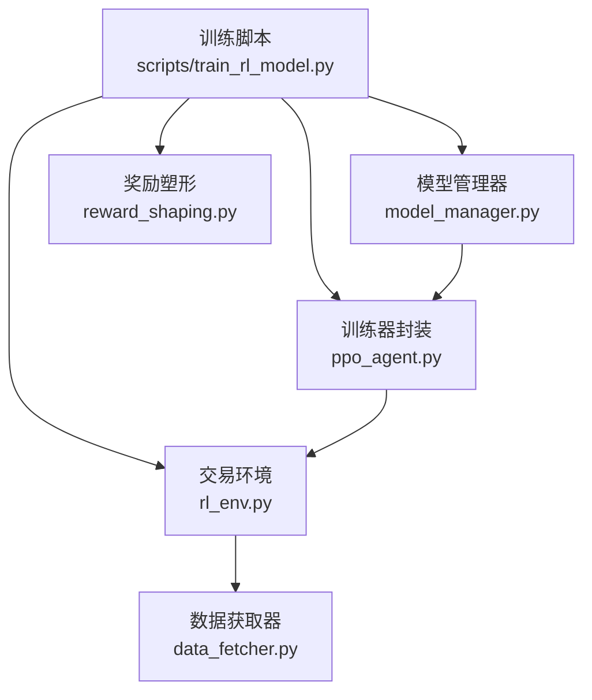
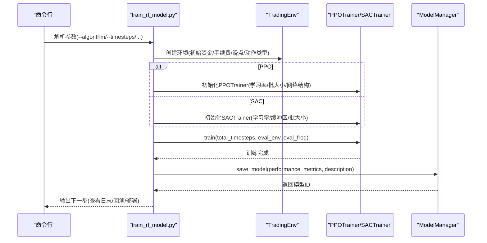
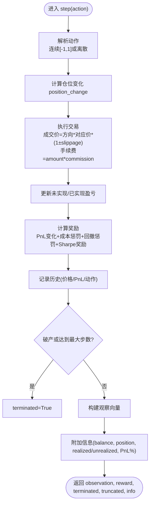
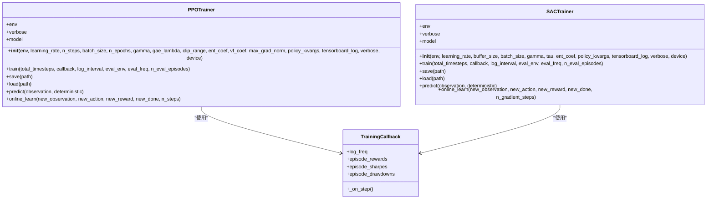
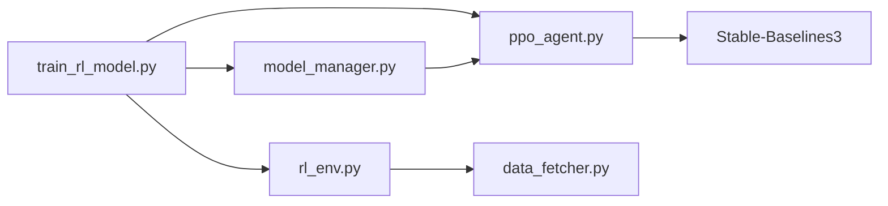

# 训练脚本

<cite>
**本文引用的文件**
- [scripts/train_rl_model.py](file://scripts/train_rl_model.py)
- [src/aetherlife/decision/rl_env.py](file://src/aetherlife/decision/rl_env.py)
- [src/aetherlife/decision/ppo_agent.py](file://src/aetherlife/decision/ppo_agent.py)
- [src/aetherlife/decision/model_manager.py](file://src/aetherlife/decision/model_manager.py)
- [src/aetherlife/decision/reward_shaping.py](file://src/aetherlife/decision/reward_shaping.py)
- [src/data/data_fetcher.py](file://src/data/data_fetcher.py)
- [docs/DECISION_LAYER_GUIDE.md](file://docs/DECISION_LAYER_GUIDE.md)
</cite>

## 目录
1. [简介](#简介)
2. [项目结构](#项目结构)
3. [核心组件](#核心组件)
4. [架构总览](#架构总览)
5. [组件详解](#组件详解)
6. [依赖关系分析](#依赖关系分析)
7. [性能与参数调优](#性能与参数调优)
8. [故障排查](#故障排查)
9. [结论](#结论)
10. [附录](#附录)

## 简介
本文件面向量化交易系统的强化学习模型训练脚本，围绕训练脚本 train_rl_model.py 的使用进行系统化说明。内容涵盖：
- 强化学习环境配置与状态/动作空间设计
- 模型初始化与训练流程管理（PPO/SAC）
- 训练参数设置（学习率、折扣因子、探索/熵正则、网络架构等）
- 训练数据准备与预处理（历史数据格式、特征工程、数据质量检查）
- 模型评估指标（收益率、夏普比率、最大回撤、胜率等）
- 训练过程监控与调试（损失可视化、收敛性分析、过拟合检测）
- 模型部署与集成（保存/加载、生产提升、在线推理）
- 扩展与定制指南（新增策略、超参数优化、性能调优）

## 项目结构
训练脚本位于 scripts/train_rl_model.py，其核心依赖如下模块：
- 强化学习环境：src/aetherlife/decision/rl_env.py
- 训练器：src/aetherlife/decision/ppo_agent.py（封装 PPO/SAC 训练器与并行环境）
- 模型管理：src/aetherlife/decision/model_manager.py（模型保存、版本与生产管理）
- 奖励塑形：src/aetherlife/decision/reward_shaping.py（奖励函数与合规/滑点工具）
- 数据获取：src/data/data_fetcher.py（历史数据抓取与实时流式数据）

图表来源
- [scripts/train_rl_model.py](file://scripts/train_rl_model.py#L1-L326)
- [src/aetherlife/decision/rl_env.py](file://src/aetherlife/decision/rl_env.py#L1-L423)
- [src/aetherlife/decision/ppo_agent.py](file://src/aetherlife/decision/ppo_agent.py#L1-L457)
- [src/aetherlife/decision/model_manager.py](file://src/aetherlife/decision/model_manager.py#L1-L431)
- [src/aetherlife/decision/reward_shaping.py](file://src/aetherlife/decision/reward_shaping.py#L1-L419)
- [src/data/data_fetcher.py](file://src/data/data_fetcher.py#L1-L434)

章节来源
- [scripts/train_rl_model.py](file://scripts/train_rl_model.py#L1-L326)
- [src/aetherlife/decision/rl_env.py](file://src/aetherlife/decision/rl_env.py#L1-L423)
- [src/aetherlife/decision/ppo_agent.py](file://src/aetherlife/decision/ppo_agent.py#L1-L457)
- [src/aetherlife/decision/model_manager.py](file://src/aetherlife/decision/model_manager.py#L1-L431)
- [src/aetherlife/decision/reward_shaping.py](file://src/aetherlife/decision/reward_shaping.py#L1-L419)
- [src/data/data_fetcher.py](file://src/data/data_fetcher.py#L1-L434)

## 核心组件
- 训练脚本入口：解析命令行参数、创建环境、选择算法、训练并保存模型，同时输出下一步操作提示。
- 强化学习环境：定义状态空间（20维）、动作空间（连续[-1,1]或离散HOLD/BUY/SELL）、交易执行与奖励函数（PnL、成本、回撤、Sharpe）。
- 训练器封装：PPOTrainer/SACTrainer，支持并行环境、评估回调、在线学习、TensorBoard 日志。
- 模型管理器：模型保存/加载、版本管理、生产提升/回滚、模型比较。
- 奖励塑形：提供可调权重的奖励函数、滑点预测、合规检查工具。
- 数据获取：异步抓取 K 线、行情、订单簿，支持 WebSocket 实时流。

章节来源
- [scripts/train_rl_model.py](file://scripts/train_rl_model.py#L25-L148)
- [src/aetherlife/decision/rl_env.py](file://src/aetherlife/decision/rl_env.py#L26-L118)
- [src/aetherlife/decision/ppo_agent.py](file://src/aetherlife/decision/ppo_agent.py#L66-L250)
- [src/aetherlife/decision/model_manager.py](file://src/aetherlife/decision/model_manager.py#L67-L168)
- [src/aetherlife/decision/reward_shaping.py](file://src/aetherlife/decision/reward_shaping.py#L33-L120)
- [src/data/data_fetcher.py](file://src/data/data_fetcher.py#L17-L71)

## 架构总览
训练脚本以命令行参数驱动，按算法分支创建环境与训练器，执行训练与评估，并通过模型管理器保存模型。训练器内部使用稳定基线3（Stable-Baselines3）封装 PPO/SAC，支持并行环境与评估回调；环境内部实现交易执行、状态构造与奖励计算。

图表来源
- [scripts/train_rl_model.py](file://scripts/train_rl_model.py#L151-L322)
- [src/aetherlife/decision/rl_env.py](file://src/aetherlife/decision/rl_env.py#L50-L118)
- [src/aetherlife/decision/ppo_agent.py](file://src/aetherlife/decision/ppo_agent.py#L120-L202)
- [src/aetherlife/decision/model_manager.py](file://src/aetherlife/decision/model_manager.py#L115-L168)

## 组件详解

### 训练脚本（train_rl_model.py）
- 命令行参数
  - 算法选择：--algorithm（ppo 或 sac，默认 ppo）
  - 训练步数：--timesteps（默认 100000）
  - 并行环境：--n-envs（PPO 推荐 4-8）
  - 环境参数：--initial-balance、--commission、--slippage、--max-position
  - 超参数：--learning-rate、--batch-size
  - 评估：--eval、--eval-freq（默认 10000）
  - 保存：--save-dir、--version、--description
  - 日志：--tensorboard-log、--verbose
- 环境创建：统一通过 create_env(args) 构造 TradingEnv，设置动作空间类型为连续。
- 训练流程：
  - PPO：使用 make_vec_env 创建并行环境，初始化 PPOTrainer，train() 支持评估回调。
  - SAC：直接创建单环境，初始化 SACTrainer，train() 支持评估回调。
- 模型保存：通过 ModelManager.save_model() 保存模型 zip 与元数据，包含性能指标与超参数。

章节来源
- [scripts/train_rl_model.py](file://scripts/train_rl_model.py#L25-L148)
- [scripts/train_rl_model.py](file://scripts/train_rl_model.py#L151-L322)

### 强化学习环境（rl_env.py）
- 状态空间：20维，包含价格、成交量、买卖价差、持仓、未实现盈亏、近期价格变化率、Sharpe、技术指标等。
- 动作空间：连续[-1,1]（目标仓位变化）或离散（HOLD/BUY/SELL）。
- 交易执行：
  - 根据动作计算目标仓位变化，执行交易（买入用 ask×(1+slippage)，卖出用 bid×(1−slippage)）。
  - 手续费按交易金额 × commission 扣除，滑点计入总成本。
  - 更新余额、持仓、入场价（加权平均）、未实现/已实现盈亏。
- 奖励函数：基础 PnL 变化、交易成本惩罚、回撤惩罚、Sharpe 奖励（需足够历史）。
- 观察构建：对价格、成交量、价差、持仓、未实现盈亏、近期回报率、Sharpe、技术指标进行归一化或标准化。

图表来源
- [src/aetherlife/decision/rl_env.py](file://src/aetherlife/decision/rl_env.py#L157-L224)
- [src/aetherlife/decision/rl_env.py](file://src/aetherlife/decision/rl_env.py#L225-L274)
- [src/aetherlife/decision/rl_env.py](file://src/aetherlife/decision/rl_env.py#L276-L312)
- [src/aetherlife/decision/rl_env.py](file://src/aetherlife/decision/rl_env.py#L314-L374)

章节来源
- [src/aetherlife/decision/rl_env.py](file://src/aetherlife/decision/rl_env.py#L26-L118)
- [src/aetherlife/decision/rl_env.py](file://src/aetherlife/decision/rl_env.py#L157-L224)
- [src/aetherlife/decision/rl_env.py](file://src/aetherlife/decision/rl_env.py#L225-L312)
- [src/aetherlife/decision/rl_env.py](file://src/aetherlife/decision/rl_env.py#L314-L374)

### 训练器封装（ppo_agent.py）
- PPOTrainer
  - 默认网络结构：两层共享网络，每层含策略与价值头，激活函数可配置。
  - 超参数：学习率、n_steps、batch_size、n_epochs、gamma、gae_lambda、clip_range、ent_coef、vf_coef、max_grad_norm。
  - 训练：支持回调（TrainingCallback）记录 episode 奖励、Sharpe、最大回撤；支持 EvalCallback 评估。
  - 在线学习：短期微调（learn total_timesteps=n_steps）。
- SACTrainer
  - 默认网络结构：两层隐藏层。
  - 超参数：学习率、buffer_size、batch_size、gamma、tau、ent_coef（可为“auto”）。
  - 在线学习：通过 replay buffer 触发梯度更新（train gradient_steps）。
- 并行环境：make_vec_env 支持 DummyVecEnv/SubprocVecEnv，PPO 推荐 4-8 个并行环境。

图表来源
- [src/aetherlife/decision/ppo_agent.py](file://src/aetherlife/decision/ppo_agent.py#L66-L250)
- [src/aetherlife/decision/ppo_agent.py](file://src/aetherlife/decision/ppo_agent.py#L252-L406)

章节来源
- [src/aetherlife/decision/ppo_agent.py](file://src/aetherlife/decision/ppo_agent.py#L66-L250)
- [src/aetherlife/decision/ppo_agent.py](file://src/aetherlife/decision/ppo_agent.py#L252-L406)

### 模型管理器（model_manager.py）
- 保存模型：生成模型ID（算法_版本_时间戳），保存 model.zip、metadata.json、performance.json，写入注册表。
- 加载模型：根据元数据判断算法并加载对应训练器。
- 列表与最佳模型：按创建时间、版本、指标排序；支持按指标（如 Sharpe）筛选最佳模型。
- 生产管理：提升到生产（current/previous 符号链接）、回滚至上一版本。
- 模型比较：对比两个模型的性能指标差异与提升百分比。

章节来源
- [src/aetherlife/decision/model_manager.py](file://src/aetherlife/decision/model_manager.py#L67-L168)
- [src/aetherlife/decision/model_manager.py](file://src/aetherlife/decision/model_manager.py#L194-L231)
- [src/aetherlife/decision/model_manager.py](file://src/aetherlife/decision/model_manager.py#L232-L291)
- [src/aetherlife/decision/model_manager.py](file://src/aetherlife/decision/model_manager.py#L292-L349)
- [src/aetherlife/decision/model_manager.py](file://src/aetherlife/decision/model_manager.py#L350-L408)

### 奖励塑形与合规（reward_shaping.py）
- 奖励塑形器：基础奖励=PnL变化，风险调整=Sharpe加成，惩罚=回撤、交易成本、滑点、合规违规，鼓励适度交易。
- 指标计算：提供 Sharpe Ratio 与最大回撤计算工具。
- 滑点预测（Stock Connect）：基于剩余额度、时段、订单规模、波动率预测滑点。
- 合规检查：A股交易时段、涨跌停、北向额度、单日回撤、杠杆限制等。

章节来源
- [src/aetherlife/decision/reward_shaping.py](file://src/aetherlife/decision/reward_shaping.py#L33-L120)
- [src/aetherlife/decision/reward_shaping.py](file://src/aetherlife/decision/reward_shaping.py#L173-L252)
- [src/aetherlife/decision/reward_shaping.py](file://src/aetherlife/decision/reward_shaping.py#L254-L371)

### 数据准备与预处理（data_fetcher.py）
- 历史数据：支持 Binance/OKX，获取 OHLCV、24小时行情、订单簿、资金费率等。
- 实时流：WebSocket 订阅 ticker/book，持续推送最新市场数据。
- 数据质量检查：对空响应、错误码进行异常处理；对数值列进行类型转换与缺失填充。

章节来源
- [src/data/data_fetcher.py](file://src/data/data_fetcher.py#L40-L71)
- [src/data/data_fetcher.py](file://src/data/data_fetcher.py#L85-L119)
- [src/data/data_fetcher.py](file://src/data/data_fetcher.py#L188-L234)
- [src/data/data_fetcher.py](file://src/data/data_fetcher.py#L249-L278)
- [src/data/data_fetcher.py](file://src/data/data_fetcher.py#L327-L396)

## 依赖关系分析
- 训练脚本依赖环境与训练器封装，训练器依赖 Stable-Baselines3；环境依赖 schema 与内存存储；模型管理器依赖训练器；奖励塑形工具独立但被环境奖励函数使用；数据获取器为环境提供市场数据。
- 关键耦合点：
  - 训练脚本与环境：通过 create_env(args) 统一创建环境。
  - 训练器与环境：训练器接收 env，执行 learn() 与 predict()。
  - 模型管理器与训练器：保存/加载模型 zip 文件与元数据。
  - 环境与奖励塑形：环境内部奖励函数使用 Sharpe、回撤等指标。

图表来源
- [scripts/train_rl_model.py](file://scripts/train_rl_model.py#L19-L22)
- [src/aetherlife/decision/ppo_agent.py](file://src/aetherlife/decision/ppo_agent.py#L16-L21)
- [src/aetherlife/decision/rl_env.py](file://src/aetherlife/decision/rl_env.py#L20-L21)

章节来源
- [scripts/train_rl_model.py](file://scripts/train_rl_model.py#L19-L22)
- [src/aetherlife/decision/ppo_agent.py](file://src/aetherlife/decision/ppo_agent.py#L16-L21)
- [src/aetherlife/decision/rl_env.py](file://src/aetherlife/decision/rl_env.py#L20-L21)

## 性能与参数调优
- 训练参数设置
  - 学习率：--learning-rate（PPO/SAC 默认 3e-4，可降至 1e-4 观察收敛）
  - 批大小：--batch-size（PPO 64，SAC 256）
  - 并行环境：--n-envs（PPO 4-8）
  - 折扣因子：PPOTrainer.gamma（默认 0.99），SACTrainer.gamma（默认 0.99）
  - 熵正则：PPOTrainer.ent_coef（默认 0.01，可增至 0.05 控制探索）
  - 网络架构：PPO 默认 [256, 256] 策略/价值头，可自定义 policy_kwargs
- 环境参数
  - 初始资金：--initial-balance（建议 10000）
  - 手续费：--commission（默认 0.1%）
  - 滑点：--slippage（默认 0.05%）
  - 最大持仓比例：--max-position（默认 1.0）
- 评估与日志
  - --eval 与 --eval-freq 控制评估频率
  - --tensorboard-log 指定 TensorBoard 日志目录
  - --verbose 控制日志详细程度
- 指标与监控
  - 训练回调记录 episode 奖励、Sharpe、最大回撤，定期写入 TensorBoard
  - 环境 info 中包含 balance、position、PnL、sharpe 等，便于监控

章节来源
- [scripts/train_rl_model.py](file://scripts/train_rl_model.py#L25-L148)
- [src/aetherlife/decision/ppo_agent.py](file://src/aetherlife/decision/ppo_agent.py#L71-L137)
- [src/aetherlife/decision/ppo_agent.py](file://src/aetherlife/decision/ppo_agent.py#L259-L312)
- [src/aetherlife/decision/ppo_agent.py](file://src/aetherlife/decision/ppo_agent.py#L24-L63)
- [src/aetherlife/decision/rl_env.py](file://src/aetherlife/decision/rl_env.py#L376-L398)

## 故障排查
- 训练不收敛
  - 现象：奖励在 0 附近波动
  - 可能原因：奖励函数惩罚过重、学习率不当、状态归一化异常
  - 解决方案：降低惩罚系数、调整学习率、检查状态归一化范围
- 过拟合
  - 现象：训练集表现好，评估集表现差
  - 解决方案：提高熵系数（ent_coef）、增加评估频率、使用更多样化数据
- 在线学习退化
  - 现象：实盘运行后性能下降
  - 解决方案：减少在线学习步数、定期回滚、混合训练（历史+在线）

章节来源
- [docs/DECISION_LAYER_GUIDE.md](file://docs/DECISION_LAYER_GUIDE.md#L539-L596)

## 结论
本训练脚本提供了从环境配置、模型初始化、训练流程到模型管理与生产的完整闭环。通过可调的超参数、完善的评估与日志体系、以及奖励塑形与合规工具，用户可以高效地迭代强化学习策略，并安全地将模型提升至生产环境。

## 附录

### 训练命令示例
- 基础 PPO 训练：python scripts/train_rl_model.py --timesteps 100000
- SAC 训练：python scripts/train_rl_model.py --algorithm sac --timesteps 200000
- 带评估：python scripts/train_rl_model.py --timesteps 100000 --eval --eval-freq 10000
- 自定义参数：python scripts/train_rl_model.py --algorithm ppo --timesteps 500000 --n-envs 8 --learning-rate 1e-4 --batch-size 128

章节来源
- [docs/DECISION_LAYER_GUIDE.md](file://docs/DECISION_LAYER_GUIDE.md#L391-L431)