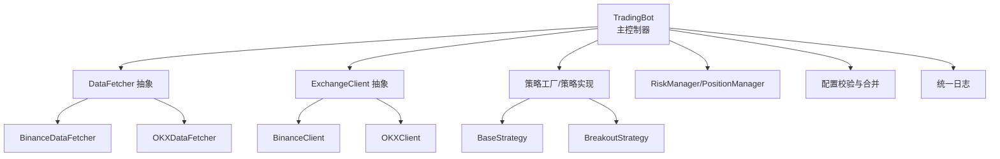
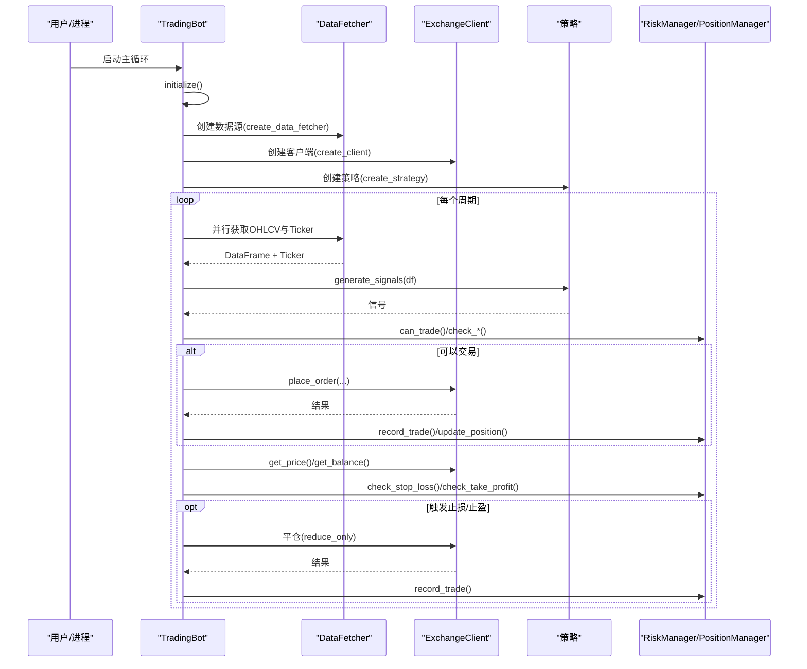
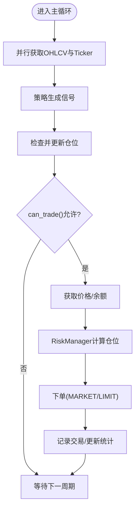
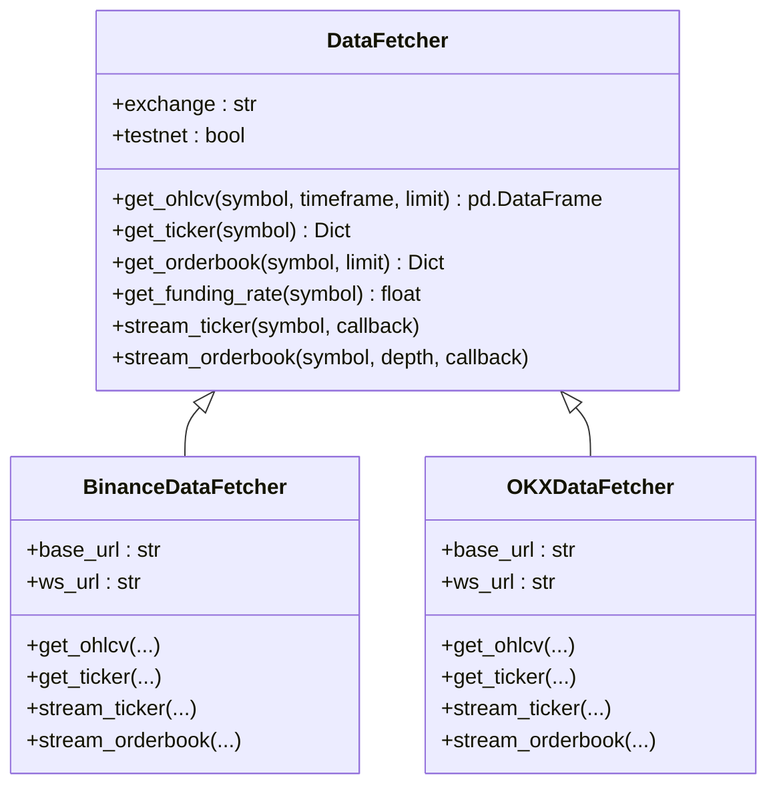
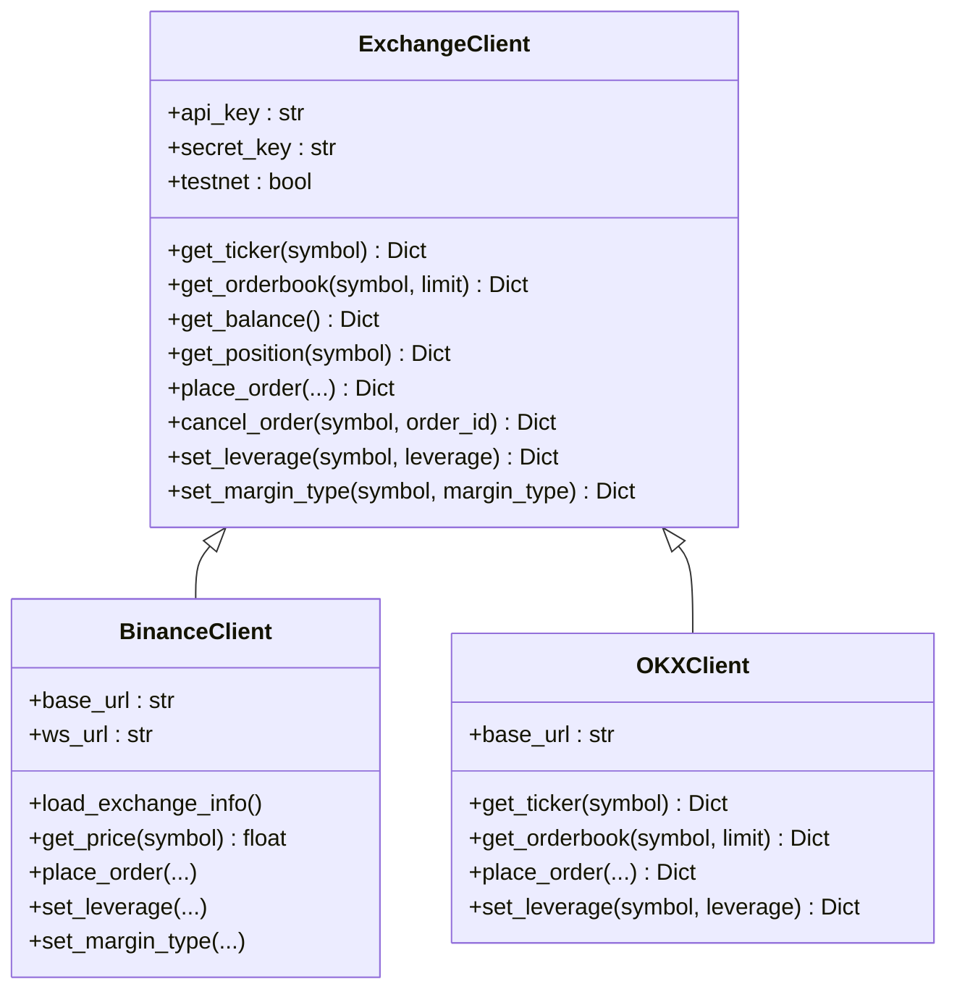
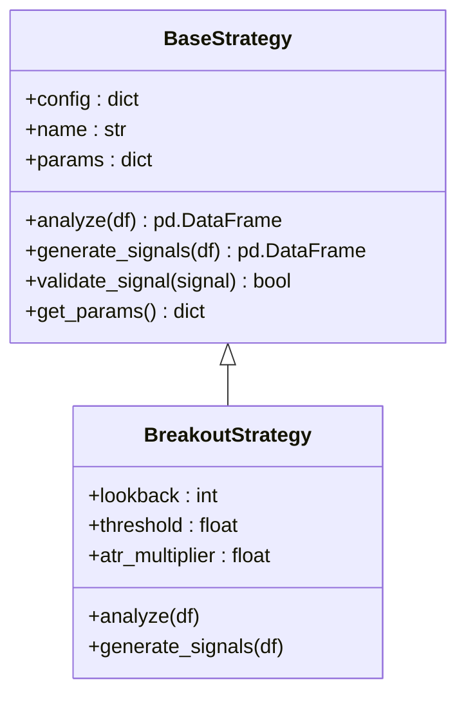
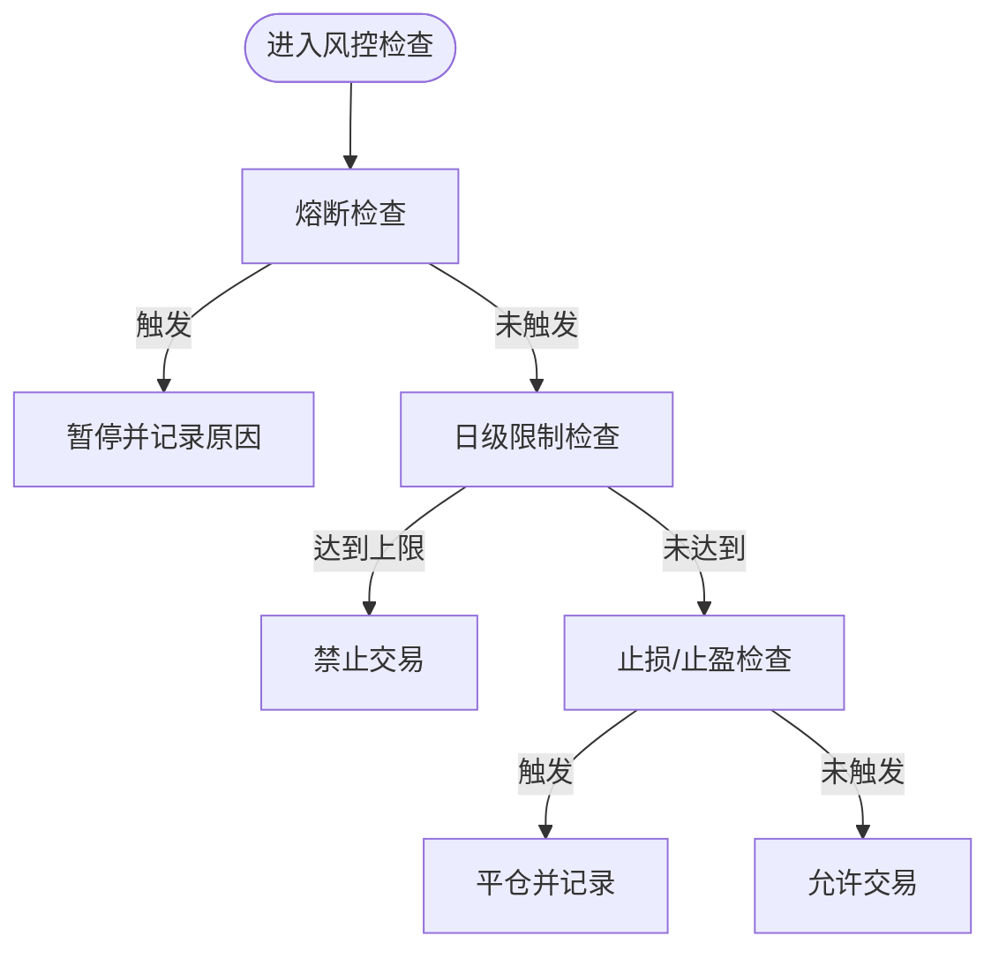
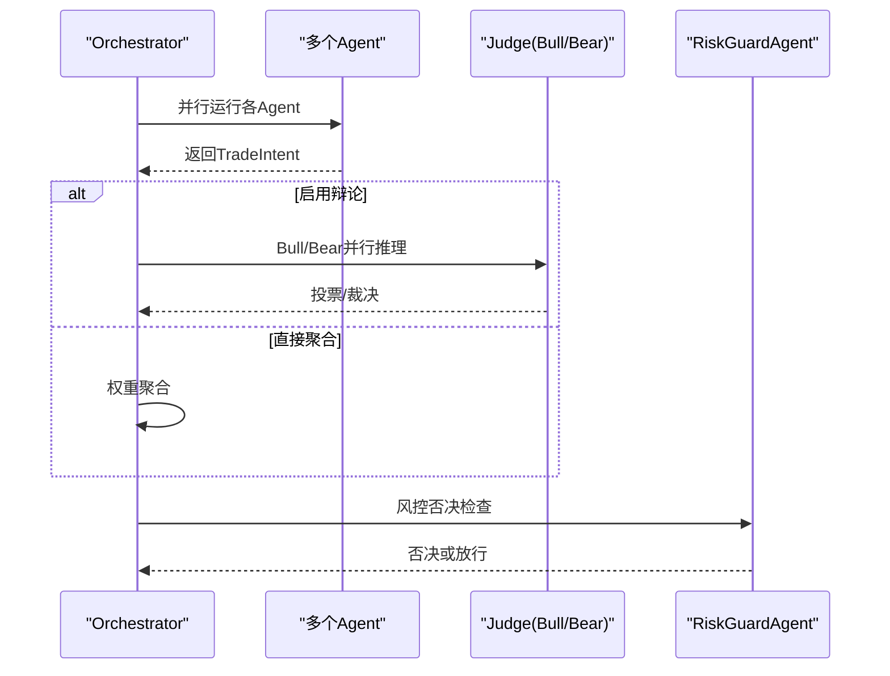
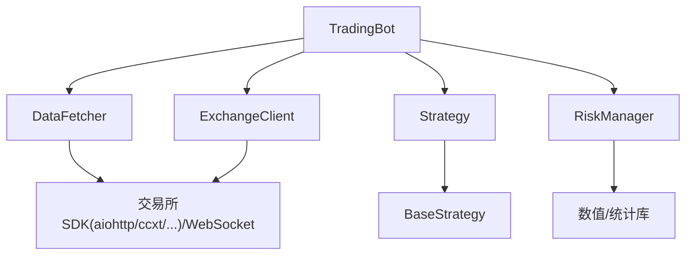

# 代码规范与最佳实践

<cite>
**本文引用的文件**
- [src/trading_bot.py](file://src/trading_bot.py)
- [src/utils/logger.py](file://src/utils/logger.py)
- [src/utils/config.py](file://src/utils/config.py)
- [src/data/data_fetcher.py](file://src/data/data_fetcher.py)
- [src/execution/exchange_client.py](file://src/execution/exchange_client.py)
- [src/strategies/base.py](file://src/strategies/base.py)
- [src/strategies/breakout.py](file://src/strategies/breakout.py)
- [src/utils/risk_manager.py](file://src/utils/risk_manager.py)
- [src/aetherlife/cognition/orchestrator.py](file://src/aetherlife/cognition/orchestrator.py)
- [configs/config.json](file://configs/config.json)
- [requirements.txt](file://requirements.txt)
- [scripts/self_improve.py](file://scripts/self_improve.py)
</cite>

## 目录
1. [引言](#引言)
2. [项目结构](#项目结构)
3. [核心组件](#核心组件)
4. [架构总览](#架构总览)
5. [详细组件分析](#详细组件分析)
6. [依赖分析](#依赖分析)
7. [性能考虑](#性能考虑)
8. [故障排查指南](#故障排查指南)
9. [结论](#结论)
10. [附录](#附录)

## 引言
本指南面向量化交易系统的开发团队，旨在建立统一的代码规范与最佳实践，覆盖 Python 编码风格、模块组织、注释与文档字符串、错误处理与异常管理、性能优化以及代码审查与质量保障流程。本文结合仓库现有代码进行提炼与扩展，帮助团队在快速演进的同时保持一致性与可维护性。

## 项目结构
项目采用按“领域/层次”混合的模块化组织方式：
- 核心交易主程序位于 src/trading_bot.py，负责编排数据、策略、执行与风控。
- 数据层 src/data/ 提供异步数据获取器抽象与具体实现（Binance/OKX）。
- 执行层 src/execution/ 提供交易所客户端抽象与具体实现（Binance/OKX）。
- 策略层 src/strategies/ 以策略基类与多种策略实现构成。
- 工具与基础设施 src/utils/ 包含日志、配置校验、风控与风险/仓位管理。
- AetherLife 多智能体认知层位于 src/aetherlife/，体现高级决策与协作。
- 配置与依赖位于 configs/config.json 与 requirements.txt。

图示来源
- [src/trading_bot.py](file://src/trading_bot.py#L27-L297)
- [src/data/data_fetcher.py](file://src/data/data_fetcher.py#L17-L408)
- [src/execution/exchange_client.py](file://src/execution/exchange_client.py#L20-L411)
- [src/strategies/base.py](file://src/strategies/base.py#L6-L31)
- [src/strategies/breakout.py](file://src/strategies/breakout.py#L6-L79)
- [src/utils/config.py](file://src/utils/config.py#L15-L49)
- [src/utils/logger.py](file://src/utils/logger.py#L12-L34)

章节来源
- [src/trading_bot.py](file://src/trading_bot.py#L1-L346)
- [src/data/data_fetcher.py](file://src/data/data_fetcher.py#L1-L434)
- [src/execution/exchange_client.py](file://src/execution/exchange_client.py#L1-L432)
- [src/strategies/base.py](file://src/strategies/base.py#L1-L31)
- [src/strategies/breakout.py](file://src/strategies/breakout.py#L1-L79)
- [src/utils/config.py](file://src/utils/config.py#L1-L49)
- [src/utils/logger.py](file://src/utils/logger.py#L1-L34)

## 核心组件
- TradingBot：主控制器，负责初始化、数据拉取、策略分析、信号执行、风控检查与仓位管理、日志输出与统计。
- DataFetcher 抽象与实现：统一 OHLCV、Ticker、Orderbook、资金费率等接口，支持 WebSocket 实时流。
- ExchangeClient 抽象与实现：统一下单、撤单、查询、杠杆与保证金模式设置等接口，支持签名与精度处理。
- BaseStrategy 与具体策略：定义策略接口与实现，如突破策略。
- RiskManager/PositionManager：风控与仓位管理，包含止损止盈、熔断、日级限制、连败计数与统计。
- 日志与配置：统一日志格式与配置校验、深度合并。

章节来源
- [src/trading_bot.py](file://src/trading_bot.py#L27-L297)
- [src/data/data_fetcher.py](file://src/data/data_fetcher.py#L17-L408)
- [src/execution/exchange_client.py](file://src/execution/exchange_client.py#L20-L411)
- [src/strategies/base.py](file://src/strategies/base.py#L6-L31)
- [src/strategies/breakout.py](file://src/strategies/breakout.py#L6-L79)
- [src/utils/risk_manager.py](file://src/utils/risk_manager.py#L12-L339)
- [src/utils/logger.py](file://src/utils/logger.py#L12-L34)
- [src/utils/config.py](file://src/utils/config.py#L15-L49)

## 架构总览
系统采用“主控制器 + 分层模块 + 策略与风控”的结构，核心流程如下：

图示来源
- [src/trading_bot.py](file://src/trading_bot.py#L63-L297)
- [src/data/data_fetcher.py](file://src/data/data_fetcher.py#L85-L234)
- [src/execution/exchange_client.py](file://src/execution/exchange_client.py#L226-L275)
- [src/utils/risk_manager.py](file://src/utils/risk_manager.py#L175-L241)

## 详细组件分析

### TradingBot 主控制器
- 职责：配置校验、模块初始化、主循环、信号执行、风控与统计。
- 关键点：
  - 使用 asyncio.gather 并行获取 OHLCV 与 Ticker，提升吞吐。
  - 严格区分“信号生成”与“下单执行”，降低耦合。
  - 使用日志记录关键事件与异常，异常捕获后短暂休眠避免忙等。
  - 通过 PositionManager 与 RiskManager 控制仓位与风控。

图示来源
- [src/trading_bot.py](file://src/trading_bot.py#L92-L205)
- [src/utils/risk_manager.py](file://src/utils/risk_manager.py#L62-L71)

章节来源
- [src/trading_bot.py](file://src/trading_bot.py#L27-L297)

### DataFetcher 抽象与实现
- 设计要点：
  - 抽象类定义统一接口，子类实现具体交易所细节。
  - 异步会话复用与超时控制，WebSocket 心跳与回调驱动。
  - 对外部错误进行显式异常抛出，便于上层统一处理。
  - Binance/OKX 的字段映射与数据清洗逻辑清晰。

图示来源
- [src/data/data_fetcher.py](file://src/data/data_fetcher.py#L17-L408)

章节来源
- [src/data/data_fetcher.py](file://src/data/data_fetcher.py#L1-L434)

### ExchangeClient 抽象与实现
- 设计要点：
  - 抽象类定义统一交易接口，子类实现签名与精度处理。
  - BinanceClient 支持 MARKET/LIMIT 下单、杠杆设置、保证金模式、订单簿与深度流。
  - 对外部错误进行显式异常抛出，便于上层统一处理。
  - 通过 exchange_info 动态解析精度与步长，确保下单合规。

图示来源
- [src/execution/exchange_client.py](file://src/execution/exchange_client.py#L20-L411)

章节来源
- [src/execution/exchange_client.py](file://src/execution/exchange_client.py#L1-L432)

### 策略基类与突破策略
- 设计要点：
  - BaseStrategy 定义 analyze/generate_signals 接口，便于扩展。
  - BreakoutStrategy 实现多指标（移动平均、布林带、MACD、RSI、ATR）与信号规则。
  - 通过参数化配置与最小长度校验，保证稳健性。

图示来源
- [src/strategies/base.py](file://src/strategies/base.py#L6-L31)
- [src/strategies/breakout.py](file://src/strategies/breakout.py#L6-L79)

章节来源
- [src/strategies/base.py](file://src/strategies/base.py#L1-L31)
- [src/strategies/breakout.py](file://src/strategies/breakout.py#L1-L79)

### 风控与仓位管理
- 设计要点：
  - RiskManager：熔断、日级限制、连败限制、止损止盈、追踪止损、统计与暂停恢复。
  - PositionManager：开仓/平仓/更新、浮动盈亏计算、止盈止损设置。
  - 二者协同，确保交易安全与统计可追溯。

图示来源
- [src/utils/risk_manager.py](file://src/utils/risk_manager.py#L129-L194)

章节来源
- [src/utils/risk_manager.py](file://src/utils/risk_manager.py#L12-L339)

### AetherLife 多智能体协调器
- 设计要点：
  - 支持并行聚合与可选辩论（Bull/Bear/Judge）两种路径。
  - 权重聚合与置信度归一化，最终由风控守卫决定是否否决。

图示来源
- [src/aetherlife/cognition/orchestrator.py](file://src/aetherlife/cognition/orchestrator.py#L16-L93)

章节来源
- [src/aetherlife/cognition/orchestrator.py](file://src/aetherlife/cognition/orchestrator.py#L1-L93)

## 依赖分析
- 外部依赖集中在 requirements.txt，涵盖异步HTTP、数据处理、交易所SDK、AI/ML、监控与测试工具等。
- 项目内部模块依赖清晰：TradingBot 依赖 DataFetcher/ExchangeClient/Strategy/RiskManager；策略与执行均依赖抽象接口，便于替换与扩展。

图示来源
- [requirements.txt](file://requirements.txt#L1-L92)
- [src/trading_bot.py](file://src/trading_bot.py#L13-L24)

章节来源
- [requirements.txt](file://requirements.txt#L1-L92)

## 性能考虑
- 异步与并发
  - 使用 asyncio.gather 并行获取 OHLCV 与 Ticker，减少主循环等待。
  - WebSocket 订阅行情与订单簿，降低轮询成本。
- 精度与合规
  - BinanceClient 动态读取 exchange_info 的 quantity_precision 与 step_size，确保下单合规。
- 数据处理
  - 使用 pandas/numpy 进行高效向量化计算，策略中使用滚动窗口与指数加权。
- 资源管理
  - 统一会话与连接生命周期，关闭时释放资源，避免泄漏。
- 风控前置
  - 在下单前进行 can_trade 检查，避免无效请求与潜在损失。

章节来源
- [src/trading_bot.py](file://src/trading_bot.py#L95-L98)
- [src/execution/exchange_client.py](file://src/execution/exchange_client.py#L242-L254)
- [src/strategies/breakout.py](file://src/strategies/breakout.py#L21-L62)

## 故障排查指南
- 日志规范
  - 使用统一 Logger，格式包含时间、级别、名称与消息。
  - 异常使用 exception 记录堆栈，便于定位问题。
- 错误处理
  - 外部 API 错误统一抛出 RuntimeError，携带错误码与消息。
  - 交易与风控分支使用 try/except 捕获并记录，避免主循环中断。
- 常见问题
  - 信号为 0 或数据不足：检查策略输入长度与列存在性。
  - 仓位为 0 或负数：检查风控计算与价格有效性。
  - WebSocket 断连：确认心跳与回调处理，必要时重建连接。
  - 下单失败：检查精度、步长与杠杆设置，查看返回状态。

章节来源
- [src/utils/logger.py](file://src/utils/logger.py#L12-L34)
- [src/data/data_fetcher.py](file://src/data/data_fetcher.py#L98-L99)
- [src/execution/exchange_client.py](file://src/execution/exchange_client.py#L166-L170)
- [src/trading_bot.py](file://src/trading_bot.py#L145-L155)

## 结论
本指南总结了项目在编码风格、模块组织、注释与文档、错误处理、性能优化与质量保障方面的现状与改进建议。建议团队在日常开发中遵循统一规范，持续通过配置校验、日志与监控完善质量体系，并在策略与执行层面保持抽象与解耦，以支撑系统的长期演进。

## 附录

### Python 编码规范与命名约定（建议）
- PEP8 遵循
  - 缩进：统一使用 4 空格；避免混用制表符。
  - 行宽：建议 ≤ 100；必要时可放宽至 120。
  - 空行：模块级函数/类之间留空行；方法内逻辑分段使用空行。
- 命名约定
  - 类名：PascalCase（如 TradingBot、RiskManager）
  - 函数/方法：snake_case（如 get_ohlcv、place_order）
  - 变量：snake_case（如 api_key、testnet）
  - 常量：UPPER_CASE（如 REQUEST_TIMEOUT）
  - 模块：snake_case（如 data_fetcher、exchange_client）
- 导入顺序
  - 标准库 → 第三方库 → 项目内模块（按层级分组）
- 注释与文档字符串
  - 模块：简述职责与范围
  - 类/函数：说明用途、参数、返回值、异常
  - 复杂逻辑：补充注释说明边界条件与性能考量

### 模块组织原则（建议）
- 文件结构
  - 按领域/层次划分：data、execution、strategies、utils、aetherlife 等
  - 公共接口通过 __init__.py 暴露，避免深层 import
- 依赖管理
  - 低层模块不应依赖高层模块；通过抽象接口解耦
  - 明确工厂函数（如 create_data_fetcher、create_client、create_strategy）集中创建实例

### 注释与文档字符串标准（建议）
- 函数/方法
  - 参数类型与含义明确；返回值与异常说明
- 类
  - 成员变量与职责说明；关键方法行为说明
- 模块
  - 功能概述、使用场景、注意事项

### 错误处理与异常管理（建议）
- 异常类型
  - 使用 ValueError/TypeError 等语义化异常描述输入错误
  - 使用 RuntimeError 描述外部服务错误
- 错误信息格式
  - 包含上下文（如交易所、接口、参数）与错误码/消息
- 日志记录
  - INFO/WARNING/ERROR 级别区分；异常使用 exception 记录堆栈

### 性能优化建议（建议）
- 算法效率
  - 使用向量化与内置函数；避免在循环中重复计算
- 内存管理
  - 及时释放 aiohttp 会话与 WebSocket 连接；避免大对象常驻
- 异步编程
  - 合理拆分任务，使用 gather 并行；避免阻塞操作

### 代码审查清单（建议）
- 规范性
  - 是否遵循 PEP8 与命名约定
  - 导入顺序与模块依赖是否合理
- 正确性
  - 输入参数校验与边界处理
  - 异常分支与错误信息是否完整
- 可维护性
  - 文档字符串与注释是否清晰
  - 抽象与解耦是否到位
- 性能
  - 是否存在不必要的同步阻塞
  - 是否有可优化的计算与内存占用

### 质量保证流程（建议）
- 本地质量
  - 使用 black/flake8/mypy 进行静态检查与格式化
  - 单元测试覆盖关键路径（策略、风控、数据获取）
- CI/CD
  - 自动化测试与覆盖率报告
  - 依赖扫描与安全检查
- 运行期监控
  - Prometheus 指标与 structlog 日志
  - 关键告警与熔断联动