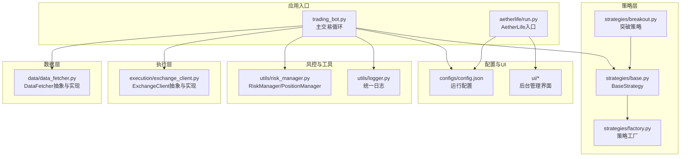
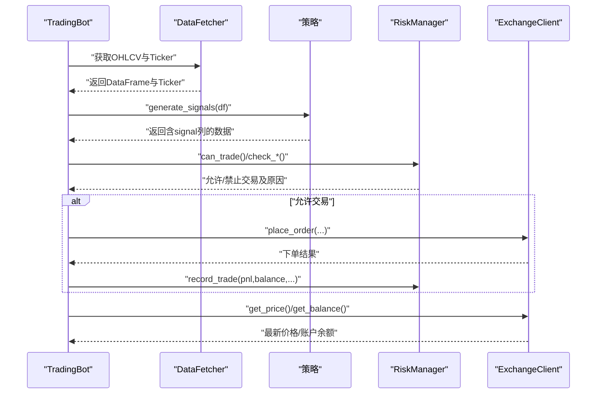
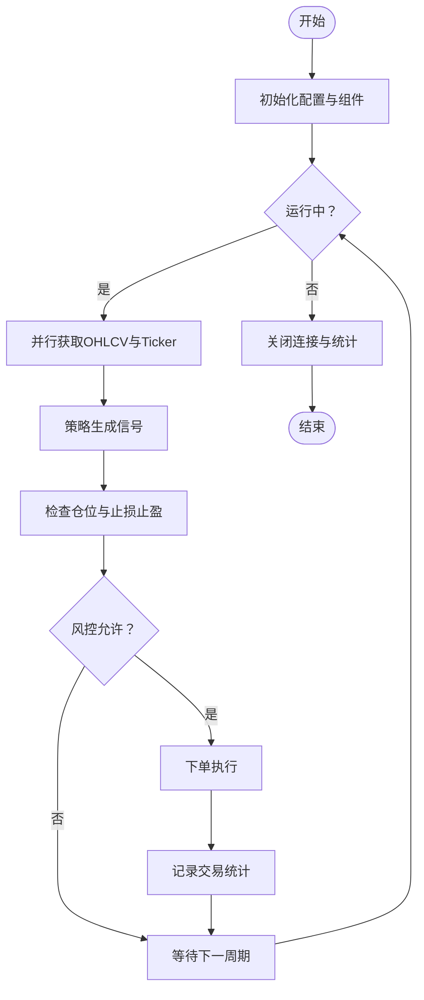
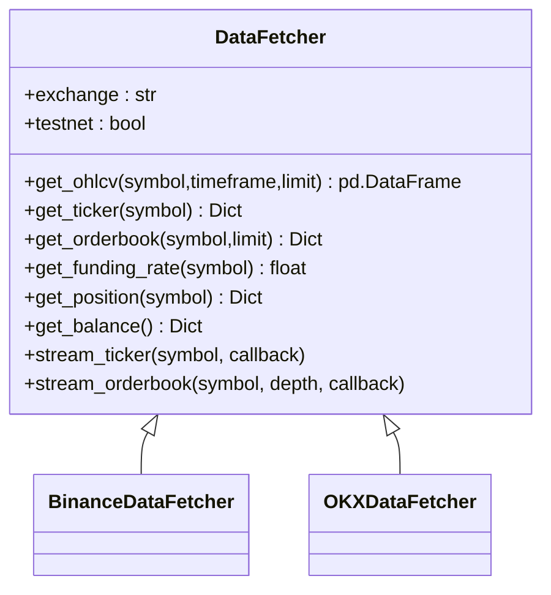
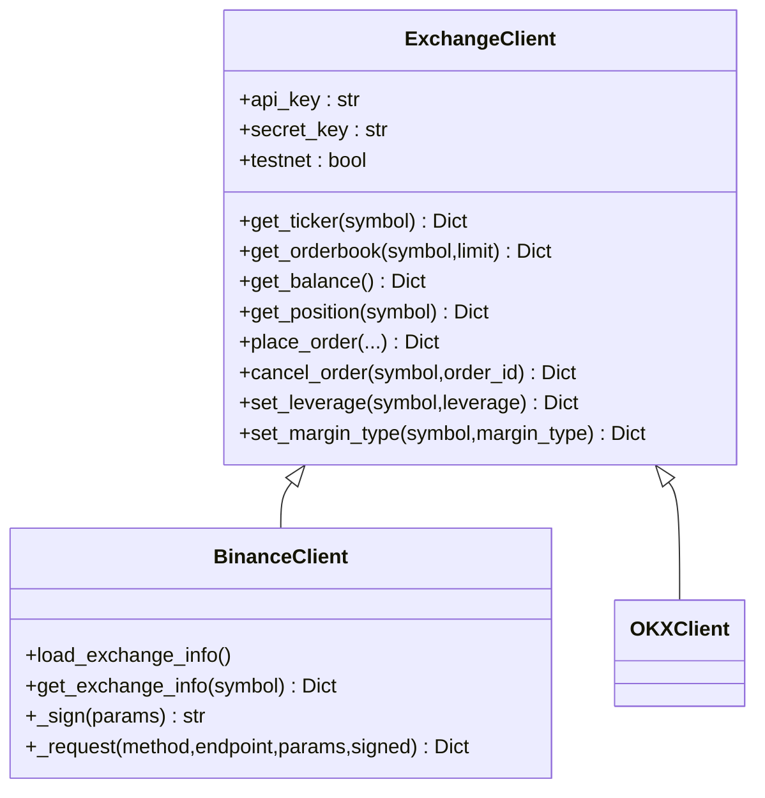
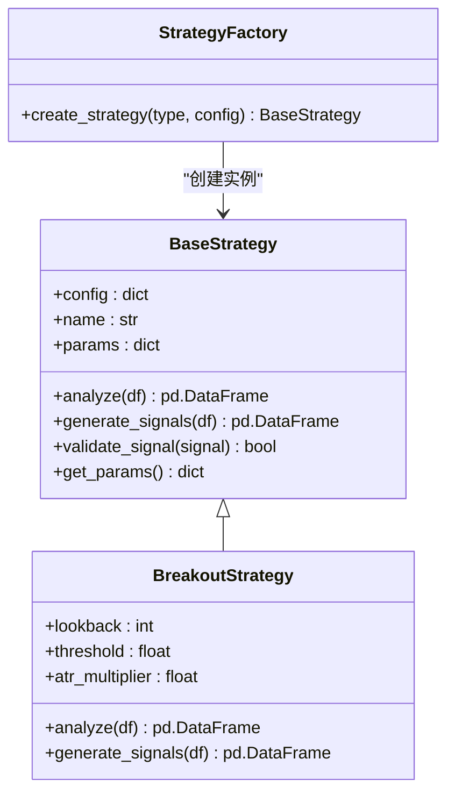
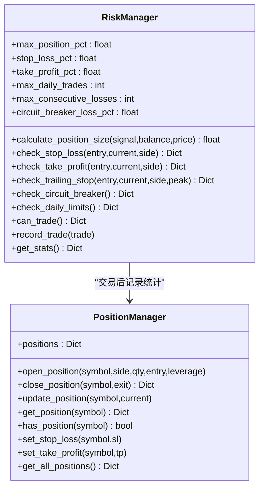
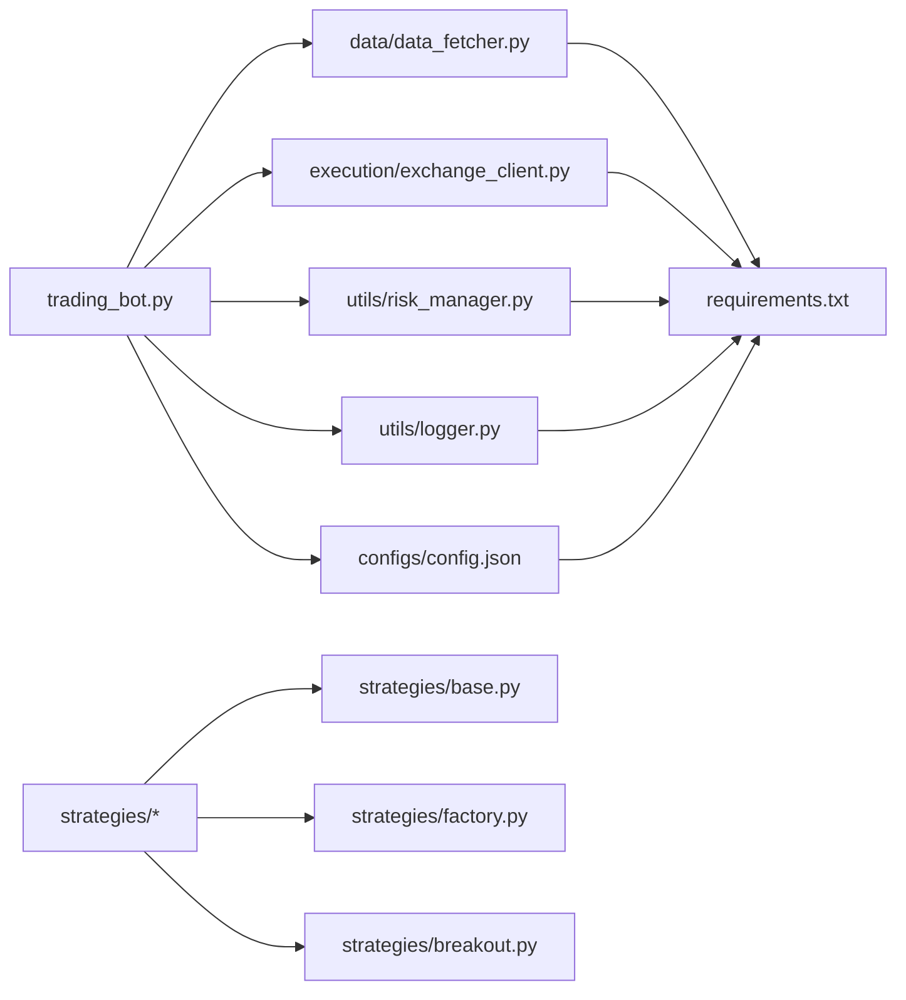

# 开发指南

<cite>
**本文引用的文件**
- [requirements.txt](file://requirements.txt)
- [README.md](file://README.md)
- [configs/config.json](file://configs/config.json)
- [src/trading_bot.py](file://src/trading_bot.py)
- [src/aetherlife/run.py](file://src/aetherlife/run.py)
- [src/utils/logger.py](file://src/utils/logger.py)
- [src/utils/risk_manager.py](file://src/utils/risk_manager.py)
- [src/data/data_fetcher.py](file://src/data/data_fetcher.py)
- [src/execution/exchange_client.py](file://src/execution/exchange_client.py)
- [src/strategies/base.py](file://src/strategies/base.py)
- [src/strategies/breakout.py](file://src/strategies/breakout.py)
- [src/strategies/factory.py](file://src/strategies/factory.py)
- [tests/test_strategies.py](file://tests/test_strategies.py)
- [scripts/self_improve.py](file://scripts/self_improve.py)
- [docs/ADMIN_GUIDE.md](file://docs/ADMIN_GUIDE.md)
</cite>

## 目录
1. [简介](#简介)
2. [项目结构](#项目结构)
3. [核心组件](#核心组件)
4. [架构总览](#架构总览)
5. [详细组件分析](#详细组件分析)
6. [依赖关系分析](#依赖关系分析)
7. [性能考量](#性能考量)
8. [故障排除指南](#故障排除指南)
9. [结论](#结论)
10. [附录](#附录)

## 简介
本开发指南面向量化交易系统的贡献者与维护者，覆盖开发环境搭建、代码规范与最佳实践、测试策略、调试与故障排除、扩展开发指导、代码审查与质量保证流程，以及与现有系统的集成与兼容性考虑。系统采用模块化设计，分为数据层、策略层、执行层、风控层与UI后台，支持多交易所与多策略组合，并提供统一日志与配置管理。

## 项目结构
项目采用按功能域划分的模块化组织方式，主要目录与职责如下：
- configs：系统配置与密钥文件（含示例与加密存储）
- src：核心业务代码
  - aetherlife：AetherLife入口与配置加载
  - data：数据获取与缓存（Binance/OKX）
  - execution：交易所客户端与下单执行
  - strategies：策略基类与多种策略实现
  - utils：日志、风控、配置管理等通用工具
  - ui：后台管理界面与仪表盘
  - trading_bot.py：主交易循环与调度
- tests：单元测试
- scripts：辅助脚本（如系统自我迭代优化器）
- docs：系统文档与后台使用指南
- requirements.txt：项目依赖清单

图示来源
- [src/trading_bot.py](file://src/trading_bot.py#L27-L297)
- [src/aetherlife/run.py](file://src/aetherlife/run.py#L32-L66)
- [src/data/data_fetcher.py](file://src/data/data_fetcher.py#L17-L71)
- [src/execution/exchange_client.py](file://src/execution/exchange_client.py#L20-L84)
- [src/utils/risk_manager.py](file://src/utils/risk_manager.py#L12-L52)
- [src/utils/logger.py](file://src/utils/logger.py#L12-L28)
- [src/strategies/base.py](file://src/strategies/base.py#L6-L31)
- [src/strategies/factory.py](file://src/strategies/factory.py#L10-L36)
- [src/strategies/breakout.py](file://src/strategies/breakout.py#L6-L79)
- [configs/config.json](file://configs/config.json#L1-L28)

章节来源
- [requirements.txt](file://requirements.txt#L1-L70)
- [README.md](file://README.md)

## 核心组件
- 主交易循环与调度：负责配置校验、数据获取、策略分析、风控检查、下单执行与仓位管理，支持异步并发与优雅停机。
- 数据获取器：抽象基类定义统一接口，Binance与OKX实现分别适配REST与WebSocket行情与K线。
- 交易所客户端：抽象基类定义统一交易接口，Binance实现REST签名与下单逻辑，OKX占位待实现。
- 策略体系：策略基类定义分析与信号生成接口，工厂模式创建具体策略，支持多策略组合。
- 风控与仓位：集中式风控器与仓位管理器，提供止损止盈、熔断、日限额、连败限制与统计。
- 日志系统：统一日志格式与处理器，便于排障与接入监控。
- 配置与后台：JSON配置文件与FastAPI后台管理界面，支持加密存储与参数可视化配置。

章节来源
- [src/trading_bot.py](file://src/trading_bot.py#L27-L297)
- [src/data/data_fetcher.py](file://src/data/data_fetcher.py#L17-L71)
- [src/execution/exchange_client.py](file://src/execution/exchange_client.py#L20-L84)
- [src/strategies/base.py](file://src/strategies/base.py#L6-L31)
- [src/strategies/factory.py](file://src/strategies/factory.py#L10-L36)
- [src/utils/risk_manager.py](file://src/utils/risk_manager.py#L12-L241)
- [src/utils/logger.py](file://src/utils/logger.py#L12-L34)
- [configs/config.json](file://configs/config.json#L1-L28)

## 架构总览
系统采用“事件驱动+异步IO”的架构，主循环以固定间隔拉取市场数据，生成信号并执行风控与下单。数据与执行通过抽象接口解耦，策略通过工厂与继承扩展，风控与日志贯穿各层。

图示来源
- [src/trading_bot.py](file://src/trading_bot.py#L92-L297)
- [src/data/data_fetcher.py](file://src/data/data_fetcher.py#L40-L62)
- [src/execution/exchange_client.py](file://src/execution/exchange_client.py#L64-L84)
- [src/utils/risk_manager.py](file://src/utils/risk_manager.py#L175-L241)

## 详细组件分析

### 主交易循环（TradingBot）
- 职责：初始化配置与组件、拉取数据、分析信号、风控检查、执行交易、检查与止盈止损、统计与日志。
- 关键流程：initialize → fetch_market_data → analyze → check_positions → execute_signal → run循环 → stop。
- 并发：使用asyncio.gather并行获取OHLCV与Ticker，降低等待时间。
- 安全：下单前严格风控检查，仓位四舍五入至交易所精度，异常捕获与日志记录。

图示来源
- [src/trading_bot.py](file://src/trading_bot.py#L63-L297)

章节来源
- [src/trading_bot.py](file://src/trading_bot.py#L27-L297)

### 数据获取器（DataFetcher）
- 抽象接口：统一定义OHLCV、Ticker、Orderbook、FundingRate、Position、Balance与WebSocket流接口。
- Binance实现：REST获取K线/Ticker/Orderbook/FundingRate，WebSocket订阅bookTicker与depth。
- OKX实现：REST获取K线/Ticker/Orderbook，WebSocket订阅tickers/books。
- 错误处理：对API返回错误码进行异常抛出，确保上层统一处理。

图示来源
- [src/data/data_fetcher.py](file://src/data/data_fetcher.py#L17-L71)
- [src/data/data_fetcher.py](file://src/data/data_fetcher.py#L73-L235)
- [src/data/data_fetcher.py](file://src/data/data_fetcher.py#L237-L397)

章节来源
- [src/data/data_fetcher.py](file://src/data/data_fetcher.py#L17-L434)

### 交易所客户端（ExchangeClient）
- 抽象接口：定义Ticker、Orderbook、Balance、Position、下单、撤单、杠杆与保证金模式设置。
- Binance实现：REST签名、请求封装、错误码处理、动态精度与步长处理、杠杆设置。
- OKX实现：占位，部分接口返回占位结果，待完善。
- 资源管理：统一会话与WebSocket生命周期管理，避免泄漏。

图示来源
- [src/execution/exchange_client.py](file://src/execution/exchange_client.py#L20-L84)
- [src/execution/exchange_client.py](file://src/execution/exchange_client.py#L87-L343)
- [src/execution/exchange_client.py](file://src/execution/exchange_client.py#L345-L400)

章节来源
- [src/execution/exchange_client.py](file://src/execution/exchange_client.py#L1-L432)

### 策略体系（BaseStrategy + Factory）
- BaseStrategy：定义analyze与generate_signals抽象方法，提供参数与信号验证接口。
- 突破策略：计算移动平均、布林带、ATR、MACD、RSI等指标，基于突破阈值与RSI过滤生成信号。
- 策略工厂：根据类型创建具体策略，支持多策略组合（MultiStrategy）。

图示来源
- [src/strategies/base.py](file://src/strategies/base.py#L6-L31)
- [src/strategies/breakout.py](file://src/strategies/breakout.py#L6-L79)
- [src/strategies/factory.py](file://src/strategies/factory.py#L10-L36)

章节来源
- [src/strategies/base.py](file://src/strategies/base.py#L1-L31)
- [src/strategies/breakout.py](file://src/strategies/breakout.py#L1-L79)
- [src/strategies/factory.py](file://src/strategies/factory.py#L1-L36)

### 风控与仓位（RiskManager/PositionManager）
- RiskManager：最大仓位、止损止盈、追踪止损、单日限额、连败限制、熔断机制、交易历史与统计。
- PositionManager：开仓/平仓/更新仓位、浮动盈亏计算、止损止盈设置、查询与汇总。
- 统一接口：can_trade、check_stop_loss、check_take_profit、record_trade、get_stats。

图示来源
- [src/utils/risk_manager.py](file://src/utils/risk_manager.py#L12-L241)
- [src/utils/risk_manager.py](file://src/utils/risk_manager.py#L244-L339)

章节来源
- [src/utils/risk_manager.py](file://src/utils/risk_manager.py#L1-L388)

### 日志系统（统一日志）
- 统一日志：控制台输出，格式化时间与级别，支持异常追踪记录。
- 使用：全局获取logger，贯穿各模块，便于问题定位与监控对接。

章节来源
- [src/utils/logger.py](file://src/utils/logger.py#L1-L34)

### AetherLife入口与后台（可选）
- AetherLife入口：支持从环境变量与配置文件加载运行参数，启动AetherLife服务。
- 后台管理：FastAPI + Uvicorn提供Web界面，支持策略、风控、AI增强等功能配置与保存。

章节来源
- [src/aetherlife/run.py](file://src/aetherlife/run.py#L32-L66)
- [docs/ADMIN_GUIDE.md](file://docs/ADMIN_GUIDE.md#L1-L292)

## 依赖关系分析
- 运行时依赖：异步HTTP（aiohttp/websockets）、数据处理（pandas/numpy/polares）、官方API（python-binance/okx）、环境变量（python-dotenv）、回测与机器学习（backtracking/scikit-learn/torch）、消息队列与时序数据库（kafka/redis/clickhouse）、多Agent框架（langgraph/langchain）、向量化（sentence-transformers）、强化学习（gymnasium/stable-baselines3）、API框架（fastapi/uvicorn）、数据验证（pydantic）。
- 项目内依赖：trading_bot依赖data、execution、strategies、utils；策略依赖pandas/numpy；风控依赖datetime/collections；数据与执行依赖aiohttp与WebSocket。

图示来源
- [requirements.txt](file://requirements.txt#L1-L70)
- [src/trading_bot.py](file://src/trading_bot.py#L14-L22)
- [src/strategies/factory.py](file://src/strategies/factory.py#L10-L36)
- [src/strategies/breakout.py](file://src/strategies/breakout.py#L4-L4)

章节来源
- [requirements.txt](file://requirements.txt#L1-L70)

## 性能考量
- 异步并发：主循环并行获取OHLCV与Ticker，减少IO等待；WebSocket订阅实时行情，降低轮询成本。
- 精度与步长：下单前根据交易所规则动态精度与步长，避免无效下单与错误。
- 资源管理：统一会话与WebSocket生命周期管理，及时关闭释放资源。
- 数据处理：优先使用高性能数据处理库（如polars），在策略中尽量向量化计算（pandas/numpy）。
- 风控前置：在下单前进行风控检查，减少无效交易与API调用。
- 日志降噪：生产环境建议提升日志级别，避免高频日志影响性能。

## 故障排除指南
- 配置校验失败：检查配置文件字段与类型，确认环境变量加载顺序与覆盖关系。
- API连接失败：核对API密钥、测试网/主网选择、网络连通性与交易所维护状态。
- 下单异常：检查风控限制、精度与步长、杠杆设置、账户余额与可用资金。
- WebSocket断连：检查心跳与重连逻辑，必要时重建会话。
- 日志分析：利用统一日志格式定位异常堆栈，结合异常记录函数快速定位问题。
- 性能瓶颈：关注IO等待与CPU密集计算，评估是否引入缓存、批处理或异步优化。

章节来源
- [src/trading_bot.py](file://src/trading_bot.py#L63-L91)
- [src/data/data_fetcher.py](file://src/data/data_fetcher.py#L32-L38)
- [src/execution/exchange_client.py](file://src/execution/exchange_client.py#L37-L41)
- [src/utils/logger.py](file://src/utils/logger.py#L31-L34)

## 结论
本指南提供了从开发环境到扩展与运维的全流程指引。通过模块化设计与抽象接口，系统具备良好的可扩展性与可维护性。建议在新增策略、模块或API时遵循本文的规范与流程，确保一致性与稳定性。

## 附录

### 开发环境搭建
- Python版本：参考技术要求与依赖清单。
- 依赖安装：使用依赖清单一次性安装。
- 环境变量：准备.env文件，包含API密钥与运行参数。
- IDE配置：启用Python解释器、虚拟环境、类型检查与格式化工具（如flake8/black/isort）。
- 调试工具：使用IDE断点调试、异步事件循环调试、日志级别调整。
- 版本控制：使用Git，分支策略建议采用功能分支与PR合并，配合提交信息规范。

章节来源
- [requirements.txt](file://requirements.txt#L1-L70)
- [docs/ADMIN_GUIDE.md](file://docs/ADMIN_GUIDE.md#L248-L254)

### 代码规范与最佳实践
- 命名约定：模块与类使用PascalCase，函数与变量使用snake_case，常量使用UPPER_CASE。
- 注释标准：模块顶部提供简要说明，复杂函数提供输入输出与异常说明，关键逻辑添加行内注释。
- 模块组织：按功能域划分目录，公共接口通过__init__.py暴露，避免循环导入。
- 异常处理：对外抛出明确异常，内部捕获并记录日志，避免静默失败。
- 类型提示：为函数参数与返回值提供类型注解，提升可读性与IDE支持。

### 测试策略与框架
- 单元测试：针对策略与工具模块编写测试，覆盖边界条件与异常路径。
- 集成测试：模拟主循环关键路径，验证数据获取、策略分析、风控与下单流程。
- 性能测试：评估不同策略与数据规模下的吞吐与延迟，识别瓶颈。
- 测试运行：使用unittest框架，确保测试可重复与可自动化。

章节来源
- [tests/test_strategies.py](file://tests/test_strategies.py#L1-L59)

### 调试技巧与故障排除
- 日志分析：统一日志格式，区分级别，结合异常追踪定位问题。
- 断点调试：在关键节点设置断点，观察状态变化与数据流转。
- 性能分析：使用性能剖析工具识别热点函数与阻塞点。
- 回放与重放：在测试环境中重放异常场景，验证修复效果。

章节来源
- [src/utils/logger.py](file://src/utils/logger.py#L12-L34)
- [src/trading_bot.py](file://src/trading_bot.py#L280-L282)

### 扩展开发指导
- 新策略添加：继承BaseStrategy，实现analyze与generate_signals，注册到工厂。
- 模块扩展：新增模块遵循现有接口契约，保持异步与错误处理一致性。
- API接口设计：保持REST风格与幂等性，统一错误码与响应结构，提供健康检查端点。
- AetherLife集成：通过入口脚本加载配置，接入后台管理界面与加密存储。

章节来源
- [src/strategies/base.py](file://src/strategies/base.py#L6-L31)
- [src/strategies/factory.py](file://src/strategies/factory.py#L10-L36)
- [src/aetherlife/run.py](file://src/aetherlife/run.py#L32-L66)
- [docs/ADMIN_GUIDE.md](file://docs/ADMIN_GUIDE.md#L153-L159)

### 代码审查清单与质量保证
- 代码审查清单：接口一致性、异常处理完整性、日志覆盖度、配置与密钥安全性、性能与资源管理。
- 静态分析：使用类型检查与lint工具，确保代码风格与潜在问题。
- 代码覆盖率：为关键路径与异常分支设置覆盖率门槛。
- 安全检查：密钥加密存储、权限最小化、输入验证与输出编码。

章节来源
- [docs/ADMIN_GUIDE.md](file://docs/ADMIN_GUIDE.md#L161-L182)

### 与现有系统集成与兼容性
- 交易所兼容：通过抽象接口与工厂模式支持多交易所，确保REST与WebSocket行为一致。
- 配置兼容：统一配置文件与环境变量加载顺序，支持增量覆盖与默认值。
- 后台集成：FastAPI接口与前端页面，支持参数可视化与一键保存/加载。
- 自我迭代：提供系统自我优化脚本，便于持续演进与功能扩展。

章节来源
- [src/data/data_fetcher.py](file://src/data/data_fetcher.py#L400-L408)
- [src/execution/exchange_client.py](file://src/execution/exchange_client.py#L403-L411)
- [configs/config.json](file://configs/config.json#L1-L28)
- [scripts/self_improve.py](file://scripts/self_improve.py#L1-L115)