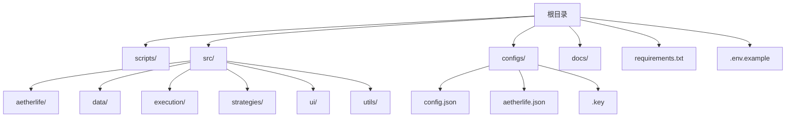
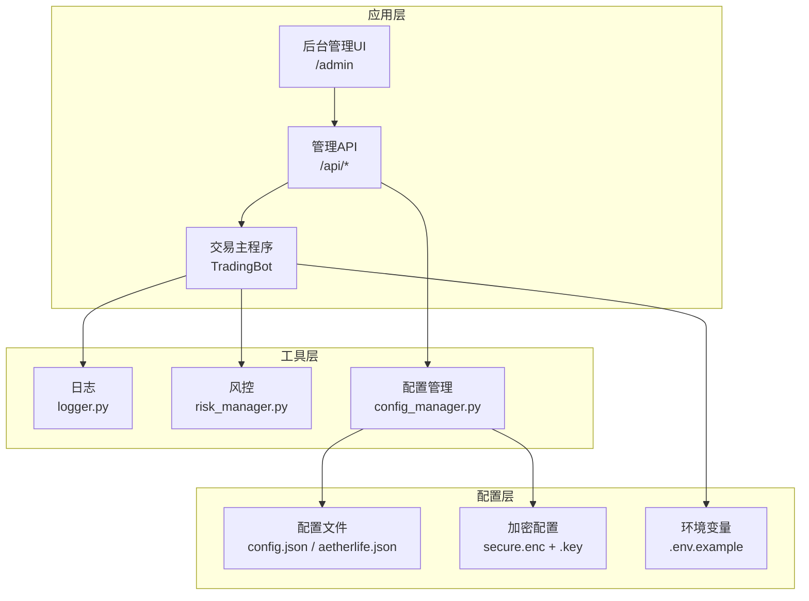
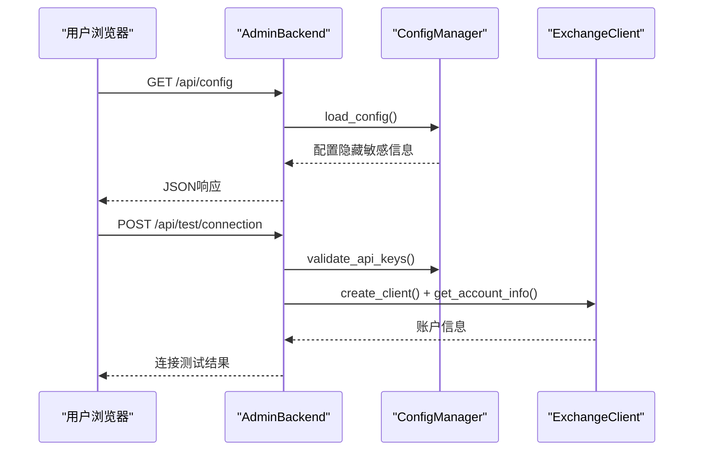
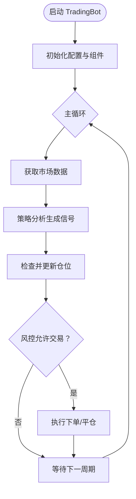
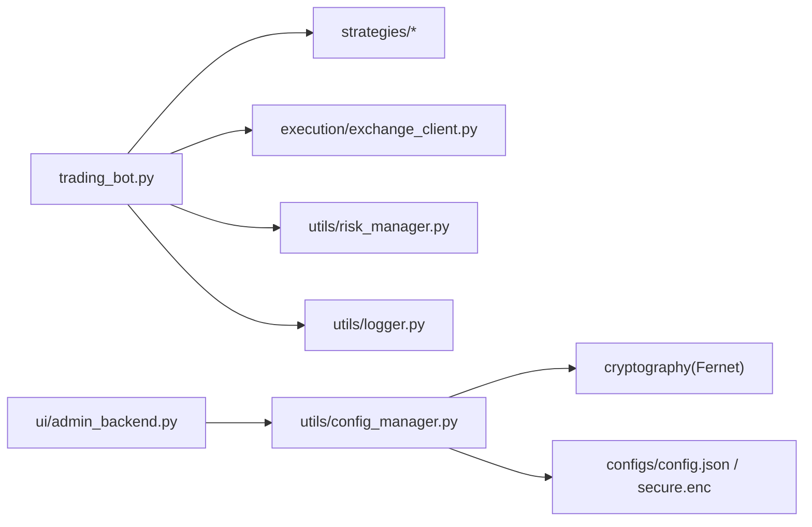

# 开发环境搭建

<cite>
**本文引用的文件**
- [requirements.txt](file://requirements.txt)
- [.env.example](file://.env.example)
- [config.json](file://configs/config.json)
- [aetherlife.json](file://configs/aetherlife.json)
- [src/aetherlife/config.py](file://src/aetherlife/config.py)
- [src/utils/config_manager.py](file://src/utils/config_manager.py)
- [src/trading_bot.py](file://src/trading_bot.py)
- [start_admin.py](file://start_admin.py)
- [start_admin_debug.py](file://start_admin_debug.py)
- [src/ui/admin_backend.py](file://src/ui/admin_backend.py)
- [src/utils/logger.py](file://src/utils/logger.py)
- [src/utils/risk_manager.py](file://src/utils/risk_manager.py)
- [docs/ADMIN_GUIDE.md](file://docs/ADMIN_GUIDE.md)
- [docs/QUICK_START.md](file://docs/QUICK_START.md)
</cite>

## 目录
1. [简介](#简介)
2. [项目结构](#项目结构)
3. [核心组件](#核心组件)
4. [架构总览](#架构总览)
5. [详细组件分析](#详细组件分析)
6. [依赖关系分析](#依赖关系分析)
7. [性能考虑](#性能考虑)
8. [故障排除指南](#故障排除指南)
9. [结论](#结论)
10. [附录](#附录)

## 简介
本指南面向量化交易系统的开发者，提供从零搭建开发环境的完整流程，涵盖Python版本与虚拟环境、依赖安装、环境变量与配置、IDE配置建议、Git使用规范以及常见问题排查。内容以仓库现有文件为依据，确保可操作性和可追溯性。

## 项目结构
该仓库采用“顶层脚本 + 源码模块 + 配置 + 文档”的组织方式，核心入口包括交易主程序与后台管理服务，配置位于 configs 目录，核心业务逻辑分布在 src 下的子模块。

图表来源
- [requirements.txt](file://requirements.txt#L1-L70)
- [config.json](file://configs/config.json#L1-L28)
- [aetherlife.json](file://configs/aetherlife.json#L1-L17)

章节来源
- [requirements.txt](file://requirements.txt#L1-L70)
- [config.json](file://configs/config.json#L1-L28)
- [aetherlife.json](file://configs/aetherlife.json#L1-L17)

## 核心组件
- 交易主程序：负责策略加载、数据获取、风控与下单执行。
- 配置管理：提供配置文件的加密存储、读取与验证。
- 后台管理服务：提供Web界面与REST API，用于配置管理、API测试与Bot控制。
- 日志与风控：统一日志输出与风控统计。

章节来源
- [src/trading_bot.py](file://src/trading_bot.py#L1-L346)
- [src/utils/config_manager.py](file://src/utils/config_manager.py#L1-L212)
- [src/ui/admin_backend.py](file://src/ui/admin_backend.py#L1-L447)
- [src/utils/logger.py](file://src/utils/logger.py#L1-L34)
- [src/utils/risk_manager.py](file://src/utils/risk_manager.py#L1-L388)

## 架构总览
系统采用“配置驱动 + 多模块协作”的架构：交易主程序通过配置加载策略与风控；后台管理服务提供可视化配置与API测试；配置管理模块负责敏感信息加密存储；日志模块统一输出。

图表来源
- [src/ui/admin_backend.py](file://src/ui/admin_backend.py#L20-L56)
- [src/trading_bot.py](file://src/trading_bot.py#L30-L91)
- [src/utils/config_manager.py](file://src/utils/config_manager.py#L14-L46)
- [src/utils/logger.py](file://src/utils/logger.py#L12-L28)
- [src/utils/risk_manager.py](file://src/utils/risk_manager.py#L12-L52)
- [config.json](file://configs/config.json#L1-L28)
- [aetherlife.json](file://configs/aetherlife.json#L1-L17)

## 详细组件分析

### Python版本与虚拟环境
- 版本要求：后台管理文档明确要求 Python 3.8+。
- 推荐做法：
  - 使用 venv 创建独立环境，隔离项目依赖。
  - 使用 conda 创建环境时，指定 Python 3.8+，并在环境中安装 pip。
- 建议流程：
  - venv：python3 -m venv .venv && source .venv/bin/activate（Linux/macOS）或 .venv\Scripts\activate（Windows）
  - conda：conda create -n quant python=3.10 && conda activate quant

章节来源
- [docs/ADMIN_GUIDE.md](file://docs/ADMIN_GUIDE.md#L250-L253)

### 依赖安装与作用说明
- 异步与网络：aiohttp、websockets（异步HTTP与WebSocket）
- 数据处理：pandas、numpy、polars（高性能数据处理）
- 交易所客户端：python-binance、okx（官方API客户端）
- 环境变量：python-dotenv（.env加载）
- 回测与机器学习：backtracking、scikit-learn、gymnasium、stable-baselines3
- 工具：python-dateutil
- 加密：cryptography（配置加密）
- 多Agent与LLM：langgraph、langchain、langchain-community
- 向量化：sentence-transformers
- 时序数据库与消息队列：clickhouse-driver、kafka-python、aiokafka
- 缓存：redis[hiredis]
- 深度学习：torch
- Web框架：fastapi、uvicorn
- 数据验证：pydantic

章节来源
- [requirements.txt](file://requirements.txt#L1-L70)

### 环境变量与配置文件
- 环境变量模板：.env.example 提供交易所API密钥占位符（Binance/OKX/Bybit），复制为 .env 并填写真实密钥。
- 运行时加载：交易主程序在启动时尝试加载 .env。
- 配置文件：
  - config.json：普通交易配置（交易所、策略、风控、AI增强等）
  - aetherlife.json：AetherLife相关配置（日志级别、认知层、守护层、进化层）
  - 配置管理：config_manager.py 将敏感信息（api_key/secret_key/passphrase）加密存储于 secure.enc，并生成 .key 文件

章节来源
- [.env.example](file://.env.example#L1-L17)
- [src/trading_bot.py](file://src/trading_bot.py#L326-L329)
- [config.json](file://configs/config.json#L1-L28)
- [aetherlife.json](file://configs/aetherlife.json#L1-L17)
- [src/utils/config_manager.py](file://src/utils/config_manager.py#L48-L116)

### 后台管理服务与API
- 启动方式：python start_admin.py 或 python start_admin_debug.py（调试版打印更详细信息）
- 服务端：aiohttp 提供REST API，包括配置管理、API测试、Bot控制等
- 端口选择：start_admin.py 会尝试多个端口（如8080/8081/8082/8888/9000），避免冲突
- 管理界面：/admin 页面由后台返回静态HTML

图表来源
- [src/ui/admin_backend.py](file://src/ui/admin_backend.py#L57-L113)
- [src/ui/admin_backend.py](file://src/ui/admin_backend.py#L159-L210)
- [src/utils/config_manager.py](file://src/utils/config_manager.py#L146-L161)

章节来源
- [start_admin.py](file://start_admin.py#L1-L85)
- [start_admin_debug.py](file://start_admin_debug.py#L1-L93)
- [src/ui/admin_backend.py](file://src/ui/admin_backend.py#L1-L447)

### 交易主程序与风控
- 初始化：加载配置、创建数据获取器与客户端、初始化策略与风控
- 主循环：拉取数据、生成信号、风控检查、执行下单、检查止损止盈
- 风控：RiskManager 提供止损止盈、熔断、单日限额、连败限制等功能；PositionManager 管理仓位与浮动盈亏

图表来源
- [src/trading_bot.py](file://src/trading_bot.py#L63-L91)
- [src/trading_bot.py](file://src/trading_bot.py#L256-L283)
- [src/utils/risk_manager.py](file://src/utils/risk_manager.py#L175-L194)

章节来源
- [src/trading_bot.py](file://src/trading_bot.py#L1-L346)
- [src/utils/risk_manager.py](file://src/utils/risk_manager.py#L1-L388)

### AetherLife 配置体系
- AetherLifeConfig：集中定义数据、记忆、认知、决策、执行、守护、进化等模块的配置项
- 支持从字典加载（兼容 config.json），并从环境变量读取Redis等外部依赖配置

章节来源
- [src/aetherlife/config.py](file://src/aetherlife/config.py#L1-L131)

## 依赖关系分析
- 交易主程序依赖：数据获取器、策略工厂、执行客户端、风控与日志
- 后台管理服务依赖：配置管理器、交换客户端
- 配置管理器依赖：cryptography（对称加密）、json、os、pathlib

图表来源
- [src/trading_bot.py](file://src/trading_bot.py#L14-L24)
- [src/ui/admin_backend.py](file://src/ui/admin_backend.py#L16-L17)
- [src/utils/config_manager.py](file://src/utils/config_manager.py#L11-L11)

章节来源
- [src/trading_bot.py](file://src/trading_bot.py#L1-L346)
- [src/ui/admin_backend.py](file://src/ui/admin_backend.py#L1-L447)
- [src/utils/config_manager.py](file://src/utils/config_manager.py#L1-L212)

## 性能考虑
- 数据处理：优先使用 polars 以提升大数据集处理速度
- 异步IO：利用 aiohttp/aiokafka/websockets 降低网络阻塞
- 缓存与存储：Redis 作为缓存与向量存储，ClickHouse 用于时序数据
- 深度学习：torch 与 stable-baselines3 用于强化学习，建议在GPU环境下训练
- 日志：统一日志输出，避免频繁磁盘IO；生产环境可接入外部日志系统

## 故障排除指南
- 后台管理无法访问
  - 现象：浏览器无法打开 /admin
  - 排查：确认端口占用；start_admin.py 会尝试多个端口，查看控制台输出的访问地址
  - 参考：start_admin.py 的端口轮询逻辑
- API连接失败
  - 现象：测试连接返回失败
  - 排查：核对 .env 中的API密钥格式与交易所选择；确认网络与交易所维护状态；检查 testnet 选项
  - 参考：admin_backend 的连接测试与API测试接口
- 配置保存失败
  - 现象：保存配置时报错
  - 排查：磁盘空间、文件权限、配置格式；可通过导出配置核对结构
  - 参考：config_manager 的保存与加载逻辑
- Bot启动异常
  - 现象：主循环抛出异常后休眠
  - 排查：查看日志输出；确认配置完整性与API密钥有效性
  - 参考：trading_bot 的异常捕获与日志记录
- 风控熔断或限制
  - 现象：can_trade 返回 should_stop
  - 排查：检查单日最大亏损、连败次数、熔断冷却时间
  - 参考：risk_manager 的风控检查逻辑

章节来源
- [start_admin.py](file://start_admin.py#L44-L78)
- [src/ui/admin_backend.py](file://src/ui/admin_backend.py#L159-L210)
- [src/utils/config_manager.py](file://src/utils/config_manager.py#L48-L116)
- [src/trading_bot.py](file://src/trading_bot.py#L280-L283)
- [src/utils/risk_manager.py](file://src/utils/risk_manager.py#L129-L194)

## 结论
本指南基于仓库现有文件，提供了从Python环境、依赖安装、配置与密钥管理、后台管理服务到交易主程序与风控的完整开发环境搭建路径。建议在本地先完成后台管理与配置验证，再逐步引入AetherLife相关模块与强化学习组件。

## 附录

### IDE 配置建议
- VS Code
  - 插件：Python、Pylance、Black、isort、flake8、GitLens
  - 调试：使用 launch.json 配置，针对 start_admin.py 与 trading_bot.py 的入口脚本
- PyCharm
  - 选择正确的Python解释器（虚拟环境）
  - 启用 pylint/Flake8/Black 集成
  - 使用内置终端运行脚本与查看日志

### Git 使用规范
- 分支管理
  - main/master：稳定发布分支
  - develop：日常开发分支
  - feature/*：功能开发分支
  - hotfix/*：紧急修复分支
- 提交规范
  - 类型：feat/fix/docs/style/refactor/test/build/ci
  - 示例：feat(ui): 添加配置导出功能
- 代码审查
  - PR 必须包含变更说明与测试结果
  - 审查重点：配置安全（密钥不入库）、日志与异常处理、性能影响

### 常用命令清单
- 安装依赖：pip install -r requirements.txt
- 启动后台管理：python start_admin.py
- 启动交易主程序：python src/trading_bot.py（需先配置 .env 与 config.json）