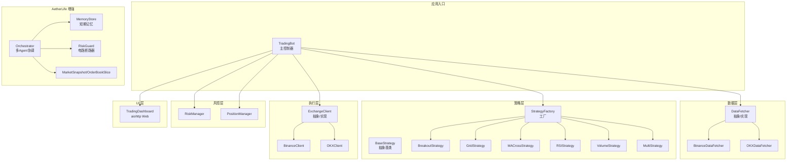
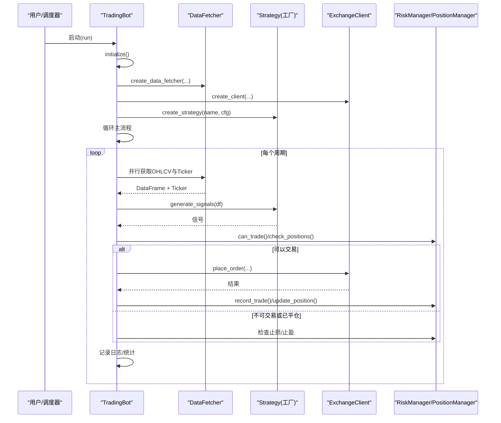
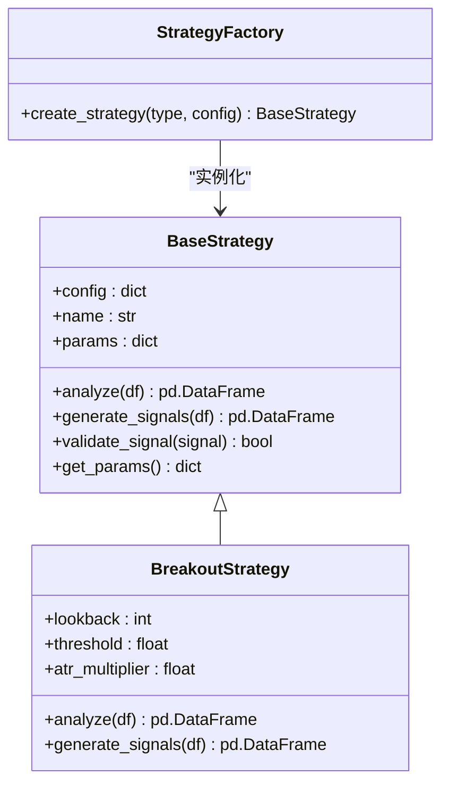
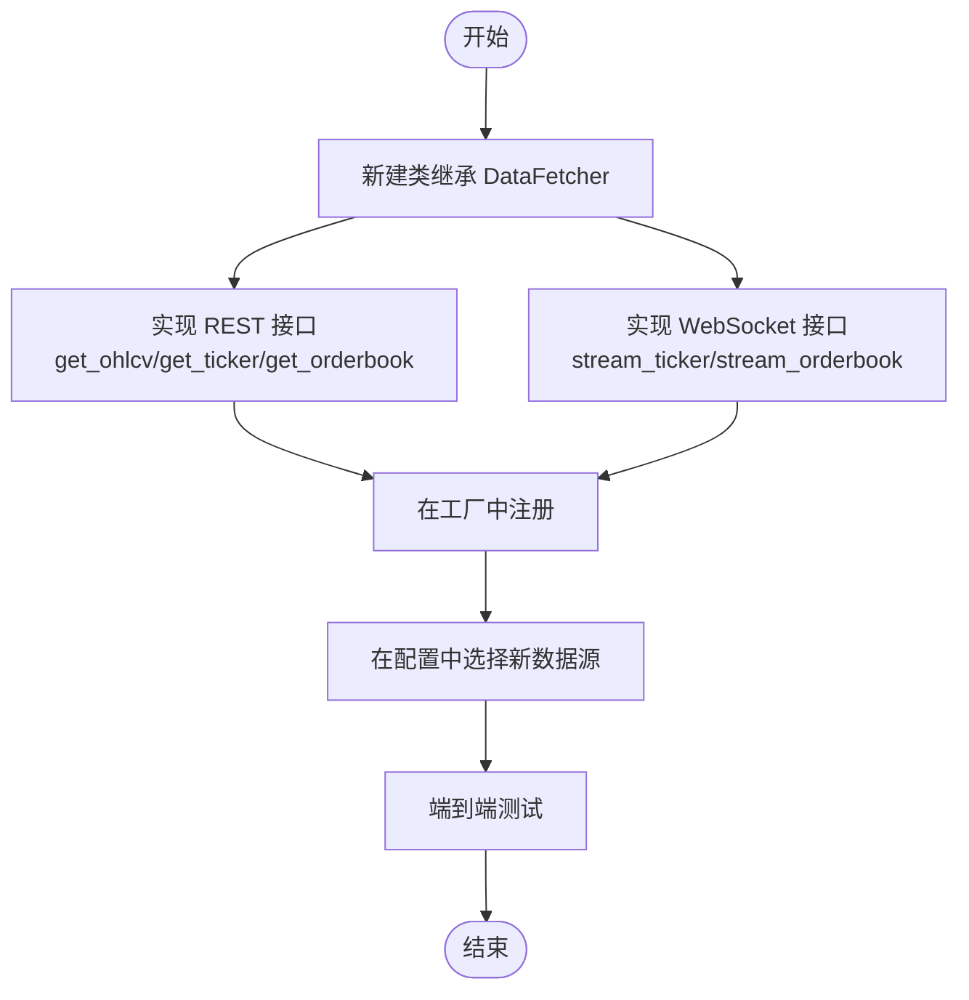
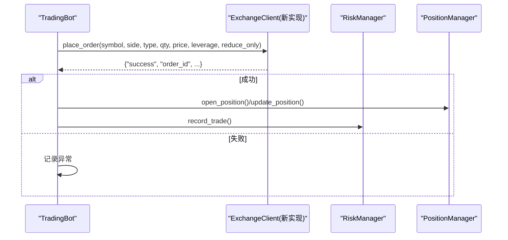
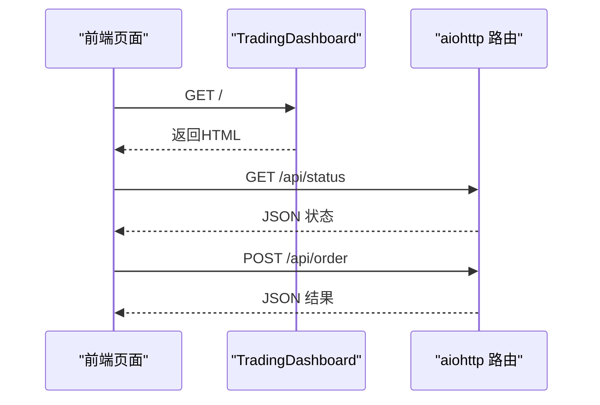
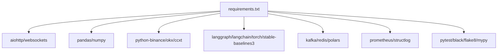

# 扩展开发指导

<cite>
**本文档引用的文件**
- [src/trading_bot.py](file://src/trading_bot.py)
- [src/strategies/base.py](file://src/strategies/base.py)
- [src/strategies/factory.py](file://src/strategies/factory.py)
- [src/strategies/breakout.py](file://src/strategies/breakout.py)
- [src/data/data_fetcher.py](file://src/data/data_fetcher.py)
- [src/execution/exchange_client.py](file://src/execution/exchange_client.py)
- [src/ui/dashboard.py](file://src/ui/dashboard.py)
- [src/utils/risk_manager.py](file://src/utils/risk_manager.py)
- [src/utils/config.py](file://src/utils/config.py)
- [configs/config.json](file://configs/config.json)
- [requirements.txt](file://requirements.txt)
- [src/aetherlife/cognition/orchestrator.py](file://src/aetherlife/cognition/orchestrator.py)
- [src/aetherlife/cognition/agents.py](file://src/aetherlife/cognition/agents.py)
- [src/aetherlife/guard/risk_guard.py](file://src/aetherlife/guard/risk_guard.py)
- [src/aetherlife/memory/store.py](file://src/aetherlife/memory/store.py)
- [src/aetherlife/perception/models.py](file://src/aetherlife/perception/models.py)
- [tests/test_strategies.py](file://tests/test_strategies.py)
</cite>

## 目录
1. [引言](#引言)
2. [项目结构](#项目结构)
3. [核心组件](#核心组件)
4. [架构总览](#架构总览)
5. [详细组件分析](#详细组件分析)
6. [依赖关系分析](#依赖关系分析)
7. [性能考量](#性能考量)
8. [故障排查指南](#故障排查指南)
9. [结论](#结论)
10. [附录](#附录)

## 引言
本指导面向希望在现有量化交易系统基础上进行扩展开发的工程师，覆盖以下目标：
- 新策略添加的开发流程：基类继承、参数配置、测试验证
- 模块扩展方法：新数据源接入、执行器扩展、UI组件开发
- API 设计原则：RESTful 接口、WebSocket 规范、内部模块通信协议
- 与现有系统集成：向后兼容、版本管理、迁移路径
- 插件系统开发：架构设计、生命周期、配置管理
- 安全与性能：安全考虑与性能影响评估

## 项目结构
系统采用分层模块化设计，核心分为数据层、策略层、执行层、风控层、UI 层，并提供 AetherLife 多智能体认知增强能力。

**图表来源**
- [src/trading_bot.py](file://src/trading_bot.py#L27-L298)
- [src/data/data_fetcher.py](file://src/data/data_fetcher.py#L17-L408)
- [src/strategies/base.py](file://src/strategies/base.py#L6-L31)
- [src/strategies/factory.py](file://src/strategies/factory.py#L10-L36)
- [src/execution/exchange_client.py](file://src/execution/exchange_client.py#L20-L411)
- [src/utils/risk_manager.py](file://src/utils/risk_manager.py#L12-L342)
- [src/ui/dashboard.py](file://src/ui/dashboard.py#L13-L385)
- [src/aetherlife/cognition/orchestrator.py](file://src/aetherlife/cognition/orchestrator.py#L16-L93)
- [src/aetherlife/memory/store.py](file://src/aetherlife/memory/store.py#L43-L155)
- [src/aetherlife/guard/risk_guard.py](file://src/aetherlife/guard/risk_guard.py#L23-L84)
- [src/aetherlife/perception/models.py](file://src/aetherlife/perception/models.py#L15-L64)

**章节来源**
- [src/trading_bot.py](file://src/trading_bot.py#L13-L91)
- [src/data/data_fetcher.py](file://src/data/data_fetcher.py#L17-L67)
- [src/execution/exchange_client.py](file://src/execution/exchange_client.py#L20-L85)
- [src/utils/risk_manager.py](file://src/utils/risk_manager.py#L12-L52)
- [src/ui/dashboard.py](file://src/ui/dashboard.py#L21-L30)

## 核心组件
- 主控制器 TradingBot：负责初始化、数据获取、策略分析、信号执行、风控检查与统计输出
- 策略体系：BaseStrategy 抽象基类 + Factory 工厂 + 具体策略（突破、网格、均线交叉、RSI、成交量、多策略组合）
- 数据获取：DataFetcher 抽象 + BinanceDataFetcher/OKXDataFetcher 实现，支持 REST 与 WebSocket
- 交易执行：ExchangeClient 抽象 + BinanceClient/OKXClient 实现，支持下单、撤单、杠杆设置等
- 风控与仓位：RiskManager + PositionManager 提供止损止盈、熔断、日限、连败控制与仓位管理
- UI 仪表盘：基于 aiohttp 的 Web 服务，提供状态查询、手动下单等接口
- AetherLife 增强：多 Agent 协调、短期记忆、风险守护、统一市场快照模型

**章节来源**
- [src/trading_bot.py](file://src/trading_bot.py#L27-L298)
- [src/strategies/base.py](file://src/strategies/base.py#L6-L31)
- [src/strategies/factory.py](file://src/strategies/factory.py#L10-L36)
- [src/data/data_fetcher.py](file://src/data/data_fetcher.py#L17-L408)
- [src/execution/exchange_client.py](file://src/execution/exchange_client.py#L20-L411)
- [src/utils/risk_manager.py](file://src/utils/risk_manager.py#L12-L242)
- [src/ui/dashboard.py](file://src/ui/dashboard.py#L13-L385)
- [src/aetherlife/cognition/orchestrator.py](file://src/aetherlife/cognition/orchestrator.py#L16-L93)
- [src/aetherlife/memory/store.py](file://src/aetherlife/memory/store.py#L43-L155)
- [src/aetherlife/guard/risk_guard.py](file://src/aetherlife/guard/risk_guard.py#L23-L84)
- [src/aetherlife/perception/models.py](file://src/aetherlife/perception/models.py#L15-L64)

## 架构总览
系统采用“主控制器 + 多模块协作”的异步架构，核心流程如下：

**图表来源**
- [src/trading_bot.py](file://src/trading_bot.py#L63-L298)
- [src/data/data_fetcher.py](file://src/data/data_fetcher.py#L92-L99)
- [src/strategies/factory.py](file://src/strategies/factory.py#L10-L36)
- [src/execution/exchange_client.py](file://src/execution/exchange_client.py#L226-L276)
- [src/utils/risk_manager.py](file://src/utils/risk_manager.py#L175-L254)

## 详细组件分析

### 策略扩展开发指南
- 继承与实现
  - 新策略需继承 BaseStrategy，实现 analyze 与 generate_signals 两个核心方法
  - 可复用 validate_signal 与 get_params 等通用能力
- 参数配置
  - 在策略构造函数中读取 config，暴露 params 字典便于导出
  - 通过工厂 create_strategy 注册新策略名称与类映射
- 测试验证
  - 使用单元测试框架编写测试用例，覆盖指标生成、信号有效性与边界条件
  - 可参考现有策略测试样例组织测试数据与断言

**图表来源**
- [src/strategies/base.py](file://src/strategies/base.py#L6-L31)
- [src/strategies/breakout.py](file://src/strategies/breakout.py#L6-L79)
- [src/strategies/factory.py](file://src/strategies/factory.py#L10-L36)

**章节来源**
- [src/strategies/base.py](file://src/strategies/base.py#L6-L31)
- [src/strategies/breakout.py](file://src/strategies/breakout.py#L9-L79)
- [src/strategies/factory.py](file://src/strategies/factory.py#L10-L36)
- [tests/test_strategies.py](file://tests/test_strategies.py#L13-L59)

### 数据源扩展开发指南
- 接入新交易所数据源
  - 新建类继承 DataFetcher，实现 get_ohlcv、get_ticker、get_orderbook、stream_ticker、stream_orderbook 等方法
  - 在 create_data_fetcher 中注册新实现
  - 注意错误处理与返回数据格式一致性
- WebSocket 实时流
  - stream_ticker/stream_orderbook 需要回调函数签名一致，确保上层能正确接收并处理
- 配置与测试
  - 在配置文件中切换 exchange/testnet，验证数据拉取与解析

**图表来源**
- [src/data/data_fetcher.py](file://src/data/data_fetcher.py#L17-L71)
- [src/data/data_fetcher.py](file://src/data/data_fetcher.py#L400-L408)

**章节来源**
- [src/data/data_fetcher.py](file://src/data/data_fetcher.py#L73-L235)
- [src/data/data_fetcher.py](file://src/data/data_fetcher.py#L237-L397)
- [src/data/data_fetcher.py](file://src/data/data_fetcher.py#L400-L408)

### 执行器扩展开发指南
- 新增交易所客户端
  - 新建类继承 ExchangeClient，实现 get_ticker、get_orderbook、place_order、cancel_order、set_leverage、set_margin_type 等
  - 注意签名与鉴权重用、请求超时、错误码处理
- 与 TradingBot 集成
  - 通过 create_client 工厂创建实例，保持接口一致
  - 与 RiskManager/PositionManager 协作，确保下单精度与风控生效

**图表来源**
- [src/execution/exchange_client.py](file://src/execution/exchange_client.py#L20-L85)
- [src/execution/exchange_client.py](file://src/execution/exchange_client.py#L402-L411)
- [src/trading_bot.py](file://src/trading_bot.py#L115-L205)

**章节来源**
- [src/execution/exchange_client.py](file://src/execution/exchange_client.py#L87-L343)
- [src/execution/exchange_client.py](file://src/execution/exchange_client.py#L345-L401)
- [src/execution/exchange_client.py](file://src/execution/exchange_client.py#L402-L411)

### UI 组件扩展开发指南
- Web API 设计
  - 基于 aiohttp 提供 /api/* 接口，如状态、持仓、订单、统计、配置、下单
  - 前端通过 fetch 调用，后端返回 JSON
- 仪表盘页面
  - HTML 页面内嵌图表与交互按钮，通过 AJAX 轮询后端接口更新
- 扩展建议
  - 新增接口时遵循 REST 命名规范，统一响应结构
  - 对敏感操作增加鉴权与限流

**图表来源**
- [src/ui/dashboard.py](file://src/ui/dashboard.py#L21-L30)
- [src/ui/dashboard.py](file://src/ui/dashboard.py#L338-L375)

**章节来源**
- [src/ui/dashboard.py](file://src/ui/dashboard.py#L13-L385)

### API 接口设计原则
- RESTful 设计
  - 资源命名使用名词复数，动词使用 HTTP 方法语义
  - 统一状态码与错误响应结构
- WebSocket 规范
  - 明确订阅频道与消息格式，心跳与断线重连
- 内部模块通信协议
  - 通过工厂函数与抽象基类解耦，参数与返回值结构化
  - 配置驱动，便于热切换与灰度发布

**章节来源**
- [src/data/data_fetcher.py](file://src/data/data_fetcher.py#L64-L71)
- [src/ui/dashboard.py](file://src/ui/dashboard.py#L21-L30)
- [src/strategies/factory.py](file://src/strategies/factory.py#L10-L36)
- [src/utils/config.py](file://src/utils/config.py#L15-L37)

### 与现有系统集成方法
- 向后兼容
  - 保持策略与执行器接口稳定，新增参数以可选方式提供
  - 工厂注册策略名称与默认参数，避免破坏既有配置
- 版本管理
  - 通过 requirements.txt 管理第三方依赖版本，使用虚拟环境隔离
- 迁移路径
  - 逐步替换实现：先新增实现类，再切换工厂映射，最后清理旧实现
  - 配置文件中保留兼容字段，逐步淘汰

**章节来源**
- [src/strategies/factory.py](file://src/strategies/factory.py#L10-L36)
- [src/utils/config.py](file://src/utils/config.py#L15-L37)
- [requirements.txt](file://requirements.txt#L1-L92)

### 插件系统开发指南
- 架构设计
  - 插件以“策略/数据源/执行器”三类扩展点为核心，通过工厂注册与配置驱动
  - AetherLife 的多 Agent 与记忆存储可作为插件化认知增强的基础
- 生命周期管理
  - 插件初始化：加载配置、建立连接、启动订阅
  - 运行期：接收事件、处理数据、输出结果
  - 关闭：释放资源、持久化状态
- 配置管理
  - 通过 config.json 与环境变量组合，支持多环境差异化配置
  - 提供校验函数 validate_config，保障配置合法性

**图表来源**
- [configs/config.json](file://configs/config.json#L1-L28)
- [src/utils/config.py](file://src/utils/config.py#L15-L37)
- [src/strategies/factory.py](file://src/strategies/factory.py#L10-L36)
- [src/data/data_fetcher.py](file://src/data/data_fetcher.py#L400-L408)
- [src/execution/exchange_client.py](file://src/execution/exchange_client.py#L402-L411)

**章节来源**
- [configs/config.json](file://configs/config.json#L1-L28)
- [src/utils/config.py](file://src/utils/config.py#L15-L37)
- [src/aetherlife/cognition/orchestrator.py](file://src/aetherlife/cognition/orchestrator.py#L16-L93)
- [src/aetherlife/memory/store.py](file://src/aetherlife/memory/store.py#L43-L155)

### 安全考虑与性能影响评估
- 安全
  - API 密钥与私有配置使用环境变量注入，避免硬编码
  - 交易所签名与鉴权流程严格遵循官方要求
  - 对外接口增加鉴权与限流，防止滥用
- 性能
  - 异步 I/O 与并发请求（如并行获取 OHLCV 与 Ticker）
  - 精度控制与步进约束，避免下单失败
  - WebSocket 心跳与断线重连，降低丢包风险
  - 风控与日志记录避免成为瓶颈

**章节来源**
- [src/trading_bot.py](file://src/trading_bot.py#L63-L99)
- [src/execution/exchange_client.py](file://src/execution/exchange_client.py#L128-L171)
- [src/data/data_fetcher.py](file://src/data/data_fetcher.py#L188-L235)
- [src/utils/risk_manager.py](file://src/utils/risk_manager.py#L62-L72)

## 依赖关系分析
系统依赖主要集中在异步 HTTP、数据处理、交易所 SDK、AI/ML 工具链与监控告警等方面。

**图表来源**
- [requirements.txt](file://requirements.txt#L1-L92)

**章节来源**
- [requirements.txt](file://requirements.txt#L1-L92)

## 性能考量
- I/O 并发：TradingBot 在数据获取阶段使用 asyncio.gather 并行请求，显著降低等待时间
- 策略计算：Pandas/Numpy 提供高效向量化运算，建议在策略中尽量减少 Python 循环
- 执行效率：下单前进行风控校验与仓位计算，避免无效请求
- 监控与可观测性：结合 Prometheus 与 structlog，持续观察延迟与错误率

**章节来源**
- [src/trading_bot.py](file://src/trading_bot.py#L92-L114)
- [requirements.txt](file://requirements.txt#L78-L81)

## 故障排查指南
- 配置校验失败
  - 使用 validate_config 校验 exchange/symbols/strategy/risk 等字段
  - 检查配置文件与环境变量是否冲突
- 数据获取异常
  - 检查网络与代理设置，确认 REST/WS 地址与认证
  - 查看返回错误码与消息，必要时切换 testnet
- 下单失败
  - 核对精度与步进约束，检查杠杆设置与保证金
  - 关注风控拦截原因（熔断/日限/连败）
- UI 无法访问
  - 确认端口占用与防火墙设置
  - 检查路由与静态资源路径

**章节来源**
- [src/utils/config.py](file://src/utils/config.py#L15-L37)
- [src/data/data_fetcher.py](file://src/data/data_fetcher.py#L95-L98)
- [src/execution/exchange_client.py](file://src/execution/exchange_client.py#L264-L276)
- [src/utils/risk_manager.py](file://src/utils/risk_manager.py#L175-L194)
- [src/ui/dashboard.py](file://src/ui/dashboard.py#L376-L385)

## 结论
本指导提供了从策略、数据源、执行器到 UI 的完整扩展路径，结合工厂注册、配置驱动与严格的风控体系，确保扩展的稳定性与可维护性。建议在新增功能时遵循本文的设计原则与流程，以实现平滑集成与可控演进。

## 附录
- 快速验证新策略
  - 在工厂中注册新策略名称
  - 在配置文件中指定 strategy 与 strategy_config
  - 运行 TradingBot 并观察日志与 UI 状态
- AetherLife 增强
  - 可选启用多 Agent 协调与记忆存储，提升决策质量
  - 通过 RiskGuard 实施电路断路器与人工确认流程

**章节来源**
- [src/strategies/factory.py](file://src/strategies/factory.py#L10-L36)
- [configs/config.json](file://configs/config.json#L8-L14)
- [src/aetherlife/cognition/orchestrator.py](file://src/aetherlife/cognition/orchestrator.py#L16-L93)
- [src/aetherlife/guard/risk_guard.py](file://src/aetherlife/guard/risk_guard.py#L23-L84)
- [src/aetherlife/memory/store.py](file://src/aetherlife/memory/store.py#L43-L155)