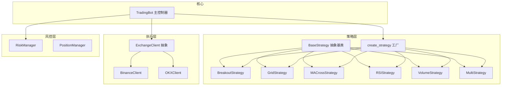
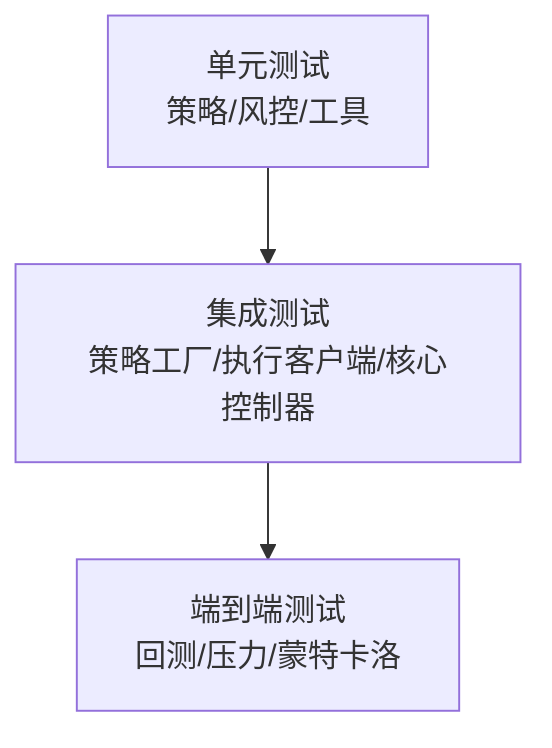
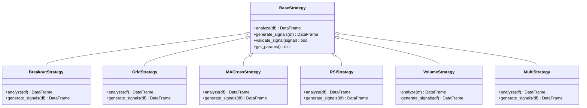
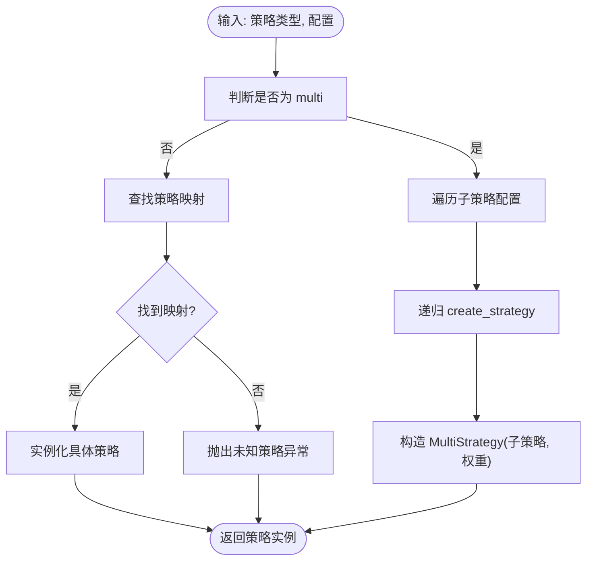
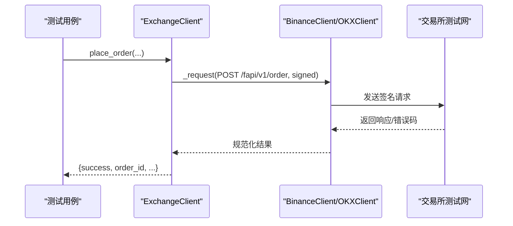
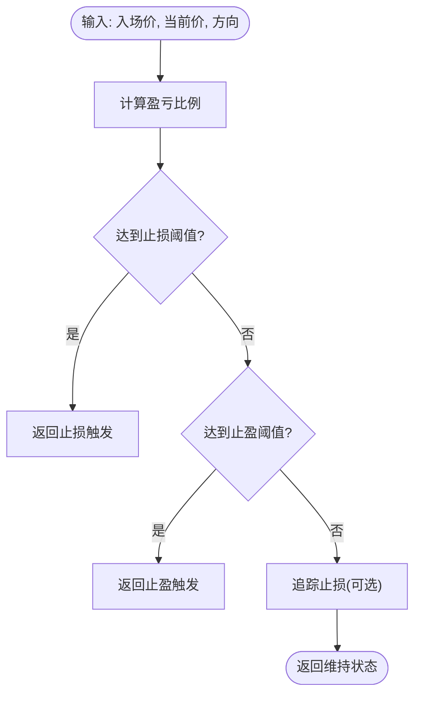
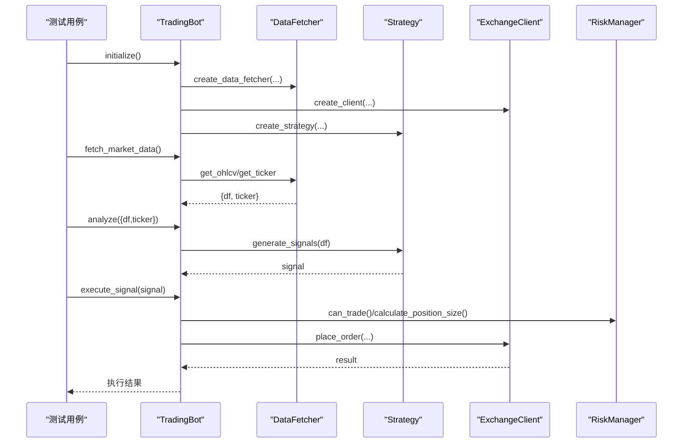
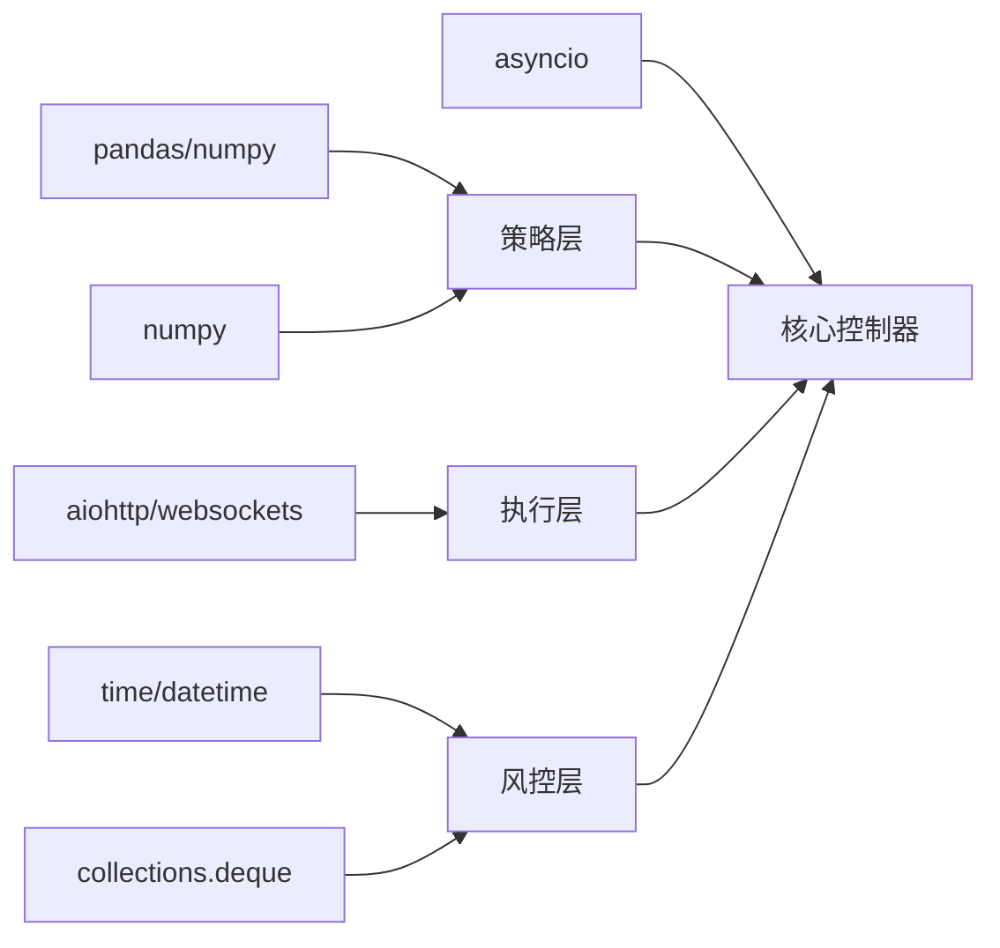

# 测试策略与实施

<cite>
**本文引用的文件**
- [tests/test_strategies.py](file://tests/test_strategies.py)
- [src/trading_bot.py](file://src/trading_bot.py)
- [src/strategies/base.py](file://src/strategies/base.py)
- [src/strategies/breakout.py](file://src/strategies/breakout.py)
- [src/strategies/grid.py](file://src/strategies/grid.py)
- [src/strategies/macd.py](file://src/strategies/macd.py)
- [src/strategies/rsi.py](file://src/strategies/rsi.py)
- [src/strategies/volume.py](file://src/strategies/volume.py)
- [src/strategies/multi.py](file://src/strategies/multi.py)
- [src/strategies/factory.py](file://src/strategies/factory.py)
- [src/utils/risk_manager.py](file://src/utils/risk_manager.py)
- [src/execution/exchange_client.py](file://src/execution/exchange_client.py)
- [requirements.txt](file://requirements.txt)
</cite>

## 目录
1. [引言](#引言)
2. [项目结构](#项目结构)
3. [核心组件](#核心组件)
4. [架构总览](#架构总览)
5. [详细组件分析](#详细组件分析)
6. [依赖关系分析](#依赖关系分析)
7. [性能考量](#性能考量)
8. [故障排查指南](#故障排查指南)
9. [结论](#结论)
10. [附录](#附录)

## 引言
本文件面向量化交易系统的测试工作，目标是建立一套完整的测试策略与实施指南，覆盖测试金字塔的三个层级：单元测试、集成测试与端到端测试；明确测试框架选择与配置（unittest、pytest）及测试用例编写规范；给出策略测试方法（回测、压力测试、蒙特卡洛模拟）与数据驱动测试实践（测试数据生成、边界条件与异常处理）；规划测试自动化流程（CI、覆盖率、性能基准）；并总结测试环境搭建与测试数据管理最佳实践。

## 项目结构
该仓库采用按功能域划分的模块化组织方式，核心交易链路由“数据层-策略层-执行层-风控层”构成，测试主要集中在策略层与核心业务逻辑上，同时涉及执行层与风控层的关键行为。

图表来源
- [src/trading_bot.py](file://src/trading_bot.py#L27-L91)
- [src/strategies/base.py](file://src/strategies/base.py#L6-L31)
- [src/strategies/breakout.py](file://src/strategies/breakout.py#L6-L79)
- [src/strategies/grid.py](file://src/strategies/grid.py#L5-L63)
- [src/strategies/macd.py](file://src/strategies/macd.py#L5-L40)
- [src/strategies/rsi.py](file://src/strategies/rsi.py#L6-L42)
- [src/strategies/volume.py](file://src/strategies/volume.py#L6-L44)
- [src/strategies/multi.py](file://src/strategies/multi.py#L6-L38)
- [src/strategies/factory.py](file://src/strategies/factory.py#L10-L36)
- [src/execution/exchange_client.py](file://src/execution/exchange_client.py#L20-L85)
- [src/utils/risk_manager.py](file://src/utils/risk_manager.py#L12-L52)

章节来源
- [src/trading_bot.py](file://src/trading_bot.py#L13-L91)
- [src/strategies/factory.py](file://src/strategies/factory.py#L10-L36)

## 核心组件
- 策略层：提供抽象基类与多种具体策略，统一 analyze/generate_signals 接口，支持工厂动态创建与多策略组合。
- 执行层：抽象交易所客户端，提供下单、查询、杠杆设置等接口，内置 Binance/OKX 实现。
- 风控层：提供仓位管理、止损止盈、熔断与日限检查，以及交易记录与统计。
- 核心控制器：整合数据、策略、执行与风控，负责主循环、信号执行与风控检查。

章节来源
- [src/strategies/base.py](file://src/strategies/base.py#L6-L31)
- [src/strategies/breakout.py](file://src/strategies/breakout.py#L21-L79)
- [src/execution/exchange_client.py](file://src/execution/exchange_client.py#L20-L85)
- [src/utils/risk_manager.py](file://src/utils/risk_manager.py#L12-L242)
- [src/trading_bot.py](file://src/trading_bot.py#L27-L91)

## 架构总览
下图展示测试金字塔在本项目中的落地思路：单元测试覆盖策略与风控的纯函数与小对象；集成测试覆盖策略工厂、执行客户端与核心控制器的交互；端到端测试以回测为核心，结合压力与蒙特卡洛模拟评估策略鲁棒性。

## 详细组件分析

### 测试框架与用例规范
- 测试框架
  - 单元测试：建议使用 pytest（支持异步、参数化、夹具），兼容现有 unittest 示例。
  - 集成测试：pytest + 异步协程，结合模拟或测试网 API。
  - 端到端测试：基于回测引擎与数据驱动，结合压力与蒙特卡洛。
- 用例编写规范
  - 命名：以 test_ 前缀，描述明确意图。
  - 断言：覆盖正常路径、边界条件、异常路径。
  - 夹具：复用策略实例、测试数据生成器、模拟客户端。
  - 参数化：覆盖不同参数组合、时间范围、市场状态。

章节来源
- [requirements.txt](file://requirements.txt#L82-L86)
- [tests/test_strategies.py](file://tests/test_strategies.py#L1-L59)

### 策略层测试（单元测试）
- 目标：验证策略 analyze/generate_signals 的正确性与健壮性。
- 关键点
  - 输入校验：空表、长度不足、列缺失。
  - 输出校验：新增指标列存在、信号取值范围[-1,0,1]。
  - 边界条件：阈值、窗口期、RSI 分母安全。
  - 异常处理：输入为空或类型异常时的行为。
- 建议用例
  - 测试 analyze 输出列集合与数值范围。
  - 测试 generate_signals 的信号分布与约束。
  - 测试空 DataFrame 与短序列返回空/默认信号。
  - 测试阈值与窗口参数变化对信号的影响。

图表来源
- [src/strategies/base.py](file://src/strategies/base.py#L6-L31)
- [src/strategies/breakout.py](file://src/strategies/breakout.py#L6-L79)
- [src/strategies/grid.py](file://src/strategies/grid.py#L5-L63)
- [src/strategies/macd.py](file://src/strategies/macd.py#L5-L40)
- [src/strategies/rsi.py](file://src/strategies/rsi.py#L6-L42)
- [src/strategies/volume.py](file://src/strategies/volume.py#L6-L44)
- [src/strategies/multi.py](file://src/strategies/multi.py#L6-L38)

章节来源
- [src/strategies/base.py](file://src/strategies/base.py#L14-L31)
- [src/strategies/breakout.py](file://src/strategies/breakout.py#L64-L79)
- [src/strategies/grid.py](file://src/strategies/grid.py#L42-L63)
- [src/strategies/macd.py](file://src/strategies/macd.py#L29-L40)
- [src/strategies/rsi.py](file://src/strategies/rsi.py#L31-L42)
- [src/strategies/volume.py](file://src/strategies/volume.py#L33-L44)
- [src/strategies/multi.py](file://src/strategies/multi.py#L21-L38)

### 策略工厂与多策略组合测试（单元测试）
- 目标：验证 create_strategy 的策略映射、多策略组合权重与递归子策略创建。
- 关键点
  - 支持策略类型映射与未知类型异常。
  - 多策略组合的子策略列表与权重处理。
  - 子策略 analyze/generate_signals 的串联调用。

图表来源
- [src/strategies/factory.py](file://src/strategies/factory.py#L10-L36)

章节来源
- [src/strategies/factory.py](file://src/strategies/factory.py#L10-L36)
- [src/strategies/multi.py](file://src/strategies/multi.py#L9-L38)

### 执行层测试（集成测试）
- 目标：验证交易所客户端的下单、查询、杠杆设置等接口在测试网下的行为。
- 关键点
  - 异步请求与超时控制。
  - 精度处理与步长校正。
  - 错误码与异常转换。
  - 会话生命周期管理。
- 建议用例
  - 获取行情/订单簿/价格。
  - 市价/限价下单与精度校正。
  - 取消订单与活跃订单查询。
  - 设置杠杆与保证金模式。
  - 异常场景：无 API Key、网络错误、错误码。

图表来源
- [src/execution/exchange_client.py](file://src/execution/exchange_client.py#L136-L276)

章节来源
- [src/execution/exchange_client.py](file://src/execution/exchange_client.py#L20-L85)
- [src/execution/exchange_client.py](file://src/execution/exchange_client.py#L87-L432)

### 风控层测试（单元测试）
- 目标：验证仓位计算、止损止盈、熔断与日限检查的正确性。
- 关键点
  - 仓位大小在上下限之间。
  - 止损/止盈阈值判断与方向处理。
  - 熔断冷却与暂停状态。
  - 连续亏损计数与日统计重置。
- 建议用例
  - 仓位计算边界与信号强度影响。
  - 不同方向与价格下的止损/止盈判定。
  - 熔断触发与冷却剩余时间。
  - 日交易次数与连续亏损上限。

图表来源
- [src/utils/risk_manager.py](file://src/utils/risk_manager.py#L73-L128)

章节来源
- [src/utils/risk_manager.py](file://src/utils/risk_manager.py#L12-L242)

### 核心控制器测试（集成测试）
- 目标：验证 TradingBot 的初始化、数据拉取、分析、风控检查与下单执行的协同。
- 关键点
  - 初始化配置校验与模块装配。
  - 并行获取 OHLCV 与 ticker。
  - 信号生成与执行决策。
  - 风控拦截与异常日志。
- 建议用例
  - 初始化失败与成功路径。
  - 空数据与短序列的信号返回。
  - 风控拦截下单与平仓。
  - 位置更新与止盈止损触发。

图表来源
- [src/trading_bot.py](file://src/trading_bot.py#L63-L114)
- [src/trading_bot.py](file://src/trading_bot.py#L115-L205)

章节来源
- [src/trading_bot.py](file://src/trading_bot.py#L27-L297)

### 策略测试方法
- 回测测试
  - 使用回测引擎对策略进行历史数据回放，计算收益、最大回撤、胜率等指标。
  - 对多策略组合进行加权回测，比较不同权重与参数组合的表现。
- 压力测试
  - 在极端市场条件下（暴涨/暴跌、流动性枯竭）验证策略稳定性与风控有效性。
  - 模拟高频下单、网络抖动、交易所限流等异常场景。
- 蒙特卡洛模拟
  - 对策略参数进行随机扰动，多次运行统计分布，评估策略稳健性与参数敏感性。

### 数据驱动测试
- 测试数据生成
  - 使用随机/合成数据生成 OHLCV 序列，覆盖上涨、震荡、下跌、横盘等市场状态。
  - 通过参数化生成不同波动率、滑点、手续费场景。
- 边界条件测试
  - 空表、长度不足、列缺失、NaN/无穷值。
  - 阈值边界（RSI=0/100、ATR=0）、窗口期边界。
- 异常情况处理
  - API 返回错误码、网络异常、签名失败。
  - 风控拦截、熔断暂停、日限额触发。

### 测试自动化流程
- 持续集成
  - 使用 CI 平台（如 GitHub Actions）执行 pytest 异步用例，确保主干稳定。
- 测试覆盖率
  - 使用 pytest-cov 生成覆盖率报告，重点关注策略与风控分支。
- 性能基准
  - 对策略计算耗时与回测吞吐进行基准测试，识别性能瓶颈。

章节来源
- [requirements.txt](file://requirements.txt#L82-L86)

### 测试环境搭建与数据管理
- 环境搭建
  - 使用测试网 API 进行集成测试，避免真实资金风险。
  - 通过环境变量注入 API Key/Secret，本地开发使用 .env 文件。
- 数据管理
  - 使用历史数据集进行回测，确保时间序列完整性与一致性。
  - 对测试数据进行版本化管理，便于回归与对比。

## 依赖关系分析
策略层依赖 pandas/numpy 进行指标计算；执行层依赖 aiohttp/websockets 进行异步通信；风控层依赖时间与队列进行统计与状态管理；核心控制器串联上述模块并引入异步事件循环。

图表来源
- [src/strategies/breakout.py](file://src/strategies/breakout.py#L2-L4)
- [src/execution/exchange_client.py](file://src/execution/exchange_client.py#L6-L14)
- [src/utils/risk_manager.py](file://src/utils/risk_manager.py#L6-L10)
- [src/trading_bot.py](file://src/trading_bot.py#L6-L12)

章节来源
- [src/strategies/breakout.py](file://src/strategies/breakout.py#L2-L4)
- [src/execution/exchange_client.py](file://src/execution/exchange_client.py#L6-L14)
- [src/utils/risk_manager.py](file://src/utils/risk_manager.py#L6-L10)
- [src/trading_bot.py](file://src/trading_bot.py#L6-L12)

## 性能考量
- 异步并发：利用 asyncio.gather 并行获取 OHLCV 与 ticker，减少主循环等待。
- 策略计算：优先使用向量化操作与滚动窗口，避免 Python 循环。
- 精度与步长：下单数量按交易所步长校正，避免无效订单。
- 风控前置：下单前先检查风控，减少无效请求与潜在损失。

## 故障排查指南
- 策略异常
  - 检查输入 DataFrame 是否为空或列缺失，确认 analyze 输出列是否存在。
  - 核对 generate_signals 的阈值与窗口参数，关注边界取值。
- 执行异常
  - 查看请求超时与错误码，确认签名参数与时间戳。
  - 校验精度与步长，确保数量符合交易所要求。
- 风控异常
  - 检查熔断冷却时间与暂停原因，核对日统计重置逻辑。
  - 确认连续亏损计数与止盈止损阈值。

章节来源
- [src/strategies/breakout.py](file://src/strategies/breakout.py#L64-L79)
- [src/execution/exchange_client.py](file://src/execution/exchange_client.py#L136-L171)
- [src/utils/risk_manager.py](file://src/utils/risk_manager.py#L129-L154)

## 结论
通过构建以策略为中心的单元测试、以工厂与客户端为核心的集成测试、以回测与压力测试为主的端到端测试，配合 pytest 异步与参数化能力、覆盖率与性能基准，可形成完整且可维护的测试体系。建议优先完善策略与风控的单元测试，再扩展到执行与核心控制器的集成测试，最终以回测与压力测试验证策略在真实市场中的稳健性。

## 附录
- 现有测试参考：策略单元测试示例位于 tests/test_strategies.py，展示了基于 unittest 的基本结构与断言方式。
- 建议扩展：将现有 unittest 逐步迁移至 pytest，增加异步夹具、参数化与覆盖率统计；补充策略工厂与多策略组合的测试；完善执行层与风控层的边界与异常测试。

章节来源
- [tests/test_strategies.py](file://tests/test_strategies.py#L1-L59)