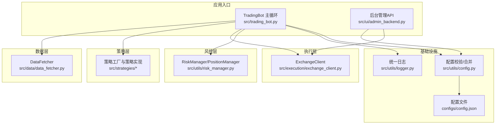
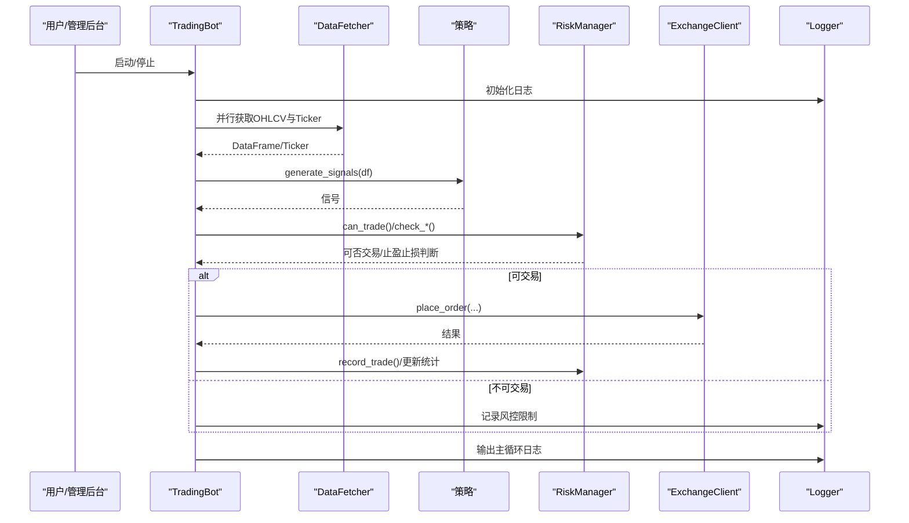
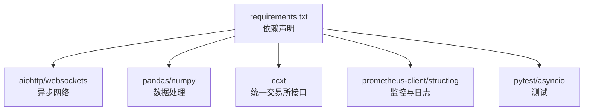

# 调试技巧与故障排除

<cite>
**本文引用的文件**
- [src/trading_bot.py](file://src/trading_bot.py)
- [src/utils/logger.py](file://src/utils/logger.py)
- [src/utils/risk_manager.py](file://src/utils/risk_manager.py)
- [src/execution/exchange_client.py](file://src/execution/exchange_client.py)
- [src/data/data_fetcher.py](file://src/data/data_fetcher.py)
- [src/utils/config.py](file://src/utils/config.py)
- [src/ui/admin_backend.py](file://src/ui/admin_backend.py)
- [start_admin_debug.py](file://start_admin_debug.py)
- [requirements.txt](file://requirements.txt)
- [configs/config.json](file://configs/config.json)
- [docs/ADMIN_GUIDE.md](file://docs/ADMIN_GUIDE.md)
- [docs/DEPLOYMENT_GUIDE.md](file://docs/DEPLOYMENT_GUIDE.md)
</cite>

## 目录
1. [简介](#简介)
2. [项目结构](#项目结构)
3. [核心组件](#核心组件)
4. [架构总览](#架构总览)
5. [详细组件分析](#详细组件分析)
6. [依赖关系分析](#依赖关系分析)
7. [性能考虑](#性能考虑)
8. [故障排除指南](#故障排除指南)
9. [结论](#结论)
10. [附录](#附录)

## 简介
本指南聚焦于量化交易系统的调试技巧与故障排除，覆盖以下方面：
- 调试工具：Python调试器、IDE调试、远程调试
- 日志分析：日志级别、关键指标监控、异常追踪
- 常见问题诊断：交易执行失败、数据获取异常、性能瓶颈
- 性能分析：CPU、内存、网络延迟
- 生产环境排障：紧急停机、数据恢复、系统重启
- 监控告警与自动化检测

## 项目结构
系统采用模块化分层设计，核心模块包括数据层、策略层、执行层、风控层与UI管理后台。日志与配置管理贯穿各模块，便于统一调试与排障。

图示来源
- [src/trading_bot.py](file://src/trading_bot.py#L1-L346)
- [src/data/data_fetcher.py](file://src/data/data_fetcher.py#L1-L434)
- [src/execution/exchange_client.py](file://src/execution/exchange_client.py#L1-L432)
- [src/utils/risk_manager.py](file://src/utils/risk_manager.py#L1-L388)
- [src/utils/logger.py](file://src/utils/logger.py#L1-L34)
- [src/utils/config.py](file://src/utils/config.py#L1-L49)
- [configs/config.json](file://configs/config.json#L1-L28)

章节来源
- [src/trading_bot.py](file://src/trading_bot.py#L1-L346)
- [src/data/data_fetcher.py](file://src/data/data_fetcher.py#L1-L434)
- [src/execution/exchange_client.py](file://src/execution/exchange_client.py#L1-L432)
- [src/utils/risk_manager.py](file://src/utils/risk_manager.py#L1-L388)
- [src/utils/logger.py](file://src/utils/logger.py#L1-L34)
- [src/utils/config.py](file://src/utils/config.py#L1-L49)
- [configs/config.json](file://configs/config.json#L1-L28)

## 核心组件
- TradingBot：主控制器，负责初始化、数据拉取、策略分析、风控检查、下单执行与统计输出。
- DataFetcher：异步数据获取器，支持Binance/OKX，提供K线、行情、订单簿与WebSocket订阅。
- ExchangeClient：抽象交易所客户端，具体实现BinanceClient/OKXClient，封装下单、撤单、杠杆设置等。
- RiskManager/PositionManager：风控与仓位管理，含止损止盈、熔断、连败限制、统计与暂停机制。
- Logger：统一日志，控制台输出与可选文件输出，异常追踪。
- Config：配置校验与深度合并，保证运行时配置一致性。
- Admin Backend：后台管理API，提供配置管理、API测试、Bot控制等。

章节来源
- [src/trading_bot.py](file://src/trading_bot.py#L27-L297)
- [src/data/data_fetcher.py](file://src/data/data_fetcher.py#L17-L71)
- [src/execution/exchange_client.py](file://src/execution/exchange_client.py#L20-L85)
- [src/utils/risk_manager.py](file://src/utils/risk_manager.py#L12-L241)
- [src/utils/logger.py](file://src/utils/logger.py#L12-L34)
- [src/utils/config.py](file://src/utils/config.py#L15-L49)
- [src/ui/admin_backend.py](file://src/ui/admin_backend.py#L20-L56)

## 架构总览
下图展示主循环与关键模块交互，以及异常捕获与日志输出路径。

图示来源
- [src/trading_bot.py](file://src/trading_bot.py#L63-L282)
- [src/data/data_fetcher.py](file://src/data/data_fetcher.py#L85-L142)
- [src/utils/risk_manager.py](file://src/utils/risk_manager.py#L175-L241)
- [src/execution/exchange_client.py](file://src/execution/exchange_client.py#L226-L275)
- [src/utils/logger.py](file://src/utils/logger.py#L31-L34)

## 详细组件分析

### TradingBot 主循环与调试要点
- 初始化阶段：配置校验、客户端与策略创建、日志初始化。
- 主循环：并行获取数据、生成信号、风控检查、执行交易、仓位检查与止盈止损。
- 异常处理：主循环内捕获异常并记录，避免进程崩溃；停止时释放资源并输出统计。

调试建议
- 使用Python调试器在主循环关键节点设置断点，观察信号、价格、风控返回值。
- 在策略生成信号处打印关键列，确认信号变化与稳定性。
- 在风控检查处打印阈值与状态，定位熔断与限制触发原因。
- 在下单前后打印订单参数与返回，定位精度、签名与交易所错误码。

章节来源
- [src/trading_bot.py](file://src/trading_bot.py#L63-L282)

### DataFetcher 数据获取与调试
- 异步HTTP与WebSocket：统一超时配置，避免阻塞；WebSocket心跳维持。
- 错误处理：对交易所返回错误码抛出异常，便于上层统一处理。
- 实时订阅：提供Ticker与Orderbook订阅回调，便于实时监控。

调试建议
- 在获取K线、Ticker、Orderbook处打印关键字段，确认数据完整性与时序。
- 在WebSocket回调中打印payload，验证订阅是否生效与数据是否及时。
- 对异常返回（如错误码）进行分类处理，区分网络问题与业务错误。

章节来源
- [src/data/data_fetcher.py](file://src/data/data_fetcher.py#L14-L71)
- [src/data/data_fetcher.py](file://src/data/data_fetcher.py#L85-L186)
- [src/data/data_fetcher.py](file://src/data/data_fetcher.py#L188-L396)

### ExchangeClient 交易执行与调试
- 统一请求封装：签名、超时、错误码解析。
- 下单精度与杠杆：动态精度处理与杠杆设置，减少因精度导致的失败。
- 错误分类：网络错误与交易所错误分别处理，便于区分。

调试建议
- 在下单前打印参数（符号、方向、数量、精度、杠杆），核对与交易所规则一致。
- 捕获并记录错误码与消息，结合交易所文档定位问题。
- 在测试网先行验证，确认逻辑无误后再切换主网。

章节来源
- [src/execution/exchange_client.py](file://src/execution/exchange_client.py#L16-L31)
- [src/execution/exchange_client.py](file://src/execution/exchange_client.py#L136-L171)
- [src/execution/exchange_client.py](file://src/execution/exchange_client.py#L226-L275)

### RiskManager/PositionManager 风控与调试
- 止损止盈：基于入场价与方向计算盈亏百分比，支持追踪止损。
- 熔断与限制：单日最大亏损、最大交易数、连败限制，触发后暂停交易。
- 统计与暂停：记录交易、更新连败、重置日统计，支持恢复。

调试建议
- 在风控检查处打印阈值与当前值，确认触发条件。
- 在熔断触发时记录冷却剩余时间与原因，避免误判。
- 在平仓与止盈时打印盈亏与统计更新，核对风控记录是否正确。

章节来源
- [src/utils/risk_manager.py](file://src/utils/risk_manager.py#L73-L127)
- [src/utils/risk_manager.py](file://src/utils/risk_manager.py#L129-L173)
- [src/utils/risk_manager.py](file://src/utils/risk_manager.py#L196-L241)

### 日志系统与异常追踪
- 统一日志：控制台输出，格式包含时间、级别、名称与消息。
- 异常追踪：提供记录异常与堆栈的方法，便于定位问题。

调试建议
- 在关键路径（初始化、下单、风控、异常）记录INFO/WARNING/ERROR级别日志。
- 使用异常追踪方法记录堆栈，配合错误码与消息快速定位。

章节来源
- [src/utils/logger.py](file://src/utils/logger.py#L12-L34)

### 配置校验与合并
- 校验：交易所、策略、symbols、风控参数范围等。
- 合并：深合并用户配置与默认配置，避免遗漏。

调试建议
- 在启动前打印校验结果，修正错误配置。
- 在加载配置后打印最终配置，核对覆盖是否正确。

章节来源
- [src/utils/config.py](file://src/utils/config.py#L15-L37)
- [src/utils/config.py](file://src/utils/config.py#L40-L49)
- [configs/config.json](file://configs/config.json#L1-L28)

### 后台管理与调试入口
- 后台API：提供配置管理、API测试、Bot控制等接口。
- 调试脚本：导入模块、创建实例、启动服务器，便于快速定位导入与启动问题。

调试建议
- 使用调试脚本逐步打印导入与启动过程，定位失败点。
- 通过后台API测试连接与API有效性，减少外部因素干扰。

章节来源
- [src/ui/admin_backend.py](file://src/ui/admin_backend.py#L20-L56)
- [start_admin_debug.py](file://start_admin_debug.py#L16-L92)

## 依赖关系分析
系统依赖以异步HTTP库、数据处理库与第三方交易所SDK为主，同时具备扩展监控与日志的能力。

图示来源
- [requirements.txt](file://requirements.txt#L1-L92)

章节来源
- [requirements.txt](file://requirements.txt#L1-L92)

## 性能考虑
- 异步并发：主循环并行获取OHLCV与Ticker，降低等待时间。
- 超时控制：统一请求超时，避免长时间挂起。
- 精度与杠杆：下单前动态精度与杠杆设置，减少失败重试。
- 监控与日志：生产环境建议接入Prometheus/Grafana与结构化日志，便于性能分析。

章节来源
- [src/trading_bot.py](file://src/trading_bot.py#L95-L98)
- [src/data/data_fetcher.py](file://src/data/data_fetcher.py#L14-L25)
- [src/execution/exchange_client.py](file://src/execution/exchange_client.py#L16-L30)

## 故障排除指南

### 调试工具使用
- Python调试器：在主循环、策略生成信号、风控检查、下单前后设置断点，观察变量与返回值。
- IDE调试：利用断点与变量面板，逐步执行并对比预期与实际。
- 远程调试：在生产环境启用远程调试端口，结合日志与异常追踪定位问题。

章节来源
- [src/trading_bot.py](file://src/trading_bot.py#L115-L204)
- [src/utils/logger.py](file://src/utils/logger.py#L31-L34)

### 日志分析技术
- 日志级别：INFO记录正常流程，WARNING记录风控限制与异常，ERROR记录错误与异常堆栈。
- 关键指标：信号变化、价格、风控阈值、订单状态、盈亏统计。
- 异常追踪：使用异常追踪方法记录堆栈，结合错误码与消息定位问题。

章节来源
- [src/utils/logger.py](file://src/utils/logger.py#L12-L34)
- [src/trading_bot.py](file://src/trading_bot.py#L110-L113)
- [src/trading_bot.py](file://src/trading_bot.py#L153-L154)

### 常见问题诊断流程

#### 交易执行失败
- 现象：下单返回失败或未成交。
- 诊断步骤：
  1) 核对下单参数（符号、方向、数量、精度、杠杆）。
  2) 查看交易所返回错误码与消息。
  3) 在测试网验证逻辑，确认无精度与规则问题。
  4) 检查风控是否限制交易。
- 处理建议：修正参数、调整风控阈值、在测试网充分验证。

章节来源
- [src/execution/exchange_client.py](file://src/execution/exchange_client.py#L226-L275)
- [src/trading_bot.py](file://src/trading_bot.py#L145-L155)
- [src/utils/risk_manager.py](file://src/utils/risk_manager.py#L175-L194)

#### 数据获取异常
- 现象：K线为空、Ticker缺失、WebSocket断连。
- 诊断步骤：
  1) 检查请求超时与网络状态。
  2) 核对交易所返回错误码。
  3) 验证WebSocket订阅回调是否被调用。
- 处理建议：增加重试与降级策略，确保关键路径可用。

章节来源
- [src/data/data_fetcher.py](file://src/data/data_fetcher.py#L95-L100)
- [src/data/data_fetcher.py](file://src/data/data_fetcher.py#L188-L211)
- [src/data/data_fetcher.py](file://src/data/data_fetcher.py#L327-L359)

#### 性能瓶颈识别
- 现象：主循环卡顿、下单延迟、日志堆积。
- 诊断步骤：
  1) 分析主循环耗时，定位数据获取、策略计算、风控检查与下单环节。
  2) 监控CPU与内存使用，识别热点。
  3) 检查网络延迟与交易所响应时间。
- 处理建议：优化策略计算、增加缓存、调整并发与超时。

章节来源
- [src/trading_bot.py](file://src/trading_bot.py#L264-L282)
- [src/data/data_fetcher.py](file://src/data/data_fetcher.py#L14-L25)
- [src/execution/exchange_client.py](file://src/execution/exchange_client.py#L16-L30)

### 生产环境故障排除流程
- 紧急停机：通过后台API或键盘中断停止Bot，释放资源并输出统计。
- 数据恢复：检查配置文件与加密密钥，必要时从备份恢复。
- 系统重启：确保依赖安装完整，检查日志与监控指标，逐步重启服务。

章节来源
- [src/trading_bot.py](file://src/trading_bot.py#L284-L296)
- [docs/ADMIN_GUIDE.md](file://docs/ADMIN_GUIDE.md#L153-L159)
- [docs/DEPLOYMENT_GUIDE.md](file://docs/DEPLOYMENT_GUIDE.md#L383-L442)

### 监控告警与自动化检测
- 监控：Prometheus + Grafana仪表板，关注资产净值、收益、活跃订单、交易次数等。
- 告警：基于最大回撤、系统离线等规则配置告警。
- 自动化：结合后台API与脚本实现自动重启与参数调整。

章节来源
- [docs/DEPLOYMENT_GUIDE.md](file://docs/DEPLOYMENT_GUIDE.md#L234-L294)
- [requirements.txt](file://requirements.txt#L78-L85)

## 结论
通过统一日志、完善的异常追踪、严格的配置校验与风控机制，以及后台管理与监控体系，系统能够在开发与生产环境中高效调试与快速排障。建议在生产中持续完善监控与告警，建立自动化检测与恢复机制，确保系统稳定运行。

## 附录

### 调试工具与环境准备
- 安装依赖：参考依赖清单，确保异步网络、数据处理与监控库齐全。
- 启动后台调试：使用调试脚本快速定位导入与启动问题。

章节来源
- [requirements.txt](file://requirements.txt#L1-L92)
- [start_admin_debug.py](file://start_admin_debug.py#L16-L92)

### 配置文件与安全
- 配置文件位置：普通配置与加密密钥分离存储，避免泄露。
- 安全建议：定期更换API密钥、限制权限、备份配置。

章节来源
- [docs/ADMIN_GUIDE.md](file://docs/ADMIN_GUIDE.md#L153-L159)
- [docs/ADMIN_GUIDE.md](file://docs/ADMIN_GUIDE.md#L161-L181)