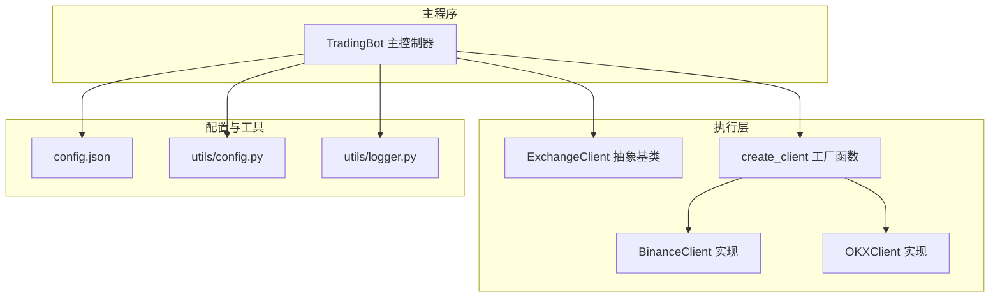
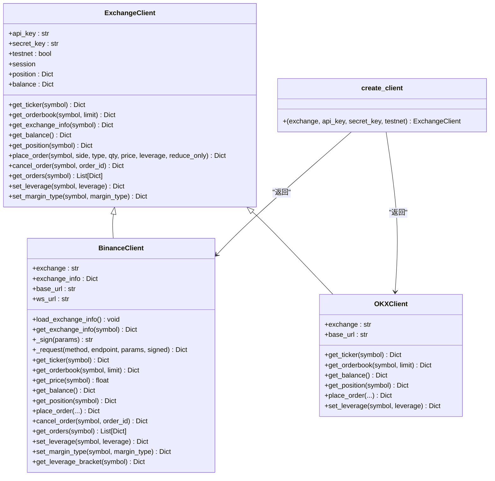
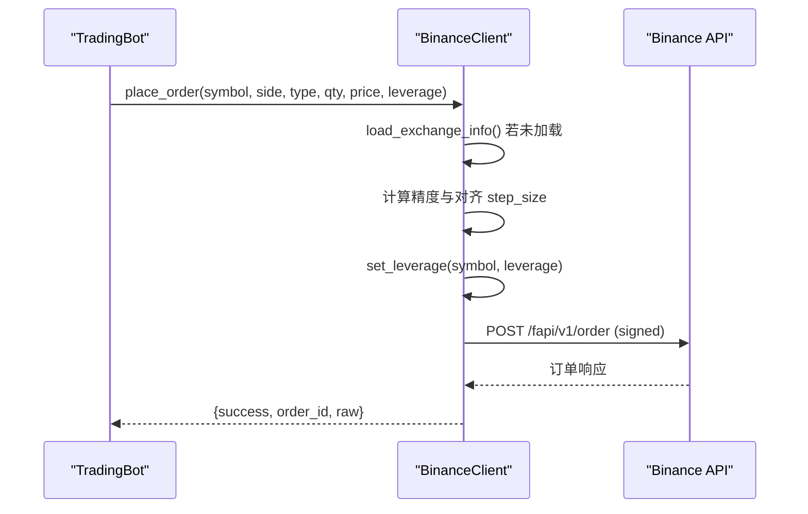
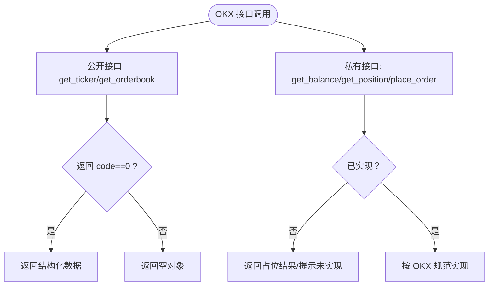
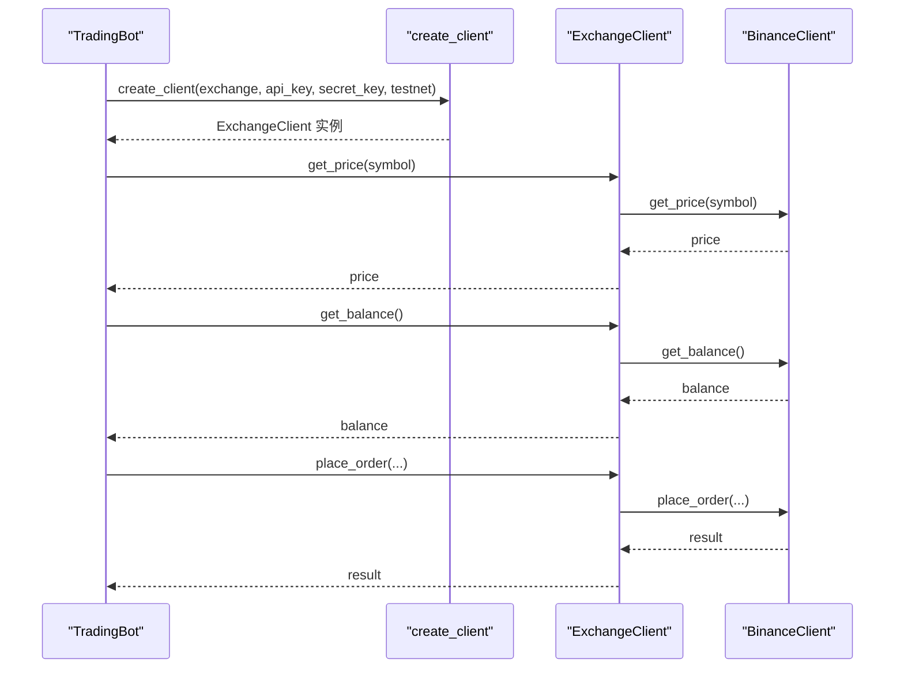
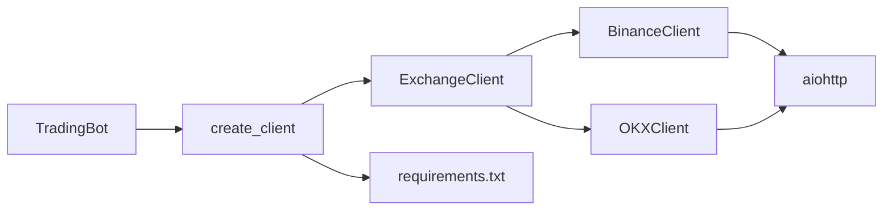

# 交易所客户端

<cite>
**本文引用的文件**
- [exchange_client.py](file://src/execution/exchange_client.py)
- [binance.py](file://src/data/binance.py)
- [okx.py](file://src/data/okx.py)
- [order.py](file://src/execution/order.py)
- [retry.py](file://src/execution/retry.py)
- [config.json](file://configs/config.json)
- [trading_bot.py](file://src/trading_bot.py)
- [config.py](file://src/utils/config.py)
- [logger.py](file://src/utils/logger.py)
- [requirements.txt](file://requirements.txt)
</cite>

## 目录
1. [简介](#简介)
2. [项目结构](#项目结构)
3. [核心组件](#核心组件)
4. [架构总览](#架构总览)
5. [详细组件分析](#详细组件分析)
6. [依赖关系分析](#依赖关系分析)
7. [性能考量](#性能考量)
8. [故障排查指南](#故障排查指南)
9. [结论](#结论)
10. [附录](#附录)

## 简介
本文件面向量化交易系统的“交易所客户端”模块，聚焦于以下目标：
- 深入解析 ExchangeClient 抽象基类的设计与职责边界
- 详解 BinanceClient 的实现细节，包括 API 签名、认证流程、交易规则加载与精度处理
- 对比 OKXClient 的实现现状与与 Binance 的差异
- 文档化工厂函数 create_client 的用法与参数配置
- 提供初始化、获取市场数据与执行交易的示例路径
- 说明测试网与正式网的区别、不同交易所 API 差异与兼容性注意事项
- 总结异常处理最佳实践与性能优化建议

## 项目结构
与交易所客户端直接相关的核心文件与职责如下：
- src/execution/exchange_client.py：抽象基类与具体交易所客户端实现（BinanceClient、OKXClient）、工厂函数
- src/data/binance.py、src/data/okx.py：数据侧的简单占位类（与执行侧客户端同名但职责不同）
- src/execution/order.py、src/execution/retry.py：订单与重试相关扩展点
- src/trading_bot.py：主程序中对客户端的集成与调用
- configs/config.json：运行配置样例（含 exchange、testnet、symbols 等）
- src/utils/config.py、src/utils/logger.py：配置校验与日志工具
- requirements.txt：第三方依赖清单（包含 aiohttp、ccxt 等）

图表来源
- [exchange_client.py](file://src/execution/exchange_client.py#L20-L85)
- [exchange_client.py](file://src/execution/exchange_client.py#L87-L343)
- [exchange_client.py](file://src/execution/exchange_client.py#L345-L400)
- [exchange_client.py](file://src/execution/exchange_client.py#L402-L411)
- [trading_bot.py](file://src/trading_bot.py#L19-L81)
- [config.json](file://configs/config.json#L1-L28)
- [config.py](file://src/utils/config.py#L8-L37)
- [logger.py](file://src/utils/logger.py#L12-L28)

章节来源
- [exchange_client.py](file://src/execution/exchange_client.py#L20-L85)
- [exchange_client.py](file://src/execution/exchange_client.py#L87-L343)
- [exchange_client.py](file://src/execution/exchange_client.py#L345-L400)
- [exchange_client.py](file://src/execution/exchange_client.py#L402-L411)
- [trading_bot.py](file://src/trading_bot.py#L19-L81)
- [config.json](file://configs/config.json#L1-L28)
- [config.py](file://src/utils/config.py#L8-L37)
- [logger.py](file://src/utils/logger.py#L12-L28)

## 核心组件
- ExchangeClient 抽象基类：定义统一的行情与交易接口契约，封装会话管理与通用错误处理
- BinanceClient：Binance 合约交易客户端，实现签名、认证、交易规则加载与精度处理
- OKXClient：OKX 合约交易客户端，当前实现为占位，部分接口未完全实现
- create_client 工厂函数：根据配置动态创建具体交易所客户端实例
- TradingBot：主控制器，负责初始化客户端并驱动交易流程

章节来源
- [exchange_client.py](file://src/execution/exchange_client.py#L20-L85)
- [exchange_client.py](file://src/execution/exchange_client.py#L87-L343)
- [exchange_client.py](file://src/execution/exchange_client.py#L345-L400)
- [exchange_client.py](file://src/execution/exchange_client.py#L402-L411)
- [trading_bot.py](file://src/trading_bot.py#L63-L91)

## 架构总览
下图展示了客户端抽象层、具体实现与主控制器之间的交互关系，以及工厂函数在其中的作用。

图表来源
- [exchange_client.py](file://src/execution/exchange_client.py#L20-L85)
- [exchange_client.py](file://src/execution/exchange_client.py#L87-L343)
- [exchange_client.py](file://src/execution/exchange_client.py#L345-L400)
- [exchange_client.py](file://src/execution/exchange_client.py#L402-L411)

## 详细组件分析

### ExchangeClient 抽象基类
- 设计要点
  - 统一的异步接口：行情（ticker、orderbook）、账户（balance、position）、交易（下单、撤单、活跃单、杠杆、保证金模式）
  - 会话管理：惰性创建 aiohttp.ClientSession，支持关闭释放资源
  - 错误处理：统一的超时配置；子类在请求中抛出明确的运行时错误
- 关键属性与方法
  - 属性：api_key、secret_key、testnet、session、position、balance、_timeout
  - 方法：_get_session、close、get_ticker、get_orderbook、get_exchange_info、get_balance、get_position、place_order、cancel_order、get_orders、set_leverage、set_margin_type

章节来源
- [exchange_client.py](file://src/execution/exchange_client.py#L20-L85)

### BinanceClient 实现
- 测试网与正式网
  - 测试网：base_url 与 ws_url 指向测试环境
  - 正式网：base_url 与 ws_url 指向生产环境
- 交易规则加载与精度处理
  - load_exchange_info：拉取 exchangeInfo，解析 quantityPrecision、pricePrecision、minQty、stepSize，并缓存到 exchange_info
  - place_order：针对市价单进行动态精度处理，按 step_size 对齐数量，并按 quantity_precision 四舍五入
- 认证与签名
  - _sign：使用 HMAC-SHA256 对 query_string 进行签名
  - _request：自动注入 X-MBX-APIKEY 头，附加 timestamp 与 signature；对非 2xx 或 code 非 0 的响应抛出运行时错误
- 账户与仓位
  - get_balance：解析账户资产中的 USDT 余额，更新内部缓存
  - get_position：解析 positionRisk，填充 amount、entry_price、unrealized_pnl、leverage、margin
- 杠杆与保证金模式
  - set_leverage、set_margin_type：分别设置杠杆与保证金模式（逐仓/全仓）
- 接口差异
  - get_ticker/get_orderbook：使用 Binance Futures API v1
  - get_price：从 ticker 中提取 lastPrice

图表来源
- [exchange_client.py](file://src/execution/exchange_client.py#L226-L275)
- [exchange_client.py](file://src/execution/exchange_client.py#L302-L318)
- [exchange_client.py](file://src/execution/exchange_client.py#L136-L171)

章节来源
- [exchange_client.py](file://src/execution/exchange_client.py#L87-L343)

### OKXClient 实现
- 当前状态
  - get_ticker、get_orderbook：实现公开接口，返回结构化数据
  - get_balance、get_position、place_order：当前返回占位结果，尚未实现完整签名与业务逻辑
- 接口差异
  - OKX 使用 REST v5 接口，返回 code 字段标识成功与否
  - 与 Binance 的认证、下单、杠杆设置流程存在显著差异

图表来源
- [exchange_client.py](file://src/execution/exchange_client.py#L345-L400)

章节来源
- [exchange_client.py](file://src/execution/exchange_client.py#L345-L400)

### 工厂函数 create_client
- 参数
  - exchange：支持 "binance"、"okx"
  - api_key、secret_key：API 凭据
  - testnet：是否使用测试网
- 行为
  - 根据 exchange 返回对应客户端实例
  - 不支持的交易所抛出 ValueError

章节来源
- [exchange_client.py](file://src/execution/exchange_client.py#L402-L411)

### 在 TradingBot 中的集成与使用
- 初始化
  - 从配置读取 exchange、testnet、api_key、secret_key
  - 通过 create_client 创建客户端实例
- 执行流程
  - 获取价格与账户余额
  - 计算仓位大小并执行市价单
  - 持仓检查与风控止盈止损

图表来源
- [trading_bot.py](file://src/trading_bot.py#L75-L81)
- [trading_bot.py](file://src/trading_bot.py#L127-L152)
- [exchange_client.py](file://src/execution/exchange_client.py#L402-L411)

章节来源
- [trading_bot.py](file://src/trading_bot.py#L63-L91)
- [trading_bot.py](file://src/trading_bot.py#L127-L152)

## 依赖关系分析
- 第三方依赖
  - aiohttp：异步 HTTP 客户端，用于 REST 请求
  - websockets：WebSocket 客户端（BinanceClient 内部字段存在，但未在实现中使用）
  - ccxt：统一交易所接口（在依赖清单中，但当前客户端实现未使用）
- 与主程序耦合
  - TradingBot 通过 create_client 注入 ExchangeClient，解耦具体交易所实现
  - 配置校验由 utils/config.py 提供，确保 exchange、symbols、strategy 等字段合法

图表来源
- [requirements.txt](file://requirements.txt#L4-L5)
- [requirements.txt](file://requirements.txt#L34)
- [exchange_client.py](file://src/execution/exchange_client.py#L402-L411)
- [trading_bot.py](file://src/trading_bot.py#L63-L91)

章节来源
- [requirements.txt](file://requirements.txt#L4-L5)
- [requirements.txt](file://requirements.txt#L34)
- [config.py](file://src/utils/config.py#L8-L37)

## 性能考量
- 会话复用
  - ExchangeClient 内部使用惰性创建的 aiohttp.ClientSession，避免重复握手开销
- 超时配置
  - REQUEST_TIMEOUT 统一设置 total 与 connect 超时，防止长时间阻塞
- 并发与批量
  - TradingBot 在获取 OHLCV 与 ticker 时采用 asyncio.gather 并行请求，提升数据获取效率
- 精度与对齐
  - BinanceClient 在市价单下单前按 step_size 对齐数量，减少无效请求与错误率

章节来源
- [exchange_client.py](file://src/execution/exchange_client.py#L16-L35)
- [exchange_client.py](file://src/execution/exchange_client.py#L241-L254)
- [trading_bot.py](file://src/trading_bot.py#L95-L99)

## 故障排查指南
- 常见错误与定位
  - Binance API 错误：当响应中包含 code 非 0 时抛出运行时错误，需检查参数与权限
  - 网络异常：aiohttp.ClientError 包装为 RuntimeError，检查网络连通性与代理设置
  - 未实现接口：OKXClient 部分接口返回占位结果，需按规范完善签名与业务逻辑
- 日志与异常
  - 使用统一 Logger 输出异常堆栈，便于定位问题
  - TradingBot 在主循环中捕获异常并延时重试，避免进程崩溃
- 配置校验
  - utils/config.py 校验 exchange、symbols、strategy、风险参数范围等，提前发现配置错误

章节来源
- [exchange_client.py](file://src/execution/exchange_client.py#L165-L170)
- [logger.py](file://src/utils/logger.py#L31-L34)
- [config.py](file://src/utils/config.py#L15-L37)
- [trading_bot.py](file://src/trading_bot.py#L280-L282)

## 结论
- ExchangeClient 抽象层清晰地定义了跨交易所的一致接口，便于扩展与替换
- BinanceClient 提供了完整的签名、认证、规则加载与精度处理能力，适合作为生产级实现参考
- OKXClient 当前处于占位阶段，后续应补齐签名与业务逻辑，以实现与 Binance 的对等能力
- 工厂函数 create_client 与 TradingBot 的集成体现了良好的解耦设计，便于在不同交易所间切换

## 附录

### 使用示例（代码片段路径）
- 初始化客户端
  - [trading_bot.py](file://src/trading_bot.py#L75-L81)
- 获取市场数据
  - [trading_bot.py](file://src/trading_bot.py#L92-L99)
- 执行交易
  - [trading_bot.py](file://src/trading_bot.py#L146-L152)
  - [trading_bot.py](file://src/trading_bot.py#L165-L171)
  - [trading_bot.py](file://src/trading_bot.py#L186-L192)

### 测试网与正式网区别
- BinanceClient
  - 测试网：base_url 与 ws_url 指向测试环境
  - 正式网：base_url 与 ws_url 指向生产环境
- OKXClient
  - 当前仅实现公开接口，未区分测试网/正式网

章节来源
- [exchange_client.py](file://src/execution/exchange_client.py#L94-L99)
- [exchange_client.py](file://src/execution/exchange_client.py#L354-L370)

### 不同交易所 API 差异与兼容性
- 认证方式
  - Binance：X-MBX-APIKEY + HMAC-SHA256 签名
  - OKX：当前未实现签名逻辑（需按 OKX 规范补充）
- 接口命名与返回结构
  - Binance Futures v1：/fapi/v1/*，返回字段包含 code/msg
  - OKX REST v5：/api/v5/*，返回字段包含 code/data
- 交易规则
  - Binance：通过 exchangeInfo 获取 quantityPrecision、pricePrecision、minQty、stepSize
  - OKX：需另行查询或缓存相应规则

章节来源
- [exchange_client.py](file://src/execution/exchange_client.py#L147-L151)
- [exchange_client.py](file://src/execution/exchange_client.py#L104-L121)
- [exchange_client.py](file://src/execution/exchange_client.py#L354-L370)

### 异常处理最佳实践
- 明确错误类型：区分网络错误与业务错误，前者包装为 RuntimeError，后者依据交易所返回码处理
- 统一日志：使用统一 Logger 记录异常堆栈，便于排查
- 配置前置校验：在启动前校验 exchange、symbols、strategy 等关键配置
- 优雅降级：在无 API Key 场景下，返回安全的默认值（如 get_balance 返回默认结构）

章节来源
- [exchange_client.py](file://src/execution/exchange_client.py#L165-L170)
- [logger.py](file://src/utils/logger.py#L31-L34)
- [config.py](file://src/utils/config.py#L15-L37)
- [exchange_client.py](file://src/execution/exchange_client.py#L189-L194)

### 性能优化建议
- 复用会话：保持 aiohttp.ClientSession 生命周期，避免频繁创建销毁
- 并行请求：在获取多个数据源时使用 asyncio.gather
- 精度对齐：在下单前按 step_size 对齐数量，减少无效请求
- 缓存规则：将 exchangeInfo 缓存至内存，减少重复拉取

章节来源
- [exchange_client.py](file://src/execution/exchange_client.py#L32-L35)
- [exchange_client.py](file://src/execution/exchange_client.py#L101-L121)
- [exchange_client.py](file://src/execution/exchange_client.py#L241-L254)
- [trading_bot.py](file://src/trading_bot.py#L95-L99)