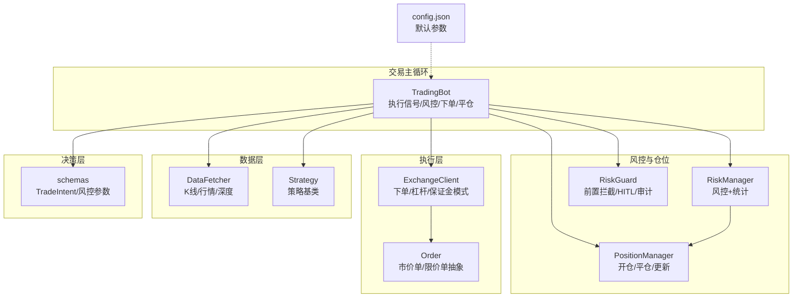
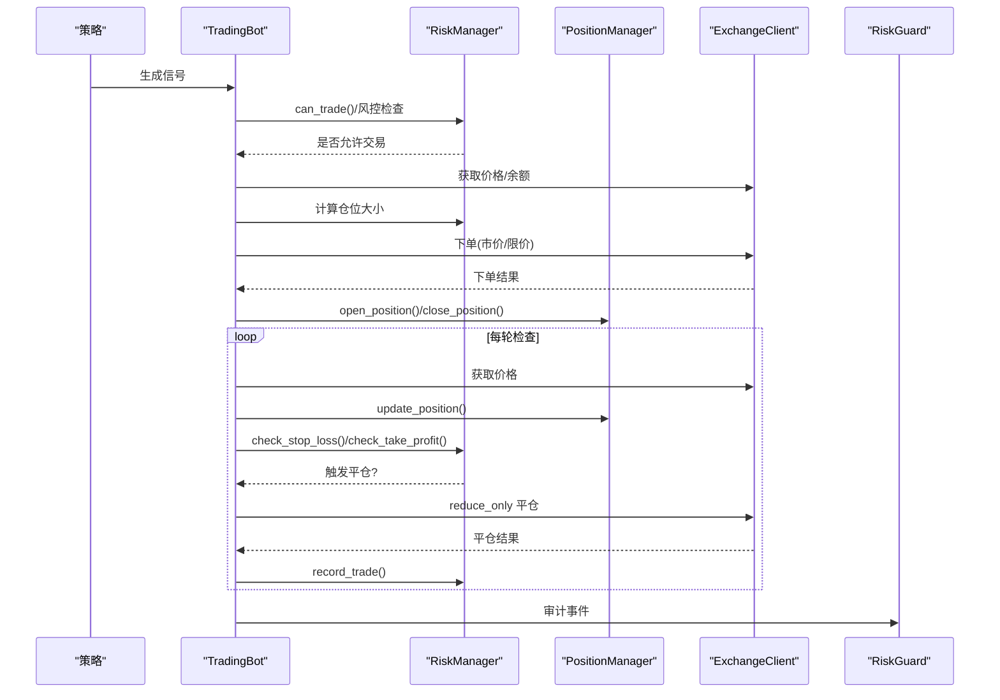
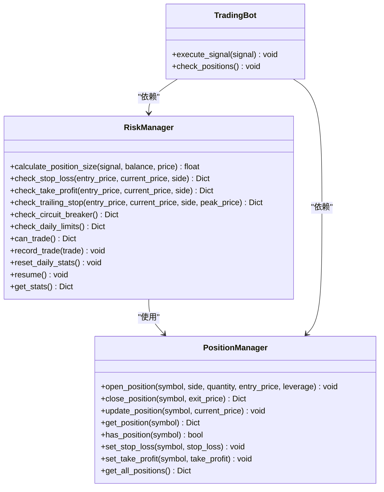
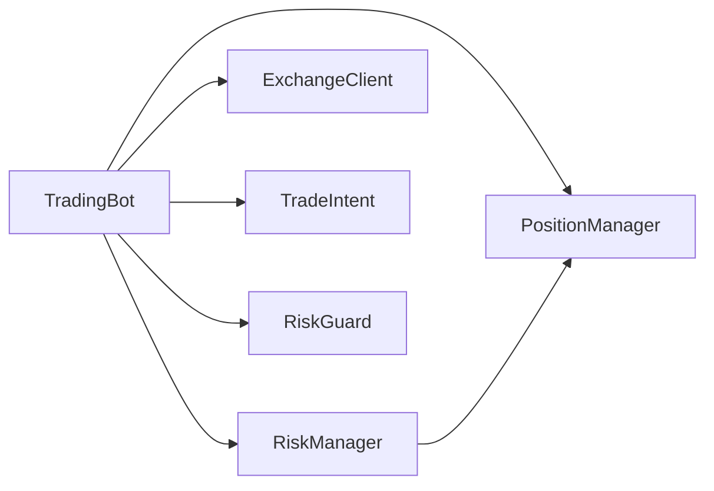

# 仓位管理

<cite>
**本文引用的文件列表**
- [trading_bot.py](file://src/trading_bot.py)
- [risk_manager.py](file://src/utils/risk_manager.py)
- [risk_guard.py](file://src/aetherlife/guard/risk_guard.py)
- [exchange_client.py](file://src/execution/exchange_client.py)
- [order.py](file://src/execution/order.py)
- [schemas.py](file://src/aetherlife/cognition/schemas.py)
- [config.json](file://configs/config.json)
- [data_fetcher.py](file://src/data/data_fetcher.py)
- [base.py](file://src/strategies/base.py)
</cite>

## 目录
1. [引言](#引言)
2. [项目结构](#项目结构)
3. [核心组件](#核心组件)
4. [架构总览](#架构总览)
5. [详细组件分析](#详细组件分析)
6. [依赖关系分析](#依赖关系分析)
7. [性能与内存优化](#性能与内存优化)
8. [故障排查指南](#故障排查指南)
9. [结论](#结论)
10. [附录](#附录)

## 引言
本文件面向量化交易系统的“仓位管理”模块，系统化阐述仓位数据结构、计算公式与会计准则、风控与动态风险控制、仓位调整机制（开仓/加仓/减仓/强制平仓）、与订单系统的集成、历史与回测支持、跨交易所统一管理与风险对冲思路，以及性能与内存优化建议。文档同时提供可视化图示与路径级引用，便于快速定位实现位置与进行二次开发。

## 项目结构
围绕仓位管理的关键模块与文件如下：
- 交易主循环与策略执行：[trading_bot.py](file://src/trading_bot.py)
- 风控与仓位管理：[risk_manager.py](file://src/utils/risk_manager.py)
- 守护层（风控前置）：[risk_guard.py](file://src/aetherlife/guard/risk_guard.py)
- 交易所客户端与下单/杠杆/保证金模式：[exchange_client.py](file://src/execution/exchange_client.py)
- 订单抽象与执行：[order.py](file://src/execution/order.py)
- 决策意图与风控参数：[schemas.py](file://src/aetherlife/cognition/schemas.py)
- 配置与默认参数：[config.json](file://configs/config.json)
- 数据获取与实时行情：[data_fetcher.py](file://src/data/data_fetcher.py)
- 策略基类：[base.py](file://src/strategies/base.py)

图表来源
- [trading_bot.py](file://src/trading_bot.py#L27-L283)
- [risk_manager.py](file://src/utils/risk_manager.py#L12-L387)
- [risk_guard.py](file://src/aetherlife/guard/risk_guard.py#L23-L84)
- [exchange_client.py](file://src/execution/exchange_client.py#L20-L432)
- [order.py](file://src/execution/order.py#L1-L26)
- [schemas.py](file://src/aetherlife/cognition/schemas.py#L32-L62)
- [config.json](file://configs/config.json#L1-L28)
- [data_fetcher.py](file://src/data/data_fetcher.py#L17-L434)
- [base.py](file://src/strategies/base.py#L6-L31)

章节来源
- [trading_bot.py](file://src/trading_bot.py#L27-L283)
- [risk_manager.py](file://src/utils/risk_manager.py#L12-L387)
- [exchange_client.py](file://src/execution/exchange_client.py#L20-L432)
- [config.json](file://configs/config.json#L1-L28)

## 核心组件
- 风控管理器（RiskManager）：负责最大仓位比例、止损止盈阈值、熔断与单日限制、交易统计与暂停/恢复。
- 仓位管理器（PositionManager）：负责开仓、平仓、更新浮动盈亏、设置止损止盈、查询与汇总。
- 交易机器人（TradingBot）：策略生成信号、风控检查、下单、平仓、记录交易与统计。
- 交易所客户端（ExchangeClient/BinanceClient/OKXClient）：下单、查询余额/仓位、设置杠杆与保证金模式。
- 决策意图（TradeIntent）：携带风控参数（止盈/止损比例）与执行参数（订单类型/限价）。
- 守护层（RiskGuard）：前置拦截、大额人工确认（HITL）、审计日志。

章节来源
- [risk_manager.py](file://src/utils/risk_manager.py#L12-L387)
- [trading_bot.py](file://src/trading_bot.py#L27-L283)
- [exchange_client.py](file://src/execution/exchange_client.py#L20-L432)
- [schemas.py](file://src/aetherlife/cognition/schemas.py#L32-L62)
- [risk_guard.py](file://src/aetherlife/guard/risk_guard.py#L23-L84)

## 架构总览
下图展示从策略到执行、风控与仓位管理的端到端流程。

图表来源
- [trading_bot.py](file://src/trading_bot.py#L101-L254)
- [risk_manager.py](file://src/utils/risk_manager.py#L175-L241)
- [exchange_client.py](file://src/execution/exchange_client.py#L226-L301)
- [risk_guard.py](file://src/aetherlife/guard/risk_guard.py#L48-L84)

## 详细组件分析

### 仓位数据结构与会计准则
- 字段定义
  - symbol：交易对标识
  - side：方向（LONG/SHORT）
  - quantity：数量
  - entry_price：开仓成交均价
  - current_price：最新价格（用于浮动盈亏）
  - leverage：杠杆倍数
  - pnl/pnl_pct：浮动盈亏与百分比
  - open_time/close_time：开仓/平仓时间
  - stop_loss/take_profit：用户设置的风控价格
- 会计准则
  - 浮动盈亏：多头按 (current_price - entry_price) × quantity；空头按 (entry_price - current_price) × quantity
  - 盈亏百分比：pnl / (entry_price × quantity) × 100
  - 平仓时计算实际盈亏并记录到历史

章节来源
- [risk_manager.py](file://src/utils/risk_manager.py#L244-L339)

### 仓位计算公式与参数
- 仓位大小 = min(最大可用资金 × 最大仓位比例, 最大可用资金 × 信号强度 / 当前价格)；并受最小/最大单次仓位约束
- 风控参数
  - 最大仓位比例、最小/最大单次仓位比例
  - 止损/止盈/追踪止损阈值
  - 单日最大亏损/交易次数/连续亏损限制
  - 熔断阈值与冷却时间

章节来源
- [risk_manager.py](file://src/utils/risk_manager.py#L62-L71)
- [config.json](file://configs/config.json#L15-L20)

### 逐仓与全仓模式
- 逐仓（Isolated）：仅用保证金进行该交易对的风险控制，爆仓风险隔离
- 全仓（Crossed）：账户整体权益作为风险控制基础
- 在 BinanceClient 中通过 marginType 接口设置逐仓/全仓
- 本系统在下单时默认使用全仓模式（positionSide=BOTH），如需逐仓请在下单前调用 set_margin_type

章节来源
- [exchange_client.py](file://src/execution/exchange_client.py#L320-L336)
- [exchange_client.py](file://src/execution/exchange_client.py#L234-L235)

### 仓位调整机制
- 开仓：根据信号与风控计算数量，下单并 open_position
- 加仓：当前无仓时才允许开仓；如需在同方向上增加头寸，可在风控允许范围内重复开仓（注意保证金与强平风险）
- 减仓/平仓：根据风控触发或策略信号，以 reduce_only 方式平仓
- 强制平仓：由交易所风控触发（强平），系统侧通过查询仓位与价格进行监控与记录

章节来源
- [trading_bot.py](file://src/trading_bot.py#L143-L204)
- [risk_manager.py](file://src/utils/risk_manager.py#L268-L299)

### 动态风险控制与强平预警
- 止损：按方向计算损失百分比，达到阈值即触发
- 止盈：按方向计算收益百分比，达到阈值即触发
- 追踪止损：在盈利超过一定阈值后，随最高点移动止损价
- 熔断：当日累计亏损超过阈值进入熔断暂停
- 单日限制：交易次数、连续亏损次数上限
- 强平预警：通过查询仓位与保证金，结合价格波动进行预警（系统中通过风控检查与日统计实现）

章节来源
- [risk_manager.py](file://src/utils/risk_manager.py#L73-L127)
- [risk_manager.py](file://src/utils/risk_manager.py#L129-L153)
- [risk_manager.py](file://src/utils/risk_manager.py#L155-L173)

### 仓位查询、调整与监控操作（路径级示例）
- 查询当前仓位
  - [get_position(symbol)](file://src/utils/risk_manager.py#L318-L320)
  - [has_position(symbol)](file://src/utils/risk_manager.py#L322-L324)
- 更新浮动盈亏
  - [update_position(symbol, current_price)](file://src/utils/risk_manager.py#L301-L317)
- 设置止损/止盈
  - [set_stop_loss(symbol, price)](file://src/utils/risk_manager.py#L326-L329)
  - [set_take_profit(symbol, price)](file://src/utils/risk_manager.py#L331-L334)
- 获取所有仓位
  - [get_all_positions()](file://src/utils/risk_manager.py#L336-L338)
- 平仓并记录交易
  - [close_position(symbol, exit_price)](file://src/utils/risk_manager.py#L268-L299)
  - [record_trade(trade)](file://src/utils/risk_manager.py#L196-L216)

章节来源
- [risk_manager.py](file://src/utils/risk_manager.py#L244-L339)

### 与订单系统的集成
- 下单
  - 市价单/限价单抽象：[place_limit_order(), 市价单类](file://src/execution/order.py#L4-L25)
  - BinanceClient 下单：[place_order(...)](file://src/execution/exchange_client.py#L226-L275)
  - 杠杆设置：[set_leverage(...)](file://src/execution/exchange_client.py#L302-L318)
  - 保证金模式：[set_margin_type(...)](file://src/execution/exchange_client.py#L320-L336)
- 订单填充后的仓位更新
  - TradingBot 在下单成功后立即 open_position，并在每轮循环中 update_position 与风控检查
  - 平仓时 close_position 并 record_trade

章节来源
- [order.py](file://src/execution/order.py#L1-L26)
- [exchange_client.py](file://src/execution/exchange_client.py#L226-L336)
- [trading_bot.py](file://src/trading_bot.py#L143-L204)

### 仓位历史记录与回测支持
- 交易历史：使用固定长度队列保存最近 N 笔交易，便于回测与复盘
- 日统计：每日盈亏、胜/负次数、连续亏损次数、暂停状态
- 回测建议：可基于历史队列与 OHLCV 数据重放信号与风控逻辑，验证策略稳定性

章节来源
- [risk_manager.py](file://src/utils/risk_manager.py#L51-L51)
- [risk_manager.py](file://src/utils/risk_manager.py#L196-L241)

### 跨交易所的仓位统一管理与风险对冲
- 统一管理：通过 ExchangeClient 抽象，BinanceClient/OKXClient 提供一致接口，便于在不同交易所间切换
- 风险对冲：可通过多市场 Agent 生成跨市场信号（Lead-Lag），在不同市场建立反向头寸以降低系统性风险
- 对冲策略：建议在不同市场/币种间建立互补头寸，利用相关性与波动率差异进行对冲

章节来源
- [exchange_client.py](file://src/execution/exchange_client.py#L403-L411)
- [data_fetcher.py](file://src/data/data_fetcher.py#L400-L408)
- [agent_cross_market.py](file://src/aetherlife/cognition/agent_cross_market.py#L16-L116)

### 代码级类关系图（仓位与风控）

图表来源
- [risk_manager.py](file://src/utils/risk_manager.py#L12-L387)
- [trading_bot.py](file://src/trading_bot.py#L115-L254)

## 依赖关系分析
- TradingBot 依赖 RiskManager 与 PositionManager 进行风控与仓位管理
- RiskManager 依赖 PositionManager 进行仓位状态维护
- ExchangeClient 提供下单、查询、设置杠杆与保证金模式
- schemas 中的 TradeIntent 支持在决策阶段注入风控参数
- RiskGuard 作为前置拦截与审计，贯穿交易生命周期

图表来源
- [trading_bot.py](file://src/trading_bot.py#L27-L283)
- [risk_manager.py](file://src/utils/risk_manager.py#L12-L387)
- [exchange_client.py](file://src/execution/exchange_client.py#L20-L432)
- [schemas.py](file://src/aetherlife/cognition/schemas.py#L32-L62)
- [risk_guard.py](file://src/aetherlife/guard/risk_guard.py#L23-L84)

章节来源
- [trading_bot.py](file://src/trading_bot.py#L27-L283)
- [risk_manager.py](file://src/utils/risk_manager.py#L12-L387)
- [exchange_client.py](file://src/execution/exchange_client.py#L20-L432)
- [schemas.py](file://src/aetherlife/cognition/schemas.py#L32-L62)
- [risk_guard.py](file://src/aetherlife/guard/risk_guard.py#L23-L84)

## 性能与内存优化
- 仓位存储
  - 使用字典按 symbol 存储，查询/更新 O(1)，适合高频轮询
  - 建议对历史队列使用固定容量的双端队列，避免无限增长
- 计算优化
  - 浮动盈亏仅在轮询时更新，避免在每次下单后重复计算
  - 将风控阈值与统计变量缓存于内存，减少重复 IO
- 并发与网络
  - 交易所请求使用异步会话与超时控制，避免阻塞
  - 通过 gather 并行获取 K 线与 ticker，缩短主循环等待
- 内存管理
  - 定期清理历史队列与价格缓存，防止内存泄漏
  - 对于长周期回测，建议分批读取与落盘，避免一次性加载全部数据

章节来源
- [risk_manager.py](file://src/utils/risk_manager.py#L51-L51)
- [trading_bot.py](file://src/trading_bot.py#L95-L99)
- [exchange_client.py](file://src/execution/exchange_client.py#L32-L40)

## 故障排查指南
- 下单失败
  - 检查 ExchangeClient 的请求返回与错误码
  - 确认最小下单量与步进精度（BinanceClient 已自动处理）
- 仓位未更新
  - 确认每轮循环调用了 update_position
  - 检查价格获取是否成功
- 触发熔断/暂停
  - 查看 RiskManager 的 can_trade 返回原因
  - 检查日统计与连续亏损计数
- 审计与人工确认
  - RiskGuard 支持 HITL 与审计日志，便于事后追溯

章节来源
- [exchange_client.py](file://src/execution/exchange_client.py#L165-L170)
- [risk_manager.py](file://src/utils/risk_manager.py#L175-L194)
- [risk_guard.py](file://src/aetherlife/guard/risk_guard.py#L70-L84)

## 结论
本系统通过清晰的职责分离实现了完整的仓位管理闭环：策略生成信号、风控前置拦截、订单执行、仓位更新与动态风控。系统支持逐仓/全仓模式、熔断与单日限制、止损止盈与追踪止损，并提供历史与审计能力。建议在生产环境中结合跨市场对冲与严格的内存/并发控制，持续优化性能与稳定性。

## 附录
- 配置参考
  - 默认配置与风险参数：[config.json](file://configs/config.json#L15-L20)
- 策略基类
  - 策略接口与参数：[base.py](file://src/strategies/base.py#L6-L31)
- 数据获取
  - K线/行情/深度与 WebSocket 订阅：[data_fetcher.py](file://src/data/data_fetcher.py#L17-L434)