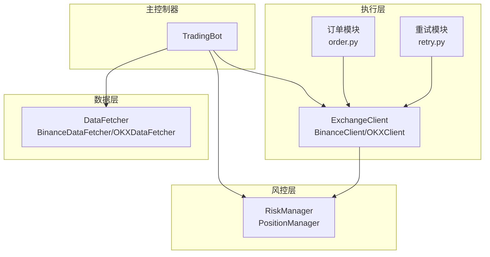
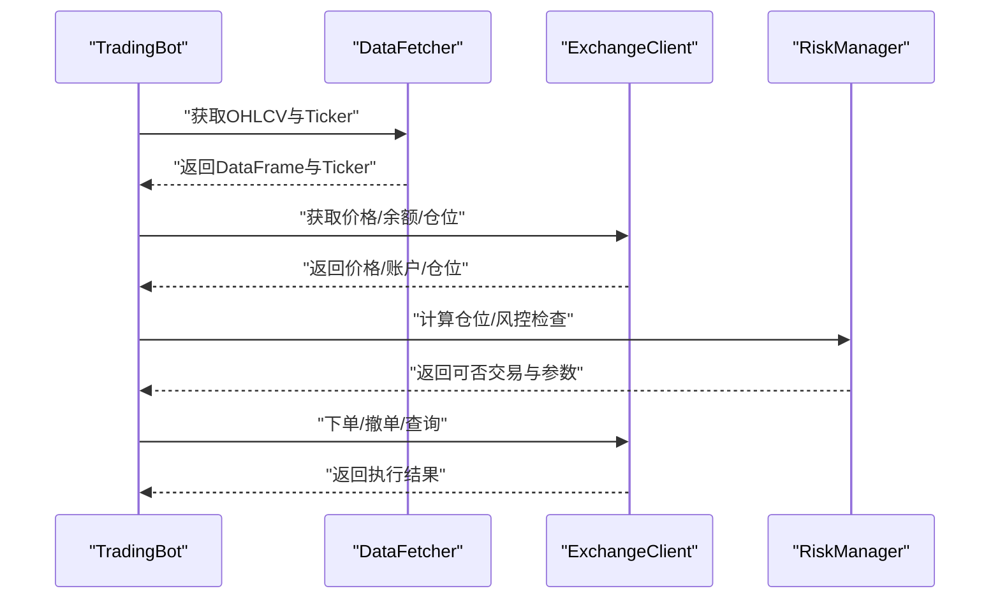
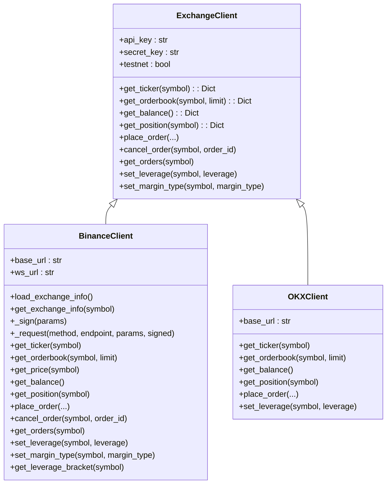
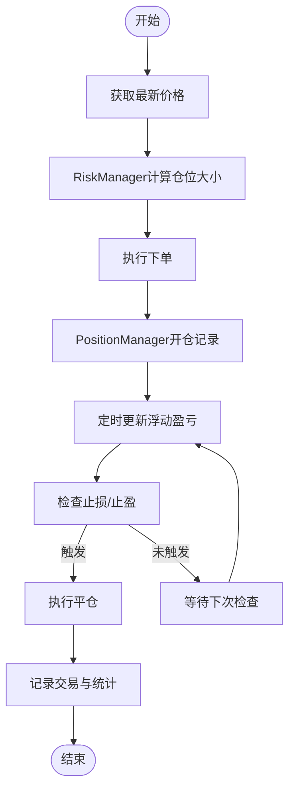
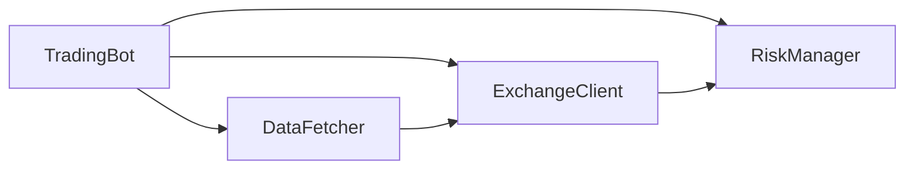

# 执行引擎

<cite>
**本文引用的文件**
- [src/execution/exchange_client.py](file://src/execution/exchange_client.py)
- [src/execution/order.py](file://src/execution/order.py)
- [src/execution/retry.py](file://src/execution/retry.py)
- [src/utils/risk_manager.py](file://src/utils/risk_manager.py)
- [src/trading_bot.py](file://src/trading_bot.py)
- [src/data/data_fetcher.py](file://src/data/data_fetcher.py)
- [configs/config.json](file://configs/config.json)
- [docs/交易所配置.md](file://docs/交易所配置.md)
</cite>

## 目录
1. [简介](#简介)
2. [项目结构](#项目结构)
3. [核心组件](#核心组件)
4. [架构总览](#架构总览)
5. [组件详解](#组件详解)
6. [依赖关系分析](#依赖关系分析)
7. [性能与延迟优化](#性能与延迟优化)
8. [故障排查指南](#故障排查指南)
9. [结论](#结论)
10. [附录](#附录)

## 简介
本文件面向量化交易系统的“执行引擎”，聚焦于交易所客户端设计、API封装、请求处理与响应解析；订单管理系统（生命周期、状态跟踪、批量操作）；重试机制（指数退避、错误分类、熔断保护）；仓位管理（头寸计算、风控与动态调整）；以及与不同交易所的集成差异与兼容性考量。同时提供可直接定位到源码路径的使用模式与扩展建议，帮助开发者快速落地与定制。

## 项目结构
执行引擎位于 src/execution 目录，配合风控模块 src/utils/risk_manager.py、数据层 src/data/data_fetcher.py、以及主控制器 src/trading_bot.py 组成闭环。配置通过 configs/config.json 与 docs/交易所配置.md 提供。

图表来源
- [src/execution/exchange_client.py](file://src/execution/exchange_client.py#L20-L85)
- [src/utils/risk_manager.py](file://src/utils/risk_manager.py#L12-L242)
- [src/data/data_fetcher.py](file://src/data/data_fetcher.py#L17-L71)
- [src/trading_bot.py](file://src/trading_bot.py#L27-L91)

章节来源
- [src/execution/exchange_client.py](file://src/execution/exchange_client.py#L1-L432)
- [src/utils/risk_manager.py](file://src/utils/risk_manager.py#L1-L388)
- [src/data/data_fetcher.py](file://src/data/data_fetcher.py#L1-L434)
- [src/trading_bot.py](file://src/trading_bot.py#L1-L346)
- [configs/config.json](file://configs/config.json#L1-L28)
- [docs/交易所配置.md](file://docs/交易所配置.md#L1-L32)

## 核心组件
- 交易所客户端：抽象基类与具体实现（Binance/OKX），负责行情、交易、账户、杠杆与保证金模式等API封装。
- 订单模块：定义订单类型与执行接口，支撑市价单等策略执行。
- 重试模块：为撤单等关键动作提供重试能力（占位，待实现）。
- 风控与仓位：RiskManager 提供熔断、日限额、止损止盈、追踪止损；PositionManager 管理开仓/平仓、浮动盈亏与止盈止损设置。
- 主控制器：TradingBot 将数据、策略、执行、风控串联，驱动主循环。

章节来源
- [src/execution/exchange_client.py](file://src/execution/exchange_client.py#L20-L85)
- [src/execution/order.py](file://src/execution/order.py#L1-L26)
- [src/execution/retry.py](file://src/execution/retry.py#L1-L6)
- [src/utils/risk_manager.py](file://src/utils/risk_manager.py#L12-L242)
- [src/trading_bot.py](file://src/trading_bot.py#L27-L91)

## 架构总览
执行引擎采用“异步HTTP + WebSocket”的双通道架构：数据层通过 WebSocket 实时推送行情/订单簿，执行层通过异步HTTP调用交易所REST API进行下单/撤单/查询。风控模块贯穿下单前后的决策与监控。

图表来源
- [src/trading_bot.py](file://src/trading_bot.py#L92-L205)
- [src/data/data_fetcher.py](file://src/data/data_fetcher.py#L85-L142)
- [src/execution/exchange_client.py](file://src/execution/exchange_client.py#L136-L171)
- [src/utils/risk_manager.py](file://src/utils/risk_manager.py#L62-L194)

## 组件详解

### 交易所客户端设计与实现
- 抽象基类 ExchangeClient：统一定义行情、交易、账户、杠杆与保证金模式等接口，便于扩展新交易所。
- BinanceClient：实现REST与WebSocket接口，包含签名、请求封装、错误处理、精度处理、杠杆设置、保证金模式设置等。
- OKXClient：提供基础接口占位，部分方法尚未实现，便于后续扩展。
- 便捷工厂 create_client：按配置选择具体交易所客户端。

图表来源
- [src/execution/exchange_client.py](file://src/execution/exchange_client.py#L20-L85)
- [src/execution/exchange_client.py](file://src/execution/exchange_client.py#L87-L342)
- [src/execution/exchange_client.py](file://src/execution/exchange_client.py#L345-L400)

章节来源
- [src/execution/exchange_client.py](file://src/execution/exchange_client.py#L20-L85)
- [src/execution/exchange_client.py](file://src/execution/exchange_client.py#L87-L342)
- [src/execution/exchange_client.py](file://src/execution/exchange_client.py#L345-L400)

### API封装、请求处理与响应解析
- 异步会话与超时：统一使用 aiohttp.ClientTimeout 控制连接与总超时，避免阻塞。
- 签名与认证：Binance 使用 HMAC SHA256 签名，附加 X-MBX-APIKEY 头部；OKX 接口目前未签名（占位）。
- 错误处理：REST响应中以“code”字段判断错误；WebSocket连接心跳与异常关闭处理在数据层实现。
- 精度与步进：Binance 加载交易对规则，按 LOT_SIZE 的 stepSize 对下单数量做规整，避免下单失败。
- 杠杆与保证金模式：下单前设置杠杆，支持全仓/逐仓模式切换。

章节来源
- [src/execution/exchange_client.py](file://src/execution/exchange_client.py#L16-L35)
- [src/execution/exchange_client.py](file://src/execution/exchange_client.py#L128-L171)
- [src/execution/exchange_client.py](file://src/execution/exchange_client.py#L242-L264)
- [src/execution/exchange_client.py](file://src/execution/exchange_client.py#L302-L336)

### 订单管理系统：生命周期、状态跟踪与批量操作
- 订单类型：提供市价单类与限价单函数占位，便于扩展。
- 生命周期：下单—>活跃—>成交/部分成交—>归档；执行引擎通过 get_orders 与 get_position 跟踪状态。
- 批量操作：通过 get_orders 获取活跃单列表，结合 cancel_order 实现批量撤单；通过 reduce_only 实现平仓。
- 与风控联动：下单前由 RiskManager 计算仓位大小，下单后 PositionManager 记录开仓，平仓后统计盈亏。

章节来源
- [src/execution/order.py](file://src/execution/order.py#L1-L26)
- [src/execution/exchange_client.py](file://src/execution/exchange_client.py#L292-L300)
- [src/execution/exchange_client.py](file://src/execution/exchange_client.py#L277-L290)
- [src/utils/risk_manager.py](file://src/utils/risk_manager.py#L244-L339)
- [src/trading_bot.py](file://src/trading_bot.py#L115-L205)

### 重试机制：指数退避、错误分类与熔断保护
- 指数退避：建议对撤单等关键动作采用指数退避重试，结合错误分类（网络错误、限流、业务错误）决定是否重试。
- 错误分类：区分瞬时错误（网络波动、交易所限流）与永久错误（参数错误、风控拦截），避免无效重试。
- 熔断保护：当风控模块触发熔断（如单日亏损达到阈值），系统暂停交易，冷却后再恢复。
- 现状说明：重试模块当前为占位，可在 cancel_with_retry 中实现具体逻辑。

章节来源
- [src/execution/retry.py](file://src/execution/retry.py#L1-L6)
- [src/utils/risk_manager.py](file://src/utils/risk_manager.py#L129-L153)
- [src/utils/risk_manager.py](file://src/utils/risk_manager.py#L175-L194)

### 仓位管理：头寸计算、风险控制与动态调整
- 头寸计算：根据账户余额、最大仓位比例与信号强度计算下单数量，同时考虑最小/最大仓位与价格。
- 风险控制：止损（固定/追踪）、止盈、单日交易次数、连续亏损次数、熔断冷却。
- 动态调整：根据最新价格更新浮动盈亏；触发止损/止盈后自动平仓并记录交易。

图表来源
- [src/trading_bot.py](file://src/trading_bot.py#L206-L254)
- [src/utils/risk_manager.py](file://src/utils/risk_manager.py#L62-L128)
- [src/utils/risk_manager.py](file://src/utils/risk_manager.py#L244-L339)

章节来源
- [src/utils/risk_manager.py](file://src/utils/risk_manager.py#L12-L242)
- [src/utils/risk_manager.py](file://src/utils/risk_manager.py#L244-L339)
- [src/trading_bot.py](file://src/trading_bot.py#L206-L254)

### 与不同交易所的集成差异与兼容性
- Binance：支持REST与WebSocket，具备完整下单、撤单、查询、杠杆与保证金模式设置；数据层与执行层均提供Binance实现。
- OKX：数据层与执行层均有OKX实现，但执行层部分接口占位，需后续完善签名与下单逻辑。
- 兼容性：通过工厂方法 create_client/create_data_fetcher 按配置选择具体实现，保持接口一致。

章节来源
- [src/execution/exchange_client.py](file://src/execution/exchange_client.py#L403-L410)
- [src/data/data_fetcher.py](file://src/data/data_fetcher.py#L400-L407)
- [docs/交易所配置.md](file://docs/交易所配置.md#L1-L32)

### 使用模式与代码示例（路径指引）
- 订单提交（市价单）：参考 TradingBot 执行信号流程中的下单调用路径。
  - [下单入口](file://src/trading_bot.py#L146-L160)
  - [下单实现（Binance）](file://src/execution/exchange_client.py#L226-L275)
- 订单取消（占位）：参考重试模块占位函数路径。
  - [重试占位](file://src/execution/retry.py#L4-L5)
- 订单查询：参考 TradingBot 检查仓位时的查询路径。
  - [查询活跃单](file://src/execution/exchange_client.py#L292-L300)
- 查询价格/余额/仓位：参考 TradingBot 的调用路径。
  - [获取价格](file://src/execution/exchange_client.py#L181-L184)
  - [获取余额](file://src/execution/exchange_client.py#L187-L204)
  - [获取仓位](file://src/execution/exchange_client.py#L206-L224)
- 风控与仓位联动：参考 TradingBot 的风控检查与记录路径。
  - [风控检查](file://src/trading_bot.py#L121-L124)
  - [记录交易](file://src/trading_bot.py#L199-L204)

章节来源
- [src/trading_bot.py](file://src/trading_bot.py#L115-L205)
- [src/execution/exchange_client.py](file://src/execution/exchange_client.py#L181-L224)
- [src/execution/exchange_client.py](file://src/execution/exchange_client.py#L292-L300)
- [src/execution/retry.py](file://src/execution/retry.py#L1-L6)

## 依赖关系分析
- TradingBot 依赖 DataFetcher 与 ExchangeClient 获取数据与执行交易，依赖 RiskManager 与 PositionManager 进行风控与仓位管理。
- ExchangeClient 与 DataFetcher 均提供 Binance/OKX 实现，通过工厂方法解耦。
- 风控模块独立于交易所实现，便于跨平台复用。

图表来源
- [src/trading_bot.py](file://src/trading_bot.py#L14-L22)
- [src/data/data_fetcher.py](file://src/data/data_fetcher.py#L17-L71)
- [src/execution/exchange_client.py](file://src/execution/exchange_client.py#L20-L85)

章节来源
- [src/trading_bot.py](file://src/trading_bot.py#L14-L22)
- [src/data/data_fetcher.py](file://src/data/data_fetcher.py#L17-L71)
- [src/execution/exchange_client.py](file://src/execution/exchange_client.py#L20-L85)

## 性能与延迟优化
- 并行获取：主循环中并行获取OHLCV与Ticker，缩短单轮等待时间。
- 异步I/O：统一使用 aiohttp 异步HTTP与WebSocket，降低阻塞。
- 精度规整：下单前按交易所规则规整数量，减少失败重试。
- 熔断与限流：风控模块内置熔断与日限额，避免极端行情下进一步扩大损失。
- 扩展建议：引入连接池、请求合并、缓存常用规则、限流与退避策略，进一步提升吞吐量与稳定性。

章节来源
- [src/trading_bot.py](file://src/trading_bot.py#L95-L98)
- [src/execution/exchange_client.py](file://src/execution/exchange_client.py#L16-L35)
- [src/utils/risk_manager.py](file://src/utils/risk_manager.py#L129-L194)

## 故障排查指南
- API错误：REST响应中“code”非0或异常抛出，检查签名、参数与权限。
  - [错误处理（Binance）](file://src/execution/exchange_client.py#L165-L170)
- WebSocket异常：心跳丢失或连接关闭，检查网络与交易所服务状态。
  - [WebSocket订阅（Binance）](file://src/data/data_fetcher.py#L188-L211)
  - [WebSocket订阅（OKX）](file://src/data/data_fetcher.py#L327-L359)
- 杠杆与保证金模式：下单前确认已设置杠杆与保证金模式。
  - [设置杠杆](file://src/execution/exchange_client.py#L302-L318)
  - [设置保证金模式](file://src/execution/exchange_client.py#L320-L336)
- 风控熔断：当触发熔断时暂停交易，等待冷却后恢复。
  - [熔断检查](file://src/utils/risk_manager.py#L129-L153)
- 配置问题：确认API Key、交易对、时间周期与策略配置正确。
  - [默认配置](file://src/trading_bot.py#L300-L320)
  - [用户配置](file://configs/config.json#L1-L28)
  - [交易所配置说明](file://docs/交易所配置.md#L1-L32)

章节来源
- [src/execution/exchange_client.py](file://src/execution/exchange_client.py#L165-L170)
- [src/data/data_fetcher.py](file://src/data/data_fetcher.py#L188-L211)
- [src/data/data_fetcher.py](file://src/data/data_fetcher.py#L327-L359)
- [src/utils/risk_manager.py](file://src/utils/risk_manager.py#L129-L153)
- [src/trading_bot.py](file://src/trading_bot.py#L300-L320)
- [configs/config.json](file://configs/config.json#L1-L28)
- [docs/交易所配置.md](file://docs/交易所配置.md#L1-L32)

## 结论
本执行引擎以异步架构为核心，通过抽象化的交易所客户端与工厂模式实现多交易所兼容；结合风控与仓位管理，形成从信号到执行的闭环。当前Binance实现较为完整，OKX处于扩展阶段。建议尽快完善OKX执行接口与重试机制，以提升系统整体鲁棒性与可用性。

## 附录
- 配置项参考
  - 交易所、测试网、交易对、时间周期、杠杆、策略与风控参数
  - [默认配置](file://src/trading_bot.py#L300-L320)
  - [用户配置](file://configs/config.json#L1-L28)
- 交易所安全配置
  - API Key权限与环境变量注入
  - [交易所配置说明](file://docs/交易所配置.md#L1-L32)