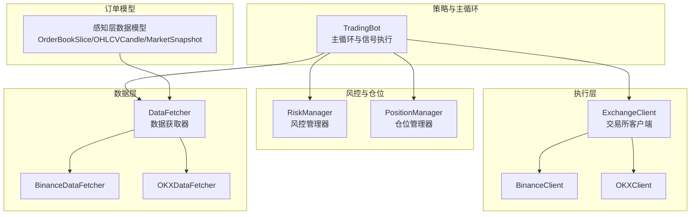
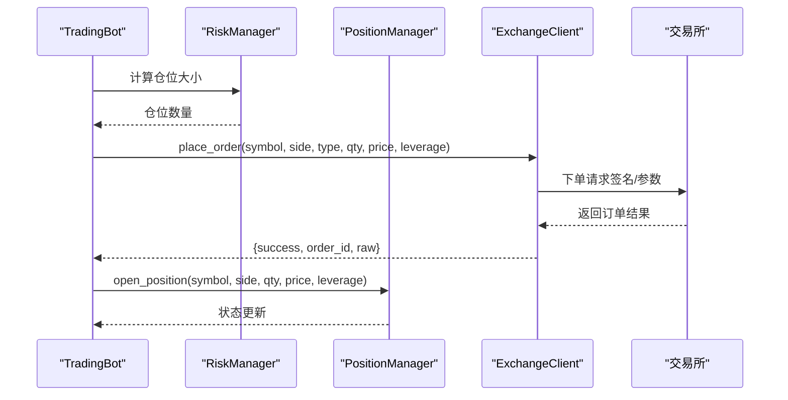
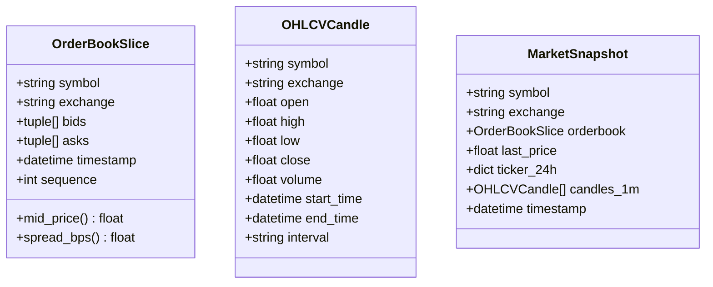
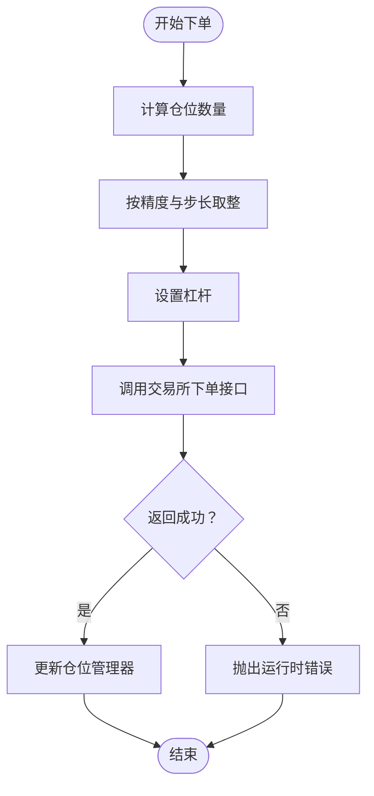
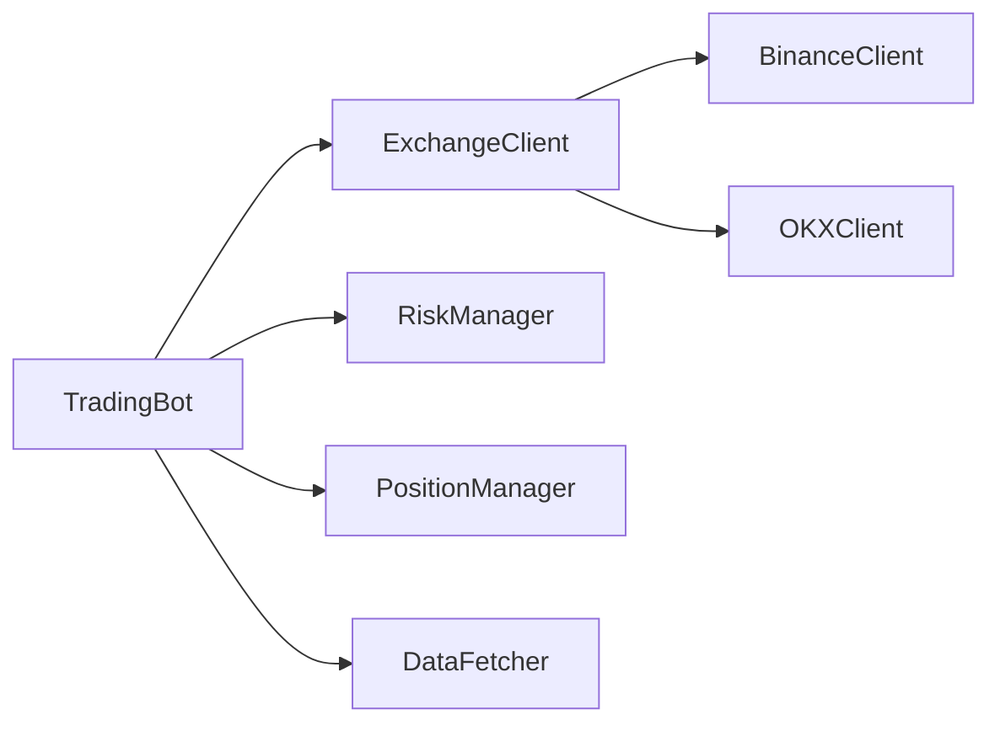

# 订单管理系统

<cite>
**本文引用的文件**
- [src/execution/exchange_client.py](file://src/execution/exchange_client.py)
- [src/execution/order.py](file://src/execution/order.py)
- [src/execution/retry.py](file://src/execution/retry.py)
- [src/trading_bot.py](file://src/trading_bot.py)
- [src/utils/risk_manager.py](file://src/utils/risk_manager.py)
- [src/data/data_fetcher.py](file://src/data/data_fetcher.py)
- [src/aetherlife/perception/models.py](file://src/aetherlife/perception/models.py)
- [configs/config.json](file://configs/config.json)
</cite>

## 目录
1. [简介](#简介)
2. [项目结构](#项目结构)
3. [核心组件](#核心组件)
4. [架构总览](#架构总览)
5. [详细组件分析](#详细组件分析)
6. [依赖关系分析](#依赖关系分析)
7. [性能考量](#性能考量)
8. [故障排查指南](#故障排查指南)
9. [结论](#结论)
10. [附录](#附录)

## 简介
本文件面向量化交易系统的订单管理子系统，聚焦于订单数据模型、订单创建流程、状态跟踪、批量操作、持久化与缓存策略、执行确认与重复检测、与交易所API的交互模式以及最佳实践与常见问题。当前仓库中的订单管理能力主要由执行层的交易所客户端与风控/仓位管理器协同实现，订单数据模型以统一感知层的数据结构形式存在，部分订单相关逻辑以占位或待实现的形式出现。

## 项目结构
围绕订单管理的关键模块分布如下：
- 执行层：交易所客户端封装下单、撤单、查询等交易接口，负责与Binance/OKX等交易所对接
- 风控与仓位：风控管理器与仓位管理器负责下单前的风险控制、仓位计算与状态维护
- 数据层：数据获取器提供K线、行情、订单簿等数据，支撑策略与风控决策
- 订单模型：统一的感知层数据模型用于跨交易所的数据抽象
- 配置：系统默认配置与风险参数配置

图表来源
- [src/trading_bot.py](file://src/trading_bot.py#L27-L288)
- [src/execution/exchange_client.py](file://src/execution/exchange_client.py#L20-L85)
- [src/utils/risk_manager.py](file://src/utils/risk_manager.py#L12-L242)
- [src/data/data_fetcher.py](file://src/data/data_fetcher.py#L17-L71)
- [src/aetherlife/perception/models.py](file://src/aetherlife/perception/models.py#L15-L64)

章节来源
- [src/trading_bot.py](file://src/trading_bot.py#L27-L288)
- [src/execution/exchange_client.py](file://src/execution/exchange_client.py#L20-L85)
- [src/utils/risk_manager.py](file://src/utils/risk_manager.py#L12-L242)
- [src/data/data_fetcher.py](file://src/data/data_fetcher.py#L17-L71)
- [src/aetherlife/perception/models.py](file://src/aetherlife/perception/models.py#L15-L64)

## 核心组件
- 交易所客户端（ExchangeClient/BinanceClient/OKXClient）
  - 提供下单、撤单、查询活跃订单、获取账户/仓位、设置杠杆/保证金模式等接口
  - 统一签名、请求超时、错误处理与返回结构
- 风控与仓位管理
  - RiskManager：仓位规模计算、止损止盈检查、熔断与日限额检查、交易统计
  - PositionManager：开仓/平仓、浮动盈亏更新、仓位查询与状态维护
- 数据获取器
  - DataFetcher及其Binance/OKX实现：提供K线、行情、订单簿、资金费率等数据
- 订单数据模型
  - OrderBookSlice/OHLCVCandle/MarketSnapshot：统一多交易所数据格式
- 订单相关占位实现
  - order.py中的市价单类与place_limit_order函数目前为空实现，作为后续扩展入口
  - retry.py中的cancel_with_retry函数为空实现，用于后续撤单重试策略

章节来源
- [src/execution/exchange_client.py](file://src/execution/exchange_client.py#L20-L85)
- [src/utils/risk_manager.py](file://src/utils/risk_manager.py#L12-L242)
- [src/data/data_fetcher.py](file://src/data/data_fetcher.py#L17-L71)
- [src/aetherlife/perception/models.py](file://src/aetherlife/perception/models.py#L15-L64)
- [src/execution/order.py](file://src/execution/order.py#L1-L26)
- [src/execution/retry.py](file://src/execution/retry.py#L1-L6)

## 架构总览
订单管理在系统中的位置与交互如下：

图表来源
- [src/trading_bot.py](file://src/trading_bot.py#L135-L161)
- [src/utils/risk_manager.py](file://src/utils/risk_manager.py#L62-L72)
- [src/execution/exchange_client.py](file://src/execution/exchange_client.py#L226-L275)
- [src/utils/risk_manager.py](file://src/utils/risk_manager.py#L244-L339)

## 详细组件分析

### 1) 订单数据模型与生命周期
- 订单簿快照（OrderBookSlice）
  - 字段：symbol、exchange、bids、asks、timestamp、sequence
  - 方法：mid_price、spread_bps
- K线（OHLCVCandle）
  - 字段：symbol、exchange、open、high、low、close、volume、start_time、end_time、interval
- 市场快照（MarketSnapshot）
  - 字段：symbol、exchange、orderbook、last_price、ticker_24h、candles_1m、timestamp
- 生命周期与状态
  - 该模型用于感知层数据抽象，不直接承载订单状态字段；订单状态由执行层返回与风控/仓位管理器维护

图表来源
- [src/aetherlife/perception/models.py](file://src/aetherlife/perception/models.py#L15-L64)

章节来源
- [src/aetherlife/perception/models.py](file://src/aetherlife/perception/models.py#L15-L64)

### 2) 订单创建流程（下单）
- 参数验证与格式转换
  - 仓位计算：RiskManager根据信号强度、账户余额与价格计算最大允许仓位，并裁剪至最小/最大仓位范围
  - 数量精度：BinanceClient在市价单时按交易对精度与步长进行取整
  - 杠杆设置：下单前调用set_leverage确保杠杆生效
- 错误处理
  - 交易所返回非2xx或特定错误码时抛出异常
  - 会话超时与连接错误捕获并转换为可识别的运行时错误
- 返回结构
  - 统一返回包含success、order_id、symbol、side、price、quantity、status与原始响应的字典

图表来源
- [src/utils/risk_manager.py](file://src/utils/risk_manager.py#L62-L72)
- [src/execution/exchange_client.py](file://src/execution/exchange_client.py#L226-L275)
- [src/utils/risk_manager.py](file://src/utils/risk_manager.py#L244-L339)

章节来源
- [src/utils/risk_manager.py](file://src/utils/risk_manager.py#L62-L72)
- [src/execution/exchange_client.py](file://src/execution/exchange_client.py#L226-L275)
- [src/utils/risk_manager.py](file://src/utils/risk_manager.py#L244-L339)

### 3) 订单状态跟踪与回调
- 状态跟踪
  - 仓位管理器维护每个交易对的开仓/平仓状态、浮动盈亏、止损止盈目标等
  - 风控管理器记录每日交易统计、连败次数、熔断状态
- 回调处理
  - 数据层提供实时行情与订单簿的WebSocket订阅回调，便于在UI或日志中观察订单簿变化
  - 订单簿回调示例路径：[订阅订单簿回调](file://src/data/data_fetcher.py#L213-L234)

章节来源
- [src/utils/risk_manager.py](file://src/utils/risk_manager.py#L244-L339)
- [src/data/data_fetcher.py](file://src/data/data_fetcher.py#L213-L234)

### 4) 批量订单操作
- 批量下单/取消/查询
  - 当前仓库未提供批量下单/取消/查询的具体实现
  - 可通过并发调用下单/撤单接口并聚合结果的方式实现批量功能
  - 建议结合任务队列与幂等性设计，确保重复请求不会产生重复订单

章节来源
- [src/execution/exchange_client.py](file://src/execution/exchange_client.py#L64-L84)

### 5) 订单持久化与内存缓存
- 持久化
  - 代码库未提供订单持久化存储实现
  - 建议将订单状态与交易历史写入数据库或本地文件，配合唯一订单ID与时间戳索引
- 内存缓存
  - DataCache占位类存在但未实际使用
  - 建议在内存中缓存最近N笔订单与活跃订单列表，结合LRU策略提升查询效率

章节来源
- [src/data/cache.py](file://src/data/cache.py#L1-L7)

### 6) 订单执行确认与重复检测
- 执行确认
  - 通过get_orders或交易所WebSocket推送确认订单状态变更
- 重复检测
  - 建议在应用层引入“去重键”（如请求ID/业务ID），在下单前检查是否已有相同去重键的未完成订单
  - 交易所侧通常以订单ID为主键，应用层应保证请求ID的全局唯一性

章节来源
- [src/execution/exchange_client.py](file://src/execution/exchange_client.py#L74-L84)

### 7) 与交易所API的交互模式
- 接口契约
  - 统一的下单/撤单/查询接口，支持签名参数与错误码处理
- 响应处理
  - 规范化返回结构，包含success、order_id、symbol、side、price、quantity、status与原始响应
- 速率限制与超时
  - 统一的请求超时配置，避免长时间挂起

章节来源
- [src/execution/exchange_client.py](file://src/execution/exchange_client.py#L20-L85)

### 8) 具体操作示例（代码路径）
- 创建市价单（占位）
  - [市价单类定义](file://src/execution/order.py#L13-L25)
- 创建限价单（占位）
  - [限价单函数定义](file://src/execution/order.py#L4-L5)
- 撤单重试（占位）
  - [撤单重试函数定义](file://src/execution/retry.py#L4-L5)
- 下单（主循环集成）
  - [下单与开仓流程](file://src/trading_bot.py#L145-L161)
- 查询活跃订单
  - [查询活跃订单接口](file://src/execution/exchange_client.py#L74-L84)
- 订阅订单簿回调
  - [订单簿回调示例](file://src/data/data_fetcher.py#L213-L234)

章节来源
- [src/execution/order.py](file://src/execution/order.py#L1-L26)
- [src/execution/retry.py](file://src/execution/retry.py#L1-L6)
- [src/trading_bot.py](file://src/trading_bot.py#L145-L161)
- [src/execution/exchange_client.py](file://src/execution/exchange_client.py#L74-L84)
- [src/data/data_fetcher.py](file://src/data/data_fetcher.py#L213-L234)

## 依赖关系分析
- TradingBot依赖ExchangeClient进行下单/撤单，依赖RiskManager进行仓位计算与风控，依赖PositionManager进行仓位状态维护
- ExchangeClient提供BinanceClient/OKXClient实现，分别对接不同交易所
- DataFetcher提供统一的数据访问接口，支撑策略与风控决策

图表来源
- [src/trading_bot.py](file://src/trading_bot.py#L27-L91)
- [src/execution/exchange_client.py](file://src/execution/exchange_client.py#L20-L85)

章节来源
- [src/trading_bot.py](file://src/trading_bot.py#L27-L91)
- [src/execution/exchange_client.py](file://src/execution/exchange_client.py#L20-L85)

## 性能考量
- 并发与批处理
  - 使用异步并发调用多个交易所接口，减少等待时间
- 缓存策略
  - 对高频查询（如账户余额、仓位、订单簿）采用内存缓存，设置合理TTL
- 精度与步长
  - 下单数量严格遵循交易所精度与步长，避免因舍入导致的错误
- 超时与重试
  - 统一请求超时，对网络波动与临时错误采用指数退避重试

## 故障排查指南
- 常见错误
  - 交易所返回错误码：检查返回结构中的code/msg字段，定位具体原因
  - 网络异常：确认会话状态与超时配置，必要时重建会话
- 日志与监控
  - 在下单、撤单、查询环节增加日志输出，记录关键参数与返回结果
- 风控拦截
  - 若can_trade返回should_stop为真，检查熔断、日限额与连败次数

章节来源
- [src/execution/exchange_client.py](file://src/execution/exchange_client.py#L165-L171)
- [src/utils/risk_manager.py](file://src/utils/risk_manager.py#L175-L194)

## 结论
当前仓库的订单管理以执行层与风控/仓位管理为核心，实现了下单、撤单、仓位管理与风控检查的基础能力。订单数据模型通过感知层统一抽象，便于跨交易所扩展。后续可在以下方面完善：补充批量订单操作、实现订单持久化与内存缓存、完善重复订单检测与去重键设计、扩展市价单与限价单的完整实现，并在主循环中集成更丰富的订单状态跟踪与回调处理。

## 附录
- 配置参考
  - 默认配置与风险参数：[默认配置](file://configs/config.json#L1-L28)
  - 风控参数：最大仓位比例、止损止盈阈值、日限额等

章节来源
- [configs/config.json](file://configs/config.json#L1-L28)