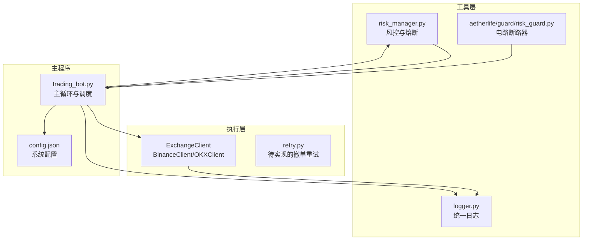
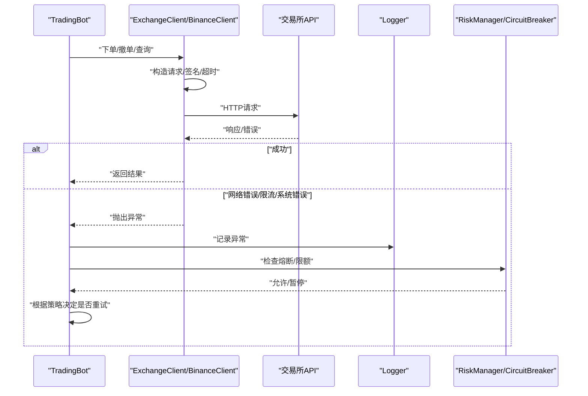
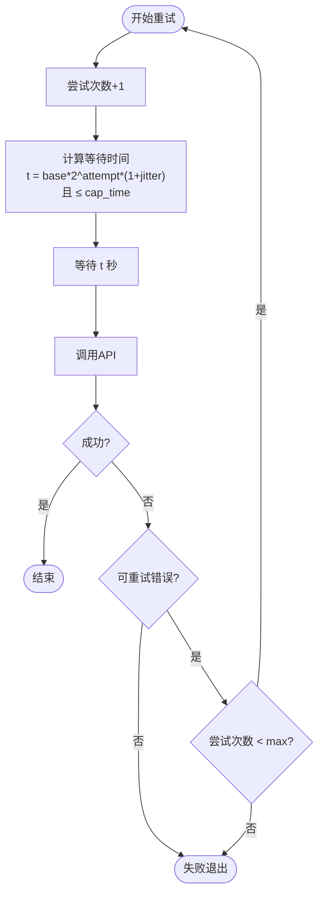
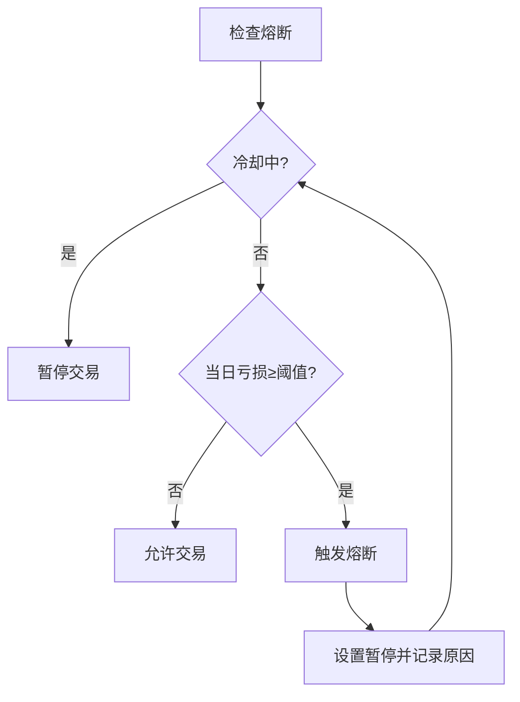
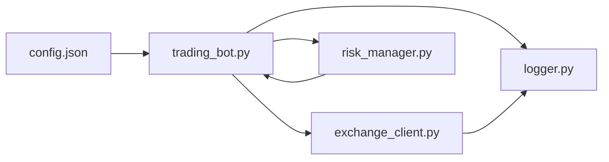

# 重试机制

<cite>
**本文引用的文件**
- [src/execution/retry.py](file://src/execution/retry.py)
- [src/execution/exchange_client.py](file://src/execution/exchange_client.py)
- [src/utils/logger.py](file://src/utils/logger.py)
- [src/utils/risk_manager.py](file://src/utils/risk_manager.py)
- [src/aetherlife/guard/risk_guard.py](file://src/aetherlife/guard/risk_guard.py)
- [src/trading_bot.py](file://src/trading_bot.py)
- [configs/config.json](file://configs/config.json)
</cite>

## 目录
1. [简介](#简介)
2. [项目结构](#项目结构)
3. [核心组件](#核心组件)
4. [架构总览](#架构总览)
5. [详细组件分析](#详细组件分析)
6. [依赖关系分析](#依赖关系分析)
7. [性能考量](#性能考量)
8. [故障排除指南](#故障排除指南)
9. [结论](#结论)
10. [附录](#附录)

## 简介
本文件面向量化交易系统的“重试机制”技术文档，目标是：
- 设计并解释重试策略的原理，包括指数退避算法的数学模型与参数配置建议
- 区分错误类型：网络错误、API限流、系统错误、业务错误，并给出差异化处理策略
- 文档化熔断保护机制：错误率阈值、时间窗口、恢复条件
- 说明重试上下文管理：重试次数限制、最大等待时间、超时处理
- 提供重试装饰器与自定义策略的实现思路与使用路径
- 结合异步编程与并发安全，确保在高并发下的稳定性
- 给出重试日志记录与监控指标收集方案
- 总结在不同网络环境下的表现与优化策略
- 提供最佳实践与故障排除指南

## 项目结构
本项目采用分层架构，执行层负责与交易所交互；工具层提供日志与风控；主程序驱动策略与执行。与重试机制直接相关的模块如下：
- 执行层：交易所客户端封装与下单/撤单等操作
- 工具层：统一日志、风控与熔断
- 主程序：调度与状态管理

图表来源
- [src/execution/exchange_client.py](file://src/execution/exchange_client.py#L1-L432)
- [src/execution/retry.py](file://src/execution/retry.py#L1-L6)
- [src/utils/logger.py](file://src/utils/logger.py#L1-L34)
- [src/utils/risk_manager.py](file://src/utils/risk_manager.py#L1-L200)
- [src/aetherlife/guard/risk_guard.py](file://src/aetherlife/guard/risk_guard.py#L1-L46)
- [src/trading_bot.py](file://src/trading_bot.py#L1-L200)
- [configs/config.json](file://configs/config.json#L1-L28)

章节来源
- [src/execution/exchange_client.py](file://src/execution/exchange_client.py#L1-L432)
- [src/execution/retry.py](file://src/execution/retry.py#L1-L6)
- [src/utils/logger.py](file://src/utils/logger.py#L1-L34)
- [src/utils/risk_manager.py](file://src/utils/risk_manager.py#L1-L200)
- [src/aetherlife/guard/risk_guard.py](file://src/aetherlife/guard/risk_guard.py#L1-L46)
- [src/trading_bot.py](file://src/trading_bot.py#L1-L200)
- [configs/config.json](file://configs/config.json#L1-L28)

## 核心组件
- 交易所客户端：封装HTTP请求、签名、错误解析与超时控制，提供下单、撤单、查询等接口
- 日志模块：统一输出格式，支持异常堆栈记录
- 风控模块：提供熔断检查、每日限额、连败限制等
- 主程序：在主循环中调用客户端执行交易，结合风控进行决策
- 配置文件：系统运行参数，包括风险阈值、策略参数等

章节来源
- [src/execution/exchange_client.py](file://src/execution/exchange_client.py#L1-L432)
- [src/utils/logger.py](file://src/utils/logger.py#L1-L34)
- [src/utils/risk_manager.py](file://src/utils/risk_manager.py#L1-L200)
- [src/trading_bot.py](file://src/trading_bot.py#L1-L200)
- [configs/config.json](file://configs/config.json#L1-L28)

## 架构总览
下图展示了从主程序到执行层、再到交易所的调用链，以及重试与熔断在其中的位置。

图表来源
- [src/trading_bot.py](file://src/trading_bot.py#L115-L200)
- [src/execution/exchange_client.py](file://src/execution/exchange_client.py#L136-L171)
- [src/utils/logger.py](file://src/utils/logger.py#L31-L33)
- [src/utils/risk_manager.py](file://src/utils/risk_manager.py#L129-L153)

## 详细组件分析

### 1) 指数退避与重试策略设计
- 数学模型
  - 等待时间 t = base_backoff * (1 + jitter) * 2^attempt
  - 其中 base_backoff 为基础退避时间，jitter 为抖动因子，attempt 为重试次数
  - 最终等待不超过 cap_time（最大等待时间）
- 参数配置建议
  - base_backoff：默认 0.1~1 秒
  - jitter：0~0.1（随机抖动，避免雪崩效应）
  - cap_time：默认 10~60 秒
  - max_attempts：默认 3~5 次
- 适用场景
  - 网络瞬时抖动、临时不可用
  - API限流（需结合限流窗口与速率）
- 不适用场景
  - 业务错误（如下单参数非法）应快速失败，不应重试

### 2) 错误分类与差异化处理
- 网络错误
  - 表现：连接超时、DNS解析失败、连接被拒绝
  - 处理：指数退避重试；必要时切换备用节点或代理
- API限流
  - 表现：HTTP 429、特定字段提示限流
  - 处理：遵守限流窗口，降低并发，增加等待时间
- 系统错误
  - 表现：服务内部错误、数据库不可用
  - 处理：指数退避；若持续失败，触发熔断
- 业务错误
  - 表现：下单参数非法、资金不足、风控拦截
  - 处理：快速失败，记录原因，不进行重试

章节来源
- [src/execution/exchange_client.py](file://src/execution/exchange_client.py#L165-L170)

### 3) 熔断保护机制
- 触发条件
  - 单日累计亏损达到熔断阈值（例如 -20%）
  - 冷却期（例如 1 小时）内不再检查
- 行为
  - 暂停交易，记录暂停原因
  - 在冷却期结束后恢复检查
- 与重试的关系
  - 熔断期间不应发起新的重试
  - 熔断解除后，重试策略可按常规执行

图表来源
- [src/utils/risk_manager.py](file://src/utils/risk_manager.py#L129-L153)

章节来源
- [src/utils/risk_manager.py](file://src/utils/risk_manager.py#L1-L200)
- [src/aetherlife/guard/risk_guard.py](file://src/aetherlife/guard/risk_guard.py#L1-L46)

### 4) 重试上下文管理
- 重试次数限制：防止无限重试导致资源耗尽
- 最大等待时间：避免过长等待影响系统响应
- 超时处理：结合HTTP超时与任务级超时，避免阻塞
- 上下文传递：在异步环境中通过任务队列或上下文对象传递重试状态

章节来源
- [src/execution/exchange_client.py](file://src/execution/exchange_client.py#L16-L17)

### 5) 重试装饰器与自定义策略
- 装饰器模式
  - 定义通用重试逻辑（指数退避、错误判定、熔断检查）
  - 对下单/撤单等关键方法进行装饰
- 自定义策略
  - 针对不同交易所或接口定制退避参数
  - 针对限流场景增加并发控制与队列

章节来源
- [src/execution/retry.py](file://src/execution/retry.py#L1-L6)

### 6) 异步编程与并发安全
- 异步调用：使用 asyncio.gather 并行获取数据，减少整体延迟
- 并发控制：使用信号量或限流器控制并发请求数
- 并发安全：重试状态与日志记录需线程/协程安全，避免竞态

章节来源
- [src/trading_bot.py](file://src/trading_bot.py#L92-L99)

### 7) 日志记录与监控指标
- 日志内容
  - 请求参数、响应状态、异常堆栈
  - 重试次数、等待时间、熔断状态
- 指标采集
  - 成功/失败次数、平均响应时间、熔断触发次数
  - 可对接Prometheus或日志平台进行可视化

章节来源
- [src/utils/logger.py](file://src/utils/logger.py#L1-L34)
- [src/trading_bot.py](file://src/trading_bot.py#L115-L200)

### 8) 不同网络环境下的表现与优化
- 低带宽/高延迟
  - 减少base_backoff，提高cap_time，避免频繁重试
  - 增加HTTP超时，合理设置连接池
- 高并发
  - 控制并发数，避免触发API限流
  - 使用指数退避+抖动，避免同时重试
- 限流场景
  - 识别限流响应，主动降速或排队
  - 分时段错峰重试

### 9) 代码示例与使用路径
- 重试装饰器使用路径
  - 在下单/撤单方法上应用装饰器，传入退避参数与错误判定函数
  - 在熔断期间禁用重试
- 自定义重试策略
  - 针对特定接口（如撤单）实现独立策略
  - 结合业务语义（如订单状态轮询）进行二次确认

章节来源
- [src/execution/retry.py](file://src/execution/retry.py#L1-L6)
- [src/execution/exchange_client.py](file://src/execution/exchange_client.py#L277-L290)

## 依赖关系分析
- 执行层依赖日志模块进行异常记录
- 主程序在执行信号时调用客户端，并受风控模块约束
- 风控模块提供熔断检查，影响是否允许重试
- 配置文件提供风险阈值与策略参数，间接影响重试策略

图表来源
- [src/trading_bot.py](file://src/trading_bot.py#L1-L200)
- [src/execution/exchange_client.py](file://src/execution/exchange_client.py#L1-L432)
- [src/utils/logger.py](file://src/utils/logger.py#L1-L34)
- [src/utils/risk_manager.py](file://src/utils/risk_manager.py#L1-L200)
- [configs/config.json](file://configs/config.json#L1-L28)

## 性能考量
- 退避参数与并发控制平衡：避免过度重试导致资源浪费
- 超时与熔断协同：在限流与错误时及时止损
- 日志与指标开销：采样记录，避免高频写入影响性能

## 故障排除指南
- 常见问题
  - 重试无效：检查错误类型是否属于可重试范围
  - 熔断误触发：核对阈值与冷却时间配置
  - 超时频繁：调整HTTP超时与退避参数
- 排查步骤
  - 查看日志中的异常堆栈与重试次数
  - 核对风控模块的熔断状态与暂停原因
  - 检查配置文件中的风险阈值与策略参数

章节来源
- [src/utils/logger.py](file://src/utils/logger.py#L31-L33)
- [src/utils/risk_manager.py](file://src/utils/risk_manager.py#L129-L153)
- [configs/config.json](file://configs/config.json#L15-L27)

## 结论
本项目在执行层提供了与交易所交互的基础能力，并在工具层具备熔断与风控能力。重试机制作为保障系统稳定性的关键环节，应在明确错误分类的基础上，采用指数退避策略，结合熔断与限流控制，确保在高并发与不稳定网络环境下仍能可靠运行。建议尽快完善重试装饰器与自定义策略，并配套完善的日志与监控体系。

## 附录
- 关键实现位置参考
  - 重试装饰器与策略：[src/execution/retry.py](file://src/execution/retry.py#L1-L6)
  - 交易所客户端与错误处理：[src/execution/exchange_client.py](file://src/execution/exchange_client.py#L136-L171)
  - 日志记录：[src/utils/logger.py](file://src/utils/logger.py#L1-L34)
  - 风控与熔断：[src/utils/risk_manager.py](file://src/utils/risk_manager.py#L129-L153)
  - 电路断路器：[src/aetherlife/guard/risk_guard.py](file://src/aetherlife/guard/risk_guard.py#L1-L46)
  - 主程序调度与风控检查：[src/trading_bot.py](file://src/trading_bot.py#L115-L200)
  - 配置参数：[configs/config.json](file://configs/config.json#L15-L27)