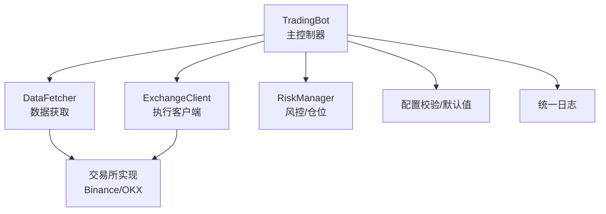
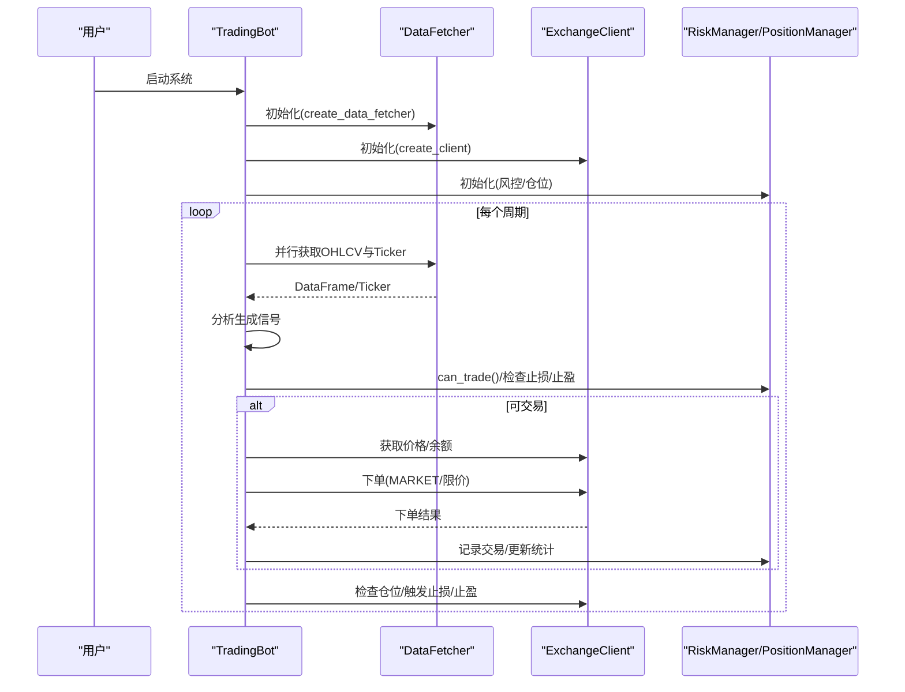
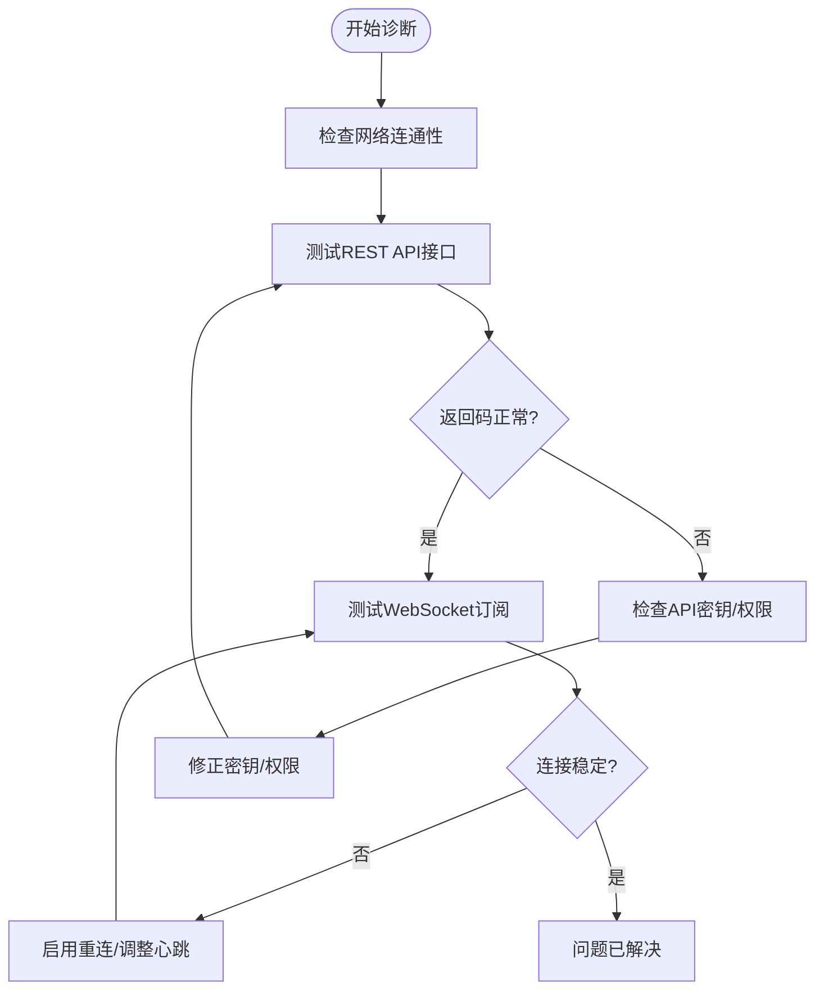
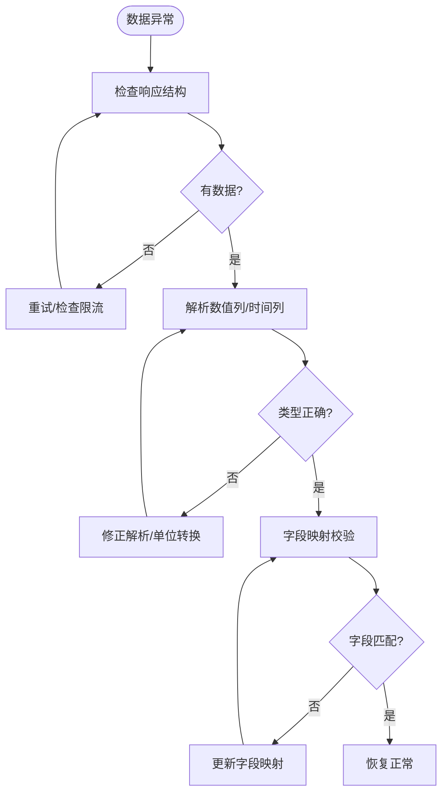
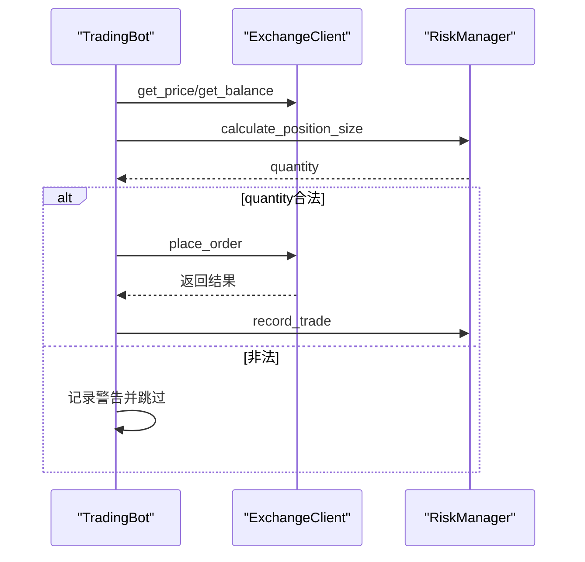
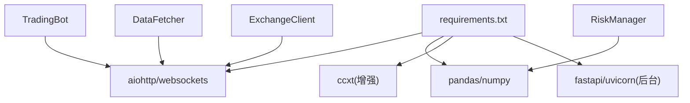

# 常见问题诊断

<cite>
**本文引用的文件**   
- [src/trading_bot.py](file://src/trading_bot.py)
- [src/data/data_fetcher.py](file://src/data/data_fetcher.py)
- [src/execution/exchange_client.py](file://src/execution/exchange_client.py)
- [src/utils/risk_manager.py](file://src/utils/risk_manager.py)
- [src/utils/config.py](file://src/utils/config.py)
- [src/utils/logger.py](file://src/utils/logger.py)
- [configs/config.json](file://configs/config.json)
- [scripts/ws_realtime_demo.py](file://scripts/ws_realtime_demo.py)
- [requirements.txt](file://requirements.txt)
</cite>

## 目录
1. [简介](#简介)
2. [项目结构](#项目结构)
3. [核心组件](#核心组件)
4. [架构总览](#架构总览)
5. [详细组件分析](#详细组件分析)
6. [依赖关系分析](#依赖关系分析)
7. [性能考量](#性能考量)
8. [故障排查指南](#故障排查指南)
9. [结论](#结论)
10. [附录](#附录)

## 简介
本指南面向量化交易系统的使用者与运维人员，聚焦于系统在实际运行中常见的问题类型与诊断方法，覆盖网络连接问题（API连接失败、WebSocket断开）、数据获取异常（数据缺失、时间戳错误、数据格式异常）、交易执行错误（订单提交失败、价格异常、仓位计算错误）以及系统资源问题（内存泄漏、CPU占用过高、磁盘空间不足）。文档提供症状识别、可能原因、快速诊断步骤与修复建议，并给出问题分类表与自检清单，帮助快速定位与解决问题。

## 项目结构
系统采用模块化分层设计：
- 控制层：主程序负责初始化、轮询、信号生成与执行
- 数据层：封装不同交易所的数据获取与WebSocket订阅
- 执行层：封装交易所API下单、撤单、账户与仓位查询
- 风控层：仓位管理、止损止盈、熔断与日级限额
- 工具层：日志、配置校验、风险与位置管理

图表来源
- [src/trading_bot.py](file://src/trading_bot.py#L27-L320)
- [src/data/data_fetcher.py](file://src/data/data_fetcher.py#L17-L71)
- [src/execution/exchange_client.py](file://src/execution/exchange_client.py#L20-L85)
- [src/utils/risk_manager.py](file://src/utils/risk_manager.py#L12-L52)
- [src/utils/config.py](file://src/utils/config.py#L15-L37)
- [src/utils/logger.py](file://src/utils/logger.py#L12-L28)

章节来源
- [src/trading_bot.py](file://src/trading_bot.py#L27-L320)
- [src/data/data_fetcher.py](file://src/data/data_fetcher.py#L17-L71)
- [src/execution/exchange_client.py](file://src/execution/exchange_client.py#L20-L85)
- [src/utils/risk_manager.py](file://src/utils/risk_manager.py#L12-L52)
- [src/utils/config.py](file://src/utils/config.py#L15-L37)
- [src/utils/logger.py](file://src/utils/logger.py#L12-L28)

## 核心组件
- 主控制器 TradingBot：负责初始化、数据拉取、策略分析、风控检查、下单与仓位管理、日志输出与统计
- 数据获取 DataFetcher：封装K线、行情、订单簿与WebSocket订阅；支持Binance与OKX
- 执行客户端 ExchangeClient：封装下单、撤单、账户与仓位查询；支持Binance与OKX
- 风控与仓位 RiskManager/PositionManager：计算仓位、检查止损止盈、熔断与日级限额
- 配置校验与日志：validate_config、deep_merge、统一日志输出

章节来源
- [src/trading_bot.py](file://src/trading_bot.py#L27-L320)
- [src/data/data_fetcher.py](file://src/data/data_fetcher.py#L17-L71)
- [src/execution/exchange_client.py](file://src/execution/exchange_client.py#L20-L85)
- [src/utils/risk_manager.py](file://src/utils/risk_manager.py#L12-L241)
- [src/utils/config.py](file://src/utils/config.py#L15-L49)
- [src/utils/logger.py](file://src/utils/logger.py#L12-L34)

## 架构总览
系统以 TradingBot 为中心，围绕“数据-策略-风控-执行”闭环运行。数据层与执行层均通过工厂函数按配置选择交易所实现，确保跨交易所一致性。

图表来源
- [src/trading_bot.py](file://src/trading_bot.py#L63-L296)
- [src/data/data_fetcher.py](file://src/data/data_fetcher.py#L85-L142)
- [src/execution/exchange_client.py](file://src/execution/exchange_client.py#L172-L336)
- [src/utils/risk_manager.py](file://src/utils/risk_manager.py#L175-L241)

## 详细组件分析

### 网络连接问题
- API连接失败
  - 症状：请求超时、返回错误码、无法获取账户/仓位/行情
  - 可能原因：网络不稳定、代理/防火墙阻断、API密钥无效、交易所维护
  - 快速诊断：使用独立脚本调用对应接口，确认超时与错误码；检查环境变量与配置
  - 修复建议：更换网络/代理、检查API权限、切换测试网或正式网、增加重试与降级
- WebSocket断开
  - 症状：实时行情/订单簿订阅中断、心跳超时、消息类型CLOSED/ERROR
  - 可能原因：网络抖动、服务器主动断开、订阅参数错误
  - 快速诊断：使用演示脚本独立订阅，观察断开频率与错误类型
  - 修复建议：启用自动重连、调整心跳间隔、检查订阅通道与交易对格式

图表来源
- [src/data/data_fetcher.py](file://src/data/data_fetcher.py#L188-L234)
- [src/execution/exchange_client.py](file://src/execution/exchange_client.py#L136-L171)
- [scripts/ws_realtime_demo.py](file://scripts/ws_realtime_demo.py#L30-L57)

章节来源
- [src/data/data_fetcher.py](file://src/data/data_fetcher.py#L188-L234)
- [src/execution/exchange_client.py](file://src/execution/exchange_client.py#L136-L171)
- [scripts/ws_realtime_demo.py](file://scripts/ws_realtime_demo.py#L30-L57)

### 数据获取异常
- 数据缺失
  - 症状：返回空DataFrame或字段缺失
  - 可能原因：接口未返回数据、限流/配额耗尽、参数错误
  - 快速诊断：打印返回结构、核对参数（symbol/timeframe/limit）
  - 修复建议：降低并发、增加重试、检查交易对是否正确
- 时间戳错误
  - 症状：时间列类型异常、时间倒序
  - 可能原因：单位不一致、返回顺序不符合预期
  - 快速诊断：检查转换逻辑与单位（毫秒/秒）
  - 修复建议：统一转换与排序
- 数据格式异常
  - 症状：数值列解析失败、bid/ask为空
  - 可能原因：字段名变更、返回结构变化
  - 快速诊断：打印原始JSON，对比字段映射
  - 修复建议：健壮性处理与默认值

图表来源
- [src/data/data_fetcher.py](file://src/data/data_fetcher.py#L85-L119)
- [src/data/data_fetcher.py](file://src/data/data_fetcher.py#L249-L278)
- [src/data/data_fetcher.py](file://src/data/data_fetcher.py#L121-L142)

章节来源
- [src/data/data_fetcher.py](file://src/data/data_fetcher.py#L85-L119)
- [src/data/data_fetcher.py](file://src/data/data_fetcher.py#L121-L142)
- [src/data/data_fetcher.py](file://src/data/data_fetcher.py#L249-L278)

### 交易执行错误
- 订单提交失败
  - 症状：下单返回orderId为空、错误码非0
  - 可能原因：签名失败、参数非法、精度不合规、杠杆设置失败
  - 快速诊断：查看下单返回与错误码；检查精度与step_size；确认杠杆设置
  - 修复建议：按交易所规则修正精度；先设置杠杆再下单
- 价格异常
  - 症状：下单价格为0或NaN
  - 可能原因：行情接口异常、缓存失效
  - 快速诊断：直接调用get_price确认
  - 修复建议：重试获取或降级处理
- 仓位计算错误
  - 症状：仓位为0或负数、浮点误差导致越界
  - 可能原因：余额为0、信号强度异常、价格为0
  - 快速诊断：检查calculate_position_size输入
  - 修复建议：加入边界保护与舍入处理

图表来源
- [src/trading_bot.py](file://src/trading_bot.py#L115-L204)
- [src/execution/exchange_client.py](file://src/execution/exchange_client.py#L226-L275)
- [src/utils/risk_manager.py](file://src/utils/risk_manager.py#L62-L71)

章节来源
- [src/trading_bot.py](file://src/trading_bot.py#L115-L204)
- [src/execution/exchange_client.py](file://src/execution/exchange_client.py#L226-L275)
- [src/utils/risk_manager.py](file://src/utils/risk_manager.py#L62-L71)

### 系统资源问题
- 内存泄漏
  - 症状：长时间运行后内存持续增长
  - 可能原因：WebSocket会话未关闭、回调持有引用、缓存未清理
  - 快速诊断：定期检查会话数量与对象计数；在stop/close中确保关闭
  - 修复建议：在异常分支也调用close；清理回调与任务
- CPU占用过高
  - 症状：轮询间隔过短、计算密集型策略、频繁I/O
  - 快速诊断：测量单次循环耗时；检查策略计算复杂度
  - 修复建议：延长loop_interval；优化策略；异步I/O
- 磁盘空间不足
  - 症状：日志/缓存写入失败
  - 快速诊断：监控磁盘使用率；清理旧日志
  - 修复建议：配置日志轮转；清理临时文件

章节来源
- [src/trading_bot.py](file://src/trading_bot.py#L284-L296)
- [src/data/data_fetcher.py](file://src/data/data_fetcher.py#L32-L38)
- [src/execution/exchange_client.py](file://src/execution/exchange_client.py#L37-L40)

## 依赖关系分析
- 第三方依赖集中在异步HTTP、数据处理与可选AI增强模块
- 与交易所交互通过aiohttp与WebSocket实现，具备超时与心跳机制
- 配置通过JSON与环境变量组合，支持深度合并与校验

图表来源
- [requirements.txt](file://requirements.txt#L1-L70)
- [src/trading_bot.py](file://src/trading_bot.py#L14-L22)
- [src/data/data_fetcher.py](file://src/data/data_fetcher.py#L14)
- [src/execution/exchange_client.py](file://src/execution/exchange_client.py#L16-L17)

章节来源
- [requirements.txt](file://requirements.txt#L1-L70)
- [src/trading_bot.py](file://src/trading_bot.py#L14-L22)
- [src/data/data_fetcher.py](file://src/data/data_fetcher.py#L14)
- [src/execution/exchange_client.py](file://src/execution/exchange_client.py#L16-L17)

## 性能考量
- 异步I/O：使用aiohttp与WebSocket提升吞吐，注意超时与心跳
- 数据处理：pandas/numpy高效但要注意内存峰值；必要时分批或降采样
- 策略计算：避免在主循环内做重型计算；可将热点逻辑异步化
- 资源回收：确保会话与WebSocket在异常与退出时正确关闭

## 故障排查指南

### 问题分类与优先级
- 严重：API连接失败、WebSocket断开、下单完全失败
- 高：数据缺失/格式异常、价格异常、风控熔断
- 中：时间戳错误、精度不合规、CPU占用偏高
- 低：日志过多、磁盘空间告警

### 自检清单
- 配置与环境
  - 检查配置文件与环境变量是否正确
  - 校验交易所、交易对、时间周期、策略与风控参数
- 网络与API
  - 测试REST接口可用性与错误码
  - 测试WebSocket订阅稳定性
- 数据质量
  - 核对返回结构与字段映射
  - 检查时间列转换与排序
- 交易执行
  - 确认下单前的精度与step_size
  - 检查杠杆设置与账户余额
- 资源健康
  - 监控内存/CPU/磁盘使用
  - 确认会话与任务在退出时关闭

### 快速修复步骤
- API连接失败
  - 更换网络/代理；检查API密钥与权限；切换测试网/正式网；增加重试
- WebSocket断开
  - 启用自动重连；调整心跳；检查订阅通道与交易对格式
- 数据缺失/格式异常
  - 降低并发/增加重试；修正解析与单位；更新字段映射
- 下单失败
  - 按交易所规则修正精度；先设置杠杆再下单；捕获并记录错误
- 价格异常
  - 直接调用get_price确认；重试获取或降级
- 仓位计算错误
  - 边界保护与舍入；检查输入参数合法性
- 资源问题
  - 退出时关闭会话与任务；延长轮询间隔；优化策略；配置日志轮转

章节来源
- [src/utils/config.py](file://src/utils/config.py#L15-L37)
- [configs/config.json](file://configs/config.json#L1-L28)
- [src/data/data_fetcher.py](file://src/data/data_fetcher.py#L188-L234)
- [src/execution/exchange_client.py](file://src/execution/exchange_client.py#L226-L275)
- [src/trading_bot.py](file://src/trading_bot.py#L284-L296)

## 结论
通过明确的问题分类、严格的自检清单与快速修复步骤，结合系统内置的日志与风控机制，可显著提升量化交易系统的稳定性与可维护性。建议在生产环境中开启日志轮转、配置熔断与限额，并对关键路径进行压力测试与监控告警。

## 附录

### 常用诊断命令与入口
- WebSocket演示：scripts/ws_realtime_demo.py
- 主程序入口：src/trading_bot.py
- 配置文件：configs/config.json
- 依赖清单：requirements.txt

章节来源
- [scripts/ws_realtime_demo.py](file://scripts/ws_realtime_demo.py#L30-L57)
- [src/trading_bot.py](file://src/trading_bot.py#L323-L346)
- [configs/config.json](file://configs/config.json#L1-L28)
- [requirements.txt](file://requirements.txt#L1-L70)