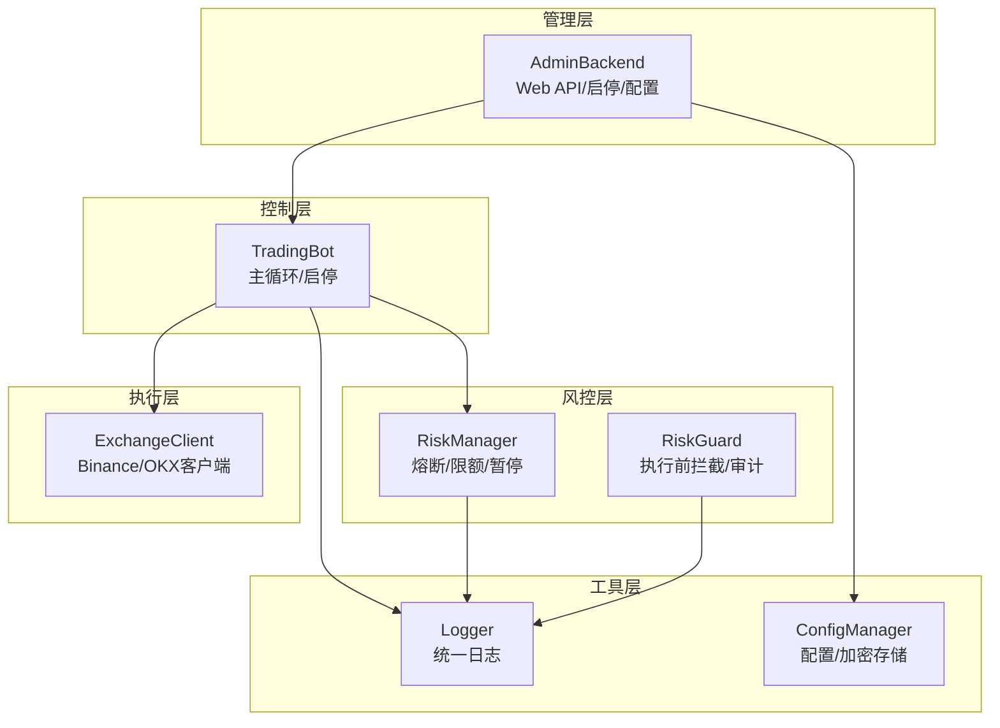
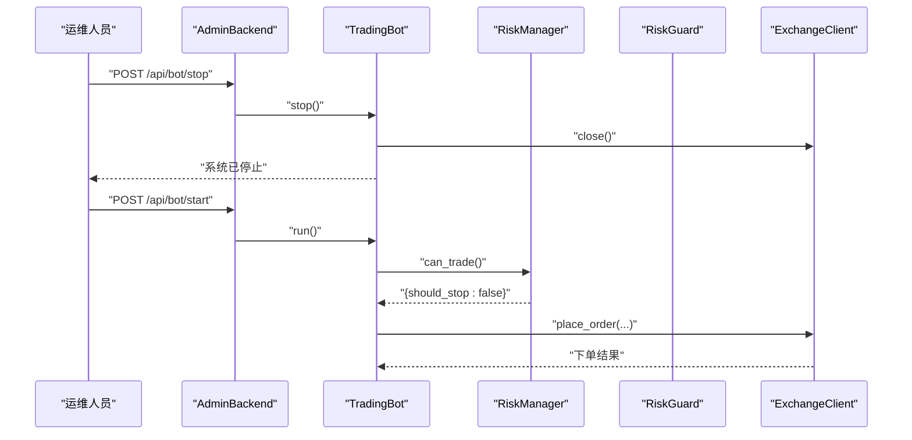
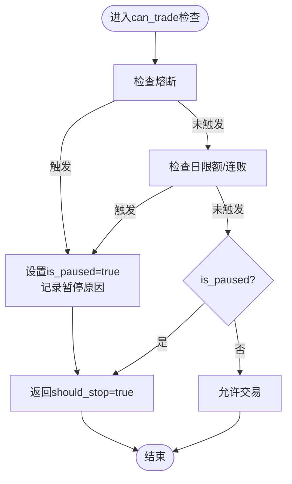
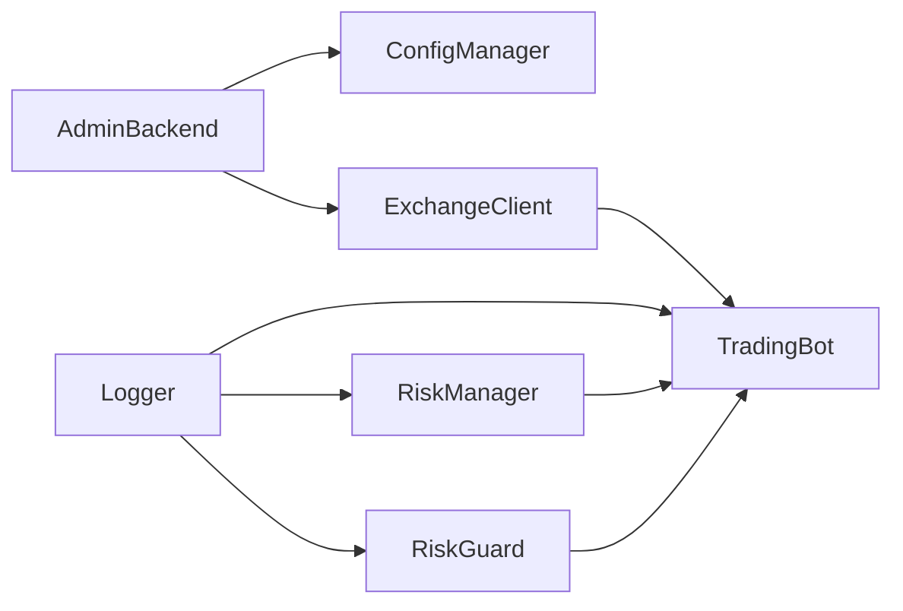

# 应急处理和恢复

<cite>
**本文引用的文件**
- [src/trading_bot.py](file://src/trading_bot.py)
- [src/utils/risk_manager.py](file://src/utils/risk_manager.py)
- [src/aetherlife/guard/risk_guard.py](file://src/aetherlife/guard/risk_guard.py)
- [src/execution/exchange_client.py](file://src/execution/exchange_client.py)
- [src/utils/logger.py](file://src/utils/logger.py)
- [src/utils/config_manager.py](file://src/utils/config_manager.py)
- [src/ui/admin_backend.py](file://src/ui/admin_backend.py)
- [configs/config.json](file://configs/config.json)
- [docs/ADMIN_GUIDE.md](file://docs/ADMIN_GUIDE.md)
- [requirements.txt](file://requirements.txt)
</cite>

## 目录
1. [简介](#简介)
2. [项目结构](#项目结构)
3. [核心组件](#核心组件)
4. [架构总览](#架构总览)
5. [详细组件分析](#详细组件分析)
6. [依赖分析](#依赖分析)
7. [性能考虑](#性能考虑)
8. [故障排查指南](#故障排查指南)
9. [结论](#结论)
10. [附录](#附录)

## 简介
本指南面向量化交易系统的应急处理与恢复，结合代码库中的风控、熔断、审计与后台管理能力，提供一套可操作的应急响应流程、熔断触发与恢复策略、数据备份与恢复方案、业务连续性保障措施，以及演练与事后分析方法。目标是帮助团队在系统异常、市场剧烈波动或外部故障时，快速、有序地采取行动，最大限度降低风险与损失。

## 项目结构
系统采用模块化分层设计：
- 控制层：主循环与生命周期管理（启动/停止）
- 风控层：熔断、限额、止损止盈、暂停/恢复
- 执行层：交易所API封装与下单逻辑
- 管理层：后台Web服务，提供配置、测试、启停控制
- 工具层：日志、配置管理、审计

图表来源
- [src/trading_bot.py](file://src/trading_bot.py#L27-L346)
- [src/utils/risk_manager.py](file://src/utils/risk_manager.py#L12-L388)
- [src/aetherlife/guard/risk_guard.py](file://src/aetherlife/guard/risk_guard.py#L23-L84)
- [src/execution/exchange_client.py](file://src/execution/exchange_client.py#L20-L432)
- [src/ui/admin_backend.py](file://src/ui/admin_backend.py#L20-L447)
- [src/utils/logger.py](file://src/utils/logger.py#L12-L34)
- [src/utils/config_manager.py](file://src/utils/config_manager.py#L14-L212)

章节来源
- [src/trading_bot.py](file://src/trading_bot.py#L27-L346)
- [src/utils/risk_manager.py](file://src/utils/risk_manager.py#L12-L388)
- [src/aetherlife/guard/risk_guard.py](file://src/aetherlife/guard/risk_guard.py#L23-L84)
- [src/execution/exchange_client.py](file://src/execution/exchange_client.py#L20-L432)
- [src/ui/admin_backend.py](file://src/ui/admin_backend.py#L20-L447)
- [src/utils/logger.py](file://src/utils/logger.py#L12-L34)
- [src/utils/config_manager.py](file://src/utils/config_manager.py#L14-L212)

## 核心组件
- TradingBot：主循环、信号生成、执行、风控检查、仓位管理与统计
- RiskManager：熔断、单日限额、连败限制、暂停/恢复、统计重置
- RiskGuard：执行前拦截、暂停标记、人工确认（HITL）、审计
- ExchangeClient：交易所API封装、下单、账户/仓位查询、超时控制
- AdminBackend：Web API，提供启停、状态查询、配置管理、连接测试
- Logger：统一日志输出，便于应急排查
- ConfigManager：配置文件与敏感信息加密存储、导出、重置

章节来源
- [src/trading_bot.py](file://src/trading_bot.py#L27-L346)
- [src/utils/risk_manager.py](file://src/utils/risk_manager.py#L12-L388)
- [src/aetherlife/guard/risk_guard.py](file://src/aetherlife/guard/risk_guard.py#L23-L84)
- [src/execution/exchange_client.py](file://src/execution/exchange_client.py#L20-L432)
- [src/ui/admin_backend.py](file://src/ui/admin_backend.py#L20-L447)
- [src/utils/logger.py](file://src/utils/logger.py#L12-L34)
- [src/utils/config_manager.py](file://src/utils/config_manager.py#L14-L212)

## 架构总览
应急处理贯穿于系统各层：
- 熔断与暂停：RiskManager在主循环前检查，触发后阻断交易；RiskGuard可进一步拦截并支持人工确认
- 执行保护：ExchangeClient设置请求超时，避免长时间挂起；下单前由风控层放行
- 管理与可观测：AdminBackend提供启停与状态查询；Logger输出关键事件；ConfigManager保障配置安全与可恢复
- 审计与日志：RiskGuard支持审计回调与文件落盘，便于事后分析

图表来源
- [src/ui/admin_backend.py](file://src/ui/admin_backend.py#L323-L377)
- [src/trading_bot.py](file://src/trading_bot.py#L284-L297)
- [src/utils/risk_manager.py](file://src/utils/risk_manager.py#L175-L194)
- [src/execution/exchange_client.py](file://src/execution/exchange_client.py#L37-L40)

## 详细组件分析

### 熔断机制与恢复流程
- 触发条件
  - 日内累计盈亏跌破熔断阈值，RiskManager记录暂停并写入冷却时间
  - 冷却期内再次检查熔断时，直接返回暂停状态
  - RiskGuard在执行前检查日累计盈亏，同样可触发熔断拦截
- 恢复流程
  - 冷却期过后，RiskManager重置暂停状态
  - 通过后台启停接口恢复运行
  - 建议在恢复前检查账户与市场状况，逐步恢复交易

图表来源
- [src/utils/risk_manager.py](file://src/utils/risk_manager.py#L129-L194)
- [src/aetherlife/guard/risk_guard.py](file://src/aetherlife/guard/risk_guard.py#L48-L68)

章节来源
- [src/utils/risk_manager.py](file://src/utils/risk_manager.py#L129-L194)
- [src/aetherlife/guard/risk_guard.py](file://src/aetherlife/guard/risk_guard.py#L48-L68)

### 紧急停止与手动干预
- 紧急停止
  - 通过后台管理接口停止TradingBot，释放会话并输出统计
  - 主循环捕获异常后短暂休眠，避免高频重试
- 手动干预
  - 通过后台启停接口控制运行状态
  - 通过RiskGuard设置暂停标记，强制拦截执行
  - 通过配置管理导出/重置配置，回退到安全状态

章节来源
- [src/trading_bot.py](file://src/trading_bot.py#L284-L297)
- [src/ui/admin_backend.py](file://src/ui/admin_backend.py#L323-L377)
- [src/aetherlife/guard/risk_guard.py](file://src/aetherlife/guard/risk_guard.py#L44-L46)
- [src/utils/config_manager.py](file://src/utils/config_manager.py#L117-L144)

### 风控阈值与保护措施
- 风控阈值
  - 最大单日亏损、最大单笔亏损、最大连败次数、单日最大交易笔数
  - 止损/止盈比例、跟踪止损
- 保护措施
  - 仓位计算受最大仓位比例与最小/最大仓位约束
  - 下单前由风控层放行，执行前由RiskGuard二次拦截
  - ExchangeClient设置请求超时，避免长时间挂起

章节来源
- [src/utils/risk_manager.py](file://src/utils/risk_manager.py#L15-L51)
- [src/utils/risk_manager.py](file://src/utils/risk_manager.py#L62-L127)
- [src/trading_bot.py](file://src/trading_bot.py#L115-L205)
- [src/execution/exchange_client.py](file://src/execution/exchange_client.py#L16-L17)

### 审计与日志
- 审计
  - RiskGuard支持将事件写入日志、文件与回调，便于事后分析
- 日志
  - 统一日志格式，包含时间、级别、名称与消息
  - 主循环异常时记录堆栈，辅助定位问题

章节来源
- [src/aetherlife/guard/risk_guard.py](file://src/aetherlife/guard/risk_guard.py#L70-L84)
- [src/utils/logger.py](file://src/utils/logger.py#L12-L34)
- [src/trading_bot.py](file://src/trading_bot.py#L280-L282)

### 配置与安全
- 配置管理
  - 普通配置与敏感信息分离存储，敏感信息加密
  - 支持导出配置（可选包含敏感信息）、重置为默认配置
- 安全性
  - 加密密钥文件权限严格控制
  - 后台管理提供连接测试与API密钥格式验证

章节来源
- [src/utils/config_manager.py](file://src/utils/config_manager.py#L48-L116)
- [src/utils/config_manager.py](file://src/utils/config_manager.py#L181-L194)
- [src/ui/admin_backend.py](file://src/ui/admin_backend.py#L159-L244)
- [docs/ADMIN_GUIDE.md](file://docs/ADMIN_GUIDE.md#L161-L182)

## 依赖分析
- 外部依赖与监控
  - 后台管理升级依赖FastAPI/UVicorn
  - 监控与日志依赖Prometheus/Structlog
  - Kafka/ClickHouse/Redis等用于数据流与缓存
- 组件耦合
  - TradingBot依赖RiskManager与ExchangeClient
  - AdminBackend依赖ConfigManager与ExchangeClient
  - RiskGuard与日志/审计模块解耦

图表来源
- [src/trading_bot.py](file://src/trading_bot.py#L27-L346)
- [src/utils/risk_manager.py](file://src/utils/risk_manager.py#L12-L388)
- [src/aetherlife/guard/risk_guard.py](file://src/aetherlife/guard/risk_guard.py#L23-L84)
- [src/execution/exchange_client.py](file://src/execution/exchange_client.py#L20-L432)
- [src/ui/admin_backend.py](file://src/ui/admin_backend.py#L20-L447)
- [src/utils/logger.py](file://src/utils/logger.py#L12-L34)
- [src/utils/config_manager.py](file://src/utils/config_manager.py#L14-L212)

章节来源
- [requirements.txt](file://requirements.txt#L64-L81)
- [src/trading_bot.py](file://src/trading_bot.py#L27-L346)
- [src/ui/admin_backend.py](file://src/ui/admin_backend.py#L20-L447)

## 性能考虑
- 异步I/O与超时
  - ExchangeClient设置请求超时，避免阻塞主循环
- 主循环节拍
  - 可配置循环间隔，平衡响应速度与资源占用
- 风控检查前置
  - 在下单前进行风控检查，减少无效请求与潜在损失

章节来源
- [src/execution/exchange_client.py](file://src/execution/exchange_client.py#L16-L17)
- [src/trading_bot.py](file://src/trading_bot.py#L261-L279)

## 故障排查指南
- 常见问题定位
  - 启动失败：检查配置完整性、API密钥有效性、资金充足性与日志异常
  - 连接失败：核对交易所维护状态、测试网/主网选择、网络连通性
  - 配置保存失败：检查磁盘空间、文件权限、配置格式
- 快速处置
  - 通过后台停止系统，释放会话
  - 导出配置备份，必要时重置为默认配置
  - 检查日志定位异常，修复后重启

章节来源
- [docs/ADMIN_GUIDE.md](file://docs/ADMIN_GUIDE.md#L255-L292)
- [src/ui/admin_backend.py](file://src/ui/admin_backend.py#L159-L244)
- [src/utils/config_manager.py](file://src/utils/config_manager.py#L181-L194)
- [src/trading_bot.py](file://src/trading_bot.py#L280-L282)

## 结论
本系统具备完善的风控与熔断能力，配合后台管理、审计与日志，能够支撑应急响应与恢复。建议在生产环境中明确应急角色分工、建立演练与事后分析流程，持续优化阈值与恢复策略，确保业务连续性与风险可控。

## 附录

### 应急响应流程（摘要）
- 发现异常
  - 观察日志与监控，判断是否触发风控/熔断
- 紧急停止
  - 通过后台接口停止系统，释放会话
- 人工确认
  - 如启用RiskGuard的人工确认，等待审批后再放行
- 恢复与验证
  - 检查账户与市场状态，逐步恢复交易
  - 导出配置备份，必要时回滚

章节来源
- [src/ui/admin_backend.py](file://src/ui/admin_backend.py#L323-L377)
- [src/aetherlife/guard/risk_guard.py](file://src/aetherlife/guard/risk_guard.py#L44-L68)
- [src/utils/config_manager.py](file://src/utils/config_manager.py#L181-L194)

### 熔断阈值与冷却策略（参考）
- 风控参数（来自配置与风控模块）
  - 最大单日亏损、最大单笔亏损、最大连败次数、单日最大交易笔数
  - 熔断阈值与冷却时间
- 建议
  - 根据账户规模与波动率设定合理阈值
  - 冷却期结束后进行压力测试再恢复

章节来源
- [configs/config.json](file://configs/config.json#L15-L20)
- [src/utils/risk_manager.py](file://src/utils/risk_manager.py#L15-L51)
- [src/utils/risk_manager.py](file://src/utils/risk_manager.py#L129-L153)

### 数据备份与恢复方案（建议）
- 配置备份
  - 使用后台“导出配置”功能或直接复制配置文件
  - 加密敏感信息由配置管理器处理
- 灾难恢复
  - 重置为默认配置以快速恢复
  - 通过导出的配置文件恢复参数

章节来源
- [src/utils/config_manager.py](file://src/utils/config_manager.py#L48-L116)
- [src/utils/config_manager.py](file://src/utils/config_manager.py#L181-L194)
- [src/ui/admin_backend.py](file://src/ui/admin_backend.py#L114-L135)

### 业务连续性保障
- 备用系统切换
  - 通过后台启停接口在不同实例间切换
- 交易暂停与重启
  - 熔断/暂停状态下禁止下单，恢复后逐步重启
- 监控与告警
  - 建议接入Prometheus/Structlog，实现可视化与告警

章节来源
- [src/ui/admin_backend.py](file://src/ui/admin_backend.py#L323-L377)
- [src/utils/risk_manager.py](file://src/utils/risk_manager.py#L175-L194)
- [requirements.txt](file://requirements.txt#L78-L81)

### 模拟演练方法与频率
- 演练内容
  - 熔断触发与恢复、紧急停止与重启、配置回滚
- 频率建议
  - 至少每季度进行一次全流程演练
  - 在重大市场波动前后增加专项演练

章节来源
- [docs/ADMIN_GUIDE.md](file://docs/ADMIN_GUIDE.md#L224-L247)